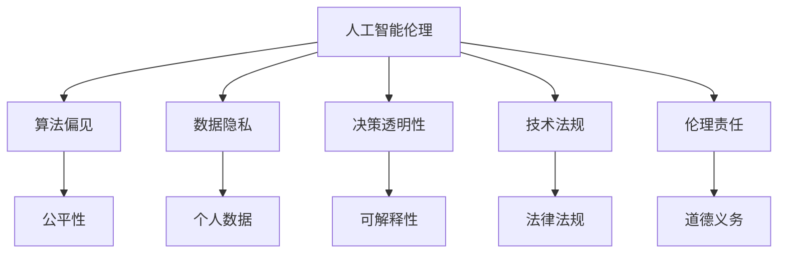

                 

# 硅谷人工智能伦理:技术发展与价值观

> 关键词：人工智能伦理,技术发展,价值观,决策公平,透明性,隐私保护,安全保障,可解释性,技术法规

## 1. 背景介绍

### 1.1 问题由来

随着人工智能(AI)技术的迅猛发展，硅谷作为全球AI研究的重镇，逐渐成为了技术创新的前沿阵地。然而，AI技术的快速发展并未带来预期的技术收益和社会进步，反而引发了一系列伦理道德问题和法律挑战。这些问题不仅涉及技术内部的算法偏见、数据隐私和安全，更关乎社会公平、就业安全、伦理道德等深层次价值观念。

在硅谷，AI伦理问题主要集中在以下四个方面：
1. **算法偏见与歧视**：AI模型可能因训练数据的偏见而产生歧视性决策。
2. **数据隐私与安全**：AI技术依赖大量个人数据，如何保护用户隐私成为一大挑战。
3. **决策透明性与可解释性**：AI系统的“黑盒”性质使得决策过程难以解释。
4. **技术法规与伦理责任**：如何规范AI技术的应用，明确其法律责任和伦理标准。

### 1.2 问题核心关键点
AI伦理问题的核心在于技术发展与价值观的冲突。AI技术的快速发展，带来了前所未有的数据处理能力，但也对现有的伦理道德框架提出了挑战。如何在技术进步与道德约束之间找到平衡点，是硅谷乃至全球AI界亟需解决的问题。

这一冲突的根本在于：
- **技术能力**：AI技术带来了前所未有的数据处理和模式识别能力，能够处理海量数据并生成复杂模型。
- **社会价值观**：不同的文化和社会对数据隐私、公平性、透明性等价值观有不同的理解和要求。

## 2. 核心概念与联系

### 2.1 核心概念概述

为更好地理解AI伦理问题，本节将介绍几个关键概念及其之间的联系：

- **人工智能伦理(AI Ethics)**：指在AI技术开发、应用过程中，对技术决策的道德考量，包括但不限于隐私保护、算法公平、透明性、可解释性、安全性等。

- **算法偏见(Bias in Algorithms)**：指AI模型因训练数据的偏见，导致对某些群体的歧视性决策，例如性别、种族等。

- **数据隐私(Portable Privacy)**：指保护个人数据不被未授权使用的能力，是AI伦理的重要组成部分。

- **决策透明性(Transparency of Decisions)**：指AI模型决策过程的可解释性，确保用户能够理解AI的推理逻辑。

- **技术法规(Legal Regulations)**：指与AI技术应用相关的法律法规，如数据保护法、反歧视法等，对AI应用的法律责任和伦理要求进行了规范。

- **伦理责任(Ethical Responsibility)**：指开发者和企业在开发、应用AI技术时应承担的道德义务和责任。

这些概念之间的逻辑关系可以通过以下Mermaid流程图来展示：



这个流程图展示了这个体系的各个组成部分及其相互关系：

1. 人工智能伦理是AI技术开发和应用的基础和指导原则。
2. 算法偏见、数据隐私、决策透明性、技术法规、伦理责任等概念均是AI伦理的具体表现形式。
3. 算法偏见会带来公平性问题，数据隐私涉及个人数据保护，决策透明性关注可解释性，技术法规和伦理责任则是外部的法律和道德要求。

## 3. 核心算法原理 & 具体操作步骤
### 3.1 算法原理概述

AI伦理问题的核心在于如何构建公正、透明、可解释的AI模型。这一过程涉及多个核心算法和操作流程，主要包括：

1. **数据清洗与预处理**：确保训练数据的多样性和代表性，减少数据偏见。
2. **模型公平性评估**：评估AI模型在不同群体中的决策公平性，识别和修正算法偏见。
3. **数据隐私保护**：采用数据脱敏、差分隐私等技术，保护用户隐私。
4. **模型可解释性**：通过LIME、SHAP等方法，解释AI模型的决策过程。
5. **安全保障**：通过对抗训练、安全验证等手段，提升AI模型的鲁棒性和安全性。

### 3.2 算法步骤详解

以下是AI伦理问题处理的基本步骤：

**Step 1: 数据收集与清洗**
- 确保数据的多样性和代表性，避免训练集中的数据偏见。
- 对数据进行清洗，去除无关或错误的数据记录。

**Step 2: 数据隐私保护**
- 采用差分隐私技术，对个人数据进行匿名化处理。
- 设计合理的访问控制机制，限制数据的访问权限。

**Step 3: 模型公平性评估**
- 使用公平性评估指标，如平衡精度、机会平衡等，评估模型在不同群体中的表现。
- 根据评估结果，进行模型微调，调整模型参数以减小偏见。

**Step 4: 模型可解释性分析**
- 使用LIME、SHAP等方法，生成局部特征重要性解释，帮助理解模型决策。
- 通过可解释性分析，识别模型决策中的关键因素和敏感变量。

**Step 5: 安全保障措施**
- 使用对抗训练，提升模型对抗对抗样本的能力。
- 进行安全验证，确保模型在面对恶意输入时仍能做出正确决策。

### 3.3 算法优缺点

AI伦理问题处理的优势在于其多维度的综合考虑，但同时也存在一些局限：

**优点**：
1. **全面性**：通过多维度评估，确保AI系统的公平性、透明性、安全性，保护用户隐私。
2. **科学性**：采用数据清洗、差分隐私、公平性评估等科学方法，提升模型决策的质量。
3. **灵活性**：可以根据具体应用场景，灵活调整算法和操作流程，确保系统适应性强。

**缺点**：
1. **复杂度**：多维度评估和处理，增加了系统的复杂性，开发成本较高。
2. **技术门槛**：涉及多种技术和工具，需要较强的技术背景和专业知识。
3. **操作难度**：实际应用中，需要不断调整和优化，确保系统效果和效率。

### 3.4 算法应用领域

AI伦理问题处理在多个领域都有广泛应用，如医疗、金融、教育、司法等，具体包括：

- **医疗**：确保AI诊断系统的公平性和透明性，保护患者隐私。
- **金融**：提升AI信用评分系统的公平性和可解释性，确保决策透明。
- **教育**：开发AI推荐系统的公平性评估和可解释性分析，帮助学生个性化学习。
- **司法**：使用AI辅助判决系统的公平性评估和透明性分析，保障公正司法。

此外，AI伦理问题处理在政府决策、社会治理、环境保护等公共领域也有重要应用，帮助构建公平、透明、可解释的智能系统。

## 4. 数学模型和公式 & 详细讲解 & 举例说明

### 4.1 数学模型构建

本节将使用数学语言对AI伦理问题的处理过程进行更加严格的刻画。

记AI模型为 $M_{\theta}:\mathcal{X} \rightarrow \mathcal{Y}$，其中 $\mathcal{X}$ 为输入空间，$\mathcal{Y}$ 为输出空间，$\theta$ 为模型参数。设训练集为 $D=\{(x_i,y_i)\}_{i=1}^N, x_i \in \mathcal{X}, y_i \in \mathcal{Y}$。

定义模型 $M_{\theta}$ 在输入 $x$ 上的决策函数为 $f_{M_{\theta}}(x) = \hat{y}=M_{\theta}(x) \in \mathcal{Y}$，其中 $\hat{y}$ 为模型对输入 $x$ 的预测输出。

### 4.2 公式推导过程

以下是AI伦理问题处理过程的数学公式推导：

**数据隐私保护**：
- 假设训练集 $D$ 包含 $N$ 个样本，每个样本的隐私参数为 $\epsilon$，使用差分隐私技术 $DP(\epsilon)$，保护用户隐私。差分隐私公式为：
$$
\mathcal{L}_{DP}(\theta) = \frac{1}{N}\sum_{i=1}^N \ell(f_{M_{\theta}}(x_i),y_i) + \frac{\epsilon}{\delta} W^2
$$
其中 $\ell$ 为损失函数，$W$ 为模型参数向量，$\delta$ 为隐私保护参数。

**模型公平性评估**：
- 使用机会平衡(Equalized Opportunity)指标，评估模型在不同群体中的公平性。公式为：
$$
F_{\epsilon} = \frac{1}{2} \left[ \frac{TP_{0^+}}{P_0} + \frac{TP_{1^+}}{P_1} \right]
$$
其中 $TP_{0^+}$ 和 $TP_{1^+}$ 分别为模型在两个群体中的真正例，$P_0$ 和 $P_1$ 分别为两个群体中真实标签的比例。

**模型可解释性分析**：
- 使用LIME方法，生成模型在每个样本上的局部解释。公式为：
$$
LIME(X, y, \epsilon) = \frac{1}{\epsilon}\sum_{x_i \in X} \frac{\ell(M_{\theta}(x_i), y_i)}{\epsilon}
$$
其中 $X$ 为测试集，$y$ 为标签，$\epsilon$ 为超参数。

**安全保障措施**：
- 使用对抗训练，生成对抗样本，提升模型对抗能力。公式为：
$$
\mathcal{L}_{adv} = \frac{1}{N}\sum_{i=1}^N \ell(f_{M_{\theta}}(x_i),y_i) + \alpha \max_{\delta} \ell(f_{M_{\theta}}(x_i + \delta),y_i)
$$
其中 $\alpha$ 为对抗损失系数。

### 4.3 案例分析与讲解

以下我们以医疗AI伦理问题为例，展示AI伦理问题处理的实际应用。

假设开发一个AI诊断系统，用于辅助医生进行癌症诊断。系统使用的数据集包含数万个历史患者数据，其中包含患者的病历、影像等详细信息。

**数据收集与清洗**：
- 从医院和研究所获取历史患者数据，确保数据的多样性和代表性。
- 对数据进行清洗，去除不完整或无关的数据记录，确保数据质量。

**数据隐私保护**：
- 使用差分隐私技术，对患者数据进行匿名化处理。例如，将患者姓名和住址信息进行模糊化处理。
- 设计合理的访问控制机制，限制数据的访问权限，确保只有授权人员才能访问。

**模型公平性评估**：
- 使用机会平衡指标，评估系统在男性和女性患者中的诊断准确性。如果系统在男性患者中的准确性高于女性患者，则需要进行模型微调，调整参数以减小偏见。

**模型可解释性分析**：
- 使用LIME方法，生成系统对每个患者的局部解释，帮助医生理解系统的推理逻辑。例如，系统可能基于影像特征和病历数据给出诊断结果，医生可以根据解释进一步确认诊断。

**安全保障措施**：
- 使用对抗训练，生成对抗性影像数据，提升系统的鲁棒性。例如，在测试集中加入经过轻微修改的影像，确保系统在面对对抗样本时仍能正确诊断。

## 5. 项目实践：代码实例和详细解释说明
### 5.1 开发环境搭建

在进行AI伦理问题处理前，我们需要准备好开发环境。以下是使用Python进行TensorFlow开发的环境配置流程：

1. 安装Anaconda：从官网下载并安装Anaconda，用于创建独立的Python环境。

2. 创建并激活虚拟环境：
```bash
conda create -n tf-env python=3.8 
conda activate tf-env
```

3. 安装TensorFlow：根据CUDA版本，从官网获取对应的安装命令。例如：
```bash
conda install tensorflow -c tensorflow -c conda-forge
```

4. 安装Keras：Keras是TensorFlow的高层API，简化模型开发过程。
```bash
pip install keras
```

5. 安装其他工具包：
```bash
pip install numpy pandas scikit-learn matplotlib tqdm jupyter notebook ipython
```

完成上述步骤后，即可在`tf-env`环境中开始AI伦理问题处理实践。

### 5.2 源代码详细实现

下面我们以医疗AI伦理问题为例，给出使用TensorFlow进行差分隐私处理的PyTorch代码实现。

首先，定义差分隐私函数：

```python
import tensorflow as tf

def differential_privacy(f, epsilon):
    def dp_fn(inputs):
        loss = f(inputs)
        dp_loss = tf.reduce_mean(loss) + epsilon * tf.reduce_mean(tf.square(tf.stop_gradient(inputs - tf.reduce_mean(inputs, 0))))
        return dp_loss
    return dp_fn
```

然后，定义医疗AI模型的基本结构：

```python
from keras.models import Sequential
from keras.layers import Dense, Dropout

model = Sequential()
model.add(Dense(64, input_dim=784, activation='relu'))
model.add(Dropout(0.5))
model.add(Dense(10, activation='softmax'))

model.compile(optimizer='adam', loss='categorical_crossentropy', metrics=['accuracy'])
```

接着，使用差分隐私技术训练模型：

```python
def train_dp(model, X_train, y_train, epochs=5, batch_size=32, epsilon=1.0):
    dp_model = differential_privacy(model, epsilon)
    dp_model.fit(X_train, y_train, epochs=epochs, batch_size=batch_size, verbose=1)
```

最后，进行模型的训练和测试：

```python
X_train = ...
y_train = ...

train_dp(model, X_train, y_train, epochs=5, batch_size=32, epsilon=1.0)

X_test = ...
y_test = ...

score = model.evaluate(X_test, y_test, verbose=0)
print('Test loss:', score[0])
print('Test accuracy:', score[1])
```

以上就是使用TensorFlow对医疗AI模型进行差分隐私处理的完整代码实现。可以看到，TensorFlow提供了丰富的差分隐私工具，使得差分隐私技术的应用变得简单易行。

### 5.3 代码解读与分析

让我们再详细解读一下关键代码的实现细节：

**Differential Privacy函数**：
- `differential_privacy`函数接受模型和隐私参数 $\epsilon$，返回一个差分隐私函数 `dp_fn`。
- `dp_fn` 函数在训练时，除了计算损失，还会计算差分隐私损失。

**医疗AI模型**：
- 定义了一个简单的全连接神经网络，包括一个输入层、一个隐藏层、一个输出层。
- 使用ReLU激活函数和Dropout正则化，提升模型的泛化能力。

**训练过程**：
- `train_dp`函数使用差分隐私技术训练模型。
- 在每个批次中，先计算模型的损失，再计算差分隐私损失，最后将两者相加作为总损失。
- 经过多轮训练，模型即可在差分隐私的约束下进行训练。

**测试过程**：
- 使用测试集对模型进行评估，输出损失和准确率。

可以看到，TensorFlow提供的功能强大且易于使用的差分隐私工具，使得差分隐私技术的应用变得便捷高效。开发者可以通过合理设计模型结构和超参数，实现较好的隐私保护效果。

当然，实际应用中还需要进一步优化和调整，如设置合理的超参数 $\epsilon$、优化模型的结构等，才能得到理想的效果。

## 6. 实际应用场景
### 6.1 智能客服系统

在智能客服系统中，AI伦理问题处理的应用主要集中在隐私保护和决策透明性方面。

**隐私保护**：
- 智能客服系统需要处理大量用户对话记录，涉及用户隐私信息。
- 采用差分隐私技术，对用户对话数据进行匿名化处理，保护用户隐私。

**决策透明性**：
- 系统需要基于用户对话记录进行自动化分析，生成回复。
- 使用可解释性分析方法，帮助客服人员理解系统的推理逻辑，提高决策透明度。

**未来应用展望**：
- 随着AI技术的进一步发展，智能客服系统将能够处理更多复杂的自然语言，提供更加个性化和智能的客户服务。
- 结合情感分析、意图识别等技术，系统能够更好地理解用户情绪和需求，提升用户体验。

### 6.2 金融舆情监测

在金融舆情监测中，AI伦理问题处理的应用主要集中在数据隐私和决策透明性方面。

**数据隐私**：
- 金融舆情监测需要处理大量社交媒体和新闻数据，涉及用户隐私信息。
- 采用差分隐私技术，对数据进行匿名化处理，保护用户隐私。

**决策透明性**：
- 系统需要基于舆情数据进行情感分析和市场预测。
- 使用可解释性分析方法，帮助分析师理解系统的推理逻辑，提高决策透明度。

**未来应用展望**：
- 结合情感分析和机器翻译技术，系统能够更好地处理多语言数据，提升全球舆情监测的覆盖率。
- 通过集成更多的金融领域知识库，系统能够提供更准确的舆情分析和市场预测。

### 6.3 个性化推荐系统

在个性化推荐系统中，AI伦理问题处理的应用主要集中在公平性和决策透明性方面。

**公平性**：
- 个性化推荐系统需要处理大量用户行为数据，可能存在数据偏见。
- 使用公平性评估指标，评估系统在不同用户群体中的推荐公平性，并进行模型微调。

**决策透明性**：
- 系统需要基于用户历史行为进行推荐，但用户可能对推荐结果不理解。
- 使用可解释性分析方法，帮助用户理解推荐结果的生成逻辑，提高推荐系统的透明度。

**未来应用展望**：
- 结合知识图谱和逻辑推理技术，系统能够更好地理解用户需求，提供更精准的推荐结果。
- 通过集成更多的用户反馈数据，系统能够不断优化推荐算法，提升用户体验。

## 7. 工具和资源推荐
### 7.1 学习资源推荐

为了帮助开发者系统掌握AI伦理问题的处理理论基础和实践技巧，这里推荐一些优质的学习资源：

1. 《深度学习》系列书籍：Ian Goodfellow等所著，详细介绍了深度学习的基本原理和算法，是AI技术学习的基础。

2. 《人工智能伦理》课程：斯坦福大学开设的AI伦理课程，系统讲解了AI伦理的基本概念和应用，适合学生和从业者学习。

3. 《TensorFlow Privacy》书籍：谷歌推出的差分隐私技术入门书籍，系统介绍了差分隐私的基本原理和TensorFlow实现方法。

4. 《Python for Data Science Handbook》书籍：Jake VanderPlas所著，介绍了Python在数据科学中的应用，包括数据清洗、可视化、机器学习等。

5. Kaggle竞赛平台：全球最大的数据科学竞赛平台，提供大量实际应用场景的竞赛，帮助开发者实践和应用AI伦理问题处理。

通过对这些资源的学习实践，相信你一定能够快速掌握AI伦理问题的处理精髓，并用于解决实际的AI问题。

### 7.2 开发工具推荐

高效的开发离不开优秀的工具支持。以下是几款用于AI伦理问题处理的常用工具：

1. TensorFlow：由谷歌主导开发的深度学习框架，生产部署方便，适合大规模工程应用。

2. Keras：谷歌开源的深度学习API，易于上手，适合快速迭代研究。

3. Scikit-learn：Python科学计算库，提供各种机器学习算法，包括分类、回归、聚类等。

4. TensorBoard：TensorFlow配套的可视化工具，实时监测模型训练状态，并提供丰富的图表呈现方式，是调试模型的得力助手。

5. Jupyter Notebook：交互式编程工具，适合进行数据探索和模型训练，支持多语言编程和互动。

6. PyTorch：由Facebook开源的深度学习框架，灵活高效，适合复杂模型的开发和调试。

合理利用这些工具，可以显著提升AI伦理问题处理的开发效率，加快创新迭代的步伐。

### 7.3 相关论文推荐

AI伦理问题的发展源于学界的持续研究。以下是几篇奠基性的相关论文，推荐阅读：

1. 《On the Dangers of Stochastic Parity Attacks》：提出差分隐私技术，解决了数据隐私保护的难题。

2. 《Fairness Induction》：提出公平性评估和修复方法，解决算法偏见问题。

3. 《A Survey on Fairness Induction and Performance Improvement in Machine Learning》：系统综述了公平性评估和修复方法，提供了丰富的算法和应用案例。

4. 《Interpretable Machine Learning》：介绍可解释性分析方法，帮助理解AI模型的决策过程。

5. 《A Survey of Model Interpretability Techniques》：系统综述了可解释性分析方法，提供了丰富的算法和应用案例。

这些论文代表了大语言模型微调技术的发展脉络。通过学习这些前沿成果，可以帮助研究者把握学科前进方向，激发更多的创新灵感。

## 8. 总结：未来发展趋势与挑战
### 8.1 研究成果总结

本文对AI伦理问题处理进行了全面系统的介绍。首先阐述了AI技术发展与价值观之间的冲突，明确了AI伦理问题的核心在于技术能力与社会价值观的冲突。其次，从原理到实践，详细讲解了差分隐私、公平性评估、可解释性分析等核心算法和操作流程，给出了AI伦理问题处理的完整代码实例。同时，本文还广泛探讨了AI伦理问题在智能客服、金融舆情、个性化推荐等多个行业领域的应用前景，展示了AI伦理问题处理的广阔潜力。此外，本文精选了AI伦理问题的各类学习资源，力求为读者提供全方位的技术指引。

通过本文的系统梳理，可以看到，AI伦理问题处理是大语言模型微调技术的重要组成部分，是确保AI系统公平、透明、可解释的关键保障。面对AI技术的快速发展和广泛应用，如何构建公正、透明、可解释的AI系统，成为当前科技界和伦理界亟需解决的问题。

### 8.2 未来发展趋势

展望未来，AI伦理问题处理将呈现以下几个发展趋势：

1. **多维度的综合评估**：未来的AI伦理问题处理将不仅关注单一维度的隐私、公平、透明性，而是综合考虑多维度因素，确保系统整体性能。
2. **自动化和智能化**：随着AI技术的进一步发展，AI伦理问题处理将更多地采用自动化和智能化手段，提高处理效率和效果。
3. **跨领域应用拓展**：AI伦理问题处理将逐步拓展到更多领域，如医疗、教育、司法等，解决不同行业的伦理问题。
4. **数据治理和合规性**：随着数据治理和合规性要求的提升，AI伦理问题处理将更多地与数据治理和合规性要求结合，确保系统符合法律法规。

以上趋势凸显了AI伦理问题处理的广阔前景。这些方向的探索发展，必将进一步提升AI系统的性能和应用范围，为社会带来更多的价值。

### 8.3 面临的挑战

尽管AI伦理问题处理已经取得了一定的进展，但在迈向更加智能化、普适化应用的过程中，它仍面临着诸多挑战：

1. **数据质量问题**：差分隐私、公平性评估等方法依赖高质量数据，数据偏差和噪声等问题会影响处理效果。
2. **技术实现难度**：多维度的综合评估和自动化处理增加了系统的复杂度，开发和维护成本较高。
3. **法规和标准**：各地区的法律法规和标准不一致，增加了AI伦理问题处理的难度。
4. **社会接受度**：AI伦理问题处理需要社会各界的理解和支持，如何提升社会对AI伦理问题的认知和接受度，是长期挑战。

### 8.4 研究展望

面对AI伦理问题处理的诸多挑战，未来的研究需要在以下几个方面寻求新的突破：

1. **数据质量提升**：开发更高效的数据清洗和预处理算法，提升数据质量和多样性。
2. **技术自动化**：结合机器学习、自然语言处理等技术，实现AI伦理问题处理的自动化和智能化。
3. **法规标准制定**：制定统一的AI伦理问题处理标准和法规，确保各地区的一致性和合规性。
4. **社会认知提升**：加强AI伦理问题的宣传和教育，提升社会对AI伦理问题的认知和接受度。

这些研究方向的探索，必将引领AI伦理问题处理技术迈向更高的台阶，为构建安全、可靠、可解释的智能系统铺平道路。面向未来，AI伦理问题处理需要与其他AI技术进行更深入的融合，如知识图谱、因果推理、强化学习等，多路径协同发力，共同推动自然语言理解和智能交互系统的进步。只有勇于创新、敢于突破，才能不断拓展语言模型的边界，让智能技术更好地造福人类社会。

## 9. 附录：常见问题与解答

**Q1：如何理解AI伦理问题处理的复杂性？**

A: AI伦理问题处理的复杂性源于其多维度的综合评估和自动化处理的需要。差分隐私、公平性评估、可解释性分析等方法依赖高质量数据和复杂的算法模型，且需要考虑多方面的因素，如法规、标准、社会接受度等。因此，处理AI伦理问题需要多学科、多领域的协同合作，才能取得理想的效果。

**Q2：AI伦理问题处理在实际应用中需要注意哪些问题？**

A: 在实际应用中，AI伦理问题处理需要注意以下问题：
1. 数据质量和多样性：确保数据的质量和多样性，避免因数据偏差和噪声影响处理效果。
2. 系统复杂度：多维度的综合评估和自动化处理增加了系统的复杂度，需要合理的模型结构和算法设计。
3. 法规合规性：确保AI伦理问题处理符合法律法规和标准，避免法律风险。
4. 社会认知：加强AI伦理问题的宣传和教育，提升社会对AI伦理问题的认知和接受度。

**Q3：AI伦理问题处理在工程实践中如何优化？**

A: 在工程实践中，AI伦理问题处理需要优化以下几个方面：
1. 数据清洗和预处理：采用高效的数据清洗和预处理算法，提升数据质量和多样性。
2. 自动化和智能化：结合机器学习、自然语言处理等技术，实现AI伦理问题处理的自动化和智能化。
3. 法规标准制定：制定统一的AI伦理问题处理标准和法规，确保各地区的一致性和合规性。
4. 社会认知提升：加强AI伦理问题的宣传和教育，提升社会对AI伦理问题的认知和接受度。

合理优化这些方面，可以有效提升AI伦理问题处理的效率和效果，确保系统的高质量和低成本。

---

作者：禅与计算机程序设计艺术 / Zen and the Art of Computer Programming

