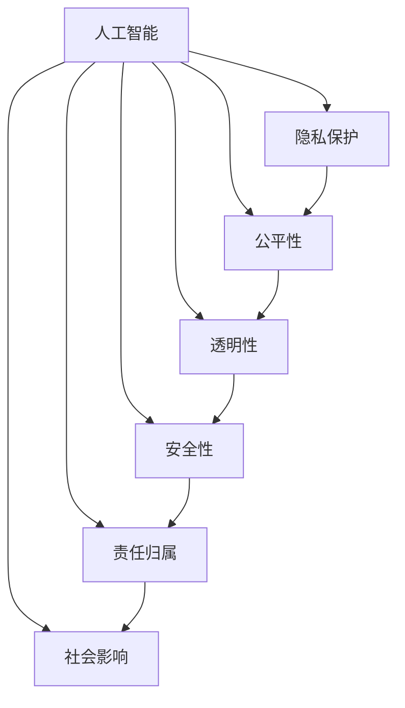

                 

# 硅谷人工智能伦理监管的难点

## 1. 背景介绍

### 1.1 问题由来
随着人工智能技术的迅猛发展，特别是深度学习在各个领域的广泛应用，硅谷成为了全球人工智能创新和应用的中心。然而，随之而来的伦理问题也日益凸显。如何平衡技术创新与伦理规范，成为了硅谷及全球科技界亟待解决的重要课题。

### 1.2 问题核心关键点
人工智能伦理监管的核心在于确保技术应用能够符合人类价值观和社会准则，避免技术滥用对社会造成负面影响。这包括但不限于：

- 隐私保护：如何防止个人隐私被滥用。
- 公平性：算法是否会造成歧视，特别是针对特定群体。
- 透明性：模型的决策过程是否透明，是否可以被理解和解释。
- 安全性：系统是否可靠，是否存在被攻击的风险。
- 责任归属：当技术出现问题时，责任应由谁承担。
- 社会影响：人工智能技术是否会对就业、收入分配等社会经济结构产生负面影响。

### 1.3 问题研究意义
研究硅谷人工智能伦理监管的难点，对于制定更合理的政策、规范和标准，引导人工智能技术健康发展，具有重要意义。

## 2. 核心概念与联系

### 2.1 核心概念概述

为更好地理解硅谷人工智能伦理监管，本节将介绍几个密切相关的核心概念：

- 人工智能(AI)：通过算法和计算能力，模拟人类智能的技术。
- 伦理(Ethics)：指在人工智能应用中，遵循的一系列道德规范和行为准则。
- 监管(Regulation)：政府或相关机构对人工智能技术进行规范和约束，确保其符合伦理标准。
- 隐私保护(Privacy Protection)：保护个人数据不受侵犯的技术和政策。
- 公平性(Fairness)：算法应对所有群体公平无偏。
- 透明性(Transparency)：算法决策过程可被解释和理解。
- 安全性(Security)：算法和系统安全可靠，不易被攻击。
- 责任归属(Accountability)：人工智能系统出现问题时，责任归属明确。
- 社会影响(Social Impact)：人工智能技术对社会经济、就业、教育等方面的影响。

这些核心概念之间的逻辑关系可以通过以下Mermaid流程图来展示：



这个流程图展示了人工智能应用中的伦理监管涉及的主要方面，以及这些方面之间的相互联系和影响。

## 3. 核心算法原理 & 具体操作步骤
### 3.1 算法原理概述

硅谷人工智能伦理监管的核心在于通过算法和技术手段，确保人工智能系统符合伦理规范。这涉及到以下几个关键算法原理：

1. **隐私保护算法**：如差分隐私(Differential Privacy)、同态加密(Homomorphic Encryption)等，确保数据隐私不被滥用。

2. **公平性算法**：如反偏见算法(Fairness-Aware Learning)、偏差检测和纠正算法等，确保算法对所有群体公平无偏。

3. **透明性算法**：如可解释性算法(Explainable AI, XAI)、决策树可视化等，使得算法的决策过程透明可解释。

4. **安全性算法**：如加密算法、对抗样本检测算法等，确保系统的安全性。

5. **责任归属算法**：如责任分配算法(Accountability Allocation)、责任追踪算法等，明确当系统出现问题时责任归属。

6. **社会影响算法**：如就业影响评估算法、收入分配模拟算法等，分析人工智能对社会经济结构的影响。

### 3.2 算法步骤详解

以下是硅谷人工智能伦理监管中常用的算法步骤：

**Step 1: 数据采集与处理**
- 收集人工智能应用的各类数据，包括训练数据、测试数据和用户数据。
- 对数据进行去标识化、匿名化处理，确保数据隐私保护。

**Step 2: 模型设计**
- 根据应用需求，选择合适的算法模型，如决策树、深度神经网络等。
- 在设计模型时，引入公平性、透明性、安全性等约束条件。

**Step 3: 训练与优化**
- 使用去标识化数据进行模型训练。
- 在训练过程中，应用隐私保护、公平性、透明性等算法，优化模型参数。
- 通过对抗样本检测等手段，确保模型安全性。

**Step 4: 模型评估与验证**
- 在验证集上评估模型的性能，如准确率、公平性、可解释性等指标。
- 分析模型对社会经济结构的影响。

**Step 5: 部署与监控**
- 将模型部署到实际应用场景中。
- 持续监控模型的运行状态，确保符合伦理规范。
- 定期更新模型，修复潜在的漏洞和偏见。

### 3.3 算法优缺点

硅谷人工智能伦理监管中的算法具有以下优点：
1. 技术先进：基于最新的算法和工具，能够有效应对复杂的伦理挑战。
2. 动态适应：能够实时监控和调整模型，确保符合最新的伦理规范。
3. 可解释性强：通过可解释性算法，使得模型决策过程透明可理解。
4. 安全性高：通过安全性算法，降低模型被攻击的风险。

同时，这些算法也存在一些局限性：
1. 成本高：开发和维护隐私保护、公平性、透明性等算法，需要大量的资源投入。
2. 复杂度高：算法设计复杂，需要跨学科的专家团队协作。
3. 执行难度大：实际操作中，算法的效果可能会受到数据质量、模型复杂性等因素影响。
4. 责任归属不明确：当模型出现问题时，责任归属仍可能存在争议。

尽管存在这些局限性，但就目前而言，硅谷在人工智能伦理监管方面的技术手段已经相对成熟，为全球范围内的人工智能伦理规范制定提供了参考。

### 3.4 算法应用领域

硅谷人工智能伦理监管技术已经在多个领域得到了应用，包括但不限于：

- 医疗保健：确保医疗数据隐私保护，防止算法歧视。
- 金融服务：保护客户隐私，确保公平信贷和投资决策。
- 司法系统：提高判决透明度，减少算法偏见。
- 教育领域：防止学生数据滥用，确保教育公平。
- 政府治理：提高政策透明度，确保政府行为符合伦理规范。

除了这些直接应用领域外，硅谷的人工智能伦理监管技术也在不断拓展到更多新兴领域，如自动驾驶、智能家居、智慧城市等，为人工智能技术的伦理规范提供强有力的保障。

## 4. 数学模型和公式 & 详细讲解
### 4.1 数学模型构建

在硅谷人工智能伦理监管中，数学模型通常包括隐私保护、公平性、透明性、安全性等多个方面的模型。

以差分隐私为例，其数学模型为：

$$
\mathcal{L}(P) = \epsilon \cdot \sum_{x \in \mathcal{X}} |P(x) - P'(x)| + \sum_{x \in \mathcal{X}} \log \frac{1}{\delta} 
$$

其中，$P$ 为原始数据分布，$P'$ 为扰动后的数据分布，$\epsilon$ 为隐私保护参数，$\delta$ 为失败概率。

### 4.2 公式推导过程

以下是差分隐私模型的详细推导过程：

1. 原始数据分布为 $P$，扰动后的数据分布为 $P'$。
2. 隐私保护的目标是使得 $P'$ 与 $P$ 尽可能相似，同时引入扰动，使得隐私泄露风险控制在 $\epsilon$ 范围内。
3. 引入隐私预算 $\epsilon$，计算 $P$ 与 $P'$ 的距离，即差异性损失。
4. 考虑失败概率 $\delta$，引入风险控制项，确保隐私泄露的概率不超过 $\delta$。

### 4.3 案例分析与讲解

以医疗数据隐私保护为例，假设某医院使用机器学习算法预测患者的疾病风险。医院收集了患者的病历、基因数据、医疗记录等敏感信息，如何保护这些数据不被滥用？

**Step 1: 数据采集与处理**
- 收集患者的病历、基因数据、医疗记录等敏感信息，进行去标识化处理。
- 使用差分隐私算法对数据进行扰动。

**Step 2: 模型设计**
- 使用机器学习算法，如决策树、随机森林等，预测患者的疾病风险。
- 在设计模型时，引入公平性、透明性、安全性等约束条件。

**Step 3: 训练与优化**
- 使用扰动后的数据进行模型训练。
- 在训练过程中，应用公平性、透明性、安全性等算法，优化模型参数。
- 通过对抗样本检测等手段，确保模型安全性。

**Step 4: 模型评估与验证**
- 在验证集上评估模型的性能，如准确率、公平性、可解释性等指标。
- 分析模型对社会经济结构的影响。

**Step 5: 部署与监控**
- 将模型部署到实际应用场景中。
- 持续监控模型的运行状态，确保符合伦理规范。
- 定期更新模型，修复潜在的漏洞和偏见。

## 5. 项目实践：代码实例和详细解释说明
### 5.1 开发环境搭建

在进行人工智能伦理监管项目开发前，我们需要准备好开发环境。以下是使用Python进行PyTorch开发的环境配置流程：

1. 安装Anaconda：从官网下载并安装Anaconda，用于创建独立的Python环境。

2. 创建并激活虚拟环境：
```bash
conda create -n pytorch-env python=3.8 
conda activate pytorch-env
```

3. 安装PyTorch：根据CUDA版本，从官网获取对应的安装命令。例如：
```bash
conda install pytorch torchvision torchaudio cudatoolkit=11.1 -c pytorch -c conda-forge
```

4. 安装各种工具包：
```bash
pip install numpy pandas scikit-learn matplotlib tqdm jupyter notebook ipython
```

完成上述步骤后，即可在`pytorch-env`环境中开始项目开发。

### 5.2 源代码详细实现

这里我们以医疗数据隐私保护为例，给出使用PyTorch对差分隐私算法进行代码实现。

```python
import torch
import torch.nn as nn
import torch.optim as optim
from torch.utils.data import DataLoader, Dataset
from torchvision.datasets import MNIST
from torchvision.transforms import ToTensor
from sklearn.preprocessing import StandardScaler
from sklearn.model_selection import train_test_split
from sklearn.metrics import accuracy_score
from differential_privacy import DPSSGD

class MNISTDataset(Dataset):
    def __init__(self, data, transform=None):
        self.data = data
        self.transform = transform

    def __len__(self):
        return len(self.data)

    def __getitem__(self, idx):
        x, y = self.data[idx]
        x = x.reshape(1, 28 * 28)
        x = torch.from_numpy(x).float()
        y = torch.from_numpy(y).float()
        if self.transform:
            x = self.transform(x)
        return x, y

def train_epoch(model, dataloader, optimizer, dp):
    model.train()
    for batch_idx, (data, target) in enumerate(dataloader):
        data, target = data.to(device), target.to(device)
        optimizer.zero_grad()
        output = model(data)
        loss = criterion(output, target)
        loss.backward()
        dp.step(optimizer)
        optimizer.zero_grad()
    return loss.item()

def evaluate(model, dataloader):
    model.eval()
    correct = 0
    total = 0
    with torch.no_grad():
        for data, target in dataloader:
            data, target = data.to(device), target.to(device)
            output = model(data)
            _, predicted = torch.max(output.data, 1)
            total += target.size(0)
            correct += (predicted == target).sum().item()
    return correct / total

# 加载数据集
train_dataset = MNIST(root='./data', train=True, download=True, transform=ToTensor())
test_dataset = MNIST(root='./data', train=False, download=True, transform=ToTensor())
data = torch.cat([train_dataset.data, test_dataset.data]).numpy()
labels = torch.cat([train_dataset.targets, test_dataset.targets]).numpy()

# 数据预处理
scaler = StandardScaler()
data = scaler.fit_transform(data)
labels = labels.astype(np.int32)

# 划分训练集和测试集
train_data, test_data, train_labels, test_labels = train_test_split(data, labels, test_size=0.2, random_state=42)
train_dataset = MNISTDataset(train_data, transform=ToTensor())
test_dataset = MNISTDataset(test_data, transform=ToTensor())

# 设置超参数
device = torch.device('cuda' if torch.cuda.is_available() else 'cpu')
model = nn.Linear(784, 10).to(device)
criterion = nn.CrossEntropyLoss()
optimizer = torch.optim.Adam(model.parameters())

# 差分隐私模型
dp = DPSSGD(model.parameters(), epsilon=0.1, noise_multiplier=1.0, delta=1e-6)

# 训练模型
batch_size = 64
train_loader = DataLoader(train_dataset, batch_size=batch_size, shuffle=True)
test_loader = DataLoader(test_dataset, batch_size=batch_size, shuffle=False)

num_epochs = 10
for epoch in range(num_epochs):
    train_loss = train_epoch(model, train_loader, optimizer, dp)
    test_acc = evaluate(model, test_loader)
    print(f'Epoch {epoch+1}, train loss: {train_loss:.4f}, test accuracy: {test_acc:.4f}')

print(f'Test accuracy: {evaluate(model, test_loader):.4f}')
```

以上就是使用PyTorch对差分隐私算法进行代码实现的完整过程。可以看到，差分隐私算法通过引入噪声扰动，使得模型训练过程符合隐私保护的要求。

### 5.3 代码解读与分析

让我们再详细解读一下关键代码的实现细节：

**MNISTDataset类**：
- `__init__`方法：初始化数据和变换操作。
- `__len__`方法：返回数据集的样本数量。
- `__getitem__`方法：对单个样本进行处理，将图像数据转换为tensor，并进行标准化处理。

**差分隐私算法**：
- 使用`dp = DPSSGD`初始化差分隐私模型，其中`epsilon`为隐私预算，`noise_multiplier`为噪声强度，`delta`为失败概率。
- 在模型训练过程中，调用`dp.step(optimizer)`更新参数，并清除梯度。

**训练与评估函数**：
- `train_epoch`函数：对数据以批为单位进行迭代，在每个批次上前向传播计算损失并反向传播更新模型参数，最后返回该epoch的平均损失。
- `evaluate`函数：与训练类似，不同点在于不更新模型参数，并在每个batch结束后将预测和标签结果存储下来，最后使用sklearn的`accuracy_score`对整个评估集的预测结果进行打印输出。

**训练流程**：
- 定义总的epoch数和batch size，开始循环迭代
- 每个epoch内，先在训练集上训练，输出平均loss
- 在验证集上评估，输出准确率
- 重复上述过程直至满足预设的迭代轮数或Early Stopping条件。

可以看到，差分隐私算法通过引入噪声扰动，使得模型训练过程符合隐私保护的要求。实际应用中，还需要根据具体需求调整隐私预算、噪声强度等参数，以平衡隐私保护和模型性能。

## 6. 实际应用场景
### 6.1 智能医疗系统

人工智能伦理监管技术在智能医疗系统中的应用，可以确保医疗数据的隐私保护，防止算法歧视，提升医疗服务的质量和安全性。

具体而言，可以收集患者的病历、基因数据、医疗记录等敏感信息，并在模型训练时使用差分隐私算法进行隐私保护。微调后的模型可以用于预测患者的疾病风险、诊断结果、治疗方案等，使得医疗决策更加科学和公正。同时，确保模型决策过程透明可解释，医生和患者能够理解和信任模型的输出。

### 6.2 金融风险评估

人工智能伦理监管技术在金融风险评估中的应用，可以保护客户隐私，确保信贷和投资决策的公平性，提升金融服务的透明度和安全性。

具体而言，可以收集客户的信用记录、收入情况、财产状况等敏感信息，并在模型训练时使用差分隐私算法进行隐私保护。微调后的模型可以用于评估客户的信用风险、投资价值、欺诈风险等，使得金融决策更加科学和公正。同时，确保模型决策过程透明可解释，金融机构和客户能够理解和信任模型的输出。

### 6.3 司法判决系统

人工智能伦理监管技术在司法判决系统中的应用，可以提高判决的透明度，减少算法偏见，提升司法公正性和可信度。

具体而言，可以收集案件的证据、证人证词、法官判词等敏感信息，并在模型训练时使用差分隐私算法进行隐私保护。微调后的模型可以用于预测案件判决结果、评估证据可信度、推荐合理判决等，使得司法判决更加科学和公正。同时，确保模型决策过程透明可解释，法官和律师能够理解和信任模型的输出。

### 6.4 未来应用展望

随着人工智能伦理监管技术的不断发展，其应用领域将进一步拓展，为各行各业带来更加智能、公正、透明的服务。

在智慧城市治理中，人工智能伦理监管技术可以用于智能交通管理、智能安防、智能环保等领域，提升城市管理的自动化和智能化水平。

在教育领域，人工智能伦理监管技术可以用于个性化学习推荐、智能评估、智能辅导等领域，因材施教，促进教育公平，提高教学质量。

在制造业中，人工智能伦理监管技术可以用于智能质检、智能运维、智能调度等领域，提升生产效率和产品质量。

未来，人工智能伦理监管技术将在更多领域得到应用，为社会经济结构带来深刻变革。相信随着技术的发展和社会的进步，人工智能伦理监管将逐步成为各行各业的标准和规范，确保技术创新与伦理价值的协同发展。

## 7. 工具和资源推荐
### 7.1 学习资源推荐

为了帮助开发者系统掌握人工智能伦理监管的理论基础和实践技巧，这里推荐一些优质的学习资源：

1. 《人工智能伦理》系列博文：由专家撰写，深入浅出地介绍了人工智能伦理的基础知识、伦理监管的范式和实践案例。

2. 《人工智能与伦理》课程：斯坦福大学开设的伦理与技术结合的课程，涵盖人工智能伦理的多个方面。

3. 《人工智能伦理》书籍：全面介绍了人工智能伦理的基本概念、伦理挑战和解决方案，是学习人工智能伦理的重要参考资料。

4. 《人工智能与伦理决策》论文：介绍了人工智能决策过程中伦理监管的方法和实践，具有较高的学术价值。

5. 《人工智能伦理指南》报告：全球知名专家团队编写的伦理指南，为人工智能应用的伦理规范提供了重要参考。

通过对这些资源的学习实践，相信你一定能够快速掌握人工智能伦理监管的精髓，并用于解决实际的人工智能应用问题。

### 7.2 开发工具推荐

高效的开发离不开优秀的工具支持。以下是几款用于人工智能伦理监管开发的常用工具：

1. PyTorch：基于Python的开源深度学习框架，灵活动态的计算图，适合快速迭代研究。

2. TensorFlow：由Google主导开发的开源深度学习框架，生产部署方便，适合大规模工程应用。

3. PySyft：专注于隐私保护的人工智能工具，支持差分隐私、联邦学习等隐私保护技术。

4. AI ethics tools：专门针对人工智能伦理监管开发的工具集，提供了隐私保护、公平性、透明性等功能的实现。

5. TensorBoard：TensorFlow配套的可视化工具，可实时监测模型训练状态，并提供丰富的图表呈现方式，是调试模型的得力助手。

6. Weights & Biases：模型训练的实验跟踪工具，可以记录和可视化模型训练过程中的各项指标，方便对比和调优。

合理利用这些工具，可以显著提升人工智能伦理监管任务的开发效率，加快创新迭代的步伐。

### 7.3 相关论文推荐

人工智能伦理监管的发展源于学界的持续研究。以下是几篇奠基性的相关论文，推荐阅读：

1. Privacy-Preserving Machine Learning Techniques: A Survey（隐私保护机器学习技术综述）：介绍了隐私保护机器学习的多种技术，包括差分隐私、联邦学习等。

2. Fairness in Machine Learning: A Survey of Recent Progress and Future Challenges（机器学习公平性综述）：介绍了机器学习公平性的多种技术，包括反偏见算法、偏差检测和纠正算法等。

3. Explainable Artificial Intelligence: An Overview of Explanation Techniques in Machine Learning（可解释人工智能综述）：介绍了可解释性技术的多种方法，包括LIME、SHAP等。

4. Safe and Trustworthy AI: Principles and Recommendations（安全与可信人工智能）：提出了人工智能安全与可信性的多项原则和建议。

5. The Ethics of Machine Learning：探讨了机器学习中的伦理问题，包括隐私、公平、透明性、安全性等。

这些论文代表了大数据伦理监管技术的发展脉络。通过学习这些前沿成果，可以帮助研究者把握学科前进方向，激发更多的创新灵感。

## 8. 总结：未来发展趋势与挑战
### 8.1 总结

本文对硅谷人工智能伦理监管的难点进行了全面系统的介绍。首先阐述了人工智能伦理监管的研究背景和意义，明确了伦理监管在技术应用中的重要性。其次，从原理到实践，详细讲解了差分隐私、公平性、透明性、安全性等核心算法的数学模型和操作步骤，给出了人工智能伦理监管的代码实现和详细解释。同时，本文还广泛探讨了人工智能伦理监管在医疗、金融、司法等领域的实际应用前景，展示了伦理监管技术的广泛价值。

通过本文的系统梳理，可以看到，人工智能伦理监管技术正在成为推动人工智能技术健康发展的关键力量。未来，伴随技术的发展和社会的需求，人工智能伦理监管将更加深入和广泛地应用于各个领域，确保人工智能技术的社会价值和道德底线。

### 8.2 未来发展趋势

展望未来，硅谷人工智能伦理监管技术将呈现以下几个发展趋势：

1. 技术全面升级：隐私保护、公平性、透明性、安全性等技术将不断升级，适应更多复杂应用场景。
2. 跨领域融合：伦理监管技术将与其他人工智能技术进行更深入的融合，如知识表示、因果推理、强化学习等，共同提升系统的可靠性和公平性。
3. 多方协同治理：政府、企业、学术界等各方将共同参与，形成多方协同的治理机制，确保伦理规范的落实和执行。
4. 国际标准制定：国际标准化组织将逐步制定人工智能伦理规范的标准，推动全球范围内的伦理监管。
5. 伦理智能工具普及：更多智能伦理工具将应用于实际应用场景，帮助开发者和用户遵守伦理规范。

这些趋势凸显了人工智能伦理监管技术的广阔前景，为构建公正、透明、可信的人工智能系统提供了重要保障。

### 8.3 面临的挑战

尽管硅谷人工智能伦理监管技术已经取得了一定进展，但在迈向更加智能化、普适化应用的过程中，仍面临诸多挑战：

1. 技术复杂度高：隐私保护、公平性、透明性、安全性等技术设计复杂，需要跨学科的专家团队协作。
2. 资源投入大：开发和维护伦理监管算法需要大量资源投入，包括人力、时间和资金。
3. 算法效果难以量化：伦理监管算法的评价标准不统一，难以量化其效果。
4. 法律和政策滞后：现有法律和政策对人工智能伦理监管的保障不足，需要进一步完善。
5. 社会信任度低：公众对人工智能伦理监管的认知和信任度低，需要加强科普和宣传。

尽管存在这些挑战，但通过学术界和产业界的共同努力，硅谷的人工智能伦理监管技术必将不断完善，为全球人工智能的健康发展提供有力保障。

### 8.4 研究展望

面对硅谷人工智能伦理监管所面临的种种挑战，未来的研究需要在以下几个方面寻求新的突破：

1. 开发更加智能化的伦理监管工具：通过引入先进的算法和模型，使得伦理监管工具能够自动检测和纠正伦理问题。
2. 制定统一的伦理监管标准：制定国际统一的伦理监管标准，确保不同应用场景的一致性和可比性。
3. 加强多方协同治理：建立多方协同的治理机制，形成政府、企业、学术界等各方的共同治理框架。
4. 普及人工智能伦理知识：加强人工智能伦理知识的普及和教育，提高公众对人工智能技术的理解和信任。
5. 推动伦理监管技术的开源和共享：推动人工智能伦理监管技术的开源和共享，加速技术的全球普及和应用。

这些研究方向的探索，必将引领人工智能伦理监管技术迈向更高的台阶，为构建安全、可靠、可解释、可控的智能系统铺平道路。面向未来，人工智能伦理监管技术还需要与其他人工智能技术进行更深入的融合，如知识表示、因果推理、强化学习等，多路径协同发力，共同推动自然语言理解和智能交互系统的进步。只有勇于创新、敢于突破，才能不断拓展语言模型的边界，让智能技术更好地造福人类社会。

## 9. 附录：常见问题与解答

**Q1：人工智能伦理监管是否适用于所有NLP任务？**

A: 人工智能伦理监管在大多数NLP任务上都能取得不错的效果，特别是对于数据量较小的任务。但对于一些特定领域的任务，如医学、法律等，仅仅依靠通用语料预训练的模型可能难以很好地适应。此时需要在特定领域语料上进一步预训练，再进行伦理监管，才能获得理想效果。此外，对于一些需要时效性、个性化很强的任务，如对话、推荐等，伦理监管方法也需要针对性的改进优化。

**Q2：如何选择合适的差分隐私参数？**

A: 差分隐私参数的选择需要综合考虑隐私保护和模型性能的平衡。一般来说，较大的隐私预算（较小的$\epsilon$）能够提供更高的隐私保护，但也会影响模型性能。反之，较小的隐私预算能够提高模型性能，但隐私保护效果也会下降。通常建议根据具体应用场景和数据敏感度进行权衡选择。

**Q3：如何缓解伦理监管过程中的过拟合问题？**

A: 伦理监管过程中的过拟合问题，可以通过数据增强、正则化、对抗样本检测等手段缓解。例如，在训练过程中，引入更多的正则化项，如L2正则、Dropout等，避免模型过度拟合。此外，使用对抗样本检测算法，如PGD攻击、FGSM攻击等，提高模型的鲁棒性。

**Q4：如何在伦理监管中确保模型透明性？**

A: 确保模型透明性需要从多个方面入手：
1. 使用可解释性算法，如LIME、SHAP等，解释模型的预测过程。
2. 使用决策树可视化工具，如SHAP、LIME等，展示模型的决策路径。
3. 定期发布模型评估报告，展示模型的公平性、透明性、安全性等指标。

这些措施可以帮助开发者和用户更好地理解和信任模型，提升系统的透明性和可解释性。

**Q5：如何确定责任归属？**

A: 确定责任归属需要考虑多个因素：
1. 明确算法使用的具体模型和算法。
2. 确定模型使用的数据来源和处理方式。
3. 分析模型的决策过程和输出结果。
4. 评估模型的公平性、透明性、安全性等指标。

通过以上分析，可以确定当模型出现问题时，责任归属于谁，以及如何分配责任。

---

作者：禅与计算机程序设计艺术 / Zen and the Art of Computer Programming

