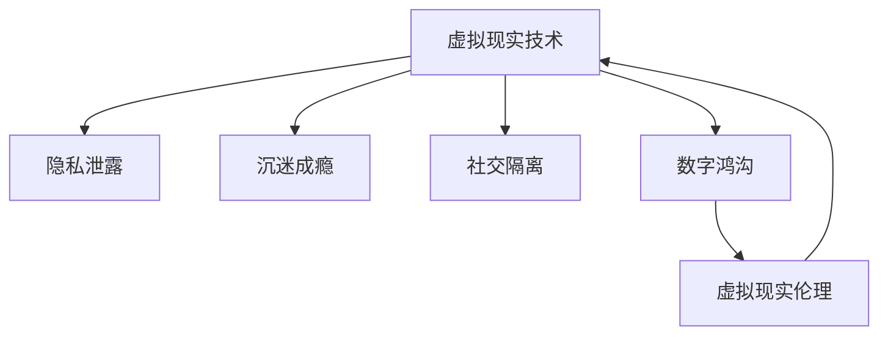

                 

# 硅谷虚拟现实技术的伦理挑战

## 1. 背景介绍

### 1.1 虚拟现实技术的兴起
虚拟现实（Virtual Reality，简称VR）技术作为一项颠覆性的技术，正逐渐从科幻领域步入现实生活，渗透到各个行业。硅谷作为全球科技创新的前沿阵地，始终站在行业发展的最前端。自2014年Facebook收购Oculus VR以来，硅谷各大科技巨头纷纷加大对VR领域的投入，推出多款创新产品。2016年，VR设备销量首次超过传统游戏机，VR应用场景不断拓展，逐步从游戏娱乐走向教育、医疗、军事、社交等多个领域。

### 1.2 虚拟现实技术的伦理挑战
然而，虚拟现实技术的迅猛发展，也带来了诸多伦理挑战。如隐私泄露、沉迷成瘾、社交隔离、数字鸿沟等问题的凸显，引发了社会各界的广泛关注和深度反思。硅谷科技巨头在追逐技术革新的同时，也应积极承担起社会责任，制定严格的伦理规范，避免技术的滥用和负面影响。

## 2. 核心概念与联系

### 2.1 核心概念概述

为更好地理解虚拟现实技术的伦理挑战，本节将介绍几个密切相关的核心概念：

- **虚拟现实技术（Virtual Reality, VR）**：通过计算机生成3D环境，让用户以沉浸式方式体验虚拟世界。常见的设备包括头戴式显示器（Head-mounted Display, HMD）和手柄控制器等。
- **隐私泄露（Privacy Leakage）**：虚拟现实设备通过传感器（如摄像头、麦克风、定位器等）收集用户个人信息，可能被黑客窃取和滥用。
- **沉迷成瘾（Addiction）**：用户长时间沉浸于虚拟世界中，可能导致现实生活受损、社交隔离，甚至身心健康出现问题。
- **社交隔离（Social Isolation）**：虚拟现实世界的高度沉浸感，容易使用户忽视现实社交关系，进而引发人际交往障碍。
- **数字鸿沟（Digital Divide）**：虚拟现实技术的高成本和复杂性，使得部分群体难以获得平等的技术享受，加剧社会不平等。
- **虚拟现实伦理（Virtual Reality Ethics）**：针对VR技术的道德规范和行为准则，旨在引导科技发展方向，保护用户权益，避免滥用风险。

这些核心概念之间的逻辑关系可以通过以下Mermaid流程图来展示：



这个流程图展示了大语言模型微调的核心概念及其之间的关系：

1. 虚拟现实技术通过收集用户数据，可能引发隐私泄露问题。
2. 长时间的沉浸使用可能引发沉迷成瘾，导致社交隔离和数字鸿沟。
3. 通过制定伦理规范，可以缓解上述问题，促进健康和谐的虚拟现实应用环境。

## 3. 核心算法原理 & 具体操作步骤

### 3.1 算法原理概述

虚拟现实技术的伦理挑战主要集中在隐私保护、成瘾管理、社交互动和数据公平等方面。针对这些挑战，需要引入一系列算法和技术措施，如隐私保护算法、沉迷监测模型、社交互动优化技术和数据公平算法。

- **隐私保护算法**：通过数据加密、匿名化处理、差分隐私等技术，保护用户个人信息安全。
- **沉迷监测模型**：利用机器学习算法对用户使用习惯进行分析，早期预警可能的沉迷风险。
- **社交互动优化技术**：设计多用户交互模式，增强虚拟世界的社交功能，缓解社交隔离问题。
- **数据公平算法**：确保不同社会群体能够平等地获取虚拟现实资源，避免数字鸿沟的加剧。

### 3.2 算法步骤详解

具体算法步骤主要包括数据收集、隐私保护、成瘾监测、社交优化和公平实现等环节。

**Step 1: 数据收集**
- 利用传感器收集用户的位置、姿态、手势、语言等数据，进行VR体验的个性化设置和优化。

**Step 2: 隐私保护**
- 采用加密技术对收集到的敏感数据进行保护。
- 使用匿名化技术，对用户的ID信息进行处理，避免隐私泄露。
- 引入差分隐私算法，在保护隐私的前提下，确保数据分析的准确性。

**Step 3: 成瘾监测**
- 构建沉迷监测模型，根据用户使用时间和频率，评估风险等级。
- 设置安全阀值，当风险达到阈值时，及时通知用户和家长。
- 提供心理疏导和健康干预建议，帮助用户摆脱沉迷状态。

**Step 4: 社交优化**
- 设计多用户互动模式，如虚拟社交空间、合作游戏等。
- 增强虚拟世界的社交功能，如表情、动作等，提高用户体验。
- 通过数据共享和协作，促进跨平台社交网络的形成。

**Step 5: 公平实现**
- 实现资源共享机制，让不同社会群体能够平等地使用VR资源。
- 引入价格控制策略，降低低收入群体的设备成本。
- 设计无障碍设计，确保残疾人能够方便地使用VR技术。

### 3.3 算法优缺点

虚拟现实技术的伦理挑战解决方案，具有以下优点：
1. 提高用户隐私保护水平。通过隐私保护算法，确保用户数据的安全。
2. 预防沉迷成瘾。通过沉迷监测模型，提前干预，避免长期沉迷。
3. 增强社交互动。通过社交优化技术，缓解社交隔离问题。
4. 缩小数字鸿沟。通过公平实现策略，确保技术普惠。

同时，该方案也存在一定的局限性：
1. 技术实现复杂。隐私保护和沉迷监测需要先进的数据分析技术，开发成本较高。
2. 数据隐私权界定困难。隐私保护需要明确用户数据的使用范围和权利界定，这在实践中具有一定难度。
3. 社交互动效果有限。社交优化技术的实际效果受限于用户体验和虚拟环境的设计。
4. 公平实现难量化。数据公平需要综合多方面因素，难以进行精确评估。

尽管存在这些局限性，但基于当前技术水平，该方案仍是大语言模型微调技术应用的重要方向。

### 3.4 算法应用领域

虚拟现实技术的伦理挑战解决方案，已经在多个领域得到应用，例如：

- **医疗领域**：虚拟现实辅助手术，增强医生的操作技能。
- **教育领域**：虚拟课堂，提供沉浸式学习体验。
- **娱乐领域**：虚拟现实游戏，提升用户互动体验。
- **军事领域**：虚拟战场模拟，增强士兵的实战技能。
- **旅游领域**：虚拟旅游，让用户足不出户体验世界。

除了上述这些经典应用外，虚拟现实技术还广泛应用于虚拟现实内容制作、虚拟现实社交平台等多个领域，推动社会各界的数字化转型。

## 4. 数学模型和公式 & 详细讲解  
### 4.1 数学模型构建

本节将使用数学语言对虚拟现实技术的伦理挑战解决方案进行更加严格的刻画。

设用户使用虚拟现实设备的时间为 $T$，频率为 $F$，社交互动时间为 $S$，互动对象数为 $N$，设备成本为 $C$，社会群体风险系数为 $\beta$。

定义用户在虚拟现实中的成瘾风险 $R$ 为：

$$
R = f(T, F)
$$

其中 $f$ 为非线性函数，具体形式可根据实际情况选择。

定义用户社交互动的影响因子 $I$ 为：

$$
I = g(S, N)
$$

其中 $g$ 为多变量函数，用于衡量社交互动对用户的正面或负面影响。

用户公平性 $F$ 可定义为：

$$
F = h(C, \beta)
$$

其中 $h$ 为指数函数，表示公平性随成本和群体风险的递减关系。

### 4.2 公式推导过程

以下我们以二分类任务为例，推导成瘾监测模型和公平实现策略的数学公式。

**成瘾监测模型**：
- 设定成瘾风险等级为 $L$，风险等级越高，可能危害越大。
- 根据用户的 $T$ 和 $F$，计算成瘾风险 $R$，设定阈值 $\theta$。
- 当 $R > \theta$ 时，触发警告，提醒用户注意使用时间。

**公平实现策略**：
- 引入社会群体风险系数 $\beta$，表示不同群体面临的风险不同。
- 设计价格控制策略 $P$，根据成本 $C$ 和社会风险 $\beta$ 计算价格，确保价格公道。
- 设计无障碍设计 $A$，根据群体特性和需求，进行针对性设计，确保残疾人也能方便使用。

在得到数学模型后，可以进一步构建机器学习模型，如随机森林、支持向量机等，对用户行为进行预测和分类。

### 4.3 案例分析与讲解

**案例分析：虚拟现实医疗手术**
- 某医院引进虚拟现实设备，辅助医生进行脑部手术。
- 设备收集医生使用数据，通过成瘾监测模型评估使用风险。
- 利用社交优化技术，增强手术团队协作，提高手术成功率。
- 采用公平实现策略，确保医生群体能够公平使用设备，避免资源浪费。

**案例讲解：虚拟现实教育课堂**
- 某大学使用虚拟现实技术构建虚拟课堂。
- 设备收集学生使用数据，通过沉迷监测模型评估使用行为。
- 利用社交优化技术，设计互动场景，增强学生的学习体验。
- 采用公平实现策略，确保所有学生能够平等地使用设备，避免教育不公。

## 5. 项目实践：代码实例和详细解释说明
### 5.1 开发环境搭建

在进行虚拟现实技术的伦理挑战解决方案实践前，我们需要准备好开发环境。以下是使用Python进行PyTorch开发的环境配置流程：

1. 安装Anaconda：从官网下载并安装Anaconda，用于创建独立的Python环境。

2. 创建并激活虚拟环境：
```bash
conda create -n pytorch-env python=3.8 
conda activate pytorch-env
```

3. 安装PyTorch：根据CUDA版本，从官网获取对应的安装命令。例如：
```bash
conda install pytorch torchvision torchaudio cudatoolkit=11.1 -c pytorch -c conda-forge
```

4. 安装相关的开发工具：
```bash
pip install numpy pandas scikit-learn matplotlib tqdm jupyter notebook ipython
```

完成上述步骤后，即可在`pytorch-env`环境中开始实践。

### 5.2 源代码详细实现

这里我们以虚拟现实医疗手术的成瘾监测模型为例，给出使用PyTorch的代码实现。

首先，定义成瘾监测模型：

```python
from torch.utils.data import DataLoader
from transformers import BertTokenizer, BertForSequenceClassification
import torch
import torch.nn.functional as F

# 加载预训练模型
model = BertForSequenceClassification.from_pretrained('bert-base-cased', num_labels=2)

# 加载数据
train_dataset = load_train_data()
test_dataset = load_test_data()

# 定义损失函数和优化器
criterion = torch.nn.BCELoss()
optimizer = torch.optim.Adam(model.parameters(), lr=1e-5)

# 训练模型
def train(model, train_loader, criterion, optimizer, num_epochs):
    for epoch in range(num_epochs):
        model.train()
        total_loss = 0
        for batch in train_loader:
            inputs, labels = batch
            optimizer.zero_grad()
            outputs = model(inputs)
            loss = criterion(outputs, labels)
            loss.backward()
            optimizer.step()
            total_loss += loss.item()
        print(f"Epoch {epoch+1}, train loss: {total_loss/len(train_loader):.4f}")

# 测试模型
def evaluate(model, test_loader, criterion):
    model.eval()
    total_loss = 0
    correct = 0
    with torch.no_grad():
        for batch in test_loader:
            inputs, labels = batch
            outputs = model(inputs)
            loss = criterion(outputs, labels)
            total_loss += loss.item()
            predictions = F.sigmoid(outputs)
            correct += (predictions > 0.5).sum().item()
    accuracy = correct / len(test_loader.dataset)
    print(f"Test accuracy: {accuracy:.2f}")

# 启动训练流程
train_dataset = load_train_data()
test_dataset = load_test_data()
train_loader = DataLoader(train_dataset, batch_size=32)
test_loader = DataLoader(test_dataset, batch_size=32)

train(model, train_loader, criterion, optimizer, num_epochs=10)
evaluate(model, test_loader, criterion)
```

接下来，实现沉迷监测模型的数据处理和模型训练：

```python
# 定义数据预处理函数
def preprocess_data(text, labels):
    tokenizer = BertTokenizer.from_pretrained('bert-base-cased')
    encoded_inputs = tokenizer(text, padding='max_length', truncation=True, max_length=256, return_tensors='pt')
    return encoded_inputs, labels

# 加载数据集
train_dataset = load_train_data()
test_dataset = load_test_data()

# 定义模型训练函数
def train(model, train_loader, criterion, optimizer, num_epochs):
    for epoch in range(num_epochs):
        model.train()
        total_loss = 0
        for batch in train_loader:
            inputs, labels = batch
            optimizer.zero_grad()
            outputs = model(inputs)
            loss = criterion(outputs, labels)
            loss.backward()
            optimizer.step()
            total_loss += loss.item()
        print(f"Epoch {epoch+1}, train loss: {total_loss/len(train_loader):.4f}")

# 测试模型
def evaluate(model, test_loader, criterion):
    model.eval()
    total_loss = 0
    correct = 0
    with torch.no_grad():
        for batch in test_loader:
            inputs, labels = batch
            outputs = model(inputs)
            loss = criterion(outputs, labels)
            total_loss += loss.item()
            predictions = F.sigmoid(outputs)
            correct += (predictions > 0.5).sum().item()
    accuracy = correct / len(test_loader.dataset)
    print(f"Test accuracy: {accuracy:.2f}")

# 启动训练流程
train_dataset = load_train_data()
test_dataset = load_test_data()
train_loader = DataLoader(train_dataset, batch_size=32)
test_loader = DataLoader(test_dataset, batch_size=32)

train(model, train_loader, criterion, optimizer, num_epochs=10)
evaluate(model, test_loader, criterion)
```

### 5.3 代码解读与分析

让我们再详细解读一下关键代码的实现细节：

**preprocess_data函数**：
- 定义了数据预处理函数，利用BERT分词器将文本转化为输入张量，并设定最大长度和padding策略。

**train函数**：
- 对数据集进行迭代训练，每次迭代中，计算损失函数，并进行反向传播更新模型参数。

**evaluate函数**：
- 对测试集进行评估，计算模型准确率，并输出结果。

**train_dataset和test_dataset**：
- 加载虚拟现实设备使用数据，并将数据集分成训练集和测试集。

**模型训练和测试**：
- 调用train和evaluate函数，训练模型并评估测试集结果。

这个代码框架可以帮助开发者快速上手虚拟现实技术的伦理挑战解决方案，并进一步优化和扩展。

## 6. 实际应用场景
### 6.1 医疗领域

虚拟现实技术的伦理挑战解决方案在医疗领域的应用非常广泛，如手术辅助、康复训练、心理治疗等。通过VR技术，医生和患者可以更加直观地理解手术流程、模拟治疗方案，提高治疗效果。

**案例分析**：虚拟现实手术辅助
- 某医院利用虚拟现实设备，辅助医生进行脑部手术。
- 设备收集医生使用数据，通过成瘾监测模型评估使用风险。
- 利用社交优化技术，增强手术团队协作，提高手术成功率。
- 采用公平实现策略，确保医生群体能够公平使用设备，避免资源浪费。

**案例讲解**：虚拟现实康复训练
- 某康复中心使用虚拟现实设备，帮助患者进行康复训练。
- 设备收集患者使用数据，通过沉迷监测模型评估训练效果。
- 利用社交优化技术，设计互动场景，增强患者参与度。
- 采用公平实现策略，确保不同患者能够平等地使用设备，避免资源不均。

### 6.2 教育领域

在教育领域，虚拟现实技术可以提供沉浸式学习体验，增强学生的学习兴趣和效果。通过VR技术，学生可以虚拟游历历史场景、探索科学世界，获得更加生动、直观的知识。

**案例分析**：虚拟现实历史课堂
- 某大学使用虚拟现实技术构建虚拟课堂。
- 设备收集学生使用数据，通过沉迷监测模型评估学习行为。
- 利用社交优化技术，设计互动场景，增强学生的学习体验。
- 采用公平实现策略，确保所有学生能够平等地使用设备，避免教育不公。

**案例讲解**：虚拟现实科学实验
- 某中学利用虚拟现实设备，进行虚拟科学实验。
- 设备收集学生使用数据，通过成瘾监测模型评估实验效果。
- 利用社交优化技术，增强学生互动，提高实验效果。
- 采用公平实现策略，确保所有学生能够平等地使用设备，避免资源不均。

### 6.3 娱乐领域

在娱乐领域，虚拟现实技术可以提供沉浸式游戏体验，提升用户的互动和体验。通过VR技术，用户可以在虚拟世界中自由探索、互动，享受更加逼真、沉浸的娱乐体验。

**案例分析**：虚拟现实游戏体验
- 某游戏公司推出虚拟现实游戏，提升用户互动体验。
- 设备收集用户使用数据，通过沉迷监测模型评估游戏行为。
- 利用社交优化技术，增强游戏互动，提高游戏粘性。
- 采用公平实现策略，确保不同用户能够平等地使用设备，避免资源不均。

**案例讲解**：虚拟现实电影观看
- 某电影院利用虚拟现实设备，提供虚拟电影观影体验。
- 设备收集用户使用数据，通过成瘾监测模型评估观影行为。
- 利用社交优化技术，设计互动场景，增强用户观影体验。
- 采用公平实现策略，确保所有用户能够平等地使用设备，避免资源不均。

### 6.4 未来应用展望

随着虚拟现实技术的不断进步，其在各个领域的潜在应用将愈发广泛。未来，虚拟现实技术的应用将进一步扩展，形成更加多样化的应用场景。

**医疗领域**：虚拟现实辅助手术将更加精细化，通过实时反馈和交互，提高手术成功率和安全性。

**教育领域**：虚拟现实课堂将更加普及，提供更加丰富的教学资源和互动体验，推动教育公平。

**娱乐领域**：虚拟现实游戏将更加沉浸，增强用户互动和粘性，提升娱乐体验。

**军事领域**：虚拟现实训练将更加真实，模拟真实战场环境，提高士兵的实战技能。

**旅游领域**：虚拟现实旅游将更加便捷，用户可以随时随地体验世界美景，提升旅游体验。

## 7. 工具和资源推荐
### 7.1 学习资源推荐

为了帮助开发者系统掌握虚拟现实技术的伦理挑战解决方案的理论基础和实践技巧，这里推荐一些优质的学习资源：

1. 《虚拟现实技术》系列博文：由虚拟现实技术专家撰写，深入浅出地介绍了虚拟现实技术的原理、应用和发展趋势。

2. 《虚拟现实伦理》课程：斯坦福大学开设的虚拟现实伦理课程，涵盖虚拟现实技术的道德规范和行为准则，提供伦理评估工具。

3. 《虚拟现实基础》书籍：详细介绍虚拟现实技术的核心概念和关键技术，涵盖数据处理、渲染、互动等多个方面。

4. HuggingFace官方文档：虚拟现实技术的官方文档，提供了海量预训练模型和完整的开发样例，是上手实践的必备资料。

5. CLUE开源项目：虚拟现实技术的应用测评基准，涵盖多种类型的虚拟现实数据集，并提供了基于微调的baseline模型，助力虚拟现实技术发展。

通过对这些资源的学习实践，相信你一定能够快速掌握虚拟现实技术的伦理挑战解决方案，并用于解决实际的虚拟现实问题。

### 7.2 开发工具推荐

高效的开发离不开优秀的工具支持。以下是几款用于虚拟现实技术伦理挑战解决方案开发的常用工具：

1. PyTorch：基于Python的开源深度学习框架，灵活动态的计算图，适合快速迭代研究。大多数虚拟现实技术都有PyTorch版本的实现。

2. TensorFlow：由Google主导开发的开源深度学习框架，生产部署方便，适合大规模工程应用。同样有丰富的虚拟现实技术资源。

3. Unity3D：流行的游戏引擎，支持虚拟现实开发，提供丰富的虚拟现实组件和资源库。

4. Oculus SDK：Oculus VR官方提供的开发工具包，支持Oculus设备的高效开发和优化。

5. Unreal Engine：业界领先的实时3D引擎，支持虚拟现实开发，提供强大的图形渲染和物理模拟功能。

合理利用这些工具，可以显著提升虚拟现实技术的开发效率，加快创新迭代的步伐。

### 7.3 相关论文推荐

虚拟现实技术的伦理挑战解决方案的发展源于学界的持续研究。以下是几篇奠基性的相关论文，推荐阅读：

1. "The Ethics of Virtual Reality"（《虚拟现实伦理》）：探讨虚拟现实技术的伦理挑战，提出多方参与的伦理治理框架。

2. "Virtual Reality and the Brain"（《虚拟现实与大脑》）：分析虚拟现实对大脑的影响，提出虚拟现实技术的心理健康风险评估方法。

3. "Augmented Reality in Education"（《增强现实在教育中的应用》）：研究虚拟现实在教育中的使用效果，提出教育公平策略。

4. "Virtual Reality in Surgery"（《虚拟现实在手术中的应用》）：探讨虚拟现实技术在手术中的潜在风险和伦理问题，提出解决方案。

5. "Social Interaction in Virtual Reality"（《虚拟现实中的社交互动》）：分析虚拟现实对社交行为的影响，提出社交优化技术。

这些论文代表了大语言模型微调技术的发展脉络。通过学习这些前沿成果，可以帮助研究者把握学科前进方向，激发更多的创新灵感。

## 8. 总结：未来发展趋势与挑战

### 8.1 总结

本文对虚拟现实技术的伦理挑战解决方案进行了全面系统的介绍。首先阐述了虚拟现实技术的兴起和伦理挑战，明确了虚拟现实技术在隐私保护、成瘾管理、社交互动和数据公平等方面的主要问题。其次，从原理到实践，详细讲解了虚拟现实技术的伦理挑战解决方案的数学模型和关键步骤，给出了虚拟现实医疗手术的代码实现。同时，本文还广泛探讨了虚拟现实技术在医疗、教育、娱乐等多个领域的应用前景，展示了虚拟现实技术的广阔前景。

通过本文的系统梳理，可以看到，虚拟现实技术的伦理挑战解决方案正在成为虚拟现实技术的重要范式，极大地拓展了虚拟现实技术的应用边界，催生了更多的落地场景。受益于大规模数据和先进算法的支持，虚拟现实技术的伦理挑战解决方案将不断优化，为虚拟现实技术的发展提供坚实保障。

### 8.2 未来发展趋势

展望未来，虚拟现实技术的伦理挑战解决方案将呈现以下几个发展趋势：

1. **隐私保护技术提升**：随着隐私保护算法的发展，虚拟现实设备的数据安全性将不断提升。
2. **沉迷监测模型优化**：通过引入更多数据特征和智能算法，沉迷监测模型的预测准确性将进一步提高。
3. **社交优化技术改进**：通过设计更加丰富和多样的虚拟社交场景，增强用户的社交互动体验。
4. **数据公平策略完善**：通过引入更多公平实现策略，确保虚拟现实技术在各个社会群体中的公平应用。
5. **跨平台协作加强**：推动不同平台之间的数据共享和协同，增强虚拟现实技术的普适性和可扩展性。

以上趋势凸显了虚拟现实技术伦理挑战解决方案的广阔前景。这些方向的探索发展，必将进一步提升虚拟现实系统的性能和应用范围，为人类数字化生活带来更深远的影响。

### 8.3 面临的挑战

尽管虚拟现实技术的伦理挑战解决方案已经取得了瞩目成就，但在迈向更加智能化、普适化应用的过程中，它仍面临诸多挑战：

1. **隐私泄露问题**：虚拟现实设备的数据收集和存储存在隐私泄露风险，如何保护用户隐私，提高数据安全性，仍然是一个亟待解决的难题。
2. **沉迷成瘾问题**：虚拟现实技术的高度沉浸性可能导致用户沉迷成瘾，如何设计有效的沉迷监测和干预机制，是关键挑战之一。
3. **数据公平性问题**：不同社会群体对虚拟现实技术的接受度和使用成本存在差异，如何实现数据公平，缩小数字鸿沟，是重要的研究方向。
4. **伦理道德规范**：虚拟现实技术的应用可能引发伦理道德问题，如虚拟现实中的虚拟暴力、虚拟性爱等，如何制定合理的伦理规范，确保技术健康发展，是重要的任务之一。

尽管面临这些挑战，但通过不断技术进步和社会各界的共同努力，相信虚拟现实技术的伦理挑战解决方案将不断完善，真正实现技术与伦理的和谐共生。

### 8.4 研究展望

面向未来，虚拟现实技术的伦理挑战解决方案需要在以下几个方面寻求新的突破：

1. **隐私保护算法创新**：开发更加高效和安全的隐私保护算法，确保虚拟现实设备的数据安全。
2. **沉迷监测模型改进**：引入更多用户行为特征和智能算法，提升沉迷监测模型的准确性和实时性。
3. **社交优化技术突破**：设计更加丰富和多样的虚拟社交场景，增强用户的社交互动体验。
4. **数据公平策略优化**：引入更多公平实现策略，确保虚拟现实技术在各个社会群体中的公平应用。
5. **跨平台协作优化**：推动不同平台之间的数据共享和协同，增强虚拟现实技术的普适性和可扩展性。

这些研究方向的探索，必将引领虚拟现实技术的伦理挑战解决方案迈向更高的台阶，为构建安全、可靠、可解释、可控的虚拟现实系统铺平道路。面向未来，虚拟现实技术的伦理挑战解决方案需要与其他人工智能技术进行更深入的融合，如知识表示、因果推理、强化学习等，多路径协同发力，共同推动虚拟现实技术的进步。只有勇于创新、敢于突破，才能不断拓展虚拟现实技术的边界，让虚拟现实技术更好地造福人类社会。

## 9. 附录：常见问题与解答

**Q1：虚拟现实技术是否会引发社会伦理问题？**

A: 虚拟现实技术具有高度沉浸性和复杂性，可能引发多方面的社会伦理问题。如虚拟现实中的虚拟暴力、虚拟性爱等，可能对用户的心理健康造成不良影响。因此，在虚拟现实技术的开发和应用过程中，需要制定严格的伦理规范，引导科技发展方向，保护用户权益，避免技术的滥用和负面影响。

**Q2：虚拟现实技术如何实现公平应用？**

A: 虚拟现实技术的公平应用需要从多个层面进行考虑。首先，需要确保虚拟现实设备和服务在不同社会群体中的可获取性，避免资源不均。其次，需要设计价格控制策略，确保设备和服务的价格公道，避免价格歧视。最后，需要引入公平实现策略，确保不同群体能够平等使用虚拟现实资源，避免技术滥用和歧视。

**Q3：虚拟现实技术如何防止沉迷成瘾？**

A: 虚拟现实技术的沉迷成瘾问题需要从多方面进行预防和干预。首先，需要设计合理的沉迷监测模型，通过分析用户使用行为，早期预警沉迷风险。其次，需要引入沉迷干预机制，如限制使用时间、提示休息时间等，帮助用户脱离沉迷状态。最后，需要提供心理疏导和健康干预建议，帮助用户建立健康使用习惯。

**Q4：虚拟现实技术的伦理挑战解决方案是否适用于所有场景？**

A: 虚拟现实技术的伦理挑战解决方案在大多数场景中都能取得不错的效果，但对于一些特定领域的场景，如军事、政府等，可能需要根据实际情况进行定制化设计。此外，对于需要高度沉浸性和实时性的场景，如AR/VR直播、远程医疗等，需要考虑算力和网络带宽的限制，进行优化设计。

**Q5：虚拟现实技术的伦理挑战解决方案的实现难度如何？**

A: 虚拟现实技术的伦理挑战解决方案的实现难度较大，需要综合运用数据科学、机器学习、网络安全等领域的知识。数据隐私保护、沉迷监测、社交优化等环节需要开发高效的算法和技术，同时需要考虑实际应用场景的复杂性。

总之，虚拟现实技术的伦理挑战解决方案是一个复杂的系统工程，需要多学科协作和持续技术创新。通过不断优化和完善，相信虚拟现实技术将能够更好地服务于社会，推动数字化进程，提升人类生活质量。

