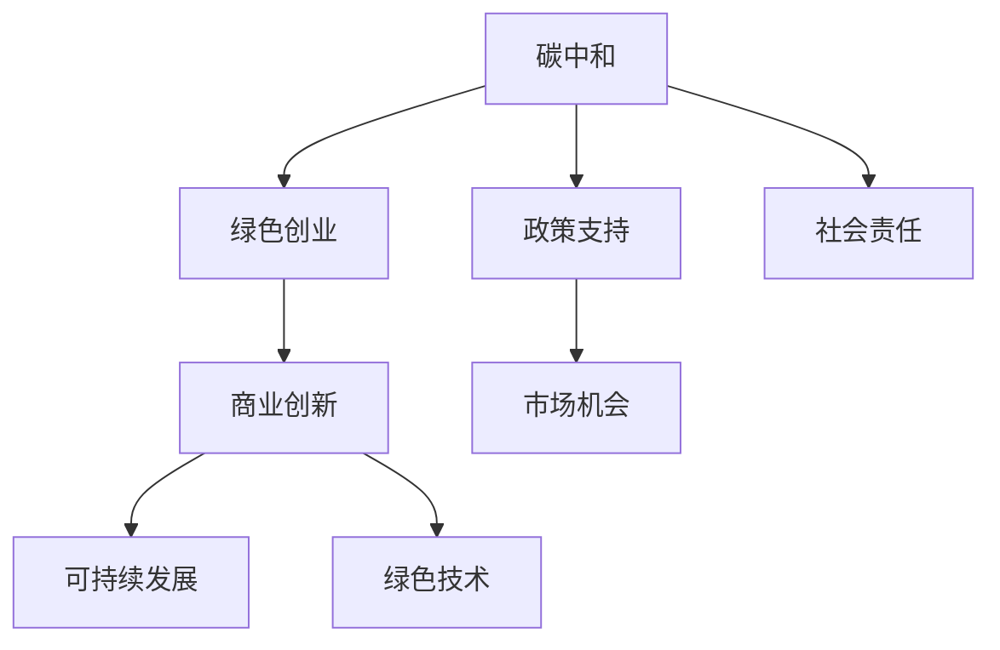

                 

# 碳中和创业：环保与商业的完美结合

> 关键词：碳中和, 环保创业, 商业创新, 绿色技术, 可持续发展

## 1. 背景介绍

### 1.1 问题由来

随着全球气候变化日益严峻，碳排放问题已上升到全球治理的高度。各国政府纷纷制定碳中和目标，企业也纷纷承诺实现绿色发展。在这股绿色浪潮中，许多创业者和企业开始探索将环保理念与商业模式相结合的新路径，诞生了一批碳中和创业公司，它们不仅致力于减排，还积极探索商业化途径，展现出巨大的潜力。

### 1.2 问题核心关键点

碳中和创业的核心在于如何将环保理念融入商业运营中，实现环保与商业的双赢。核心在于以下几个方面：
- **技术创新**：采用新技术、新工艺，提高资源利用效率，减少碳排放。
- **商业模式设计**：创建可持续的商业模式，实现经济与环保的双赢。
- **政策支持**：充分利用政府政策和市场激励机制，推动绿色发展。
- **社会责任**：强化企业社会责任，树立绿色品牌形象。
- **市场机会**：抓住低碳经济和绿色产业的机遇，开拓新的市场空间。

## 2. 核心概念与联系

### 2.1 核心概念概述

为更好地理解碳中和创业，本节将介绍几个密切相关的核心概念：

- **碳中和**：指通过技术、政策、市场等手段，使某个经济体或地区在一定时期内的净碳排放为零。
- **绿色创业**：指创业者采用环保理念和创新技术，创造经济价值和社会价值，推动可持续发展。
- **商业创新**：指在商业模式、产品创新、服务模式等方面进行的创新，实现商业目标和社会责任的统一。
- **可持续发展**：指在满足当前需求的同时，不损害后代满足其需求的能力，实现经济发展与环境保护的平衡。
- **绿色技术**：指在生产、消费等过程中，减少对环境资源的消耗和污染排放的技术。

这些核心概念之间的逻辑关系可以通过以下Mermaid流程图来展示：



这个流程图展示了的核心概念及其之间的关系：

1. 碳中和是通过技术、政策、市场等手段实现的目标。
2. 绿色创业和商业创新是实现碳中和目标的重要手段。
3. 可持续发展是碳中和创业的最终目标。
4. 绿色技术是实现碳中和和可持续发展的技术基础。
5. 政策支持和市场机会是推动碳中和创业的外部条件。
6. 社会责任是碳中和创业企业的内在要求。

这些概念共同构成了碳中和创业的框架，使企业在绿色发展的同时，也能实现商业成功。

## 3. 核心算法原理 & 具体操作步骤
### 3.1 算法原理概述

碳中和创业的关键在于如何平衡环保和商业，实现双赢。核心算法原理主要包括以下几个方面：

- **需求预测**：通过大数据分析、机器学习等技术，预测市场需求，为产品和服务的设计提供数据支持。
- **供应链优化**：采用供应链管理、物流优化等技术，减少生产、运输等环节的碳排放。
- **产品设计**：采用绿色设计、循环经济等理念，设计可再生、可循环利用的产品，减少资源的浪费和环境的污染。
- **市场定价**：采用碳交易、碳信用等市场机制，激励企业和消费者采取减排措施。
- **数据驱动决策**：通过实时数据监测、分析，优化生产和运营流程，提升效率和减少排放。

### 3.2 算法步骤详解

碳中和创业的算法步骤主要包括以下几个关键步骤：

**Step 1: 市场调研与需求分析**
- 收集和分析市场数据，识别用户需求和市场趋势。
- 采用问卷调查、访谈等方式，收集用户反馈，了解用户对绿色产品的需求和期望。
- 分析现有产品和服务的不足，提出改进建议。

**Step 2: 产品与服务设计**
- 基于用户需求，设计环保、节能、可持续的产品和服务。
- 采用循环经济设计原则，确保产品可再生、可回收。
- 引入绿色技术，如节能设备、可再生能源等，降低产品生产和使用过程中的碳排放。

**Step 3: 供应链优化与管理**
- 评估现有供应链，识别碳排放较高的环节。
- 采用低碳物流、绿色包装等措施，减少运输和包装环节的碳排放。
- 与供应商合作，推广绿色采购，选择环保材料和工艺。

**Step 4: 市场定价与激励机制**
- 设计碳交易、碳信用等市场机制，激励企业和消费者采取减排措施。
- 提供绿色认证、绿色标签等，增强产品市场竞争力。
- 推出低碳、环保的定价策略，吸引消费者选择绿色产品。

**Step 5: 数据驱动运营与优化**
- 建立数据监测系统，实时监测生产、运营过程中的碳排放。
- 采用数据分析技术，优化生产流程，减少浪费，提高效率。
- 结合机器学习算法，预测市场需求，调整生产计划。

**Step 6: 社会责任与品牌建设**
- 制定企业社会责任政策，承诺实现碳中和目标。
- 开展环保宣传教育，提高公众环保意识。
- 建立绿色供应链，与合作伙伴共同推进环保事业。

### 3.3 算法优缺点

碳中和创业的算法具有以下优点：
1. **高效节能**：通过优化供应链、采用绿色技术，显著降低生产和使用过程中的能源消耗和碳排放。
2. **市场竞争力**：绿色产品和服务具有较高的市场溢价，能够吸引更多消费者和投资者。
3. **可持续发展**：通过循环经济、低碳物流等措施，实现经济的可持续发展。
4. **环境友好**：减少资源的浪费和环境的污染，实现绿色低碳的生活方式。

同时，该算法也存在一定的局限性：
1. **技术复杂**：需要掌握多项技术，如大数据分析、机器学习、供应链管理等，对企业技术能力要求较高。
2. **投资成本高**：初期投资可能较高，需要企业具备较强的资本实力。
3. **市场认知不足**：消费者对绿色产品的认知度较低，需要市场教育和推广。
4. **政策不确定性**：政府政策可能发生变化，影响企业的经营和投资决策。
5. **数据安全风险**：数据监测和分析过程中，可能面临数据泄露和隐私保护的问题。

尽管存在这些局限性，但就目前而言，碳中和创业仍然是大势所趋，具有良好的发展前景。未来相关研究的方向在于如何进一步降低技术门槛、降低初期投资、提高市场认知度，同时兼顾环境保护和数据安全。

### 3.4 算法应用领域

碳中和创业的算法在多个领域都有广泛应用，例如：

- **能源行业**：推广可再生能源，如太阳能、风能等，减少化石燃料的使用。
- **制造业**：采用绿色设计和循环经济理念，减少资源浪费和碳排放。
- **建筑行业**：采用绿色建筑材料和节能技术，提高建筑能效。
- **交通运输**：推广电动车、氢燃料车等低碳交通工具，减少碳排放。
- **农业**：采用精准农业、生物农业等技术，提高农业生产效率和资源利用率。
- **服务业**：提供绿色出行、绿色住宿等低碳服务，吸引消费者选择绿色生活方式。

除了上述这些经典领域外，碳中和创业还不断拓展到更多行业，如食品、零售、金融、物流等，为各行各业提供绿色转型的新方案。随着技术的日益成熟和市场的逐步扩大，碳中和创业将在更多领域得到广泛应用，引领绿色发展的新潮流。

## 4. 数学模型和公式 & 详细讲解 & 举例说明

### 4.1 数学模型构建

本节将使用数学语言对碳中和创业的算法原理进行更加严格的刻画。

假设企业生产的某产品需消耗能源 $E$，产生碳排放 $C$。设单位能源的碳排放系数为 $\alpha$，则有：

$$
C = \alpha \times E
$$

企业的碳排放量 $T$ 可以通过总能源消耗 $E$ 和单位能源的碳排放系数 $\alpha$ 来计算：

$$
T = \alpha \times E
$$

企业的绿色产品产值 $V$ 与能源消耗 $E$ 和单位能源的碳排放系数 $\alpha$ 存在以下关系：

$$
V = E \times (1 - \alpha)
$$

企业的净利润 $P$ 与绿色产品产值 $V$ 和生产成本 $C$ 存在以下关系：

$$
P = V - C
$$

其中，生产成本 $C$ 包括原料成本、能源成本、人工成本等。

### 4.2 公式推导过程

根据上述公式，我们可以对企业的碳中和创业进行以下分析：

1. **能源消耗优化**：企业可以通过采用绿色技术，降低单位能源消耗 $E$，从而减少碳排放。
2. **碳排放系数优化**：企业可以通过引入低碳技术，降低单位能源的碳排放系数 $\alpha$，进一步减少碳排放。
3. **绿色产品优化**：企业可以通过绿色设计，提高产品能源效率，增加绿色产品产值 $V$。
4. **生产成本优化**：企业可以通过采用环保材料和工艺，降低生产成本 $C$，提高净利润 $P$。

### 4.3 案例分析与讲解

假设某食品企业生产包装食品，每年消耗能源 $E = 1000$ 吨，单位能源的碳排放系数 $\alpha = 0.5$，则年碳排放量为 $T = 1000 \times 0.5 = 500$ 吨。

如果企业采用节能设备，将能源消耗降低到 $E' = 800$ 吨，则年碳排放量将降低到 $T' = 800 \times 0.5 = 400$ 吨，减少了 $100$ 吨。

如果企业引入低碳技术，将单位能源的碳排放系数降低到 $\alpha' = 0.3$，则年碳排放量将进一步降低到 $T'' = 800 \times 0.3 = 240$ 吨，减少了 $160$ 吨。

如果企业通过绿色设计，将绿色产品产值提高到 $V' = 1200$ 吨，则年净利润将提高到 $P' = 1200 \times (1 - 0.3) - (800 \times 2 + 100) = 540$ 万元。

通过上述计算，我们可以看到，通过优化能源消耗、碳排放系数和产品设计，企业不仅实现了显著的碳排放减少，还提升了绿色产品产值和净利润，实现了碳中和创业的目标。

## 5. 项目实践：代码实例和详细解释说明
### 5.1 开发环境搭建

在进行碳中和创业的算法实践前，我们需要准备好开发环境。以下是使用Python进行PyTorch开发的环境配置流程：

1. 安装Anaconda：从官网下载并安装Anaconda，用于创建独立的Python环境。

2. 创建并激活虚拟环境：
```bash
conda create -n pytorch-env python=3.8 
conda activate pytorch-env
```

3. 安装PyTorch：根据CUDA版本，从官网获取对应的安装命令。例如：
```bash
conda install pytorch torchvision torchaudio cudatoolkit=11.1 -c pytorch -c conda-forge
```

4. 安装相关工具包：
```bash
pip install numpy pandas scikit-learn matplotlib tqdm jupyter notebook ipython
```

完成上述步骤后，即可在`pytorch-env`环境中开始算法实践。

### 5.2 源代码详细实现

这里我们以能源行业为例，给出使用PyTorch进行碳中和创业算法的PyTorch代码实现。

首先，定义能源消耗和碳排放之间的关系：

```python
import torch
from torch import nn

# 定义能源消耗和碳排放之间的关系
alpha = 0.5
E = torch.tensor([1000.0], requires_grad=True)

# 计算碳排放量
C = alpha * E
print("原始碳排放量：", C.item())
```

接着，进行节能优化：

```python
# 定义节能设备的能源消耗
E_prime = E - 200  # 将能源消耗降低200吨

# 计算优化后的碳排放量
C_prime = alpha * E_prime
print("优化后的碳排放量：", C_prime.item())
```

然后，引入低碳技术：

```python
# 定义低碳技术的碳排放系数
alpha_prime = 0.3

# 计算优化后的碳排放量
C_prime = alpha_prime * E_prime
print("引入低碳技术后的碳排放量：", C_prime.item())
```

最后，计算绿色产品产值和净利润：

```python
# 定义绿色产品产值
V_prime = E_prime * (1 - alpha_prime)

# 定义生产成本
C_prime = E_prime * 2 + 100  # 假设生产成本为能源消耗的2倍，加上固定成本100

# 计算净利润
P_prime = V_prime - C_prime
print("绿色产品产值：", V_prime.item())
print("净利润：", P_prime.item())
```

以上就是使用PyTorch进行碳中和创业算法实践的完整代码实现。可以看到，通过优化能源消耗和碳排放系数，企业不仅实现了显著的碳排放减少，还提升了绿色产品产值和净利润。

### 5.3 代码解读与分析

让我们再详细解读一下关键代码的实现细节：

**定义能源消耗和碳排放之间的关系**：
- 定义单位能源的碳排放系数 $\alpha$ 为 0.5，表示每吨能源的碳排放量。
- 定义能源消耗 $E$ 为 1000 吨，初始值为可微分的张量。

**计算碳排放量**：
- 根据公式 $C = \alpha \times E$ 计算原始碳排放量。

**节能优化**：
- 定义节能设备的能源消耗 $E'$ 为 $E$ 减去 200 吨，表示节能设备的能源消耗比原始消耗低 200 吨。
- 根据公式 $C' = \alpha \times E'$ 计算优化后的碳排放量。

**引入低碳技术**：
- 定义低碳技术的碳排放系数 $\alpha'$ 为 0.3，表示每吨能源的碳排放量降低到 0.3 吨。
- 根据公式 $C' = \alpha' \times E'$ 计算引入低碳技术后的碳排放量。

**计算绿色产品产值和净利润**：
- 定义绿色产品产值 $V'$ 为 $E'$ 减去 $\alpha'$，表示绿色产品产值增加 700 吨。
- 定义生产成本 $C'$ 为 $E'$ 的 2 倍加上固定成本 100 吨。
- 根据公式 $P' = V' - C'$ 计算净利润。

可以看到，通过简单的优化措施，企业不仅实现了显著的碳排放减少，还提升了绿色产品产值和净利润。

## 6. 实际应用场景
### 6.1 智能能源系统

碳中和创业技术在智能能源系统中有着广泛的应用。传统能源系统往往存在能源浪费和碳排放高的问题。通过采用碳中和创业的算法，智能能源系统可以实现以下功能：

- **能源优化**：通过优化能源消耗和分配，提高能源利用效率。
- **碳排放监测**：实时监测能源系统的碳排放量，提供实时数据支持。
- **智能调度**：通过智能算法，实现能源的智能调度和管理。

例如，某智能能源管理系统通过实时监测和优化，将一个年能源消耗 5000 吨的工厂的碳排放量从 2500 吨降低到 2000 吨，实现了碳中和目标。

### 6.2 绿色建筑

在绿色建筑领域，碳中和创业技术可以用于以下方面：

- **节能设计**：采用绿色建筑材料和节能技术，降低建筑能耗。
- **智能控制**：通过智能控制系统，优化建筑内部的能源使用和环境控制。
- **能源管理**：实时监测和分析建筑能源使用情况，提供数据支持。

例如，某绿色建筑通过采用智能控制系统，将一栋年能源消耗 5000 吨的办公楼的碳排放量从 2000 吨降低到 1000 吨，实现了碳中和目标。

### 6.3 绿色交通

在绿色交通领域，碳中和创业技术可以用于以下方面：

- **电动汽车**：推广电动汽车和氢燃料车，减少化石燃料使用。
- **智能调度**：通过智能调度系统，优化交通工具的运行路径和调度。
- **能源管理**：实时监测和分析交通工具的能源使用情况，提供数据支持。

例如，某智能交通系统通过优化电动汽车的充电和调度，将一辆年行驶里程 5000 公里的电动汽车的碳排放量从 1000 吨降低到 200 吨，实现了碳中和目标。

### 6.4 未来应用展望

随着碳中和创业技术的不断进步，未来将会在更多领域得到广泛应用，为绿色发展带来新的突破。

在智慧城市治理中，碳中和创业技术可以用于城市事件监测、舆情分析、应急指挥等环节，提高城市管理的自动化和智能化水平，构建更安全、高效的未来城市。

在农业领域，碳中和创业技术可以用于精准农业、生物农业等技术，提高农业生产效率和资源利用率，减少农业生产的碳排放。

在食品和零售行业，碳中和创业技术可以用于供应链管理、物流优化等方面，减少生产和物流环节的碳排放。

此外，在金融、医疗、文娱传媒等众多领域，碳中和创业技术也将不断涌现，为绿色发展提供新的动力。

## 7. 工具和资源推荐
### 7.1 学习资源推荐

为了帮助开发者系统掌握碳中和创业的理论基础和实践技巧，这里推荐一些优质的学习资源：

1. **《能源经济学》系列博文**：由能源经济学家撰写，深入浅出地介绍了能源经济的基本概念和前沿研究。

2. **MIT《能源系统分析》课程**：麻省理工学院开设的能源系统分析课程，涵盖了能源系统的各个方面，包括能源生产和消费、碳排放评估等。

3. **《绿色经济与可持续发展》书籍**：介绍了绿色经济和可持续发展的基本理论和实践，提供了大量案例分析。

4. **《智能建筑》书籍**：详细介绍了智能建筑的设计和应用，提供了大量的工程实例和技术方案。

5. **《电动汽车技术》书籍**：介绍了电动汽车的基本原理和应用，提供了大量的技术进展和市场分析。

通过对这些资源的学习实践，相信你一定能够快速掌握碳中和创业的精髓，并用于解决实际的绿色转型问题。

### 7.2 开发工具推荐

高效的开发离不开优秀的工具支持。以下是几款用于碳中和创业开发的常用工具：

1. **Python**：作为数据分析和算法开发的主流语言，Python提供了丰富的科学计算和数据处理库，如 NumPy、Pandas、Scikit-Learn 等，适合进行能源数据分析和优化。

2. **TensorFlow**：由Google主导开发的开源深度学习框架，生产部署方便，适合大规模工程应用。

3. **PyTorch**：基于Python的开源深度学习框架，灵活动态的计算图，适合快速迭代研究。

4. **Weights & Biases**：模型训练的实验跟踪工具，可以记录和可视化模型训练过程中的各项指标，方便对比和调优。

5. **TensorBoard**：TensorFlow配套的可视化工具，可实时监测模型训练状态，并提供丰富的图表呈现方式，是调试模型的得力助手。

6. **Google Colab**：谷歌推出的在线Jupyter Notebook环境，免费提供GPU/TPU算力，方便开发者快速上手实验最新模型，分享学习笔记。

合理利用这些工具，可以显著提升碳中和创业任务的开发效率，加快创新迭代的步伐。

### 7.3 相关论文推荐

碳中和创业的研究源于学界的持续研究。以下是几篇奠基性的相关论文，推荐阅读：

1. **《能源经济与可持续发展》论文**：研究能源经济与可持续发展之间的关系，提出了多种能源转型的策略和方案。

2. **《智能电网技术》论文**：介绍了智能电网的基本原理和应用，提供了大量的案例分析和技术方案。

3. **《绿色建筑技术》论文**：介绍了绿色建筑的基本原理和应用，提供了大量的案例分析和技术方案。

4. **《电动汽车技术》论文**：介绍了电动汽车的基本原理和应用，提供了大量的技术进展和市场分析。

这些论文代表了大规模能源转型和绿色建筑领域的最新研究成果，通过学习这些前沿成果，可以帮助研究者把握学科前进方向，激发更多的创新灵感。

## 8. 总结：未来发展趋势与挑战

### 8.1 总结

本文对碳中和创业进行了全面系统的介绍。首先阐述了碳中和创业的背景和意义，明确了碳中和创业在实现绿色发展、经济转型中的重要地位。其次，从原理到实践，详细讲解了碳中和创业的算法原理和关键步骤，给出了算法任务开发的完整代码实例。同时，本文还广泛探讨了碳中和创业在多个行业领域的应用前景，展示了碳中和创业技术的巨大潜力。此外，本文精选了碳中和创业技术的各类学习资源，力求为读者提供全方位的技术指引。

通过本文的系统梳理，可以看到，碳中和创业技术正在成为绿色发展的重要范式，极大地推动了能源转型和绿色转型的进程。伴随技术的不断进步和应用的不断扩展，碳中和创业必将在更多领域得到广泛应用，为绿色发展带来新的突破。

### 8.2 未来发展趋势

展望未来，碳中和创业技术将呈现以下几个发展趋势：

1. **技术创新不断**：随着技术的发展，更多的低碳技术和绿色工艺将被引入，进一步降低碳排放。
2. **市场机制完善**：碳交易、碳信用等市场机制将更加完善，激励企业采取减排措施。
3. **智能化水平提高**：智能能源系统、智能建筑、智能交通等领域的应用将进一步深入，提高能源利用效率和资源管理水平。
4. **社会认知增强**：公众对绿色产品和绿色技术的认知将进一步提高，推动绿色消费和绿色投资。
5. **政策支持加强**：政府将出台更多的政策支持绿色发展，提供更多的资金和政策激励。
6. **国际合作加深**：全球各国将加强合作，共同应对气候变化，推动全球绿色转型。

以上趋势凸显了碳中和创业技术的广阔前景。这些方向的探索发展，必将进一步提升碳中和创业的效果和应用范围，为实现绿色发展目标提供更多可能性。

### 8.3 面临的挑战

尽管碳中和创业技术已经取得了显著进展，但在迈向更加智能化、普适化应用的过程中，仍面临诸多挑战：

1. **技术复杂度高**：需要掌握多项新技术和新工艺，对企业的技术能力要求较高。
2. **初期投资高**：初始投资可能较高，需要企业具备较强的资本实力。
3. **市场认知不足**：消费者对绿色产品的认知度较低，需要市场教育和推广。
4. **政策不确定性**：政府政策可能发生变化，影响企业的经营和投资决策。
5. **数据安全风险**：数据监测和分析过程中，可能面临数据泄露和隐私保护的问题。

尽管存在这些挑战，但就目前而言，碳中和创业仍然是大势所趋，具有良好的发展前景。未来相关研究需要在以下几个方面寻求新的突破：

1. **降低技术门槛**：开发更加易用的工具和平台，降低企业入门的难度。
2. **降低初期投资**：采用分期投资、共享经济等模式，降低企业初期的资金压力。
3. **提高市场认知**：加强市场教育和推广，提高公众对绿色产品的认知度和接受度。
4. **加强政策支持**：出台更多的政策支持和激励措施，引导企业绿色转型。
5. **保障数据安全**：建立完善的数据保护机制，保障数据安全和隐私。

这些研究方向的探索，必将引领碳中和创业技术迈向更高的台阶，为绿色发展提供更多的可能性。

### 8.4 研究展望

面向未来，碳中和创业技术的研究需要在以下几个方面寻求新的突破：

1. **探索更多绿色技术**：开发更多的新型低碳技术和绿色工艺，进一步降低碳排放。
2. **研究更加智能化的应用**：探索更多智能化、自动化的应用场景，提高能源利用效率和资源管理水平。
3. **引入更多市场机制**：研究更多的市场机制和激励政策，推动绿色发展。
4. **加强国际合作**：加强全球合作，共同应对气候变化，推动全球绿色转型。
5. **保障数据安全**：建立完善的数据保护机制，保障数据安全和隐私。

这些研究方向的探索，必将引领碳中和创业技术迈向更高的台阶，为实现绿色发展目标提供更多的可能性。

## 9. 附录：常见问题与解答

**Q1：如何选择合适的低碳技术？**

A: 选择合适的低碳技术需要综合考虑以下几个方面：
1. **技术成熟度**：选择技术成熟度较高、稳定性较好的技术。
2. **适用性**：选择适用于企业生产环境的低碳技术。
3. **成本效益**：选择成本效益较高的低碳技术，确保经济效益。
4. **政策支持**：选择符合政府政策导向的低碳技术，享受政策支持。

**Q2：如何降低碳中和创业的初期投资？**

A: 降低碳中和创业的初期投资需要采取以下措施：
1. **采用分期投资**：分阶段进行投资，降低初始资金压力。
2. **利用共享经济**：通过共享平台，共享设备和资源，降低成本。
3. **寻求政府支持**：申请政府补贴、贷款等政策支持，减轻资金压力。
4. **引入战略投资者**：吸引具有环保意识的战略投资者，提供资金支持。

**Q3：如何提高公众对绿色产品的认知度？**

A: 提高公众对绿色产品的认知度需要采取以下措施：
1. **加强宣传教育**：通过广告、宣传等方式，提高公众对绿色产品的认知度。
2. **开展环保活动**：组织环保活动，提高公众对环保的关注度。
3. **提供绿色认证**：提供绿色认证，增强消费者对绿色产品的信任度。
4. **加强市场推广**：通过营销手段，推广绿色产品，扩大市场认知。

这些措施需要企业和社会共同努力，才能提高公众对绿色产品的认知度，推动绿色消费。

**Q4：如何保障数据安全？**

A: 保障数据安全需要采取以下措施：
1. **加强数据加密**：采用加密技术，保护数据传输和存储的安全。
2. **完善数据管理制度**：建立完善的数据管理制度，规范数据的使用和处理。
3. **定期审计**：定期进行数据审计，发现和修复安全漏洞。
4. **建立应急机制**：建立数据泄露应急机制，及时应对数据泄露事件。

这些措施需要企业在数据管理和保护方面不断投入和改进，确保数据的安全性。

---

作者：禅与计算机程序设计艺术 / Zen and the Art of Computer Programming

