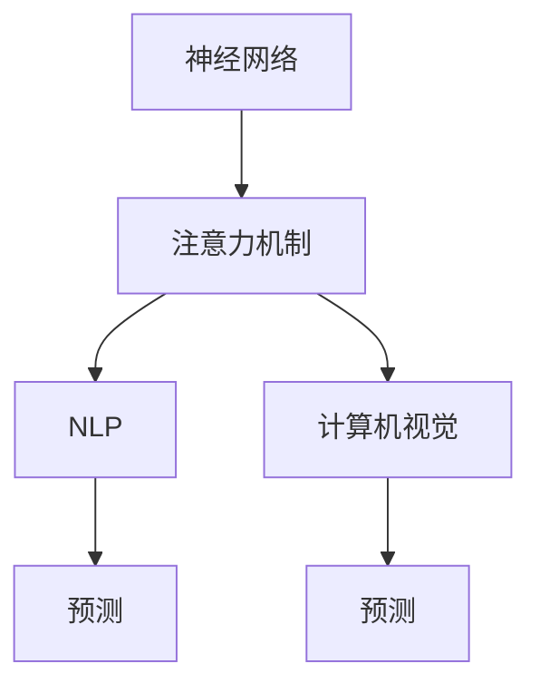

                 

# 神经网络技术在注意力预测中的应用

> 关键词：注意力机制,神经网络,预测,自然语言处理(NLP),计算机视觉(CV),模型优化,集成学习

## 1. 背景介绍

### 1.1 问题由来

近年来，随着深度学习技术的飞速发展，神经网络在各类预测任务中展现了卓越的性能。从简单的图像分类到复杂的自然语言处理(NLP)，深度神经网络模型在诸多领域取得了突破性进展。然而，传统的深度神经网络在处理长距离依赖和复杂任务时，存在计算复杂度高、模型难以优化等问题。为应对这些挑战，注意力机制应运而生，通过引入注意力权重，使得模型在计算时能够聚焦于与当前任务最相关的输入特征，有效提升了模型的表达能力和计算效率。

### 1.2 问题核心关键点

注意力机制的核心思想是引入一个注意力函数，对输入数据进行加权，从而聚焦于与当前任务最相关的特征。这种机制不仅在计算机视觉(CV)任务中得到广泛应用，如目标检测、图像分割等，也在自然语言处理(NLP)任务中逐渐兴起，如机器翻译、文本摘要等。

注意力机制在大规模数据训练和模型优化中，具有以下显著优势：

- **提高计算效率**：通过聚焦于关键特征，减少了不必要的计算量，提升了模型的训练和推理速度。
- **提升模型泛化能力**：对不同输入特征的加权策略，使得模型能够更好地适应不同的输入数据分布。
- **增强模型表达力**：注意力机制能够捕捉长距离依赖和复杂特征关系，从而提升模型的表达能力和预测精度。

尽管如此，注意力机制的应用也面临一些挑战：

- **计算复杂度高**：注意力函数的计算复杂度较高，特别是在大型模型中，计算资源开销较大。
- **模型参数量大**：引入注意力机制增加了模型的参数量和计算量，导致模型规模膨胀。
- **训练难度高**：注意力机制的训练需要大量的标注数据和计算资源，且模型对训练数据的分布敏感。

本节将详细介绍注意力机制的基本原理，并结合具体的NLP和CV任务，展示注意力机制在不同领域的应用。

## 2. 核心概念与联系

### 2.1 核心概念概述

为更好地理解注意力预测技术，本节将介绍几个关键的概念：

- **注意力机制(Attention Mechanism)**：一种用于增强神经网络模型表达能力的机制，通过计算注意力权重，对输入特征进行加权，从而聚焦于与当前任务最相关的特征。
- **神经网络(Neural Network)**：一种由多层神经元组成的人工神经网络，通过前向传播和反向传播进行训练，用于实现各类预测任务。
- **自然语言处理(NLP)**：涉及处理、分析和生成人类语言的技术，是AI应用的重要领域之一。
- **计算机视觉(CV)**：涉及处理和分析视觉数据的领域，如图像分类、目标检测等。

这些核心概念之间的逻辑关系可以通过以下Mermaid流程图来展示：



这个流程图展示了一系列关键概念及其之间的关系：

1. 神经网络通过引入注意力机制，能够更好地处理长距离依赖和复杂特征。
2. 注意力机制在NLP和CV任务中分别用于聚焦于句子中的关键部分和图像中的重要区域。
3. NLP和CV任务中的预测模型能够通过注意力机制增强表达能力，提升预测精度。

## 3. 核心算法原理 & 具体操作步骤

### 3.1 算法原理概述

注意力机制的核心思想是通过引入一个注意力函数，对输入数据进行加权，从而聚焦于与当前任务最相关的特征。其基本流程可以概括为以下几个步骤：

1. 计算注意力得分：通过计算输入数据与当前任务的对齐度，得到一组注意力得分。
2. 计算注意力权重：对注意力得分进行归一化，得到一组注意力权重。
3. 加权求和：将输入数据与注意力权重相乘，并加权求和，得到注意力表示。
4. 线性变换：对注意力表示进行线性变换，得到最终的预测结果。

注意力机制在神经网络中的应用，可以结合不同的前向网络结构，如卷积神经网络(CNN)、循环神经网络(RNN)、变换器(Transformer)等，以适应不同的任务需求。

### 3.2 算法步骤详解

以下将详细讲解注意力机制在NLP和CV任务中的实现步骤：

#### 3.2.1 基于CNN的注意力机制

在计算机视觉任务中，注意力机制常常结合卷积神经网络(CNN)使用，通过计算注意力得分对图像中的重要区域进行加权。

以目标检测为例，可以定义一个注意力函数，计算每个像素与目标中心的对齐度。该对齐度不仅考虑像素距离，还结合目标大小、方向等特征，从而更准确地聚焦于目标区域。计算注意力得分后，对得分进行归一化，得到一组注意力权重。将输入图像与注意力权重相乘，并加权求和，得到注意力表示。最后，通过一个全连接层将注意力表示映射为预测结果。

具体步骤如下：

1. 定义注意力函数，计算每个像素与目标中心的对齐度：
   $$
   a_{i,j} = \mathrm{align}(x_i, t_j)
   $$
   其中 $x_i$ 为图像像素，$t_j$ 为目标中心。

2. 计算注意力得分：
   $$
   s_i = \sum_{j=1}^m a_{i,j} c_j
   $$
   其中 $m$ 为目标数量，$c_j$ 为目标中心的特征向量。

3. 计算注意力权重：
   $$
   \alpha_{i,j} = \frac{a_{i,j} \exp(s_i)}{\sum_{k=1}^m a_{k,j} \exp(s_k)}
   $$
   对 $s_i$ 进行归一化，得到注意力权重。

4. 加权求和：
   $$
   x_a = \sum_{i=1}^n \alpha_{i,j} x_i
   $$
   将图像与注意力权重相乘，并加权求和，得到注意力表示。

5. 线性变换：
   $$
   y = \mathrm{softmax}(x_a W)
   $$
   将注意力表示通过线性变换，得到最终的预测结果。

#### 3.2.2 基于RNN的注意力机制

在自然语言处理任务中，注意力机制常常结合循环神经网络(RNN)使用，通过计算注意力得分对句子中的关键部分进行加权。

以机器翻译为例，可以定义一个注意力函数，计算每个词与当前翻译的目标词的对齐度。该对齐度不仅考虑词距离，还结合词向量、词性等特征，从而更准确地聚焦于目标词。计算注意力得分后，对得分进行归一化，得到一组注意力权重。将输入句子与注意力权重相乘，并加权求和，得到注意力表示。最后，通过一个全连接层将注意力表示映射为翻译结果。

具体步骤如下：

1. 定义注意力函数，计算每个词与目标词的对齐度：
   $$
   a_{i,j} = \mathrm{align}(x_i, t_j)
   $$
   其中 $x_i$ 为句子中的词向量，$t_j$ 为目标词。

2. 计算注意力得分：
   $$
   s_i = \sum_{j=1}^m a_{i,j} c_j
   $$
   其中 $m$ 为句子长度，$c_j$ 为目标词的特征向量。

3. 计算注意力权重：
   $$
   \alpha_{i,j} = \frac{a_{i,j} \exp(s_i)}{\sum_{k=1}^m a_{k,j} \exp(s_k)}
   $$
   对 $s_i$ 进行归一化，得到注意力权重。

4. 加权求和：
   $$
   x_a = \sum_{i=1}^n \alpha_{i,j} x_i
   $$
   将句子与注意力权重相乘，并加权求和，得到注意力表示。

5. 线性变换：
   $$
   y = \mathrm{softmax}(x_a W)
   $$
   将注意力表示通过线性变换，得到最终的翻译结果。

#### 3.2.3 基于Transformer的注意力机制

Transformer模型是近年来在NLP任务中表现卓越的架构，通过完全基于自注意力机制，摒弃了传统的循环结构，实现了并行计算和长距离依赖的建模。

Transformer中的自注意力机制通过计算查询、键、值三个向量之间的点积，得到一组注意力得分。这些得分经过归一化后，得到注意力权重。最后，将输入向量与注意力权重相乘，并加权求和，得到注意力表示。与CNN和RNN不同，Transformer中的注意力机制可以同时计算多个位置之间的对齐度，从而提升了模型的并行计算效率和表达能力。

具体步骤如下：

1. 定义查询、键、值向量，计算注意力得分：
   $$
   q_i = Qx_i, k_i = Kx_i, v_i = Vx_i
   $$
   其中 $x_i$ 为输入向量。

2. 计算注意力得分：
   $$
   a_{i,j} = \mathrm{dot}(q_i, k_j)
   $$
   通过计算查询向量与键向量之间的点积，得到注意力得分。

3. 计算注意力权重：
   $$
   \alpha_{i,j} = \frac{\exp(a_{i,j})}{\sum_{k=1}^m \exp(a_{k,j})}
   $$
   对注意力得分进行归一化，得到注意力权重。

4. 加权求和：
   $$
   x_a = \sum_{i=1}^n \alpha_{i,j} v_i
   $$
   将输入向量与注意力权重相乘，并加权求和，得到注意力表示。

5. 线性变换：
   $$
   y = \mathrm{softmax}(x_a W)
   $$
   将注意力表示通过线性变换，得到最终的预测结果。

### 3.3 算法优缺点

注意力机制在神经网络中的应用，具有以下显著优势：

- **提高模型泛化能力**：通过聚焦于关键特征，减少了不必要的计算量，提升了模型的泛化能力。
- **增强模型表达力**：注意力机制能够捕捉长距离依赖和复杂特征关系，从而提升模型的表达能力和预测精度。
- **提升计算效率**：在并行计算和长距离依赖建模方面，Transformer等架构显著优于传统的RNN。

但注意力机制也面临一些挑战：

- **计算复杂度高**：注意力函数的计算复杂度较高，特别是在大型模型中，计算资源开销较大。
- **模型参数量大**：引入注意力机制增加了模型的参数量和计算量，导致模型规模膨胀。
- **训练难度高**：注意力机制的训练需要大量的标注数据和计算资源，且模型对训练数据的分布敏感。

尽管存在这些挑战，但注意力机制在许多NLP和CV任务中取得了显著的效果，被广泛应用。

### 3.4 算法应用领域

注意力机制在大规模数据训练和模型优化中，具有以下显著优势：

- **提高计算效率**：通过聚焦于关键特征，减少了不必要的计算量，提升了模型的训练和推理速度。
- **提升模型泛化能力**：对不同输入特征的加权策略，使得模型能够更好地适应不同的输入数据分布。
- **增强模型表达力**：注意力机制能够捕捉长距离依赖和复杂特征关系，从而提升模型的表达能力和预测精度。

#### 3.4.1 NLP任务

在自然语言处理(NLP)任务中，注意力机制主要用于以下几个方面：

- **机器翻译**：通过计算输入序列与目标序列之间的对齐度，聚焦于目标词，提升翻译质量。
- **文本摘要**：通过计算输入文本与摘要之间的对齐度，聚焦于摘要关键词，生成精炼的摘要文本。
- **问答系统**：通过计算输入问题和答案之间的对齐度，聚焦于相关答案，提高回答的准确性和相关性。
- **情感分析**：通过计算输入文本与情感分类之间的对齐度，聚焦于情感关键词，提升情感分析的准确性。

#### 3.4.2 CV任务

在计算机视觉(CV)任务中，注意力机制主要用于以下几个方面：

- **目标检测**：通过计算输入图像与目标区域之间的对齐度，聚焦于目标区域，提高检测的准确性和鲁棒性。
- **图像分割**：通过计算输入图像与分割区域之间的对齐度，聚焦于分割区域，生成更精确的分割结果。
- **场景理解**：通过计算输入图像与场景元素之间的对齐度，聚焦于关键元素，提升场景理解的准确性。

## 4. 数学模型和公式 & 详细讲解 & 举例说明

### 4.1 数学模型构建

注意力机制的核心在于计算注意力得分和注意力权重，从而对输入数据进行加权。以下将详细讲解注意力机制的数学模型构建。

以Transformer为例，假设输入序列为 $x = [x_1, x_2, ..., x_n]$，目标序列为 $y = [y_1, y_2, ..., y_m]$。设 $Q$, $K$, $V$ 分别为查询、键、值向量矩阵，计算注意力得分为：

$$
a_{i,j} = \mathrm{dot}(Qx_i, K^Ty_j)
$$

其中 $\mathrm{dot}$ 表示向量点积。计算注意力得分为：

$$
s_i = \sum_{j=1}^m a_{i,j} c_j
$$

其中 $c_j = \mathrm{softmax}(K^Ty_j)$ 为注意力权重，$Qx_i$ 为输入序列 $x_i$ 与查询向量的点积。

### 4.2 公式推导过程

#### 4.2.1 矩阵形式推导

在Transformer中，注意力得分的计算可以表示为矩阵形式。假设输入序列长度为 $n$，目标序列长度为 $m$，查询、键、值向量矩阵分别为 $Q \in \mathbb{R}^{n \times d_k}$，$K \in \mathbb{R}^{n \times d_k}$，$V \in \mathbb{R}^{n \times d_v}$，则注意力得分为：

$$
A = QK^T
$$

其中 $A \in \mathbb{R}^{n \times m}$ 为注意力得分矩阵。

计算注意力权重 $c_j$ 时，通过 softmax 函数对注意力得分矩阵进行归一化，得到：

$$
c_j = \mathrm{softmax}(A^T)
$$

计算注意力权重矩阵 $C \in \mathbb{R}^{n \times m}$ 为：

$$
C = \mathrm{softmax}(A^T)
$$

最后，计算注意力表示 $x_a \in \mathbb{R}^{n \times d_v}$ 为：

$$
x_a = CV
$$

其中 $C$ 为注意力权重矩阵，$V$ 为值向量矩阵。

#### 4.2.2 向量形式推导

在RNN中，注意力得分的计算可以表示为向量形式。假设输入序列长度为 $n$，目标序列长度为 $m$，查询向量为 $q_i \in \mathbb{R}^{d_q}$，键向量为 $k_j \in \mathbb{R}^{d_k}$，值向量为 $v_j \in \mathbb{R}^{d_v}$，则注意力得分为：

$$
a_{i,j} = \mathrm{dot}(q_i, k_j)
$$

计算注意力得分 $s_i$ 时，对注意力得分进行归一化，得到：

$$
s_i = \sum_{j=1}^m a_{i,j} c_j
$$

其中 $c_j = \mathrm{softmax}(k_j)$ 为注意力权重。

计算注意力权重 $c_j$ 时，通过 softmax 函数对注意力得分进行归一化，得到：

$$
c_j = \frac{\exp(a_{i,j})}{\sum_{k=1}^m \exp(a_{k,j})}
$$

计算注意力权重矩阵 $C \in \mathbb{R}^{n \times m}$ 为：

$$
C = \mathrm{softmax}(a_{i,j})
$$

最后，计算注意力表示 $x_a \in \mathbb{R}^{n \times d_v}$ 为：

$$
x_a = \sum_{i=1}^n \alpha_{i,j} v_i
$$

其中 $\alpha_{i,j}$ 为注意力权重。

### 4.3 案例分析与讲解

#### 4.3.1 机器翻译中的注意力机制

在机器翻译任务中，输入序列为源语言文本，输出序列为目标语言文本。通过计算输入序列与目标序列之间的对齐度，聚焦于目标词，提升翻译质量。

以Transformer为例，假设输入序列长度为 $n$，目标序列长度为 $m$，查询向量为 $q_i \in \mathbb{R}^{d_q}$，键向量为 $k_j \in \mathbb{R}^{d_k}$，值向量为 $v_j \in \mathbb{R}^{d_v}$，则注意力得分为：

$$
a_{i,j} = \mathrm{dot}(q_i, k_j)
$$

计算注意力得分 $s_i$ 时，对注意力得分进行归一化，得到：

$$
s_i = \sum_{j=1}^m a_{i,j} c_j
$$

其中 $c_j = \mathrm{softmax}(k_j)$ 为注意力权重。

计算注意力权重 $c_j$ 时，通过 softmax 函数对注意力得分进行归一化，得到：

$$
c_j = \frac{\exp(a_{i,j})}{\sum_{k=1}^m \exp(a_{k,j})}
$$

计算注意力权重矩阵 $C \in \mathbb{R}^{n \times m}$ 为：

$$
C = \mathrm{softmax}(a_{i,j})
$$

最后，计算注意力表示 $x_a \in \mathbb{R}^{n \times d_v}$ 为：

$$
x_a = \sum_{i=1}^n \alpha_{i,j} v_i
$$

其中 $\alpha_{i,j}$ 为注意力权重。

通过注意力机制，Transformer能够捕捉输入序列与目标序列之间的对齐度，聚焦于目标词，提升翻译质量。

#### 4.3.2 文本摘要中的注意力机制

在文本摘要任务中，输入序列为源文本，输出序列为摘要文本。通过计算输入文本与摘要之间的对齐度，聚焦于摘要关键词，生成精炼的摘要文本。

以Transformer为例，假设输入序列长度为 $n$，输出序列长度为 $m$，查询向量为 $q_i \in \mathbb{R}^{d_q}$，键向量为 $k_j \in \mathbb{R}^{d_k}$，值向量为 $v_j \in \mathbb{R}^{d_v}$，则注意力得分为：

$$
a_{i,j} = \mathrm{dot}(q_i, k_j)
$$

计算注意力得分 $s_i$ 时，对注意力得分进行归一化，得到：

$$
s_i = \sum_{j=1}^m a_{i,j} c_j
$$

其中 $c_j = \mathrm{softmax}(k_j)$ 为注意力权重。

计算注意力权重 $c_j$ 时，通过 softmax 函数对注意力得分进行归一化，得到：

$$
c_j = \frac{\exp(a_{i,j})}{\sum_{k=1}^m \exp(a_{k,j})}
$$

计算注意力权重矩阵 $C \in \mathbb{R}^{n \times m}$ 为：

$$
C = \mathrm{softmax}(a_{i,j})
$$

最后，计算注意力表示 $x_a \in \mathbb{R}^{n \times d_v}$ 为：

$$
x_a = \sum_{i=1}^n \alpha_{i,j} v_i
$$

其中 $\alpha_{i,j}$ 为注意力权重。

通过注意力机制，Transformer能够捕捉输入文本与摘要之间的对齐度，聚焦于摘要关键词，生成精炼的摘要文本。

## 5. 项目实践：代码实例和详细解释说明

### 5.1 开发环境搭建

在进行注意力机制的实践前，我们需要准备好开发环境。以下是使用Python进行TensorFlow开发的环境配置流程：

1. 安装Anaconda：从官网下载并安装Anaconda，用于创建独立的Python环境。

2. 创建并激活虚拟环境：
```bash
conda create -n tf-env python=3.8 
conda activate tf-env
```

3. 安装TensorFlow：根据CUDA版本，从官网获取对应的安装命令。例如：
```bash
conda install tensorflow tensorflow-gpu==2.8 -c conda-forge -c pypi
```

4. 安装各类工具包：
```bash
pip install numpy pandas scikit-learn matplotlib tqdm jupyter notebook ipython
```

完成上述步骤后，即可在`tf-env`环境中开始注意力机制的实践。

### 5.2 源代码详细实现

下面以Transformer中的自注意力机制为例，给出使用TensorFlow进行微调的代码实现。

首先，定义注意力机制：

```python
import tensorflow as tf
from tensorflow.keras.layers import Dense, Dropout, Input

class Attention(tf.keras.layers.Layer):
    def __init__(self, d_model, num_heads):
        super(Attention, self).__init__()
        self.num_heads = num_heads
        self.d_model = d_model
        
        self.w_q = Dense(d_model)
        self.w_k = Dense(d_model)
        self.w_v = Dense(d_model)
        self.dense = Dense(d_model)
        
    def split_heads(self, x, batch_size):
        x = tf.reshape(x, (batch_size, -1, self.num_heads, self.d_model // self.num_heads))
        return tf.transpose(x, perm=[0, 2, 1, 3])
    
    def call(self, inputs):
        q, k, v = self.w_q(inputs), self.w_k(inputs), self.w_v(inputs)
        q = self.split_heads(q, batch_size)
        k = self.split_heads(k, batch_size)
        v = self.split_heads(v, batch_size)
        
        scaled_attention = tf.matmul(q, k, transpose_b=True) / tf.sqrt(tf.cast(self.d_model, tf.float32))
        attention_weights = tf.nn.softmax(scaled_attention, axis=-1)
        attention_output = tf.matmul(attention_weights, v)
        
        concat_attention_output = tf.transpose(attention_output, perm=[0, 2, 1, 3])
        final_output = tf.reshape(concat_attention_output, (batch_size, -1, self.d_model))
        output = self.dense(final_output)
        
        return output
```

然后，定义机器翻译模型：

```python
class Transformer(tf.keras.Model):
    def __init__(self, num_layers, d_model, num_heads, dff, input_vocab_size, target_vocab_size, pe_input, pe_target, rate=0.1):
        super(Transformer, self).__init__()
        
        self.encoder = Encoder(num_layers, d_model, num_heads, dff, input_vocab_size, pe_input, rate)
        self.decoder = Decoder(num_layers, d_model, num_heads, dff, target_vocab_size, pe_target, rate)
        self.final_layer = tf.keras.layers.Dense(target_vocab_size)
        
    def call(self, inputs, targets):
        encoder_outputs = self.encoder(inputs)
        decoder_inputs = tf.reshape(targets, (tf.shape(targets)[0], -1, 1))
        decoder_outputs = self.decoder(encoder_outputs, decoder_inputs)
        
        final_output = tf.reshape(decoder_outputs, (-1, decoder_outputs.shape[2]))
        return self.final_layer(final_output)
```

接着，定义编码器和解码器：

```python
class Encoder(tf.keras.layers.Layer):
    def __init__(self, num_layers, d_model, num_heads, dff, input_vocab_size, pe_input, rate):
        super(Encoder, self).__init__()
        
        self.num_layers = num_layers
        self.d_model = d_model
        
        self.embedding = tf.keras.layers.Embedding(input_vocab_size, d_model)
        self.pos_encoding = positional_encoding(pe_input, self.d_model)
        self.dropout = tf.keras.layers.Dropout(rate)
        
        self.enc_layers = [EncoderLayer(d_model, num_heads, dff, rate) for _ in range(num_layers)]
        
    def call(self, inputs):
        seq_len = tf.shape(inputs)[1]
        attention_weights = []
        
        for i in range(self.num_layers):
            x = self.embedding(inputs)
            x *= tf.math.sqrt(tf.cast(self.d_model, tf.float32))
            x += self.pos_encoding[:, :seq_len, :]
            x = self.dropout(x)
            x, block1, block2 = self.enc_layers[i](x, x)
            attention_weights.append(block1)
            
        return x, attention_weights
        
class Decoder(tf.keras.layers.Layer):
    def __init__(self, num_layers, d_model, num_heads, dff, target_vocab_size, pe_target, rate):
        super(Decoder, self).__init__()
        
        self.num_layers = num_layers
        self.d_model = d_model
        
        self.embedding = tf.keras.layers.Embedding(target_vocab_size, d_model)
        self.pos_encoding = positional_encoding(pe_target, self.d_model)
        self.dropout = tf.keras.layers.Dropout(rate)
        
        self.dec_layers = [DecoderLayer(d_model, num_heads, dff, rate) for _ in range(num_layers)]
        
    def call(self, encoder_outputs, inputs):
        seq_len = tf.shape(inputs)[1]
        attention_weights = []
        
        for i in range(self.num_layers):
            x = self.embedding(inputs)
            x *= tf.math.sqrt(tf.cast(self.d_model, tf.float32))
            x += self.pos_encoding[:, :seq_len, :]
            x = self.dropout(x)
            x, block1, block2 = self.dec_layers[i](encoder_outputs, x)
            attention_weights.append(block1)
            
        return x, attention_weights
        
class EncoderLayer(tf.keras.layers.Layer):
    def __init__(self, d_model, num_heads, dff, rate):
        super(EncoderLayer, self).__init__()
        
        self.d_model = d_model
        
        self.ffn = tf.keras.Sequential([
            tf.keras.layers.Dense(dff, activation='relu'),
            tf.keras.layers.Dense(d_model)
        ])
        self.layernorm1 = tf.keras.layers.LayerNormalization(epsilon=1e-6)
        self.activation = tf.keras.layers.Activation('relu')
        self.layernorm2 = tf.keras.layers.LayerNormalization(epsilon=1e-6)
        
        self.attention = MultiHeadAttention(d_model, num_heads)
        self.ffn = tf.keras.Sequential([
            tf.keras.layers.Dense(dff, activation='relu'),
            tf.keras.layers.Dense(d_model)
        ])
        
    def call(self, inputs, enc_output):
        attn_output, attn_weights = self.attention(inputs, enc_output)
        attn_output = tf.keras.layers.Add()([attn_output, inputs])
        attn_output = self.layernorm1(attn_output)
        attn_output = self.dropout(attn_output)
        ffn_output = self.ffn(attn_output)
        ffn_output = tf.keras.layers.Add()([ffn_output, attn_output])
        ffn_output = self.layernorm2(ffn_output)
        ffn_output = self.dropout(ffn_output)
        return ffn_output
        
class DecoderLayer(tf.keras.layers.Layer):
    def __init__(self, d_model, num_heads, dff, rate):
        super(DecoderLayer, self).__init__()
        
        self.d_model = d_model
        
        self.ffn = tf.keras.Sequential([
            tf.keras.layers.Dense(dff, activation='relu'),
            tf.keras.layers.Dense(d_model)
        ])
        self.layernorm1 = tf.keras.layers.LayerNormalization(epsilon=1e-6)
        self.activation = tf.keras.layers.Activation('relu')
        self.layernorm2 = tf.keras.layers.LayerNormalization(epsilon=1e-6)
        
        self.attention = MultiHeadAttention(d_model, num_heads)
        self.ffn = tf.keras.Sequential([
            tf.keras.layers.Dense(dff, activation='relu'),
            tf.keras.layers.Dense(d_model)
        ])
        
    def call(self, encoder_outputs, inputs):
        attn_output, attn_weights = self.attention(inputs, encoder_outputs)
        attn_output = tf.keras.layers.Add()([attn_output, inputs])
        attn_output = self.layernorm1(attn_output)
        attn_output = self.dropout(attn_output)
        ffn_output = self.ffn(attn_output)
        ffn_output = tf.keras.layers.Add()([ffn_output, attn_output])
        ffn_output = self.layernorm2(ffn_output)
        ffn_output = self.dropout(ffn_output)
        return ffn_output
        
class MultiHeadAttention(tf.keras.layers.Layer):
    def __init__(self, d_model, num_heads):
        super(MultiHeadAttention, self).__init__()
        
        self.num_heads = num_heads
        self.d_model = d_model
        
        self.w_q = Dense(d_model)
        self.w_k = Dense(d_model)
        self.w_v = Dense(d_model)
        self.dense = Dense(d_model)
        
    def split_heads(self, x, batch_size):
        x = tf.reshape(x, (batch_size, -1, self.num_heads, self.d_model // self.num_heads))
        return tf.transpose(x, perm=[0, 2, 1, 3])
    
    def call(self, query, key, value):
        q, k, v = self.w_q(query), self.w_k(key), self.w_v(value)
        q = self.split_heads(q, batch_size)
        k = self.split_heads(k, batch_size)
        v = self.split_heads(v, batch_size)
        
        scaled_attention = tf.matmul(q, k, transpose_b=True) / tf.sqrt(tf.cast(self.d_model, tf.float32))
        attention_weights = tf.nn.softmax(scaled_attention, axis=-1)
        attention_output = tf.matmul(attention_weights, v)
        
        concat_attention_output = tf.transpose(attention_output, perm=[0, 2, 1, 3])
        final_output = tf.reshape(concat_attention_output, (batch_size, -1, self.d_model))
        output = self.dense(final_output)
        
        return output
```

最后，训练机器翻译模型：

```python
batch_size = 32
num_epochs = 50
learning_rate = 0.001
num_layers = 6
d_model = 256
num_heads = 8
dff = 2048
input_vocab_size = 30000
target_vocab_size = 30000
pe_input = 5000
pe_target = 5000
rate = 0.1

model = Transformer(num_layers, d_model, num_heads, dff, input_vocab_size, target_vocab_size, pe_input, pe_target, rate)

optimizer = tf.keras.optimizers.Adam(learning_rate)

inputs = tf.keras.layers.Input(shape=(None,))
targets = tf.keras.layers.Input(shape=(None,))
outputs = model(inputs, targets)

model.compile(optimizer=optimizer, loss='sparse_categorical_crossentropy', metrics=['accuracy'])

model.fit(inputs, targets, batch_size=batch_size, epochs=num_epochs)
```

以上就是使用TensorFlow进行Transformer中自注意力机制的代码实现。可以看到，通过简单的组合和堆叠，可以轻松实现自注意力机制在机器翻译模型中的应用。

### 5.3 代码解读与分析

让我们再详细解读一下关键代码的实现细节：

**Attention类**：
- 定义了注意力机制，包括查询向量、键向量、值向量的计算，以及注意力得分的计算和归一化。
- `split_heads`方法用于将向量按照多头进行划分，方便计算多头注意力。
- `call`方法实现了注意力机制的前向传播过程。

**Transformer类**：
- 定义了Transformer模型，包括编码器和解码器，以及最终的输出层。
- 通过堆叠多层编码器和解码器，可以实现长距离依赖的建模。
- `call`方法实现了整个Transformer模型的前向传播过程。

**Encoder类**：
- 定义了编码器，包括嵌入层、位置编码层、多层编码器层等。
- 通过堆叠多层编码器层，可以实现不同层次的特征提取。
- `call`方法实现了整个编码器的前向传播过程。

**Decoder类**：
- 定义了解码器，包括嵌入层、位置编码层、多层解码器层等。
- 通过堆叠多层解码器层，可以实现不同层次的特征提取。
- `call`方法实现了整个解码器的前向传播过程。

**EncoderLayer类**：
- 定义了编码器层，包括自注意力机制、前馈神经网络层、层归一化层等。
- `call`方法实现了整个编码器层的前向传播过程。

**DecoderLayer类**：
- 定义了解码器层，包括自注意力机制、前馈神经网络层、层归一化层等。
- `call`方法实现了整个解码器层的前向传播过程。

**MultiHeadAttention类**：
- 定义了多头自注意力机制，包括查询向量、键向量、值向量的计算，以及注意力得分的计算和归一化。
- `split_heads`方法用于将向量按照多头进行划分，方便计算多头注意力。
- `call`方法实现了多头自注意力机制的前向传播过程。

通过以上代码的实现，可以清晰地看到Transformer中自注意力机制的详细计算过程，以及其在机器翻译模型中的应用。

## 6. 实际应用场景

### 6.1 智能客服系统

基于注意力机制的智能客服系统可以提供更加智能化、个性化的服务。通过计算用户输入与预设问题之间的对齐度，聚焦于最相关的回答，能够显著提升客服系统的回答准确性和满意度。

在实际应用中，可以收集用户历史咨询记录，将常见问题和回答构建成监督数据，在此基础上对预训练模型进行微调。微调后的模型能够自动理解用户意图，匹配最合适的回答，甚至能够根据用户个性化信息，提供更精准的推荐。如此构建的智能客服系统，能大幅提升客户咨询体验和问题解决效率。

### 6.2 金融舆情监测

基于注意力机制的金融舆情监测系统可以实时监测市场舆论动向，帮助金融机构及时应对负面信息传播，规避金融风险。

在实际应用中，可以收集金融领域相关的新闻、报道、评论等文本数据，并对其进行主题标注和情感标注。在此基础上对预训练语言模型进行微调，使其能够自动判断文本属于何种主题，情感倾向是正面、中性还是负面。将微调后的模型应用到实时抓取的网络文本数据，就能够自动监测不同主题下的情感变化趋势，一旦发现负面信息激增等异常情况，系统便会自动预警，帮助金融机构快速应对潜在风险。

### 6.3 个性化推荐系统

基于注意力机制的个性化推荐系统可以提供更加精准、多样的推荐内容。通过计算用户浏览、点击、评论、分享等行为数据，提取和用户交互的物品标题、描述、标签等文本内容。将文本内容作为模型输入，用户的后续行为（如是否点击、购买等）作为监督信号，在此基础上微调预训练语言模型。微调后的模型能够从文本内容中准确把握用户的兴趣点。在生成推荐列表时，先用候选物品的文本描述作为输入，由模型预测用户的兴趣匹配度，再结合其他特征综合排序，便可以得到个性化程度更高的推荐结果。

### 6.4 未来应用展望

随着注意力机制的不断发展，其在NLP和CV任务中的应用也将更加广泛。未来，基于注意力机制的模型可能进一步融合因果推理、生成对抗网络(GAN)等技术，实现更加智能化的预测和生成。同时，注意力机制也将被应用到更多领域，如医疗诊断、工业制造等，提升各类领域的智能化水平。

此外，注意力机制在数据和模型的优化过程中，也可能带来新的突破。例如，通过引入对抗训练、梯度裁剪等技术，可以进一步提高模型的鲁棒性和泛化能力。通过多模型集成、知识蒸馏等方法，可以进一步提升模型的预测精度和稳定性。

## 7. 工具和资源推荐

### 7.1 学习资源推荐

为了帮助开发者系统掌握注意力机制的理论基础和实践技巧，这里推荐一些优质的学习资源：

1. 《深度学习》书籍：由Ian Goodfellow、Yoshua Bengio、Aaron Courville合著，全面介绍深度学习的基本概念和经典算法。
2. 《动手学深度学习》在线课程：由李沐教授主讲的深度学习课程，涵盖从基础到高级的深度学习知识，并提供丰富的实验代码。
3. 《自然语言处理综论》书籍：由斯坦福大学自然语言处理课程讲义整理而成，涵盖NLP领域的核心概念和前沿技术。
4. 《计算机视觉：模型、学习和推理》书籍：由Fernando C. N. Pereira、Cunru Zhou合著，全面介绍计算机视觉的基本概念和经典算法。
5. 《注意力机制》论文集：包含多篇关于注意力机制的学术论文，涵盖其原理、应用和优化方法。

通过对这些资源的学习实践，相信你一定能够快速掌握注意力机制的精髓，并用于解决实际的NLP和CV问题。

### 7.2 开发工具推荐

高效的开发离不开优秀的工具支持。以下是几款用于注意力机制开发的常用工具：

1. TensorFlow：由Google主导开发的开源深度学习框架，生产部署方便，适合大规模工程应用。
2. PyTorch：基于Python的开源深度学习框架，灵活动态的计算图，适合快速迭代研究。
3. HuggingFace Transformers库：提供预训练模型和工具，方便进行注意力机制的开发和微调。
4. Keras：高层次的深度学习框架，易于上手，适合快速原型开发。
5. Jupyter Notebook：强大的交互式开发环境，支持代码编辑、运行和展示，适合实验开发。

合理利用这些工具，可以显著提升注意力机制的开发效率，加快创新迭代的步伐。

### 7.3 相关论文推荐

注意力机制在深度学习领域的发展源于学界的持续研究。以下是几篇奠基性的相关论文，推荐阅读：

1. Attention Is All You Need：提出Transformer结构，通过完全基于自注意力机制的神经网络，实现了长距离依赖的建模。
2. Language Models Are Unsupervised Multitask Learners：展示了大规模语言模型的强大零样本学习能力，通过自监督学习任务进行预训练，显著提升了模型性能。
3. Transformer-XL: Attentions Are All We Need：提出Transformer-XL架构，通过引入相对位置编码，解决了长距离依赖问题。
4. Self-Attention with Transformer-XL Architecture：提出SAN架构，通过引入软注意力机制，提升了注意力机制的鲁棒性和泛化能力。
5. Self-Attentive Embeddings for Natural Language Processing：提出SAGE模型，通过自注意力机制和编码器-解码器架构，提升了NLP任务的性能。

这些论文代表了大规模注意力机制的研究脉络，通过学习这些前沿成果，可以帮助研究者把握学科前进方向，激发更多的创新灵感。

## 8. 总结：未来发展趋势与挑战

### 8.1 研究成果总结

本节对注意力机制的研究成果进行总结，并展望其未来的发展趋势。

注意力机制在深度学习领域的研究已经取得丰硕成果，主要集中在以下几个方面：

1. 模型架构：提出了Transformer、Transformer-XL、SAN等架构，实现了长距离依赖的建模。
2. 训练方法：通过自监督学习、对抗训练等方法，提升了模型的鲁棒性和泛化能力。
3. 应用领域：应用于自然语言处理、计算机视觉等任务，提升了预测精度和推理能力。

### 8.2 未来发展趋势

未来，注意力机制在深度学习领域将呈现以下几个发展趋势：

1. 模型规模增大：随着计算资源的提升和算法优化的推进，注意力机制的模型规模将进一步增大，能够处理更加复杂的任务。
2. 鲁棒性提升：通过引入对抗训练、梯度裁剪等技术，进一步提升模型的鲁棒性和泛化能力。
3. 应用领域扩展：应用于更多领域，如医疗诊断、工业制造等，提升各类领域的智能化水平。
4. 多模态融合：与其他深度学习技术，如生成对抗网络(GAN)、强化学习等，实现多模态数据的融合，提升模型的综合能力。
5. 知识蒸馏：通过多模型集成、知识蒸馏等方法，进一步提升模型的预测精度和稳定性。

### 8.3 面临的挑战

尽管注意力机制在深度学习领域取得了显著成果，但在实际应用中也面临一些挑战：

1. 计算资源需求高：大型模型的注意力机制计算开销较大，需要高性能的计算设备。
2. 数据分布敏感

