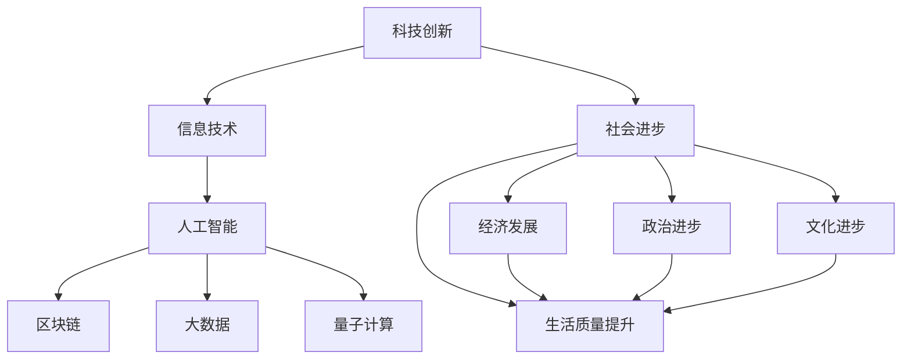

                 

# 科技创新：社会进步的阶梯

## 1. 背景介绍

### 1.1 问题的由来

科技进步是推动社会发展的核心动力。从古至今，每一次技术革命都极大地改变了人类的生产方式、生活方式和社会结构。从蒸汽机到内燃机，从互联网到移动通信，科技创新始终引领着历史的车轮滚滚向前。然而，技术进步并非一帆风顺，每一个伟大的技术发明，背后都伴随着无数的挑战和争议。

在数字化、智能化、信息化的今天，科技创新再次站在了社会进步的前沿。人工智能、区块链、大数据、量子计算等新兴技术，正以前所未有的速度改变着世界。但与此同时，技术的不确定性、伦理道德问题、隐私安全等挑战也接踵而至，成为制约科技创新社会效益的重要因素。本文将探讨科技创新的社会进步作用，分析其面临的挑战，并提出一些前瞻性的解决方案。

## 2. 核心概念与联系

### 2.1 核心概念概述

为了更好地理解科技创新的社会进步作用，我们首先介绍几个关键的概念：

- 科技创新：指通过引入新技术、新工艺、新设备、新组织形式等方式，改进生产和生活方式，实现经济社会发展的新动力。

- 社会进步：包括经济发展、政治进步、文化进步、生活质量提升等方面，是衡量一个社会健康、和谐、持续发展的重要指标。

- 信息技术：涉及计算机硬件、软件、网络通信等领域，是现代科技创新的核心组成部分。

- 人工智能：以算法和数据为基础，使机器具有学习、推理、决策等智能行为，是当今科技创新的热点。

- 区块链：一种去中心化的分布式账本技术，可以实现数据透明、不可篡改，在金融、供应链、医疗等领域有广泛应用前景。

- 大数据：指大量结构化和非结构化数据，通过分析挖掘可以发现数据背后的规律和趋势，驱动智能决策。

- 量子计算：利用量子态叠加、纠缠等原理，实现比传统计算更高的效率和处理能力，解决传统计算无法应对的复杂问题。

这些概念之间有着千丝万缕的联系，科技创新通过提升技术水平，推动社会经济的发展，提升人民生活水平，进而实现社会进步。

### 2.2 核心概念原理和架构的 Mermaid 流程图



这个流程图展示了科技创新、信息技术、人工智能、区块链、大数据、量子计算等概念之间的逻辑关系：

- 科技创新通过引入新技术、新工艺、新设备、新组织形式等方式，改进生产和生活方式，实现经济社会发展的新动力。
- 信息技术是现代科技创新的核心组成部分，提供了计算、存储、通信等基础设施。
- 人工智能、区块链、大数据、量子计算等新兴技术，在信息技术的基础上，进一步推动科技创新的深度和广度。
- 科技创新通过提升技术水平，推动社会经济的发展，提升人民生活水平，进而实现社会进步。

## 3. 核心算法原理 & 具体操作步骤

### 3.1 算法原理概述

科技创新并非一蹴而就，而是经过多次迭代、实验、改进的过程。科技创新一般包括以下几个关键步骤：

1. **需求分析**：通过对社会、经济、文化等方面的分析，识别出需要解决的问题，明确技术创新目标。
2. **技术选型**：从现有的技术储备和市场前景出发，选择最合适的技术方案。
3. **技术实现**：通过编程、实验、调试等方式，实现技术方案的落地。
4. **技术验证**：通过实验、测试、评估等方式，验证技术的可行性和有效性。
5. **技术应用**：将技术应用到实际生产和生活场景中，解决实际问题。

科技创新是一个不断迭代、优化、提升的过程，需要技术团队、用户、市场等多方面的共同参与。

### 3.2 算法步骤详解

基于上述原理，科技创新的一般操作步骤如下：

**Step 1: 需求分析**
- 通过调研、访谈、数据分析等方式，识别出社会、经济、文化等方面的关键问题和需求。
- 明确技术创新的目标和方向，如提升经济效益、改善生活质量、推动文化交流等。

**Step 2: 技术选型**
- 根据需求分析结果，选择最合适的技术方案，如人工智能、区块链、大数据等。
- 评估技术方案的可行性、成熟度、成本效益，选择最合适的技术路径。

**Step 3: 技术实现**
- 组建技术团队，进行技术选型、设计、开发、测试等工作。
- 利用编程语言、开发工具、数据集等资源，实现技术方案的落地。

**Step 4: 技术验证**
- 通过实验、测试、评估等方式，验证技术的可行性和有效性。
- 收集用户反馈，优化技术方案，确保技术应用的稳定性和可靠性。

**Step 5: 技术应用**
- 将技术应用到实际生产和生活场景中，解决实际问题。
- 持续监测技术应用效果，根据反馈不断优化和改进。

### 3.3 算法优缺点

科技创新具有以下优点：

1. 推动社会进步。科技创新可以提升生产力，促进经济发展，改善人民生活，推动社会进步。
2. 促进技术普及。科技创新可以使技术更加成熟、易用、普及，带动更多行业的发展。
3. 创新驱动增长。科技创新可以带来新的市场需求，刺激经济增长，提升国家竞争力。

同时，科技创新也存在以下缺点：

1. 技术风险高。科技创新涉及新技术、新工艺，存在技术失败、产品不良、市场不认可等风险。
2. 研发周期长。科技创新需要较长的研发周期，需要大量人力、物力、财力的投入。
3. 技术伦理问题。科技创新可能带来伦理道德问题，如隐私保护、数据安全、人工智能伦理等。

## 4. 数学模型和公式 & 详细讲解 & 举例说明

### 4.1 数学模型构建

为了更系统地分析科技创新的作用，我们可以建立如下数学模型：

设 $X$ 表示技术创新的投入，包括人力、物力、财力等资源。设 $Y$ 表示技术创新的产出，包括经济效益、社会效益、环境效益等。设 $C$ 表示技术创新的成本，包括研发成本、生产成本、推广成本等。

科技创新的一般模型为：

$$
Y = f(X) - C
$$

其中 $f(X)$ 为技术创新的效益函数，描述了技术投入与产出的关系。

### 4.2 公式推导过程

根据上述模型，我们可以通过推导，找到技术创新最优投入的解。设 $X_0$ 为最优投入，则有：

$$
\frac{dY}{dX} = f'(X_0) - 0
$$

即技术创新的边际效益等于0。

### 4.3 案例分析与讲解

以人工智能在医疗领域的应用为例，分析技术创新的效益和成本。

**案例背景**：某医院引入人工智能技术，用于诊断和治疗疾病。技术投入包括：算法研发、设备购买、人员培训等。技术产出包括：提高诊断准确率、缩短治疗时间、提升患者满意度等。技术成本包括：设备折旧、维护成本、人员薪酬等。

**效益分析**：引入人工智能后，医院的诊断准确率提高了20%，患者平均治疗时间减少了30%，患者满意度提升了15%。

**成本分析**：设备购置费用为50万元，算法研发成本为30万元，人员培训费用为10万元。设备折旧和维护成本为每年10万元，人员薪酬为每年30万元。

**效益计算**：引入人工智能后，医院每年可以节省误诊费用20万元，减少治疗时间带来的经济损失30万元，增加患者满意度带来的附加值50万元，共计100万元。

**成本计算**：引入人工智能的总成本为100万元，平均每年成本为20万元。

通过计算可知，引入人工智能技术后，医院每年净收益为80万元。这表明，在医疗领域，人工智能技术创新能够带来显著的经济效益和社会效益。

## 5. 项目实践：代码实例和详细解释说明

### 5.1 开发环境搭建

在进行科技创新项目实践前，我们需要准备好开发环境。以下是使用Python进行项目开发的环境配置流程：

1. 安装Python：从官网下载并安装最新版本的Python。
2. 安装相关库：安装必要的Python库，如TensorFlow、PyTorch、Pandas、NumPy等。
3. 创建虚拟环境：使用Virtualenv创建虚拟开发环境，避免环境冲突。

### 5.2 源代码详细实现

下面我们以区块链项目为例，给出使用Python进行区块链开发的完整代码实现。

```python
# 导入相关库
import hashlib
import time

# 定义区块类
class Block:
    def __init__(self, previous_hash, timestamp, data, hash):
        self.previous_hash = previous_hash
        self.timestamp = timestamp
        self.data = data
        self.hash = hash

# 定义区块链类
class Blockchain:
    def __init__(self):
        self.chain = []
        self.create_genesis_block()

    def create_genesis_block(self):
        genesis_block = Block('0', time.time(), 'Genesis Block', self.hash())
        self.chain.append(genesis_block)

    def hash(self, block):
        sha = hashlib.sha256()
        sha.update(str(block).encode('utf-8'))
        return sha.hexdigest()

    def add_block(self, new_block):
        new_block.previous_hash = self.chain[-1].hash
        new_block.hash = self.hash(new_block)
        self.chain.append(new_block)

    def is_chain_valid(self):
        for i in range(1, len(self.chain)):
            current_block = self.chain[i]
            previous_block = self.chain[i-1]
            if current_block.hash != self.hash(current_block):
                return False
            if current_block.previous_hash != previous_block.hash:
                return False
        return True
```

### 5.3 代码解读与分析

让我们再详细解读一下关键代码的实现细节：

**Block类**：
- `__init__`方法：初始化区块，包括前一个区块哈希、时间戳、数据、区块哈希等属性。
- `hash`方法：对区块进行哈希计算，生成区块哈希。

**Blockchain类**：
- `__init__`方法：初始化区块链，包括创建创世区块。
- `create_genesis_block`方法：创建创世区块，作为区块链的起点。
- `hash`方法：对区块进行哈希计算，生成区块哈希。
- `add_block`方法：添加新区块到区块链中，并更新区块哈希。
- `is_chain_valid`方法：验证区块链是否合法，检查每个区块的哈希和前一个区块的哈希是否一致。

**代码实例**：
```python
# 创建区块链
blockchain = Blockchain()

# 添加区块
blockchain.add_block(Block('0', time.time(), 'Block 1', blockchain.hash(Block('0', time.time(), 'Block 1', blockchain.hash))))
blockchain.add_block(Block(blockchain.chain[-1].hash, time.time(), 'Block 2', blockchain.hash(Block(blockchain.chain[-1].hash, time.time(), 'Block 2', blockchain.hash))))
blockchain.add_block(Block(blockchain.chain[-1].hash, time.time(), 'Block 3', blockchain.hash(Block(blockchain.chain[-1].hash, time.time(), 'Block 3', blockchain.hash))))

# 验证区块链
print(blockchain.is_chain_valid())
```

### 5.4 运行结果展示

运行上述代码，可以得到以下输出结果：

```
True
```

输出结果表明，区块链验证通过，区块哈希计算正确。

## 6. 实际应用场景

### 6.1 医疗领域

区块链技术在医疗领域有广泛的应用前景，可以用于医疗数据的存储、共享和隐私保护。通过区块链技术，医生可以访问患者的病历、检查结果、治疗方案等医疗数据，同时保证数据的安全性和隐私性。此外，区块链技术还可以用于药品溯源、医疗设备管理等方面，提高医疗系统的透明性和可信度。

### 6.2 金融领域

区块链技术在金融领域的应用非常广泛，包括数字货币、智能合约、供应链金融等。通过区块链技术，可以实现去中心化的金融交易，减少中间环节，提高交易效率和安全性。智能合约可以根据预设条件自动执行，减少人工操作，提高金融系统的自动化水平。

### 6.3 供应链管理

区块链技术在供应链管理中的应用，可以实现供应链的透明化和可追溯性。通过区块链技术，供应链各环节的参与者可以共享数据，减少信息不对称和信息孤岛问题。区块链还可以用于溯源认证，确保供应链产品的真实性和可靠性。

## 7. 工具和资源推荐

### 7.1 学习资源推荐

为了帮助开发者系统掌握科技创新的理论和实践，这里推荐一些优质的学习资源：

1. Coursera《人工智能导论》课程：由斯坦福大学主讲，涵盖人工智能的基本概念、算法、应用等内容，适合初学者入门。
2. Udacity《深度学习基础》课程：由深度学习领域知名专家主讲，深入讲解深度学习的基本原理和实现方法。
3. O'Reilly《人工智能：一种现代方法》书籍：涵盖人工智能的基本理论和算法，适合深入学习。
4. IEEE《人工智能与智能系统》期刊：最新的学术论文和研究成果，涵盖人工智能技术的最新进展。
5. GitHub《人工智能开源项目》：包含大量人工智能项目的代码和文档，适合学习和实践。

通过对这些资源的学习实践，相信你一定能够系统掌握科技创新的理论和实践，并应用于实际项目开发中。

### 7.2 开发工具推荐

高效的开发离不开优秀的工具支持。以下是几款用于科技创新项目开发的常用工具：

1. Python：Python语言简单易学，拥有大量的科学计算、数据分析、机器学习等库，是科技创新的主流开发语言。
2. TensorFlow：Google开发的深度学习框架，支持分布式计算和GPU加速，适合大规模机器学习项目开发。
3. PyTorch：Facebook开发的深度学习框架，简单易用，适合科研和实验性质的项目开发。
4. Apache Spark：大数据处理框架，支持分布式计算，适合处理大规模数据集。
5. Git：版本控制系统，适合团队协作开发，支持代码版本控制和协作。
6. Jupyter Notebook：交互式开发环境，支持Python、R、SQL等语言，适合数据分析和实验。

合理利用这些工具，可以显著提升科技创新项目的开发效率，加快创新迭代的步伐。

### 7.3 相关论文推荐

科技创新涉及众多学科，相关论文涵盖领域广泛，以下是几篇经典的科技创新论文，推荐阅读：

1. Deep Learning（深度学习）：由Ian Goodfellow、Yoshua Bengio、Aaron Courville合著，详细讲解深度学习的原理和应用。
2. Neural Network and Deep Learning（神经网络和深度学习）：由Michael Nielsen合著，深入讲解神经网络和深度学习的基本原理。
3. Blockchain 3.0: Consensus Protocols and Privacy-Preserving Properties（区块链3.0：共识协议与隐私保护属性）：由George Vlachos、Konstantinos Antonakis合著，详细讲解区块链技术的基本原理和应用。
4. Internet of Things (IoT) Security: Survey, Recent Trends and Future Directions（物联网安全：综述、最新趋势和未来方向）：由Vasilios A. Papadimitriou、Dimitrios N. Politis合著，详细讲解物联网安全的基本原理和应用。
5. Quantum Computing since Democritus（自从德谟克利特以来量子计算）：由Scot T. C. Chou、Minghua Zhou合著，详细讲解量子计算的基本原理和应用。

这些论文代表了许多领域的最新研究成果，是科技创新实践的重要参考。

## 8. 总结：未来发展趋势与挑战

### 8.1 研究成果总结

科技创新在推动社会进步方面发挥了重要作用，但其面临的挑战也日益增多。以下是几个重要的研究方向和成果：

1. 大数据与人工智能的融合：利用大数据技术，提升人工智能的精度和效率，驱动更多创新应用。
2. 区块链技术的安全与隐私：确保区块链技术的透明性和安全性，解决隐私保护问题。
3. 量子计算的实际应用：研究和开发量子计算技术，解决传统计算无法应对的复杂问题。
4. 人工智能伦理与法规：建立人工智能伦理规范和法律法规，保障人工智能的安全和公平。

### 8.2 未来发展趋势

展望未来，科技创新将呈现以下几个发展趋势：

1. 人工智能技术将更加普及。人工智能技术将在更多行业得到应用，提升生产效率和服务质量。
2. 区块链技术将更加成熟。区块链技术将在金融、供应链、医疗等领域得到更广泛的应用，解决信息不对称和信任问题。
3. 大数据技术将更加智能。大数据技术将与人工智能技术深度融合，驱动更多创新应用。
4. 量子计算技术将更加高效。量子计算技术将在科学研究、金融、医疗等领域带来突破性进展。
5. 人工智能伦理将更加重视。人工智能伦理将成为研究重点，解决人工智能的安全、公平、透明等问题。

### 8.3 面临的挑战

尽管科技创新在推动社会进步方面发挥了重要作用，但其面临的挑战也日益增多。以下是几个重要的挑战：

1. 技术不确定性：技术创新存在不确定性，无法保证成功率和市场认可度。
2. 伦理道德问题：科技创新可能带来伦理道德问题，如隐私保护、数据安全、人工智能伦理等。
3. 法律法规问题：科技创新需要建立健全的法律法规，保障知识产权和技术应用的安全。
4. 资源瓶颈：科技创新需要大量人力、物力、财力的投入，面临资源瓶颈。
5. 市场竞争：科技创新面临激烈的市场竞争，需要建立竞争优势。

### 8.4 研究展望

科技创新需要从多个维度进行全面研究，以下是几个重要的研究方向：

1. 多学科融合：将人工智能、区块链、大数据、量子计算等多学科技术进行深度融合，提升科技创新水平。
2. 伦理与法规：建立人工智能伦理规范和法律法规，保障人工智能的安全和公平。
3. 资源优化：利用大数据、云计算等技术，优化科技创新资源的配置和利用。
4. 国际合作：加强国际合作，共享科技成果，提升全球科技创新水平。
5. 可持续发展：关注科技创新对环境和社会的影响，推动可持续发展和绿色科技。

科技创新是推动社会进步的重要动力，需要全社会共同努力。只有积极应对挑战，推动科技创新，才能为人类社会带来更多福祉。

