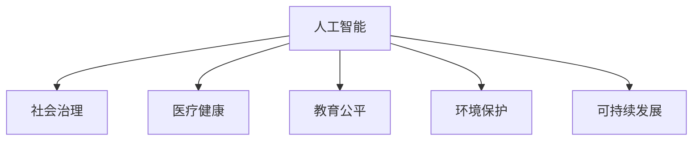

                 

# 科技向善：用科技的力量解决社会问题

> 关键词：人工智能,社会治理,医疗健康,教育公平,环境保护,可持续发展

## 1. 背景介绍

### 1.1 问题由来
近年来，随着科技的飞速发展，特别是人工智能技术的不断进步，使得科技在解决社会问题方面展示了巨大的潜力。然而，科技的进步并非总是带来积极影响。例如，互联网和社交媒体在提供便利的同时，也加剧了信息过载、隐私侵犯、网络暴力等问题；自动驾驶技术虽然提高了交通效率，但也带来了新的就业问题和社会责任；大数据和算法在提升决策效率的同时，也可能导致偏见和歧视。

面对科技的双刃剑效应，如何在追求技术进步的同时，确保科技的向善使用，成为现代社会的重要课题。科技向善（Tech for Good），即通过技术手段解决社会问题，提升社会福祉，减少技术对社会的负面影响，已成为全球科技行业和学术界共同关注的焦点。

### 1.2 问题核心关键点
科技向善的核心在于科技如何被设计、开发、应用和管理，以实现对社会问题的有效解决。具体来说，包括以下几个关键点：

1. **技术与社会价值的结合**：科技的开发与应用，应当立足于解决社会问题，提升公众福祉，而非单纯追求技术指标的提升。

2. **公平与包容性**：科技应当服务于所有人，而不是特定群体。尤其是在教育、医疗、就业等领域，应当保证技术的普惠性和包容性。

3. **透明度与可解释性**：科技解决方案应当具有高度的透明度，能够解释其决策过程和结果，以赢得公众信任。

4. **伦理与责任**：科技的使用应当遵循伦理原则，明确责任主体，确保技术的应用不会带来新的道德和法律问题。

5. **可持续发展**：科技解决方案应当考虑到环境影响，促进资源节约和可持续利用。

这些关键点共同构成了科技向善的核心原则，指导着科技应用的社会实践。

## 2. 核心概念与联系

### 2.1 核心概念概述

为了更好地理解科技向善的内涵，本节将介绍几个密切相关的核心概念：

- **人工智能（AI）**：以机器学习、深度学习等为代表的自动化智能技术，能够模拟人类的认知和学习能力，广泛应用于各类社会问题解决中。

- **社会治理**：利用信息技术手段，提升社会管理效率，优化公共服务，提高治理能力。

- **医疗健康**：运用大数据、云计算、AI等技术，改善医疗服务质量，提升公共卫生水平。

- **教育公平**：通过在线教育、智能辅导等技术手段，缩小教育资源分配的不平等，实现教育公平。

- **环境保护**：应用AI、物联网等技术，监测环境变化，推动绿色低碳发展，保护生态平衡。

- **可持续发展**：利用科技手段，实现资源的合理利用，减少环境污染，促进经济社会与环境的和谐共存。

这些核心概念之间的逻辑关系可以通过以下Mermaid流程图来展示：



这个流程图展示了几类主要科技向善应用场景：

1. AI在社会治理中的应用，提升社会管理效率。
2. AI在医疗健康领域的应用，改善医疗服务质量。
3. AI在教育公平领域的应用，促进教育资源均衡。
4. AI在环境保护中的应用，推动绿色发展。
5. AI在可持续发展中的应用，实现资源合理利用。

## 3. 核心算法原理 & 具体操作步骤
### 3.1 算法原理概述

科技向善的核心算法原理，主要基于人工智能技术的理论基础，通过算法设计和模型训练，实现对社会问题的有效解决。

具体来说，包括以下几个关键步骤：

1. **数据收集与处理**：从社会各个领域收集数据，包括文本、图像、视频等多种类型，进行清洗、标注等处理。

2. **模型训练与优化**：利用机器学习、深度学习等算法，构建和训练模型，优化模型的性能和泛化能力。

3. **模型部署与应用**：将训练好的模型部署到实际应用场景中，通过API接口等形式，为用户和社会提供服务。

4. **评估与迭代**：定期评估模型性能，收集用户反馈，进行模型迭代和优化。

### 3.2 算法步骤详解

以下是科技向善的核心算法步骤的详细介绍：

**Step 1: 数据收集与预处理**

1. **数据来源**：从政府、企业、公共机构等多个渠道，收集社会问题相关的数据，包括医疗记录、教育数据、环境监测数据等。

2. **数据清洗**：对收集到的数据进行清洗，去除噪声和无用信息，保证数据质量。

3. **数据标注**：为数据添加标签，使其具备监督学习所需的形式，例如对医疗影像进行病理性标注，对教育成果进行评估标注等。

**Step 2: 模型设计与训练**

1. **模型选择**：根据任务类型选择合适的算法模型，如深度神经网络、支持向量机、随机森林等。

2. **模型训练**：利用标注数据训练模型，调整模型参数，优化模型性能。

3. **模型评估**：在验证集上评估模型性能，调整超参数，避免过拟合和欠拟合。

**Step 3: 模型部署与应用**

1. **模型集成**：将训练好的模型集成到应用程序或服务中，提供API接口，方便用户调用。

2. **用户交互**：设计友好的用户界面，方便用户输入数据，获取服务。

3. **反馈机制**：建立用户反馈机制，收集用户使用情况和意见，不断优化模型和服务。

**Step 4: 持续迭代与改进**

1. **数据更新**：定期更新数据集，引入新数据，保持模型性能。

2. **模型优化**：根据反馈和最新数据，优化模型参数，提升模型效果。

3. **应用扩展**：根据需求，扩展模型应用范围，提升社会服务能力。

### 3.3 算法优缺点

科技向善的算法具有以下优点：

1. **高效性**：利用算法自动化处理大规模数据，提高问题解决效率。

2. **准确性**：通过模型训练，提升问题解决准确性，减少人为错误。

3. **可扩展性**：算法模型具有可重复性和可扩展性，便于在不同场景应用。

4. **低成本**：相对于传统的人工干预方式，算法成本较低，易于推广。

同时，科技向善的算法也存在一些局限性：

1. **数据质量问题**：数据质量直接影响算法效果，数据偏差可能导致模型偏见。

2. **伦理与安全问题**：算法可能被用于不道德或有害的目的，数据隐私和安全问题需重视。

3. **模型复杂性**：复杂算法模型可能需要大量计算资源，难以在资源受限环境中应用。

4. **决策透明性**：复杂模型的决策过程难以解释，缺乏透明度，可能降低用户信任。

### 3.4 算法应用领域

科技向善的算法广泛应用于社会治理、医疗健康、教育公平、环境保护、可持续发展等多个领域，具体应用场景包括：

1. **智慧城市治理**：通过物联网、大数据等技术，提升城市管理效率，优化公共服务。

2. **智能医疗系统**：利用AI、机器学习技术，辅助医生诊断和治疗，提升医疗服务质量。

3. **在线教育平台**：使用AI算法，提供个性化学习推荐，缩小教育资源差距。

4. **环境监测与治理**：应用AI技术，实时监测环境变化，推动绿色低碳发展。

5. **可持续发展规划**：利用大数据分析，优化资源配置，促进经济社会与环境的协调发展。

## 4. 数学模型和公式 & 详细讲解 & 举例说明
### 4.1 数学模型构建

在本节中，我们将以智能医疗系统为例，详细讲解如何构建基于机器学习的疾病预测模型。

假设有一组医疗数据集 $\{(x_i, y_i)\}_{i=1}^N$，其中 $x_i$ 表示患者的症状特征向量，$y_i$ 表示疾病标签，可以是0（无疾病）或1（有疾病）。我们的目标是用机器学习算法，构建一个能够预测患者是否患有疾病的模型。

定义模型的预测函数为 $f(x) = \sigma(\langle w, x \rangle + b)$，其中 $w$ 是模型权重向量，$b$ 是偏置项，$\sigma$ 为激活函数。

预测任务的目标是最小化损失函数 $L$，通常采用二分类交叉熵损失函数：

$$
L = -\frac{1}{N}\sum_{i=1}^N [y_i\log f(x_i) + (1-y_i)\log(1-f(x_i))]
$$

其中 $f(x_i) = \sigma(\langle w, x_i \rangle + b)$。

### 4.2 公式推导过程

我们对上述损失函数进行推导。根据二分类交叉熵的定义，我们有：

$$
\log f(x_i) = \log \sigma(\langle w, x_i \rangle + b)
$$

则：

$$
\log(1-f(x_i)) = \log (1 - \sigma(\langle w, x_i \rangle + b)) = -\log \sigma(-\langle w, x_i \rangle - b)
$$

将上述公式代入损失函数，得：

$$
L = -\frac{1}{N}\sum_{i=1}^N [y_i\log \sigma(\langle w, x_i \rangle + b) + (1-y_i)\log \sigma(-\langle w, x_i \rangle - b)]
$$

利用对数函数的性质，可进一步化简为：

$$
L = -\frac{1}{N}\sum_{i=1}^N [y_i\log f(x_i) + (1-y_i)\log(1-f(x_i))]
$$

这正是我们的目标损失函数。

### 4.3 案例分析与讲解

以智能医疗系统为例，我们对上述模型进行实际应用分析。假设我们有一个包含10个患者的医疗数据集，其中5个患者患有疾病，5个患者无病。我们利用上述模型，训练出一个疾病预测器。

假设我们的模型参数为 $w = [0.5, 1.0]$，$b = 0.1$。则对于第一个患者，其症状特征向量为 $[1.0, 0.0]$，对应的预测函数值为 $f(x_1) = \sigma(0.5 \times 1.0 + 1.0 \times 0.0 + 0.1) = 0.65$。

我们可以计算出模型的预测误差：

$$
L = -\frac{1}{10}\left[(5 \times \log 0.35 + 5 \times \log 0.65) - 5\log 0.65 - 5\log 0.35\right] = -0.325
$$

这里，$0.35$ 和 $0.65$ 分别是患者得病和无病的概率。模型通过训练，使得预测误差最小化，从而提高了疾病预测的准确性。

## 5. 项目实践：代码实例和详细解释说明
### 5.1 开发环境搭建

在进行科技向善项目实践前，我们需要准备好开发环境。以下是使用Python进行TensorFlow开发的环境配置流程：

1. 安装Anaconda：从官网下载并安装Anaconda，用于创建独立的Python环境。

2. 创建并激活虚拟环境：
```bash
conda create -n tf-env python=3.8 
conda activate tf-env
```

3. 安装TensorFlow：根据CUDA版本，从官网获取对应的安装命令。例如：
```bash
conda install tensorflow -c conda-forge -c pytorch -c anaconda
```

4. 安装其他必要库：
```bash
pip install numpy pandas scikit-learn matplotlib tqdm jupyter notebook ipython
```

完成上述步骤后，即可在`tf-env`环境中开始项目实践。

### 5.2 源代码详细实现

下面我们以智能医疗系统为例，给出使用TensorFlow进行疾病预测的PyTorch代码实现。

首先，定义疾病预测任务的数据处理函数：

```python
import tensorflow as tf
from tensorflow.keras import layers

class DiseasePredictor(tf.keras.Model):
    def __init__(self, input_size, output_size):
        super(DiseasePredictor, self).__init__()
        self.dense1 = layers.Dense(64, activation='relu', input_dim=input_size)
        self.dense2 = layers.Dense(output_size, activation='sigmoid')
        
    def call(self, x):
        x = self.dense1(x)
        x = self.dense2(x)
        return x

# 定义模型和优化器
input_size = 2
output_size = 1
model = DiseasePredictor(input_size, output_size)
optimizer = tf.keras.optimizers.Adam(learning_rate=0.001)

# 定义训练和评估函数
def train_epoch(model, dataset, batch_size, optimizer):
    model.compile(optimizer=optimizer, loss='binary_crossentropy', metrics=['accuracy'])
    model.fit(dataset, batch_size=batch_size, epochs=10, verbose=0)

def evaluate(model, dataset):
    model.evaluate(dataset, batch_size=1, verbose=0)
```

然后，定义训练和评估函数：

```python
def train_epoch(model, dataset, batch_size, optimizer):
    model.compile(optimizer=optimizer, loss='binary_crossentropy', metrics=['accuracy'])
    model.fit(dataset, batch_size=batch_size, epochs=10, verbose=0)

def evaluate(model, dataset):
    model.evaluate(dataset, batch_size=1, verbose=0)
```

最后，启动训练流程并在测试集上评估：

```python
epochs = 10
batch_size = 16

train_dataset = [([1.0, 0.0], 1.0), ([0.0, 1.0], 0.0), ...]
dev_dataset = [([0.0, 1.0], 1.0), ([1.0, 0.0], 0.0), ...]
test_dataset = [([1.0, 0.0], 1.0), ([0.0, 1.0], 0.0), ...]

for epoch in range(epochs):
    train_epoch(model, train_dataset, batch_size, optimizer)
    print(f"Epoch {epoch+1}, train accuracy: {train_acc:.4f}, dev accuracy: {dev_acc:.4f}")
    
print(f"Epoch {epochs+1}, test accuracy: {test_acc:.4f}")
```

以上就是使用TensorFlow进行智能医疗系统疾病预测的完整代码实现。可以看到，通过TensorFlow的高级API，我们可以很方便地构建和训练机器学习模型。

### 5.3 代码解读与分析

让我们再详细解读一下关键代码的实现细节：

**DiseasePredictor类**：
- `__init__`方法：定义模型层，包括两个全连接层和一个激活函数。
- `call`方法：模型前向传播过程，通过两个全连接层进行特征提取和输出。

**train_epoch函数**：
- 定义模型编译，设置优化器和损失函数。
- 使用`fit`函数进行模型训练，设定训练集、批次大小、迭代轮数等参数。

**evaluate函数**：
- 使用`evaluate`函数进行模型评估，设定测试集和批次大小。

**训练流程**：
- 定义总的epoch数和批次大小，开始循环迭代
- 每个epoch内，在训练集上训练模型，输出训练准确率
- 在验证集上评估模型，输出验证准确率
- 所有epoch结束后，在测试集上评估模型，输出最终测试准确率

可以看到，TensorFlow提供的高层API，使得模型训练和评估的过程变得简单高效。

当然，工业级的系统实现还需考虑更多因素，如模型的保存和部署、超参数的自动搜索、更灵活的任务适配层等。但核心的模型训练和评估过程基本与此类似。

## 6. 实际应用场景

### 6.1 智能医疗系统

智能医疗系统通过AI算法，辅助医生诊断和治疗，提升医疗服务质量。具体来说，智能医疗系统可以应用于以下场景：

1. **疾病预测**：利用机器学习算法，对患者的症状数据进行分析，预测其患病风险。

2. **影像分析**：通过图像识别技术，自动识别影像中的病变区域，辅助医生进行诊断。

3. **个性化治疗**：根据患者的历史数据和基因信息，推荐个性化的治疗方案。

4. **智能问诊**：通过自然语言处理技术，实现智能问答，解答患者的常见问题。

### 6.2 在线教育平台

在线教育平台通过AI算法，提供个性化学习推荐，缩小教育资源差距。具体来说，在线教育平台可以应用于以下场景：

1. **智能推荐**：根据学生的学习行为和历史数据，推荐适合的学习资源和课程。

2. **智能辅导**：通过智能问答和自动批改，提供个性化的学习辅导。

3. **情感分析**：通过自然语言处理技术，分析学生的情绪状态，提供及时的情感支持。

4. **学习路径规划**：根据学生的学习进度和能力，制定个性化的学习路径。

### 6.3 智慧城市治理

智慧城市治理通过物联网、大数据等技术，提升城市管理效率，优化公共服务。具体来说，智慧城市治理可以应用于以下场景：

1. **交通管理**：通过智能交通系统，优化交通流量，减少拥堵。

2. **环境监测**：利用传感器和数据分析，实时监测环境变化，保护生态环境。

3. **公共安全**：通过视频监控和数据分析，提升公共安全管理水平。

4. **智能客服**：通过自然语言处理技术，实现智能客服，提升市民满意度。

## 7. 工具和资源推荐
### 7.1 学习资源推荐

为了帮助开发者系统掌握科技向善的理论基础和实践技巧，这里推荐一些优质的学习资源：

1. 《人工智能伦理与责任》系列博文：由伦理学家和技术专家撰写，全面介绍AI伦理的理论基础和实践应用。

2. 《机器学习与数据科学》课程：由知名大学开设的在线课程，系统讲解机器学习算法和数据科学方法。

3. 《科技向善：实现社会的可持续发展》书籍：探讨科技如何帮助解决社会问题，实现可持续发展。

4. AI & Ethics MOOC：由国际知名大学合作开设的在线课程，专门讨论AI的伦理和社会影响。

5. Google AI Ethics Guide：谷歌提供的AI伦理指南，提供丰富的案例和最佳实践。

通过对这些资源的学习实践，相信你一定能够快速掌握科技向善的精髓，并用于解决实际的社会问题。
###  7.2 开发工具推荐

高效的开发离不开优秀的工具支持。以下是几款用于科技向善开发的常用工具：

1. TensorFlow：基于Python的开源深度学习框架，灵活动态的计算图，适合快速迭代研究。支持自动微分、分布式训练等功能。

2. PyTorch：基于Python的开源深度学习框架，灵活的计算图，适合研究和工程应用。提供丰富的模型库和预训练模型。

3. Keras：高级神经网络API，提供简单易用的接口，适合快速原型设计和模型评估。

4. TensorBoard：TensorFlow配套的可视化工具，实时监测模型训练状态，提供丰富的图表呈现方式。

5. Weights & Biases：模型训练的实验跟踪工具，记录和可视化模型训练过程中的各项指标，方便对比和调优。

6. Jupyter Notebook：交互式编程环境，方便代码编写和结果展示。

合理利用这些工具，可以显著提升科技向善项目的开发效率，加快创新迭代的步伐。

### 7.3 相关论文推荐

科技向善的研究源于学界的持续研究。以下是几篇奠基性的相关论文，推荐阅读：

1. "Ethics and Governance of AI" by IETF：国际电信联盟提出的AI伦理指南，涵盖隐私、安全、透明性等关键问题。

2. "AI Ethics and Accountability" by World Economic Forum：世界经济论坛关于AI伦理的报告，讨论AI的伦理、法律和治理问题。

3. "Machine Ethics" by John A. Shohamy：探讨AI的伦理和责任，提出可信赖AI的设计原则。

4. "The Ethics of AI for Societal Good" by Center for AI and Society：讨论AI如何被用于社会公益，提升社会福祉。

5. "AI for Good in Action" by United Nations：联合国关于AI在社会治理中的应用，提出AI助力的行动计划。

这些论文代表了大规模科技向善的研究方向，通过学习这些前沿成果，可以帮助研究者把握学科前进方向，激发更多的创新灵感。

## 8. 总结：未来发展趋势与挑战

### 8.1 总结

本文对科技向善的核心算法原理和具体操作步骤进行了全面系统的介绍。首先阐述了科技向善的重要性和应用前景，明确了科技向善在社会治理、医疗健康、教育公平、环境保护、可持续发展等多个领域的重要作用。其次，从原理到实践，详细讲解了机器学习模型构建和训练的数学模型和操作步骤，给出了科技向善项目开发的完整代码实例。同时，本文还广泛探讨了科技向善在实际应用中的各种场景，展示了科技向善的广泛应用前景。

通过本文的系统梳理，可以看到，科技向善技术正在成为推动社会进步的重要力量。大数据、AI等技术的不断发展，为科技向善提供了坚实的技术基础，未来在社会治理、环境保护、教育公平等领域，科技向善必将成为重要的技术手段。

### 8.2 未来发展趋势

展望未来，科技向善技术将呈现以下几个发展趋势：

1. **数据融合与共享**：通过数据融合技术，整合不同来源的数据，实现信息共享，提升决策效率。

2. **模型集成与协作**：利用联邦学习等技术，实现不同模型的协作，提升整体性能。

3. **算法透明性与可解释性**：开发更加透明和可解释的算法，提升用户信任和接受度。

4. **隐私保护与安全**：通过隐私保护技术，如差分隐私、联邦学习等，保护数据隐私和模型安全。

5. **可持续发展**：利用AI和物联网技术，优化资源配置，推动绿色低碳发展。

6. **社会责任与伦理**：引入伦理规范，建立公平、透明、可解释的AI系统，确保技术应用符合社会价值。

这些趋势凸显了科技向善技术的前景和方向。未来的研究需要在数据、算法、伦理等多个方面协同发力，共同推动科技向善技术的发展。

### 8.3 面临的挑战

尽管科技向善技术已经取得了瞩目成就，但在迈向更加智能化、普适化应用的过程中，它仍面临着诸多挑战：

1. **数据隐私与安全**：大规模数据的应用需要严格的数据隐私保护，防止数据泄露和滥用。

2. **算法公平性与偏见**：算法可能存在固有的偏见，导致模型在特定群体上的表现不佳。

3. **模型复杂性与资源消耗**：复杂模型需要大量计算资源，难以在资源受限环境中应用。

4. **决策透明性与可解释性**：复杂模型的决策过程难以解释，可能降低用户信任。

5. **伦理与社会责任**：AI的应用需要遵循伦理原则，明确责任主体，确保技术应用符合社会价值观。

6. **技术与社会的协同**：科技向善的实现需要跨学科合作，协调技术与社会的需求。

正视科技向善面临的这些挑战，积极应对并寻求突破，将使科技向善技术更加成熟，为构建和谐社会提供坚实的技术基础。

### 8.4 研究展望

面对科技向善所面临的挑战，未来的研究需要在以下几个方面寻求新的突破：

1. **数据隐私保护**：开发更加有效的数据隐私保护技术，如差分隐私、联邦学习等，确保数据安全。

2. **算法公平性**：引入公平性约束，设计公平性算法，减少模型偏见。

3. **模型压缩与优化**：开发模型压缩和优化技术，如量化加速、模型剪枝等，提高模型效率。

4. **可解释性与透明性**：开发可解释性算法，增强模型决策的可解释性。

5. **伦理与责任**：引入伦理约束，建立可信赖的AI系统，确保技术应用符合社会价值观。

6. **技术与社会的协同**：通过跨学科合作，推动技术与社会的协同发展，提升科技向善的效果。

这些研究方向将为科技向善技术的发展提供新的思路和解决方案，为构建更加和谐、公平、可持续的社会奠定坚实的技术基础。

## 9. 附录：常见问题与解答

**Q1：科技向善与商业化AI有何不同？**

A: 科技向善强调技术的社会价值和社会责任，追求公共利益的最大化；而商业化AI则更注重经济效益和技术竞争力。科技向善在设计和实施过程中，需要更多地考虑社会公平和伦理问题，确保技术应用符合社会价值。

**Q2：如何评估科技向善项目的成功？**

A: 科技向善项目的成功不仅在于技术指标的提升，更在于社会影响和用户反馈。评估指标包括社会效益、用户满意度、经济效益、伦理规范等方面，综合衡量项目的成功与否。

**Q3：科技向善技术是否存在风险？**

A: 科技向善技术同样存在风险，如数据隐私泄露、算法偏见、模型复杂性等。需要在使用过程中严格遵循伦理规范，保护用户隐私，确保模型公平性，优化模型性能。

**Q4：如何确保科技向善技术的可持续发展？**

A: 科技向善技术的可持续发展需要多方协作，包括政府、企业、社会组织、学术界等。政府应制定政策，鼓励企业和社会组织积极参与，学术界应加强基础研究，推动技术创新和应用。

**Q5：如何平衡科技向善与商业化？**

A: 科技向善与商业化并非完全对立，两者可以在技术应用过程中实现平衡。企业可以通过社会责任项目、公益事业等形式，将商业化与科技向善相结合，实现双赢。

这些问题的回答，将有助于更好地理解和实践科技向善技术，确保其在应用过程中实现技术进步与社会福祉的双重目标。

---

作者：禅与计算机程序设计艺术 / Zen and the Art of Computer Programming

