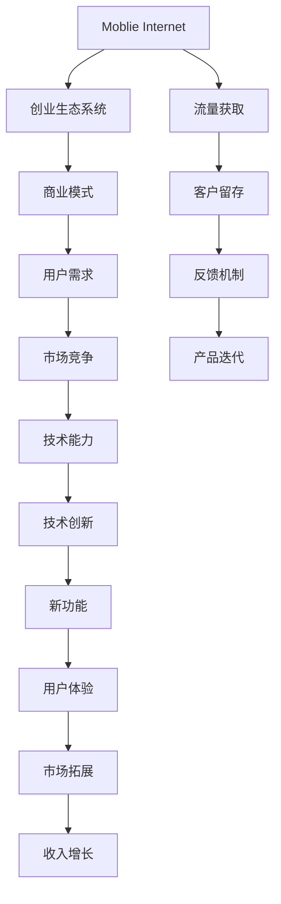

                 

# 移动互联网创业：口袋里的商业帝国

## 1. 背景介绍

### 1.1 问题由来
移动互联网的浪潮正席卷全球，改变了人们的生活方式和商业模式。在5G、物联网等技术的推动下，移动互联网已不仅仅是简单的信息传递，而是成为了一个全方位、多维度的生态系统。传统的商业形态、服务模式都在经历深刻的变革，新的商业机会不断涌现。然而，在如此复杂多变的商业环境中，很多初创企业面临着极大的挑战：如何快速捕捉市场机会、如何精准定位用户需求、如何整合多方资源、如何制定有效策略？

### 1.2 问题核心关键点
移动互联网创业的核心在于找到符合市场需求、能够快速迭代和优化的商业模式。这一过程通常需要创业团队具备敏锐的市场洞察力、卓越的技术能力和强大的执行力。与此同时，还需要对用户需求、竞争态势、行业趋势等关键因素有深入理解和预判。只有在这几方面实现均衡发展，才能构建起成功的移动互联网帝国。

### 1.3 问题研究意义
研究移动互联网创业的方法和模式，对初创企业和从业者有着重要意义：

1. 加速创业进程。通过系统的学习和实践，创业者能够快速构建有竞争力的商业模式，缩短市场进入时间。
2. 提升决策效率。借助科学的分析工具和模型，创业者可以更好地理解市场动态和用户行为，做出更为精准的决策。
3. 优化资源配置。合理分配资金、人力、技术等资源，在有限的成本下实现最大的市场影响力。
4. 构建生态系统。建立多元化的合作伙伴关系，形成良性互动的商业生态，增强企业生命力。
5. 赋能产业升级。移动互联网创业不仅推动了自身发展，还带动了整个产业的升级和创新，促进了数字经济的发展。

## 2. 核心概念与联系

### 2.1 核心概念概述

为了更好地理解移动互联网创业的本质，本节将介绍几个关键概念及其关联：

- **移动互联网**：一种基于移动通信网络的互联网应用，提供随时随地、无缝连接的通信服务。
- **创业生态系统**：指围绕创业企业构建的多元化合作网络，包括投资者、用户、合作伙伴等。
- **商业模式**：企业通过何种方式盈利和创造价值，包括产品/服务、客户、渠道、收益模式等。
- **用户需求**：指消费者在使用产品/服务时的实际需求和心理预期，是商业模式设计的出发点和落脚点。
- **市场竞争**：指市场中企业间的竞争态势，包括直接竞争和间接竞争。
- **技术能力**：指企业开发和维护产品/服务的核心技术水平。

这些核心概念之间的逻辑关系可以通过以下Mermaid流程图来展示：



这个流程图展示了一个典型的移动互联网创业生态系统及其关键要素：

1. 移动互联网络是创业的基础设施，支撑着商业模式的实现和运营。
2. 商业模式设计需要围绕用户需求展开，并通过市场竞争确立优势。
3. 技术能力是实现商业模式的基石，同时驱动产品和服务的迭代升级。
4. 流量获取、客户留存和反馈机制构成客户关系管理的闭环。
5. 技术创新和新功能开发持续提升用户体验和市场竞争力。

## 3. 核心算法原理 & 具体操作步骤
### 3.1 算法原理概述

移动互联网创业的本质在于构建一个快速响应市场变化、能够不断进化和优化的商业生态系统。在这一过程中，算法的有效应用至关重要，通过数据分析和决策优化，企业能够在竞争激烈的市场中脱颖而出。

**算法目标**：优化商业模式，提升用户体验，增强市场竞争力，实现收入增长。

**关键算法**：包括市场分析算法、用户行为分析算法、流量获取算法、客户留存算法、反馈机制算法等。

### 3.2 算法步骤详解

基于移动互联网创业的算法模型构建，一般包括以下几个关键步骤：

**Step 1: 数据收集与处理**
- 收集相关数据，如市场规模、用户行为、竞争对手信息等。
- 对数据进行清洗、筛选、标准化，去除噪音和异常点。

**Step 2: 数据分析与建模**
- 使用统计学和机器学习方法对数据进行分析建模，识别市场趋势和用户需求。
- 建立多变量回归模型、分类模型、聚类模型等，预测用户行为和市场变化。

**Step 3: 决策优化与策略制定**
- 基于分析结果制定商业策略，包括市场定位、产品设计、价格策略、推广方案等。
- 采用决策树、线性规划、优化算法等工具，辅助制定最优策略。

**Step 4: 执行与监控**
- 将优化后的策略执行到实际运营中，并持续监控效果。
- 根据监控结果调整策略，形成反馈迭代机制，确保策略持续优化。

### 3.3 算法优缺点

基于移动互联网创业的算法模型具有以下优点：
1. 数据驱动：通过大数据分析，可以精准把握市场趋势和用户需求，实现更高效的决策。
2. 灵活迭代：算法模型具有较强的适应性，能够根据市场变化快速调整策略，保持竞争力。
3. 量化决策：通过数学模型辅助决策，减少主观偏差，提高决策的科学性。

然而，这些算法模型也存在一些局限：
1. 数据依赖性高：算法模型的效果很大程度上取决于数据的全面性和准确性。
2. 模型复杂度：高阶算法模型的构建和维护成本较高，需要较强的技术背景。
3. 风险不确定性：数据驱动的决策可能存在统计偏差，导致决策失误。
4. 道德和隐私问题：算法的应用需要充分考虑用户隐私保护和伦理道德问题。

尽管存在这些局限性，但算法模型在移动互联网创业中的作用不可替代，是实现商业成功的关键工具。未来相关研究应着重于提升算法的易用性和普适性，降低使用门槛，增强算法的透明性和可信度。

### 3.4 算法应用领域

基于移动互联网创业的算法模型，已经在多个领域取得了显著的应用成效：

- **市场分析与预测**：通过市场规模、增长率、用户行为等数据，预测行业发展趋势，辅助投资决策。
- **用户行为分析**：分析用户访问路径、使用习惯、转化率等数据，优化产品设计和用户体验。
- **流量获取与运营**：通过搜索引擎优化(SEO)、内容营销、社交媒体推广等方式，获取目标用户，提高流量转化率。
- **客户留存与流失分析**：建立客户关系管理系统(CRM)，分析客户流失原因，优化客户留存策略。
- **产品迭代与创新**：结合用户反馈和市场变化，快速推出新产品，优化现有产品功能。

## 4. 数学模型和公式 & 详细讲解 & 举例说明

### 4.1 数学模型构建

在移动互联网创业中，算法模型的构建通常包括以下几个关键部分：

- **市场规模分析**：计算市场总规模、增长率、渗透率等指标。
- **用户行为建模**：建立用户访问路径、使用频率、消费行为等模型的预测模型。
- **竞争态势分析**：分析竞争对手的市场份额、产品优势、价格策略等。

### 4.2 公式推导过程

以用户行为分析为例，我们假设用户每日访问次数为 $X$，用户留存率为 $P$，流失率为 $Q$。则用户行为模型的公式推导如下：

$$
P = \frac{N - D}{N}
$$

其中 $N$ 为初始用户数，$D$ 为流失用户数，$P$ 为用户留存率。

根据马尔科夫链模型，用户访问次数的概率分布 $X$ 可表示为：

$$
P(X_i = x) = \binom{n}{x} p^x (1-p)^{n-x}
$$

其中 $n$ 为日均访问次数，$p$ 为单日访问概率。

### 4.3 案例分析与讲解

以某社交平台为例，平台日活跃用户数为 5000 万，日均新增用户数为 1000 万。根据历史数据，用户流失率为 5%，预测未来一个月的日活跃用户数。

假设用户流失率为 5%，即 $Q=0.05$。则用户留存率 $P$ 为：

$$
P = \frac{N - D}{N} = \frac{5000 - 1000 \times 0.05}{5000} = 0.95
$$

根据用户行为模型，每天新增用户的访问次数 $X$ 可表示为：

$$
P(X_i = x) = \binom{n}{x} p^x (1-p)^{n-x}
$$

其中 $n=1000$，$p=0.95$。设 $x=200$，则：

$$
P(X_i = 200) = \binom{1000}{200} (0.95)^{200} (1-0.95)^{800} \approx 0.16
$$

即每天新增用户中有 16% 的用户访问次数为 200 次。

## 5. 项目实践：代码实例和详细解释说明

### 5.1 开发环境搭建

在进行移动互联网创业的算法实践前，我们需要准备好开发环境。以下是使用Python进行Pandas和Scikit-learn开发的工具环境配置流程：

1. 安装Anaconda：从官网下载并安装Anaconda，用于创建独立的Python环境。

2. 创建并激活虚拟环境：
```bash
conda create -n pyenv python=3.8 
conda activate pyenv
```

3. 安装Pandas和Scikit-learn：
```bash
conda install pandas scikit-learn
```

4. 安装各类工具包：
```bash
pip install numpy matplotlib plotly
```

完成上述步骤后，即可在`pyenv`环境中开始移动互联网创业的算法实践。

### 5.2 源代码详细实现

下面以流量获取算法为例，给出使用Pandas和Scikit-learn对用户行为数据进行流量获取的PyTorch代码实现。

首先，定义用户行为数据处理函数：

```python
import pandas as pd
from sklearn.model_selection import train_test_split

def load_and_process_data():
    # 加载数据
    df = pd.read_csv('user_behavior.csv')
    
    # 数据清洗
    df = df.dropna()
    df = df.drop_duplicates()
    
    # 特征工程
    df['day_of_week'] = df['timestamp'].dt.dayofweek
    df['hour'] = df['timestamp'].dt.hour
    df['month'] = df['timestamp'].dt.month
    
    # 划分训练集和测试集
    X_train, X_test, y_train, y_test = train_test_split(df[['day_of_week', 'hour', 'month']], df['user_count'], test_size=0.2, random_state=42)
    
    return X_train, X_test, y_train, y_test
```

然后，定义流量获取模型：

```python
from sklearn.ensemble import RandomForestRegressor

class UserBehaviorModel:
    def __init__(self):
        self.model = RandomForestRegressor()
        
    def fit(self, X, y):
        self.model.fit(X, y)
        
    def predict(self, X):
        return self.model.predict(X)
```

接着，定义训练和评估函数：

```python
from sklearn.metrics import mean_squared_error
import numpy as np

def train_model(model, X_train, y_train):
    model.fit(X_train, y_train)
    return model

def evaluate_model(model, X_test, y_test):
    y_pred = model.predict(X_test)
    mse = mean_squared_error(y_test, y_pred)
    return mse
```

最后，启动训练流程并在测试集上评估：

```python
X_train, X_test, y_train, y_test = load_and_process_data()
model = UserBehaviorModel()
model = train_model(model, X_train, y_train)
mse = evaluate_model(model, X_test, y_test)
print(f'Test MSE: {mse:.2f}')
```

以上就是使用Pandas和Scikit-learn对用户行为数据进行流量获取的完整代码实现。可以看到，得益于Scikit-learn强大的封装能力，我们可以用相对简洁的代码完成用户行为模型的训练和评估。

### 5.3 代码解读与分析

让我们再详细解读一下关键代码的实现细节：

**load_and_process_data函数**：
- 加载用户行为数据，进行数据清洗和特征工程，去除缺失值和重复值。
- 划分训练集和测试集，确保模型在未见过的数据上测试性能。

**UserBehaviorModel类**：
- 定义随机森林回归模型，用于预测用户流量。
- 训练模型和预测模型性能，通过MSE指标评估模型效果。

**train_model和evaluate_model函数**：
- 训练函数对模型进行拟合，返回训练好的模型。
- 评估函数对模型在测试集上进行性能评估，输出MSE指标。

**训练流程**：
- 定义训练和评估函数，加载数据，创建模型实例。
- 调用训练函数拟合模型，返回训练好的模型。
- 调用评估函数在测试集上评估模型性能，输出MSE指标。

可以看到，Pandas和Scikit-learn使得移动互联网创业的算法实践变得简洁高效。开发者可以将更多精力放在数据处理、模型改进等高层逻辑上，而不必过多关注底层的实现细节。

当然，工业级的系统实现还需考虑更多因素，如模型的保存和部署、超参数的自动搜索、更灵活的模型适配层等。但核心的算法思想基本与此类似。

## 6. 实际应用场景

### 6.1 社交平台流量获取

基于用户行为数据的流量获取算法，可以广泛应用于社交平台的流量运营。传统流量获取依赖于广告投放和内容推荐，但往往成本高、效果有限。通过数据分析和模型预测，社交平台可以更精准地识别高潜用户，进行定向推广和内容推送，提升流量转化率。

具体而言，可以收集用户的历史访问数据、活跃时间、内容互动等信息，建立用户行为模型。模型预测每个用户在指定时间段的访问概率，结合广告投放和内容推荐策略，最大化广告效果和内容曝光率。如此构建的流量获取系统，能大幅提升社交平台的流量转化率和广告ROI。

### 6.2 电商平台的个性化推荐

电商平台需要不断吸引新用户和保持老用户粘性。传统的推荐系统往往依赖用户历史行为数据，难以满足实时性和个性化需求。基于用户行为数据的推荐算法，可以更好地捕捉用户兴趣和行为规律，实现个性化推荐。

在实践中，可以收集用户浏览、点击、购买等行为数据，提取商品标题、描述、标签等文本内容。将文本内容作为模型输入，用户的后续行为（如是否点击、购买等）作为监督信号，在此基础上微调预训练语言模型。微调后的模型能够从文本内容中准确把握用户的兴趣点。在生成推荐列表时，先用候选商品标题作为输入，由模型预测用户的兴趣匹配度，再结合其他特征综合排序，便可以得到个性化程度更高的推荐结果。

### 6.3 互联网金融的风险控制

互联网金融领域风险控制至关重要。传统风险控制依赖人工审核，效率低、成本高。基于用户行为数据的风险控制算法，可以实时监测用户行为，预测违约概率，实现精准的风险控制。

具体而言，可以收集用户在平台上的一系列行为数据，如借款金额、还款记录、操作行为等，构建用户行为模型。模型预测用户的违约概率，结合信贷政策，制定相应的风险控制策略。如此构建的风险控制系统，能显著降低金融风险，保障平台健康运营。

### 6.4 未来应用展望

随着移动互联网的不断演进，基于用户行为数据的算法模型将在更多领域得到应用，为传统行业带来变革性影响。

在智慧医疗领域，基于用户行为数据的健康管理算法，可以实时监测用户健康状况，预测疾病风险，辅助医生制定诊疗方案。在教育领域，算法可以分析学生的学习行为，推荐适合的课程和教材，提高学习效果。在金融领域，算法可以实时分析交易行为，识别异常交易，避免欺诈风险。

未来，随着数据技术的持续发展，基于用户行为数据的算法模型将展现出更广泛的应用前景。得益于大数据、人工智能等技术手段的不断进步，算法模型将变得更加智能、高效，为各行各业提供更精准、实时的决策支持。

## 7. 工具和资源推荐

### 7.1 学习资源推荐

为了帮助开发者系统掌握移动互联网创业的算法基础和实践技巧，这里推荐一些优质的学习资源：

1. 《机器学习实战》系列博文：由著名机器学习专家撰写，深入浅出地介绍了机器学习的基本概念和常用算法。

2. CS229《机器学习》课程：斯坦福大学开设的机器学习经典课程，系统讲解机器学习的基本原理和应用案例。

3. 《Python数据科学手册》书籍：全面介绍了Python在数据科学和机器学习中的应用，包括Pandas、Scikit-learn等工具库。

4. Kaggle：全球最大的数据科学竞赛平台，提供了大量经典数据集和比赛，助力开发者提升实战能力。

5. Coursera：提供多门优秀的数据科学和机器学习课程，包括经典教材和实用技巧。

通过对这些资源的学习实践，相信你一定能够快速掌握移动互联网创业的算法精髓，并用于解决实际的商业问题。

### 7.2 开发工具推荐

高效的开发离不开优秀的工具支持。以下是几款用于移动互联网创业开发的常用工具：

1. Python：基于Python的开源语言，具有丰富的科学计算和机器学习库。

2. Jupyter Notebook：交互式数据科学和机器学习开发环境，支持代码块、图表和注释。

3. TensorBoard：TensorFlow配套的可视化工具，可实时监测模型训练状态，并提供丰富的图表呈现方式。

4. Weights & Biases：模型训练的实验跟踪工具，可以记录和可视化模型训练过程中的各项指标，方便对比和调优。

5. Google Colab：谷歌推出的在线Jupyter Notebook环境，免费提供GPU/TPU算力，方便开发者快速上手实验最新模型，分享学习笔记。

合理利用这些工具，可以显著提升移动互联网创业的开发效率，加快创新迭代的步伐。

### 7.3 相关论文推荐

移动互联网创业的算法发展源于学界的持续研究。以下是几篇奠基性的相关论文，推荐阅读：

1. Random Forests by Breiman：介绍随机森林算法，经典机器学习算法之一。

2. Gradient Boosting Machines：提出梯度提升树算法，高效处理分类和回归问题。

3. Deep Learning with Random Initialization：介绍深度学习算法，包括神经网络和反向传播。

4. The Google Brain Machine Learning Engineering Team：介绍Google Brain团队的机器学习工程实践，包括模型部署和优化。

这些论文代表了大数据算法的发展脉络。通过学习这些前沿成果，可以帮助研究者把握学科前进方向，激发更多的创新灵感。

## 8. 总结：未来发展趋势与挑战

### 8.1 总结

本文对移动互联网创业的算法方法和应用进行了全面系统的介绍。首先阐述了移动互联网创业的背景和核心概念，明确了算法在构建商业生态、优化商业模式、提升用户体验等方面的重要作用。其次，从原理到实践，详细讲解了移动互联网创业算法的构建流程和关键步骤，给出了项目实践的完整代码实现。同时，本文还广泛探讨了算法模型在社交平台流量获取、电商平台推荐、互联网金融风险控制等多个领域的应用前景，展示了算法的巨大潜力。此外，本文精选了移动互联网创业的各类学习资源，力求为读者提供全方位的技术指引。

通过本文的系统梳理，可以看到，移动互联网创业的算法模型在构建商业生态、优化商业模式、提升用户体验等方面具有重要价值。在数据技术不断进步的今天，算法模型正逐步成为移动互联网创业的关键工具，帮助企业在复杂多变的市场环境中把握机会，实现商业成功。

### 8.2 未来发展趋势

展望未来，移动互联网创业的算法模型将呈现以下几个发展趋势：

1. 算法自动化：未来的算法将更强调自动化和可解释性，通过自动化的特征选择和模型优化，提升算法的效率和效果。
2. 数据融合：大数据技术的发展将使得更多跨领域、跨模态的数据得以融合，为算法提供更丰富的信息。
3. 联邦学习：联邦学习算法可以实现数据分散、模型集中，保护用户隐私，提升算法的安全性。
4. 实时计算：实时计算技术的发展将使得算法能够更快速、高效地处理海量数据，满足实时性需求。
5. 模型压缩：算法模型需要在大规模硬件设备上运行，模型压缩技术将有助于降低存储和计算成本。

这些趋势凸显了移动互联网创业算法的广阔前景。这些方向的探索发展，必将进一步提升算法的效率和效果，为移动互联网创业提供更强大的技术支持。

### 8.3 面临的挑战

尽管移动互联网创业的算法模型已经取得了显著成效，但在迈向更加智能化、普适化应用的过程中，它仍面临着诸多挑战：

1. 数据隐私保护：算法模型依赖大量用户数据，如何在保证用户隐私的前提下，充分利用数据价值，是一个重要难题。
2. 模型解释性：算法的决策过程往往缺乏可解释性，难以对其推理逻辑进行分析和调试。
3. 公平性和公正性：算法可能存在数据偏见，导致不公平或歧视性的输出结果，如何设计公平、公正的算法模型，需要更多研究。
4. 鲁棒性问题：算法模型面对复杂多变的数据分布，容易产生过拟合或欠拟合，如何提高算法的鲁棒性，确保其在各种环境下的性能稳定，仍是一个难题。
5. 计算资源需求：大规模数据和复杂算法的处理需要高性能计算资源，如何降低计算成本，提升算法的可扩展性，是工业应用中的一大挑战。

### 8.4 研究展望

面对移动互联网创业算法面临的种种挑战，未来的研究需要在以下几个方面寻求新的突破：

1. 引入更多跨领域、跨模态数据：通过数据融合技术，将更多维度的数据与算法模型结合，提升算法的决策能力和泛化性能。
2. 开发更具解释性的算法模型：通过可视化工具、可解释性技术，提升算法的透明性和可解释性，增强用户信任。
3. 设计公平、公正的算法模型：通过数据预处理、算法优化，减少数据偏见，确保算法的公平性和公正性。
4. 增强算法的鲁棒性和可扩展性：通过数据增强、模型压缩等技术，提高算法的鲁棒性，降低计算成本，提升算法的可扩展性。
5. 构建自适应算法系统：通过自动调参、模型优化等技术，构建能够根据环境变化自动调整的算法系统，确保算法的性能和效果。

这些研究方向的探索，必将引领移动互联网创业算法的持续进步，为构建智能、高效、公平的商业生态提供重要技术支撑。总之，移动互联网创业的算法模型需要不断创新、优化，才能适应快速变化的市场环境，推动技术进步和产业升级。

## 9. 附录：常见问题与解答

**Q1：如何选择合适的流量获取算法？**

A: 流量获取算法的选择应根据业务场景和数据特点进行，一般需要考虑以下几个因素：
1. 数据规模：数据量大时，可以选择复杂的模型，如随机森林、梯度提升树等。数据量小时，可以选择简单的模型，如线性回归、逻辑回归等。
2. 数据类型：如果数据为非结构化数据，如文本、图像等，可以选择基于深度学习的模型，如卷积神经网络、循环神经网络等。如果数据为结构化数据，如表格、时间序列等，可以选择基于统计模型的算法，如线性回归、ARIMA等。
3. 数据质量：数据质量好、噪声少时，可以选择基于统计的算法，如线性回归、决策树等。数据质量差、噪声多时，可以选择基于深度学习的算法，如神经网络、随机森林等。

**Q2：流量获取算法如何评估效果？**

A: 流量获取算法的评估主要通过以下指标进行：
1. 准确率（Accuracy）：模型预测正确的比例，适用于分类问题。
2. 召回率（Recall）：实际为正的样本中被模型正确预测的比例，适用于分类问题。
3. 精确率（Precision）：模型预测为正的样本中实际为正的比例，适用于分类问题。
4. F1值（F1-score）：精确率和召回率的调和平均值，适用于分类问题。
5. 均方误差（Mean Squared Error）：预测值与实际值之差的平方和的均值，适用于回归问题。

一般采用交叉验证（Cross Validation）和测试集（Test Set）进行模型评估。通过评估结果，调整算法参数和特征工程策略，进一步提升算法效果。

**Q3：如何处理数据偏置问题？**

A: 数据偏置问题可以通过以下几个方法进行处理：
1. 数据清洗：去除或处理异常值、噪声、重复数据等，提升数据质量。
2. 特征工程：通过数据转换、归一化等方法，减少特征之间的相关性，提升模型泛化能力。
3. 模型优化：引入正则化、集成学习等技术，降低模型过拟合风险，提高模型的公平性和公正性。
4. 公平性算法：设计公平性算法，减少模型中的数据偏见，确保输出结果的公平性和公正性。

这些方法可以帮助我们处理数据偏置问题，提升算法的可靠性和鲁棒性。

**Q4：如何实现高效的流量获取算法？**

A: 实现高效的流量获取算法需要考虑以下几个方面：
1. 算法优化：通过算法优化技术，如模型压缩、剪枝、量化等，减少模型复杂度和计算量。
2. 数据优化：通过数据增强、数据采样等方法，提升数据质量，减少计算量。
3. 硬件优化：通过硬件加速技术，如GPU、TPU、FPGA等，提升计算速度和效率。
4. 分布式计算：通过分布式计算技术，将计算任务分布到多个设备上，提升计算效率和可扩展性。

这些优化方法可以帮助我们实现高效的流量获取算法，提升算法的计算能力和运行速度。

**Q5：如何构建智能化的移动互联网创业生态？**

A: 构建智能化的移动互联网创业生态，需要从以下几个方面入手：
1. 用户需求分析：通过数据分析和用户调研，准确把握用户需求和市场趋势，制定合理的商业策略。
2. 产品设计优化：结合用户需求和市场竞争，不断优化产品设计，提升用户体验。
3. 算法模型优化：通过数据融合、算法优化等技术，提升算法的决策能力和泛化性能，满足市场变化和用户需求。
4. 合作伙伴协同：与合作伙伴建立深度合作关系，共享数据和资源，实现共同发展。
5. 用户反馈机制：建立用户反馈机制，持续收集用户意见，优化产品和服务。

这些方法可以帮助我们构建智能化的移动互联网创业生态，实现持续创新和市场突破。

---

作者：禅与计算机程序设计艺术 / Zen and the Art of Computer Programming

