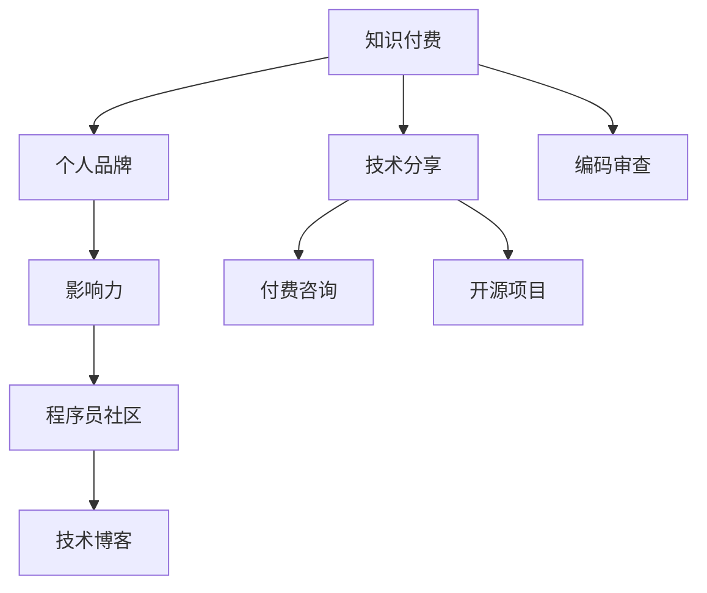

                 

# 程序员利用知识付费打造个人影响力

> 关键词：知识付费, 个人品牌, 影响力, 程序员, 数字经济, 教育技术

## 1. 背景介绍

在数字经济的浪潮下，知识付费市场正以爆炸性的速度增长。越来越多的人愿意为获取专业知识和技能支付费用，这为那些拥有丰富知识和经验的程序员提供了一个崭新的舞台。在这个舞台，程序员不仅可以分享自己的技术见解，还能通过知识付费打造个人品牌，扩大自己的影响力。

### 1.1 知识付费的市场现状

随着在线教育和职业培训的普及，知识付费市场逐渐成熟并蓬勃发展。根据Statista的数据，2021年全球在线教育市场规模已经超过2000亿美元，而知识付费作为其重要组成部分，也在不断扩大。根据《2020年中国知识付费行业报告》，中国知识付费市场规模在2018年就已经突破了60亿元人民币。

知识付费的形式多种多样，包括在线课程、咨询服务、技术博客、付费问答等。这种模式不仅为创作者带来了可观的经济收益，也促进了知识的传播和应用，推动了技术创新和社会进步。

### 1.2 程序员与知识付费的结合

程序员凭借其在编程、算法、数据结构等方面的专业知识和经验，成为知识付费市场的重要参与者。通过建立个人品牌，分享技术见解，程序员不仅能获得经济回报，还能提升自己的影响力，扩大自己的职业发展机会。

编程教育、技术咨询、代码审查、知识分享等都是程序员常见的知识付费形式。特别是在开源社区中，程序员通过撰写技术文章、开源项目和参与技术讨论，积累了大量的人气和信任，为知识付费提供了坚实的基础。

## 2. 核心概念与联系

### 2.1 核心概念概述

为了更好地理解程序员如何利用知识付费打造个人影响力，本节将介绍几个关键概念：

- **知识付费**：指用户为获取专业知识和技能而支付费用的商业模式。知识付费平台如得到、知乎live、CSDN等，为创作者提供了一个展示和变现的平台。

- **个人品牌**：指通过独特的知识、技能和人格特质，在特定领域内建立起来的个人声誉和识别度。个人品牌不仅有助于提升影响力，还能带来更多的职业机会和合作机会。

- **影响力**：指通过知识分享、技术讨论、公开演讲等方式，影响他人的思维、决策和行为的能力。在知识付费市场中，影响力强的程序员往往能吸引更多的用户和合作伙伴。

- **程序员社区**：指聚集了众多程序员的在线平台，如GitHub、Stack Overflow、CSDN等。这些平台不仅是技术交流的场所，也是知识付费的起点。

- **技术博客**：指程序员通过个人网站或平台发布的技术文章，内容包括代码示例、技术解读、学习心得等。技术博客不仅能展示技术能力，还能吸引大量读者，进行知识付费。

### 2.2 核心概念原理和架构的 Mermaid 流程图



这个流程图展示了一个知识付费循环的原理和架构：程序员通过在程序员社区分享技术，建立个人品牌和影响力，并利用技术博客和技术分享进行付费咨询和开源项目，最终实现知识付费。

## 3. 核心算法原理 & 具体操作步骤

### 3.1 算法原理概述

程序员利用知识付费打造个人影响力的过程，本质上是一个利用专业知识和技能获取经济回报，并在此基础上建立个人品牌和影响力的循环。其核心算法原理如下：

- **知识转化**：将专业知识转化为易于理解、可操作的分享内容，通过技术博客、视频课程、在线讲座等方式传播出去。

- **市场定位**：明确个人品牌和知识付费的定位，选择适合自己的平台和形式，建立稳定的受众群体。

- **互动反馈**：与受众进行互动，收集反馈，不断调整和优化分享内容，提升影响力和认可度。

- **商业变现**：通过付费课程、技术咨询、开源项目等方式，将知识和技能变现，形成可持续的经济收益。

- **持续更新**：定期更新知识内容，保持与技术前沿的同步，持续吸引新用户，巩固个人品牌影响力。

### 3.2 算法步骤详解

程序员利用知识付费打造个人影响力的具体操作步骤如下：

**Step 1: 选择合适的知识付费平台**

- 根据自身特长和兴趣，选择适合的付费平台。如技术博客适合深度技术分享，CSDN和知乎live适合公开演讲和在线课程，GitHub适合开源项目和代码审查。

**Step 2: 撰写高质量的技术文章**

- 撰写与自身专业相关的技术文章，注重代码示例、问题解决和案例分析，以易于理解和操作为标准。

**Step 3: 建立技术博客和社交媒体**

- 创建个人博客或技术网站，定期发布技术文章和更新。

**Step 4: 制作技术视频和直播**

- 利用视频和直播技术，制作有互动性的技术讲解，吸引更多用户关注。

**Step 5: 参与开源项目和代码审查**

- 参与开源项目，贡献代码和文档，提升知名度和技术影响力。

**Step 6: 提供付费咨询和技术支持**

- 利用自身专业知识，提供付费的技术咨询和支持服务，如代码审查、技术方案设计等。

**Step 7: 定期进行互动和反馈**

- 与受众互动，收集反馈，不断改进分享内容，提升影响力。

**Step 8: 进行商业变现和资金管理**

- 将知识付费的收益进行合理的投资和规划，实现经济回报的可持续性。

### 3.3 算法优缺点

**优点**

- **市场广阔**：知识付费市场前景广阔，程序员可以覆盖不同层次的用户需求。
- **专业性强**：程序员的技术和知识具有高附加值，可以吸引更多的付费用户。
- **形式多样**：可以通过技术博客、视频课程、在线讲座等多种形式进行知识传播，灵活多样。
- **提升影响力**：通过知识付费，程序员可以迅速建立个人品牌，扩大影响力。

**缺点**

- **竞争激烈**：知识付费市场竞争激烈，需要不断创新和优化，才能保持竞争力。
- **知识更新快**：技术更新迅速，需要持续学习和更新知识，保持技术领先。
- **时间投入大**：知识付费需要花费大量时间和精力进行内容创作和互动维护。

### 3.4 算法应用领域

程序员利用知识付费打造个人影响力的应用领域包括但不限于以下几类：

- **技术教育**：通过在线课程、视频讲解、技术博客等方式，向初学者传授编程技术和算法知识。

- **技术咨询**：利用自身专业知识，为客户提供技术方案设计和问题解决服务，如代码审查、系统优化等。

- **软件开发**：参与开源项目，贡献代码和文档，提升技术影响力和职业机会。

- **企业培训**：为公司或企业提供定制化的技术培训，帮助团队提升技术能力和工作效率。

- **个人品牌**：通过技术分享和知识付费，建立个人品牌，提升个人知名度和行业影响力。

## 4. 数学模型和公式 & 详细讲解 & 举例说明

### 4.1 数学模型构建

假设一个程序员A，拥有N项技术，每个技术对应的市场价值为V_i，受众群体规模为P_i。他通过知识付费平台推广这些技术，获得付费收入为R_i，影响力指数为I_i。

则他通过知识付费获得的总收入为：

$$ R = \sum_{i=1}^N P_i \times R_i $$

其中，受众群体规模P_i与推广力度和技术价值V_i成正比，与市场竞争强度C_i成反比：

$$ P_i = f(V_i, C_i) $$

技术推广的付费收入R_i与受众付费意愿D_i和技术价值V_i成正比，与推广成本B_i成反比：

$$ R_i = g(V_i, D_i, B_i) $$

影响力指数I_i与受众反馈F_i和技术价值V_i成正比，与互动频率I_f成反比：

$$ I_i = h(V_i, F_i, I_f) $$

总影响力I为各项技术影响力指数I_i的加权和：

$$ I = \sum_{i=1}^N I_i \times w_i $$

其中w_i为权重，反映不同技术在个人品牌中的重要性。

### 4.2 公式推导过程

根据上述模型，进行公式推导：

1. **受众群体规模**

$$ P_i = \frac{V_i}{C_i} $$

2. **付费收入**

$$ R_i = \frac{V_i \times D_i}{B_i} $$

3. **影响力指数**

$$ I_i = \frac{V_i \times F_i}{I_f} $$

4. **总影响力**

$$ I = \sum_{i=1}^N \frac{V_i \times F_i}{I_f} \times w_i $$

通过这些公式，可以定量分析程序员利用知识付费打造个人影响力的过程，以及各因素之间的相互作用。

### 4.3 案例分析与讲解

以一个开源项目贡献者X为例，假设他同时在GitHub和CSDN上进行技术分享，贡献了两个开源项目，分别有500和1000名粉丝关注，每个项目每年的付费咨询费用为2000元和5000元。他在GitHub上的互动频率为每周5次，在CSDN上为每周3次，每个技术平均每年更新5篇技术博客。

1. **受众群体规模**

- GitHub：$P_1 = \frac{V_1}{C_1} = \frac{5000}{1} = 5000$

- CSDN：$P_2 = \frac{V_2}{C_2} = \frac{2000}{2} = 1000$

2. **付费收入**

- GitHub：$R_1 = \frac{5000 \times 0.1}{2} = 250$

- CSDN：$R_2 = \frac{2000 \times 0.2}{5} = 400$

3. **影响力指数**

- GitHub：$I_1 = \frac{5000 \times 0.05}{5} = 500$

- CSDN：$I_2 = \frac{2000 \times 0.03}{3} = 200$

4. **总影响力**

$$ I = \frac{5000 \times 0.05}{5} \times 0.5 + \frac{2000 \times 0.03}{3} \times 0.5 = 500 + 100 = 600 $$

通过这些计算，可以量化分析X利用知识付费打造个人影响力，并获得收益的过程。

## 5. 项目实践：代码实例和详细解释说明

### 5.1 开发环境搭建

在开发环境中，需要安装和配置相关的开发工具和软件，具体步骤如下：

1. **选择知识付费平台**

- GitHub：搭建GitHub Pages网站，进行技术博客和开源项目分享。

- CSDN：注册CSDN账号，发表技术文章和进行视频讲解。

- Bilibili：制作技术视频，进行直播讲解。

2. **安装开发环境**

- 安装Node.js和npm，搭建本地开发环境。

- 安装Markdown编辑器和Git客户端。

- 安装开发IDE，如Visual Studio Code或PyCharm。

### 5.2 源代码详细实现

以下是一个基于Node.js和Markdown编辑器进行技术博客开发和开源项目分享的代码示例：

1. **创建博客项目**

```bash
mkdir blog
cd blog
npm init -y
npm install ejs nodemon express --save
```

2. **创建博客页面**

```javascript
const express = require('express');
const app = express();
const path = require('path');

app.use(express.static(path.join(__dirname, 'public')));

app.get('/', (req, res) => {
    res.sendFile(path.join(__dirname, 'index.html'));
});

app.listen(3000, () => {
    console.log('Blog server listening on port 3000');
});
```

3. **创建开源项目**

```javascript
const git = require('simple-git/promise');

(async () => {
    const gitObj = await git.init();
    await gitObj.add('.');
    await gitObj.commit('initial commit');
})();
```

4. **编写技术文章**

- **技术文章模板**

```html
<!DOCTYPE html>
<html>
<head>
    <title>技术文章</title>
</head>
<body>
    <h1>标题</h1>
    <p>内容</p>
</body>
</html>
```

- **技术文章内容**

```markdown
# 技术文章标题

内容...
```

### 5.3 代码解读与分析

通过上述代码示例，可以看到：

- **Node.js和Express**：搭建了静态文件服务器，方便发布技术博客和开源项目。

- **Markdown编辑器**：用于编写技术文章，支持富文本编辑和格式转换。

- **Git客户端**：用于管理开源项目，进行版本控制和代码审查。

- **技术文章模板**：采用HTML和Markdown混合格式，方便技术文章的展示和分享。

通过这些工具和技术，程序员可以高效地进行技术分享和开源项目开发，逐步建立起个人品牌和影响力。

## 6. 实际应用场景

### 6.1 技术培训

在企业或学校中，程序员可以利用知识付费平台进行技术培训，分享自己的编程经验和技能，提升团队的编程能力。例如，在CSDN和知乎live上开设技术讲座，吸引大量听众，收取课程费用。

### 6.2 技术咨询

对于中小企业或个人开发者，程序员可以提供付费的技术咨询和方案设计服务，帮助他们解决技术难题。例如，在GitHub上进行开源项目贡献，在CSDN上提供代码审查和技术支持，收取咨询费用。

### 6.3 软件开发

开源社区中的程序员可以通过知识付费平台推广自己的开源项目，吸引更多贡献者和用户。例如，在GitHub上发布技术博客，分享项目进展和代码示例，通过开源社区贡献获得用户关注和支持。

### 6.4 个人品牌

通过技术分享和知识付费，程序员可以迅速建立个人品牌，提升知名度和行业影响力。例如，在Bilibili上进行技术讲解，在CSDN上发表深度技术文章，通过内容创作和互动维护，不断扩大受众群体。

## 7. 工具和资源推荐

### 7.1 学习资源推荐

1. **在线课程平台**：如Coursera、Udacity等，提供大量计算机科学和技术相关的课程。

2. **编程社区**：如Stack Overflow、GitHub等，提供技术交流和资源共享的平台。

3. **技术博客和论坛**：如CSDN、博客园等，方便程序员分享技术见解和获取反馈。

4. **视频教程**：如YouTube、Bilibili等，提供丰富的技术讲解和编程教程。

5. **编程书籍**：如《编程珠玑》《算法导论》等，提供编程思想和算法理论的深入讲解。

### 7.2 开发工具推荐

1. **编程编辑器**：如Visual Studio Code、PyCharm等，提供高效的代码编辑和调试功能。

2. **版本控制工具**：如Git、SVN等，方便进行代码管理和版本控制。

3. **服务器托管平台**：如AWS、阿里云等，提供服务器托管和云服务。

4. **项目管理和协作工具**：如JIRA、Trello等，方便团队协作和项目进度管理。

5. **技术分析工具**：如Google Analytics、百度统计等，提供网站流量和用户行为分析。

### 7.3 相关论文推荐

1. **知识付费市场研究**：《数字经济下的知识付费市场分析与趋势预测》

2. **个人品牌构建**：《利用社交媒体建立个人品牌：案例分析》

3. **知识付费与影响力**：《知识付费与个人品牌影响力构建的研究》

4. **程序员社区研究**：《程序员社区在知识共享中的作用和影响》

5. **技术博客和开源项目推广**：《技术博客与开源项目推广策略分析》

## 8. 总结：未来发展趋势与挑战

### 8.1 研究成果总结

本文介绍了程序员如何利用知识付费打造个人影响力的核心概念和操作步骤，通过数学模型和公式分析了知识付费的效果和各因素之间的相互作用。通过代码实例和详细解释，展示了技术分享和开源项目开发的实践过程。

### 8.2 未来发展趋势

未来，知识付费和编程技术的发展将呈现以下几个趋势：

1. **多模态技术融合**：知识付费不仅限于编程技术，将涵盖更多领域，如金融、医疗等。多模态技术融合将使知识传播更加全面和深入。

2. **AI辅助创作**：AI技术将辅助程序员进行内容创作和互动维护，提高知识付费的效果和效率。

3. **个性化推荐**：基于用户行为和兴趣，进行个性化推荐，提升知识付费的精准度和用户粘性。

4. **技术市场细分化**：随着技术市场的细分，知识付费将更加聚焦于特定技术领域，提供更专业的服务。

5. **全球化知识共享**：知识付费平台将打破地域限制，提供全球化的知识共享和传播。

### 8.3 面临的挑战

程序员利用知识付费打造个人影响力也面临着一些挑战：

1. **竞争激烈**：知识付费市场竞争激烈，需要不断创新和优化，才能保持竞争力。

2. **内容质量要求高**：知识付费对内容质量要求高，需要程序员持续学习和提升技术水平。

3. **互动和维护成本高**：与受众互动和维护需要大量时间和精力，需要进行合理的时间管理。

4. **技术更新快**：技术更新迅速，需要程序员持续更新知识和技能，保持技术领先。

5. **隐私和安全性**：知识付费涉及大量用户数据，需要注重隐私和安全性，避免数据泄露和恶意攻击。

### 8.4 研究展望

未来，需要在以下几个方面进行进一步研究：

1. **知识付费的心理学研究**：研究用户行为和付费意愿，优化知识付费内容和形式。

2. **AI在知识付费中的应用**：探索AI技术在内容生成、推荐系统中的应用，提升知识付费的效果。

3. **跨领域知识融合**：将不同领域的知识进行融合，推动知识付费平台的跨界发展。

4. **个性化推荐系统**：构建基于用户行为和兴趣的推荐系统，提升知识付费的精准度。

5. **知识付费与AI伦理**：研究知识付费中的伦理和道德问题，确保技术应用的公正性和安全性。

总之，程序员利用知识付费打造个人影响力是一个充满机遇和挑战的过程，需要在技术、市场、用户等多个方面进行深入研究和持续优化。

## 9. 附录：常见问题与解答

**Q1: 程序员如何选择合适的知识付费平台？**

A: 选择合适的知识付费平台需要考虑自身特长和目标受众。例如，技术博客适合深度技术分享，视频直播适合互动性强的讲解，开源项目适合展示编程技能。

**Q2: 如何提升知识付费的效果和用户粘性？**

A: 提升效果和用户粘性需要持续优化内容质量和互动维护。例如，定期更新技术文章，与受众互动，收集反馈，不断改进分享内容。

**Q3: 如何平衡知识付费和本职工作？**

A: 平衡知识付费和本职工作需要合理安排时间和精力。例如，利用周末或业余时间进行内容创作，逐步建立起个人品牌和影响力。

**Q4: 如何进行知识付费的商业变现？**

A: 知识付费的商业变现需要选择合适的形式和渠道。例如，通过技术博客和视频直播进行内容分享，并通过付费咨询和技术支持服务进行变现。

**Q5: 如何避免知识付费中的版权问题？**

A: 避免版权问题需要注重内容的原创性和合法性。例如，使用自己编写的代码和文档进行分享，避免侵犯他人版权。

---

作者：禅与计算机程序设计艺术 / Zen and the Art of Computer Programming

