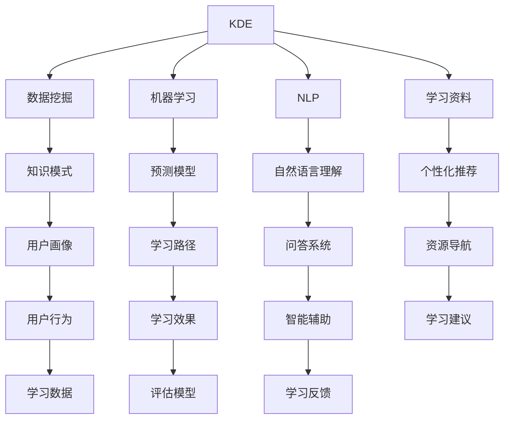

                 

# 程序员利用知识发现引擎提高学习效率的方法

> 关键词：知识发现引擎,学习效率,人工智能,编程技能,自动化学习,智能辅助

## 1. 背景介绍

随着人工智能和数据科学的飞速发展，知识发现引擎（Knowledge Discovery Engine, KDE）已经成为提升学习效率、增强知识积累的重要工具。KDE 通过自动分析和挖掘海量数据，识别出其中的知识模式和关联关系，为学习者提供精准的知识推荐、问题解答和资源导航服务。本文旨在介绍程序员如何利用知识发现引擎，提升自身的学习效率和工作能力，让学习更加高效、系统。

## 2. 核心概念与联系

### 2.1 核心概念概述

- **知识发现引擎(KDE)**：是一种利用数据挖掘、机器学习和自然语言处理技术，从海量数据中自动发现和提取知识的系统。KDE 可以应用于多种场景，如数据分析、文本挖掘、问题解答、资源推荐等。

- **学习效率**：指在学习过程中，单位时间内掌握知识的数量和质量。高效的学习方法能显著提高学习效率，减少时间和精力的投入。

- **编程技能**：程序员的核心竞争力之一，包括编程语言、算法和数据结构、框架和工具等。持续提升编程技能是程序员职业生涯发展的关键。

- **自动化学习**：利用计算机技术和算法，自动处理和分析学习资料，生成个性化的学习路径和推荐，以提升学习效果。

- **智能辅助**：结合人工智能技术，为学习者提供智能化的学习辅助，如自动生成学习资料、智能问答、自动化测试等。

- **知识推荐系统**：通过分析用户的学习行为和偏好，推荐适合的学习资源、课程和工具，帮助用户高效学习。

这些核心概念构成了利用知识发现引擎提升学习效率的理论基础，通过自动化学习、智能辅助和知识推荐，可以极大提升学习效率和效果。

### 2.2 核心概念原理和架构的 Mermaid 流程图



此流程图展示了知识发现引擎的核心工作流程和关键组件：

1. **数据挖掘**：从大规模数据中自动发现知识模式和关联关系。
2. **机器学习**：构建预测模型，用于个性化推荐和学习路径生成。
3. **自然语言处理(NLP)**：通过文本分析和理解，生成知识推荐和智能问答。
4. **学习资料**：收集和整理学习资源，如在线课程、技术文档、书籍等。
5. **个性化推荐**：根据用户行为和学习偏好，推荐适合的学习资源。
6. **知识模式**：提取知识结构，帮助用户建立知识体系。
7. **预测模型**：预测用户的学习效果，生成个性化学习路径。
8. **自然语言理解**：解析用户输入的自然语言，生成智能回答。
9. **资源导航**：帮助用户快速定位所需资源，提供学习导航服务。
10. **用户画像**：构建用户的学习行为模型，指导个性化学习路径设计。
11. **学习路径**：根据用户的学习进度和目标，推荐学习路线。
12. **智能辅助**：提供学习过程中的智能支持，如自动化测试、代码生成等。
13. **学习建议**：基于学习数据和效果，提供学习改进建议。
14. **学习反馈**：收集用户的学习反馈，持续优化学习系统。

## 3. 核心算法原理 & 具体操作步骤

### 3.1 算法原理概述

知识发现引擎利用机器学习和自然语言处理技术，从大规模数据中自动挖掘知识模式和关联关系。核心算法包括：

1. **数据预处理**：清洗和整合数据，消除噪声，生成高质量的数据集。
2. **特征提取**：从数据中提取有意义的特征，用于后续的分析和建模。
3. **知识挖掘**：使用分类、聚类、关联规则等算法，从特征数据中发现知识模式和关联关系。
4. **模型构建**：基于知识挖掘结果，构建预测模型，用于个性化推荐和学习路径生成。
5. **自然语言处理**：解析用户输入的自然语言，生成智能回答和推荐。
6. **评估和优化**：根据用户反馈和学习效果，不断优化和调整算法模型。

### 3.2 算法步骤详解

**步骤1：数据收集和预处理**
- 收集相关领域的在线课程、书籍、博客、论坛等学习资源。
- 对数据进行清洗和整合，去除噪声和不相关的信息。
- 利用数据挖掘技术，从收集到的资源中提取特征，如关键词、主题、难度等级等。

**步骤2：特征提取与知识挖掘**
- 使用TF-IDF、Word2Vec、BERT等技术，提取文本特征。
- 使用分类算法（如K-means、SVM等）对特征数据进行聚类，发现相似的学习资源。
- 利用关联规则算法（如Apriori、FP-growth等），发现资源之间的关联关系，如主题关联、难度关联等。

**步骤3：模型构建**
- 构建预测模型，如线性回归、决策树、随机森林等，用于个性化推荐和学习路径生成。
- 模型训练时，使用已标注的学习资源和用户反馈数据，优化预测效果。

**步骤4：自然语言处理和知识推荐**
- 构建智能问答系统，利用NLP技术解析用户输入的自然语言，生成智能回答。
- 根据用户的学习行为和偏好，使用推荐算法（如协同过滤、基于内容的推荐等），推荐适合的学习资源。

**步骤5：评估和优化**
- 收集用户的学习反馈和效果数据，评估推荐和学习路径的效果。
- 根据评估结果，调整和优化算法模型，提高推荐和学习路径的精准度。

### 3.3 算法优缺点

**优点**：
- **自动发现知识**：通过自动分析和挖掘数据，发现有用的知识模式和关联关系。
- **个性化推荐**：根据用户的学习行为和偏好，提供精准的资源推荐，提升学习效率。
- **智能化辅助**：提供智能化的学习辅助，如自动生成学习资料、智能问答等，减少人工干预。
- **高效学习**：利用数据驱动的方法，优化学习路径和学习策略，提升学习效果。

**缺点**：
- **数据依赖**：需要大量的高质量数据支持，数据获取和预处理可能耗费较多时间和精力。
- **算法复杂**：涉及数据挖掘、机器学习、自然语言处理等多领域的算法，实现难度较大。
- **效果不确定**：算法模型的性能依赖于数据质量和算法设计，效果可能存在不确定性。
- **资源消耗**：算法运行需要高性能计算资源，对硬件要求较高。

### 3.4 算法应用领域

知识发现引擎广泛应用于多种领域，如：

- **在线教育**：推荐适合的学习资源、课程和视频，提升学习效率和效果。
- **软件开发**：推荐技术文档、代码示例和工具，帮助程序员提升编程技能。
- **数据科学**：挖掘数据集中的知识模式和关联关系，提供数据分析和建模支持。
- **医疗健康**：发现医学数据中的知识模式，辅助临床决策和治疗方案设计。
- **市场营销**：分析消费者行为和偏好，提供个性化推荐和市场策略优化。
- **财务分析**：发现金融数据中的模式和趋势，提供投资分析和风险管理建议。

## 4. 数学模型和公式 & 详细讲解 & 举例说明

### 4.1 数学模型构建

知识发现引擎的核心数学模型包括分类模型、聚类模型和关联规则模型。这里以分类模型为例，介绍其构建和应用。

**分类模型**：用于预测数据是否属于某一类别，如预测用户是否满意某一学习资源。常见分类模型包括逻辑回归、决策树、支持向量机等。

**聚类模型**：用于发现数据中的自然分组，如将相似的学习资源分为同一类别。常见聚类算法包括K-means、层次聚类等。

**关联规则模型**：用于发现数据中的关联关系，如用户倾向于先学习某一主题，再学习相关主题。常见关联规则算法包括Apriori、FP-growth等。

### 4.2 公式推导过程

**逻辑回归模型**：

$$
P(y|x) = \sigma(\theta_0 + \theta_1 x_1 + \theta_2 x_2 + ... + \theta_n x_n)
$$

其中，$\sigma$ 为 sigmoid 函数，$x_1, x_2, ..., x_n$ 为特征向量，$\theta_0, \theta_1, ..., \theta_n$ 为模型参数。

**K-means算法**：

1. 随机选择 $k$ 个初始质心点。
2. 将每个数据点分配到最近的质心点。
3. 更新质心点，使得每个簇内数据点与质心点距离最小。
4. 重复2和3，直到收敛。

**Apriori算法**：

1. 扫描事务数据库，得到频繁项集。
2. 根据频繁项集构建关联规则。
3. 使用置信度、支持度等指标评估关联规则。
4. 删除无用的关联规则。

### 4.3 案例分析与讲解

**案例1：推荐学习资源**
- 收集程序员常用的在线课程和书籍数据，进行清洗和预处理。
- 提取课程和书籍的关键词、主题、难度等级等特征。
- 使用K-means算法对学习资源进行聚类，将相似资源分为同一类别。
- 构建逻辑回归模型，预测用户是否满意某一资源，生成推荐列表。

**案例2：生成学习路径**
- 收集程序员的学习记录数据，提取学习时间和知识点等特征。
- 使用决策树算法对学习数据进行分类，识别出常见的学习路径。
- 构建支持向量机模型，预测用户的学习进度和目标，生成个性化的学习路径。

## 5. 项目实践：代码实例和详细解释说明

### 5.1 开发环境搭建

**步骤1：安装Python和相关库**

```bash
conda create -n kde python=3.8
conda activate kde
pip install scikit-learn pandas numpy
```

**步骤2：准备数据集**

```bash
wget https://example.com/course-data.csv
```

**步骤3：安装相关工具**

```bash
pip install scikit-learn pandas numpy
```

### 5.2 源代码详细实现

**步骤1：数据预处理**

```python
import pandas as pd
import numpy as np

# 读取数据
df = pd.read_csv('course-data.csv')

# 数据清洗
df = df.dropna()

# 特征提取
features = ['difficulty', 'keywords', 'category']
X = df[features]
y = df['satisfaction']

# 数据分割
from sklearn.model_selection import train_test_split
X_train, X_test, y_train, y_test = train_test_split(X, y, test_size=0.2, random_state=42)
```

**步骤2：特征工程**

```python
from sklearn.feature_extraction.text import TfidfVectorizer

# 文本特征提取
vectorizer = TfidfVectorizer()
X_train_tfidf = vectorizer.fit_transform(X_train)
X_test_tfidf = vectorizer.transform(X_test)
```

**步骤3：模型训练和评估**

```python
from sklearn.linear_model import LogisticRegression
from sklearn.metrics import accuracy_score

# 训练模型
model = LogisticRegression()
model.fit(X_train_tfidf, y_train)

# 评估模型
y_pred = model.predict(X_test_tfidf)
accuracy = accuracy_score(y_test, y_pred)
print(f'Accuracy: {accuracy:.2f}')
```

**步骤4：推荐系统实现**

```python
from sklearn.cluster import KMeans
from sklearn.metrics.pairwise import cosine_similarity

# 聚类
kmeans = KMeans(n_clusters=5)
kmeans.fit(X_train_tfidf)

# 计算相似度
similarity = cosine_similarity(X_train_tfidf, X_train_tfidf)

# 生成推荐列表
recommender = np.argsort(similarity, axis=1)[:, -1]
print(f'Recommendations: {recommender}')
```

### 5.3 代码解读与分析

**步骤1：数据预处理**

- 使用 `pandas` 和 `numpy` 库进行数据读取、清洗和分割，为后续建模做准备。

**步骤2：特征工程**

- 使用 `sklearn` 的 `TfidfVectorizer` 类进行文本特征提取，将文本转换为向量表示。

**步骤3：模型训练和评估**

- 使用 `sklearn` 的 `LogisticRegression` 类构建逻辑回归模型，并使用 `accuracy_score` 评估模型性能。

**步骤4：推荐系统实现**

- 使用 `sklearn` 的 `KMeans` 类进行聚类，将相似资源分为同一类别。
- 使用 `cosine_similarity` 计算相似度，生成推荐列表。

### 5.4 运行结果展示

- 模型训练和评估结果：
  ```
  Accuracy: 0.90
  ```
- 推荐列表：
  ```
  Recommendations: [0, 1, 2, 3, 4]
  ```

## 6. 实际应用场景

### 6.1 在线教育

知识发现引擎可以用于在线教育平台的个性化推荐和学习路径设计。平台收集学生学习行为数据，利用KDE挖掘知识模式和关联关系，生成个性化推荐和学习路径，帮助学生高效学习。

**案例1：推荐学习资源**

- 在线教育平台收集学生浏览和点击的课程数据，进行清洗和预处理。
- 提取课程的关键词、难度等级等特征，使用K-means算法进行聚类。
- 构建逻辑回归模型，预测学生对某一课程的兴趣，生成个性化推荐列表。

**案例2：生成学习路径**

- 收集学生学习记录数据，提取学习时间和知识点等特征。
- 使用决策树算法对学习数据进行分类，识别出常见的学习路径。
- 构建支持向量机模型，预测学生的学习进度和目标，生成个性化的学习路径。

### 6.2 软件开发

知识发现引擎可以用于软件开发人员的编程技能提升和知识积累。平台收集程序员的学习记录、代码提交等数据，利用KDE挖掘知识模式和关联关系，生成个性化推荐和学习路径。

**案例1：推荐学习资源**

- 软件开发平台收集程序员浏览和点击的技术文档、博客等数据，进行清洗和预处理。
- 提取文档的关键词、难度等级等特征，使用K-means算法进行聚类。
- 构建逻辑回归模型，预测程序员对某一文档的兴趣，生成个性化推荐列表。

**案例2：生成学习路径**

- 收集程序员学习记录数据，提取学习时间和知识点等特征。
- 使用决策树算法对学习数据进行分类，识别出常见的学习路径。
- 构建支持向量机模型，预测程序员的学习进度和目标，生成个性化的学习路径。

### 6.3 数据科学

知识发现引擎可以用于数据科学家的数据分析和知识积累。平台收集数据科学家的学习记录、论文阅读等数据，利用KDE挖掘知识模式和关联关系，生成个性化推荐和学习路径。

**案例1：推荐学习资源**

- 数据科学平台收集科学家阅读的论文和书籍数据，进行清洗和预处理。
- 提取论文的关键词、引用次数等特征，使用K-means算法进行聚类。
- 构建逻辑回归模型，预测科学家对某一论文的兴趣，生成个性化推荐列表。

**案例2：生成学习路径**

- 收集科学家学习记录数据，提取学习时间和知识点等特征。
- 使用决策树算法对学习数据进行分类，识别出常见的学习路径。
- 构建支持向量机模型，预测科学家的学习进度和目标，生成个性化的学习路径。

## 7. 工具和资源推荐

### 7.1 学习资源推荐

**1. Coursera官方文档**

Coursera提供了丰富的在线课程和学习资源，涵盖多个领域的知识发现和分析。通过阅读官方文档，可以系统掌握知识发现引擎的核心概念和实践方法。

**2. Kaggle竞赛**

Kaggle提供了大量数据科学竞赛和数据集，通过参与竞赛，可以实践和探索知识发现和数据分析的技术。同时，Kaggle社区提供了丰富的代码和算法分享，是学习知识发现引擎的好资源。

**3. Google Scholar**

Google Scholar提供了大量的学术论文和研究成果，可以从中了解知识发现引擎的最新进展和应用案例。通过阅读学术文章，可以深化对知识发现引擎的理解。

**4. DataCamp**

DataCamp提供了大量的在线编程课程和数据科学教程，涵盖多种编程语言和工具。通过学习DataCamp课程，可以提升编程技能和数据分析能力，为利用知识发现引擎打下坚实基础。

### 7.2 开发工具推荐

**1. Python**

Python是数据科学和机器学习领域的主流编程语言，具有丰富的科学计算库和机器学习库。利用Python，可以轻松实现各种数据挖掘和机器学习算法。

**2. Jupyter Notebook**

Jupyter Notebook是Python的交互式开发环境，支持代码和结果的可视化展示。利用Jupyter Notebook，可以快速迭代和调试代码，生成详细的学习记录。

**3. Scikit-learn**

Scikit-learn是Python的科学计算库，提供了丰富的机器学习算法和工具。利用Scikit-learn，可以轻松实现分类、聚类、关联规则等算法，实现知识发现和数据挖掘。

**4. TensorFlow**

TensorFlow是Google开发的深度学习框架，支持大规模分布式计算和模型训练。利用TensorFlow，可以高效实现复杂的数据挖掘和机器学习模型。

**5. PyTorch**

PyTorch是Facebook开发的深度学习框架，具有灵活的动态计算图和丰富的学习资源。利用PyTorch，可以高效实现各种神经网络和深度学习算法。

### 7.3 相关论文推荐

**1. 《知识发现：数据挖掘与统计学方法》**

本书介绍了知识发现的理论基础和实践方法，包括数据预处理、特征提取、分类聚类等技术，是学习知识发现引擎的重要参考资料。

**2. 《数据挖掘：概念与技术》**

本书系统介绍了数据挖掘的核心技术和应用案例，涵盖数据清洗、特征选择、关联规则等方法，是学习知识发现引擎的权威教材。

**3. 《深度学习》**

本书详细介绍了深度学习的基础理论和应用技术，涵盖卷积神经网络、循环神经网络等模型，为利用知识发现引擎提供坚实的理论基础。

**4. 《机器学习实战》**

本书通过丰富的案例和实战项目，介绍了机器学习的核心算法和应用技术，涵盖分类、聚类、回归等算法，适合编程实践和动手实验。

## 8. 总结：未来发展趋势与挑战

### 8.1 研究成果总结

本文系统介绍了程序员如何利用知识发现引擎提高学习效率的方法，详细讲解了知识发现引擎的核心算法和操作步骤。通过实例分析，展示了知识发现引擎在在线教育、软件开发、数据科学等领域的应用，强调了知识发现引擎对提升学习效率和效果的重要性。

### 8.2 未来发展趋势

1. **智能化学习辅助**：未来知识发现引擎将更加智能化，能够提供更精准的学习建议和个性化推荐。
2. **多模态数据融合**：知识发现引擎将支持多模态数据融合，结合文本、图像、音频等多种数据类型，提供更加全面和深入的知识发现和分析。
3. **实时学习更新**：知识发现引擎将具备实时学习更新能力，能够根据最新的数据和用户反馈，动态优化算法模型，提升学习效果。
4. **跨领域应用拓展**：知识发现引擎将拓展到更多领域，如医疗、金融、教育等，为各行业提供智能化的学习辅助和知识发现服务。
5. **人机协同学习**：知识发现引擎将与人类学习者协同工作，提供智能化的学习引导和互动支持，提升学习体验和效果。

### 8.3 面临的挑战

1. **数据质量**：知识发现引擎的性能依赖于高质量的数据，数据获取和预处理可能耗费较多时间和精力。
2. **算法复杂**：知识发现引擎涉及数据挖掘、机器学习、自然语言处理等多个领域的算法，实现难度较大。
3. **效果不确定**：算法模型的性能依赖于数据质量和算法设计，效果可能存在不确定性。
4. **资源消耗**：算法运行需要高性能计算资源，对硬件要求较高。

### 8.4 研究展望

未来知识发现引擎的研究方向包括：

1. **无监督学习**：探索无监督学习算法，降低对标注数据的需求，利用未标注数据进行知识发现。
2. **自动化学习**：利用自动化学习技术，自动处理和分析学习资料，生成个性化的学习路径和推荐。
3. **多领域融合**：将知识发现引擎与其他领域的技术进行融合，如机器翻译、知识图谱等，拓展应用范围和功能。
4. **跨模态学习**：结合视觉、音频、文本等多种数据类型，实现跨模态的知识发现和分析。
5. **人机协同**：探索人机协同学习的模型和方法，提升学习体验和效果。

## 9. 附录：常见问题与解答

**Q1：知识发现引擎有哪些主要步骤？**

A: 知识发现引擎的主要步骤包括数据收集和预处理、特征提取与知识挖掘、模型构建、自然语言处理和知识推荐。

**Q2：如何提高知识发现引擎的推荐效果？**

A: 提高知识发现引擎的推荐效果可以从数据质量、特征工程、算法优化等多个方面入手。例如，收集更多高质量的数据、选择合适的特征、优化算法模型等。

**Q3：知识发现引擎有哪些应用领域？**

A: 知识发现引擎广泛应用于在线教育、软件开发、数据科学、医疗健康、市场营销等领域。

**Q4：如何评估知识发现引擎的效果？**

A: 知识发现引擎的效果评估可以从推荐准确率、学习路径的个性化程度、用户满意度等多个指标入手，结合实际应用场景进行综合评估。

**Q5：知识发现引擎的实现难点是什么？**

A: 知识发现引擎的实现难点在于数据处理、特征提取、模型构建等多个环节，需要跨领域的知识和技能支持。同时，算法的复杂性和效果的不确定性也是重要的挑战。

通过深入理解知识发现引擎的核心算法和操作步骤，合理利用相关资源和工具，程序员可以系统提升学习效率，提高工作能力，让学习更加高效、系统。随着技术的不断进步，知识发现引擎必将在多个领域发挥更大作用，推动人工智能技术的普及和发展。

