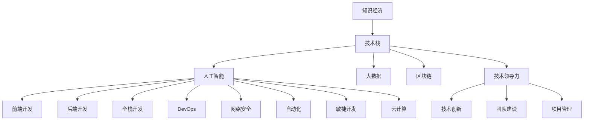

                 

# 程序员在知识经济时代的职业发展方向

> 关键词：知识经济, 职业发展, 技术栈, 人工智能, 大数据, 区块链, 前端开发, 后端开发, 全栈开发, DevOps, 网络安全, 自动化, 敏捷开发, 云计算, 技术领导力

## 1. 背景介绍

### 1.1 问题由来
随着全球化和技术革命的加速，知识经济时代已经到来。知识经济以知识创新为核心驱动，强调技术与创新驱动经济发展，而不是传统的资本或资源驱动。在这个背景下，程序员作为知识工作者，面临着全新的职业发展机遇与挑战。

### 1.2 问题核心关键点
程序员在知识经济时代，其职业发展需要紧跟技术演进，积极适应新变化，不断提升技能以应对行业和市场的需求。同时，还需关注职业规划、技术栈、技术领导力等方面的发展，以实现职业的长期可持续性。

### 1.3 问题研究意义
研究程序员在知识经济时代的职业发展方向，对于个人职业规划、企业人才培养、行业发展方向具有重要意义：

1. **个人发展**：帮助程序员明确未来技术发展趋势，找到适合的职业发展路径。
2. **企业人才战略**：指导企业选拔和培养技术人才，建立有效的人才激励和培养体系。
3. **行业趋势**：洞察知识经济时代对程序员角色的重新定义，推动行业向前发展。

## 2. 核心概念与联系

### 2.1 核心概念概述

为更好地理解程序员在知识经济时代的职业发展方向，本节将介绍几个密切相关的核心概念：

- **知识经济**：以知识创新为驱动力的经济模式，强调知识、信息、技术和创新在经济发展中的核心作用。
- **技术栈**：程序员掌握的各类技术工具、编程语言和框架的总和，体现了技术能力的多样性。
- **人工智能（AI）**：利用机器学习、深度学习等技术实现自动化和智能化处理。
- **大数据**：处理和分析大规模数据的理念、技术、工具和策略。
- **区块链**：一种分布式账本技术，通过加密和共识算法保证数据安全性和不可篡改性。
- **前端开发**：涉及网站或应用程序的客户端部分，包括HTML、CSS、JavaScript等技术。
- **后端开发**：涉及服务器端逻辑，包括数据库、服务器、API等技术。
- **全栈开发**：掌握前端和后端开发技术，能独立完成整个应用系统的开发。
- **DevOps**：将软件开发与运维紧密结合，提升软件交付效率和系统稳定性。
- **网络安全**：保护信息系统免受攻击、泄露和破坏，保障数据安全。
- **自动化**：利用技术手段自动完成重复性高、耗时长的任务。
- **敏捷开发**：强调快速响应变化，通过迭代、反馈和持续改进来提升软件质量。
- **云计算**：利用互联网技术提供计算资源，实现资源的按需分配和弹性伸缩。
- **技术领导力**：不仅指技术和管理能力，还涉及到技术创新、团队建设等方面的领导力。

这些核心概念之间的逻辑关系可以通过以下Mermaid流程图来展示：



这个流程图展示了几大核心概念及其之间的关联：

1. 知识经济提供技术发展的背景，技术栈则是实现其目标的工具。
2. 人工智能、大数据、区块链等代表技术前沿，前端、后端、全栈开发等则是实际应用的实现。
3. DevOps、网络安全、自动化、敏捷开发和云计算等概念，是技术栈在不同方面的应用和延伸。
4. 技术领导力涉及技术创新、团队建设、项目管理等多维度能力，是职业发展的重要一环。

## 3. 核心算法原理 & 具体操作步骤
### 3.1 算法原理概述

知识经济时代，程序员的职业发展涉及到技术栈的构建、技术栈的更新和转型，以及技术领导力的提升。这其中，算法原理可以总结如下：

1. **技术栈构建**：选择与知识经济时代匹配的技术栈，包括编程语言、框架、工具等，以适应新技术的发展需求。
2. **技术栈更新**：持续学习和掌握新技术，如AI、大数据、区块链等，更新技术栈以适应新的市场需求。
3. **技术领导力提升**：通过项目管理和团队建设，提升技术领导力，推动技术创新和团队协作。

### 3.2 算法步骤详解

基于上述算法原理，程序员在知识经济时代的职业发展步骤可总结为：

1. **技术栈选择与构建**：根据当前和未来的市场需求，选择并构建合适的技术栈。
2. **技术栈更新与学习**：持续关注新技术发展，定期进行技能提升，更新技术栈。
3. **技术领导力提升**：在项目管理和团队建设中，提升技术领导力。
4. **职业路径规划**：根据个人兴趣和市场需求，制定职业发展路径，规划职业目标。
5. **经验积累与反馈**：在实际工作中积累经验，根据反馈调整职业规划和技术栈。

### 3.3 算法优缺点

知识经济时代程序员职业发展的方法具有以下优点：

1. **灵活适应**：能够根据市场需求灵活调整技术栈，提升适应能力。
2. **技术领先**：持续学习新技术，保持技术领先地位。
3. **职业多样性**：多种技术栈的选择和组合，实现职业路径的多样化。

同时，该方法也存在一定的局限性：

1. **学习成本高**：新技术的学习需要时间和精力投入，初期成本较高。
2. **技术变化快**：技术更新迭代迅速，需要持续学习和调整。
3. **职业压力**：快速变化的市场环境可能带来职业上的不确定性和压力。

### 3.4 算法应用领域

在知识经济时代，程序员的职业生涯覆盖了多个领域，包括但不限于：

- **AI与机器学习**：开发智能应用、自动化系统等。
- **大数据与数据科学**：处理和分析大规模数据，提取有价值的信息。
- **区块链与加密技术**：开发去中心化应用、智能合约等。
- **前端与后端开发**：构建Web应用、移动应用等。
- **全栈开发**：开发完整应用系统，涵盖前端和后端。
- **DevOps**：自动化软件开发和运维，提升交付效率和系统稳定性。
- **网络安全**：保护系统免受攻击，保障数据安全。
- **云计算与容器技术**：利用云计算资源，实现资源的高效管理和弹性扩展。
- **技术创新与创业**：基于技术开发新产品、新服务，实现商业价值。

## 4. 数学模型和公式 & 详细讲解  
### 4.1 数学模型构建

为了更好地理解和规划程序员在知识经济时代的职业发展，本文将建立一个数学模型。假设市场需求对技术栈的要求可以用向量 $\mathbf{D}$ 表示，程序员当前的技术栈可以用向量 $\mathbf{S}$ 表示，技术栈的更新可以用向量 $\mathbf{U}$ 表示。则职业发展的数学模型可以表示为：

$$
\mathbf{S_{new}} = \mathbf{S} + \mathbf{U}
$$

其中，$\mathbf{S_{new}}$ 是未来技术栈，需要满足市场需求 $\mathbf{D}$。

### 4.2 公式推导过程

根据市场需求和技术栈更新的关系，可以推导出以下公式：

1. **需求匹配度**：
   $$
   C = \frac{\mathbf{S_{new}} \cdot \mathbf{D}}{|\mathbf{S_{new}}| \cdot |\mathbf{D}|}
   $$
   表示技术栈与市场需求匹配度，其中 $C$ 为匹配度，$\cdot$ 表示向量点积，$|\cdot|$ 表示向量模长。

2. **匹配度调整**：
   $$
   \mathbf{U} = \alpha (\mathbf{D} - \mathbf{S} \cdot \frac{\mathbf{S}}{\mathbf{S} \cdot \mathbf{S}})
   $$
   其中 $\alpha$ 为学习率，控制技术栈更新的速度。

3. **技术栈更新**：
   $$
   \mathbf{S_{new}} = \mathbf{S} + \mathbf{U}
   $$

### 4.3 案例分析与讲解

假设当前市场需求向量为 $\mathbf{D} = [1, 1, 0, 0, 1, 0]$，表示对AI、大数据、区块链、前端、后端和DevOps的需求。程序员当前技术栈向量为 $\mathbf{S} = [0, 0, 0, 1, 1, 0]$，表示擅长前端和后端开发。

通过公式计算，可以确定技术栈更新向量 $\mathbf{U}$ 为 $[1, 0, 0, 0, 1, 1]$，表示需要学习AI、DevOps和区块链技术。未来技术栈向量 $\mathbf{S_{new}}$ 为 $[0, 1, 0, 2, 1, 1]$，表示未来应擅长前端、后端、AI、DevOps和区块链。

## 5. 项目实践：代码实例和详细解释说明
### 5.1 开发环境搭建

在进行程序员职业发展的实践前，我们需要准备好开发环境。以下是使用Python进行项目开发的典型流程：

1. **安装Python**：从官网下载并安装Python。
2. **设置虚拟环境**：使用virtualenv或conda创建虚拟环境。
3. **安装相关库**：使用pip或conda安装所需库，如numpy、pandas、scikit-learn等。
4. **配置开发环境**：配置Git仓库、IDE、版本控制等开发环境。

### 5.2 源代码详细实现

以下是一个基于Python的程序员职业发展路径规划的示例代码，涵盖了技术栈构建、更新和学习过程：

```python
import numpy as np

# 定义市场需求向量
market_demand = np.array([1, 1, 0, 0, 1, 0])

# 定义当前技术栈向量
current_stack = np.array([0, 0, 0, 1, 1, 0])

# 定义学习率
alpha = 0.5

# 计算技术栈更新向量
update_vector = alpha * (market_demand - current_stack.dot(current_stack / current_stack.dot(current_stack)))

# 计算未来技术栈向量
future_stack = current_stack + update_vector

print("市场需求向量：", market_demand)
print("当前技术栈向量：", current_stack)
print("技术栈更新向量：", update_vector)
print("未来技术栈向量：", future_stack)
```

### 5.3 代码解读与分析

让我们再详细解读一下关键代码的实现细节：

**市场需求和当前技术栈**：
- 市场需求向量 $\mathbf{D}$ 和当前技术栈向量 $\mathbf{S}$ 分别表示为numpy数组。
- 市场需求向量中的元素值表示不同技术的需求程度。

**技术栈更新向量**：
- 计算 $\mathbf{U}$ 时，先计算 $\mathbf{S} \cdot \frac{\mathbf{S}}{\mathbf{S} \cdot \mathbf{S}}$，表示当前技术栈的权重向量。
- 使用学习率 $\alpha$ 控制更新速度。

**未来技术栈向量**：
- 最终计算未来技术栈向量 $\mathbf{S_{new}}$，即当前技术栈 $\mathbf{S}$ 加上技术栈更新向量 $\mathbf{U}$。

**代码实现过程**：
- 利用numpy库进行向量计算，实现技术栈的更新。
- 输出市场需求向量、当前技术栈向量、技术栈更新向量和未来技术栈向量，供分析。

## 6. 实际应用场景
### 6.1 智能应用开发

在知识经济时代，程序员可以参与到智能应用和自动化系统的开发中。AI技术、大数据分析、区块链等新兴技术为智能应用提供了广阔的应用场景，如智能客服、自动驾驶、供应链管理等。

在智能客服系统中，程序员需要掌握AI技术，特别是自然语言处理、机器学习等，开发智能问答系统和推荐系统，提升用户体验和效率。

在自动驾驶领域，程序员需要结合计算机视觉、深度学习等技术，开发感知、决策和控制算法，实现自主驾驶功能。

在供应链管理中，程序员需要利用区块链技术，构建去中心化的交易平台，实现供应链的透明和可追溯。

### 6.2 大数据与数据科学

大数据技术和大数据科学在知识经济时代发挥着重要作用，程序员可以通过处理和分析大规模数据，提取有价值的信息，支持决策和业务创新。

在金融领域，程序员可以参与到风险评估、信用评分、欺诈检测等大数据应用中，提升金融业务的智能化水平。

在电商领域，程序员可以开发推荐系统、广告投放优化等大数据应用，提升用户体验和转化率。

在公共卫生领域，程序员可以分析医疗数据，支持疾病预测、疫情监控等公共卫生决策。

### 6.3 区块链与加密技术

区块链和加密技术为知识经济提供了新的价值承载方式和信任机制。程序员可以开发去中心化应用、智能合约等区块链应用，实现数字资产管理、供应链溯源等功能。

在金融领域，程序员可以开发智能合约、数字资产交易平台等应用，提升金融服务的透明度和安全性。

在供应链管理中，程序员可以开发区块链溯源系统，实现供应链产品的透明和可追溯，保障消费者权益。

### 6.4 前端与后端开发

前端与后端开发在知识经济时代依然是程序员的主要工作内容。前端开发涉及网站和应用程序的客户端部分，后端开发涉及服务器端逻辑和数据处理。

在Web应用开发中，程序员需要掌握HTML、CSS、JavaScript等前端技术，开发高性能、用户体验良好的Web应用。

在移动应用开发中，程序员需要掌握Swift、Kotlin、React Native等技术，开发跨平台移动应用。

在企业级应用开发中，程序员需要结合后端技术如Java、Node.js等，开发Web服务和API接口，实现前后端的协同工作。

### 6.5 全栈开发

全栈开发在知识经济时代具有重要价值，程序员可以掌握前端和后端技术，独立完成整个应用系统的开发。

在电商网站开发中，程序员需要掌握HTML、CSS、JavaScript、React等前端技术和Node.js、MongoDB等后端技术，实现完整的电商系统。

在企业级应用开发中，程序员需要掌握Java、Spring、Angular等技术，实现从数据存储、业务逻辑到前端展示的全栈应用。

### 6.6 DevOps

DevOps技术在知识经济时代尤为重要，程序员需要掌握自动化和持续集成（CI）、持续部署（CD）、容器技术等DevOps工具和实践。

在软件开发中，程序员可以使用CI工具如Jenkins、Travis CI等，自动化测试和构建过程，提升软件交付效率。

在应用部署中，程序员可以使用容器技术如Docker、Kubernetes等，实现应用的自动化部署和弹性伸缩。

### 6.7 网络安全

网络安全在知识经济时代面临重大挑战，程序员需要掌握加密技术、安全协议等网络安全知识，保障系统的安全性和可靠性。

在Web应用开发中，程序员需要掌握SSL/TLS协议，保障数据传输的安全性。

在移动应用开发中，程序员需要掌握加密算法，保护用户数据的安全。

在企业级应用开发中，程序员需要掌握身份认证、访问控制等安全机制，保障系统的安全性。

### 6.8 自动化与敏捷开发

自动化和敏捷开发在知识经济时代具有重要价值，程序员需要掌握脚本语言、自动化测试、敏捷开发等工具和技术。

在软件开发中，程序员可以使用自动化测试工具如Selenium、Jest等，提高测试效率，保障软件质量。

在敏捷开发中，程序员需要掌握Scrum、Kanban等敏捷开发方法，提升团队协作效率和软件交付速度。

### 6.9 云计算与容器技术

云计算和容器技术在知识经济时代具有重要价值，程序员需要掌握云服务、容器化技术等，实现资源的按需分配和弹性扩展。

在云服务中，程序员可以使用AWS、Google Cloud等云平台，提供计算、存储和网络资源，实现高效的数据处理和存储。

在容器技术中，程序员可以使用Docker、Kubernetes等容器技术，实现应用的自动化部署和弹性伸缩。

## 7. 工具和资源推荐
### 7.1 学习资源推荐

为了帮助程序员掌握知识经济时代的职业发展方向，这里推荐一些优质的学习资源：

1. **《程序员的艺术》**：介绍程序员职业发展、技术栈选择和技能提升的经典著作。
2. **Coursera和Udacity**：提供多种计算机科学和技术课程，涵盖AI、大数据、区块链、DevOps等前沿领域。
3. **GitHub**：开源代码托管平台，程序员可以学习优秀代码，参与开源项目，积累开发经验。
4. **Stack Overflow**：程序员交流问答平台，可以解决技术难题，分享技术经验。
5. **LinkedIn Learning**：提供职业发展、技术栈提升和领导力培训课程。

通过对这些资源的学习实践，相信你一定能够快速掌握知识经济时代程序员的职业发展方向，并用于解决实际的职业问题。

### 7.2 开发工具推荐

高效的开发离不开优秀的工具支持。以下是几款用于程序员职业发展的常用工具：

1. **Visual Studio Code**：轻量级的代码编辑器，支持多种编程语言和插件扩展。
2. **Git**：版本控制系统，支持分布式协作，提供代码管理和历史追踪功能。
3. **JIRA**：项目管理工具，支持敏捷开发、任务跟踪和团队协作。
4. **Jenkins**：自动化集成工具，支持CI/CD流程，自动化构建、测试和部署。
5. **Kubernetes**：容器编排工具，支持容器化应用的自动化部署和扩展。
6. **Docker**：容器化平台，支持应用的打包和部署，实现容器化应用的跨平台运行。

合理利用这些工具，可以显著提升程序员的职业发展效率，加快创新迭代的步伐。

### 7.3 相关论文推荐

程序员职业发展方向的研究源于学界的持续研究。以下是几篇奠基性的相关论文，推荐阅读：

1. **《知识经济中的编程技能提升》**：介绍知识经济时代编程技能提升的最新研究成果。
2. **《智能应用开发中的AI技术应用》**：探讨AI技术在智能应用开发中的应用案例和未来趋势。
3. **《大数据分析在金融行业的应用》**：分析大数据技术在金融行业中的实际应用和效果。
4. **《区块链技术在供应链管理中的应用》**：探讨区块链技术在供应链管理中的应用案例和前景。
5. **《全栈开发与DevOps技术的应用》**：介绍全栈开发和DevOps技术的实际应用和最佳实践。
6. **《网络安全在知识经济中的重要性》**：分析网络安全在知识经济中的重要性和未来趋势。

这些论文代表了大数据时代程序员职业发展方向的研究方向，通过学习这些前沿成果，可以帮助程序员把握学科前进方向，激发更多的创新灵感。

## 8. 总结：未来发展趋势与挑战
### 8.1 研究成果总结

本文对程序员在知识经济时代的职业发展方向进行了全面系统的介绍。首先阐述了知识经济对程序员职业发展的影响，明确了技术栈构建、技术栈更新和技术领导力提升的关键点。其次，从原理到实践，详细讲解了技术栈构建、技术栈更新和技术领导力提升的数学模型和详细步骤。同时，本文还广泛探讨了AI、大数据、区块链等技术在程序员职业发展中的应用前景，展示了知识经济时代程序员的多样化职业路径。

通过本文的系统梳理，可以看到，知识经济时代程序员的职业发展需要紧跟技术演进，积极适应新变化，不断提升技能以应对行业和市场的需求。未来，伴随技术栈的持续更新和技术领导力的不断提升，程序员必将迎来更加广阔的职业发展空间。

### 8.2 未来发展趋势

展望未来，知识经济时代程序员职业发展呈现以下几个趋势：

1. **技术栈的持续更新**：AI、大数据、区块链等新兴技术的应用将持续扩展，程序员需要持续学习和掌握新技术。
2. **技术领导力的重要性**：项目管理、团队建设和创新能力将越来越重要，技术领导力的提升将更加凸显。
3. **跨领域技能的融合**：程序员需要具备多领域技能，如技术、管理、领导力等，以适应多变的职业需求。
4. **职业路径的多样化**：程序员可以从事AI开发、大数据分析、区块链开发、前端开发、后端开发、全栈开发等多个领域。
5. **自动化和敏捷开发**：自动化和敏捷开发将成为程序员职业发展的关键技能，提升软件交付效率和系统稳定性。
6. **网络安全和隐私保护**：网络安全与隐私保护将越来越重要，程序员需要掌握相关技术和策略。
7. **云计算与容器技术**：云计算与容器技术将助力程序员实现资源的按需分配和弹性扩展。

这些趋势凸显了知识经济时代程序员职业发展的广阔前景，技术栈的多样化、技能的多样化、职业路径的多样化将带来更多的职业机会和发展空间。

### 8.3 面临的挑战

尽管知识经济时代程序员职业发展具备广阔前景，但仍面临诸多挑战：

1. **技术更新速度快**：新技术层出不穷，程序员需要持续学习，适应快速变化的市场需求。
2. **技术栈复杂性高**：多种技术栈的选择和组合，增加了职业发展路径的复杂性。
3. **职业压力和不确定性**：快速变化的市场环境可能带来职业上的不确定性和压力。
4. **技术领导力提升难度大**：项目管理、团队建设和创新能力需要系统的培训和实践。
5. **跨领域技能融合难度大**：多领域技能融合需要跨学科的知识和实践经验。
6. **网络安全与隐私保护难度大**：网络攻击和隐私泄露风险需要持续关注和应对。

这些挑战需要程序员在职业发展过程中不断积累经验，提升技能，灵活应对市场变化，方能实现职业的长期可持续性。

### 8.4 研究展望

面对知识经济时代程序员职业发展所面临的挑战，未来的研究需要在以下几个方面寻求新的突破：

1. **持续学习和技能提升**：开发更多在线学习平台和课程，提供系统的技术栈构建和更新方法。
2. **技术领导力培训**：提供更多技术领导力的培训课程和实践机会，提升程序员的项目管理和创新能力。
3. **跨领域技能融合**：加强跨学科的知识和实践经验，提升程序员的多领域技能融合能力。
4. **网络安全与隐私保护**：开发更多网络安全与隐私保护的技术工具和策略，保障系统的安全性和可靠性。
5. **云计算与容器技术应用**：进一步优化云计算和容器技术的工具和实践，提升资源的按需分配和弹性扩展能力。

这些研究方向的探索，必将引领知识经济时代程序员职业发展的方向，推动人工智能技术在各个领域的应用和普及。总之，知识经济时代程序员的职业发展需要紧跟技术演进，积极适应新变化，不断提升技能以应对行业和市场的需求。只有勇于创新、敢于突破，才能不断拓展技术栈的边界，实现职业的长期可持续性。

