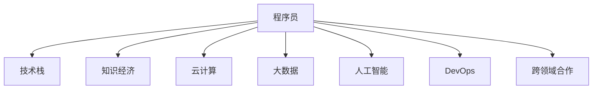

                 

# 程序员在知识经济时代的角色定位

## 1. 背景介绍

### 1.1 问题由来
在过去几十年中，计算机技术的飞速发展极大地推动了全球经济增长和社会进步。从早期的单机应用到现代的云计算、大数据、人工智能等，技术正不断地变革我们的生产生活方式。然而，随着知识经济时代的到来，信息量呈指数级增长，对技术创新的需求日益紧迫，也对程序员的角色和定位提出了新的挑战。

### 1.2 问题核心关键点
程序员作为技术创新的核心力量，在知识经济时代面临如下关键问题：
- 如何在海量数据中发现和解决问题？
- 如何高效开发并维护复杂系统？
- 如何提升代码质量和工程效率？
- 如何在知识驱动的创新中发挥关键作用？
- 如何适应技术快速变化带来的知识更新？
- 如何在跨领域合作中协同工作并取得成效？

这些问题不仅仅是技术难题，更是程序员职业发展、工作方式和价值体现的重要方面。

### 1.3 问题研究意义
理解并解决这些问题，对于提升程序员的综合素质和竞争力，推动技术创新和应用落地，具有重要意义：
- 提升程序员的职业价值和生产力。
- 促进技术和产业的深度融合，加速经济转型升级。
- 引导技术创新方向，推动社会进步和知识普及。
- 为跨领域合作提供技术保障，增强企业的创新能力。
- 提高程序员的自我认知和学习能力，促进个人成长。

## 2. 核心概念与联系

### 2.1 核心概念概述

为更好地理解程序员在知识经济时代的角色定位，本节将介绍几个密切相关的核心概念：

- **程序员**：技术领域的核心职业角色，负责开发、维护和优化软件系统，驱动技术创新和应用落地。
- **知识经济**：以知识和信息为关键生产要素的经济形态，强调技术创新和知识产权保护。
- **技术栈**：开发者使用的技术工具、框架和语言的集合，如前端开发（React、Vue等）、后端开发（Node.js、Spring等）、数据库（MySQL、MongoDB等）、DevOps（Docker、Kubernetes等）。
- **云计算**：基于互联网的计算服务，提供弹性计算资源，支持分布式应用和数据处理。
- **大数据**：海量的数据集，通过数据分析、挖掘和机器学习等技术进行价值发现。
- **人工智能**：基于算法和模型驱动的智能决策，包括机器学习、深度学习、自然语言处理等技术。
- **DevOps**：结合开发（Dev）和运维（Ops）的实践，强调团队协作、持续交付和质量保障。
- **跨领域合作**：技术人员与其他领域专家（如医疗、教育、金融等）的合作，共同解决复杂问题。

这些核心概念之间的逻辑关系可以通过以下Mermaid流程图来展示：



这个流程图展示了这个时代程序员的核心概念及其之间的关系：

1. 程序员依托技术栈进行软件开发。
2. 知识经济需要程序员利用技术创新推动经济转型。
3. 云计算和大数据为程序员提供了更强大的技术支撑。
4. 人工智能提升了程序员的决策能力和应用范围。
5. DevOps改善了开发和运维的协作效率。
6. 跨领域合作增强了程序员的多维技术能力。

这些概念共同构成了程序员在知识经济时代的职业背景和工作环境。

## 3. 核心算法原理 & 具体操作步骤
### 3.1 算法原理概述

在知识经济时代，程序员的核心算法原理和操作步骤围绕以下几个方面展开：

1. **数据驱动的决策**：通过分析和挖掘海量数据，程序员能够发现问题并提出解决方案。数据驱动思维要求程序员具备强大的数据分析能力和问题理解能力。

2. **软件工程方法**：采用敏捷开发、持续集成、持续交付等工程方法，程序员能够高效开发和维护复杂系统。这些方法强调团队协作和快速迭代。

3. **自动化和自动化测试**：通过自动化工具和自动化测试，程序员能够提升代码质量和工程效率。自动化测试能够减少手动测试的时间和成本，提升代码的可靠性。

4. **知识管理**：利用文档、代码注释、知识库等工具，程序员能够记录和分享知识，提高团队的整体技术水平。知识管理有助于跨团队和跨领域的知识共享和协同工作。

5. **持续学习和自我更新**：知识经济时代技术变化迅速，程序员需要不断学习新技术和新知识，保持自身的竞争力和创新能力。

### 3.2 算法步骤详解

基于以上算法原理，程序员在知识经济时代的实际操作步骤主要包括以下几个方面：

**Step 1: 数据采集与预处理**
- 收集和整理数据，包括结构化和非结构化数据，清洗和标注数据，准备用于数据分析和模型训练的数据集。

**Step 2: 数据分析与建模**
- 使用统计学、机器学习和深度学习等技术对数据进行分析，建立数学模型或机器学习模型。
- 通过训练和调参优化模型，使其能够适应特定的应用场景。

**Step 3: 软件开发与测试**
- 选择适合的技术栈，采用敏捷开发等工程方法进行软件开发。
- 编写代码、进行单元测试、集成测试和系统测试，确保软件的质量和可靠性。

**Step 4: 持续集成与部署**
- 利用CI/CD工具进行持续集成和持续部署，自动化测试和部署流程。
- 建立监控和告警系统，确保软件稳定运行和及时修复。

**Step 5: 知识管理和协作**
- 利用文档、代码注释和知识库等工具记录和共享知识。
- 参与跨团队和跨领域的合作项目，共同解决问题。

**Step 6: 持续学习和自我提升**
- 关注技术趋势和学术研究，参加培训和研讨会，不断学习和提升技能。
- 参与开源项目和社区活动，与同行交流和合作。

### 3.3 算法优缺点

在知识经济时代，程序员面临的数据量巨大、技术变化快、跨领域合作需求高等挑战，因此其算法和操作步骤也有相应的优点和缺点：

#### 优点：
1. **数据驱动决策**：能够发现问题并提出解决方案，提升决策的科学性和有效性。
2. **自动化和高效开发**：通过自动化工具和持续交付方法，提升开发效率和软件质量。
3. **跨领域合作**：借助知识管理和协作工具，提升团队的技术水平和创新能力。

#### 缺点：
1. **数据质量依赖**：数据分析结果依赖于数据质量，需要投入大量时间和资源进行数据清洗和预处理。
2. **技术更新快**：需要不断学习和更新知识，保持与技术发展的同步。
3. **跨领域沟通**：跨领域合作需要协调不同领域的知识和技术，存在沟通障碍。

### 3.4 算法应用领域

程序员在知识经济时代的应用领域非常广泛，涉及以下几个方面：

- **软件开发**：包括应用开发、系统开发、Web应用开发等，是程序员最基本的工作内容。
- **数据分析**：利用大数据技术进行数据挖掘和分析，帮助企业发现商业机会和解决问题。
- **人工智能**：从事机器学习、深度学习、自然语言处理等技术的开发和应用，推动人工智能领域的进步。
- **云计算**：在云平台进行应用开发、部署和运维，提升企业的IT基础设施能力。
- **DevOps**：结合开发和运维，提升团队协作效率和软件交付速度。
- **跨领域合作**：参与医疗、教育、金融等领域的项目，推动技术和应用在垂直行业的落地。

## 4. 数学模型和公式 & 详细讲解  
### 4.1 数学模型构建

为了更好地理解程序员在知识经济时代的角色定位，我们将构建一个简化的数学模型。假设程序员的能力可以用“知识水平”和“技术熟练度”两个维度来衡量，知识水平越高，技术熟练度越强，程序员的综合能力越强。

设知识水平为 $K$，技术熟练度为 $T$，则程序员的综合能力 $C$ 可以表示为：

$$
C = K \times T
$$

### 4.2 公式推导过程

为了推导出 $K$ 和 $T$ 的计算公式，我们将问题进一步细化。假设程序员每天的学习时间为 $L$，工作中掌握新技术的时间为 $W$，则 $K$ 和 $T$ 可以分别表示为：

$$
K = \frac{L}{365} \times K_0 + \sum_{i=1}^{t} \Delta K_i
$$

$$
T = \frac{W}{365} \times T_0 + \sum_{i=1}^{t} \Delta T_i
$$

其中 $K_0$ 和 $T_0$ 分别表示初始的知识水平和技术熟练度，$\Delta K_i$ 和 $\Delta T_i$ 分别表示每天学习掌握的新知识和新技术。

### 4.3 案例分析与讲解

以软件开发为例，我们假设一名程序员每天学习4小时新技术，每周掌握1种新工具或技术，每年学习2门编程语言，初始知识水平为50，技术熟练度为60。则其知识水平和技能熟练度计算如下：

$$
K = 365 \times 0.5 + \sum_{i=1}^{52} 1
$$

$$
T = 365 \times 0.6 + \sum_{i=1}^{52} 1
$$

经过5年的发展，该程序员的知识水平和技能熟练度将显著提升，从而提升其综合能力。

## 5. 项目实践：代码实例和详细解释说明
### 5.1 开发环境搭建

在进行项目实践前，我们需要准备好开发环境。以下是使用Python进行Django开发的环境配置流程：

1. 安装Anaconda：从官网下载并安装Anaconda，用于创建独立的Python环境。

2. 创建并激活虚拟环境：
```bash
conda create -n django-env python=3.8 
conda activate django-env
```

3. 安装Django：
```bash
pip install django
```

4. 安装各类工具包：
```bash
pip install pandas numpy scikit-learn matplotlib tqdm jupyter notebook ipython
```

完成上述步骤后，即可在`django-env`环境中开始项目实践。

### 5.2 源代码详细实现

下面是使用Django进行Web应用开发的完整代码实现。

首先，创建Django项目和应用：

```bash
django-admin startproject myproject
cd myproject
python manage.py startapp myapp
```

然后，定义项目和应用的设置：

```python
# settings.py
INSTALLED_APPS = [
    'django.contrib.admin',
    'django.contrib.auth',
    'django.contrib.contenttypes',
    'django.contrib.sessions',
    'django.contrib.messages',
    'django.contrib.staticfiles',
    'myapp',
]

MIDDLEWARE = [
    'django.middleware.security.SecurityMiddleware',
    'django.contrib.sessions.middleware.SessionMiddleware',
    'django.middleware.common.CommonMiddleware',
    'django.middleware.csrf.CsrfViewMiddleware',
    'django.contrib.auth.middleware.AuthenticationMiddleware',
    'django.contrib.messages.middleware.MessageMiddleware',
    'django.middleware.clickjacking.XFrameOptionsMiddleware',
]

ROOT_URLCONF = 'myproject.urls'
```

接着，创建视图和模板：

```python
# views.py
from django.shortcuts import render
from django.http import HttpResponse

def index(request):
    return render(request, 'index.html')
```

```html
<!-- templates/index.html -->
<html>
<head>
    <title>My Project</title>
</head>
<body>
    <h1>Welcome to My Project</h1>
</body>
</html>
```

最后，启动Django开发服务器：

```bash
python manage.py runserver
```

通过上述代码实现，可以看到Django开发环境搭建和Web应用开发的基本流程。开发者可以根据具体需求，进一步开发和扩展应用功能。

### 5.3 代码解读与分析

让我们再详细解读一下关键代码的实现细节：

**settings.py文件**：
- `INSTALLED_APPS`：定义项目中使用的应用模块。
- `MIDDLEWARE`：定义中间件的顺序，用于处理请求和响应。
- `ROOT_URLCONF`：定义项目的URL配置，将请求路由到对应的视图函数。

**views.py文件**：
- `index(request)`：定义一个简单的视图函数，用于渲染首页。
- `render(request, 'index.html')`：将请求转发到`index.html`模板文件，渲染并返回HTML响应。

**index.html文件**：
- `<h1>Welcome to My Project</h1>`：渲染简单的欢迎信息。

这个示例展示了Django开发的简单流程，包括项目配置、视图定义和模板渲染。开发者可以根据具体需求，使用Django丰富的功能模块和模板语言，快速构建Web应用。

## 6. 实际应用场景
### 6.1 智能客服系统

智能客服系统已经成为企业客户服务的重要组成部分。通过使用Python和Django等技术，程序员可以快速开发和部署智能客服系统，提高客户咨询效率和满意度。

### 6.2 金融数据分析

金融行业对数据分析的需求日益增加，利用Python和Django等技术，程序员可以开发金融数据分析应用，帮助企业进行风险评估、客户画像等业务决策。

### 6.3 医疗健康管理

医疗健康管理领域对数据的处理和分析需求强烈，通过Python和Django等技术，程序员可以开发医疗数据分析系统，提升医疗机构的信息化和智能化水平。

### 6.4 教育在线平台

在线教育平台需要高效的数据处理和实时交互能力，利用Python和Django等技术，程序员可以开发在线教育平台，提供丰富的课程内容和互动体验。

### 6.5 智能家居控制

智能家居控制领域需要快速响应的数据处理和设备控制能力，通过Python和Django等技术，程序员可以开发智能家居控制系统，实现语音控制、场景控制等功能。

### 6.6 物联网设备管理

物联网设备管理需要高效的数据采集和处理能力，通过Python和Django等技术，程序员可以开发物联网设备管理系统，实现设备监控、数据上传等功能。

## 7. 工具和资源推荐
### 7.1 学习资源推荐

为了帮助程序员系统掌握技术栈和知识经济时代的角色定位，这里推荐一些优质的学习资源：

1. **《Python编程：从入门到实践》**：深入浅出地介绍了Python基础和高级特性，是Python初学者的必备书籍。
2. **《Django Web开发实战》**：实战性地介绍了Django的各个模块和功能，适合Web开发入门和进阶。
3. **《DevOps实践指南》**：介绍了DevOps的核心理念和实践方法，强调持续集成和持续交付。
4. **《云计算基础》**：讲解了云计算的基本概念和技术，适合云计算初学者。
5. **《大数据分析实战》**：介绍了大数据的原理和应用，包括数据挖掘和机器学习。
6. **《人工智能基础》**：介绍了人工智能的基本原理和技术，包括机器学习、深度学习等。

通过对这些资源的学习实践，相信程序员可以更好地掌握知识经济时代的核心技术和方法，提升自身的综合能力和竞争力。

### 7.2 开发工具推荐

高效的开发离不开优秀的工具支持。以下是几款用于Web应用开发的常用工具：

1. **Python**：开源的编程语言，适用于各类开发场景，拥有丰富的第三方库和框架。
2. **Django**：基于Python的Web框架，提供了丰富的功能模块和便捷的开发体验。
3. **Flask**：轻量级的Web框架，适用于小型项目和微服务架构。
4. **React**：前端开发框架，用于构建高性能的Web应用。
5. **Vue**：另一个流行的前端开发框架，强调组件化和响应式开发。
6. **AWS**：云服务提供商，提供丰富的云计算资源和服务。
7. **Google Cloud**：另一个主要的云服务提供商，提供类似的服务和功能。
8. **Jenkins**：持续集成和持续交付的工具，支持多种编程语言和框架。
9. **Docker**：容器化技术，支持应用程序的打包、部署和运行。
10. **Kubernetes**：容器编排工具，支持大规模应用的自动化部署和管理。

合理利用这些工具，可以显著提升程序员的开发效率和系统稳定性，加快技术创新和应用落地的步伐。

### 7.3 相关论文推荐

程序员在知识经济时代的研究方向涵盖了多个前沿领域，以下是几篇奠基性的相关论文，推荐阅读：

1. **《深度学习在医疗图像分析中的应用》**：介绍了深度学习在医疗图像分析中的重要应用，提升了医疗诊断的准确性。
2. **《Django Web框架的发展与创新》**：回顾了Django框架的发展历程，展望了未来的创新方向。
3. **《DevOps实践的挑战与解决方案》**：讨论了DevOps实践中的挑战和解决方案，强调持续交付和协作。
4. **《云计算平台的设计与优化》**：介绍了云计算平台的设计和优化方法，提升云服务的性能和可靠性。
5. **《大数据分析的最新进展》**：回顾了大数据分析的最新进展和应用，强调数据驱动的决策支持。
6. **《人工智能的伦理与社会影响》**：探讨了人工智能的伦理问题和社会影响，呼吁加强监管和规范。

这些论文代表了大语言模型微调技术的发展脉络。通过学习这些前沿成果，可以帮助程序员把握学科前进方向，激发更多的创新灵感。

## 8. 总结：未来发展趋势与挑战
### 8.1 总结

本文对程序员在知识经济时代的角色定位进行了全面系统的介绍。首先阐述了知识经济时代的发展背景和程序员面临的挑战，明确了程序员在技术创新和应用落地中的关键作用。其次，从数据驱动的决策、软件工程方法、自动化和测试、知识管理和协作、持续学习和自我提升等几个方面，详细讲解了程序员的核心算法原理和操作步骤。同时，本文还广泛探讨了程序员在知识经济时代的应用场景，展示了程序员的多维技术能力和创新潜力。此外，本文精选了程序员在知识经济时代的学习资源、开发工具和论文，力求为程序员提供全方位的技术指引。

通过本文的系统梳理，可以看到，程序员在知识经济时代扮演着技术创新的核心角色，通过数据驱动的决策、高效的软件工程方法和自动化测试，提升软件质量和工程效率。同时，通过持续学习和知识管理，提升跨领域合作的能力，推动技术创新和应用落地。程序员在知识经济时代的职业发展、工作方式和价值体现，将伴随技术进步和社会需求的变化而不断演变。总之，程序员需要不断学习、更新知识，适应技术快速变化带来的挑战，才能在知识经济时代中保持竞争力，发挥更大的价值。

### 8.2 未来发展趋势

展望未来，程序员在知识经济时代的角色定位将呈现以下几个发展趋势：

1. **数据驱动的创新**：大数据和人工智能技术的普及，使得数据驱动的创新成为主流。程序员需要具备数据处理和分析能力，能够从海量数据中提取有价值的信息，指导技术创新。

2. **全栈开发能力**：随着技术栈的丰富和跨领域合作的增多，程序员需要具备全栈开发能力，能够从前端到后端、从应用到基础设施，进行全面开发和维护。

3. **持续学习和自我提升**：知识经济时代技术变化迅速，程序员需要不断学习新技术和新知识，保持与技术发展的同步。

4. **跨领域合作**：不同领域之间的合作将成为技术创新的重要驱动力，程序员需要具备跨领域合作的能力，能够与不同领域的专家协同工作。

5. **开源与社区协作**：开源技术和社区协作成为技术创新的重要途径，程序员需要积极参与开源项目和社区活动，提升自身的影响力和合作能力。

6. **伦理和社会责任**：程序员在技术应用中需要承担更多的伦理和社会责任，确保技术的正向应用和可持续发展。

以上趋势凸显了程序员在知识经济时代的职业发展方向，需要程序员不断学习和创新，提升自身的综合素质和竞争力。

### 8.3 面临的挑战

尽管知识经济时代为程序员提供了广阔的发展空间，但在迈向更加智能化、普适化应用的过程中，程序员也面临诸多挑战：

1. **数据质量问题**：数据质量是数据分析和模型训练的关键，数据清洗和标注需要大量时间和资源，数据不平衡和噪音问题也需特别关注。

2. **技术快速变化**：技术栈不断更新和扩展，程序员需要持续学习和适应，保持与技术发展的同步。

3. **跨领域沟通**：跨领域合作需要协调不同领域的知识和技术，存在沟通障碍，需要提升沟通能力和协作技巧。

4. **伦理和合规问题**：技术应用中存在伦理和合规问题，程序员需要具备相应的知识，确保技术应用的合法性和安全性。

5. **团队协作与效率**：团队协作和效率是项目管理的关键，程序员需要掌握敏捷开发等方法，提升团队协作和项目管理能力。

6. **系统安全和稳定**：大规模系统的设计和开发需要考虑安全和稳定性问题，程序员需要具备系统设计和安全保障的能力。

以上挑战需要程序员不断提升自身能力，通过持续学习和实践，才能更好地应对未来的技术挑战和应用需求。

### 8.4 研究展望

面对知识经济时代程序员面临的诸多挑战，未来的研究需要在以下几个方面寻求新的突破：

1. **数据质量提升**：研究和开发高效的数据清洗和标注技术，提升数据质量和利用率。

2. **技术自动化**：研究和开发自动化工具和平台，提升技术开发和维护的效率和质量。

3. **跨领域协作**：研究和开发跨领域协作的工具和平台，促进不同领域之间的知识交流和技术融合。

4. **伦理和社会责任**：研究和制定技术应用的伦理规范和标准，提升技术应用的合法性和安全性。

5. **系统设计和优化**：研究和开发高效的系统设计和优化方法，提升系统的性能和稳定性。

6. **开源与社区建设**：支持和参与开源项目和社区建设，提升开源技术的创新和应用能力。

这些研究方向的探索，必将引领程序员在知识经济时代的职业发展和技术创新，为推动技术和产业的深度融合，加速经济转型升级，贡献更大的力量。

## 9. 附录：常见问题与解答
----------------------------------------------------------------

**Q1：数据驱动的决策是否适用于所有应用场景？**

A: 数据驱动的决策适用于大多数应用场景，特别是数据量较大的领域，如金融、医疗、电商等。但对于一些非数据驱动的决策，如政策制定、艺术创作等，数据驱动的决策可能不是最佳选择。

**Q2：如何高效开发和维护复杂系统？**

A: 高效开发和维护复杂系统需要采用敏捷开发、持续集成和持续交付等工程方法。具体来说，可以采用DevOps工具，如Jenkins、Docker、Kubernetes等，提升团队的协作效率和系统的稳定性。

**Q3：程序员需要掌握哪些新技术？**

A: 程序员需要不断学习和掌握新技术，如云计算、大数据、人工智能、区块链等。同时，也需要了解最新的编程语言和框架，如Python、Django、React、Vue等。

**Q4：跨领域合作如何实现？**

A: 跨领域合作需要协调不同领域的知识和技术，可以采用知识管理和协作工具，如Confluence、JIRA等，促进不同领域之间的知识共享和协同工作。同时，需要具备较强的沟通能力和协作技巧，确保合作的顺利进行。

**Q5：程序员如何提升自我认知和学习能力？**

A: 提升自我认知和学习能力需要多方面的努力，如定期回顾学习进展，参加培训和研讨会，加入开源项目和社区活动，阅读技术书籍和论文等。同时，也需要不断实践和反馈，提升自身的能力和经验。

---

作者：禅与计算机程序设计艺术 / Zen and the Art of Computer Programming

