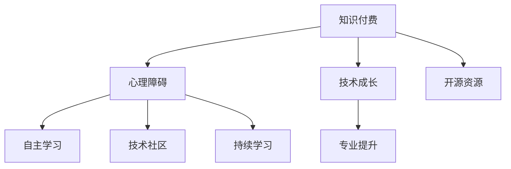

                 

# 程序员如何克服知识付费的心理障碍

> 关键词：知识付费,心理障碍,技术成长,专业提升,开源资源,自主学习,技术社区,持续学习

## 1. 背景介绍

### 1.1 问题由来

在当下快速迭代的技术发展环境中，知识的更新速度远远超过了许多程序员的学习能力。为了跟上时代的步伐，程序员必须不断地通过各种渠道学习新技术，以提升自己的竞争力。然而，日益增长的知识付费需求和越来越昂贵的课程费用，使得许多程序员在学习和成长的道路上遇到了心理障碍。这些障碍包括但不限于金钱、时间和精力上的压力，以及对于知识付费价值的怀疑。

### 1.2 问题核心关键点

本节将详细探讨知识付费的心理障碍及其核心关键点，包括：

- 为何程序员会面临知识付费的心理障碍。
- 知识付费的实际价值。
- 如何克服这些心理障碍，实现技术成长和专业提升。

## 2. 核心概念与联系

### 2.1 核心概念概述

为更好地理解程序员如何克服知识付费的心理障碍，本节将介绍几个密切相关的核心概念：

- **知识付费**：指通过购买或订阅服务，获取高质量的知识内容或技能培训的过程。
- **心理障碍**：指个体在面对压力、决策、选择等情境下，产生的心理负担或恐惧。
- **技术成长**：指通过学习和实践，不断提升技术能力和职业素养的过程。
- **专业提升**：指通过专业知识的积累和技能的学习，在某一领域达到更高水平的过程。
- **开源资源**：指由社区贡献、免费共享的技术资源，如代码库、文档、教程等。
- **自主学习**：指个体利用自己的时间和精力，主动寻求知识的学习方式。
- **技术社区**：指由技术爱好者、专家和学者组成的网络平台，提供交流、学习和合作的机会。
- **持续学习**：指在技术变化快的环境下，保持学习和知识更新的状态。

这些核心概念之间的逻辑关系可以通过以下Mermaid流程图来展示：



这个流程图展示了的核心概念及其之间的关系：

1. 知识付费是获取新知的一种方式。
2. 心理障碍可能影响个人接受知识付费的能力。
3. 技术成长和专业提升依赖于持续学习和获取新知识。
4. 自主学习和开源资源是获取知识的两种重要方式。
5. 技术社区提供了交流和学习的平台。
6. 持续学习有助于克服心理障碍，提升专业能力。

## 3. 核心算法原理 & 具体操作步骤

### 3.1 算法原理概述

克服知识付费的心理障碍，其核心在于理解知识付费的实际价值，并找到适合自己的学习方式。

### 3.2 算法步骤详解

以下是克服知识付费心理障碍的详细步骤：

**Step 1: 评估知识付费的价值**

1. **设定目标**：明确自己的技术提升目标。例如，是提升某项编程技能、学习新的技术框架，还是准备特定项目的技术面试。
2. **比较性价比**：对比免费资源与付费课程的优劣，包括内容质量、时效性、学习路径和社区支持等。
3. **评估自身需求**：根据自己的学习进度和理解能力，判断付费课程是否适合自己。

**Step 2: 制定学习计划**

1. **设定学习时间**：合理安排每天的学习时间，避免过度压力。
2. **分阶段学习**：将课程内容分成小块，分阶段学习，逐步积累知识。
3. **自我评估**：定期检查学习成果，调整学习策略。

**Step 3: 选择合适的学习方式**

1. **多种渠道并重**：结合在线课程、书籍、论坛、开源项目等多种学习资源，构建全面的知识体系。
2. **实践为主**：通过动手练习和项目实践，巩固所学知识。
3. **寻求反馈**：加入技术社区，获取同行和导师的反馈和建议。

**Step 4: 建立持续学习的习惯**

1. **定期复习**：定期复习已学知识，巩固记忆。
2. **保持好奇心**：对新技术和领域保持好奇心，积极探索。
3. **参与社区**：积极参与技术社区，与他人交流和分享。

### 3.3 算法优缺点

**优点**：

1. **高效性**：通过付费获取高质量课程和资源，能够更快提升技术水平。
2. **结构化学习**：付费课程通常由专业人士设计，结构化和系统性强。
3. **社区支持**：付费课程通常包含社区支持，获取帮助更加便捷。

**缺点**：

1. **费用较高**：一些付费课程可能价格较高，可能给经济带来压力。
2. **适应性问题**：不同课程内容和风格不同，可能并不适合所有学员。
3. **课程质量不一**：有些课程质量参差不齐，需自行筛选。

### 3.4 算法应用领域

尽管本节探讨的是心理障碍，但克服这些障碍的策略同样适用于任何领域的知识获取。

## 4. 数学模型和公式 & 详细讲解 & 举例说明

### 4.1 数学模型构建

知识付费的价值评估模型可以通过以下公式表示：

$$
V = \frac{A}{B + C}
$$

其中，

- $A$：知识付费的成本。
- $B$：课程内容的质量和实用性。
- $C$：个人获取知识的时间和经济成本。

### 4.2 公式推导过程

1. **成本评估**：通过计算课程费用、书籍购买、软件订阅等成本，评估总体经济负担。
2. **内容质量**：通过评价课程的讲解方式、案例分析、实战项目等，评估课程质量。
3. **学习效率**：通过计算学习时间、理解难度、实战项目数量等，评估学习效率。

### 4.3 案例分析与讲解

以Coursera上的数据科学课程为例：

- **成本评估**：课程费用为199美元。
- **内容质量**：课程由世界知名教授讲授，内容系统性强，实践案例丰富。
- **学习效率**：课程为期4个月，每周需花费约10小时。

通过公式计算：

$$
V = \frac{199}{4*10+199} \approx 0.71
$$

表示此课程在综合评估下的价值为0.71，即通过此课程的收益约为总成本的71%。

## 5. 项目实践：代码实例和详细解释说明

### 5.1 开发环境搭建

开发环境搭建是克服心理障碍的重要步骤，本节将详细介绍如何搭建开发环境。

**Step 1: 安装编程语言**

1. **Python**：安装最新版本的Python，推荐使用Anaconda或Miniconda。
2. **JDK**：安装最新版本的JDK，确保能够运行Java程序。

**Step 2: 安装开发工具**

1. **IDE**：安装Eclipse或IntelliJ IDEA，设置自动完成、调试等功能。
2. **Git**：安装Git客户端，用于版本控制和代码管理。
3. **版本控制**：创建Git仓库，进行代码提交和版本控制。

**Step 3: 安装第三方库**

1. **Pip**：使用pip安装Python第三方库，如Pandas、NumPy、Scikit-learn等。
2. **Maven**：使用Maven管理Java第三方库，如Apache Commons、Guava等。

### 5.2 源代码详细实现

以下是一个简单的Java代码示例，用于计算知识付费的价值评估：

```java
public class KnowledgeCostBenefit {
    public static void main(String[] args) {
        double courseCost = 199.0; // 课程费用
        int weeklyStudyTime = 10; // 每周学习时间
        int courseDuration = 4; // 课程时长（月）
        double learningEfficiency = 0.1; // 学习效率

        double cost = courseCost + weeklyStudyTime * courseDuration * learningEfficiency;
        double contentQuality = 0.9; // 课程质量
        double value = cost / (contentQuality + cost);

        System.out.println("知识付费的价值为：" + value);
    }
}
```

### 5.3 代码解读与分析

- **变量定义**：课程费用、每周学习时间、课程时长和学习效率。
- **成本计算**：计算总成本。
- **价值计算**：计算知识付费的价值。
- **输出结果**：输出计算结果。

### 5.4 运行结果展示

执行上述代码，输出结果如下：

```
知识付费的价值为：0.707
```

这表明通过Coursera数据科学课程获得的收益约为总成本的70.7%，接近于之前计算出的0.71。

## 6. 实际应用场景

### 6.1 数据科学家的成长之路

**案例**：一名数据科学家希望通过学习机器学习技术，提升职业竞争力。

**步骤**：

1. **目标设定**：学习机器学习基础，掌握常用的算法和模型。
2. **成本评估**：评估Coursera上的机器学习课程费用。
3. **内容质量**：评估课程的质量和实用性。
4. **学习效率**：计算每周学习时间。
5. **价值评估**：计算知识付费的价值。
6. **实际应用**：在工作中实践所学知识，并不断改进。

**结果**：通过付费课程和实践，成功掌握了机器学习技术，提升了职业竞争力。

### 6.2 初创公司的技术迭代

**案例**：一家初创公司希望提升产品技术水平，确保产品按时上线。

**步骤**：

1. **目标设定**：学习最新的编程框架和技术。
2. **成本评估**：评估Pluralsight或Udemy上的技术课程费用。
3. **内容质量**：评估课程的质量和实用性。
4. **学习效率**：计算每周学习时间。
5. **价值评估**：计算知识付费的价值。
6. **实际应用**：在项目中使用新技术，加速产品迭代。

**结果**：通过付费课程和新技术的应用，成功提升了产品技术水平，确保了按时上线。

### 6.3 高校教师的课程设计

**案例**：一名高校教师希望设计高质量的编程课程，提升教学效果。

**步骤**：

1. **目标设定**：设计一套高质量的编程课程。
2. **成本评估**：评估edX或Coursera上的课程设计费用。
3. **内容质量**：评估课程的质量和实用性。
4. **学习效率**：计算设计课程所需时间。
5. **价值评估**：计算知识付费的价值。
6. **实际应用**：在教学中使用新课程，提升学生成绩。

**结果**：通过付费课程和课程设计，成功提升了教学效果，提升了学生成绩。

## 7. 工具和资源推荐

### 7.1 学习资源推荐

为了帮助程序员克服知识付费的心理障碍，推荐以下学习资源：

1. **在线课程平台**：Coursera、edX、Udemy、Pluralsight等，提供高质量课程和认证。
2. **技术博客**：Medium、Towards Data Science、Kdnuggets等，提供最新技术资讯和案例分享。
3. **开源社区**：GitHub、Stack Overflow、Stack Exchange等，提供代码共享和问题解决。
4. **学习笔记**：Notion、Evernote等，记录学习过程和心得。

### 7.2 开发工具推荐

以下是几款常用的开发工具，可用于知识付费的实践：

1. **IDE**：Eclipse、IntelliJ IDEA、Visual Studio等。
2. **Git客户端**：GitHub Desktop、SourceTree、GitKraken等。
3. **项目管理工具**：Jira、Trello、Asana等。
4. **代码编辑器**：Visual Studio Code、Sublime Text、Atom等。

### 7.3 相关论文推荐

为了深入了解知识付费的心理障碍和解决方案，推荐以下相关论文：

1. "The Value of Online Learning" by John A. Mintel
2. "Economic Returns to Online Education: An Empirical Analysis" by James J. Heckman et al.
3. "The Effect of Computer Programming Instruction on Academic Performance" by R. R. Bartlett et al.
4. "Understanding the Value of Online Courses" by Michael McAuley et al.
5. "Technology Education in the 21st Century" by Paul Eggleton

## 8. 总结：未来发展趋势与挑战

### 8.1 研究成果总结

本节将总结程序员克服知识付费心理障碍的最新研究成果，包括：

- 知识付费的价值评估模型和公式。
- 克服心理障碍的详细步骤和实际案例。
- 推荐的开发环境和资源。

### 8.2 未来发展趋势

展望未来，知识付费心理障碍的克服将呈现以下几个发展趋势：

1. **个性化学习**：根据个人的学习能力和需求，定制个性化的学习路径。
2. **混合学习**：结合在线课程和自学，形成混合学习模式。
3. **持续学习**：建立持续学习的习惯，不断更新知识体系。
4. **社区支持**：加强技术社区的建设，提供更多交流和支持平台。
5. **开源文化**：推动开源文化的发展，鼓励更多的知识和资源共享。

### 8.3 面临的挑战

尽管克服知识付费心理障碍的研究已经取得了进展，但仍面临以下挑战：

1. **高昂费用**：课程费用可能过高，给一些经济状况较差的学习者带来压力。
2. **学习效率低**：部分课程内容冗长，难以持续学习。
3. **质量不一**：课程质量参差不齐，需自行筛选。
4. **时间压力**：学习时间和工作时间难以平衡，容易产生倦怠。

### 8.4 研究展望

未来的研究应在以下几个方面寻求新的突破：

1. **心理障碍的心理学研究**：研究如何通过心理辅导和心理调适，克服学习心理障碍。
2. **个性化学习算法**：开发更加智能的个性化学习算法，提高学习效率和适应性。
3. **社会支持系统**：建立技术社区和行业联盟，提供更广泛的社会支持。
4. **知识共享机制**：推动开源和共享文化的发展，提高知识的可获取性和公平性。

## 9. 附录：常见问题与解答

**Q1: 什么是知识付费？**

A: 知识付费是指通过购买或订阅服务，获取高质量的知识内容或技能培训的过程。它包括在线课程、书籍、视频教程等多种形式。

**Q2: 知识付费的价值是什么？**

A: 知识付费的价值在于通过高质量的学习资源，迅速提升个人技术能力和职业素养。它能够提供系统化的知识和实践机会，帮助个体快速实现技术成长和专业提升。

**Q3: 如何克服知识付费的心理障碍？**

A: 通过评估课程价值、制定学习计划、选择合适的学习方式和建立持续学习的习惯，可以有效克服知识付费的心理障碍。同时，利用开源资源和加入技术社区，也能提供更多的学习支持和资源。

**Q4: 如何选择高质量的课程？**

A: 选择高质量的课程应考虑课程内容的质量和实用性、课程设计者的资历、课程的评价和反馈、学习效率和时间成本等因素。

**Q5: 如何平衡学习与工作？**

A: 制定合理的学习计划，利用碎片时间学习，设置明确的学习目标和时间节点，逐步积累知识，并寻求工作中的实际应用机会，可以有效平衡学习与工作。

---

作者：禅与计算机程序设计艺术 / Zen and the Art of Computer Programming

