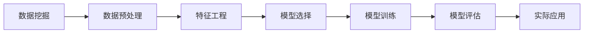

                 

# 程序员如何利用AI技术优化知识发现

> 关键词：人工智能,知识发现,数据挖掘,机器学习,深度学习,特征工程,数据预处理,模型评估,实际应用

## 1. 背景介绍

在现代社会，数据无处不在，无论是商业分析、科学研究还是日常决策，都离不开对海量数据进行知识发现。然而，面对繁杂的数据集，传统的数据挖掘和统计分析方法往往显得力不从心。此时，人工智能技术的介入为数据驱动的决策支持提供了新的突破口。本文将详细探讨程序员如何利用AI技术，通过知识发现来优化决策过程。

### 1.1 数据驱动决策的重要性

数据驱动决策意味着基于数据而非直觉或经验来进行决策。随着信息技术的发展，尤其是互联网的普及，各行各业产生了大量的数据，为数据驱动决策提供了可能。通过对这些数据的挖掘和分析，可以发现数据背后隐藏的规律和趋势，为制定更好的决策提供科学依据。

### 1.2 AI技术在知识发现中的作用

AI技术，特别是机器学习和深度学习，通过自动化数据分析和模式识别，能够从海量的数据中提取有价值的信息，辅助决策者进行客观决策。AI技术不仅可以处理结构化数据，还可以处理非结构化数据，如文本、图像、语音等，极大地拓展了知识发现的应用范围。

## 2. 核心概念与联系

### 2.1 核心概念概述

为更好地理解AI技术在知识发现中的应用，本节将介绍几个关键概念：

- 数据挖掘(Data Mining)：通过自动化算法从数据中提取有价值的信息和模式。
- 机器学习(Machine Learning)：使计算机能够从数据中学习规律，并基于这些规律进行预测和决策。
- 深度学习(Deep Learning)：一种基于神经网络的机器学习方法，能够处理复杂的非线性关系。
- 特征工程(Feature Engineering)：通过选择、构造、变换特征，提高模型的预测能力。
- 数据预处理(Data Preprocessing)：对原始数据进行清洗、归一化、降维等处理，为模型训练提供干净、高效的数据。
- 模型评估(Model Evaluation)：通过交叉验证、AUC、RMSE等指标评估模型的性能。
- 实际应用(Real-world Applications)：将知识发现技术应用于商业、医疗、金融等实际场景，优化决策支持。

这些概念之间紧密联系，共同构成了AI技术在知识发现中的应用框架。通过理解这些核心概念，可以更好地把握知识发现技术的本质和应用方法。

### 2.2 核心概念的Mermaid流程图



以上流程图展示了知识发现技术的基本流程。首先从数据挖掘开始，对原始数据进行清洗和预处理，然后构造特征并进行模型选择，接着进行模型训练和评估，最后应用于实际场景中，形成闭环。

## 3. 核心算法原理 & 具体操作步骤

### 3.1 算法原理概述

知识发现通常涉及多个步骤，包括数据预处理、特征提取、模型选择和训练、模型评估和优化等。本文将重点介绍数据预处理、特征工程和模型训练的原理。

### 3.2 算法步骤详解

#### 3.2.1 数据预处理

数据预处理是知识发现的重要环节，其目的是将原始数据转换为适合模型训练的格式。预处理过程包括以下几个关键步骤：

1. **缺失值处理**：识别和填补缺失值，避免模型训练时因缺失值而崩溃。
2. **数据清洗**：去除异常值和噪声，确保数据的质量。
3. **归一化**：将不同尺度的数据转换为同一尺度，防止某些特征在模型中占据主导地位。
4. **降维**：通过PCA、LDA等技术减少数据维度，提升模型训练效率。

#### 3.2.2 特征工程

特征工程是知识发现的灵魂，其目的是从原始数据中提取出最具预测能力的特征。特征工程可以分为以下几个步骤：

1. **特征选择**：根据领域知识和经验，选择最相关的特征。
2. **特征构造**：通过组合、变换等技术构造新的特征。
3. **特征编码**：将特征转换为模型可以处理的格式，如独热编码、标准化等。

#### 3.2.3 模型训练

模型训练是知识发现的最终环节，其目的是训练出一个能够准确预测目标变量的模型。常见的模型包括线性回归、决策树、随机森林、神经网络等。训练过程包括以下几个关键步骤：

1. **模型选择**：根据数据类型和问题类型选择合适的模型。
2. **划分数据集**：将数据集划分为训练集、验证集和测试集，进行交叉验证。
3. **模型优化**：通过调整超参数、正则化等方法优化模型性能。
4. **模型评估**：使用AUC、RMSE、MAE等指标评估模型性能，防止过拟合。

### 3.3 算法优缺点

知识发现技术在优化决策支持方面具有以下优点：

1. **自动化分析**：自动化数据处理和模型训练，减少人工干预，提升效率。
2. **数据融合**：可以处理多种数据类型，包括结构化和非结构化数据，提供全面视角。
3. **模式识别**：能够发现数据中的复杂模式和关联，提供更深入的洞察。

然而，知识发现技术也存在一些局限性：

1. **数据质量依赖**：模型性能高度依赖数据的质量和特征的选择，数据不充分或特征不准确可能导致模型失效。
2. **模型复杂度高**：某些模型（如深度学习）需要大量数据和计算资源，训练复杂且容易过拟合。
3. **可解释性不足**：部分模型（如神经网络）缺乏可解释性，难以理解和调试。

### 3.4 算法应用领域

知识发现技术已经广泛应用于各个领域，以下是几个典型的应用场景：

1. **商业智能(Business Intelligence, BI)**：通过分析客户行为、市场趋势等数据，优化营销策略，提升销售额。
2. **金融分析(Financial Analysis)**：分析金融市场数据，预测股票价格，规避风险，优化投资组合。
3. **医疗诊断(Medical Diagnosis)**：通过分析患者病历、基因数据等，辅助医生诊断和治疗疾病。
4. **安全监控(Security Monitoring)**：分析网络流量、日志等数据，检测和防范安全威胁。
5. **推荐系统(Recommendation System)**：分析用户行为数据，推荐个性化的商品或内容，提升用户体验。

## 4. 数学模型和公式 & 详细讲解 & 举例说明

### 4.1 数学模型构建

在知识发现中，常用的数学模型包括回归模型、分类模型和聚类模型。本文将以线性回归模型为例，介绍其数学模型的构建。

设训练集为 $\{(x_i, y_i)\}_{i=1}^N$，其中 $x_i \in \mathbb{R}^d$ 为特征向量，$y_i$ 为目标变量。线性回归模型的目标是最小化损失函数：

$$
\min_{\theta} \sum_{i=1}^N (y_i - \theta^T x_i)^2
$$

其中 $\theta$ 为模型的权重向量，包含 $d$ 个参数。

### 4.2 公式推导过程

线性回归模型的最小二乘解为：

$$
\theta = (\sum_{i=1}^N x_i x_i^T)^{-1} \sum_{i=1}^N x_i y_i
$$

求解 $\theta$ 的过程如下：

1. 计算 $X = \sum_{i=1}^N x_i x_i^T$，$Y = \sum_{i=1}^N x_i y_i$。
2. 计算 $X^{-1}$。
3. 计算 $\theta = X^{-1} Y$。

### 4.3 案例分析与讲解

以某电商平台的销售数据为例，分析不同商品类别和促销策略对销售额的影响。

设 $x_i$ 为商品类别和促销策略的编码，$y_i$ 为销售额。通过线性回归模型，可以找出最相关的商品类别和促销策略，并预测不同策略下的销售额变化。

## 5. 项目实践：代码实例和详细解释说明

### 5.1 开发环境搭建

为了进行知识发现项目的开发，需要搭建一个完整的开发环境。以下是Python环境搭建的详细步骤：

1. **安装Python**：下载Python最新版本，并进行安装。
2. **安装PyTorch**：使用pip安装PyTorch，这是一个强大的深度学习框架。
3. **安装NumPy、Pandas、Scikit-Learn等库**：这些库提供了数据处理和模型训练所需的基本功能。
4. **安装Jupyter Notebook**：用于编写和运行代码，支持Python、R等多种语言。

### 5.2 源代码详细实现

以下是一个线性回归模型的示例代码，用于预测房价。

```python
import numpy as np
import pandas as pd
from sklearn.linear_model import LinearRegression
from sklearn.model_selection import train_test_split
from sklearn.metrics import mean_squared_error

# 加载数据集
data = pd.read_csv('house_prices.csv')

# 特征选择
X = data[['area', 'location', 'room_count']]
y = data['price']

# 划分训练集和测试集
X_train, X_test, y_train, y_test = train_test_split(X, y, test_size=0.2, random_state=42)

# 训练模型
model = LinearRegression()
model.fit(X_train, y_train)

# 预测房价
y_pred = model.predict(X_test)

# 评估模型性能
rmse = np.sqrt(mean_squared_error(y_test, y_pred))
print('RMSE:', rmse)
```

### 5.3 代码解读与分析

上述代码中，首先使用Pandas加载了数据集，然后使用Scikit-Learn的线性回归模型进行训练和预测。代码的关键步骤如下：

1. **数据加载**：使用Pandas读取CSV文件，将数据集加载到Python中。
2. **特征选择**：选择最相关的特征，构建特征矩阵 $X$ 和目标向量 $y$。
3. **数据划分**：使用train_test_split将数据集划分为训练集和测试集。
4. **模型训练**：使用LinearRegression模型训练模型。
5. **模型预测**：使用训练好的模型对测试集进行预测。
6. **模型评估**：计算模型预测的RMSE，评估模型性能。

## 6. 实际应用场景

### 6.1 金融数据分析

在金融分析中，知识发现技术可以用于预测股票价格、评估信用风险等。通过分析历史交易数据、新闻评论、市场情绪等数据，可以构建预测模型，辅助投资者做出决策。

### 6.2 医疗诊断

在医疗诊断中，知识发现技术可以用于辅助医生诊断疾病。通过分析患者的病历数据、基因数据、影像数据等，可以构建预测模型，辅助医生进行疾病诊断和治疗方案的制定。

### 6.3 推荐系统

在推荐系统中，知识发现技术可以用于推荐个性化的商品或内容。通过分析用户的历史行为数据、偏好数据、社交数据等，可以构建推荐模型，提高用户满意度。

### 6.4 未来应用展望

随着数据量的不断增加和AI技术的不断进步，知识发现技术将在更多领域发挥重要作用。未来的发展趋势包括：

1. **自动化程度提升**：自动化数据清洗、特征工程和模型训练，减少人工干预。
2. **数据融合能力增强**：处理多种数据类型，提供全面视角。
3. **模型性能提升**：开发更高效、更准确的模型，提升预测能力。
4. **可解释性增强**：开发更易解释的模型，提高模型的透明度和可信度。

## 7. 工具和资源推荐

### 7.1 学习资源推荐

1. **Kaggle**：一个数据科学竞赛平台，提供丰富的数据集和社区资源。
2. **Coursera**：提供各种机器学习和深度学习的在线课程。
3. **Google Colab**：谷歌提供的免费Jupyter Notebook环境，支持GPU计算，方便模型训练和调试。
4. **TensorFlow**：由谷歌开发的深度学习框架，提供丰富的工具和库支持。
5. **PyTorch**：Facebook开发的深度学习框架，以其动态计算图和易于使用著称。

### 7.2 开发工具推荐

1. **Jupyter Notebook**：一个强大的交互式编程环境，支持Python、R等多种语言。
2. **Scikit-Learn**：一个Python机器学习库，提供了丰富的数据处理和模型训练功能。
3. **TensorFlow**：一个灵活的深度学习框架，支持CPU、GPU和TPU等多种计算资源。
4. **PyTorch**：一个动态计算图框架，易于使用，性能优秀。
5. **Seaborn**：一个基于Matplotlib的可视化库，提供美观的图表和数据展示功能。

### 7.3 相关论文推荐

1. **《深度学习》**：Ian Goodfellow等著，全面介绍了深度学习的基本概念和算法。
2. **《机器学习》**：Tom Mitchell著，介绍了机器学习的基本理论和方法。
3. **《数据挖掘导论》**：Jerry Kilian著，介绍了数据挖掘的基本流程和工具。
4. **《Python数据科学手册》**：Jake VanderPlas著，介绍了Python在数据科学中的应用。
5. **《统计学习方法》**：李航著，介绍了统计学习的基本概念和算法。

## 8. 总结：未来发展趋势与挑战

### 8.1 研究成果总结

本文详细介绍了程序员如何利用AI技术优化知识发现，探讨了数据预处理、特征工程和模型训练的基本原理和操作步骤。通过实际代码示例，展示了知识发现技术在金融、医疗、推荐等领域的应用。

### 8.2 未来发展趋势

未来，知识发现技术将继续向自动化、高效化和可解释性方向发展。以下是几个主要趋势：

1. **自动化程度提升**：通过自动化工具和算法，减少人工干预，提升效率。
2. **数据融合能力增强**：处理多种数据类型，提供全面视角。
3. **模型性能提升**：开发更高效、更准确的模型，提升预测能力。
4. **可解释性增强**：开发更易解释的模型，提高模型的透明度和可信度。

### 8.3 面临的挑战

尽管知识发现技术已经取得了重要进展，但仍面临一些挑战：

1. **数据质量依赖**：模型性能高度依赖数据的质量和特征的选择，数据不充分或特征不准确可能导致模型失效。
2. **模型复杂度高**：某些模型（如深度学习）需要大量数据和计算资源，训练复杂且容易过拟合。
3. **可解释性不足**：部分模型（如神经网络）缺乏可解释性，难以理解和调试。

### 8.4 研究展望

未来的研究方向包括：

1. **自动化数据处理**：开发自动化工具，减少人工干预。
2. **模型可解释性**：开发更易解释的模型，提高模型的透明度和可信度。
3. **多模态数据融合**：处理多种数据类型，提供全面视角。
4. **跨领域应用**：将知识发现技术应用于更多领域，如智能制造、智慧城市等。

总之，知识发现技术将在更多领域发挥重要作用，为决策支持提供科学依据。然而，如何克服当前的挑战，实现技术的全面突破，仍然需要学术界和工业界的共同努力。

## 9. 附录：常见问题与解答

### Q1: 数据预处理和特征工程的重要性是什么？

A: 数据预处理和特征工程是知识发现的重要环节，其目的是将原始数据转换为适合模型训练的格式，并提取最具预测能力的特征。通过有效的数据预处理和特征工程，可以提高模型的训练效率和预测能力。

### Q2: 如何选择合适的模型？

A: 选择合适的模型需要考虑数据类型、问题类型、模型复杂度和计算资源等多个因素。对于简单的线性关系，可以选择线性回归或逻辑回归模型；对于复杂的非线性关系，可以选择决策树、随机森林或神经网络模型。

### Q3: 知识发现技术有哪些局限性？

A: 知识发现技术面临一些局限性，包括数据质量依赖、模型复杂度高、可解释性不足等。为了克服这些局限性，需要开发自动化工具、更高效和可解释的模型，并进行数据融合和多模态处理。

### Q4: 如何在实际应用中评估模型性能？

A: 在实际应用中，可以使用AUC、RMSE、MAE等指标评估模型的性能。通过交叉验证和模型调参，选择最优的模型参数，确保模型的泛化能力。

### Q5: 知识发现技术在各个领域的应用前景是什么？

A: 知识发现技术在金融、医疗、推荐等领域具有广阔的应用前景。通过分析大量数据，可以发现数据背后的规律和趋势，辅助决策者进行科学决策。

---

作者：禅与计算机程序设计艺术 / Zen and the Art of Computer Programming

