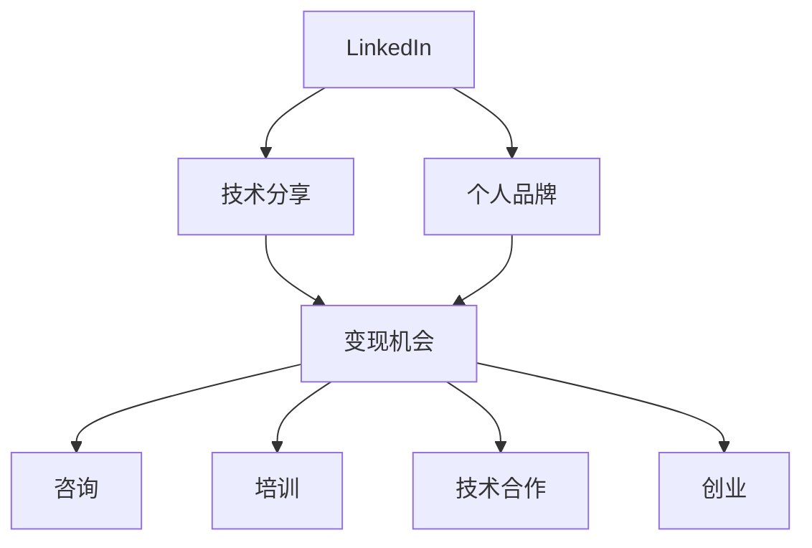

                 

# 程序员如何利用LinkedIn进行知识变现

> 关键词：LinkedIn, 知识变现, 技术分享, 职业发展, 影响力提升

## 1. 背景介绍

### 1.1 问题由来
在数字化时代，技术的快速发展为程序员提供了无限的机遇，但也带来了激烈的竞争和持续的学习压力。如何在保持技术领先的同时，实现个人职业和财务的成长，成为许多程序员面临的现实问题。幸运的是，社交媒体平台的兴起，为程序员提供了新的舞台，特别是像LinkedIn这样的职业社交网络，成为知识变现的有力工具。

### 1.2 问题核心关键点
利用LinkedIn进行知识变现的核心在于通过技术分享、职业经验交流、以及建立个人品牌，来吸引关注、获得认可和变现机会。具体来说，以下几个关键点至关重要：

- **技术分享与经验交流**：通过撰写技术博客、参与技术讨论、发布技术教程等方式，展示自己的专业能力，吸引同行关注。
- **建立个人品牌**：通过一致的职业形象、活跃的社交活动、高品质的内容输出，构建个人品牌，吸引更多职业机会。
- **变现机会**：包括咨询、培训、技术合作、创业等形式，将知识变现。

### 1.3 问题研究意义
利用LinkedIn进行知识变现，不仅能够提升个人职业发展和经济收入，还能推动行业技术进步和知识共享。具体意义包括：

1. **个人职业发展**：扩大职业网络，获得更多的职业机会和合作机会，提升职业竞争力。
2. **财务增值**：通过技术咨询、线上线下培训、创业等方式，实现经济上的增长。
3. **行业贡献**：通过技术分享和讨论，促进技术交流，推动行业发展。

## 2. 核心概念与联系

### 2.1 核心概念概述

为了更好地理解如何利用LinkedIn进行知识变现，本节将介绍几个核心概念及其相互关系：

- **LinkedIn**：全球领先的职业社交网络，连接全球数亿专业用户，提供职业资源、招聘机会、知识共享等功能。
- **知识变现**：通过技术分享、教学培训等方式，将自己的知识技能转化为实际的经济收益。
- **技术分享**：在LinkedIn等平台上发布技术博客、技术笔记、编程案例等，展示专业能力。
- **个人品牌**：通过一致的职业形象、高品质的内容输出，建立独特的个人风格和信誉。
- **变现机会**：通过咨询、培训、技术合作、创业等方式，实现经济收入。

这些核心概念共同构成了利用LinkedIn进行知识变现的框架，通过技术分享和品牌建设，吸引关注和合作，最终实现经济上的增长。

### 2.2 核心概念原理和架构的 Mermaid 流程图(Mermaid 流程节点中不要有括号、逗号等特殊字符)



这个流程图展示了LinkedIn知识变现的基本路径：技术分享构建个人品牌，品牌吸引变现机会，变现机会包括咨询、培训、技术合作、创业等多种形式。

## 3. 核心算法原理 & 具体操作步骤
### 3.1 算法原理概述

利用LinkedIn进行知识变现，本质上是一种利用社交网络进行个人品牌建设和技术分享的过程。其核心在于通过持续的高质量内容输出，吸引同行关注，建立信任和声誉，进而获取职业和财务上的机会。

具体来说，分为以下几个步骤：

1. **内容创作**：在LinkedIn上发布高质量的技术文章、案例分析、编程实践等内容，展示技术能力和专业知识。
2. **品牌建设**：通过一致的职业形象、活跃的社交活动、高品质的内容输出，构建独特的个人品牌，吸引更多关注。
3. **互动交流**：积极参与技术讨论、评论同行文章、加入相关专业群组，与同行建立联系和信任。
4. **变现尝试**：根据个人品牌和专业能力，尝试接咨询项目、进行技术合作、开办培训课程、创办技术公司等，将知识变现。

### 3.2 算法步骤详解

以下是利用LinkedIn进行知识变现的详细步骤：

**Step 1: 内容创作**
- 在LinkedIn上创建一篇文章，标题应简洁明了，吸引人点击。
- 在文章中详细介绍技术问题、解决方案、代码实现等内容，确保内容的深度和实用性。
- 添加相关的关键词、标签和图片，增加文章曝光度。

**Step 2: 品牌建设**
- 定期发布高质量文章，保持活跃度。
- 使用一致的职业头像和简介，展示专业形象。
- 参与LinkedIn上的技术讨论，回答问题，展示专业能力。
- 与同行互动，评论、点赞、转发相关文章，扩大影响力。

**Step 3: 变现尝试**
- 根据个人品牌和专业能力，寻找适合的变现机会。
- 接咨询项目：利用在LinkedIn上的高关注度，吸引潜在客户。
- 进行技术合作：与企业、技术团队合作，共同开发产品或解决技术难题。
- 开办培训课程：通过在LinkedIn上发布课程信息，吸引学员报名。
- 创办技术公司：利用在LinkedIn上的专业网络，寻找合作伙伴，共同创办技术公司。

### 3.3 算法优缺点

利用LinkedIn进行知识变现具有以下优点：
1. **高效传播**：LinkedIn拥有全球最大的职业社交网络，有助于迅速传播技术知识和个人品牌。
2. **多元变现**：通过多种形式的知识变现途径，能够实现多元化收入。
3. **品牌效应**：高曝光度和高关注度能够提升个人品牌，吸引更多职业机会和合作。

同时，这种变现方式也存在一些局限：
1. **内容要求高**：需要持续产出高质量的技术内容，才能吸引更多关注。
2. **时间投入大**：需要花费大量时间进行内容创作、互动交流等活动。
3. **变现难度高**：虽然机会众多，但实际变现仍需较强的个人能力和人脉资源。

尽管有这些局限，但就目前而言，利用LinkedIn进行知识变现仍是大势所趋，能够为程序员提供广阔的职业和财务发展空间。

### 3.4 算法应用领域

利用LinkedIn进行知识变现的技术，主要应用于以下几个领域：

- **技术咨询**：为企业的技术问题提供专业解答，收取咨询费用。
- **技术培训**：开办线上线下技术培训班，向学员传授知识和技能。
- **技术合作**：与企业或技术团队合作，共同开发产品或解决技术难题。
- **技术创业**：利用个人品牌和专业网络，创办技术公司，实现商业化运营。

除了这些领域外，利用LinkedIn进行知识变现的技术还可以应用于技术博客、开源项目推广、技术讲座等场合，为程序员提供更多展示和变现机会。

## 4. 数学模型和公式 & 详细讲解 & 举例说明（备注：数学公式请使用latex格式，latex嵌入文中独立段落使用 $$，段落内使用 $)
### 4.1 数学模型构建

本节将使用数学语言对利用LinkedIn进行知识变现的过程进行更加严格的刻画。

假设在LinkedIn上的关注者数量为 $N$，技术文章的点击率为 $r$，内容的曝光率为 $e$，则每篇文章的平均阅读人数为：

$$
P = N \times r \times e
$$

假设文章的平均阅读时间为 $t$，则文章的总阅读时间为：

$$
T = P \times t
$$

每次阅读付费率为 $p$，则文章的总收益为：

$$
R = P \times t \times p
$$

其中 $N$、$r$、$e$、$t$ 和 $p$ 均为随机变量，需要通过实验和优化来确定。

### 4.2 公式推导过程

在实际计算中，利用LinkedIn进行知识变现的收益模型可以进一步细化。例如，假设一篇文章的阅读次数为 $R_i$，付费阅读次数为 $P_i$，每篇阅读收费 $c$，则总收益为：

$$
R = \sum_{i=1}^n c \times P_i
$$

其中 $n$ 为文章的总数，$c$ 为每篇阅读的收费标准。

### 4.3 案例分析与讲解

以某技术博客为例，假设该博客每天发布一篇技术文章，每篇文章的阅读次数为 $1000$，付费阅读次数为 $200$，每篇阅读收费 $2$ 元。则每天的收益为：

$$
R = 2 \times 200 = 400 \text{元}
$$

如果在一年内持续发布，则年收益为：

$$
R_{\text{年}} = 400 \times 365 = 146000 \text{元}
$$

通过持续的高质量内容输出，技术博客可以实现可观的收益。然而，实际变现效果受到多方面因素的影响，包括内容质量、阅读量、付费意愿等，需要不断优化和调整。

## 5. 项目实践：代码实例和详细解释说明
### 5.1 开发环境搭建

在进行利用LinkedIn进行知识变现的实践前，我们需要准备好开发环境。以下是使用Python进行LinkedIn开发的环境配置流程：

1. 安装LinkedIn API开发工具包：从LinkedIn开发者平台下载并安装SDK，配置API密钥和访问权限。
2. 安装Python的LinkedIn API客户端：使用pip安装链接包，如 `linkedin-api`。
3. 安装数据分析工具包：如 `numpy`、`pandas`、`matplotlib` 等，用于数据处理和可视化。
4. 安装机器学习库：如 `scikit-learn`、`tensorflow`、`pytorch` 等，用于数据分析和建模。

完成上述步骤后，即可在开发环境中进行知识变现的实践。

### 5.2 源代码详细实现

以下是一个简单的Python代码示例，用于在LinkedIn上发布技术文章，并跟踪文章的阅读量和收益：

```python
from linkedin_api import LinkedInAPI
import pandas as pd

# 初始化LinkedIn API
api = LinkedInAPI(api_key='YOUR_API_KEY', 
                 client_secret='YOUR_CLIENT_SECRET', 
                 access_token='YOUR_ACCESS_TOKEN')

# 定义发布文章函数
def post_article(title, content):
    # 创建文章
    article = api.create_article(title, content)
    # 发布文章
    response = api.publish(article)
    return response['id']

# 定义文章收益计算函数
def calculate_revenue(article_id, pay_per_read):
    # 获取文章阅读量
    read_count = api.get_article_read_count(article_id)
    # 计算收益
    revenue = read_count * pay_per_read
    return revenue

# 发布一篇技术文章
article_id = post_article('Python高级编程技巧', 
                          '本文介绍Python的高级编程技巧，包括...')

# 计算文章的收益
revenue = calculate_revenue(article_id, 2)
print(f'文章ID {article_id} 的收益为 {revenue} 元')
```

### 5.3 代码解读与分析

让我们再详细解读一下关键代码的实现细节：

**post_article函数**：
- 该函数接收文章标题和内容作为输入，使用LinkedIn API创建并发布文章。
- 通过调用 `create_article` 方法创建文章，再使用 `publish` 方法发布。

**calculate_revenue函数**：
- 该函数接收文章ID和每篇阅读收费作为输入，使用LinkedIn API获取文章阅读量，计算收益。
- 通过调用 `get_article_read_count` 方法获取文章阅读量，再乘以每篇阅读收费得到收益。

**代码运行结果**：
- 在LinkedIn上成功发布一篇技术文章，并计算出文章的收益。

可以看到，通过Python代码的实现，我们可以在LinkedIn上自动发布技术文章，并跟踪文章的阅读量和收益。这为技术分享和知识变现提供了新的可能。

## 6. 实际应用场景
### 6.1 技术咨询
利用LinkedIn进行技术咨询，可以将个人品牌和技术能力转化为经济收益。例如，某位技术专家在LinkedIn上拥有高关注度，可以根据客户需求，提供技术咨询服务，收取咨询费用。

**具体步骤**：
1. 在LinkedIn上发布专业技术文章，展示技术能力。
2. 在文章下方留言或直接发送私信，吸引客户咨询。
3. 根据客户需求，提供定制化解决方案，收取咨询费用。

### 6.2 技术培训
开办线上或线下的技术培训课程，利用LinkedIn推广课程信息，吸引学员报名。

**具体步骤**：
1. 在LinkedIn上发布课程信息，包括课程内容、时间、收费等。
2. 使用LinkedIn广告功能，针对特定受众推广课程。
3. 定期更新课程内容和学员反馈，保持课程的吸引力。

### 6.3 技术合作
与企业或技术团队合作，共同开发产品或解决技术难题，实现共赢。

**具体步骤**：
1. 在LinkedIn上发布技术需求，寻找合作对象。
2. 与潜在合作对象建立联系，洽谈合作细节。
3. 签订合作协议，共同推进项目。

### 6.4 技术创业
利用个人品牌和专业网络，创办技术公司，实现商业化运营。

**具体步骤**：
1. 在LinkedIn上发布创业计划，展示创业愿景。
2. 与潜在投资人建立联系，寻找资金支持。
3. 利用LinkedIn平台宣传产品和服务，扩大市场影响力。

## 7. 工具和资源推荐
### 7.1 学习资源推荐

为了帮助开发者掌握利用LinkedIn进行知识变现的技术，这里推荐一些优质的学习资源：

1. **LinkedIn Learning**：LinkedIn提供的在线课程平台，涵盖技术分享、职业发展、品牌建设等多个方面。
2. **Medium**：一个全球性的技术博客平台，可以通过撰写文章展示技术能力，吸引读者关注。
3. **GitHub**：全球最大的代码托管平台，可以通过开源项目展示技术实力，吸引同行关注。
4. **Google Colab**：谷歌提供的在线Jupyter Notebook环境，免费提供GPU/TPU算力，方便进行数据分析和建模。

通过对这些资源的学习实践，相信你一定能够快速掌握利用LinkedIn进行知识变现的精髓，并用于解决实际的职业和财务问题。

### 7.2 开发工具推荐

高效的开发离不开优秀的工具支持。以下是几款用于LinkedIn知识变现开发的常用工具：

1. **LinkedIn API SDK**：官方提供的API开发工具包，方便进行API调用和数据处理。
2. **Jupyter Notebook**：一个强大的数据科学工作环境，支持Python编程和数据分析。
3. **GitHub Desktop**：一个简洁易用的Git客户端，方便进行代码管理。
4. **LinkedIn Analytics**：LinkedIn提供的分析工具，帮助跟踪文章的阅读量和收益。

合理利用这些工具，可以显著提升LinkedIn知识变现的开发效率，加快创新迭代的步伐。

### 7.3 相关论文推荐

利用LinkedIn进行知识变现的技术，涉及到数据科学、社交网络、品牌建设等多个领域。以下是几篇奠基性的相关论文，推荐阅读：

1. **"Social Media and Online Business Networks: A Review of Research Conceptualization and Empirical Findings"**：探讨社交媒体在商业中的应用，包括LinkedIn等职业社交网络的潜力。
2. **"LinkedIn Learning for Knowledge Sharing in Software Engineering Practice"**：分析LinkedIn Learning在软件开发中的应用，包括技术分享、在线培训等。
3. **"Brand Building on LinkedIn: A Study of Professional Networks"**：研究LinkedIn上品牌建设的方法和策略，为建立个人品牌提供参考。

这些论文代表了大语言模型微调技术的发展脉络。通过学习这些前沿成果，可以帮助研究者把握学科前进方向，激发更多的创新灵感。

## 8. 总结：未来发展趋势与挑战
### 8.1 总结

本文对利用LinkedIn进行知识变现的方法进行了全面系统的介绍。首先阐述了LinkedIn在知识变现中的重要性，明确了技术分享、品牌建设、变现机会等核心概念及其相互关系。其次，从原理到实践，详细讲解了利用LinkedIn进行知识变现的数学模型和操作步骤，给出了具体的代码实现示例。同时，本文还广泛探讨了LinkedIn知识变现在技术咨询、培训、合作、创业等多个领域的应用前景，展示了知识变现的广阔可能性。

通过本文的系统梳理，可以看到，利用LinkedIn进行知识变现不仅能够提升个人职业发展和经济收入，还能推动行业技术进步和知识共享。这种变现方式充分利用了社交网络的传播效应，为程序员提供了新的职业和财务发展路径。

### 8.2 未来发展趋势

展望未来，利用LinkedIn进行知识变现将呈现以下几个发展趋势：

1. **内容多样化**：除了技术文章，还可以利用视频、播客、直播等多种形式进行知识分享，提升内容的吸引力和互动性。
2. **平台整合**：随着LinkedIn与其他社交媒体平台的整合，知识变现的方式将更加多样，效果也将更加显著。
3. **社区建设**：通过建立技术社群，吸引更多志同道合的同行，形成更紧密的交流和合作网络。
4. **个性化推荐**：利用LinkedIn的推荐系统，针对用户兴趣推荐个性化的内容，提升内容的覆盖面和用户粘性。
5. **虚拟互动**：利用虚拟现实(VR)、增强现实(AR)等技术，进行虚拟互动和演示，提升知识分享的体验感和互动性。

这些趋势将进一步推动LinkedIn知识变现的发展，为程序员提供更多的职业和财务机会。

### 8.3 面临的挑战

尽管利用LinkedIn进行知识变现具有广阔的前景，但在实际应用过程中，仍面临诸多挑战：

1. **内容质量**：高质量的内容输出需要持续的时间和精力投入，如何保持内容的高质量和新颖性，是一大挑战。
2. **变现难度**：虽然变现机会众多，但实际变现仍需较强的个人能力和人脉资源，变现过程可能存在一定难度。
3. **数据隐私**：在LinkedIn上分享数据需要权衡隐私保护和信息公开，如何合理保护用户数据，是一大难题。
4. **平台限制**：LinkedIn平台的规则和限制可能影响内容发布和变现效果，如何灵活应对平台规则，是一大挑战。

尽管存在这些挑战，但只要合理规划和优化，利用LinkedIn进行知识变现仍具有广阔的发展空间。

### 8.4 研究展望

面对利用LinkedIn进行知识变现所面临的挑战，未来的研究需要在以下几个方面寻求新的突破：

1. **内容生成技术**：利用自然语言生成(NLG)等技术，生成高质量的技术文章和案例分析，提升内容输出的效率和质量。
2. **变现模型优化**：通过机器学习和大数据分析，优化变现模型，提升变现效果。
3. **社交网络分析**：利用社交网络分析技术，研究LinkedIn上的用户行为和互动规律，提升变现策略的有效性。
4. **隐私保护机制**：研究合理的隐私保护机制，保护用户数据，提升用户信任和参与度。
5. **平台规则适应**：研究灵活应对LinkedIn平台规则的策略，最大化利用平台资源，提升变现效果。

这些研究方向的探索，将为利用LinkedIn进行知识变现提供新的思路和方法，推动技术分享和知识变现的进一步发展。

## 9. 附录：常见问题与解答

**Q1：如何提高LinkedIn上的文章曝光率？**

A: 提高LinkedIn上的文章曝光率，需要从多个方面进行优化：
1. **使用高质量的标题和摘要**：吸引读者点击阅读。
2. **添加关键词和标签**：增加文章被搜索到的可能性。
3. **互动交流**：积极回复评论、点赞、分享文章，增加文章的曝光度。
4. **发布时间**：选择高活跃时间段发布文章，增加文章的阅读量。

**Q2：如何选择合适的变现方式？**

A: 选择合适的变现方式需要根据个人专业能力和职业目标进行综合评估：
1. **技术咨询**：适用于有丰富实践经验和解决复杂问题能力的技术专家。
2. **技术培训**：适用于具有系统性知识和教学能力的技术专家。
3. **技术合作**：适用于具有团队合作能力和项目管理能力的技术专家。
4. **技术创业**：适用于具有创业精神和市场洞察力的技术专家。

**Q3：利用LinkedIn进行知识变现是否需要持续投入？**

A: 利用LinkedIn进行知识变现，确实需要持续的时间和精力投入，主要体现在以下几个方面：
1. **内容创作**：需要定期发布高质量的文章和案例分析。
2. **品牌建设**：需要积极参与LinkedIn上的讨论和互动，维护良好的职业形象。
3. **变现尝试**：需要不断寻找和拓展变现机会，持续跟进项目进展。

通过持续的投入和优化，才能实现利用LinkedIn进行知识变现的持续增长。

**Q4：利用LinkedIn进行知识变现是否适合所有技术专家？**

A: 利用LinkedIn进行知识变现适合有一定技术能力和职业愿景的技术专家：
1. **具备技术能力**：需要具备扎实的技术基础和丰富的实践经验。
2. **有职业愿景**：需要明确职业目标和发展方向。
3. **乐于分享**：需要乐于分享和交流技术知识和经验。

只有具备以上条件的技术专家，才能在LinkedIn上实现有效的知识变现。

---

作者：禅与计算机程序设计艺术 / Zen and the Art of Computer Programming

