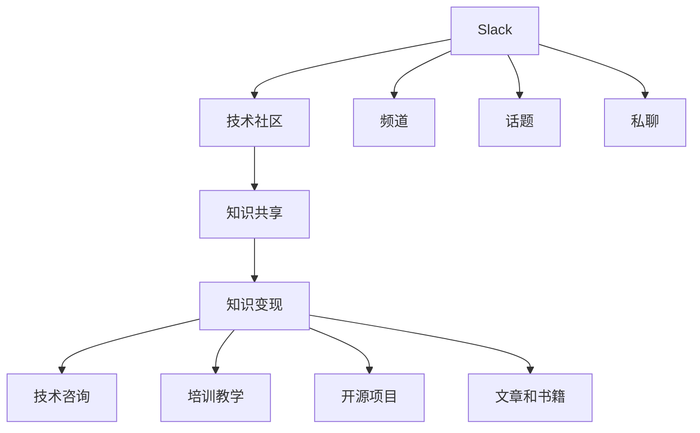

                 

# 程序员如何利用Slack社区进行知识变现

> 关键词：Slack, 知识变现, 技术社区, 开源, 协作工具, 知识共享

## 1. 背景介绍

在数字化转型的大潮中，技术不断革新，新的工具和平台层出不穷。程序员作为技术创新的重要力量，需要不断学习和更新知识，以适应快速变化的技术生态。而在众多技术交流平台中，Slack社区无疑是一个强大的知识共享和变现工具。本文将详细探讨程序员如何利用Slack社区进行知识变现，涵盖社区运营、知识输出、变现方式等多个方面，帮助更多技术人提升自身价值，开拓新的收入来源。

## 2. 核心概念与联系

### 2.1 核心概念概述

Slack是一个以即时消息为核心功能的协作工具，提供了一系列集成工具和插件，能够支持企业内部的沟通、协作和知识管理。在Slack平台上，用户可以通过频道、话题、私聊等多种方式进行交流，同时可以分享文件、链接、代码等资源，构建一个高度个性化的知识共享生态。

技术社区是指具有共同技术兴趣的个体和组织聚集在一起，通过分享知识和经验，互相学习和合作，推动技术进步和发展。Slack作为技术社区的重要平台之一，为知识变现提供了新的可能。

知识变现是指通过知识和技能，以各种形式获取经济回报的过程。在Slack社区中，程序员可以通过多种方式进行知识变现，包括技术咨询、培训教学、开源项目贡献、文章和书籍创作等。

这些核心概念通过Slack平台紧密联系起来，形成了一个互相促进的技术学习和知识变现的生态系统。

### 2.2 核心概念原理和架构的 Mermaid 流程图



## 3. 核心算法原理 & 具体操作步骤

### 3.1 算法原理概述

利用Slack进行知识变现，主要遵循以下基本原理：

1. **平台效应**：Slack作为大型技术社区的聚集地，拥有大量活跃用户和丰富的资源，提供了广阔的知识变现空间。
2. **内容导向**：高质量、有价值的内容是知识变现的核心。通过分享和传播有价值的技术知识和经验，可以在社区内建立个人品牌，吸引更多的关注和变现机会。
3. **网络效应**：在Slack社区中，个人品牌的建立和变现机会的获得，很大程度上依赖于与他人的互动和合作。通过积极参与讨论和合作，可以拓展人脉，增加变现途径。

### 3.2 算法步骤详解

#### 3.2.1 创建个人Slack账户
1. 访问Slack官网，创建一个新的个人Slack账户。
2. 选择企业版或标准版，根据需求决定是否使用付费功能。
3. 添加成员和频道，构建个人知识社区。

#### 3.2.2 加入或创建技术社区
1. 搜索或使用邀请码加入相关技术社区的频道。
2. 创建自己的频道，邀请志同道合的成员加入。
3. 参与社区内的讨论和活动，分享个人经验和技术见解。

#### 3.2.3 发布高质量内容
1. 在频道或话题中发布技术文章、代码示例、解决方案等。
2. 使用Markdown语法，提高内容的可读性和格式美观度。
3. 定期更新和维护内容，保持活跃度和相关性。

#### 3.2.4 与他人互动和合作
1. 积极参与社区内的讨论和问题解答，提供帮助和支持。
2. 与社区内的其他成员建立联系，通过私聊或小组讨论深入交流。
3. 参与开源项目，贡献代码和建议，建立合作关系。

#### 3.2.5 变现途径探索
1. 接受社区内的技术咨询，提供专业指导和解决方案。
2. 开设培训课程或在线研讨会，分享专业知识。
3. 编写和发布技术文章、书籍，通过平台提供的订阅和付费功能变现。

### 3.3 算法优缺点

#### 3.3.1 优点
1. **广泛覆盖**：Slack作为全球最大的技术社区平台，能够覆盖到全球范围内不同技术领域的专业人士。
2. **多渠道变现**：技术咨询、培训、开源项目贡献、内容创作等多种方式，提供多样化的变现渠道。
3. **高效互动**：即时消息系统使得信息交流更加高效，方便快速获取反馈和建议。

#### 3.3.2 缺点
1. **时间和精力投入大**：高质量内容的创作和维护需要大量时间和精力，同时还需要积极参与社区互动，增加工作负担。
2. **竞争激烈**：Slack平台上的技术人众多，要在众多用户中脱颖而出，需要更出色的技术和内容创作能力。
3. **变现门槛高**：高质量的内容创作和活跃的社区互动，是变现的必要条件，对内容产出要求较高。

### 3.4 算法应用领域

Slack社区的应用领域非常广泛，以下是一些典型的应用场景：

- **技术咨询**：通过在频道中发布技术文章或回答技术问题，提供有偿的技术咨询服务。
- **培训教学**：开设在线培训课程，通过Slack平台进行教学，收取学费。
- **开源项目**：在社区内分享开源项目，接受捐款或合作开发。
- **文章和书籍**：撰写和发布技术文章、书籍，通过Slack社区推广并收取订阅费用。
- **知识星球**：创建知识星球账号，汇集社区成员进行知识变现。
- **技术讲座**：组织在线技术讲座，收取入场费用或平台分成。

## 4. 数学模型和公式 & 详细讲解 & 举例说明

### 4.1 数学模型构建

在Slack社区中进行知识变现，可以通过数学模型来量化和评估内容产出和互动的效果。以下是一个简单的知识变现模型：

设：
- $U$ 为知识变现的总收入，单位为货币金额。
- $C$ 为内容创作和维护的总成本，包括时间、精力、工具等。
- $N$ 为社区成员数量，社区活跃度和影响力的一个重要指标。
- $R$ 为每名社区成员每月支付的平均费用，即社区的订阅收入。

则知识变现的总收入模型为：

$$ U = N \times R $$

社区的订阅收入模型为：

$$ R = \frac{U}{N} $$

### 4.2 公式推导过程

通过上述公式，我们可以看到，知识变现的收入与社区的活跃度直接相关。社区成员数量越多，社区活跃度越高，知识变现的收入潜力就越大。

### 4.3 案例分析与讲解

例如，一位Slack社区的技术专家在频道中发布了一系列关于Python编程的文章，吸引了大量社区成员的关注和互动。这些文章通过付费订阅的方式进行变现，每月订阅收入为1000美元。假设社区中有1000名成员，则总收入为：

$$ U = 1000 \times 1000 = 1,000,000 $$

这显示了通过高质量内容创作和社区互动，技术专家可以在Slack平台上实现显著的知识变现。

## 5. 项目实践：代码实例和详细解释说明

### 5.1 开发环境搭建

要利用Slack进行知识变现，首先需要搭建一个Slack开发环境。以下是搭建Slack环境的详细步骤：

1. 访问Slack官网，创建一个新的Slack团队。
2. 选择企业版或标准版，根据需求决定是否使用付费功能。
3. 创建频道和话题，邀请成员加入。
4. 安装和使用Slack客户端或API，进行内容创作和社区互动。

### 5.2 源代码详细实现

Slack的API提供了丰富的接口，用于开发各种功能。以下是一个简单的Python脚本，用于在Slack频道中发布消息：

```python
import slack

SLACK_TOKEN = 'YOUR_SLACK_API_TOKEN'
SLACK_CHANNEL = 'YOUR_SLACK_CHANNEL_ID'

client = slack.WebClient(token=SLACK_TOKEN)

def post_message():
    response = client.chat_postMessage(
        channel=SLACK_CHANNEL,
        text="This is a sample message."
    )
    print(response)

post_message()
```

### 5.3 代码解读与分析

上述代码使用Slack API的`chat_postMessage`方法，在指定频道中发布了一条简单的消息。可以根据需要，调整参数发布不同类型的内容。

## 6. 实际应用场景

### 6.1 技术咨询

通过在Slack频道中发布技术文章和解答问题，技术专家可以提供有偿的技术咨询服务。例如，某技术专家在频道中发布了一系列关于数据分析的文章，吸引了大量关注。随后，有用户通过私聊或频道私信咨询技术问题，技术专家通过提供解决方案和指导，收取咨询费用。

### 6.2 培训教学

开设在线培训课程，通过Slack进行教学和互动，是知识变现的另一种方式。技术专家可以在频道中发布课程预告和教学视频，邀请社区成员参与。课程结束后，根据参与度收取课程费用。

### 6.3 开源项目

在Slack社区中分享和维护开源项目，可以吸引捐款或合作开发。例如，某开源项目在频道中发布了更新日志和代码示例，吸引了大量贡献者和用户关注。通过这些合作，技术专家不仅获得了技术上的支持，还获得了经济回报。

### 6.4 文章和书籍

编写和发布技术文章、书籍，通过Slack社区推广并收取订阅费用。技术专家可以在频道中发布文章预览和书籍介绍，邀请社区成员订阅。订阅费用可以直接通过Slack平台的支付系统实现。

## 7. 工具和资源推荐

### 7.1 学习资源推荐

要充分利用Slack社区进行知识变现，首先需要掌握Slack的使用技巧和知识分享策略。以下是一些推荐的学习资源：

1. **Slack官方文档**：详细介绍了Slack的所有功能和API接口，是Slack开发的必备资源。
2. **Slack开发者社区**：聚集了大量Slack开发者和技术专家，可以获取最新的Slack开发信息和技巧。
3. **技术社区培训课程**：参加各类技术社区的培训课程，提升自身在Slack上的影响力。
4. **Slack指南和最佳实践**：学习社区运营和内容创作的指南和最佳实践，提高知识变现效果。

### 7.2 开发工具推荐

Slack社区的开发和运营离不开各种工具的支持。以下是一些推荐的开发工具：

1. **Slack API**：Slack的官方API，提供了丰富的接口和功能，方便开发社区应用和功能。
2. **Jupyter Notebook**：用于编写和运行Python脚本，方便技术内容的创作和分享。
3. **GitHub**：用于管理和发布开源项目，方便技术社区的协作和代码共享。
4. **Slack客户端**：Slack官方客户端，方便与社区成员进行即时消息和文件共享。
5. **Google Colab**：免费的Jupyter Notebook环境，方便进行技术内容的创作和测试。

### 7.3 相关论文推荐

以下是几篇关于Slack社区运营和知识变现的推荐论文：

1. **"Building a Community: A Practical Guide to Community Management on Slack"**：详细介绍了如何在Slack上管理社区，提升社区活跃度和影响力。
2. **"Slack for Developers: A Comprehensive Guide"**：全面介绍了Slack的开发者工具和API，帮助技术人高效利用Slack进行知识变现。
3. **"Slack Community Governance: Best Practices for Managing a Technical Community"**：分享了Slack社区治理的最佳实践，提升社区管理效果。

## 8. 总结：未来发展趋势与挑战

### 8.1 研究成果总结

Slack社区的知识变现潜力巨大，通过高质量的内容创作和社区互动，程序员可以提升自身价值，开辟新的收入来源。未来的研究需要从以下几个方面进行：

1. **内容创新**：不断推出高质量、有深度的技术内容，吸引更多社区成员关注和互动。
2. **社区管理**：优化社区管理策略，提升社区的活跃度和粘性。
3. **变现渠道多样化**：探索更多的变现渠道，如技术讲座、知识星球等。

### 8.2 未来发展趋势

Slack社区的知识变现将呈现以下几个发展趋势：

1. **技术内容多样化**：除了技术文章和视频，将有更多的形式和内容进行知识变现。
2. **社区成员多元化**：吸引更多领域的专家和技术人加入，提升社区的多样性和包容性。
3. **互动方式多样化**：除了即时消息，将有更多的互动方式，如虚拟会议、直播讲座等。

### 8.3 面临的挑战

尽管Slack社区的知识变现前景广阔，但在实施过程中仍面临一些挑战：

1. **时间和精力投入**：高质量内容创作和社区互动需要大量时间和精力，增加了工作负担。
2. **竞争激烈**：Slack平台上的技术人众多，要在众多用户中脱颖而出，需要更出色的技术和内容创作能力。
3. **变现门槛高**：高质量的内容创作和活跃的社区互动，是变现的必要条件，对内容产出要求较高。

### 8.4 研究展望

未来的研究需要在以下几个方面进行探索：

1. **自动化工具**：开发自动化内容创作和社区互动工具，提升效率和质量。
2. **社区数据驱动**：利用社区数据进行分析和优化，提升社区管理和变现效果。
3. **多平台协同**：将Slack社区与其他平台（如Medium、YouTube等）结合，扩大知识变现渠道。

总之，利用Slack社区进行知识变现，既需要高质量的内容创作和社区互动，也需要不断的技术和工具支持。通过不断的探索和优化，Slack社区将为技术人提供更多的变现机会，提升技术社区的价值和影响力。

## 9. 附录：常见问题与解答

**Q1：Slack社区如何进行知识变现？**

A: 利用Slack社区进行知识变现，主要通过内容创作、技术咨询、培训教学、开源项目贡献和文章书籍创作等方式。在频道或话题中发布高质量的技术内容，吸引社区成员关注和互动，通过多种变现渠道实现收入。

**Q2：Slack社区变现的收入来源有哪些？**

A: 滑阅社区变现的收入来源包括：
- 技术咨询：提供有偿的技术咨询服务。
- 培训教学：开设在线培训课程，收取学费。
- 开源项目：分享和维护开源项目，接受捐款或合作开发。
- 文章和书籍：撰写和发布技术文章、书籍，通过订阅和付费功能变现。
- 知识星球：创建知识星球账号，汇集社区成员进行知识变现。
- 技术讲座：组织在线技术讲座，收取入场费用或平台分成。

**Q3：Slack社区变现的难点有哪些？**

A: 滑阅社区变现的难点包括：
- 高质量内容创作和维护需要大量时间和精力，增加了工作负担。
- 社区成员众多，要在众多用户中脱颖而出，需要更出色的技术和内容创作能力。
- 高质量的内容创作和活跃的社区互动，是变现的必要条件，对内容产出要求较高。

**Q4：如何提升Slack社区的知识变现效果？**

A: 提升Slack社区的知识变现效果，可以从以下几个方面入手：
- 内容创新：不断推出高质量、有深度的技术内容，吸引更多社区成员关注和互动。
- 社区管理：优化社区管理策略，提升社区的活跃度和粘性。
- 多渠道变现：探索更多的变现渠道，如技术讲座、知识星球等。
- 自动化工具：开发自动化内容创作和社区互动工具，提升效率和质量。
- 数据驱动：利用社区数据进行分析和优化，提升社区管理和变现效果。

---

作者：禅与计算机程序设计艺术 / Zen and the Art of Computer Programming

