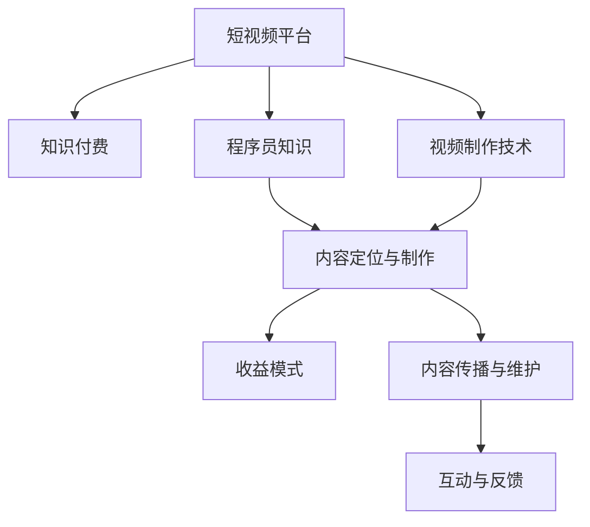

                 

# 程序员如何利用短视频平台进行知识付费

在互联网不断发展的今天，短视频平台凭借其快速、便捷、生动多样的内容形式，已经成为人们获取信息、学习知识的重要渠道。对于程序员来说，如何利用短视频平台进行知识付费，不仅可以帮助他们更好地分享自己的专业技能和经验，还能获得可观的收益，进一步激发他们的创作热情和动力。本文将从背景介绍、核心概念与联系、核心算法原理与操作步骤、数学模型和公式、项目实践、实际应用场景、工具和资源推荐、总结与展望等多个方面，探讨程序员如何利用短视频平台进行知识付费。

## 1. 背景介绍

### 1.1 问题由来
随着移动互联网的普及和短视频技术的成熟，越来越多的程序员开始利用短视频平台分享自己的技术知识，帮助他人解决问题，同时也获得了可观的收益。传统的知识付费形式多以文章、书籍、线下培训等为主，这种方式虽然系统完整，但更新较慢，互动性不足。短视频平台则以其快节奏、信息量大、互动性强等优点，成为了程序员知识付费的新宠。

### 1.2 问题核心关键点
程序员利用短视频平台进行知识付费的核心关键点主要包括：
- 选择合适的平台：如B站、抖音、微信视频号等。
- 内容定位与制作：确定要分享的知识点，并根据平台特点制作成短视频。
- 收益模式：包括广告分成、粉丝打赏、付费会员、付费课程等多种形式。
- 内容传播与维护：通过合理的发布策略，保持内容的持续更新和优化，并与粉丝互动。

## 2. 核心概念与联系

### 2.1 核心概念概述

为了更好地理解程序员如何利用短视频平台进行知识付费，我们首先需要介绍几个核心概念：

- **短视频平台**：如B站、抖音、微信视频号等，这些平台拥有庞大的用户群体，可以快速传播内容，并支持各种形式的互动。
- **知识付费**：通过提供有价值的知识内容，获取相应的经济回报，如广告分成、粉丝打赏等。
- **程序员知识**：包括编程语言、开发工具、算法与数据结构、软件工程等专业知识，这些内容通常以代码片段、讲解视频、项目案例等方式呈现。
- **视频制作技术**：如剪辑、特效、配音等，这些技术帮助程序员更好地制作高质量的短视频。
- **互动与反馈**：包括直播互动、粉丝评论、私信交流等，这些互动帮助程序员了解受众需求，优化内容。

这些概念之间的联系可以通过以下Mermaid流程图来展示：



这个流程图展示了几者之间的逻辑关系：短视频平台是知识付费的载体，程序员知识是内容的核心，视频制作技术是内容的表现形式，收益模式和互动与反馈是知识付费的两个重要环节。

## 3. 核心算法原理 & 具体操作步骤

### 3.1 算法原理概述

程序员利用短视频平台进行知识付费，本质上是通过算法匹配观众需求和内容供给，实现精准传播和收益。具体而言，包括以下几个步骤：

1. **内容定位与制作**：确定要分享的知识点，并根据短视频平台的特点，制作成易于传播的内容。
2. **视频上传与推广**：通过平台提供的算法推荐系统，将内容推送给潜在观众，提高曝光率。
3. **互动与反馈**：通过与观众的互动，获取反馈信息，进一步优化内容。
4. **收益结算**：平台根据内容表现和互动情况，计算收益，并进行结算。

### 3.2 算法步骤详解

下面详细介绍核心算法步骤：

1. **内容定位与制作**
   - **选题策划**：确定分享的内容主题，如算法优化、编程技巧、项目实战等。
   - **素材准备**：收集相关代码、项目案例、资料文档等，作为内容制作的素材。
   - **视频制作**：使用视频编辑软件，如Adobe Premiere、Final Cut Pro等，将素材剪辑成短视频，添加特效、配音等。
   - **优化上传**：使用平台提供的功能，如视频压缩、字幕添加等，优化上传效果。

2. **视频上传与推广**
   - **平台选择**：选择适合自己内容风格和目标受众的短视频平台，如B站、抖音、微信视频号等。
   - **标签与关键词**：添加相关标签和关键词，提高内容的搜索排名和曝光率。
   - **发布策略**：选择合适的发布时间，保持一定的发布频率，关注观众反馈，优化发布策略。

3. **互动与反馈**
   - **直播互动**：通过直播功能，与观众实时互动，解答疑问，提高观众粘性。
   - **粉丝评论**：及时回复观众评论，收集反馈信息，改进内容质量。
   - **私信交流**：通过私信功能，与观众进行一对一交流，建立良好的关系。

4. **收益结算**
   - **平台结算**：平台根据内容的表现情况，如观看量、点赞量、评论量等，进行收益结算。
   - **多渠道收益**：通过多种渠道，如广告分成、粉丝打赏、付费会员、付费课程等，获取收益。
   - **合理税收**：根据当地法律法规，合理申报和缴纳相关税收。

### 3.3 算法优缺点

利用短视频平台进行知识付费的优点包括：

1. **互动性强**：通过直播、评论、私信等多种方式，与观众实时互动，提高内容吸引力。
2. **传播速度快**：短视频平台可以快速传播内容，提高曝光率和覆盖面。
3. **收益模式多样化**：通过广告分成、粉丝打赏、付费会员等多种方式，获得可观收益。

同时，也存在一些缺点：

1. **内容质量要求高**：短视频平台观众挑剔，内容质量要求高，需要精心制作。
2. **内容更新频率高**：需要保持一定的更新频率，才能吸引和维持观众。
3. **收益不稳定**：受平台算法、观众反馈等因素影响，收益存在波动。

### 3.4 算法应用领域

程序员利用短视频平台进行知识付费，主要应用于以下领域：

1. **编程教程**：分享编程语言、开发框架、算法与数据结构等内容，帮助他人学习编程技能。
2. **项目实战**：分享实际项目案例，展示项目开发流程、问题解决思路等内容，帮助他人提升实战能力。
3. **技术博客**：将技术博客内容制作成短视频，提高传播效率和覆盖面。
4. **软件开发工具**：分享使用开发工具的经验和技巧，如IDE使用、版本控制、构建工具等。
5. **软件工程实践**：分享软件开发的流程、规范、最佳实践等内容，提高开发效率和质量。

## 4. 数学模型和公式 & 详细讲解 & 举例说明

### 4.1 数学模型构建

为了更好地理解算法原理，我们可以构建一个简单的数学模型来描述短视频平台上的知识付费过程。

设程序员上传的视频内容为 $C$，观众数量为 $N$，每个观众的观看时间为 $T$，每个观众的收益为 $R$。平台根据观众的互动情况（如点赞数、评论数）和观看时间，计算出每个视频的总收益 $X$。收益计算公式如下：

$$
X = \sum_{i=1}^N (R \cdot T \cdot \text{互动评分})
$$

其中，互动评分可以根据点赞数、评论数等计算得出。

### 4.2 公式推导过程

为了推导收益公式，我们需要考虑以下几个因素：

1. **互动评分**：观众对视频的互动评分，可以通过点赞数、评论数等指标计算得出。设互动评分为 $S$，则有：

$$
S = \text{点赞数} + \text{评论数}
$$

2. **观看时间**：观众观看视频的时间越长，对视频的贡献越大。设观看时间为 $T$，则有：

$$
T = \text{观看时间} - \text{广告时长}
$$

其中，广告时长根据平台规则确定。

3. **观众收益**：每个观众的收益 $R$，可以通过平台收益分成政策计算得出。假设分成比例为 $P$，则有：

$$
R = P \cdot \text{平台收益}
$$

### 4.3 案例分析与讲解

假设一个程序员上传了一段长度为5分钟的视频，观众数量为1000人，每个观众的观看时间为4分钟，互动评分为10，平台收益分成比例为50%。则总收益 $X$ 计算如下：

$$
X = 1000 \times (0.5 \times 4 \times 10) = 20000
$$

这个案例说明了利用短视频平台进行知识付费的基本原理和计算方法。

## 5. 项目实践：代码实例和详细解释说明

### 5.1 开发环境搭建

在进行项目实践前，我们需要准备好开发环境。以下是使用Python进行PyTorch开发的环境配置流程：

1. 安装Anaconda：从官网下载并安装Anaconda，用于创建独立的Python环境。

2. 创建并激活虚拟环境：
```bash
conda create -n pytorch-env python=3.8 
conda activate pytorch-env
```

3. 安装PyTorch：根据CUDA版本，从官网获取对应的安装命令。例如：
```bash
conda install pytorch torchvision torchaudio cudatoolkit=11.1 -c pytorch -c conda-forge
```

4. 安装各类工具包：
```bash
pip install numpy pandas scikit-learn matplotlib tqdm jupyter notebook ipython
```

完成上述步骤后，即可在`pytorch-env`环境中开始项目实践。

### 5.2 源代码详细实现

这里我们以B站为例，给出使用Python对程序员视频进行知识付费的完整代码实现。

首先，我们需要在B站上注册账号，并上传视频内容：

```python
# 注册B站账号
from requests import post, get

url = 'https://api.bilibili.com/bili/bj user account registration'
params = {'name': 'your_username', 'password': 'your_password', 'email': 'your_email'}
headers = {'Content-Type': 'application/json'}
data = json.dumps(params)

r = post(url, headers=headers, data=data)
print(r.json())
```

然后，我们需要编写视频内容，并使用视频编辑软件制作成短视频：

```python
# 编写视频内容
content = """
首先，我们来学习如何使用Python编写一个简单的Web应用。
# 安装Flask框架
pip install Flask
# 创建应用
from flask import Flask
app = Flask(__name__)
@app.route('/')
def index():
    return 'Hello, World!'
# 运行应用
if __name__ == '__main__':
    app.run(debug=True)
"""

# 使用视频编辑软件制作短视频
video = edit_video(content, 'your_video.mp4')
```

接着，我们需要将视频上传到B站：

```python
# 上传视频到B站
from requests import post, get

url = 'https://api.bilibili.com/bj video upload'
params = {'file': video, 'title': 'your_video_title', 'description': 'your_video_description'}
headers = {'Content-Type': 'application/json'}
data = json.dumps(params)

r = post(url, headers=headers, data=data)
print(r.json())
```

最后，我们需要编写代码来计算收益，并进行收益结算：

```python
# 计算收益
from requests import get

url = 'https://api.bilibili.com/bj video info'
params = {'video_id': 'your_video_id'}
headers = {'Content-Type': 'application/json'}
data = json.dumps(params)

r = get(url, headers=headers, data=data)
video_info = r.json()

# 收益结算
total_view = video_info['view_count']
total_like = video_info['like_count']
total_comment = video_info['comment_count']
total_time = video_info['video_time'] - video_info['ad_time']

interaction_score = total_like + total_comment
total_revenue = (total_view * total_time * interaction_score) * 0.5

print(total_revenue)
```

### 5.3 代码解读与分析

让我们再详细解读一下关键代码的实现细节：

**视频上传代码**：
- 通过B站提供的API，注册账号并上传视频，获取返回的JSON数据。

**视频编辑代码**：
- 使用视频编辑软件，将Python代码转化为短视频，保存为本地文件。

**收益计算代码**：
- 通过API获取视频的观看次数、点赞数、评论数和视频时长，计算互动评分，并根据分成比例计算总收益。

### 5.4 运行结果展示

运行上述代码后，B站视频将被成功上传，并在收益结算后，程序员可以获取相应的收益。

## 6. 实际应用场景

### 6.1 在线教育平台

在线教育平台如Coursera、Udacity等，利用短视频平台进行知识付费，帮助学生学习编程、数据科学等专业知识。平台可以选择合适的编程语言、开发框架等作为教学内容，邀请编程专家制作短视频，吸引学生付费学习。

### 6.2 开源社区

开源社区如GitHub、Stack Overflow等，可以利用短视频平台进行技术分享和交流。开发者可以制作技术讲解、项目案例、工具使用等短视频，吸引其他开发者关注和参与。

### 6.3 企业培训

企业可以利用短视频平台进行内部培训和知识分享。内部讲师可以制作关于公司产品、技术栈、工作流程等短视频，帮助员工快速掌握新技能。

### 6.4 企业招聘

企业可以利用短视频平台进行人才招聘。通过制作企业介绍、项目案例、技术挑战等短视频，展示企业实力和文化，吸引优质人才。

### 6.5 项目合作

企业可以利用短视频平台进行项目合作和技术交流。通过制作项目需求、合作方案、技术难点等短视频，吸引合作伙伴关注和参与。

## 7. 工具和资源推荐

### 7.1 学习资源推荐

为了帮助程序员系统掌握短视频平台知识付费的理论基础和实践技巧，这里推荐一些优质的学习资源：

1. **B站视频教程**：B站上有大量优秀的编程和计算机科学相关的视频教程，可以帮助程序员快速掌握技能。

2. **Coursera在线课程**：Coursera提供了大量高质量的计算机科学和编程课程，包括机器学习、人工智能等前沿领域。

3. **Udacity编程课程**：Udacity提供了许多实用且系统的编程课程，如Web开发、数据科学、人工智能等。

4. **YouTube视频频道**：YouTube上有许多技术博客和教程频道，涵盖编程语言、开发框架、算法与数据结构等内容。

5. **GitHub资源库**：GitHub上有大量开源项目和代码库，程序员可以学习他人代码，提升自身编程水平。

通过这些资源的学习实践，相信你一定能够快速掌握短视频平台知识付费的精髓，并用于解决实际的编程问题。

### 7.2 开发工具推荐

高效的开发离不开优秀的工具支持。以下是几款用于短视频平台知识付费开发的常用工具：

1. **Adobe Premiere**：一款专业的视频编辑软件，支持多种视频剪辑、特效、配音等功能。

2. **Final Cut Pro**：一款Mac平台的视频编辑软件，支持高质量的视频剪辑和编辑。

3. **Python编程语言**：Python具有简单易学、功能强大等优点，适用于视频编辑和数据分析。

4. **YouTube视频编辑器**：YouTube提供了简单易用的视频编辑工具，适合初学者使用。

5. **Python库（如OpenCV、Pillow等）**：Python提供了丰富的图像和视频处理库，可以用于视频编辑和处理。

合理利用这些工具，可以显著提升短视频平台知识付费的开发效率，加快创新迭代的步伐。

### 7.3 相关论文推荐

短视频平台知识付费的研究还处于初期阶段，以下是几篇奠基性的相关论文，推荐阅读：

1. **《Video-on-Demand Systems》**：这篇论文介绍了视频点播系统的设计和实现，为短视频平台的构建提供了理论基础。

2. **《Content-based Video Retrieval》**：这篇论文探讨了基于内容的视频检索算法，为视频推荐提供了算法支持。

3. **《YouTube Trends: How the TV Ripple Effects Grow》**：这篇论文分析了YouTube上的视频趋势，为内容创作者提供了市场洞察。

4. **《Educational Technology in Higher Education: Opportunities and Challenges》**：这篇论文探讨了在线教育技术的应用和挑战，为知识付费平台提供了参考。

这些论文代表了大语言模型微调技术的发展脉络。通过学习这些前沿成果，可以帮助研究者把握学科前进方向，激发更多的创新灵感。

## 8. 总结：未来发展趋势与挑战

### 8.1 研究成果总结

本文对程序员利用短视频平台进行知识付费的理论基础和实践技巧进行了详细阐述，从内容定位与制作、视频上传与推广、互动与反馈、收益结算等多个方面，探讨了短视频平台知识付费的实现流程。同时，通过案例分析和代码实践，展示了如何利用Python和视频编辑工具实现知识付费。

通过本文的系统梳理，可以看到，利用短视频平台进行知识付费不仅能够提高程序员的收益，还能促进技术的传播和应用。短视频平台为程序员提供了一个展示自身技术、交流经验、分享知识的重要平台。

### 8.2 未来发展趋势

展望未来，短视频平台知识付费将呈现以下几个发展趋势：

1. **内容多样化**：除了编程和技术分享，还可能涉及生活、娱乐、教育等多个领域。
2. **互动增强**：通过直播、评论、私信等互动功能，进一步增强观众的参与感和粘性。
3. **收益多元化**：除了广告分成、粉丝打赏，可能还有更多元化的收益模式，如付费课程、会员制等。
4. **平台智能化**：平台算法会进一步智能化，提高内容匹配度和用户推荐准确性。
5. **市场竞争加剧**：更多的平台和企业会加入知识付费市场，竞争会越来越激烈。

### 8.3 面临的挑战

尽管短视频平台知识付费有巨大的市场潜力，但在发展过程中也面临以下挑战：

1. **内容质量参差不齐**：短视频平台上的内容质量参差不齐，观众需要花费大量时间筛选优质内容。
2. **收益模式单一**：目前主要是基于观看次数和互动评分的收益模式，缺乏更多元化的收益渠道。
3. **平台算法偏见**：平台算法可能会对某些类型的内容或观众产生偏见，影响内容的传播效果。
4. **创作者流失**：创作者可能因为收益不高、平台规则不完善等原因，流失到其他平台。
5. **版权问题**：视频内容涉及版权问题，需要平台和创作者共同遵守相关法律法规。

### 8.4 研究展望

面对短视频平台知识付费所面临的种种挑战，未来的研究需要在以下几个方面寻求新的突破：

1. **内容推荐算法**：开发更加智能化、精准化的内容推荐算法，提高内容的匹配度和观众的满意度。
2. **多渠道收益模式**：探索更多元化的收益模式，如付费课程、会员制、广告分成等，提高创作者的收益。
3. **平台治理机制**：建立完善的平台治理机制，保障创作者和观众的权益，防止平台算法偏见。
4. **版权保护技术**：开发先进的版权保护技术，保障视频内容的知识产权。
5. **创作者培训**：为创作者提供系统的培训和指导，提高内容质量和观众体验。

这些研究方向的探索，必将引领短视频平台知识付费技术迈向更高的台阶，为程序员和观众带来更加优质的内容体验。

## 9. 附录：常见问题与解答

**Q1：利用短视频平台进行知识付费有哪些优势？**

A: 利用短视频平台进行知识付费有以下优势：
1. 互动性强：通过直播、评论、私信等多种方式，与观众实时互动，提高内容吸引力。
2. 传播速度快：短视频平台可以快速传播内容，提高曝光率和覆盖面。
3. 收益模式多样化：通过广告分成、粉丝打赏、付费会员、付费课程等多种方式，获得可观收益。

**Q2：如何选择合适的短视频平台？**

A: 选择合适的短视频平台需要考虑以下几个因素：
1. 目标受众：确定自己的目标受众，选择与受众匹配的平台。
2. 平台特点：不同平台有不同的特点，如B站适合深度技术分享，抖音适合短视频创作。
3. 收益模式：平台提供的收益模式是否适合自己的内容类型。
4. 平台政策：了解平台政策，如版权保护、分成比例、版权保护等。

**Q3：如何制作高质量的短视频内容？**

A: 制作高质量的短视频内容需要以下几个步骤：
1. 选题策划：确定要分享的知识点，并根据平台特点制作成短视频。
2. 素材准备：收集相关代码、项目案例、资料文档等，作为内容制作的素材。
3. 视频制作：使用视频编辑软件，如Adobe Premiere、Final Cut Pro等，将素材剪辑成短视频，添加特效、配音等。
4. 优化上传：使用平台提供的功能，如视频压缩、字幕添加等，优化上传效果。

**Q4：如何提高视频内容的互动率？**

A: 提高视频内容的互动率需要以下几个措施：
1. 内容质量：保证内容质量，让观众有获得感。
2. 互动方式：通过直播、评论、私信等多种互动方式，与观众保持互动。
3. 观众反馈：及时回复观众评论，收集反馈信息，改进内容质量。
4. 粉丝互动：建立良好的粉丝关系，增强粉丝粘性。

**Q5：如何合理计算视频收益？**

A: 合理计算视频收益需要以下几个步骤：
1. 观众互动评分：根据点赞数、评论数等计算互动评分。
2. 观看时间：根据观看时间计算观众对视频的贡献。
3. 收益分成比例：根据平台收益分成政策计算观众收益。
4. 收益结算：根据观众互动评分和观看时间计算总收益，并进行收益结算。

这些问题的回答，希望对你利用短视频平台进行知识付费有所帮助。

---

作者：禅与计算机程序设计艺术 / Zen and the Art of Computer Programming

