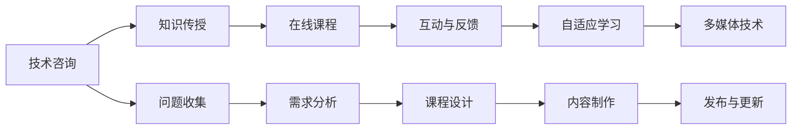

                 

## 1. 背景介绍

在数字化时代的浪潮中，互联网技术已经深刻地改变了人们的工作方式和生活习惯。作为程序员，我们不仅需要在技术层面不断创新，更要擅长将复杂的技术知识以易于理解的形式传递给非技术人员。在线课程的兴起，为技术咨询向知识传播的转变提供了绝佳的舞台。本文将从背景、核心概念与联系、算法原理及操作步骤等方面，详细介绍如何将技术咨询转化为高效、生动的在线课程。

## 2. 核心概念与联系

### 2.1 核心概念概述

在将技术咨询转化为在线课程的过程中，以下核心概念至关重要：

- **技术咨询（Technical Consulting）**：面向企业或个人提供关于软件技术、IT策略、系统架构等方面的咨询和建议。

- **在线课程（Online Course）**：通过互联网平台发布，向学习者提供学习资源和互动方式的课程形式。

- **知识传递（Knowledge Transfer）**：将复杂的技术知识和专业技能转化为易于理解的内容，传递给学习者。

- **互动与反馈（Interactivity and Feedback）**：在线课程应包含互动环节，如论坛、讨论、练习等，以实时获取学习者的反馈，调整教学内容和方法。

- **自适应学习（Adaptive Learning）**：根据学习者的学习进度和反馈，动态调整课程内容和难度，以适应不同学习者的需求。

- **多媒体技术（Multimedia Technology）**：利用视频、音频、动画等多媒体元素，丰富课程内容，提高学习效果。

这些核心概念的融合，能够帮助我们构建高质量的在线课程，帮助学习者有效掌握技术知识。

### 2.2 核心概念原理和架构的 Mermaid 流程图



此流程图展示了从技术咨询到在线课程的全过程，包括问题收集、需求分析、课程设计、内容制作、发布与更新等环节。

## 3. 核心算法原理 & 具体操作步骤

### 3.1 算法原理概述

将技术咨询转化为在线课程，涉及从需求分析到内容制作的全流程。这一过程可以分解为以下关键步骤：

1. **需求分析（Demand Analysis）**：了解学习者的背景、目标、需求等，制定课程目标和框架。
2. **课程设计（Curriculum Design）**：根据需求分析的结果，设计课程大纲，包括理论、实践、项目案例等。
3. **内容制作（Content Production）**：制作课程内容，包括视频、PPT、脚本、练习题等，并使用多媒体技术丰富课程形式。
4. **互动设计（Interactive Design）**：设计互动环节，如在线讨论、练习题、编程挑战等，增强学习者的参与感。
5. **发布与更新（Release and Update）**：将课程发布到在线平台，并根据学习者的反馈持续更新课程内容。

### 3.2 算法步骤详解

#### 3.2.1 需求分析

需求分析是课程设计的第一步。以下是详细的操作步骤：

1. **问卷调查**：通过问卷、访谈等方式，收集学习者的背景信息、技术水平、学习目标等。
2. **目标设定**：根据收集到的信息，设定课程的目标和预期成果。
3. **需求优先级排序**：对学习者的需求进行优先级排序，确定课程的主要内容和次要内容。

#### 3.2.2 课程设计

课程设计应注重内容的系统性和连贯性，以下是一个简化的课程设计流程：

1. **内容分类**：将课程内容分为理论知识、实践技能、项目案例等类别。
2. **章节划分**：根据课程目标，将内容划分为多个章节。
3. **知识体系构建**：构建课程的知识体系，确保各章节内容之间的逻辑联系。

#### 3.2.3 内容制作

内容制作是课程实施的关键环节，以下是一个内容制作的基本流程：

1. **脚本撰写**：撰写课程讲稿，明确每节课的核心内容和目标。
2. **视频录制**：录制课程视频，确保画面清晰、声音清晰。
3. **PPT制作**：设计课程PPT，配合视频内容。
4. **辅助材料制作**：制作练习题、案例分析、作业等辅助材料，增强学习效果。

#### 3.2.4 互动设计

互动设计是提升学习效果的重要手段，以下是一个互动设计流程：

1. **互动形式选择**：选择适合的互动形式，如在线讨论、编程挑战等。
2. **互动内容设计**：设计互动内容的详细问题，确保问题具有挑战性和启发性。
3. **实时反馈机制**：建立实时反馈机制，如在线问答、论坛讨论等，及时获取学习者的反馈。

#### 3.2.5 发布与更新

发布与更新是课程维护的重要环节，以下是一个发布与更新流程：

1. **平台选择**：选择合适的在线平台发布课程，如Coursera、Udacity、腾讯课堂等。
2. **发布内容**：将课程内容上传到平台，并进行必要的测试。
3. **用户反馈**：收集学习者的反馈，调整课程内容和方法。
4. **定期更新**：根据技术进展和市场需求，定期更新课程内容，保持课程的先进性和实用性。

### 3.3 算法优缺点

#### 3.3.1 算法优点

- **灵活性高**：在线课程可以灵活调整课程内容和方法，适应不同学习者的需求。
- **学习自主性强**：学习者可以根据自身时间安排学习进度，灵活掌握学习节奏。
- **互动性强**：通过互动环节，增强学习者的参与感和学习效果。
- **可扩展性强**：在线课程可以不断扩展和更新，适应技术的发展和市场需求。

#### 3.3.2 算法缺点

- **学习效果依赖学习者自控力**：在线课程的学习效果在很大程度上依赖于学习者的自控力和学习动机。
- **互动质量受平台限制**：互动质量受在线平台的限制，如响应时间、用户活跃度等。
- **内容制作成本高**：内容制作需要大量的时间和资源投入，尤其是高质量的多媒体内容。

### 3.4 算法应用领域

将技术咨询转化为在线课程的方法，适用于各种技术咨询场景，特别是软件开发、系统架构、人工智能等领域。以下是一个具体的应用案例：

**案例：软件架构咨询**

1. **需求分析**：了解企业现有系统架构和需求，确定架构优化目标。
2. **课程设计**：设计软件架构的课程大纲，包括设计原则、设计模式、实践案例等。
3. **内容制作**：制作课程视频、PPT、脚本等，讲解软件架构的各个方面。
4. **互动设计**：设计互动环节，如编程挑战、项目案例等，增强学习效果。
5. **发布与更新**：将课程发布到在线平台，并根据学习者的反馈持续更新课程内容。

## 4. 数学模型和公式 & 详细讲解 & 举例说明

### 4.1 数学模型构建

假设学习者总数为 $N$，课程总时间为 $T$，每节课的平均时长为 $t$，课程内容的理论部分为 $S_{\text{theory}}$，实践部分为 $S_{\text{practice}}$，项目案例部分为 $S_{\text{project}}$，互动环节为 $S_{\text{interaction}}$，则课程的总时长和各部分内容的占比可以表示为：

$$
T = \frac{N}{t}(S_{\text{theory}} + S_{\text{practice}} + S_{\text{project}} + S_{\text{interaction}})
$$

### 4.2 公式推导过程

通过公式推导，可以得到课程内容的分配策略：

1. **理论部分**：根据学习者的技术水平和课程目标，确定理论知识的比例。
2. **实践部分**：通过编程挑战、实验等形式，增强学习者的实践能力。
3. **项目案例**：通过实际案例，帮助学习者理解理论知识的实际应用。
4. **互动环节**：设计互动环节，如在线讨论、编程挑战等，增强学习者的参与感和学习效果。

### 4.3 案例分析与讲解

**案例分析：人工智能课程设计**

1. **需求分析**：了解学习者的背景信息、技术水平、学习目标，确定课程目标为人工智能基础和实践应用。
2. **课程设计**：设计课程大纲，包括理论知识（机器学习基础、深度学习基础等）、实践技能（TensorFlow、PyTorch等）、项目案例（图像识别、自然语言处理等）和互动环节（在线讨论、编程挑战等）。
3. **内容制作**：制作课程视频、PPT、脚本等，讲解人工智能的各个方面。
4. **互动设计**：设计互动环节，如编程挑战、项目案例等，增强学习效果。
5. **发布与更新**：将课程发布到在线平台，并根据学习者的反馈持续更新课程内容。

## 5. 项目实践：代码实例和详细解释说明

### 5.1 开发环境搭建

以下是使用Python和Flask框架搭建在线课程平台的基本步骤：

1. **安装Python和Flask**：
   ```bash
   pip install flask
   ```
2. **创建课程模块**：
   ```python
   from flask import Flask, render_template

   app = Flask(__name__)

   @app.route('/')
   def home():
       return render_template('index.html')
   ```
3. **创建课程页面**：
   ```html
   <!-- index.html -->
   <!DOCTYPE html>
   <html lang="en">
   <head>
       <meta charset="UTF-8">
       <title>课程首页</title>
   </head>
   <body>
       <h1>课程首页</h1>
       <a href="/lecture">课程讲义</a>
       <a href="/practice">实践练习</a>
       <a href="/project">项目案例</a>
       <a href="/forum">互动论坛</a>
   </body>
   </html>
   ```

### 5.2 源代码详细实现

以下是使用Python和Flask框架搭建在线课程平台的具体代码实现：

1. **创建课程讲义页面**：
   ```python
   @app.route('/lecture')
   def lecture():
       return render_template('lecture.html')
   ```
2. **创建课程实践页面**：
   ```python
   @app.route('/practice')
   def practice():
       return render_template('practice.html')
   ```
3. **创建课程项目案例页面**：
   ```python
   @app.route('/project')
   def project():
       return render_template('project.html')
   ```
4. **创建课程互动论坛页面**：
   ```python
   @app.route('/forum')
   def forum():
       return render_template('forum.html')
   ```

### 5.3 代码解读与分析

以下是课程平台的主要代码解读：

- **Flask应用初始化**：通过`Flask(__name__)`创建Flask应用实例。
- **路由配置**：通过`@app.route()`定义不同的路由，对应不同的课程页面。
- **模板渲染**：通过`render_template()`渲染不同的HTML模板，展示课程内容。

### 5.4 运行结果展示

以下是课程平台的运行结果展示：

- **课程首页**：显示课程链接，包括课程讲义、实践练习、项目案例、互动论坛等。
- **课程讲义**：展示课程讲义内容，包括理论知识、教学视频等。
- **课程实践**：展示实践练习内容，包括编程挑战、实验等。
- **课程项目案例**：展示项目案例内容，包括实际项目和解决方案。
- **互动论坛**：提供互动环节，如在线讨论、编程挑战等，增强学习效果。

## 6. 实际应用场景

### 6.1 软件开发

在线课程平台在软件开发领域有着广泛的应用。以下是一个具体的应用案例：

**案例：Web开发课程**

1. **需求分析**：了解学习者的背景信息、技术水平、学习目标，确定课程目标为Web开发基础和高级技术。
2. **课程设计**：设计课程大纲，包括HTML、CSS、JavaScript、React等。
3. **内容制作**：制作课程视频、PPT、脚本等，讲解Web开发的各个方面。
4. **互动设计**：设计互动环节，如在线讨论、编程挑战等，增强学习效果。
5. **发布与更新**：将课程发布到在线平台，并根据学习者的反馈持续更新课程内容。

### 6.2 人工智能

在线课程平台在人工智能领域也有着广泛的应用。以下是一个具体的应用案例：

**案例：机器学习课程**

1. **需求分析**：了解学习者的背景信息、技术水平、学习目标，确定课程目标为机器学习基础和高级技术。
2. **课程设计**：设计课程大纲，包括机器学习基础、深度学习基础、模型调优等。
3. **内容制作**：制作课程视频、PPT、脚本等，讲解机器学习的各个方面。
4. **互动设计**：设计互动环节，如在线讨论、编程挑战等，增强学习效果。
5. **发布与更新**：将课程发布到在线平台，并根据学习者的反馈持续更新课程内容。

### 6.3 系统架构

在线课程平台在系统架构领域也有着广泛的应用。以下是一个具体的应用案例：

**案例：系统架构设计课程**

1. **需求分析**：了解学习者的背景信息、技术水平、学习目标，确定课程目标为系统架构设计基础和高级技术。
2. **课程设计**：设计课程大纲，包括系统架构设计原则、设计模式、系统部署等。
3. **内容制作**：制作课程视频、PPT、脚本等，讲解系统架构设计的各个方面。
4. **互动设计**：设计互动环节，如在线讨论、项目案例等，增强学习效果。
5. **发布与更新**：将课程发布到在线平台，并根据学习者的反馈持续更新课程内容。

## 7. 工具和资源推荐

### 7.1 学习资源推荐

以下是一些推荐的在线课程学习资源：

1. **Coursera**：提供来自全球顶尖大学的在线课程，涵盖计算机科学、数据科学、人工智能等领域。
2. **Udacity**：提供高性价比的纳米学位课程，涵盖软件工程、数据科学、人工智能等领域。
3. **edX**：提供来自全球顶尖大学的在线课程，涵盖计算机科学、数据科学、人工智能等领域。
4. **Khan Academy**：提供免费的在线教育资源，涵盖数学、科学、计算机科学等领域。
5. **Udemy**：提供付费的在线课程，涵盖编程、数据分析、人工智能等领域。

### 7.2 开发工具推荐

以下是一些推荐的在线课程开发工具：

1. **Flask**：轻量级的Web框架，适合快速开发在线课程平台。
2. **Django**：全功能的Web框架，适合开发复杂在线课程平台。
3. **Jupyter Notebook**：互动式编程环境，适合制作课程PPT和代码演示。
4. **Markdown**：轻量级标记语言，适合制作课程文档和笔记。
5. **GitHub**：版本控制系统，适合管理和分享在线课程代码。

### 7.3 相关论文推荐

以下是一些推荐的在线课程相关论文：

1. **“Educational Data Mining and Knowledge Discovery” by Rokach**：介绍教育数据挖掘和知识发现的技术，提升在线课程的教学效果。
2. **“From Traditional Classroom Learning to Online Learning: A Comparative Study” by Deweese**：对比传统课堂学习和在线学习的优缺点，优化在线课程的设计。
3. **“The Impact of Interactive Learning Environments on Student Performance in Online Courses” by Law**：研究互动学习环境对在线课程学习效果的影响，指导课程设计。
4. **“Designing Effective Online Courses: A Review and Analysis of Critical Success Factors” by Boyer**：分析在线课程设计中的关键成功因素，指导课程设计。

## 8. 总结：未来发展趋势与挑战

### 8.1 研究成果总结

本文详细介绍了将技术咨询转化为在线课程的流程和关键步骤。通过需求分析、课程设计、内容制作、互动设计、发布与更新等环节，可以构建高效、生动的在线课程，帮助学习者掌握技术知识。

### 8.2 未来发展趋势

未来在线课程的发展趋势主要体现在以下几个方面：

1. **个性化学习**：通过学习者的学习数据，提供个性化的学习建议和内容。
2. **自适应学习**：根据学习者的学习进度和反馈，动态调整课程内容和难度。
3. **互动性增强**：通过增强互动环节，提升学习者的参与感和学习效果。
4. **多媒体技术**：利用视频、音频、动画等多媒体元素，丰富课程内容，提高学习效果。
5. **实时反馈**：建立实时反馈机制，及时获取学习者的反馈，调整教学内容和方法。

### 8.3 面临的挑战

在线课程在发展过程中也面临一些挑战：

1. **学习效果依赖学习者自控力**：在线课程的学习效果在很大程度上依赖于学习者的自控力和学习动机。
2. **互动质量受平台限制**：互动质量受在线平台的限制，如响应时间、用户活跃度等。
3. **内容制作成本高**：内容制作需要大量的时间和资源投入，尤其是高质量的多媒体内容。

### 8.4 研究展望

面对在线课程面临的挑战，未来的研究需要在以下几个方面寻求新的突破：

1. **优化互动设计**：设计更高效、更具吸引力的互动环节，增强学习者的参与感。
2. **引入自适应学习算法**：通过机器学习算法，动态调整课程内容和难度，适应不同学习者的需求。
3. **提升多媒体内容质量**：利用先进的多媒体技术，提高内容的可视化和互动性。
4. **增强实时反馈机制**：建立更高效、更灵活的实时反馈机制，及时获取学习者的反馈，调整教学内容和方法。

## 9. 附录：常见问题与解答

**Q1：在线课程的质量如何保证？**

A: 在线课程的质量主要依赖于以下几个方面：

1. **内容质量**：课程内容应系统、全面、深入，涵盖理论知识、实践技能和项目案例。
2. **互动质量**：互动环节应设计合理，问题具有挑战性和启发性，能够激发学习者的思考和讨论。
3. **教师资质**：教师应具备丰富的教学经验和行业背景，能够有效地传递知识和技能。
4. **平台支持**：在线平台应提供良好的学习环境和技术支持，保障课程的顺利进行。

**Q2：在线课程如何保证学习者的参与度？**

A: 在线课程的参与度主要依赖于以下几个方面：

1. **互动设计**：设计合理的互动环节，如在线讨论、编程挑战等，增强学习者的参与感。
2. **实时反馈**：建立实时反馈机制，及时获取学习者的反馈，调整教学内容和方法。
3. **自适应学习**：根据学习者的学习进度和反馈，动态调整课程内容和难度，保持学习者的兴趣和动力。

**Q3：在线课程如何优化学习效果？**

A: 在线课程的学习效果主要依赖于以下几个方面：

1. **个性化学习**：通过学习者的学习数据，提供个性化的学习建议和内容。
2. **自适应学习**：根据学习者的学习进度和反馈，动态调整课程内容和难度。
3. **多媒体技术**：利用视频、音频、动画等多媒体元素，丰富课程内容，提高学习效果。
4. **实时反馈**：建立实时反馈机制，及时获取学习者的反馈，调整教学内容和方法。

---

作者：禅与计算机程序设计艺术 / Zen and the Art of Computer Programming

