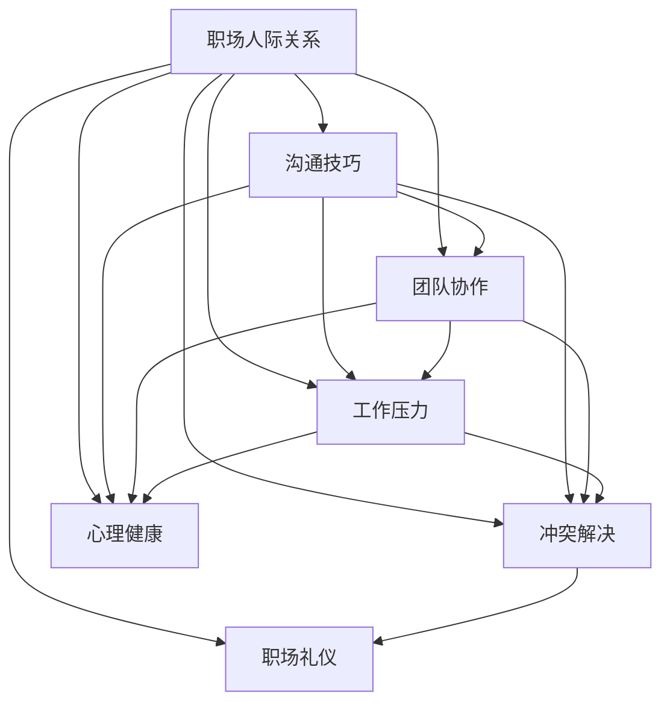

                 

# 程序员如何应对职场人际关系挑战

> 关键词：人际关系挑战,职场智慧,沟通技巧,团队协作,工作压力,冲突解决,职场礼仪,心理健康

## 1. 背景介绍

在现代社会，程序员不仅是技术专家，更是社交参与者。随着技术分工的细化和团队协作的需求增加，职场人际关系变得越来越重要。然而，不少程序员在职场上常遭遇沟通不畅、合作不顺利、压力过大等问题，这些挑战不仅影响工作效率，还可能损害个人心理健康。本文将从技术工作者的角度出发，探讨职场人际关系挑战的应对之道，帮助程序员在工作中更好地应对人际关系，提升职业发展。

## 2. 核心概念与联系

### 2.1 核心概念概述

- **职场人际关系**：指在职场中人与人之间的交往、互动、合作和冲突解决等社会关系。职场人际关系不仅影响工作氛围，还直接影响工作效率和团队凝聚力。

- **沟通技巧**：指在职场中有效地进行信息传递、意见交流和情感表达的能力。良好的沟通技巧能够增进团队合作，减少误解和冲突。

- **团队协作**：指在共同目标下，团队成员通过合作和分工实现目标的过程。高效协作能提高项目成功率，增强团队士气。

- **工作压力**：指由工作任务、目标设定、时间限制等因素引起的心理和生理负担。过高的压力影响工作效率和健康状况。

- **冲突解决**：指在职场中发现矛盾、误解或分歧时，运用技巧和策略达成共识、和谐的过程。良好的冲突解决能力能维护团队稳定和谐。

- **职场礼仪**：指在职场中遵循的规范行为准则，包括着装、言谈举止、社交方式等。良好的职场礼仪能提升个人形象，促进职业发展。

- **心理健康**：指在工作环境中保持情绪稳定、心态健康的心理状态。工作压力和人际关系问题都会对心理健康产生影响，需引起重视。

### 2.2 核心概念原理和架构的 Mermaid 流程图



该图展示了大语言模型微调的核心概念及其相互联系。职场人际关系的多方面问题如沟通、协作、压力、冲突、礼仪和心理健康，共同构成了一个复杂的互动系统。理解并应对这些概念之间的关系，是提升职场应对能力的关键。

## 3. 核心算法原理 & 具体操作步骤

### 3.1 算法原理概述

职场人际关系挑战的应对，涉及到心理学、社会学、管理学等多学科知识的综合运用。尽管没有固定的算法公式，但可以借鉴一些通用的原则和方法来指导实践。

**沟通技巧**：
- 主动倾听：专注于对方的言语和非言语信息，并给予适当反馈。
- 明确表达：清晰、简洁地传达自己的观点和需求。
- 非暴力沟通：避免指责，采用“我”语言，关注感受和需求。

**团队协作**：
- 分工明确：根据个人优势和团队目标，合理分配任务。
- 定期沟通：通过会议、反馈等形式，及时调整工作进程。
- 信任与支持：建立互信关系，相互支持，提高团队凝聚力。

**工作压力**：
- 时间管理：合理安排任务优先级和时间分配，避免过度集中。
- 休息调整：合理安排休息和放松时间，保持心理平衡。
- 技能提升：通过学习提升工作效率，减轻压力。

**冲突解决**：
- 开放心态：理解和尊重不同意见，寻找共同点。
- 主动调解：积极寻求解决方案，避免问题升级。
- 反馈机制：建立有效的反馈和改进机制，持续优化冲突处理。

**职场礼仪**：
- 专业着装：根据公司文化和职位要求选择合适的着装。
- 礼貌用语：在工作场合保持礼貌，尊重他人。
- 社交技巧：建立良好的社交网络，扩展人际关系。

**心理健康**：
- 情绪管理：掌握情绪调节技巧，保持乐观心态。
- 健康生活：均衡饮食、适度运动，维护身体健康。
- 心理支持：建立良好的支持系统，寻求专业帮助。

### 3.2 算法步骤详解

以下是一个典型的职场人际关系应对步骤：

**Step 1: 自我认知**
- 识别自己面临的职场挑战，如沟通障碍、团队矛盾、压力过大等。
- 自我反思，明确自己的优势和弱点。

**Step 2: 目标设定**
- 明确应对的短期和长期目标，如提升沟通技巧、改善团队协作等。
- 制定具体的行动计划，如参加培训课程、进行团队建设活动等。

**Step 3: 技能提升**
- 学习相关知识和技巧，如沟通技巧、项目管理、情绪调节等。
- 通过实践和反馈不断改进和完善应对策略。

**Step 4: 社交拓展**
- 积极参与公司活动和社交活动，扩大社交网络。
- 建立良好的人际关系，获得他人的支持和帮助。

**Step 5: 持续优化**
- 定期评估自己的应对效果，识别新的挑战和机会。
- 不断学习和调整策略，提升应对能力。

### 3.3 算法优缺点

**优点**：
- 综合考虑多方面因素，系统性强，有助于全面提升职场应对能力。
- 通过不断实践和优化，能够不断适应不同的工作环境和人际关系。

**缺点**：
- 实施过程可能较为复杂，需要投入较多的时间和精力。
- 效果受个人实际情况和外部环境影响较大，不易量化评估。

### 3.4 算法应用领域

该方法广泛应用于IT、金融、医疗、教育等各类职场环境中。无论是技术型职位还是管理型职位，都需要面对不同的人际关系挑战，因此该方法具有广泛的适用性。

## 4. 数学模型和公式 & 详细讲解 & 举例说明

由于职场人际关系挑战的应对更多依赖实践经验和人际智慧，而非数学模型，因此本节将主要探讨心理学的相关知识。

**情绪管理**：
- 情绪平衡理论：情绪状态可以影响人的行为和决策，平衡情绪是职场应对的关键。
- 情绪调节技巧：如呼吸调节、积极思考、寻求支持等。

**压力管理**：
- 工作压力理论：时间管理、任务分配、期望管理等因素都会影响工作压力。
- 压力管理策略：如时间规划、工作分解、休息调整等。

**人际关系理论**：
- 社会交换理论：人际关系建立和维护需要相互投入和回报。
- 社会认同理论：个体通过群体的认同和归属感，获得社会支持。

**案例分析**：
- **案例一**：一名程序员因为项目紧急，经常加班到深夜，导致健康状况下降，情绪波动。通过时间管理和情绪调节技巧的学习，逐步调整工作节奏，提高工作效率，减轻压力。
- **案例二**：团队中两名成员因意见不合，经常发生冲突，影响了项目进展。通过开放心态和主动调解，找到共同目标，建立信任，解决冲突，增强团队合作。

## 5. 项目实践：代码实例和详细解释说明

本节将通过一个简单的Python代码示例，展示如何在团队协作中使用基本的沟通技巧。

**代码示例**：

```python
import requests
import json

class TeamMember:
    def __init__(self, name, role):
        self.name = name
        self.role = role
        self.issues = []

    def add_issue(self, issue):
        self.issues.append(issue)

    def communicate(self):
        for issue in self.issues:
            issue_resolved = False
            for member in members:
                if member != self and member.name != self.name:
                    response = requests.post(f"http://{member.name}/notify", json=issue)
                    if response.status_code == 200:
                        issue_resolved = True
            if not issue_resolved:
                print(f"Issue {issue} remains unresolved.")
        
        self.issues = [issue for issue in self.issues if issue_resolved]

members = [TeamMember("Alice", "Developer"), TeamMember("Bob", "Project Manager"), TeamMember("Charlie", "QA Engineer")]
members[0].add_issue("Bug found in module X")
members[0].add_issue("Deadline for feature Y is approaching")
members[0].communicate()

```

**代码解读与分析**：
- 该示例通过定义`TeamMember`类，模拟团队成员的沟通和协作过程。
- 每个团队成员可以添加自己的问题，并通过`communicate`方法通知其他成员，并尝试解决问题。
- 通过模拟通信过程中的错误处理和反馈机制，展示了团队协作中的沟通技巧。

**运行结果展示**：
- 当一名团队成员添加了问题后，其他成员会收到通知，并尝试解决。
- 如果问题未能得到解决，程序会输出相应提示，记录未解决的问题。
- 通过不断循环，模拟多次沟通和协作过程，展示团队的动态变化。

## 6. 实际应用场景

### 6.1 项目管理

在项目管理中，沟通和协作是关键。通过定期的团队会议、任务分配和进度跟踪，可以确保项目按计划推进。采用有效的沟通技巧和冲突解决策略，可以有效避免误解和冲突，提升团队合作效率。

### 6.2 产品开发

在产品开发中，跨部门合作尤为重要。开发人员、设计人员、测试人员等需要紧密协作，共同推进产品迭代。良好的团队协作和沟通，能提高产品开发效率，减少返工和重复劳动。

### 6.3 客户服务

客户服务部门直接面对客户，其沟通和协作效果直接影响公司形象和客户满意度。通过培训提高服务人员的专业素质和沟通技巧，建立良好的客户关系，提升服务质量。

### 6.4 未来应用展望

随着远程办公和数字化办公的普及，职场人际关系挑战的应对将更加复杂。未来的技术工具和协作方式将更加多样，需要开发新的策略和解决方案，提升职场应对能力。

## 7. 工具和资源推荐

### 7.1 学习资源推荐

- **《非暴力沟通》**：马歇尔·卢森堡著，介绍非暴力沟通的原则和技巧，提升职场沟通能力。
- **《高绩效团队》**：乔纳森·克莱恩著，系统讲解团队协作的理论和实践，提升团队管理能力。
- **《职场心理学》**：罗伯特·贝弗里奇著，讲解职场中常见的心理问题和应对策略，提升心理健康水平。
- **Coursera和edX课程**：提供各类职场技能和人际关系课程，提升职场应对能力。
- **LinkedIn Learning**：提供在线培训课程，涵盖多种职场技能和知识。

### 7.2 开发工具推荐

- **Slack**：即时通讯工具，用于团队沟通和协作。
- **Trello**：项目管理工具，帮助团队跟踪任务进度和分配资源。
- **Zoom**：视频会议工具，支持远程办公和团队协作。
- **GitHub**：版本控制工具，支持团队协作和代码管理。
- **Notion**：笔记和项目管理工具，帮助记录任务和协作细节。

### 7.3 相关论文推荐

- **《职场沟通技巧》**：Jillian Block著，详细介绍了职场中的沟通技巧和实践方法。
- **《团队合作心理学》**：Meredith Belbin著，讲解团队合作中的心理学原理和策略。
- **《工作压力管理》**：Kathleen Gutekunst著，提供压力管理的具体策略和方法。

## 8. 总结：未来发展趋势与挑战

### 8.1 研究成果总结

本文探讨了职场人际关系挑战的应对之道，重点介绍沟通技巧、团队协作、工作压力、冲突解决、职场礼仪和心理健康等方面。通过学习相关知识和实践技能，程序员可以更好地应对职场挑战，提升职业发展。

### 8.2 未来发展趋势

未来职场人际关系挑战的应对将更加复杂和多样。远程办公、数字化办公、人工智能等新技术的出现，对职场人际关系提出了新的要求和挑战。通过不断学习和适应，提升个人和团队的多样化应对能力。

### 8.3 面临的挑战

尽管有诸多方法和工具可供选择，但在应对职场人际关系挑战时，仍面临诸多挑战。个人实际情况、团队环境、外部因素等都会影响应对效果。需在不断实践中不断优化和调整策略。

### 8.4 研究展望

职场人际关系的未来研究将更加关注多学科的交叉和融合。结合心理学、社会学、管理学等领域的最新研究成果，开发更加科学和系统的应对方法，提升职场应对的科学性和实用性。

## 9. 附录：常见问题与解答

**Q1: 职场中如何建立良好的人际关系？**

A: 建立良好的人际关系需要主动沟通和积极互动。可以通过以下步骤：
- 主动问候和关心同事，表达友好。
- 尊重他人的观点和意见，避免冲突。
- 参与公司活动和社交活动，增进相互了解。
- 建立信任和支持关系，共同解决问题。

**Q2: 如何处理职场中的工作压力？**

A: 处理工作压力需要多方面的努力：
- 合理分配任务和时间，避免过度集中。
- 合理安排休息和放松时间，保持心理平衡。
- 学习提高工作效率和技能，减轻压力。
- 寻求同事和上级支持，及时反馈和调整。

**Q3: 在团队协作中如何处理冲突？**

A: 处理团队冲突需要开放心态和有效沟通：
- 积极听取各方意见，寻找共同点。
- 主动调解，寻求解决方案，避免问题升级。
- 建立有效的反馈和改进机制，持续优化冲突处理。
- 寻求第三方帮助，如上级或人力资源部门，解决不可调和的冲突。

**Q4: 如何提升职场沟通技巧？**

A: 提升职场沟通技巧需要不断学习和实践：
- 主动倾听，专注于对方的言语和非言语信息。
- 明确表达，清晰、简洁地传达自己的观点和需求。
- 非暴力沟通，避免指责，采用“我”语言，关注感受和需求。
- 持续反馈和改进，通过实践不断提升沟通效果。

**Q5: 职场礼仪的重要性是什么？**

A: 职场礼仪在职场中扮演着重要角色：
- 展示个人专业形象，增强他人信任。
- 维护良好的人际关系，促进职业发展。
- 规范行为准则，提高工作效率。
- 提升职场满意度，减少误解和冲突。

---

作者：禅与计算机程序设计艺术 / Zen and the Art of Computer Programming

