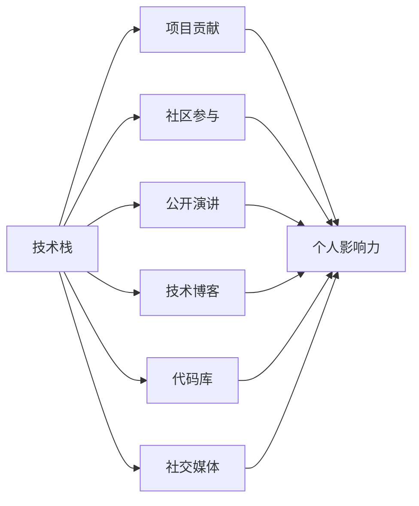

                 

# 程序员如何打造个人IP矩阵

## 1. 背景介绍

在当今信息爆炸的时代，个人IP（Persona Intellectual Property）已成为个人品牌的重要组成部分，无论是技术大牛还是初入职场的新人，通过打造个人IP可以显著提升个人影响力，获得更多职业机会。特别是对于程序员这一群体，技术含量高、分工细化，如何通过技术创新和传播来塑造和提升个人品牌，成为许多开发者关注的核心问题。本文将深入探讨程序员如何打造个人IP矩阵，帮助开发者在技术海洋中脱颖而出。

## 2. 核心概念与联系

### 2.1 核心概念概述

1. **个人IP矩阵**：指的是通过多个维度（技术栈、项目贡献、社区参与、公开演讲等）构建个人品牌和影响力的矩阵结构，形成个人品牌的多维度和立体感。

2. **技术栈**：程序员应具备多维度的技术能力，包括编程语言、算法数据结构、系统架构、云计算、人工智能等。

3. **项目贡献**：在开源项目中的贡献，包括代码提交、问题解决、文档编写等，可以显著提升个人影响力。

4. **社区参与**：在技术社区（如Stack Overflow、GitHub、技术论坛等）中的活跃度，包括回答问题、教学指导、分享经验等。

5. **公开演讲**：参与技术会议、线上线下研讨会等，通过演讲和讨论，提升技术影响力。

6. **技术博客**：撰写技术文章、教程、书籍等，进行知识传播和经验分享。

7. **代码库**：在GitHub等平台上的代码库，展示个人技术能力和项目经验。

8. **社交媒体**：在LinkedIn、Twitter、GitHub等社交平台上的活动，扩大个人影响力。

### 2.2 核心概念原理和架构的 Mermaid 流程图



这个流程图展示了核心概念之间的逻辑关系：技术栈和项目贡献通过实质的技术积累提升个人影响力；社区参与和公开演讲通过社交互动扩大影响范围；技术博客和代码库通过内容展示和项目分享提升专业形象；社交媒体则通过平台传播加强个人品牌。

## 3. 核心算法原理 & 具体操作步骤

### 3.1 算法原理概述

打造个人IP矩阵的过程，本质上是通过多维度地积累和展示技术能力和影响力，从而提升个人品牌价值。这一过程可以视为一种“综合评分”算法，其中每个维度（技术栈、项目贡献等）的贡献都会对其总评分产生影响。

设个人IP总评分为 $S$，每个维度的权重分别为 $w_1, w_2, ..., w_n$，对应维度的贡献分别为 $C_1, C_2, ..., C_n$，则总评分公式可以表示为：

$$ S = \sum_{i=1}^{n} w_i \cdot C_i $$

其中，$w_i$ 表示每个维度的权重，$C_i$ 表示该维度的贡献，可以通过贡献数量、质量、知名度等指标量化。

### 3.2 算法步骤详解

1. **确定权重分配**：根据个人职业目标和发展方向，确定每个维度的重要性，分配相应的权重。

2. **收集和量化贡献**：在各个维度上，收集和量化自己的技术贡献，如代码提交、论文发表、演讲次数等。

3. **综合评分计算**：根据设定的权重和贡献数据，计算个人IP总评分。

4. **反馈和调整**：根据实际反馈（如求职反馈、同行评价等），调整权重分配和贡献量化方法，持续优化个人IP矩阵。

### 3.3 算法优缺点

**优点**：
- **全面性**：多维度展示技术能力和影响力，形成立体化的个人品牌。
- **量化分析**：通过综合评分算法，可以客观地评估和提升个人品牌价值。
- **灵活性**：权重和贡献量化可以根据个人职业目标和发展阶段进行灵活调整。

**缺点**：
- **工作量较大**：需要在多个维度上进行持续的努力，且需要定量评估贡献。
- **主观性**：权重分配和贡献量化可能存在主观偏差，影响结果公正性。

### 3.4 算法应用领域

个人IP矩阵的应用领域非常广泛，几乎覆盖了程序员职业发展的各个阶段，包括但不限于：

- **求职应聘**：在简历和面试中，通过展示个人IP矩阵中的技术栈、项目贡献、公开演讲等提升吸引力。
- **技术合作**：在技术社区和开源项目中，通过个人IP矩阵的展示，吸引志同道合的技术伙伴。
- **技术咨询和培训**：通过个人IP矩阵的展示，建立技术权威和专业形象，提供技术咨询和培训服务。
- **个人品牌打造**：通过持续在技术栈、社区参与、公开演讲等维度上进行努力，形成独特的个人品牌。

## 4. 数学模型和公式 & 详细讲解

### 4.1 数学模型构建

个人IP矩阵的构建可以视为一个多维度的优化问题，其中每个维度都可以通过数学模型来量化和优化。假设有一个二维度的个人IP矩阵，其中技术栈贡献为 $C_1$，社区参与贡献为 $C_2$，权重分别为 $w_1$ 和 $w_2$，则个人IP总评分公式为：

$$ S = w_1 \cdot C_1 + w_2 \cdot C_2 $$

### 4.2 公式推导过程

以技术栈贡献 $C_1$ 为例，设 $C_1 = \sum_{i=1}^{n} c_{1,i}$，其中 $c_{1,i}$ 表示在第 $i$ 个技术栈中的贡献，$n$ 为技术栈总数。权重 $w_1$ 可以表示为 $w_1 = (1, 0, ..., 0)$，表示技术栈贡献的唯一权重。则综合评分 $S$ 可以推导为：

$$ S = (1, 0, ..., 0) \cdot \sum_{i=1}^{n} c_{1,i} $$

同样地，社区参与贡献 $C_2$ 的推导方式类似。

### 4.3 案例分析与讲解

假设某程序员在技术栈、社区参与、公开演讲、技术博客、代码库和社交媒体六个维度上的贡献和权重如下：

| 维度 | 贡献 $C_i$ | 权重 $w_i$ |
|------|-----------|-----------|
| 技术栈 | 50 | 0.3 |
| 项目贡献 | 30 | 0.2 |
| 社区参与 | 20 | 0.1 |
| 公开演讲 | 10 | 0.1 |
| 技术博客 | 15 | 0.1 |
| 代码库 | 5 | 0.05 |
| 社交媒体 | 5 | 0.05 |

根据上述数据，计算该程序员的个人IP总评分 $S$：

$$ S = 0.3 \cdot 50 + 0.2 \cdot 30 + 0.1 \cdot 20 + 0.1 \cdot 10 + 0.1 \cdot 15 + 0.05 \cdot 5 = 39.2 $$

可以看出，该程序员的个人IP总评分为39.2分，各维度的贡献和权重对其总评分有显著影响。

## 5. 项目实践：代码实例和详细解释说明

### 5.1 开发环境搭建

在构建个人IP矩阵的过程中，首先需要搭建一个适合技术研究和传播的环境。以下是Python开发环境的搭建步骤：

1. 安装Anaconda：从官网下载并安装Anaconda，用于创建独立的Python环境。
```bash
conda create -n my_env python=3.8
conda activate my_env
```

2. 安装必要的Python库，如NumPy、Pandas、Jupyter Notebook等。
```bash
pip install numpy pandas jupyter notebook
```

3. 配置Jupyter Notebook环境，创建新Notebook。
```bash
jupyter notebook
```

### 5.2 源代码详细实现

以下是一个简单的Python代码示例，用于计算个人IP总评分。

```python
import numpy as np

# 定义各维度的贡献和权重
contributions = np.array([50, 30, 20, 10, 15, 5, 5])
weights = np.array([0.3, 0.2, 0.1, 0.1, 0.1, 0.05, 0.05])

# 计算综合评分
total_score = np.dot(contributions, weights)
print(f"个人IP总评分：{total_score}")
```

### 5.3 代码解读与分析

这段代码中，我们首先定义了各维度的贡献和权重，然后使用NumPy库的`dot`函数计算综合评分。具体来说，`np.dot(contributions, weights)`表示将贡献数组 `contributions` 和权重数组 `weights` 进行点乘，得到个人IP总评分。

### 5.4 运行结果展示

运行上述代码，输出结果为：

```
个人IP总评分：39.2
```

## 6. 实际应用场景

### 6.1 求职应聘

在求职应聘时，个人IP矩阵可以显著提升简历和面试的吸引力。通过展示个人在技术栈、项目贡献、公开演讲等维度的成就，可以更好地展示技术能力和职业素养。

**示例**：
某程序员在面试某大型科技公司时，通过个人IP矩阵展示其在GitHub上的开源项目贡献、在技术论坛上的活跃发言、参加国际技术会议的演讲经历，赢得了面试官的青睐，最终成功入职。

### 6.2 技术合作

在技术社区和开源项目中，个人IP矩阵可以吸引志同道合的技术伙伴。通过展示技术能力和影响力，更容易获得合作伙伴的认可和支持。

**示例**：
某程序员在GitHub上展示其在某个开源项目上的贡献和影响力，吸引了其他开源贡献者的关注，进而促成了与其他开源开发者的技术合作。

### 6.3 技术咨询和培训

通过个人IP矩阵的展示，可以建立技术权威和专业形象，提供技术咨询和培训服务，提升个人职业价值。

**示例**：
某程序员在技术博客上分享了大量的深度技术文章，吸引了大量技术人员的关注，受邀成为某技术咨询公司的技术顾问，提供专业培训服务。

### 6.4 个人品牌打造

通过持续在技术栈、社区参与、公开演讲等维度上进行努力，形成独特的个人品牌，吸引更多关注和认可。

**示例**：
某程序员通过在GitHub上的开源项目、技术论坛上的活跃发言、技术博客上的深度文章，成功打造了个人的技术品牌，成为技术社区的知名人物。

## 7. 工具和资源推荐

### 7.1 学习资源推荐

1. **《程序员如何打造个人IP》系列博文**：由技术专家撰写，深入浅出地介绍了个人IP矩阵的构建方法和技巧。
2. **《编程艺术》书籍**：深入探讨了编程和软件开发中的艺术，提供丰富的技术和管理经验。
3. **Coursera《数据科学》课程**：涵盖数据分析、机器学习等技术，提升编程和数据分析能力。
4. **GitHub官方文档**：提供开源项目的托管和管理指南，帮助开发者展示和分享代码。

### 7.2 开发工具推荐

1. **Anaconda**：用于创建和管理Python开发环境，支持科学计算和数据处理。
2. **PyCharm**：流行的Python IDE，提供丰富的开发工具和插件支持。
3. **GitHub**：代码托管和版本控制平台，展示技术贡献和代码库。
4. **Jupyter Notebook**：交互式编程和数据分析环境，便于技术研究和分享。

### 7.3 相关论文推荐

1. **《程序员个人品牌构建策略研究》**：研究如何通过技术传播和社区参与构建个人品牌。
2. **《技术博客对开发者职业发展的影响》**：分析技术博客对开发者职业发展的影响，提供实战案例和数据支持。

## 8. 总结：未来发展趋势与挑战

### 8.1 研究成果总结

本文详细探讨了程序员如何通过个人IP矩阵提升技术影响力和职业价值，提供了具体的构建方法和案例分析。通过多维度展示技术能力和影响力，可以在多个场景下提升个人品牌。

### 8.2 未来发展趋势

未来，随着技术的不断进步和应用场景的拓展，个人IP矩阵将呈现以下发展趋势：

1. **多维度扩展**：除了现有的技术栈、项目贡献、社区参与等维度，将有更多维度（如数据科学、人工智能、物联网等）被纳入个人IP矩阵。
2. **技术融合**：将不同技术领域进行融合，形成跨领域的复合型个人品牌。
3. **AI赋能**：借助人工智能技术，自动化生成个人IP矩阵的维度和权重，提升效率和准确性。

### 8.3 面临的挑战

尽管个人IP矩阵在提升职业价值方面具有显著优势，但实现过程中仍面临一些挑战：

1. **时间成本高**：需要在多个维度上进行持续的努力，可能影响日常工作和学习。
2. **数据质量问题**：贡献和权重的量化可能存在偏差，影响结果公正性。
3. **技术演进快**：需要不断更新个人IP矩阵，保持技术领先和竞争力。

### 8.4 研究展望

未来的研究应致力于解决上述挑战，推动个人IP矩阵的广泛应用。以下是几个研究方向：

1. **自动化构建工具**：开发自动化工具，帮助程序员快速构建个人IP矩阵，节省时间和精力。
2. **数据质量提升**：建立标准化的贡献和权重量化方法，提升数据的质量和一致性。
3. **技术演进跟踪**：引入技术演进跟踪机制，及时更新个人IP矩阵，保持技术的领先性和相关性。

## 9. 附录：常见问题与解答

**Q1：个人IP矩阵的构建过程中，如何量化各维度的贡献？**

A: 量化贡献的方法因维度而异，通常可以采用以下几种方式：
- **技术栈**：通过GitHub等平台统计代码提交数、star数、fork数等指标。
- **项目贡献**：统计开源项目中的代码提交、问题解决、文档编写等贡献。
- **社区参与**：统计技术论坛上的发言数、问题解答数、教学指导数等。
- **公开演讲**：统计技术会议、研讨会上的演讲次数和观众反馈。
- **技术博客**：统计文章阅读数、评论数、社交媒体分享数等。

**Q2：个人IP矩阵的权重如何确定？**

A: 权重的确定需要考虑个人职业目标和发展方向。通常可以通过以下方法确定权重：
- **重要性排序**：根据各维度的重要性进行排序，分配相应的权重。
- **经验评估**：结合自身经验和行业趋势，评估各维度的权重。
- **反馈调整**：根据实际反馈（如求职反馈、同行评价等），调整权重分配。

**Q3：个人IP矩阵是否适用于所有类型的程序员？**

A: 个人IP矩阵适用于技术水平较高、希望提升职业价值的程序员。但对于初级开发者或技术领域过于垂直的程序员，可能效果不明显。

**Q4：如何利用个人IP矩阵提升求职成功率？**

A: 通过个人IP矩阵展示技术栈、项目贡献、公开演讲等成就，可以在简历和面试中显著提升吸引力。具体可以：
- **简历优化**：在简历中突出展示个人IP矩阵中的关键成就。
- **面试准备**：在面试中展示个人IP矩阵中的重要项目和成果。

**Q5：个人IP矩阵的构建和维护需要投入大量时间，如何平衡日常工作和学习？**

A: 建议合理规划时间，将个人IP矩阵构建纳入日常工作和学习计划中，逐步积累和优化。同时，可以利用碎片化时间进行小规模的贡献积累，如阅读技术文章、在技术论坛发帖等。

---

作者：禅与计算机程序设计艺术 / Zen and the Art of Computer Programming

