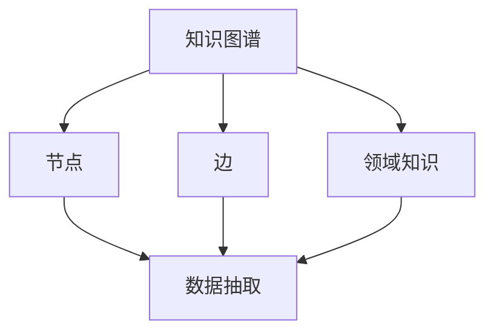

                 

# 程序员如何构建个人知识图谱

> 关键词：知识图谱,程序员,个人,构建,数据整合,数据抽取,领域知识,应用场景,最佳实践

## 1. 背景介绍

### 1.1 问题由来
在当下数据驱动的时代，知识和信息无处不在，但如何高效地组织和管理这些信息，使之转化为对个人和组织有用的知识，成为每一位程序员的挑战。而个人知识图谱，即以个人为核心的知识网络，为这一问题提供了一个有效的解决方案。个人知识图谱不仅能帮助程序员更好地存储、检索和利用知识，还能提升其学习和工作效率，为职业发展提供有力支持。

### 1.2 问题核心关键点
个人知识图谱的核心在于将知识转化为可查用的网络图谱，通过节点和边的关系表示知识点之间的联系，便于快速查找和理解。构建个人知识图谱的关键步骤包括：数据收集、数据抽取、数据整合和领域知识的嵌入。这不仅需要扎实的计算机科学基础，还需具备良好的数据分析和领域知识整合能力。

## 2. 核心概念与联系

### 2.1 核心概念概述

- **知识图谱(Knowledge Graph)**：以图形结构存储实体及实体间关系的知识表示方式，用于描述现实世界中的概念和它们之间的关联。
- **节点(Node)**：代表实体或概念，存储该实体的属性和信息。
- **边(Edge)**：连接节点，表示实体之间的关系。
- **领域知识(Domain Knowledge)**：某一特定领域的知识，包括专业术语、原理、算法、工具等。
- **数据抽取(Data Extraction)**：从原始数据中提取出有用的信息，用于构建知识图谱的节点和边。
- **数据整合(Data Integration)**：将不同数据源中关于同一实体的信息进行统一和融合，确保知识图谱的完整性和一致性。
- **领域知识嵌入(Embodiment of Domain Knowledge)**：将领域知识嵌入知识图谱，增强其针对性和应用价值。

这些核心概念之间的逻辑关系可以通过以下Mermaid流程图来展示：



这个流程图展示了一个简单的知识图谱构建流程：知识图谱由节点和边构成，节点代表实体，边代表实体间的关系。而领域知识通过数据抽取和整合，嵌入到知识图谱中，形成完整的知识网络。

## 3. 核心算法原理 & 具体操作步骤
### 3.1 算法原理概述

构建个人知识图谱的算法原理主要包括以下几个步骤：

1. **数据收集**：从多个数据源收集有关实体的信息。
2. **数据抽取**：从收集的数据中提取出实体和它们之间的关系。
3. **数据整合**：将抽取的信息进行清洗、合并和标准化，形成一致的知识表示。
4. **领域知识嵌入**：将特定领域的知识以节点和边的形式，嵌入到知识图谱中。
5. **知识查询和推理**：通过图谱查询和推理算法，快速找到需要的知识和信息。

### 3.2 算法步骤详解

以下详细讲解了构建个人知识图谱的每个关键步骤：

**Step 1: 数据收集**
- 使用爬虫、API接口、数据库查询等方式，从书籍、论文、教程、博客等数据源收集信息。
- 确保数据源的多样性和代表性，涵盖广泛的领域和知识点。

**Step 2: 数据抽取**
- 应用自然语言处理技术，如命名实体识别、关系抽取等，从收集到的文本数据中提取实体和关系。
- 使用正则表达式、分词技术、句法分析等工具，提高数据抽取的准确性和效率。

**Step 3: 数据整合**
- 对抽取的信息进行清洗、去重、格式化等处理，确保数据的准确性和一致性。
- 应用数据融合技术，如联结、集成、综合等，将不同数据源中的信息合并成一个统一的知识图谱。
- 通过数据校验和一致性检查，保证知识图谱的完整性和可靠性。

**Step 4: 领域知识嵌入**
- 收集特定领域的知识库和规则库，如API文档、技术手册、最佳实践等。
- 应用领域知识抽取技术，将领域知识以节点和边的形式嵌入到知识图谱中。
- 通过知识嵌入算法，如TransE、GNN等，增强知识图谱的语义理解和推理能力。

**Step 5: 知识查询和推理**
- 使用图谱查询算法，如图谱搜索、推荐算法等，快速定位所需信息。
- 应用图谱推理算法，如规则推理、因果推理等，提升知识图谱的逻辑推理能力。
- 结合自然语言处理技术，实现自然语言查询和结果展示。

### 3.3 算法优缺点

构建个人知识图谱的算法具有以下优点：

- **系统化知识管理**：将散乱的知识系统化地组织和存储，方便快速查询和应用。
- **知识复用性高**：抽取和整合的信息可以反复利用，提升知识图谱的价值。
- **知识可视化**：通过图形化展示，直观地展示知识结构，增强理解和记忆。

同时，该算法也存在一些局限性：

- **数据抽取难度大**：原始数据的格式和质量往往不一致，抽取过程中需要处理大量噪音和误差。
- **数据整合复杂**：不同数据源中的信息可能存在冲突，整合过程中需要进行大量的校验和调整。
- **领域知识泛化性不足**：特定领域的知识库可能不全面，无法涵盖所有可能的知识点。
- **推理准确性有待提高**：知识图谱的推理依赖于模型和算法的精确度，需要不断优化。

尽管存在这些局限性，但通过合理的技术手段和策略设计，可以显著提升算法的性能和效果。

### 3.4 算法应用领域

构建个人知识图谱的算法不仅适用于程序员，也广泛应用于科研人员、数据科学家、教师、医生等需要大量存储和查询知识的专业领域。

- **科研人员**：通过构建领域知识图谱，能够更系统地管理和利用科研资源，提升科研效率和创新能力。
- **数据科学家**：整合多源数据，构建知识图谱，辅助数据探索和分析，提升数据洞察力。
- **教师**：组织教学资源，构建知识图谱，提高教学质量和效果。
- **医生**：整理医疗知识和案例，构建知识图谱，辅助诊断和治疗。

## 4. 数学模型和公式 & 详细讲解 & 举例说明
### 4.1 数学模型构建

知识图谱的数学模型通常包括节点表示和边表示，如实体-关系-属性三元组。以下是一个简单的知识图谱数学模型：

- 节点表示：$N=\{n_1,n_2,...,n_k\}$，其中 $n_i$ 表示第 $i$ 个实体，包含属性向量 $A(n_i)$。
- 边表示：$E=\{e_{ij}\}$，其中 $e_{ij}$ 表示实体 $n_i$ 和 $n_j$ 之间的关系，可以有多种类型，如"属于"、"属于同一类别"、"相互作用"等。

### 4.2 公式推导过程

假设节点 $n_i$ 的实体表示为 $E_i$，关系表示为 $R_i$，属性表示为 $A_i$。则节点 $n_i$ 的数学表示如下：

$$
n_i = (E_i, R_i, A_i) = (e_i^0, e_i^1, e_i^2, ..., e_i^m)
$$

其中 $e_i^0$ 表示实体的类型，$e_i^1,...,e_i^m$ 表示实体的属性。

对于边 $e_{ij}$，其表示为节点 $n_i$ 和 $n_j$ 之间的关系，可以表示为：

$$
e_{ij} = (R_i, R_j) = (r_i^0, r_i^1, ..., r_i^m)
$$

其中 $r_i^0$ 表示关系类型，$r_i^1,...,r_i^m$ 表示关系属性。

节点之间的连接可以通过边表示，如：

$$
e_{ij} = (n_i, n_j, R_{ij})
$$

其中 $R_{ij}$ 表示节点 $n_i$ 和 $n_j$ 之间的关系类型。

### 4.3 案例分析与讲解

以下是一个简单的案例，展示如何构建一个关于编程语言的个人知识图谱：

**Step 1: 数据收集**
- 从多个数据源收集编程语言的相关信息，如维基百科、官方文档、博客、论坛等。

**Step 2: 数据抽取**
- 应用自然语言处理技术，如命名实体识别和关系抽取，从文本中提取编程语言、作者、语言特性等信息。
- 例如，从维基百科中抽取以下实体：
  - 实体1：Python
    - 属性：编程语言
    - 关系：发明者
      - 节点2：Guido van Rossum
    - 关系：语言特性
      - 节点3：高级
      - 节点4：解释型
- 关系：语言特性
  - 节点5：类型
  - 节点6：面向对象
  - 关系：开发工具
    - 节点7：PyCharm

**Step 3: 数据整合**
- 对抽取的信息进行清洗、去重、格式化等处理，确保数据的准确性和一致性。
- 例如，将不同的作者信息进行合并，确保每个实体只有一个唯一的标识符。

**Step 4: 领域知识嵌入**
- 收集关于编程语言的领域知识库，如API文档、技术手册、最佳实践等。
- 例如，将API文档中的函数、类、参数等以节点形式嵌入知识图谱中。

**Step 5: 知识查询和推理**
- 使用图谱查询算法，如图谱搜索、推荐算法等，快速定位所需信息。
- 例如，查询关于Python的最佳开发工具，可以使用图谱搜索算法。

## 5. 项目实践：代码实例和详细解释说明
### 5.1 开发环境搭建

在进行个人知识图谱的构建实践前，我们需要准备好开发环境。以下是使用Python进行PyTorch开发的环境配置流程：

1. 安装Anaconda：从官网下载并安装Anaconda，用于创建独立的Python环境。

2. 创建并激活虚拟环境：
```bash
conda create -n pytorch-env python=3.8 
conda activate pytorch-env
```

3. 安装PyTorch：根据CUDA版本，从官网获取对应的安装命令。例如：
```bash
conda install pytorch torchvision torchaudio cudatoolkit=11.1 -c pytorch -c conda-forge
```

4. 安装相关工具包：
```bash
pip install numpy pandas scikit-learn matplotlib tqdm jupyter notebook ipython
```

完成上述步骤后，即可在`pytorch-env`环境中开始知识图谱的构建实践。

### 5.2 源代码详细实现

以下是一个简单的Python代码实例，展示如何使用PyTorch和NLTK库构建一个简单的个人知识图谱：

```python
import torch
import nltk
from nltk.tokenize import word_tokenize
from nltk.tag import pos_tag
from collections import defaultdict

# 定义节点和边类
class Node:
    def __init__(self, name, attributes, relations):
        self.name = name
        self.attributes = attributes
        self.relations = relations

class Edge:
    def __init__(self, from_node, to_node, relation):
        self.from_node = from_node
        self.to_node = to_node
        self.relation = relation

# 定义知识图谱类
class KnowledgeGraph:
    def __init__(self):
        self.nodes = defaultdict(Node)
        self.edges = []

    def add_node(self, name, attributes, relations):
        node = Node(name, attributes, relations)
        self.nodes[name] = node

    def add_edge(self, from_name, to_name, relation):
        from_node = self.nodes[from_name]
        to_node = self.nodes[to_name]
        edge = Edge(from_node, to_node, relation)
        self.edges.append(edge)

    def __str__(self):
        return str(self.nodes) + str(self.edges)

# 构建知识图谱
kg = KnowledgeGraph()

# 添加节点和边
kg.add_node('Python', {'Type': 'Programming Language'}, {'Inventor': 'Guido van Rossum'})
kg.add_node('Guido van Rossum', {'Type': 'Person'}, {'Inventor of Python': 'Python'})
kg.add_node('High-level', {'Type': 'Language Feature'}, {'Language': 'Python'})
kg.add_node('Interpreted', {'Type': 'Language Feature'}, {'Language': 'Python'})
kg.add_edge('Python', 'Guido van Rossum', 'Inventor')
kg.add_edge('Python', 'High-level', 'Language Feature')
kg.add_edge('Python', 'Interpreted', 'Language Feature')
kg.add_edge('Guido van Rossum', 'Inventor of Python', 'Python')

# 输出知识图谱
print(kg)
```

### 5.3 代码解读与分析

让我们再详细解读一下关键代码的实现细节：

**KnowledgeGraph类**：
- `__init__`方法：初始化知识图谱的节点和边。
- `add_node`方法：向知识图谱添加节点，包含名称、属性和关系。
- `add_edge`方法：向知识图谱添加边，连接两个节点并指定关系。
- `__str__`方法：定义了知识图谱的字符串表示，方便打印输出。

**Node和Edge类**：
- `Node类`：表示节点，包含名称、属性和关系。
- `Edge类`：表示边，连接两个节点并指定关系。

**知识图谱构建过程**：
- 定义一个空的知识图谱对象kg。
- 通过调用`add_node`方法，向知识图谱添加节点，如Python、Guido van Rossum、High-level、Interpreted等。
- 通过调用`add_edge`方法，向知识图谱添加边，如连接Python和Guido van Rossum的Inventor边，连接Python和High-level的Language Feature边等。
- 最后打印知识图谱的字符串表示，验证构建的正确性。

代码实例展示了如何通过Python和NLTK库构建一个简单的知识图谱，并在调试过程中不断优化和调整。这仅为知识图谱构建的基础框架，实际应用中需要更复杂的逻辑和算法支持。

## 6. 实际应用场景
### 6.1 项目开发

在项目开发中，个人知识图谱可以用于快速查找所需技术和工具，提高开发效率和质量。例如：

- 构建一个关于开源项目的知识图谱，包含项目名称、作者、贡献者、依赖库、文档链接等节点，帮助开发人员快速定位和使用项目资源。
- 构建一个关于编程语言的图谱，包含语言特性、开发工具、应用场景等，帮助程序员选择最合适的语言和工具。

### 6.2 学习资源整理

在学习和研究过程中，个人知识图谱可以用于整理和检索学习资源，提升学习效率。例如：

- 构建一个关于计算机科学的知识图谱，涵盖算法、数据结构、编程语言、操作系统等，帮助学生系统地掌握相关知识。
- 构建一个关于机器学习的图谱，包含模型、算法、工具、应用场景等，帮助研究人员系统地探索和应用机器学习技术。

### 6.3 技术支持和问题解决

在技术支持和问题解决过程中，个人知识图谱可以用于快速查找和理解问题，提供解决方案。例如：

- 构建一个关于软件开发的图谱，涵盖编程语言、开发工具、版本控制、部署流程等，帮助开发人员快速解决技术问题。
- 构建一个关于数据库的图谱，涵盖不同类型的数据库、SQL查询、索引、性能优化等，帮助数据工程师解决数据库相关问题。

### 6.4 未来应用展望

随着知识图谱技术的不断进步，其在个人知识管理中的应用将更加广泛和深入。

- **自动化工具集成**：未来的知识图谱将与自动化开发工具集成，自动完成代码生成、调试、测试等任务。
- **智能推荐系统**：结合推荐算法和知识图谱，为开发者推荐最合适的代码、框架、库等资源。
- **多模态融合**：结合知识图谱与视觉、语音等多模态信息，构建更加全面和丰富的知识网络。
- **实时更新**：通过持续的数据收集和更新，确保知识图谱的时效性和实用性。

未来，个人知识图谱将成为程序员的重要工具，帮助其在复杂的编程环境中快速定位、学习、解决问题，提升开发效率和质量。

## 7. 工具和资源推荐
### 7.1 学习资源推荐

为了帮助开发者系统掌握知识图谱的理论基础和实践技巧，这里推荐一些优质的学习资源：

1. **《知识图谱理论与应用》**：一本系统介绍知识图谱理论和方法的书籍，涵盖知识表示、构建、查询等方面。
2. **Coursera《Graph Neural Networks》课程**：由斯坦福大学开设的深度学习课程，介绍了图神经网络的基本概念和应用。
3. **《Python知识图谱构建与分析》**：一本介绍Python知识图谱构建和分析的书籍，包含丰富的实例和代码。
4. **LinkedIn Learning《Knowledge Graphs》课程**：介绍知识图谱的基本概念、构建和应用，适合初学者入门。
5. **Knowledge Graphs & AI Hub**：一个开放的知识图谱资源平台，包含大量的数据集、工具和教程，方便学习者和开发者使用。

通过对这些资源的学习实践，相信你一定能够快速掌握知识图谱的精髓，并用于解决实际的开发和研究问题。

### 7.2 开发工具推荐

高效的开发离不开优秀的工具支持。以下是几款用于知识图谱构建开发的常用工具：

1. **Neo4j**：一个开源的图形数据库，支持复杂的图谱查询和推理，适合构建大规模知识图谱。
2. **Gephi**：一个开源的图形可视化工具，方便展示和分析知识图谱的结构。
3. **PyTorch**：基于Python的深度学习框架，灵活高效，适合图神经网络的构建和训练。
4. **NLTK**：一个Python自然语言处理库，提供文本处理和分词等功能，方便数据抽取和预处理。
5. **Spacy**：一个Python自然语言处理库，提供高效的文本处理和实体识别功能。

合理利用这些工具，可以显著提升知识图谱的构建效率，加快创新迭代的步伐。

### 7.3 相关论文推荐

知识图谱技术的发展源于学界的持续研究。以下是几篇奠基性的相关论文，推荐阅读：

1. **《A Survey on Knowledge Graphs and Their Applications》**：一篇综述性论文，介绍了知识图谱的基本概念、构建和应用。
2. **《Semantic Accuracy in Knowledge Graphs》**：一篇研究论文，探讨了知识图谱的语义准确性和应用价值。
3. **《Knowledge Graph Embeddings》**：一篇介绍知识图谱嵌入技术的论文，涵盖了多种嵌入算法和方法。
4. **《Graph Neural Networks》**：一篇研究论文，介绍了图神经网络的基本原理和应用。
5. **《Knowledge-Graph-Based Recommendation Systems》**：一篇研究论文，探讨了知识图谱在推荐系统中的应用。

这些论文代表了大知识图谱技术的发展脉络。通过学习这些前沿成果，可以帮助研究者把握学科前进方向，激发更多的创新灵感。

## 8. 总结：未来发展趋势与挑战
### 8.1 研究成果总结

构建个人知识图谱的技术研究近年来取得了显著进展，主要成果包括：

- **知识图谱构建框架**：建立了系统的知识图谱构建流程，包括数据收集、数据抽取、数据整合、领域知识嵌入和知识推理等环节。
- **知识图谱查询与推理**：开发了高效的图谱查询算法，实现了基于知识图谱的推理和推荐。
- **多模态知识融合**：结合文本、视觉、语音等多模态信息，构建更加全面的知识图谱。

这些研究成果展示了知识图谱技术在实际应用中的巨大潜力，为后续的研究和应用奠定了坚实基础。

### 8.2 未来发展趋势

展望未来，知识图谱技术将呈现以下几个发展趋势：

1. **知识图谱自动化构建**：通过自动化技术，实现知识图谱的自动抽取和整合，提升构建效率。
2. **知识图谱多模态融合**：结合多模态信息，构建更加全面和丰富的知识图谱。
3. **知识图谱推理与推荐**：结合推理和推荐算法，提升知识图谱的应用价值和实用性。
4. **知识图谱实时更新**：通过持续的数据收集和更新，确保知识图谱的时效性和实用性。
5. **知识图谱联邦学习**：结合联邦学习技术，实现知识图谱在不同设备上的分布式构建和应用。

这些趋势展示了知识图谱技术的广阔前景，将进一步提升其在个人知识管理、信息检索、推荐系统等领域的应用价值。

### 8.3 面临的挑战

尽管知识图谱技术已经取得了瞩目成就，但在迈向更加智能化、普适化应用的过程中，它仍面临诸多挑战：

1. **数据抽取难度大**：原始数据的格式和质量往往不一致，抽取过程中需要处理大量噪音和误差。
2. **数据整合复杂**：不同数据源中的信息可能存在冲突，整合过程中需要进行大量的校验和调整。
3. **领域知识泛化性不足**：特定领域的知识库可能不全面，无法涵盖所有可能的知识点。
4. **推理准确性有待提高**：知识图谱的推理依赖于模型和算法的精确度，需要不断优化。

尽管存在这些局限性，但通过合理的技术手段和策略设计，可以显著提升算法的性能和效果。

### 8.4 研究展望

面对知识图谱面临的挑战，未来的研究需要在以下几个方面寻求新的突破：

1. **知识图谱自动化构建**：开发更高效的数据抽取和整合技术，提升知识图谱的自动化构建能力。
2. **多模态知识融合**：结合文本、视觉、语音等多模态信息，构建更加全面和丰富的知识图谱。
3. **知识图谱推理与推荐**：结合推理和推荐算法，提升知识图谱的应用价值和实用性。
4. **知识图谱实时更新**：通过持续的数据收集和更新，确保知识图谱的时效性和实用性。
5. **知识图谱联邦学习**：结合联邦学习技术，实现知识图谱在不同设备上的分布式构建和应用。

这些研究方向将推动知识图谱技术不断进步，为构建智能化的信息检索、推荐系统和个人知识管理提供更强大的支持。

## 9. 附录：常见问题与解答

**Q1：知识图谱和传统数据库的区别是什么？**

A: 知识图谱和传统数据库的最大区别在于其语义表示和推理能力。知识图谱不仅存储结构化数据，还通过节点和边的关系表示实体的属性和关系，支持复杂的推理和查询。而传统数据库通常只支持结构化查询语言（SQL），缺乏语义推理功能。

**Q2：知识图谱在实际应用中面临哪些挑战？**

A: 知识图谱在实际应用中面临的主要挑战包括：
1. 数据抽取难度大：原始数据的格式和质量往往不一致，抽取过程中需要处理大量噪音和误差。
2. 数据整合复杂：不同数据源中的信息可能存在冲突，整合过程中需要进行大量的校验和调整。
3. 领域知识泛化性不足：特定领域的知识库可能不全面，无法涵盖所有可能的知识点。
4. 推理准确性有待提高：知识图谱的推理依赖于模型和算法的精确度，需要不断优化。

**Q3：知识图谱在哪些领域有广泛应用？**

A: 知识图谱在多个领域都有广泛应用，如：
1. 自然语言处理：结合知识图谱，实现问答系统、命名实体识别、关系抽取等任务。
2. 推荐系统：通过知识图谱，提升推荐算法的准确性和个性化程度。
3. 医疗健康：结合知识图谱，辅助医生诊断和治疗。
4. 金融服务：通过知识图谱，实现风险评估、投资分析等任务。
5. 智能制造：结合知识图谱，优化生产流程和供应链管理。

**Q4：知识图谱的构建需要哪些步骤？**

A: 知识图谱的构建需要以下关键步骤：
1. 数据收集：从多个数据源收集有关实体的信息。
2. 数据抽取：从收集到的文本数据中提取实体和关系。
3. 数据整合：对抽取的信息进行清洗、去重、格式化等处理，确保数据的准确性和一致性。
4. 领域知识嵌入：将特定领域的知识以节点和边的形式，嵌入到知识图谱中。
5. 知识查询和推理：通过图谱查询和推理算法，快速找到需要的知识和信息。

**Q5：知识图谱和语义网有何关系？**

A: 知识图谱是语义网的核心组成部分，通过节点和边的关系表示实体之间的语义关系，实现语义理解和推理。语义网是构建基于Web的语义化信息服务框架，旨在将Web上的信息转化为语义化的结构化数据，实现信息共享和协同计算。知识图谱在语义网中扮演重要的角色，是实现语义网的关键技术。

通过本文的系统梳理，可以看到，知识图谱技术在构建个人知识管理、信息检索、推荐系统和智能交互系统等方面具有巨大的应用潜力。随着技术的发展和应用的推广，知识图谱将成为程序员的重要工具，帮助其在复杂的编程环境中快速定位、学习、解决问题，提升开发效率和质量。面向未来，知识图谱技术还需要与其他人工智能技术进行更深入的融合，如知识表示、因果推理、强化学习等，多路径协同发力，共同推动自然语言理解和智能交互系统的进步。只有勇于创新、敢于突破，才能不断拓展知识图谱的边界，让智能技术更好地造福人类社会。

---

作者：禅与计算机程序设计艺术 / Zen and the Art of Computer Programming

