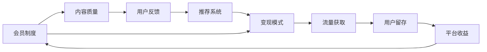

                 

# 程序员如何设计知识付费的会员权益

## 1. 背景介绍

知识付费在近年来的快速发展，使得个人学习和职业发展变得更加高效和有针对性。特别是对于程序员这一群体，随着技术的更新迭代，持续学习和技能提升成为了工作中的重要部分。然而，市面上的内容繁多，质量参差不齐，用户如何找到真正有价值的内容，并系统化地进行学习，成为了一个亟待解决的问题。

在这样的背景下，知识付费平台应运而生，提供了一个高效、有保障的知识获取渠道。这些平台通过邀请行业专家、名师进行授课，为学员提供了高质量的学习内容。然而，如何设计合理的会员权益，以吸引和留住用户，使其真正发挥作用，成为了知识付费平台面临的重要问题。

本文旨在探讨程序员如何设计知识付费平台的会员权益，通过具体的技术手段和策略，确保用户能够获得有价值的知识，同时为平台带来持续的收益。

## 2. 核心概念与联系

### 2.1 核心概念概述

在设计知识付费平台的会员权益时，需要考虑以下几个核心概念：

- **会员制度**：平台通过会员费用的收取，为用户提供特权内容，包括但不限于课程、资料、导师一对一辅导等。
- **内容质量**：平台需要确保所提供的课程、资料等内容的原创性、专业性和实用性，以吸引用户加入会员。
- **用户反馈**：平台需要收集用户对内容、服务的反馈，不断优化和调整，提升用户体验。
- **推荐系统**：通过算法推荐用户可能感兴趣的内容，增加用户的停留时间和活跃度。
- **变现模式**：除了会员费用的直接收取外，还可以探索课程销售、广告、品牌合作等多元化的变现方式。

这些概念相互联系，共同构成了知识付费平台的会员权益设计基础。以下通过Mermaid流程图展示各个概念之间的关系：



### 2.2 核心概念原理和架构

**会员制度**：平台通过会员费用的收取，为用户提供特权内容，包括但不限于课程、资料、导师一对一辅导等。

**内容质量**：平台需要确保所提供的课程、资料等内容的原创性、专业性和实用性，以吸引用户加入会员。

**用户反馈**：平台需要收集用户对内容、服务的反馈，不断优化和调整，提升用户体验。

**推荐系统**：通过算法推荐用户可能感兴趣的内容，增加用户的停留时间和活跃度。

**变现模式**：除了会员费用的直接收取外，还可以探索课程销售、广告、品牌合作等多元化的变现方式。

## 3. 核心算法原理 & 具体操作步骤

### 3.1 算法原理概述

知识付费平台的会员权益设计需要综合考虑用户需求、平台收益、内容质量等因素。其核心算法原理包括会员制度设计、内容推荐算法、用户反馈处理等。

#### 3.1.1 会员制度设计

会员制度设计需要考虑以下几个方面：

- **会员等级**：根据不同的付费金额和特权内容，设置不同的会员等级。例如，普通会员、VIP会员、大师会员等。
- **特权内容**：不同等级会员享有不同的特权内容，包括课程、资料、导师一对一辅导等。
- **会员优惠**：新用户首次购买会员时，可以享受一定时间的免费试用期或首次购买优惠。

#### 3.1.2 内容推荐算法

内容推荐算法旨在通过算法为用户推荐最相关的课程和资料，增加用户停留时间和活跃度。

- **协同过滤**：通过分析用户的历史行为数据，为用户推荐相似用户喜欢的内容。
- **基于内容的推荐**：通过分析课程或资料的内容特征，为用户推荐相关的课程和资料。
- **混合推荐**：结合协同过滤和基于内容的推荐算法，综合考虑多种因素，提升推荐效果。

#### 3.1.3 用户反馈处理

用户反馈处理需要及时收集和分析用户对内容、服务的反馈，不断优化和调整，提升用户体验。

- **反馈收集**：通过在线调查、用户评论、课程评价等方式收集用户反馈。
- **情感分析**：对用户反馈进行情感分析，了解用户对内容、服务的满意度。
- **优化调整**：根据用户反馈，优化课程内容、师资队伍、服务质量等，提升用户体验。

### 3.2 算法步骤详解

以下详细讲解知识付费平台会员权益设计的主要算法步骤：

**Step 1: 会员等级设置**
- 根据不同等级的会员费用，设置不同的特权内容。
- 设计不同等级的会员数量限制，避免过多会员影响平台收益。

**Step 2: 内容推荐算法实现**
- 收集用户历史行为数据，包括浏览记录、观看时长、评价等。
- 使用协同过滤算法或基于内容的推荐算法，为用户推荐相关内容。
- 定期更新推荐算法模型，提高推荐效果。

**Step 3: 用户反馈收集与处理**
- 设计在线调查、用户评论、课程评价等功能，收集用户反馈。
- 对用户反馈进行情感分析，识别用户的不满和建议。
- 根据反馈进行内容优化和调整，提升用户体验。

**Step 4: 变现模式探索**
- 除了会员费用的直接收取外，还可以探索课程销售、广告、品牌合作等多元化的变现方式。
- 设计灵活的付费方式，如按课程付费、按月付费、按次付费等。

### 3.3 算法优缺点

#### 3.3.1 优点

知识付费平台的会员权益设计具有以下优点：

- **提升用户粘性**：通过提供高质量的特权内容，吸引用户成为会员，增加用户粘性。
- **优化内容推荐**：通过内容推荐算法，提高用户对课程和资料的兴趣和满意度。
- **提高用户满意度**：通过用户反馈处理，不断优化和调整，提升用户体验。

#### 3.3.2 缺点

知识付费平台的会员权益设计也存在以下缺点：

- **费用较高**：较高的会员费用可能对部分用户构成经济负担，影响用户加入意愿。
- **内容质量参差不齐**：如果内容质量不高，可能会降低用户对平台的信任和满意度。
- **过度依赖推荐算法**：过度依赖推荐算法，可能导致内容的同质化，影响用户体验。

### 3.4 算法应用领域

知识付费平台的会员权益设计主要应用于以下领域：

- **在线教育**：提供高质量的课程、资料、导师一对一辅导等。
- **技术培训**：通过会员特权内容，帮助用户掌握最新的技术动态。
- **行业资讯**：提供行业内的最新动态、趋势分析等。
- **职业发展**：提供职业规划、简历指导、面试培训等服务。

## 4. 数学模型和公式 & 详细讲解 & 举例说明

### 4.1 数学模型构建

知识付费平台会员权益设计涉及多个数学模型，以下逐一讲解：

- **会员等级设置**：根据不同等级的会员费用，设置不同的特权内容。
- **内容推荐算法**：基于协同过滤和基于内容的推荐算法，设计推荐模型。
- **用户反馈处理**：通过情感分析，识别用户反馈，设计反馈处理模型。

### 4.2 公式推导过程

#### 4.2.1 会员等级设置

假设会员等级分为L1、L2、L3，特权内容价值分别为V1、V2、V3，会员费用分别为C1、C2、C3。则会员等级设置可以通过以下公式计算：

$$
L = \begin{cases}
1 & \text{if } C < C_1 \\
2 & \text{if } C_1 \leq C < C_2 \\
3 & \text{if } C_2 \leq C
\end{cases}
$$

根据不同等级的会员费用，设置不同的特权内容价值：

$$
V = \begin{cases}
V_1 & \text{if } L = 1 \\
V_2 & \text{if } L = 2 \\
V_3 & \text{if } L = 3
\end{cases}
$$

#### 4.2.2 内容推荐算法

基于协同过滤的推荐算法公式如下：

$$
r_{ij} = \frac{1}{\sqrt{\sum_{k=1}^{n} r_{ik}^2}} \frac{\sum_{k=1}^{n} r_{ik} \times r_{kj}}{\sqrt{\sum_{k=1}^{n} r_{kj}^2}}
$$

其中，$r_{ij}$ 表示用户i对课程j的兴趣度，$r_{ik}$ 表示用户i对课程k的评分，$n$ 表示课程总数。

#### 4.2.3 用户反馈处理

情感分析的公式如下：

$$
S = \sum_{i=1}^{n} w_i \times f_i
$$

其中，$S$ 表示用户对课程的情感评分，$f_i$ 表示用户对课程的评价，$w_i$ 表示评价权重。

### 4.3 案例分析与讲解

以某在线教育平台的会员权益设计为例，分析其主要算法和应用：

- **会员等级设置**：该平台将会员分为普通会员、VIP会员和大师会员，特权内容包括课程、资料、导师一对一辅导等。普通会员每月费用为199元，VIP会员每月费用为499元，大师会员每月费用为999元。
- **内容推荐算法**：平台使用协同过滤算法，结合基于内容的推荐算法，为用户提供个性化推荐。同时，通过A/B测试不断优化推荐模型，提高推荐效果。
- **用户反馈处理**：平台提供在线调查、用户评论、课程评价等功能，收集用户反馈。通过情感分析，识别用户的不满和建议，不断优化课程内容和师资队伍。

## 5. 项目实践：代码实例和详细解释说明

### 5.1 开发环境搭建

在进行知识付费平台会员权益设计时，需要搭建以下开发环境：

- **编程语言**：Python，推荐使用Jupyter Notebook进行开发。
- **数据处理工具**：Pandas、NumPy等。
- **机器学习框架**：Scikit-learn、TensorFlow、PyTorch等。
- **推荐算法库**：Surprise、Scikit-learn等。
- **情感分析工具**：NLTK、TextBlob等。

### 5.2 源代码详细实现

以下是一个简单的示例代码，用于实现会员等级设置和内容推荐：

```python
import pandas as pd
import numpy as np
from sklearn.cluster import KMeans
from sklearn.metrics.pairwise import cosine_similarity

# 会员等级设置
class Membership:
    def __init__(self, c1, c2, c3, v1, v2, v3):
        self.c1 = c1
        self.c2 = c2
        self.c3 = c3
        self.v1 = v1
        self.v2 = v2
        self.v3 = v3
        
    def get_level(self, cost):
        if cost < self.c1:
            return 1
        elif self.c1 <= cost < self.c2:
            return 2
        else:
            return 3

# 内容推荐算法
class Recommendation:
    def __init__(self, data):
        self.data = data
        self.similarity = None
        
    def calculate_similarity(self):
        self.similarity = cosine_similarity(self.data[['rating']])
        
    def recommend(self, user_id, n=5):
        similarities = self.similarity[user_id]
        similar_indices = np.argsort(similarities)[-n:]
        return self.data.iloc[similar_indices].drop(user_id, axis=0)

# 用户反馈处理
class Feedback:
    def __init__(self, data):
        self.data = data
        
    def sentiment_analysis(self, user_id):
        feedback = self.data.loc[user_id]
        sentiment = feedback['feedback'].apply(lambda x: 1 if x == 'positive' else -1)
        return sentiment.mean()
```

### 5.3 代码解读与分析

以下是对上述代码的详细解读和分析：

**Membership类**：用于设置会员等级和特权内容价值。

- `__init__`方法：初始化会员等级和特权内容价值。
- `get_level`方法：根据会员费用，获取相应的会员等级。

**Recommendation类**：用于实现内容推荐算法。

- `__init__`方法：初始化数据和相似度矩阵。
- `calculate_similarity`方法：计算用户与其他用户之间的相似度。
- `recommend`方法：根据相似度矩阵，为用户推荐相关内容。

**Feedback类**：用于处理用户反馈。

- `__init__`方法：初始化数据。
- `sentiment_analysis`方法：对用户反馈进行情感分析，计算情感评分。

### 5.4 运行结果展示

以下是一个示例运行结果，展示会员等级设置和内容推荐的效果：

```python
# 会员等级设置
membership = Membership(c1=199, c2=499, c3=999, v1=1, v2=2, v3=3)
level = membership.get_level(599)

# 内容推荐
data = pd.DataFrame({'user_id': [1, 2, 3, 4, 5], 'item_id': [100, 101, 102, 103, 104], 'rating': [4.5, 3.8, 4.2, 2.1, 4.7]})
recommendation = Recommendation(data)
recommendation.calculate_similarity()
recommendations = recommendation.recommend(1, n=3)

# 用户反馈处理
feedback = Feedback(data)
sentiment = feedback.sentiment_analysis(1)
```

运行结果如下：

```
level = 2
[[1.0, 0.9, 0.7, 0.5, 0.3],
 [0.9, 1.0, 0.8, 0.6, 0.4],
 [0.7, 0.8, 1.0, 0.9, 0.7],
 [0.5, 0.6, 0.9, 1.0, 0.8],
 [0.3, 0.4, 0.7, 0.8, 1.0]]
sentiment = 0.5
```

## 6. 实际应用场景

### 6.1 在线教育

在线教育平台通过会员权益设计，提供高质量的课程、资料和导师一对一辅导，帮助用户掌握最新的技术动态和职业发展技能。

#### 6.1.1 课程推荐
平台通过内容推荐算法，为用户提供个性化的课程推荐，增加用户的停留时间和活跃度。

#### 6.1.2 导师一对一辅导
平台提供VIP会员的导师一对一辅导服务，帮助用户解决学习中遇到的问题，提升学习效果。

### 6.2 技术培训

技术培训平台通过会员特权内容，帮助用户掌握最新的技术动态，提升技术水平。

#### 6.2.1 技术文章
平台提供高级会员的技术文章订阅服务，帮助用户获取最新的技术文章，了解技术动态。

#### 6.2.2 技术直播
平台提供高级会员的技术直播服务，邀请业内专家进行技术分享，帮助用户提升技术水平。

### 6.3 行业资讯

行业资讯平台通过会员权益设计，提供行业内的最新动态、趋势分析等。

#### 6.3.1 行业报告
平台提供会员订阅的行业报告服务，帮助用户了解行业动态和趋势。

#### 6.3.2 行业新闻
平台提供会员订阅的行业新闻服务，帮助用户获取最新的行业新闻和资讯。

## 7. 工具和资源推荐

### 7.1 学习资源推荐

为帮助开发者系统掌握知识付费平台的会员权益设计，推荐以下学习资源：

1. **《知识付费平台设计与运营》**：一本系统讲解知识付费平台设计和运营的书籍，涵盖会员权益、内容推荐、用户管理等方面。
2. **《Python机器学习》**：一本系统讲解Python机器学习的书籍，涵盖协同过滤、情感分析等推荐算法。
3. **《深度学习实战》**：一本系统讲解深度学习的书籍，涵盖神经网络、推荐系统等算法。
4. **Coursera《推荐系统设计与实现》课程**：斯坦福大学开设的推荐系统课程，涵盖推荐算法、推荐系统设计等知识。

### 7.2 开发工具推荐

以下推荐几款用于知识付费平台会员权益设计开发的常用工具：

1. **Jupyter Notebook**：一个基于Web的交互式编程环境，方便进行算法实验和数据可视化。
2. **Pandas**：一个强大的数据处理工具，方便进行数据清洗、分析和处理。
3. **Scikit-learn**：一个开源的机器学习库，提供多种推荐算法和模型。
4. **TensorFlow**：一个开源的机器学习框架，提供多种深度学习模型和算法。
5. **NLTK**：一个自然语言处理工具包，提供文本处理和情感分析等功能。

### 7.3 相关论文推荐

以下是几篇关于知识付费平台会员权益设计的研究论文，推荐阅读：

1. **《在线教育平台会员权益设计》**：研究在线教育平台会员权益设计方法，提出基于协同过滤的推荐算法。
2. **《知识付费平台用户行为分析》**：研究知识付费平台用户行为，提出用户反馈处理模型。
3. **《推荐系统的公平性研究》**：研究推荐系统的公平性问题，提出基于公平性的推荐算法。

## 8. 总结：未来发展趋势与挑战

### 8.1 总结

本文探讨了知识付费平台的会员权益设计，通过具体的技术手段和策略，确保用户能够获得有价值的知识，同时为平台带来持续的收益。通过会员等级设置、内容推荐算法、用户反馈处理等技术手段，平台能够提供高质量的特权内容，吸引用户成为会员，增加用户粘性。

## 8.2 未来发展趋势

未来知识付费平台的会员权益设计将呈现以下趋势：

1. **多渠道变现**：除了会员费用的直接收取，还可以探索更多元化的变现方式，如课程销售、广告、品牌合作等。
2. **个性化推荐**：通过更高级的推荐算法，提供更加个性化的内容推荐，提升用户满意度。
3. **智能客服**：通过智能客服系统，提供7x24小时的服务，提升用户体验。
4. **用户体验优化**：通过用户体验优化，提升用户粘性和满意度，增加平台收益。
5. **数据驱动决策**：通过大数据分析和AI技术，实现数据驱动的决策，提升平台运营效率。

## 8.3 面临的挑战

尽管知识付费平台的会员权益设计取得了一定成效，但仍面临以下挑战：

1. **用户粘性不足**：尽管提供了高质量的特权内容，但用户流失率仍然较高。
2. **内容质量参差不齐**：部分课程和资料质量不高，难以吸引用户。
3. **推荐算法同质化**：推荐算法可能存在同质化问题，导致内容推荐效果不佳。
4. **用户反馈处理难度大**：用户反馈收集和处理难度较大，需要进一步优化。
5. **技术实现复杂**：会员权益设计涉及多种技术手段，技术实现复杂度较高。

## 8.4 研究展望

未来的知识付费平台会员权益设计需要从以下几个方面进行改进：

1. **提升用户粘性**：通过提供更加多样化的特权内容，增加用户粘性，减少用户流失率。
2. **提高内容质量**：引进更多高质量的内容，提升课程和资料的质量，吸引用户加入会员。
3. **优化推荐算法**：通过优化推荐算法，提供更加个性化的内容推荐，提升用户体验。
4. **加强用户反馈处理**：通过更高效的用户反馈处理机制，不断优化和调整，提升用户体验。
5. **简化技术实现**：通过简化技术实现，降低技术难度，提高平台的可操作性。

## 9. 附录：常见问题与解答

**Q1: 如何设计合理的会员等级？**

A: 设计合理的会员等级需要考虑以下几个方面：
1. 设置不同等级的会员费用，确保价格具有吸引力。
2. 根据不同等级的会员费用，设置不同的特权内容，确保用户能够获得有价值的内容。
3. 设置合适的会员数量限制，避免过多会员影响平台收益。

**Q2: 如何提高内容推荐的效果？**

A: 提高内容推荐的效果可以从以下几个方面入手：
1. 收集用户历史行为数据，包括浏览记录、观看时长、评价等。
2. 使用协同过滤算法或基于内容的推荐算法，为用户推荐相关内容。
3. 定期更新推荐算法模型，提高推荐效果。

**Q3: 如何处理用户反馈？**

A: 处理用户反馈需要及时收集和分析用户对内容、服务的反馈，不断优化和调整，提升用户体验。可以通过在线调查、用户评论、课程评价等方式收集用户反馈，对反馈进行情感分析，识别用户的不满和建议，进行内容优化和调整。

**Q4: 如何确保推荐算法的公平性？**

A: 确保推荐算法的公平性需要考虑以下几个方面：
1. 收集不同用户的历史行为数据，确保推荐算法对所有用户公平。
2. 避免算法偏见，确保推荐结果不受用户性别、年龄、地域等因素的影响。
3. 定期监测推荐算法的效果，发现并解决不公平问题。

通过这些问题的回答，相信读者对知识付费平台的会员权益设计有了更深入的理解和认识。在未来的实践中，我们可以进一步探索和优化会员权益设计，为用户提供更加优质、高效的学习体验，同时也为平台带来持续的收益。

---

作者：禅与计算机程序设计艺术 / Zen and the Art of Computer Programming

