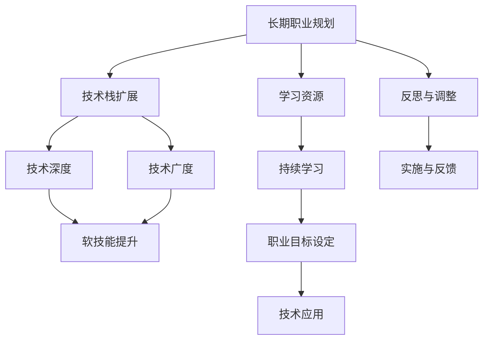

                 

# 程序员如何进行长期职业规划

## 1. 背景介绍

在快速变化的IT领域，程序员的职业路径充满挑战与机遇。技术日新月异，需求不断变化，要想在职业生涯中保持竞争力，良好的长期职业规划至关重要。本文将系统性地探讨如何制定和执行长期职业规划，帮助程序员实现持续成长和职业目标。

## 2. 核心概念与联系

### 2.1 核心概念概述

- **长期职业规划**：指根据个人兴趣、技能、职业目标等，制定出一份长期职业发展路径，指导个人的职业生涯发展。

- **技术栈扩展**：指学习掌握多种编程语言、框架和技术，以适应不同项目和团队的需求。

- **技术深度与广度**：在特定领域内深入研究某一技术或技术栈，同时了解其他相关技术，以形成全面的技术视野。

- **软技能提升**：指提升沟通、团队协作、问题解决等非技术性技能，以适应团队管理和跨部门合作。

- **学习资源**：指线上课程、书籍、会议等，获取最新的技术知识和行业动态。

- **持续学习**：指不断更新知识体系，保持技术前沿，适应不断变化的技术环境和市场需求。

- **职业目标设定**：明确职业发展阶段和目标，如初级开发者、中级工程师、高级工程师等，以及每个阶段的具体要求和里程碑。

这些概念构成了职业规划的框架，帮助我们系统地考虑技术发展、知识储备和职业成长。

### 2.2 核心概念原理和架构的 Mermaid 流程图

## 3. 核心算法原理 & 具体操作步骤

### 3.1 算法原理概述

长期职业规划算法涉及以下几个关键步骤：

1. **需求分析**：评估当前技能水平，确定未来职业目标和所需技能。
2. **目标制定**：根据需求分析结果，制定阶段性学习目标和职业目标。
3. **路径规划**：设计实现目标的技术学习路径。
4. **实施执行**：按计划执行学习路径，积累技术经验。
5. **反馈调整**：定期评估学习进度和效果，调整规划和策略。

### 3.2 算法步骤详解

#### 3.2.1 需求分析

1. **技能评估**：使用自我评估表或第三方评估工具，如GitHub贡献度、开源项目参与度、技术博客发布频率等，量化当前技能水平。
2. **目标设定**：结合行业趋势和个人兴趣，设定短期（1-2年）和长期（3-5年）的职业目标。
3. **技能差距分析**：通过比较目标技能和当前技能，确定需要提升的技能和领域。

#### 3.2.2 目标制定

1. **阶段性目标**：根据技能差距分析，制定分阶段学习目标，如半年内掌握某一编程语言，一年内完成某一框架的深入学习。
2. **关键里程碑**：设定可量化的关键成果，如完成某个项目、获得某个认证或发表一篇技术博客。

#### 3.2.3 路径规划

1. **技术栈选择**：选择符合未来目标的技术栈，如某框架的高级特性、某数据库的操作等。
2. **资源获取**：搜集相关书籍、课程、教程和视频，形成学习资源库。
3. **时间分配**：根据项目和家庭时间，制定合理的学习时间表，如每周5小时学习。

#### 3.2.4 实施执行

1. **持续学习**：按时间表执行学习计划，利用闲暇时间进行自学。
2. **项目实践**：通过实际项目或开源贡献，将所学知识应用到实践中。
3. **定期反思**：定期评估学习效果，总结经验和教训。

#### 3.2.5 反馈调整

1. **评估效果**：定期对学习进度和成果进行评估，对比预期目标。
2. **调整策略**：根据评估结果，调整学习计划和目标。
3. **持续改进**：不断优化学习方法和路径，保持高效学习状态。

### 3.3 算法优缺点

#### 3.3.1 优点

1. **系统性**：长期职业规划通过系统化的分析和规划，有助于全面提升技能。
2. **可执行性**：详细的时间表和目标设定，使得规划易于执行。
3. **灵活性**：根据反馈及时调整规划，保证规划的适应性。
4. **动力增强**：目标导向的学习，提升自我驱动力。

#### 3.3.2 缺点

1. **时间成本**：规划和执行需要大量时间和精力投入。
2. **变动风险**：外部环境变化可能影响规划，需要灵活应对。
3. **资源依赖**：高质量的学习资源和环境是成功实施的必要条件。

### 3.4 算法应用领域

长期职业规划在多个IT领域都具有广泛应用，如：

- **软件开发**：提升编程语言、框架、工具等技能，实现项目管理和团队协作。
- **数据科学**：掌握数据处理、机器学习、大数据技术，实现数据驱动的决策支持。
- **网络安全**：学习安全协议、攻击检测、渗透测试等，确保系统和数据安全。
- **人工智能**：掌握深度学习、自然语言处理、计算机视觉等技术，推动AI创新应用。

## 4. 数学模型和公式 & 详细讲解 & 举例说明

### 4.1 数学模型构建

假设程序员当前的技能水平为 $S_0$，未来目标为 $S_T$。为了达到目标，需要进行一系列的技能提升 $S_1, S_2, \dots, S_{T-1}$。根据技术栈扩展的累积效应，可以将技能提升表示为线性递增关系：

$$ S_i = a \cdot S_{i-1} + b $$

其中 $a$ 为技能提升率，$b$ 为技能提升量，$i=1,2,\dots,T-1$。

### 4.2 公式推导过程

1. **设定初始条件**：
   - 当前技能 $S_0$ 已知。
   - 目标技能 $S_T$ 已知。

2. **确定提升率 $a$**：
   - 通过需求分析确定每阶段所需提升的技能，假设为 $b_i$，则有 $a = \frac{b_i}{b_{i-1}}$。

3. **推导提升量 $b$**：
   - 将 $S_i = a \cdot S_{i-1} + b$ 展开，通过迭代求解得到 $b$。

4. **求解技能提升路径**：
   - 根据公式 $S_i = a \cdot S_{i-1} + b$ 计算每阶段的 $S_i$，得到完整的技能提升路径。

### 4.3 案例分析与讲解

假设某程序员当前技能 $S_0=4$，目标技能 $S_T=10$，技能提升率为 $a=1.2$，每阶段提升量为 $b=2$。则可得：

1. $S_1 = 1.2 \cdot S_0 + 2 = 6.8$
2. $S_2 = 1.2 \cdot S_1 + 2 = 8.96$
3. $S_3 = 1.2 \cdot S_2 + 2 = 10.7344$

通过迭代计算，技能提升路径为 $S_0, S_1, S_2, S_3$。每阶段需要额外提升 $b=2$ 的技能量，通过 $a=1.2$ 的累积效应，最终达到目标 $S_T=10$。

## 5. 项目实践：代码实例和详细解释说明

### 5.1 开发环境搭建

1. **选择编程语言**：如Python，安装相关开发环境，如Anaconda、PyCharm等。
2. **配置版本控制**：如Git，搭建GitHub账号，配置本地仓库和远程仓库。
3. **安装依赖库**：如Pip，安装必要的Python库，如NumPy、Pandas等。

### 5.2 源代码详细实现

1. **需求分析脚本**：编写脚本，评估当前技能，如统计GitHub贡献度、开源项目参与度等。
2. **目标制定脚本**：根据需求分析结果，设定短期和长期目标，如掌握Python语言、完成数据科学项目等。
3. **路径规划脚本**：制定详细的学习计划，包括时间表、学习资源等。
4. **实施执行脚本**：通过脚本定时执行学习计划，如利用cron定时任务。
5. **反馈调整脚本**：定期评估学习进度，根据结果调整学习计划和目标。

### 5.3 代码解读与分析

1. **需求分析脚本**：使用GitHub API获取个人贡献度数据，统计语言使用频次，输出当前技能评估报告。
2. **目标制定脚本**：通过分析市场需求和个人兴趣，设定阶段性目标，生成目标技能列表。
3. **路径规划脚本**：使用Pandas库整理学习资源，制定每周的学习计划和时间表，导出为CSV文件。
4. **实施执行脚本**：使用Python定时任务库Celery，按计划自动执行学习任务，记录学习进度。
5. **反馈调整脚本**：定期收集学习反馈，使用Jupyter Notebook分析学习效果，调整学习策略。

### 5.4 运行结果展示

1. **技能评估报告**：输出当前技能水平，识别技能短板。
2. **目标制定列表**：生成阶段性学习目标，明确提升路径。
3. **学习计划时间表**：展示每周的学习计划，确保任务执行。
4. **学习进度记录**：记录每次学习任务的完成情况，定期评估学习效果。
5. **反馈调整报告**：分析学习进度和效果，提出调整建议。

## 6. 实际应用场景

### 6.1 软件开发

1. **项目需求**：公司需要提升Java编程能力，以应对大规模分布式系统的开发。
2. **技能评估**：当前Java水平为初级，需求为掌握Spring Boot和Docker容器化。
3. **目标设定**：半年内掌握Spring Boot，一年内熟练使用Docker。
4. **路径规划**：每月学习10小时Spring Boot课程，每两周完成一个小项目，使用Docker进行环境部署。
5. **实施执行**：按计划学习课程，完成项目，通过GitHub提交代码，定期在技术博客分享学习心得。
6. **反馈调整**：每月评估项目完成情况，调整学习策略，如增加课程深度或广度。

### 6.2 数据科学

1. **项目需求**：数据团队需要提升Python机器学习能力，以支持实时数据分析和预测模型部署。
2. **技能评估**：当前Python水平为中级，需求为掌握TensorFlow和Scikit-learn。
3. **目标设定**：一年内掌握TensorFlow，两年内完成10个实际项目。
4. **路径规划**：每周学习5小时TensorFlow课程，每季度完成一个小项目，使用Jupyter Notebook进行模型实验。
5. **实施执行**：按计划学习课程，完成项目，通过Kaggle提交代码，定期在技术博客分享学习成果。
6. **反馈调整**：每季度评估项目成果，调整学习策略，如增加实战项目数量或跨领域学习。

### 6.3 网络安全

1. **项目需求**：安全团队需要提升渗透测试能力，以保护公司网络和数据安全。
2. **技能评估**：当前渗透测试水平为初级，需求为掌握Metasploit和Kali Linux。
3. **目标设定**：一年内掌握Metasploit，两年内完成5个实际渗透测试项目。
4. **路径规划**：每月学习10小时Metasploit课程，每周进行一次渗透测试实验，使用Kali Linux进行环境搭建。
5. **实施执行**：按计划学习课程，完成实验，通过GitHub提交代码，定期在技术博客分享实验成果。
6. **反馈调整**：每月评估渗透测试效果，调整学习策略，如增加实验难度或广度。

### 6.4 未来应用展望

未来，长期职业规划将结合更多前沿技术，如AI、区块链、物联网等，形成更加全面和灵活的职业路径。程序员可以通过持续学习，实现跨领域的技能融合和创新应用。

## 7. 工具和资源推荐

### 7.1 学习资源推荐

1. **Coursera**：提供大量计算机科学和技术相关课程，包括编程语言、数据科学、人工智能等。
2. **Udacity**：提供实用编程和人工智能项目，通过实践项目掌握实际技能。
3. **edX**：提供全球知名大学课程，涵盖计算机科学和软件工程等方向。
4. **GitHub**：提供丰富的开源项目和社区，促进技术交流和学习。
5. **Stack Overflow**：提供丰富的技术问答，解决实际编程问题。

### 7.2 开发工具推荐

1. **PyCharm**：强大的Python IDE，提供代码调试、版本控制、代码自动补全等功能。
2. **Visual Studio Code**：轻量级、功能强大的文本编辑器，支持多种编程语言和扩展。
3. **Docker**：容器化平台，方便跨环境部署和管理应用程序。
4. **Jupyter Notebook**：交互式Python编程环境，支持数据可视化、模型实验等。
5. **Git**：版本控制系统，方便代码协作和管理。

### 7.3 相关论文推荐

1. **《代码质量评估和改进研究综述》**：讨论如何通过代码审查和测试，提升软件开发质量。
2. **《软件工程演进：从理论到实践》**：探讨软件工程理论和实践的演变，提供技术管理和软件开发指导。
3. **《敏捷软件开发实践》**：介绍敏捷开发方法论和实践，提升团队协作和项目管理效率。
4. **《数据科学与机器学习》**：提供数据科学和机器学习的基础理论和实践指南，涵盖数据处理、模型构建、应用场景等。
5. **《人工智能：现状与未来》**：综述人工智能领域的最新进展，提供前沿技术和发展趋势。

## 8. 总结：未来发展趋势与挑战

### 8.1 研究成果总结

长期职业规划技术经过多年的发展和实践，已经形成了一套相对成熟的理论和方法。通过需求分析、目标制定、路径规划、实施执行和反馈调整，程序员能够系统性地提升自己的技能水平，实现职业生涯的持续成长。

### 8.2 未来发展趋势

1. **技术栈多样化**：未来的职业规划将更加注重技术栈的多样化，提升跨领域技能，适应行业变化。
2. **技能深度与广度并重**：在特定领域内深入研究，同时了解其他相关技术，形成全面的技术视野。
3. **持续学习和自我驱动**：终身学习成为常态，通过在线课程、项目实践等方式，不断提升技能水平。
4. **自动化和智能化**：利用AI技术进行技能评估和路径规划，提高职业规划的效率和准确性。

### 8.3 面临的挑战

1. **时间和精力**：制定和执行职业规划需要大量时间和精力投入，需要平衡工作和生活。
2. **技术变革快速**：技术环境变化快，需要不断调整学习策略，跟上技术发展的步伐。
3. **资源获取**：高质量的学习资源和环境是成功实施的必要条件，需要投入时间和成本获取。
4. **反馈机制**：有效的反馈机制和调整策略，确保职业规划的有效性和灵活性。

### 8.4 研究展望

未来，长期职业规划技术将在以下几个方向进行深入研究：

1. **个性化职业规划**：通过AI技术，提供个性化的职业规划建议，根据个人兴趣和能力定制学习路径。
2. **跨领域技能整合**：结合不同领域的技术和知识，形成更全面、实用的技能组合。
3. **智能学习系统**：利用AI技术进行自我评估和规划，提供智能化的学习建议和资源推荐。
4. **自动化学习工具**：开发自动化学习工具，自动跟踪学习进度和效果，生成详细的学习报告。

总之，长期职业规划是程序员实现职业发展和技能提升的重要手段。通过系统化的规划和执行，程序员能够更好地适应技术变革，实现持续成长和职业目标。希望本文能够为你提供有用的指导，助你在职业生涯中不断前进，实现更高的职业成就。

## 9. 附录：常见问题与解答

**Q1：如何制定合理的职业规划？**

A: 制定合理的职业规划需要遵循SMART原则：Specific（具体）、Measurable（可衡量）、Achievable（可实现）、Relevant（相关性）、Time-bound（时限性）。首先明确职业目标，然后根据目标设定可量化的阶段性目标，制定详细的学习路径和时间表。

**Q2：学习过程中如何保持动力？**

A: 保持学习动力的关键在于设定具有挑战性和可行性的目标，通过不断实现小目标获得成就感。同时，加入技术社区和同行交流，分享学习心得，也能增强学习动力。

**Q3：如何平衡工作和学习？**

A: 合理安排时间，优先处理重要任务，利用闲暇时间进行学习。可以通过番茄工作法、时间块管理等方法提高效率，确保工作和学习的高效结合。

**Q4：遇到困难时如何调整学习计划？**

A: 遇到困难时，及时进行自我反思和评估，分析问题原因，调整学习策略。可以寻求导师或同事的意见，参加培训或线上课程，提升解决问题的能力。

**Q5：如何保持技术前沿？**

A: 通过订阅技术博客、参加技术会议、加入开源社区等方式，获取最新的技术资讯和趋势。定期进行知识更新和技能提升，保持技术的前沿性和实用性。

通过本文的系统梳理，希望能为你提供有用的指导，助你在职业生涯中不断前进，实现更高的职业成就。

---

作者：禅与计算机程序设计艺术 / Zen and the Art of Computer Programming

