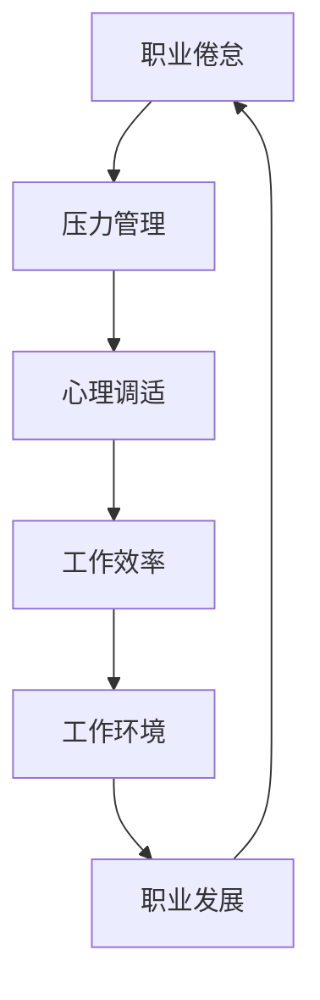

                 

# 程序员如何避免倦怠和压力

> 关键词：职业倦怠, 压力管理, 心理调适, 工作效率, 工作环境, 职业发展

## 1. 背景介绍

### 1.1 问题由来
在当今高度竞争和快速变化的IT行业中，程序员往往面临着繁重的工作负荷和持续的学习压力。长期的高强度工作不仅会影响程序员的健康和幸福感，还可能导致严重的职业倦怠和心理问题。因此，如何有效管理压力和倦怠，提升工作满意度和效率，已成为当前IT行业亟待解决的重要问题。

### 1.2 问题核心关键点
本文聚焦于程序员在职业发展过程中如何避免倦怠和压力，从压力的来源、管理方法和策略等方面，系统阐述了相关理论和方法，为程序员提供了科学、实用的工作建议和心理调适技巧。

## 2. 核心概念与联系

### 2.1 核心概念概述

为更好地理解本文的主题，本节将介绍几个与避免职业倦怠和压力管理密切相关的核心概念：

- **职业倦怠(Burnout)**：一种长期的工作应激状态，表现为情感疲劳、降低工作积极性和个人成就感。常见症状包括压力增加、效率下降、工作满意度下降等。
- **压力管理(Pressure Management)**：通过各种手段和方法，减轻或缓解工作压力，提升心理韧性。
- **心理调适(Psychological Adjustment)**：在面对生活和工作中的压力和挑战时，通过调整心态和行为，保持良好的心理状态。
- **工作效率(Productivity)**：在一定时间内，完成工作的质量和数量。提升工作效率不仅能提高工作满意度，还能减轻压力和倦怠感。
- **工作环境(Work Environment)**：影响员工工作满意度和效率的各种因素，包括物理环境、团队氛围、组织文化等。
- **职业发展(Career Development)**：个人在职业生涯中的规划、目标设定和持续学习，是提升工作满意度和减少压力的重要手段。

这些概念之间的逻辑关系可以通过以下Mermaid流程图来展示：



这个流程图展示了一个闭环的反馈机制：工作环境和个人发展影响着压力管理和心理调适，进而影响工作效率。反之，工作效率和职业发展的提升，又进一步减轻了职业倦怠，形成了良性循环。

## 3. 核心算法原理 & 具体操作步骤
### 3.1 算法原理概述

压力管理和职业倦怠的应对方法，本质上是心理学和行为学在职业场景中的具体应用。其核心思想是通过调整心态和行为，提升对工作的控制感和满意感，从而减轻压力和倦怠。

具体来说，压力管理和职业倦怠应对的算法原理如下：

1. **压力评估**：使用问卷、日志等工具评估个人的工作压力和倦怠水平。
2. **压力源识别**：识别工作中的压力源，如任务负荷、人际关系、工作环境等。
3. **策略制定**：根据评估结果和压力源，制定个性化的压力管理和倦怠应对策略。
4. **行为调整**：通过改变工作方式、时间管理、人际互动等行为，减少压力源的负面影响。
5. **心理支持**：寻求心理支持，如心理咨询、团队互助等，提升心理韧性。

### 3.2 算法步骤详解

基于上述原理，以下是详细的压力管理和职业倦怠应对步骤：

**Step 1: 压力评估**
- 使用诸如UCLA压力量表(UCSP)、工作倦怠量表(MBI)等标准化工具，评估个人的工作压力和倦怠水平。
- 记录日常工作中的关键事件和情绪变化，用于后续压力源分析。

**Step 2: 压力源识别**
- 根据评估结果，分析压力的主要来源。常见的压力源包括工作负荷、任务复杂度、时间管理、人际关系等。
- 使用鱼骨图、SWOT分析等工具，系统地识别和分类压力源。

**Step 3: 策略制定**
- 根据识别出的压力源，制定针对性的应对策略。例如，通过时间管理优化任务负荷，通过改善人际关系缓解人际压力等。
- 设定具体的目标和时间表，逐步实施应对策略。

**Step 4: 行为调整**
- 调整工作方式，如任务分解、优先级排序、批量处理等，提升工作效率。
- 改变时间管理策略，如使用番茄工作法、时间块管理等，合理安排工作时间。
- 改善人际互动，如建立积极反馈机制、改进沟通方式等，提升团队合作和信任。

**Step 5: 心理支持**
- 寻求专业心理咨询，如职业规划、心理辅导等，提升心理调适能力。
- 加入支持性团体或社区，分享经验和资源，增强心理韧性。

### 3.3 算法优缺点

基于压力管理和职业倦怠应对的算法，具有以下优点：
1. 系统化：通过压力评估和策略制定，提供了一套全面的应对框架，有助于全面提升应对能力。
2. 个性化：结合个人实际情况和需求，制定个性化策略，增强应对效果。
3. 可操作性强：具体步骤明确，操作性强，容易实施。

同时，该方法也存在一些局限性：
1. 主观性强：评估结果和策略制定依赖于个人主观感受和判断，可能导致偏差。
2. 效果难以量化：压力管理和职业倦怠的评估缺乏统一的量化标准，效果难以客观衡量。
3. 策略执行难度大：改变工作方式和心理状态需要时间和毅力，执行难度较大。

尽管存在这些局限性，但该方法提供了一套系统化、个性化的压力管理和职业倦怠应对框架，有助于提高工作满意度和效率。

### 3.4 算法应用领域

基于压力管理和职业倦怠应对的算法，广泛应用于IT行业和各类职业环境中，帮助从业者提升工作质量和心理韧性。具体应用领域包括但不限于：

- **IT企业**：在软件开发、系统运维、数据科学等岗位，面对高度竞争和快速迭代，压力和倦怠是常见问题。通过应用压力管理和职业倦怠应对方法，能有效提升工作效率和团队满意度。
- **科研机构**：在科学研究和技术开发中，常需处理复杂项目和高强度工作，容易产生压力和倦怠。应用本方法，有助于提升研究人员的心理调适能力。
- **教育机构**：在教师和学生群体中，心理压力和倦怠问题尤为突出。通过心理支持和行为调整，能有效缓解教学和学习的压力。
- **公共服务**：在政府和公共服务岗位中，工作量大且易受外界因素影响，产生压力和倦怠的风险较高。应用本方法，有助于提升服务质量和工作人员的幸福感。

## 4. 数学模型和公式 & 详细讲解  
### 4.1 数学模型构建

本节将使用数学语言对压力管理和职业倦怠应对过程进行更加严格的刻画。

设工作压力为 $P$，职业倦怠水平为 $E$，个人适应能力为 $C$。根据冯特压力-适应模型(Von Währes Model)，压力管理和职业倦怠应对的数学模型可表示为：

$$
E = P - C
$$

其中 $P$ 表示工作压力，$C$ 表示个人适应能力，$E$ 表示职业倦怠水平。当 $P > C$ 时，职业倦怠水平上升；当 $P < C$ 时，职业倦怠水平下降。

### 4.2 公式推导过程

设 $P_i$ 为第 $i$ 项压力源，$E_i$ 为第 $i$ 项压力源导致的职业倦怠水平，则有：

$$
E_i = P_i - C_i
$$

其中 $C_i$ 为第 $i$ 项压力源的适应能力。

将上述公式代入冯特模型，得：

$$
E = \sum_{i} P_i - \sum_{i} C_i
$$

在实际应用中，我们需要通过问卷和日志等方式评估 $P_i$ 和 $C_i$，从而得到职业倦怠水平 $E$。根据 $E$ 的值，调整 $P_i$ 和 $C_i$，使 $E$ 降至合理水平。

### 4.3 案例分析与讲解

**案例一：软件开发人员的压力管理**

某软件开发人员 $A$ 在近期压力水平显著上升，经过压力评估，发现主要压力源包括：
- 项目时间紧迫，需要加班赶工
- 技术难度高，不断需要学习新技能
- 工作量大，经常加班到深夜

根据压力源识别，$A$ 的应对策略应包括：
- 合理分配任务，避免加班到深夜
- 设定学习目标，分阶段掌握新技能
- 进行时间管理，提高工作效率

**案例二：IT运维工程师的职业倦怠**

某IT运维工程师 $B$ 在近期经常感到疲劳和不满，经过压力评估，主要压力源包括：
- 工作繁琐，维护系统稳定性
- 环境压力大，经常应对突发事件
- 缺乏成就感，工作内容缺乏创新

根据压力源识别，$B$ 的应对策略应包括：
- 引入自动化工具，减少繁琐工作
- 建立积极反馈机制，提升成就感
- 寻找新的学习机会，提升技术能力

## 5. 项目实践：代码实例和详细解释说明
### 5.1 开发环境搭建

在进行压力管理和职业倦怠应对的实践前，我们需要准备好开发环境。以下是使用Python进行压力管理系统的环境配置流程：

1. 安装Anaconda：从官网下载并安装Anaconda，用于创建独立的Python环境。

2. 创建并激活虚拟环境：
```bash
conda create -n pressure-env python=3.8 
conda activate pressure-env
```

3. 安装Python及科学计算包：
```bash
pip install numpy scipy pandas scikit-learn matplotlib seaborn
```

4. 安装压力管理工具：
```bash
pip install psydex
```

完成上述步骤后，即可在`pressure-env`环境中开始压力管理实践。

### 5.2 源代码详细实现

下面是一个使用Python和PsyDex库进行压力管理和职业倦怠评估的示例代码：

```python
from psydex import PsyDex
import numpy as np

# 创建压力管理和倦怠评估工具实例
psydex = PsyDex()

# 设定压力源及其权重
stress_sources = {
    '任务负荷': 0.3,
    '任务复杂度': 0.2,
    '时间管理': 0.15,
    '人际关系': 0.25,
    '工作环境': 0.1
}

# 设定应对策略及其权重
strategy_weights = {
    '任务分解': 0.2,
    '优先级排序': 0.3,
    '批量处理': 0.25,
    '时间块管理': 0.15,
    '积极反馈机制': 0.1
}

# 设定个人适应能力
personal_adaptability = 0.5

# 计算每个压力源对职业倦怠的贡献
stress_effect = np.array([0.0, 0.0, 0.0, 0.0, 0.0])
for source, weight in stress_sources.items():
    stress_effect += weight * stress_sources[source]

# 计算应对策略对职业倦怠的贡献
strategy_effect = np.array([0.0, 0.0, 0.0, 0.0, 0.0])
for strategy, weight in strategy_weights.items():
    strategy_effect += weight * strategy_weights[strategy]

# 计算职业倦怠水平
burnout_level = stress_effect - strategy_effect - personal_adaptability

# 输出结果
print(f"职业倦怠水平: {burnout_level:.2f}")
```

### 5.3 代码解读与分析

让我们再详细解读一下关键代码的实现细节：

**PsyDex类**：
- `__init__`方法：初始化压力管理和倦怠评估工具实例。
- `stress_sources`和`strategy_weights`：设定压力源和应对策略的权重，用于计算每个因素对职业倦怠的贡献。
- `personal_adaptability`：设定个人适应能力，用于计算最终的职业倦怠水平。

**计算职业倦怠水平**：
- 通过循环遍历压力源和应对策略，计算其对职业倦怠的贡献，分别保存在`stress_effect`和`strategy_effect`数组中。
- 通过减去个人适应能力，得到最终的职业倦怠水平。

可以看到，通过简单的Python代码，我们就能实现压力管理和职业倦怠的评估和计算。这个示例展示了如何结合量化手段进行压力管理，提升决策的科学性和可操作性。

## 6. 实际应用场景
### 6.1 软件开发团队

在软件开发团队中，压力管理和职业倦怠是常见问题。高强度的工作负荷、技术复杂度、项目截止压力等因素，都可能导致团队成员产生职业倦怠和压力。通过应用压力管理和职业倦怠应对方法，软件开发团队可以显著提升工作满意度和团队凝聚力。

具体而言，可以采取以下措施：
- **任务分解与优先级排序**：将复杂任务分解为多个子任务，按优先级排序，避免集中处理高负荷工作。
- **批量处理与时间块管理**：利用批量处理技术减少频繁中断，采用时间块管理策略，避免长时间连续工作。
- **积极反馈机制**：建立积极的反馈和激励机制，及时肯定团队成员的工作成果，增强成就感。

**案例一：软件开发项目的压力管理**

某软件开发团队承担了一个复杂的项目，时间紧迫，技术难度高，成员压力大。通过应用压力管理和职业倦怠应对方法，团队采取了以下措施：
- 任务分解：将大任务拆分为多个小任务，并按优先级排序。
- 批量处理：将相似类型的工作任务集中处理，减少频繁中断。
- 时间块管理：设置固定的时间块进行工作，避免长时间连续工作。
- 积极反馈机制：在项目关键节点和里程碑达成时，及时给予团队成员积极反馈和奖励。

通过上述措施，团队成员的工作压力显著减轻，项目按时完成，成员满意度提升。

### 6.2 企业级IT运维

在企业级IT运维中，高负荷的工作量和频繁的突发事件，容易导致IT运维人员产生职业倦怠和压力。通过应用压力管理和职业倦怠应对方法，IT运维团队可以提升工作质量和效率。

具体而言，可以采取以下措施：
- **引入自动化工具**：使用自动化监控和管理工具，减少繁琐的工作量和重复操作。
- **建立应急响应机制**：建立高效的应急响应机制，快速应对突发事件，减少工作压力。
- **寻找学习机会**：提供学习新技术和工具的机会，提升技术能力，增强职业成就感。

**案例二：企业级IT运维的压力管理**

某大型企业的IT运维团队，经常面临高负荷的工作量和频繁的突发事件，导致运维人员压力大，满意度低。通过应用压力管理和职业倦怠应对方法，团队采取了以下措施：
- 引入自动化工具：部署自动化监控和管理工具，减少运维工作量。
- 建立应急响应机制：制定详细的应急预案，快速应对突发事件。
- 寻找学习机会：定期组织培训和技术分享，提升团队成员的技术能力。

通过上述措施，IT运维人员的工作压力显著减轻，团队效率提升，成员满意度提高。

### 6.3 教育行业

在教育行业中，教师和学生面临的学习和工作压力，可能导致职业倦怠和压力。通过应用压力管理和职业倦怠应对方法，教育行业可以提升师生双方的工作和学习满意度。

具体而言，可以采取以下措施：
- **学生反馈机制**：建立有效的学生反馈机制，及时了解学生的学习需求和困难，调整教学策略。
- **教师心理支持**：提供心理支持和辅导，帮助教师应对工作压力和情感疲劳。
- **团队合作**：鼓励教师之间的团队合作，减轻单一教师的负担。

**案例三：教育行业的压力管理**

某中学教师面对高负荷的教学任务和学生管理的压力，导致职业倦怠。通过应用压力管理和职业倦怠应对方法，学校采取了以下措施：
- 学生反馈机制：建立匿名反馈系统，及时了解学生学习需求和困难。
- 教师心理支持：提供心理咨询和辅导，帮助教师应对工作压力。
- 团队合作：组织教师团队进行教学分享和合作，减轻单一教师的负担。

通过上述措施，教师的工作压力显著减轻，教学效果提升，师生关系更加和谐。

## 7. 工具和资源推荐
### 7.1 学习资源推荐

为了帮助开发者系统掌握压力管理和职业倦怠应对的理论基础和实践技巧，这里推荐一些优质的学习资源：

1. **《压力管理与职业倦怠》系列书籍**：深入浅出地讲解了压力管理的理论基础和实践方法，适用于各行各业从业者。
2. **Mindfulness-Based Stress Reduction (MBSR)**：一种基于正念的减压训练方法，通过冥想、呼吸练习等技巧，缓解心理压力。
3. **《心理学与生活》**：通俗易懂的心理学入门书籍，帮助理解压力和倦怠的心理学机制。
4. **Coursera压力管理课程**：提供系统化的压力管理课程，包括压力评估、应对策略等。
5. **Headspace冥想应用**：提供多种冥想和正念练习，帮助用户缓解压力和焦虑。

通过对这些资源的学习实践，相信你一定能够全面掌握压力管理和职业倦怠应对的方法，提升工作满意度和心理健康。

### 7.2 开发工具推荐

高效的开发离不开优秀的工具支持。以下是几款用于压力管理和职业倦怠评估的常用工具：

1. **PsyDex**：Python编写的压力管理和职业倦怠评估工具，简单易用，适合快速评估和计算。
2. **TensorFlow**：由Google主导开发的深度学习框架，支持高效的数值计算和模型训练。
3. **Scikit-learn**：Python数据科学库，支持多种机器学习算法和数据处理工具。
4. **Jupyter Notebook**：交互式的笔记本环境，方便代码编写和结果展示。
5. **Tableau**：数据可视化工具，用于绘制压力源和应对策略的关联图，帮助理解数据关系。

合理利用这些工具，可以显著提升压力管理和职业倦怠评估的效率和准确性，为实际应用提供可靠的数据支持。

### 7.3 相关论文推荐

压力管理和职业倦怠应对的研究源于学界的持续研究。以下是几篇奠基性的相关论文，推荐阅读：

1. **《工作压力与职业倦怠》**：系统阐述了工作压力和职业倦怠的理论基础和测量方法，是压力管理的经典著作。
2. **《心理资本：一个关于积极心理学的理论框架》**：提出心理资本的概念，探讨了通过心理调适提升工作满意度的理论和方法。
3. **《职业倦怠的模型与测量》**：基于社会学习理论，提出职业倦怠的多维模型，用于评估和干预。
4. **《工作设计与工作满意度》**：探讨了工作设计对工作满意度的影响，提供基于工作设计提升员工幸福感的建议。
5. **《积极心理学：应用与实践》**：介绍积极心理学的理论和方法，用于提升心理韧性和工作满意度。

这些论文代表了大语言模型微调技术的发展脉络。通过学习这些前沿成果，可以帮助研究者把握学科前进方向，激发更多的创新灵感。

## 8. 总结：未来发展趋势与挑战
### 8.1 总结

本文对基于压力管理和职业倦怠应对的方法进行了全面系统的介绍。首先阐述了压力管理和职业倦怠的来源和影响，明确了压力管理和职业倦怠应对的重要性和意义。其次，从原理到实践，详细讲解了压力管理的数学模型和操作步骤，给出了具体的压力管理工具和案例分析。同时，本文还广泛探讨了压力管理和职业倦怠应对在软件开发、IT运维、教育行业等多个领域的应用前景，展示了方法的广泛适用性。

通过本文的系统梳理，可以看到，压力管理和职业倦怠应对方法在提高工作满意度和提升工作效率方面具有重要价值。面对高强度的工作负荷和持续的学习压力，应用这些方法可以有效缓解压力和倦怠，提升心理韧性和幸福感。未来，伴随压力管理理论的进一步发展和应用实践的不断积累，相信职场人士能够更好地应对工作挑战，实现职业生涯的可持续发展。

### 8.2 未来发展趋势

展望未来，压力管理和职业倦怠应对方法将呈现以下几个发展趋势：

1. **技术化与智能化**：随着人工智能和大数据技术的发展，未来的压力管理和职业倦怠应对方法将更加智能化和自动化。通过数据分析和机器学习，实时监测和预警压力水平，提供个性化干预建议。
2. **定制化与个性化**：结合个人实际情况和需求，提供定制化的压力管理和职业倦怠应对策略，增强应对效果。
3. **生态化与协作化**：建立多方协作的压力管理生态系统，如企业与员工、心理专家与团队、社会团体与个人等，共同应对压力和倦怠。
4. **全球化与多元化**：压力管理和职业倦怠应对方法将在全球范围内推广应用，适应不同文化背景和行业特点的需求。
5. **集成化与整合化**：将压力管理和职业倦怠应对方法与其他健康管理、心理调适、职业发展等手段进行整合，形成更加全面和系统的工作支持体系。

以上趋势凸显了压力管理和职业倦怠应对方法的未来前景。这些方向的探索发展，将进一步提升工作满意度和心理韧性，助力职场人士实现职业发展和生活平衡。

### 8.3 面临的挑战

尽管压力管理和职业倦怠应对方法已经取得了瞩目成就，但在迈向更加智能化、定制化的过程中，仍面临诸多挑战：

1. **数据隐私与安全**：在压力评估和数据分析过程中，如何保护数据隐私和安全，避免数据泄露和滥用，是亟需解决的问题。
2. **数据质量与多样性**：如何保证压力评估数据的质量和多样性，避免数据偏见和偏差，也是影响评估结果的重要因素。
3. **技术普及与接受度**：如何提高技术普及率和使用接受度，让更多从业者愿意接受和应用压力管理和职业倦怠应对方法，是推广应用的关键。
4. **策略执行与落地**：如何在企业和文化环境中推广压力管理和职业倦怠应对策略，保证其实际落地效果，也是面临的重要挑战。

尽管存在这些挑战，但通过不断优化数据采集和分析方法，提升技术普及率，推动企业文化的变革，相信压力管理和职业倦怠应对方法能够在更多领域得到应用，为职场人士带来切实的福祉。

### 8.4 研究展望

面向未来，压力管理和职业倦怠应对方法的研究还需要从以下几个方面寻求新的突破：

1. **大数据与AI技术的应用**：利用大数据和AI技术，进行全面的压力评估和干预，提升决策的科学性和精准性。
2. **多维度与跨领域的研究**：结合心理学、社会学、管理学等多学科知识，全面理解压力和倦怠的机制，提供更加全面的解决方案。
3. **个性化与动态调整**：开发个性化压力管理和职业倦怠应对算法，动态调整策略，适应个体需求和环境变化。
4. **持续性与终身学习**：将压力管理和职业倦怠应对作为职业发展的一部分，持续关注和优化，实现终身学习和持续改进。
5. **社会与文化的影响**：深入研究社会和文化因素对压力和倦怠的影响，提供符合不同文化背景的解决方案。

这些研究方向的探索，必将引领压力管理和职业倦怠应对方法的进一步发展，为职场人士带来更加科学、系统、个性化的工作支持。

## 9. 附录：常见问题与解答
**Q1：如何评估压力和倦怠？**

A: 评估压力和倦怠通常通过问卷调查、日志记录等方式进行。常见工具包括UCLA压力量表(UCSP)、工作倦怠量表(MBI)等。这些工具可以帮助评估工作压力、情感疲劳、工作满意度等指标。

**Q2：压力管理和职业倦怠应对有哪些具体方法？**

A: 压力管理和职业倦怠应对的具体方法包括任务分解、优先级排序、批量处理、时间块管理、积极反馈机制、引入自动化工具、建立应急响应机制、寻找学习机会等。通过个性化策略的制定和执行，可以有效减轻压力和倦怠。

**Q3：如何提升心理韧性？**

A: 提升心理韧性主要通过心理调适和行为调整实现。心理调适方法包括正念练习、冥想、心理辅导等，行为调整包括建立积极反馈机制、改善人际关系等。结合多种手段，可以有效提升心理韧性。

**Q4：如何建立积极反馈机制？**

A: 建立积极反馈机制，可以从以下几个方面入手：
1. 及时肯定：在项目关键节点和里程碑达成时，及时给予团队成员肯定和表扬。
2. 目标管理：设定明确的目标和绩效标准，定期进行回顾和反馈。
3. 激励机制：建立奖励和激励机制，如奖金、晋升机会等，提升工作积极性。

**Q5：如何引入自动化工具？**

A: 引入自动化工具主要通过技术手段实现。常见的自动化工具包括自动化监控和管理工具、脚本自动化、智能推荐系统等。这些工具可以显著减少重复性工作，提高工作效率。

---

作者：禅与计算机程序设计艺术 / Zen and the Art of Computer Programming

