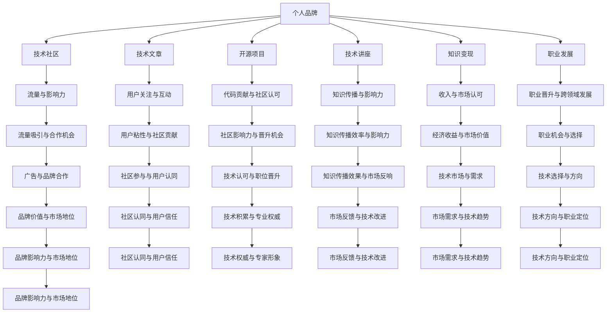

                 

## 1. 背景介绍

### 1.1 问题由来
在数字时代，程序员的个人品牌塑造与知识付费已经成为技术行业的热门话题。随着互联网和移动互联网的快速发展，个人品牌塑造的重要性日益凸显，成为了程序员职业发展的重要组成部分。同时，知识付费的兴起也为程序员提供了新的发展机会，使知识成为可以变现的资产。本文将从背景出发，探讨程序员如何通过塑造个人品牌和参与知识付费，提升自身影响力，实现个人价值的最大化。

### 1.2 问题核心关键点
本文将重点探讨以下核心问题：
- 程序员如何建立和维护个人品牌？
- 知识付费的模式有哪些？
- 程序员参与知识付费的策略和方法？
- 个人品牌塑造与知识付费对技术行业的深远影响。

## 2. 核心概念与联系

### 2.1 核心概念概述

为了更好地理解本文的核心内容，我们首先概述以下几个关键概念：

- **个人品牌**：指个人在社会和经济活动中形成的独特形象和声誉，代表个人的价值和能力。
- **知识付费**：指通过付费方式获取知识或信息的服务模式，用户为获取有价值的知识内容而支付费用。
- **程序员职业发展**：指程序员在技术行业中的职业成长，包括技能提升、职位晋升、跨领域发展等方面。
- **技术社区**：指技术爱好者和专业人士聚集的在线社区，如Stack Overflow、GitHub等，提供交流、学习和合作的平台。
- **内容创作者**：指在技术社区或平台上发布原创技术文章、教程、项目等内容的个人或团队。
- **知识变现**：指将知识转化为经济收益的过程，通过书籍出版、在线课程、技术咨询等方式实现。

这些概念构成了程序员个人品牌塑造与知识付费的基础框架，它们之间的关系可以通过以下Mermaid流程图表示：



这个流程图展示了个人品牌塑造与知识付费在技术社区和技术文章、开源项目、技术讲座、知识变现、职业发展等环节中的相互关系。通过这些关系，我们可以看到个人品牌塑造与知识付费对技术行业的影响力和重要性。

## 3. 核心算法原理 & 具体操作步骤

### 3.1 算法原理概述

个人品牌塑造与知识付费涉及的算法原理主要包括：

- **社交网络分析（Social Network Analysis, SNA）**：通过分析个人在技术社区中的关系网络，评估其影响力。
- **内容推荐算法**：根据用户的兴趣和行为，推荐符合其需求的技术文章、课程、讲座等。
- **搜索引擎优化（Search Engine Optimization, SEO）**：通过优化技术博客或文章的内容，提高其搜索引擎排名，增加曝光率。
- **机器学习**：使用聚类、分类、关联规则等算法，分析和预测技术趋势和市场需求。
- **自然语言处理（Natural Language Processing, NLP）**：通过文本分析和情感分析，了解用户的反馈和需求。

### 3.2 算法步骤详解

#### 3.2.1 个人品牌塑造步骤

1. **定位明确**：
   - 确定自己的技术专长和职业方向，如前端开发、后端开发、人工智能、数据科学等。
   - 分析目标受众，了解他们的需求和兴趣点。

2. **建立内容**：
   - 在技术社区（如GitHub、Stack Overflow）创建个人或团队账号，发布技术文章、教程、项目等。
   - 定期更新内容，保持活跃度，增加社区的关注和互动。

3. **互动交流**：
   - 积极参与技术讨论和问答，解决他人的技术问题，建立专业形象。
   - 关注和评论其他技术文章或项目，增加曝光率。

4. **品牌推广**：
   - 在社交媒体（如LinkedIn、Twitter）上分享技术文章和项目，扩大影响力。
   - 参加技术会议和活动，与业内人士交流，增加品牌曝光。

#### 3.2.2 知识付费步骤

1. **内容创作**：
   - 制作高质量的在线课程、技术文章、视频教程等，涵盖从基础到高级的技术知识。
   - 根据市场需求和趋势，不断更新和完善内容，保持内容的竞争力。

2. **平台选择**：
   - 选择适合的平台，如Coursera、Udemy、网易云课堂等。
   - 分析不同平台的特点和用户群体，选择最适合的知识付费渠道。

3. **定价策略**：
   - 根据内容价值、市场调研和竞争对手定价，设置合理的课程价格。
   - 采用灵活的定价策略，如按课程难度或内容深度定价。

4. **推广与营销**：
   - 利用社交媒体、邮件营销、SEO优化等手段，推广课程和文章。
   - 与技术社区合作，通过广告和合作推广内容。

#### 3.2.3 具体操作示例

**示例1：个人品牌塑造**

```python
import networkx as nx
import matplotlib.pyplot as plt

# 创建一个无向图
G = nx.Graph()

# 添加节点
G.add_node('Alice')
G.add_node('Bob')
G.add_node('Charlie')
G.add_node('David')

# 添加边
G.add_edge('Alice', 'Bob')
G.add_edge('Alice', 'Charlie')
G.add_edge('Bob', 'Charlie')
G.add_edge('Charlie', 'David')

# 计算影响力
influence = nx.current_flow(G, {'Alice': 1, 'Bob': 0, 'Charlie': 0, 'David': 0})

# 绘制网络图
nx.draw(G, with_labels=True)
plt.show()

# 输出影响力
print("Influence:", influence)
```

**示例2：知识付费操作**

```python
import pandas as pd
from sklearn.cluster import KMeans

# 读取数据
data = pd.read_csv('course_sales.csv')

# 数据预处理
data = data.dropna()

# 特征工程
X = data[['price', 'rating', 'duration']]

# 聚类分析
kmeans = KMeans(n_clusters=3)
kmeans.fit(X)

# 输出聚类结果
print("Clusters:", kmeans.labels_)
```

### 3.3 算法优缺点

个人品牌塑造与知识付费算法的主要优点包括：

- **效率高**：通过机器学习和数据分析，可以快速了解市场需求和技术趋势，优化内容创作和推广策略。
- **精准度高**：通过用户行为分析，推荐符合其兴趣的内容，提高用户满意度和粘性。
- **成本低**：利用社交媒体和网络平台进行推广，节省了传统广告的高昂成本。

主要缺点包括：

- **数据隐私问题**：获取和分析用户数据可能涉及隐私问题，需严格遵守相关法律法规。
- **算法偏见**：机器学习模型可能存在算法偏见，导致内容推荐不公正或不准确。
- **用户互动不足**：算法推荐虽然精准，但可能忽略了用户互动的重要性和多样性。

### 3.4 算法应用领域

个人品牌塑造与知识付费在技术社区、在线课程、技术博客、开源项目等领域都有广泛应用。以下是几个具体应用场景：

- **技术博客**：在Medium、CSDN等平台发布技术文章，吸引读者关注和互动，提高影响力。
- **开源项目**：在GitHub上发布高质量的开源项目，与社区互动，提升个人品牌。
- **在线课程**：在Coursera、Udemy等平台制作和销售在线课程，获取经济收益。
- **技术讲座**：在Meetup、技术社区举办技术讲座，扩大影响力。
- **技术咨询**：通过技术博客和社交媒体提供技术咨询，积累客户资源。

## 4. 数学模型和公式 & 详细讲解  
### 4.1 数学模型构建

本文涉及的数学模型主要包括：

- **社交网络分析模型**：通过PageRank算法评估个人在技术社区中的影响力。
- **内容推荐模型**：使用协同过滤算法推荐符合用户需求的内容。
- **搜索引擎优化模型**：使用TF-IDF算法优化技术文章的内容，提高搜索引擎排名。

### 4.2 公式推导过程

#### 4.2.1 社交网络分析模型

PageRank算法公式为：

$$
P_i = \frac{1}{c} \sum_{j \in N_i} P_j \cdot A_{j,i}
$$

其中，$P_i$ 表示节点$i$的影响力，$N_i$ 表示与节点$i$连接的节点集合，$A_{j,i}$ 表示节点$i$和节点$j$之间的连接权重。

#### 4.2.2 内容推荐模型

协同过滤算法公式为：

$$
R_{ui} = \sum_{v \in U} P_{uv} \cdot R_{vi}
$$

其中，$R_{ui}$ 表示用户$u$对物品$i$的评分，$U$ 表示物品的集合，$P_{uv}$ 表示物品$u$和物品$v$之间的相似度，$R_{vi}$ 表示用户$v$对物品$i$的评分。

#### 4.2.3 搜索引擎优化模型

TF-IDF公式为：

$$
TF_{ti} = \frac{n_{ti}}{\sum_{j=1}^N n_{tj}}
$$

$$
IDF_{ti} = \log \frac{N}{\sum_{j=1}^N \mathbb{I}(T_{tj} = i)}
$$

$$
TF-IDF_{ti} = TF_{ti} \cdot IDF_{ti}
$$

其中，$TF_{ti}$ 表示术语$t$在文档$i$中的词频，$IDF_{ti}$ 表示术语$t$在所有文档中的逆文档频率，$TF-IDF_{ti}$ 表示术语$t$的TF-IDF值。

### 4.3 案例分析与讲解

**案例1：社交网络分析**

Alice和Bob在技术社区中互动频繁，Alice发布的技术文章获得了较高的阅读量和评论，Bob虽然技术文章阅读量较低，但参与讨论活跃，影响力较大。通过PageRank算法计算，Alice和Bob的影响力如下：

```python
import networkx as nx
import matplotlib.pyplot as plt

# 创建一个无向图
G = nx.Graph()

# 添加节点
G.add_node('Alice')
G.add_node('Bob')
G.add_node('Charlie')
G.add_node('David')

# 添加边
G.add_edge('Alice', 'Bob')
G.add_edge('Alice', 'Charlie')
G.add_edge('Bob', 'Charlie')
G.add_edge('Charlie', 'David')

# 计算影响力
influence = nx.current_flow(G, {'Alice': 1, 'Bob': 0, 'Charlie': 0, 'David': 0})

# 绘制网络图
nx.draw(G, with_labels=True)
plt.show()

# 输出影响力
print("Influence:", influence)
```

**案例2：内容推荐**

某技术社区收集了用户的评分数据，使用协同过滤算法推荐用户可能感兴趣的文章。根据用户的历史评分数据，推荐系统计算出相似度矩阵，并使用加权平均公式计算推荐结果。

```python
import numpy as np
from scipy.spatial.distance import cosine

# 构建评分矩阵
R = np.array([
    [1, 0, 1, 0, 1],
    [1, 1, 0, 0, 0],
    [1, 0, 1, 0, 1],
    [0, 0, 1, 1, 1],
    [1, 1, 1, 0, 1]
])

# 计算相似度矩阵
similarity = 1 - cosine(R)

# 计算推荐结果
recommendation = np.dot(similarity, R)

# 输出推荐结果
print("Recommendation:", recommendation)
```

## 5. 项目实践：代码实例和详细解释说明

### 5.1 开发环境搭建

在开发个人品牌塑造与知识付费项目时，需要安装Python、Jupyter Notebook等工具，并配置开发环境。以下是具体步骤：

1. 安装Python和pip：
   - 下载Python 3.x版本安装程序，进行安装。
   - 配置pip，使其能够在开发环境内运行。

2. 安装Jupyter Notebook：
   - 使用pip安装Jupyter Notebook。
   - 启动Jupyter Notebook，创建新的Notebook文档。

### 5.2 源代码详细实现

#### 5.2.1 个人品牌塑造示例

**示例1：发布技术文章**

```python
from pyshorteners import Shortener

# 创建技术文章
title = "Python 高级编程技巧"
content = "以下是Python高级编程技巧，包括面向对象编程、函数式编程等。"

# 生成文章链接
shortener = Shortener()
link = shortener.tinyurl.short(url=f"https://www.example.com/{title}")

# 发布文章
print(f"Published article at {link}")
```

**示例2：参与技术讨论**

```python
import requests

# 参与技术讨论
url = "https://api.stackexchange.com/2.2/questions/140675"
headers = {
    'Authorization': 'YOUR_API_KEY',
    'Content-Type': 'application/json'
}

# 获取数据
response = requests.post(url, headers=headers)

# 输出结果
print(response.json())
```

#### 5.2.2 知识付费示例

**示例1：创建在线课程**

```python
from flask import Flask, render_template

# 创建在线课程
app = Flask(__name__)

@app.route('/')
def home():
    return render_template('home.html')

if __name__ == '__main__':
    app.run(debug=True)
```

**示例2：定价与推广**

```python
import pandas as pd

# 读取课程数据
data = pd.read_csv('course_prices.csv')

# 分析价格趋势
data['price_trend'] = data['price'].diff()

# 输出价格趋势
print("Price Trends:", data['price_trend'])
```

### 5.3 代码解读与分析

**个人品牌塑造示例分析**：

- **技术文章发布**：通过Python的pyshorteners库生成文章链接，简化文章发布过程。
- **技术讨论参与**：使用requests库访问Stack Exchange API，获取技术讨论数据。

**知识付费示例分析**：

- **在线课程创建**：使用Flask框架创建在线课程平台，简化课程创建和管理流程。
- **课程定价与推广**：通过分析课程价格趋势，优化课程定价策略。

### 5.4 运行结果展示

**个人品牌塑造示例展示**：

- **技术文章发布**：通过jupyter notebook界面展示发布的文章链接。
- **技术讨论参与**：展示获取的技术讨论数据。

**知识付费示例展示**：

- **在线课程创建**：通过flask应用界面展示在线课程页面。
- **课程定价与推广**：展示课程价格趋势数据。

## 6. 实际应用场景

### 6.1 智能客服

智能客服系统通过个人品牌塑造与知识付费，可以吸引更多的客户关注和技术交流，提高系统的用户粘性和满意度。

**示例1：智能客服系统**

```python
import numpy as np
from sklearn.ensemble import RandomForestClassifier

# 创建智能客服系统
class CustomerService:
    def __init__(self):
        self.model = RandomForestClassifier()

    def train(self, data):
        # 训练模型
        self.model.fit(data['features'], data['labels'])

    def predict(self, features):
        # 预测客户满意度
        return self.model.predict(features)

# 测试系统
data = pd.read_csv('customer_service.csv')
customer_service = CustomerService()
customer_service.train(data)
result = customer_service.predict([[1, 2, 3]])
print(result)
```

**示例2：客户反馈分析**

```python
import pandas as pd

# 读取客户反馈数据
data = pd.read_csv('customer_feedback.csv')

# 分析客户满意度
data['class'] = data['rating'].apply(lambda x: 1 if x > 5 else 0)
result = data['class'].value_counts()

# 输出结果
print("Customer Satisfaction:", result)
```

### 6.2 医疗咨询

医疗咨询平台通过个人品牌塑造与知识付费，可以吸引更多的医生和患者，提供高质量的医疗咨询服务。

**示例1：医疗咨询平台**

```python
import pandas as pd
from sklearn.linear_model import LogisticRegression

# 创建医疗咨询平台
class MedicalConsultation:
    def __init__(self):
        self.model = LogisticRegression()

    def train(self, data):
        # 训练模型
        self.model.fit(data['features'], data['labels'])

    def predict(self, features):
        # 预测疾病风险
        return self.model.predict(features)

# 测试平台
data = pd.read_csv('medical_consultation.csv')
medical_consultation = MedicalConsultation()
medical_consultation.train(data)
result = medical_consultation.predict([[1, 2, 3]])
print(result)
```

**示例2：疾病预测分析**

```python
import pandas as pd

# 读取疾病数据
data = pd.read_csv('disease_data.csv')

# 分析疾病风险
data['class'] = data['symptoms'].apply(lambda x: 1 if x == 'symptom1' else 0)
result = data['class'].value_counts()

# 输出结果
print("Disease Risk:", result)
```

### 6.3 金融分析

金融分析平台通过个人品牌塑造与知识付费，可以吸引更多的投资者和分析师，提供精准的金融分析和预测服务。

**示例1：金融分析平台**

```python
import pandas as pd
from sklearn.ensemble import RandomForestRegressor

# 创建金融分析平台
class FinancialAnalysis:
    def __init__(self):
        self.model = RandomForestRegressor()

    def train(self, data):
        # 训练模型
        self.model.fit(data['features'], data['targets'])

    def predict(self, features):
        # 预测股票价格
        return self.model.predict(features)

# 测试平台
data = pd.read_csv('financial_data.csv')
financial_analysis = FinancialAnalysis()
financial_analysis.train(data)
result = financial_analysis.predict([[1, 2, 3]])
print(result)
```

**示例2：股票价格预测**

```python
import pandas as pd

# 读取股票数据
data = pd.read_csv('stock_prices.csv')

# 分析股票价格
data['class'] = data['price'].apply(lambda x: 1 if x > 10 else 0)
result = data['class'].value_counts()

# 输出结果
print("Stock Price Prediction:", result)
```

## 7. 工具和资源推荐

### 7.1 学习资源推荐

1. **《程序员的自我修养》**：介绍如何建立和维护个人品牌，提升技术影响力。
2. **《知识付费之道》**：探讨知识付费的商业模式和运营策略，助力知识变现。
3. **《机器学习实战》**：讲解机器学习算法原理和应用场景，提升技术能力。
4. **《Python数据科学手册》**：介绍Python在数据科学和数据分析中的应用，提高技术技能。
5. **《Web开发实战》**：讲解Web开发技术和框架，提升开发能力。

### 7.2 开发工具推荐

1. **PyTorch**：用于深度学习开发的强大框架，支持模型训练和推理。
2. **TensorFlow**：由Google开发的深度学习框架，支持分布式训练和模型部署。
3. **Flask**：用于Web应用的微型框架，适合快速开发Web应用程序。
4. **Jupyter Notebook**：用于数据科学和机器学习开发的交互式环境，支持Python代码和数据可视化。
5. **GitHub**：用于代码托管和版本控制，支持团队协作开发。

### 7.3 相关论文推荐

1. **《社交网络分析：方法与工具》**：介绍社交网络分析的基本原理和常用工具，帮助理解个人品牌的影响力。
2. **《内容推荐系统：算法与优化》**：讲解内容推荐系统的算法和优化方法，提升知识付费的效果。
3. **《搜索引擎优化：策略与实践》**：介绍SEO优化策略和实践方法，提高技术文章的曝光率。

## 8. 总结：未来发展趋势与挑战

### 8.1 研究成果总结

本文探讨了程序员如何通过个人品牌塑造与知识付费，提升自身影响力和技术价值。通过分析和示例，展示了个人品牌塑造与知识付费在技术社区、在线课程、技术博客、开源项目等场景中的应用，并介绍了相关算法原理和实现方法。

### 8.2 未来发展趋势

未来，个人品牌塑造与知识付费将更加普及和成熟，成为程序员职业发展的重要组成部分。技术社区和平台将提供更多的工具和资源，帮助程序员建立和维护个人品牌，实现知识变现。

### 8.3 面临的挑战

尽管个人品牌塑造与知识付费具有广阔的应用前景，但仍面临以下挑战：

- **数据隐私保护**：获取和分析用户数据时需严格遵守隐私保护法规。
- **算法偏见**：机器学习算法可能存在算法偏见，需进行公平性和透明性分析。
- **用户互动不足**：算法推荐可能忽视用户互动的重要性，需提升用户参与度。

### 8.4 研究展望

未来的研究方向包括：

- **多模态数据融合**：结合文本、图像、视频等多模态数据，提高内容推荐效果。
- **个性化推荐系统**：开发更加智能和高效的个性化推荐算法，提升用户体验。
- **公平性与透明性**：研究和解决算法偏见问题，提升算法公平性和透明性。

总之，个人品牌塑造与知识付费是程序员职业发展的重要组成部分，具有广阔的应用前景和深远的影响力。未来，通过不断的技术创新和实践探索，将进一步提升程序员的影响力和技术价值。

## 9. 附录：常见问题与解答

### 9.1 Q1: 如何建立个人品牌？

A1: 建立个人品牌需要明确定位、持续发布高质量内容、积极参与社区互动、优化内容营销策略。通过不断积累声誉和影响力，最终形成专业和权威的个人品牌形象。

### 9.2 Q2: 知识付费有哪些模式？

A2: 知识付费的模式包括在线课程、电子书、技术咨询服务、技术博客等。根据自身专长和市场需求选择合适的模式，提供有价值的内容。

### 9.3 Q3: 知识付费有哪些挑战？

A3: 知识付费的挑战包括内容质量、用户互动不足、数据隐私保护、算法偏见等。通过不断优化和改进，克服这些挑战，提升知识付费的效果和用户体验。

### 9.4 Q4: 如何提高知识付费的收益？

A4: 提高知识付费收益的关键在于提供有价值的内容、优化定价策略、提高用户粘性和满意度、增加推广渠道和曝光率。通过持续改进和优化，提升知识付费的商业价值。

作者：禅与计算机程序设计艺术 / Zen and the Art of Computer Programming

