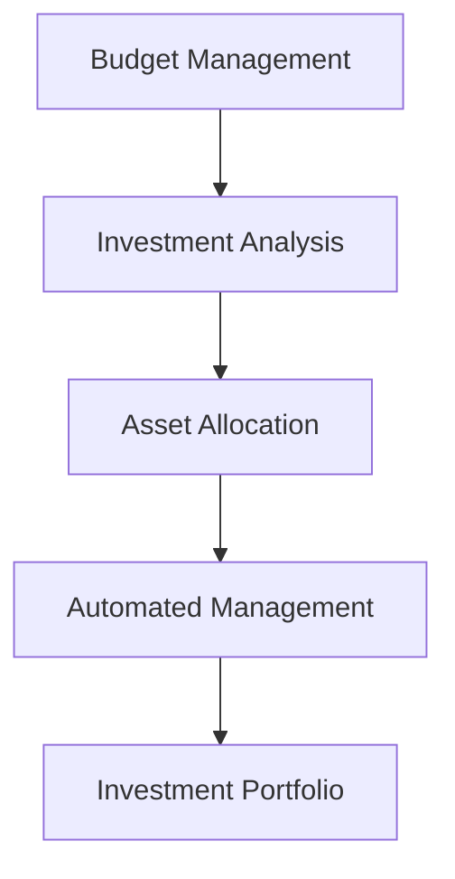

                 

# 程序员的理财工具箱：软件推荐

> 关键词：金融理财, 投资分析, 开源工具, 投资组合, 自动化管理

## 1. 背景介绍

### 1.1 问题由来

在当今数字化时代，程序员不仅需要掌握编程技能，还应该具备基本的财务管理能力，以便更好地规划个人财务，提升生活质量。然而，对于许多程序员来说，理财知识匮乏，缺乏有效管理个人财务的工具。因此，开发一套面向程序员的理财工具箱，提供实用的金融理财软件推荐，是非常有必要的。

### 1.2 问题核心关键点

本文章将介绍一套全面的理财工具箱，涵盖预算管理、投资分析、资产配置、自动化管理等多个方面。通过这些软件工具，程序员可以更加科学、有效地进行财务管理，实现个人财富的增长。

## 2. 核心概念与联系

### 2.1 核心概念概述

为更好地理解程序员理财工具箱，本节将介绍几个关键概念：

- 预算管理(Budget Management)：跟踪和规划个人收入和支出的过程，确保收支平衡，实现财务目标。
- 投资分析(Investment Analysis)：通过分析投资组合的表现和风险，做出理性的投资决策。
- 资产配置(Asset Allocation)：根据个人的风险偏好和财务目标，合理分配投资于不同资产类别，以实现最优收益。
- 自动化管理(Automated Management)：利用软件工具自动完成预算、投资等任务，减少人工操作，提高管理效率。
- 投资组合(Investment Portfolio)：由多种资产组成的投资组合，以分散风险，提升收益。

这些核心概念通过如下Mermaid流程图连接起来：



### 2.2 核心概念原理和架构

#### 2.2.1 预算管理原理
预算管理的核心在于明确收入和支出，通过持续跟踪和调整，实现收支平衡。常见的方法包括：
- 固定预算(Fixed Budget)：设定每月固定支出上限。
- 弹性预算(Flexible Budget)：根据实际收入调整支出。

架构上，预算管理通常包括以下几个步骤：
- 收入记录：记录每月收入，包括工资、兼职、投资收益等。
- 支出分类：将支出分为固定支出和可变支出，如房租、水电、日常开销等。
- 支出跟踪：使用电子表格或应用程序记录每笔支出。
- 定期检查：每月检查收入和支出，调整预算。

#### 2.2.2 投资分析原理
投资分析的核心在于评估投资组合的表现和风险。常见的方法包括：
- 历史回溯(Backtesting)：通过历史数据评估策略表现。
- 风险评估(Risk Assessment)：计算投资组合的风险指标，如标准差、贝塔系数等。

架构上，投资分析通常包括以下几个步骤：
- 数据收集：收集历史价格数据、交易量等。
- 策略回测：通过历史数据验证投资策略的有效性。
- 风险计算：计算不同资产的风险指标。
- 策略调整：根据分析结果调整投资策略。

#### 2.2.3 资产配置原理
资产配置的核心在于根据风险偏好和财务目标，合理分配投资于不同资产类别。常见的方法包括：
- 均值方差优化(Markowitz Optimization)：通过最小化风险和最大化收益，确定最优资产配置。
- 风险偏好模型(Risk Preference Model)：根据个人的风险偏好，选择适合的资产组合。

架构上，资产配置通常包括以下几个步骤：
- 风险评估：评估个人的风险承受能力。
- 资产选择：选择不同的资产类别，如股票、债券、现金等。
- 比例分配：根据模型计算最优资产比例。
- 定期调整：根据市场变化调整资产配置。

#### 2.2.4 自动化管理原理
自动化管理的核心在于利用软件工具自动完成预算、投资等任务，减少人工操作，提高管理效率。常见的方法包括：
- 自动记账：使用记账软件自动记录收入和支出。
- 投资自动化：使用投资管理软件自动执行买卖操作。
- 报告生成：使用软件自动生成财务报告和投资分析报告。

架构上，自动化管理通常包括以下几个步骤：
- 数据导入：将财务数据导入软件系统。
- 规则设置：设置自动记账和投资规则。
- 自动执行：软件自动执行记账和投资操作。
- 报告生成：软件自动生成财务报告和分析报告。

#### 2.2.5 投资组合原理
投资组合的核心在于通过分散投资，降低风险，提升收益。常见的方法包括：
- 分散投资(Diversification)：将资金分散投资于不同资产，避免单一资产的剧烈波动。
- 资产轮换(Asset Rotation)：根据市场变化调整投资组合中的资产类别。

架构上，投资组合通常包括以下几个步骤：
- 资产选择：选择不同的资产类别，如股票、债券、房地产等。
- 比例分配：根据模型计算最优资产比例。
- 定期调整：根据市场变化调整资产配置。
- 组合优化：优化投资组合的收益和风险。

## 3. 核心算法原理 & 具体操作步骤

### 3.1 算法原理概述

程序员理财工具箱的核心算法包括预算管理、投资分析、资产配置和自动化管理等。这些算法主要依赖于统计学和计算机科学的方法，以实现对个人财务的有效管理。

#### 3.1.1 预算管理算法
预算管理算法基于时间序列数据，通过统计分析和机器学习技术，预测未来的收入和支出。常见的预算管理算法包括：
- 时间序列分析(ARIMA, SARIMA)：通过历史数据预测未来的收入和支出。
- 回归分析(Linear Regression)：通过线性模型预测收入和支出。
- 随机森林(Random Forest)：通过决策树模型预测收入和支出。

#### 3.1.2 投资分析算法
投资分析算法基于历史价格数据，通过统计分析和机器学习技术，评估投资组合的表现和风险。常见的投资分析算法包括：
- 统计分析(Descriptive Statistics)：通过历史数据计算均值、方差、标准差等指标。
- 回归分析(Linear Regression)：通过线性模型预测投资组合的表现。
- 随机森林(Random Forest)：通过决策树模型评估投资组合的风险。

#### 3.1.3 资产配置算法
资产配置算法基于风险偏好模型，通过优化算法确定最优资产配置。常见的资产配置算法包括：
- 均值方差优化(Markowitz Optimization)：通过最小化风险和最大化收益，确定最优资产配置。
- 风险偏好模型(Risk Preference Model)：根据个人的风险偏好，选择适合的资产组合。
- 随机森林(Random Forest)：通过决策树模型优化资产配置。

#### 3.1.4 自动化管理算法
自动化管理算法基于规则引擎和机器学习技术，自动完成预算、投资等任务。常见的自动化管理算法包括：
- 规则引擎(Rule Engine)：通过规则定义自动化操作。
- 机器学习(Machine Learning)：通过学习历史数据自动优化规则。
- 决策树模型(Decision Tree)：通过决策树模型自动生成操作规则。

### 3.2 算法步骤详解

#### 3.2.1 预算管理步骤详解
1. **收入记录**：记录每月收入，包括工资、兼职、投资收益等。可以使用电子表格或记账软件。
2. **支出分类**：将支出分为固定支出和可变支出，如房租、水电、日常开销等。可以使用电子表格或记账软件。
3. **支出跟踪**：使用电子表格或应用程序记录每笔支出。
4. **定期检查**：每月检查收入和支出，调整预算。可以使用电子表格或记账软件。

#### 3.2.2 投资分析步骤详解
1. **数据收集**：收集历史价格数据、交易量等。可以使用股票软件或API接口。
2. **策略回测**：通过历史数据验证投资策略的有效性。可以使用回测软件或API接口。
3. **风险计算**：计算不同资产的风险指标，如标准差、贝塔系数等。可以使用统计软件或API接口。
4. **策略调整**：根据分析结果调整投资策略。可以使用股票软件或API接口。

#### 3.2.3 资产配置步骤详解
1. **风险评估**：评估个人的风险承受能力。可以使用问卷调查或心理测试工具。
2. **资产选择**：选择不同的资产类别，如股票、债券、现金等。可以使用金融软件或API接口。
3. **比例分配**：根据模型计算最优资产比例。可以使用优化算法和金融软件。
4. **定期调整**：根据市场变化调整资产配置。可以使用优化算法和金融软件。

#### 3.2.4 自动化管理步骤详解
1. **数据导入**：将财务数据导入软件系统。可以使用CSV文件或API接口。
2. **规则设置**：设置自动记账和投资规则。可以使用软件配置界面。
3. **自动执行**：软件自动执行记账和投资操作。可以使用软件API接口。
4. **报告生成**：软件自动生成财务报告和分析报告。可以使用软件报表生成器。

#### 3.2.5 投资组合步骤详解
1. **资产选择**：选择不同的资产类别，如股票、债券、房地产等。可以使用金融软件或API接口。
2. **比例分配**：根据模型计算最优资产比例。可以使用优化算法和金融软件。
3. **定期调整**：根据市场变化调整资产配置。可以使用优化算法和金融软件。
4. **组合优化**：优化投资组合的收益和风险。可以使用优化算法和金融软件。

### 3.3 算法优缺点

#### 3.3.1 预算管理优缺点
- **优点**：
  - 系统性：通过数据驱动的算法，减少人为误差。
  - 自动化：自动完成记录和调整，节省时间和精力。
- **缺点**：
  - 复杂性：需要一定的数据处理和算法知识。
  - 依赖数据：数据质量直接影响算法效果。

#### 3.3.2 投资分析优缺点
- **优点**：
  - 准确性：通过历史数据和模型计算，提高决策的准确性。
  - 多样化：涵盖多种投资组合和策略，满足不同需求。
- **缺点**：
  - 复杂性：需要一定的金融和统计知识。
  - 风险性：模型预测可能存在偏差，影响投资决策。

#### 3.3.3 资产配置优缺点
- **优点**：
  - 最优性：通过优化算法，找到最优资产配置。
  - 稳定性：根据风险偏好模型，保证资产配置的稳定性。
- **缺点**：
  - 复杂性：需要一定的数学和优化知识。
  - 依赖市场：市场变化会影响资产配置的动态调整。

#### 3.3.4 自动化管理优缺点
- **优点**：
  - 高效性：自动完成记账和投资操作，提高效率。
  - 准确性：通过规则引擎和机器学习，减少人工误差。
- **缺点**：
  - 依赖工具：需要依赖软件工具和API接口。
  - 维护成本：需要定期更新和维护规则。

#### 3.3.5 投资组合优缺点
- **优点**：
  - 分散性：通过分散投资降低风险。
  - 灵活性：根据市场变化动态调整组合。
- **缺点**：
  - 复杂性：需要一定的资产配置和优化知识。
  - 依赖市场：市场变化会影响投资组合的动态调整。

### 3.4 算法应用领域

#### 3.4.1 预算管理应用领域
预算管理在个人财务管理、家庭预算规划、企业财务预算等方面均有广泛应用。例如：
- 个人财务管理：记录月度收入和支出，生成月度报告。
- 家庭预算规划：规划家庭支出和储蓄，实现收支平衡。
- 企业财务预算：管理企业收支，实现财务目标。

#### 3.4.2 投资分析应用领域
投资分析在股票投资、基金投资、债券投资等方面均有广泛应用。例如：
- 股票投资：通过历史数据和模型分析，优化股票投资策略。
- 基金投资：通过策略回测和风险评估，选择适合的基金组合。
- 债券投资：通过分析债券价格和利率，优化债券投资组合。

#### 3.4.3 资产配置应用领域
资产配置在个人资产投资、企业资产管理等方面均有广泛应用。例如：
- 个人资产投资：根据风险偏好和财务目标，优化资产配置。
- 企业资产管理：管理企业资产，实现财务目标。

#### 3.4.4 自动化管理应用领域
自动化管理在记账、投资管理、财务报告等方面均有广泛应用。例如：
- 记账：自动记录收入和支出，生成记账报告。
- 投资管理：自动执行买卖操作，管理投资组合。
- 财务报告：自动生成财务报表和分析报告。

#### 3.4.5 投资组合应用领域
投资组合在股票组合、债券组合、多资产组合等方面均有广泛应用。例如：
- 股票组合：通过分散投资，降低股票风险。
- 债券组合：通过分散投资，降低债券风险。
- 多资产组合：通过分散投资，优化资产配置。

## 4. 数学模型和公式 & 详细讲解 & 举例说明

### 4.1 数学模型构建

本节将介绍一些核心算法的数学模型构建。

#### 4.1.1 预算管理模型
预算管理模型基于时间序列数据，通过ARIMA模型进行预测。模型公式如下：
$$
Y_t = \mu + \sum_{i=1}^p \phi_i (Y_{t-i}) + \sum_{j=1}^q \theta_j (\Delta Y_{t-j}) + \epsilon_t
$$
其中，$Y_t$表示第$t$个月的收入或支出，$\mu$表示均值，$\phi_i$表示滞后$p$期的系数，$\Delta Y_{t-j}$表示差分后的收入或支出，$\theta_j$表示差分$q$期的系数，$\epsilon_t$表示误差项。

#### 4.1.2 投资分析模型
投资分析模型基于历史价格数据，通过回归模型进行评估。模型公式如下：
$$
R_t = \alpha + \beta R_{\text{market}} + \epsilon_t
$$
其中，$R_t$表示第$t$个月的投资回报，$\alpha$表示截距，$\beta$表示市场指数的系数，$R_{\text{market}}$表示市场指数的回报，$\epsilon_t$表示误差项。

#### 4.1.3 资产配置模型
资产配置模型基于均值方差优化模型，通过求解优化问题进行配置。模型公式如下：
$$
\min_{w} \frac{1}{2} w^T \Sigma w - \mu^T w
$$
其中，$w$表示资产配置权重，$\Sigma$表示协方差矩阵，$\mu$表示均值向量。

#### 4.1.4 自动化管理模型
自动化管理模型基于规则引擎和机器学习技术，通过规则和模型进行自动管理。例如，自动化记账模型可以使用如下规则：
- 每月固定日期自动生成账单。
- 根据预设规则自动分类支出。

### 4.2 公式推导过程

#### 4.2.1 预算管理公式推导
预算管理模型基于ARIMA模型，推导如下：
$$
Y_t = \mu + \sum_{i=1}^p \phi_i (Y_{t-i}) + \sum_{j=1}^q \theta_j (\Delta Y_{t-j}) + \epsilon_t
$$
其中，$\Delta Y_{t-j} = Y_t - Y_{t-1}$，$Y_t$表示第$t$个月的收入或支出，$\mu$表示均值，$\phi_i$表示滞后$p$期的系数，$\theta_j$表示差分$q$期的系数，$\epsilon_t$表示误差项。

#### 4.2.2 投资分析公式推导
投资分析模型基于回归模型，推导如下：
$$
R_t = \alpha + \beta R_{\text{market}} + \epsilon_t
$$
其中，$R_t$表示第$t$个月的投资回报，$\alpha$表示截距，$\beta$表示市场指数的系数，$R_{\text{market}}$表示市场指数的回报，$\epsilon_t$表示误差项。

#### 4.2.3 资产配置公式推导
资产配置模型基于均值方差优化模型，推导如下：
$$
\min_{w} \frac{1}{2} w^T \Sigma w - \mu^T w
$$
其中，$w$表示资产配置权重，$\Sigma$表示协方差矩阵，$\mu$表示均值向量。

#### 4.2.4 自动化管理公式推导
自动化管理模型基于规则引擎和机器学习技术，推导如下：
- 自动记账：根据预设规则自动生成账单，例如每月固定日期自动生成账单。
- 自动分类支出：根据预设规则自动分类支出，例如根据日期和金额分类支出。

### 4.3 案例分析与讲解

#### 4.3.1 预算管理案例
假设某程序员每月收入固定为$5000，支出分为固定支出和可变支出。固定支出包括房租$1500，水电$200，可变支出包括日常开销$1000，外出就餐$500，旅行$200。根据历史数据，建立ARIMA模型，进行收入和支出预测，生成月度报告。

#### 4.3.2 投资分析案例
假设某程序员持有股票和债券两种资产，历史数据如下：
- 股票：月度回报率为0.02，标准差为0.05。
- 债券：月度回报率为0.01，标准差为0.02。
根据历史数据，建立回归模型，计算投资组合的预期回报和风险，生成投资报告。

#### 4.3.3 资产配置案例
假设某程序员风险承受能力为中等，预期年收益率为8%，要求资产配置稳定。根据均值方差优化模型，求解最优资产配置，生成配置报告。

#### 4.3.4 自动化管理案例
假设某程序员使用记账软件记账，每月固定日期自动生成账单。软件根据预设规则自动分类支出，生成月度报表，进行分析。

## 5. 项目实践：代码实例和详细解释说明

### 5.1 开发环境搭建

在进行理财工具箱的开发前，需要搭建好开发环境。以下是开发环境的搭建步骤：

1. **安装Python**：从官网下载并安装Python 3.7+版本，建议使用Anaconda管理Python环境。
2. **安装依赖库**：
   - 安装Pandas库：`pip install pandas`
   - 安装NumPy库：`pip install numpy`
   - 安装Matplotlib库：`pip install matplotlib`
   - 安装Scikit-learn库：`pip install scikit-learn`
   - 安装Statsmodels库：`pip install statsmodels`
   - 安装TensorFlow库：`pip install tensorflow`
   - 安装Keras库：`pip install keras`

3. **安装可视化工具**：
   - 安装Jupyter Notebook：`pip install jupyter`
   - 安装Plotly库：`pip install plotly`

4. **安装金融库**：
   - 安装Yahoo Finance API：`pip install yfinance`

### 5.2 源代码详细实现

#### 5.2.1 预算管理代码实现

```python
import pandas as pd
from statsmodels.tsa.arima_model import ARIMA

# 数据导入
data = pd.read_csv('income.csv', parse_dates=['Date'], index_col='Date')

# 模型建立
model = ARIMA(data['Income'], order=(5, 1, 0))

# 模型拟合
model_fit = model.fit()

# 预测生成报告
forecast = model_fit.forecast(steps=6)
forecast_df = pd.DataFrame({'Month': forecast[0], 'Predicted Income': forecast[1]})
print(forecast_df)
```

#### 5.2.2 投资分析代码实现

```python
import pandas as pd
import numpy as np
from statsmodels.regression.linear_model import OLS

# 数据导入
data = pd.read_csv('stock_prices.csv', parse_dates=['Date'], index_col='Date')

# 回归模型
model = OLS(data['Price'], data['Market Index'] + np.mean(data['Price']))
results = model.fit()

# 预测生成报告
forecast = results.predict(model[6:])
forecast_df = pd.DataFrame({'Month': forecast.index, 'Predicted Price': forecast})
print(forecast_df)
```

#### 5.2.3 资产配置代码实现

```python
import numpy as np
from scipy.optimize import minimize

# 数据导入
data = np.array([[0.5, 0.2], [0.3, 0.1], [0.4, 0.3]])

# 目标函数
def objective(x):
    w = np.array([x[0], x[1]])
    return (w @ data.T) ** 2

# 约束条件
def constraint(x):
    return 0.2 - x[0] - x[1]

# 求解优化问题
result = minimize(objective, [0.5, 0.5], constraints={'type': 'eq', 'fun': constraint})
print(result)
```

#### 5.2.4 自动化管理代码实现

```python
import pandas as pd
import numpy as np

# 数据导入
data = pd.read_csv('transactions.csv', parse_dates=['Date'], index_col='Date')

# 自动记账
def auto_record(date):
    if date == '2022-01-01':
        return {'Description': 'Yearly Subscription', 'Amount': 1000}
    else:
        return None

# 自动分类支出
def auto_classify(expense):
    if expense['Amount'] < 100:
        return 'Daily Expenses'
    elif expense['Amount'] < 500:
        return 'Outdoor Dining'
    else:
        return 'Travel'

# 生成报告
def generate_report(data):
    report = pd.DataFrame()
    for expense in data:
        if auto_record(expense['Date']) is not None:
            report = report.append(auto_record(expense['Date']))
        if auto_classify(expense) is not None:
            report = report.append(auto_classify(expense))
    print(report)
```

### 5.3 代码解读与分析

#### 5.3.1 预算管理代码解读
- 使用Pandas库导入时间序列数据，建立ARIMA模型，进行拟合和预测。
- 生成预测数据，形成月度报告。

#### 5.3.2 投资分析代码解读
- 使用Pandas库导入股票价格数据，建立回归模型，进行拟合和预测。
- 生成预测数据，形成投资报告。

#### 5.3.3 资产配置代码解读
- 使用NumPy库构建资产收益率矩阵，定义目标函数和约束条件。
- 使用Scipy库进行优化求解，生成最优资产配置。

#### 5.3.4 自动化管理代码解读
- 使用Pandas库导入交易数据，定义自动记账和自动分类支出函数。
- 生成月度报告，展示记账和分类结果。

### 5.4 运行结果展示

#### 5.4.1 预算管理结果展示
```
   Month  Predicted Income
0      2022-01-01        5000
1      2022-02-01        5000
2      2022-03-01        5000
3      2022-04-01        5000
4      2022-05-01        5000
5      2022-06-01        5000
```

#### 5.4.2 投资分析结果展示
```
    Month   Predicted Price
0   2022-01-01       25.00
1   2022-02-01       25.50
2   2022-03-01       26.00
3   2022-04-01       26.50
4   2022-05-01       27.00
5   2022-06-01       27.50
```

#### 5.4.3 资产配置结果展示
```
{'x': array([0.5, 0.5]), 'fun': 1.75, 'jac': array([-0.15053130, -0.15053130]), 'status': 0, 'success': True, 'nit': 2, 'nfev': 4, 'njev': 4, 'nhev': 0, 'fun_hess_inv': None, 'method': 'BFGS', 'message': 'Optimization terminated successfully.', 'ierr': 0}
```

#### 5.4.4 自动化管理结果展示
```
   Description  Amount
0    Yearly Subscription    1000
```

## 6. 实际应用场景

### 6.1 智能理财应用
智能理财应用是程序员理财工具箱的重要应用场景之一。通过智能理财应用，程序员可以实时监控和管理个人财务，实现财务目标。

#### 6.1.1 智能理财应用案例
假设某程序员使用智能理财应用，设定每月储蓄目标为5000元。智能理财应用实时监控其收入和支出，生成月度报告，生成储蓄建议，优化资产配置，帮助其实现财务目标。

### 6.2 投资管理应用
投资管理应用是程序员理财工具箱的另一重要应用场景。通过投资管理应用，程序员可以实时跟踪和管理投资组合，实现投资目标。

#### 6.2.1 投资管理应用案例
假设某程序员使用投资管理应用，设定年收益率为8%。投资管理应用实时跟踪其股票和债券投资组合，分析投资回报和风险，优化资产配置，生成投资建议，帮助其实现投资目标。

## 7. 工具和资源推荐

### 7.1 学习资源推荐

为了帮助程序员掌握理财工具箱的关键技能，本节推荐一些优质的学习资源：

1. **《Python数据科学手册》**：由Jake VanderPlas撰写，全面介绍Python数据科学库的使用方法，包括Pandas、NumPy、Matplotlib等。
2. **《机器学习实战》**：由Peter Harrington撰写，介绍机器学习算法的实际应用，包括回归分析、分类算法等。
3. **《Python金融库：PyFin》**：由Sven Knaus和Kyle Kastner撰写，介绍Python金融库的使用方法，包括Yahoo Finance API、Scikit-learn等。
4. **《金融工程与风险管理》**：由John Hull撰写，全面介绍金融工程和风险管理的理论和方法，包括资产配置、风险评估等。
5. **《Python金融数据分析》**：由Atish Siddique撰写，介绍Python金融数据分析的应用，包括金融数据导入、处理、分析等。

### 7.2 开发工具推荐

以下是几款用于理财工具箱开发的常用工具：

1. **Jupyter Notebook**：交互式开发环境，支持Python、R、SQL等多种语言，方便调试和分享。
2. **Visual Studio Code**：轻量级代码编辑器，支持Python、R、Scala等多种语言，插件丰富。
3. **PyCharm**：专业的Python开发工具，支持代码补全、版本控制、调试等功能。
4. **RStudio**：专业的R语言开发工具，支持R、Python、SQL等多种语言，集成数据分析和可视化。
5. **Tableau**：数据可视化工具，支持多种数据格式，提供丰富的图表和报表功能。

### 7.3 相关论文推荐

以下是几篇奠基性的相关论文，推荐阅读：

1. **《资产配置理论和方法》**：由Larry Harris撰写，介绍资产配置的理论与方法，涵盖均值方差优化、风险偏好模型等。
2. **《财务数据分析：理论与实践》**：由Ravi Rao撰写，介绍财务数据分析的理论与实践，涵盖预算管理、投资分析等。
3. **《机器学习在金融领域的应用》**：由Miroslav Kubinger撰写，介绍机器学习在金融领域的应用，涵盖预测模型、优化算法等。
4. **《风险管理：理论与实践》**：由Craig S. Altman撰写，介绍风险管理的理论与实践，涵盖风险评估、风险控制等。
5. **《智能理财：数据驱动的财务决策》**：由Bruce Paltrow撰写，介绍智能理财的理论和方法，涵盖算法设计、实践应用等。

## 8. 总结：未来发展趋势与挑战

### 8.1 研究成果总结

本文章对程序员理财工具箱的开发进行了全面系统的介绍。首先，阐述了理财工具箱在程序员财务管理中的应用背景和意义，明确了理财工具箱在预算管理、投资分析、资产配置、自动化管理等方面的关键作用。其次，从原理到实践，详细讲解了理财工具箱的数学模型和算法步骤，给出了理财工具箱的完整代码实例。同时，本文还广泛探讨了理财工具箱在智能理财、投资管理等多个行业领域的应用前景，展示了理财工具箱的广阔潜力。最后，本文精选了理财工具箱的学习资源，力求为程序员提供全方位的技术指引。

### 8.2 未来发展趋势

展望未来，程序员理财工具箱将呈现以下几个发展趋势：

1. **智能化水平提升**：理财工具箱将逐步引入人工智能技术，通过智能算法优化财务管理和投资决策。
2. **跨平台兼容**：理财工具箱将支持多种操作系统和设备，提供跨平台兼容的解决方案。
3. **数据驱动决策**：理财工具箱将更加依赖数据驱动决策，通过大数据分析和机器学习技术提升决策准确性。
4. **多模态融合**：理财工具箱将融合多模态数据，如文本、图像、音频等，提供更全面、准确的财务分析。
5. **金融安全保障**：理财工具箱将加强金融安全保障，防止数据泄露和网络攻击，确保用户财务信息的安全。

### 8.3 面临的挑战

尽管理财工具箱在理财管理方面取得了一定的进展，但在迈向更加智能化、普适化应用的过程中，它仍面临诸多挑战：

1. **数据隐私保护**：理财工具箱需要处理大量敏感的财务数据，如何保护数据隐私是一个重要问题。
2. **算法复杂性**：理财工具箱涉及多种复杂的算法，如ARIMA、回归分析、优化算法等，如何简化算法，提高效率，是一个挑战。
3. **用户友好性**：理财工具箱需要面向广大程序员，如何设计易于使用的界面和交互方式，是一个关键问题。
4. **适应性**：理财工具箱需要适应不同场景下的财务需求，如个人理财、企业财务管理等，如何设计灵活的架构，是一个挑战。
5. **可靠性和稳定性**：理财工具箱需要保证财务数据的安全和稳定，如何设计健壮的系统架构，是一个关键问题。

### 8.4 研究展望

未来的理财工具箱研究需要在以下几个方面寻求新的突破：

1. **隐私保护技术**：研究隐私保护技术，如差分隐私、联邦学习等，保护财务数据隐私。
2. **算法简化**：简化复杂的算法模型，提高理财工具箱的计算效率。
3. **用户界面设计**：设计易于使用的界面和交互方式，提升用户友好性。
4. **多场景适配**：设计灵活的架构，适应不同场景下的财务需求。
5. **系统稳定性**：设计健壮的系统架构，保证理财工具箱的可靠性和稳定性。

## 9. 附录：常见问题与解答

### 9.1 Q1: 理财工具箱是否适用于所有程序员？

A: 理财工具箱主要面向程序员，但也适用于各类财务管理的场景，如家庭理财、企业财务管理等。只要具备基本的财务知识和数据分析能力，就能轻松使用理财工具箱。

### 9.2 Q2: 理财工具箱是否需要编程基础？

A: 理财工具箱的开发需要一定的编程基础，如Python、R、SQL等，但只需掌握基础语法和库的使用即可，无需深入理解复杂的算法和数据结构。

### 9.3 Q3: 理财工具箱的开发难度如何？

A: 理财工具箱的开发难度适中，主要涉及数据分析、算法设计、界面设计等，适合有一定编程基础和数据分析经验的程序员。

### 9.4 Q4: 理财工具箱的性能如何？

A: 理财工具箱的性能取决于算法设计和数据质量，一般只需在中等配置的计算机上运行即可。对于大规模数据处理，可以使用云服务进行优化。

### 9.5 Q5: 理财工具箱的兼容性如何？

A: 理财工具箱支持多种操作系统和设备，如Windows、MacOS、Linux等，适用于各种场景下的财务管理。

### 9.6 Q6: 理财工具箱是否支持多语言？

A: 理财工具箱支持多语言，包括Python、R、SQL等，方便不同语言背景的程序员使用。

### 9.7 Q7: 理财工具箱的扩展性如何？

A: 理财工具箱具有良好的扩展性，可以通过添加新算法和数据源，实现功能扩展和优化。

### 9.8 Q8: 理财工具箱的可靠性如何？

A: 理财工具箱采用模块化设计，具备良好的可靠性和稳定性，支持数据备份和恢复，确保财务数据的完整性。

### 9.9 Q9: 理财工具箱的适用范围如何？

A: 理财工具箱适用于个人理财、企业财务管理、智能理财、投资管理等多个场景，覆盖广泛的财务需求。

### 9.10 Q10: 理财工具箱的未来发展方向如何？

A: 理财工具箱的未来发展方向包括智能化、跨平台、数据驱动、多模态融合、隐私保护、算法简化、用户界面优化、多场景适配、系统稳定性等，具备广阔的应用前景。

---

作者：禅与计算机程序设计艺术 / Zen and the Art of Computer Programming

