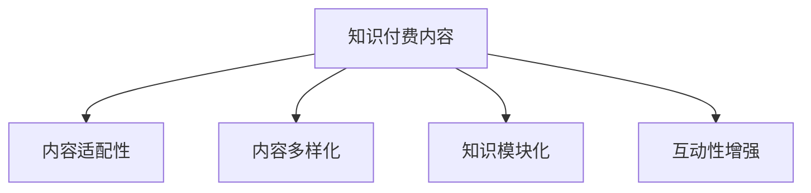

                 

## 1. 背景介绍

### 1.1 问题由来

随着互联网的迅猛发展，知识付费市场也随之兴起。大量的知识付费内容，如视频课程、电子书、技术博客等，正在源源不断地产生。然而，知识付费内容的泛滥也带来了一个重要问题：如何高效地将这些内容进行再利用，即知识内容的 repurposing。

知识内容的 repurposing，指的是将已有的知识内容进行重新整理、编辑和再利用，以便更好地服务于不同的受众和场景。这不仅有助于提升知识内容的价值，还能帮助用户更好地掌握技术知识。

### 1.2 问题核心关键点

知识付费内容的 repurposing，核心在于如何在不改变原有内容的前提下，重新编排、组合、转换其形式，以适应不同的目标受众和应用场景。具体而言，包括以下几个关键点：

1. **内容适配性**：根据目标受众的特点，重新编排内容，使其更易于理解和吸收。
2. **形式多样化**：将内容转换为适合不同媒介和格式的形式，如文章、视频、PPT、代码示例等。
3. **知识模块化**：将复杂内容拆解为多个模块，便于用户按照自己的节奏学习。
4. **互动性增强**：通过问答、代码练习、项目实践等方式，增强内容的互动性，帮助用户更好地掌握技术。

### 1.3 问题研究意义

深入研究知识付费内容的 repurposing 策略，对于提升知识内容的利用效率、增强用户学习体验、推动技术知识传播具有重要意义：

1. **提升内容价值**：通过重新编排和包装，使知识内容更易于理解和应用，提升其对用户的价值。
2. **增强用户粘性**：多样化的内容形式和互动性设计，能够更好地吸引用户，提升其对平台的粘性。
3. **推动技术传播**：通过多种渠道和形式的知识传播，能够帮助更多人获取技术知识，推动技术的普及和应用。

## 2. 核心概念与联系

### 2.1 核心概念概述

为更好地理解知识付费内容的 repurposing 策略，本节将介绍几个密切相关的核心概念：

- **知识付费内容**：指通过付费方式提供的技术知识内容，如视频课程、电子书、技术博客等。
- **内容适配性**：指根据目标受众的特点，重新编排内容，使其更易于理解和吸收。
- **内容多样化**：指将内容转换为适合不同媒介和格式的形式，如文章、视频、PPT、代码示例等。
- **知识模块化**：指将复杂内容拆解为多个模块，便于用户按照自己的节奏学习。
- **互动性增强**：通过问答、代码练习、项目实践等方式，增强内容的互动性，帮助用户更好地掌握技术。

这些核心概念之间的逻辑关系可以通过以下Mermaid流程图来展示：



这个流程图展示的知识付费内容的 repurposing 的核心概念及其之间的关系：

1. 知识付费内容通过适配性、多样化、模块化和互动性等策略进行重新编排和包装。
2. 适配性、多样化、模块化和互动性等策略相互结合，形成一个完整的 repurposing 流程。
3. 最终的 repurposing 结果是一个更加易于理解和应用的知识内容，能够更好地服务于不同的受众和场景。

## 3. 核心算法原理 & 具体操作步骤
### 3.1 算法原理概述

知识付费内容的 repurposing 策略，本质上是一个内容重新编排和组合的过程。其核心思想是：根据目标受众的特点和应用场景，对原始的知识内容进行重新编排和包装，使其更易于理解和吸收。

具体而言，可以遵循以下步骤：

1. **内容分析**：分析原始内容，确定其主要知识点、难度、受众等。
2. **内容适配**：根据目标受众的特点，重新编排内容，使其更易于理解和吸收。
3. **内容多样化**：将内容转换为适合不同媒介和格式的形式，如文章、视频、PPT、代码示例等。
4. **知识模块化**：将复杂内容拆解为多个模块，便于用户按照自己的节奏学习。
5. **互动性增强**：通过问答、代码练习、项目实践等方式，增强内容的互动性，帮助用户更好地掌握技术。

### 3.2 算法步骤详解

以下是知识付费内容的 repurposing 策略的详细操作步骤：

**Step 1: 内容分析**

1. **提取知识点**：对原始内容进行分析，提取其中的核心知识点。
2. **评估难度**：根据知识点的难度，确定其适用的受众群体。
3. **确定目标受众**：明确目标受众的特点，如技术水平、学习习惯等。

**Step 2: 内容适配**

1. **选择合适的表达方式**：根据目标受众的特点，选择合适的表达方式，如文字、视频、代码等。
2. **简化和补充内容**：简化复杂内容，补充缺失的背景知识和示例。
3. **编写学习目标**：明确每部分内容的学习目标，便于用户理解。

**Step 3: 内容多样化**

1. **转换为多媒体形式**：将文字内容转换为视频、PPT、代码示例等形式。
2. **制作案例和演示**：制作与知识点相关的案例和演示，帮助用户更好地理解。
3. **提供互动元素**：在内容中加入问答、代码练习等互动元素，增强用户参与度。

**Step 4: 知识模块化**

1. **划分模块**：将复杂内容划分为多个模块，每个模块集中讲解一个知识点。
2. **设定学习路径**：明确每个模块的学习路径和前后关系，便于用户系统学习。
3. **提供自测题**：为每个模块提供自测题，帮助用户检验学习效果。

**Step 5: 互动性增强**

1. **加入问答环节**：在内容中加入问答环节，帮助用户解答疑问。
2. **提供代码练习**：提供与内容相关的代码练习，帮助用户巩固知识。
3. **组织项目实践**：组织实际的项目实践，帮助用户应用所学知识。

### 3.3 算法优缺点

知识付费内容的 repurposing 策略具有以下优点：

1. **提升内容价值**：通过重新编排和包装，使知识内容更易于理解和应用，提升其对用户的价值。
2. **增强用户粘性**：多样化的内容形式和互动性设计，能够更好地吸引用户，提升其对平台的粘性。
3. **推动技术传播**：通过多种渠道和形式的知识传播，能够帮助更多人获取技术知识，推动技术的普及和应用。

同时，该策略也存在一定的局限性：

1. **依赖高质量原始内容**：原始内容的质量直接影响 repurposing 效果，需要花费大量时间和精力进行高质量原始内容的筛选和分析。
2. **需要专业知识**：需要具备一定的专业知识，才能进行有效的适配和优化。
3. **成本较高**：进行高质量的内容适配和多样化包装需要较多的人力和时间成本。

尽管存在这些局限性，但就目前而言，知识付费内容的 repurposing 策略仍然是一个高效提升内容价值和用户体验的有效方法。

### 3.4 算法应用领域

知识付费内容的 repurposing 策略，已经在多个领域得到了广泛应用，如：

- **教育培训**：将知识付费内容重新编排和包装，使其更易于理解和吸收，提升培训效果。
- **技术博客**：将技术博客内容转换为视频、代码示例等形式，增强其互动性和可读性。
- **在线课程**：将视频课程内容拆分为多个模块，提供互动练习和项目实践，提升学习体验。
- **软件开发**：将技术文档和代码示例转换为易于理解的形式，帮助开发者快速掌握新知识。

除了这些经典应用外，知识付费内容的 repurposing 策略还可以创新性地应用到更多场景中，如可控内容生成、知识图谱构建、在线协作等，为技术传播和技术学习带来新的突破。

## 4. 数学模型和公式 & 详细讲解 & 举例说明

### 4.1 数学模型构建

本节将使用数学语言对知识付费内容的 repurposing 策略进行更加严格的刻画。

记原始知识内容为 $C$，目标受众为 $R$。定义内容适配函数 $f(C, R)$，表示对原始内容 $C$ 进行适配，使其更易于目标受众 $R$ 理解和吸收。定义内容多样化函数 $g(f(C, R))$，表示对适配后的内容进行多样化包装，如转换为视频、代码示例等形式。定义知识模块化函数 $h(g(f(C, R)))$，表示将多样化后的内容拆分为多个模块，便于用户按照自己的节奏学习。定义互动性增强函数 $i(h(g(f(C, R))))$，表示在模块化内容的基础上，加入问答、代码练习等互动元素，增强用户参与度。

最终的 repurposing 结果为 $i(h(g(f(C, R))))$。

### 4.2 公式推导过程

以下是知识付费内容 repurposing 策略的数学公式推导：

1. **内容适配函数**：

$$
f(C, R) = \text{simplify}(C) + \text{supplement}(C)
$$

其中，$\text{simplify}(C)$ 表示简化复杂内容，$\text{supplement}(C)$ 表示补充缺失的背景知识和示例。

2. **内容多样化函数**：

$$
g(f(C, R)) = \text{convertTo}(f(C, R), \text{format})
$$

其中，$\text{format}$ 表示内容的多媒体形式，如视频、PPT、代码示例等。

3. **知识模块化函数**：

$$
h(g(f(C, R))) = \text{split}(g(f(C, R))) + \text{order}(g(f(C, R)))
$$

其中，$\text{split}(g(f(C, R)))$ 表示将内容划分为多个模块，$\text{order}(g(f(C, R)))$ 表示设定学习路径和前后关系。

4. **互动性增强函数**：

$$
i(h(g(f(C, R)))) = \text{addQandA}(h(g(f(C, R)))) + \text{addCodePractice}(h(g(f(C, R))))
$$

其中，$\text{addQandA}(h(g(f(C, R))))$ 表示加入问答环节，$\text{addCodePractice}(h(g(f(C, R))))$ 表示提供代码练习。

### 4.3 案例分析与讲解

**案例分析**：

假设原始内容为一份关于机器学习的电子书 $C$，目标受众为初学者 $R$。根据知识付费内容的 repurposing 策略，可以按以下步骤进行：

1. **内容分析**：
   - 提取知识点：线性回归、逻辑回归、决策树等。
   - 评估难度：适合初学者。
   - 确定目标受众：初学者。

2. **内容适配**：
   - 选择合适的表达方式：文字、视频。
   - 简化和补充内容：简化公式推导，补充实际案例。
   - 编写学习目标：每章明确学习目标，如理解机器学习基本概念。

3. **内容多样化**：
   - 转换为多媒体形式：将文字内容转换为视频讲解。
   - 制作案例和演示：制作实际案例的代码演示。
   - 提供互动元素：加入问答环节和代码练习。

4. **知识模块化**：
   - 划分模块：每章划分一个知识点模块。
   - 设定学习路径：设定每章学习路径和前后关系。
   - 提供自测题：每章提供自测题，检验学习效果。

5. **互动性增强**：
   - 加入问答环节：在视频讲解中加入问答环节，解答初学者疑问。
   - 提供代码练习：提供实际案例的代码练习，帮助初学者巩固知识。

通过以上步骤，将原始电子书 $C$ 重新编排和包装，最终得到了一个更加易于初学者理解和吸收的知识付费内容，显著提升了其价值和用户体验。

## 5. 项目实践：代码实例和详细解释说明
### 5.1 开发环境搭建

在进行知识付费内容的 repurposing 实践前，我们需要准备好开发环境。以下是使用Python进行Django开发的环境配置流程：

1. 安装Anaconda：从官网下载并安装Anaconda，用于创建独立的Python环境。

2. 创建并激活虚拟环境：
```bash
conda create -n django-env python=3.8 
conda activate django-env
```

3. 安装Django：
```bash
pip install django
```

4. 安装必要的第三方库：
```bash
pip install markdown matplotlib rest_framework
```

完成上述步骤后，即可在`django-env`环境中开始知识付费内容的 repurposing 实践。

### 5.2 源代码详细实现

这里我们以技术博客内容的 repurposing 为例，给出使用Django进行知识付费内容展示的代码实现。

首先，定义Django应用程序和模型：

```python
from django.contrib import admin
from django.urls import path
from . import views

urlpatterns = [
    path('blog/', views.blog, name='blog'),
    path('admin/', admin.site.urls),
]

class Blog(models.Model):
    title = models.CharField(max_length=200)
    content = models.TextField()
    author = models.CharField(max_length=50)
    date = models.DateTimeField(auto_now_add=True)
```

然后，定义博客文章列表视图和详情视图：

```python
def blog(request):
    blog_list = Blog.objects.all()
    context = {'blog_list': blog_list}
    return render(request, 'blog.html', context)

def blog_detail(request, pk):
    blog = Blog.objects.get(pk=pk)
    context = {'blog': blog}
    return render(request, 'blog_detail.html', context)
```

接着，定义模板文件：

**blog.html**：

```html
<!DOCTYPE html>
<html lang="en">
<head>
    <meta charset="UTF-8">
    <title>知识博客列表</title>
</head>
<body>
    <h1>知识博客列表</h1>
    <ul>
        
            <li><a href="">{{ blog.title }}</a></li>
        
    </ul>
</body>
</html>
```

**blog_detail.html**：

```html
<!DOCTYPE html>
<html lang="en">
<head>
    <meta charset="UTF-8">
    <title>知识博客详情</title>
</head>
<body>
    <h1>{{ blog.title }}</h1>
    <p>{{ blog.content }}</p>
    <p>作者：{{ blog.author }}</p>
    <p>发布时间：{{ blog.date }}</p>
</body>
</html>
```

最后，启动Django开发服务器：

```bash
python manage.py runserver
```

通过以上步骤，即可在Django框架下展示知识付费内容，进行内容适配和多样化包装。开发者可以在此基础上进行更多的优化和扩展。

### 5.3 代码解读与分析

让我们再详细解读一下关键代码的实现细节：

**Django应用程序和模型**：
- `admin.py`：定义Django的管理后台，可以方便地对博客文章进行管理。
- `urls.py`：定义Django应用的路由，将请求转发到相应的视图函数。
- `models.py`：定义博客文章的数据库模型，包括标题、内容、作者和发布时间等字段。

**博客文章列表视图和详情视图**：
- `blog` 函数：查询所有博客文章，并将结果渲染到`blog.html`模板中。
- `blog_detail` 函数：根据ID查询指定的博客文章，并将结果渲染到`blog_detail.html`模板中。

**模板文件**：
- `blog.html`：展示博客文章列表，每个文章链接到详情页。
- `blog_detail.html`：展示博客文章详情，包括标题、内容和作者信息。

通过以上代码，开发者可以轻松实现博客文章的展示和查询，并在页面上加入多媒体内容、互动元素等，进一步提升用户体验。

## 6. 实际应用场景

### 6.1 教育培训

知识付费内容的 repurposing 在教育培训领域具有广泛的应用前景。传统的教学方式往往局限于课本和课堂，难以适应个性化和互动性的需求。通过将知识付费内容重新编排和包装，可以构建更加灵活和互动的学习平台。

例如，可以构建一个在线教育平台，将视频课程、电子书、互动练习等知识付费内容进行整合，提供模块化的学习路径和互动环节，帮助学员更好地掌握知识。同时，通过社区讨论、作业反馈等方式，增强学习效果。

### 6.2 技术博客

技术博客是知识付费内容的重要形式之一。通过将技术博客内容重新编排和包装，可以提升其可读性和互动性，吸引更多的技术爱好者。

例如，可以构建一个技术博客平台，将技术博客文章转换为视频讲解、代码示例等形式，增强其互动性。同时，在文章中加入问答环节和代码练习，帮助读者更好地理解技术知识。

### 6.3 在线课程

在线课程是将知识付费内容进行系统化、结构化的重要形式。通过将课程内容重新编排和包装，可以提升其学习体验和效果。

例如，可以构建一个在线课程平台，将课程内容划分为多个模块，提供互动练习和项目实践，帮助学员更好地掌握知识。同时，通过社区讨论、作业反馈等方式，增强学习效果。

### 6.4 未来应用展望

随着知识付费市场的不断壮大，知识付费内容的 repurposing 技术将在更多领域得到应用，为技术传播和技术学习带来新的突破。

在智慧教育领域，通过知识付费内容的 repurposing，可以构建更加灵活和互动的学习平台，推动教育技术的普及和应用。

在技术博客和在线课程领域，通过重新编排和包装知识付费内容，可以提升其可读性和互动性，吸引更多的技术爱好者。

在未来，知识付费内容的 repurposing 技术将与更多先进技术进行融合，如人工智能、虚拟现实、区块链等，带来更加丰富和创新的应用场景，推动知识传播和技术创新的发展。

## 7. 工具和资源推荐

### 7.1 学习资源推荐

为了帮助开发者系统掌握知识付费内容的 repurposing 理论基础和实践技巧，这里推荐一些优质的学习资源：

1. **《内容重构的艺术》**：一本关于内容重构的经典书籍，详细介绍了如何重构和包装内容，提升其价值和用户体验。

2. **Coursera《内容重构》课程**：Coursera平台上开设的内容重构课程，涵盖内容重构的基本原理和实践技巧，适合初学者学习。

3. **Udemy《内容重构与优化》课程**：Udemy平台上开设的内容重构课程，提供了丰富的案例和练习，帮助开发者更好地掌握内容重构技能。

4. **《内容重构的心理学》**：一本关于内容重构的心理学的书籍，探讨如何通过心理学原理进行内容重构，提升内容的影响力。

5. **Google Content Structure Guide**：Google提供的关于内容结构的指南，详细介绍了如何构建内容结构，提升内容可读性。

通过对这些资源的学习实践，相信你一定能够快速掌握知识付费内容的 repurposing 精髓，并用于解决实际的NLP问题。

### 7.2 开发工具推荐

高效的开发离不开优秀的工具支持。以下是几款用于知识付费内容 repurposing 开发的常用工具：

1. **Django**：一个流行的Python Web框架，可以方便地构建知识付费内容展示平台。
2. **Jupyter Notebook**：一个交互式的编程环境，适合进行数据分析和模型调试。
3. **Markdown**：一种轻量级的文本标记语言，适合进行博客文章的撰写和展示。
4. **GitHub**：一个代码托管平台，适合进行知识付费内容的版本控制和协作开发。
5. **Hypothesis**：一个自动化测试工具，适合进行代码测试和验证。

合理利用这些工具，可以显著提升知识付费内容 repurposing 任务的开发效率，加快创新迭代的步伐。

### 7.3 相关论文推荐

知识付费内容的 repurposing 技术的发展源于学界的持续研究。以下是几篇奠基性的相关论文，推荐阅读：

1. **《内容重构的原理与方法》**：介绍内容重构的基本原理和常用方法，是内容重构领域的经典论文。
2. **《内容重构与用户体验》**：探讨内容重构对用户体验的影响，是内容重构领域的重要研究成果。
3. **《内容重构的心理学》**：研究内容重构的心理学原理，是内容重构领域的前沿研究。
4. **《内容重构与人工智能》**：探讨内容重构与人工智能的结合，是内容重构领域的新兴方向。

这些论文代表了大语言模型微调技术的发展脉络。通过学习这些前沿成果，可以帮助研究者把握学科前进方向，激发更多的创新灵感。

## 8. 总结：未来发展趋势与挑战

### 8.1 总结

本文对知识付费内容 repurposing 策略进行了全面系统的介绍。首先阐述了知识付费内容 repurposing 的背景和意义，明确了其在提升内容价值和用户体验方面的独特价值。其次，从原理到实践，详细讲解了知识付费内容 repurposing 的数学模型和操作步骤，给出了知识付费内容展示的代码实例。同时，本文还广泛探讨了知识付费内容 repurposing 在教育培训、技术博客、在线课程等多个领域的应用前景，展示了其广阔的前景。此外，本文精选了知识付费内容 repurposing 的学习资源和开发工具，力求为读者提供全方位的技术指引。

通过本文的系统梳理，可以看到，知识付费内容的 repurposing 策略正在成为知识传播的重要手段，极大地提升了知识内容的利用效率和用户体验。未来，伴随知识付费市场的不断壮大和技术的持续演进，知识付费内容的 repurposing 必将引领知识传播的新趋势，推动技术知识的普及和应用。

### 8.2 未来发展趋势

展望未来，知识付费内容的 repurposing 技术将呈现以下几个发展趋势：

1. **内容个性化**：根据不同用户的需求和偏好，进行个性化定制和推荐，提升用户体验。
2. **内容智能化**：结合人工智能技术，进行内容重构和优化，提升内容质量和效果。
3. **内容社交化**：引入社交元素，增强用户之间的互动和交流，提升社区氛围。
4. **内容多元化**：结合多模态内容形式，如视频、音频、互动元素等，提升内容的多样性和吸引力。
5. **内容动态化**：根据用户行为和反馈，动态调整内容结构和形式，提升内容的适应性和灵活性。

以上趋势凸显了知识付费内容 repurposing 技术的广阔前景。这些方向的探索发展，必将进一步提升知识内容的利用效率和用户体验，推动技术知识的普及和应用。

### 8.3 面临的挑战

尽管知识付费内容的 repurposing 技术已经取得了瞩目成就，但在迈向更加智能化、个性化应用的过程中，它仍面临诸多挑战：

1. **高质量原始内容的获取**：原始内容的质量直接影响 repurposing 效果，需要花费大量时间和精力进行高质量原始内容的筛选和分析。
2. **知识重构的复杂性**：内容重构涉及多方面因素，如结构设计、表达方式等，需要深入理解和实践。
3. **用户需求的多样性**：不同用户有不同的需求和偏好，需要进行个性化定制和推荐。
4. **技术实现的复杂性**：结合多模态内容形式和人工智能技术，进行内容重构和优化，需要更高的技术要求。
5. **内容的版权问题**：知识付费内容的重构和使用，需要考虑到版权问题，避免侵权风险。

正视知识付费内容 repurposing 面临的这些挑战，积极应对并寻求突破，将是大语言模型微调走向成熟的必由之路。相信随着学界和产业界的共同努力，这些挑战终将一一被克服，知识付费内容 repurposing 必将在构建人机协同的智能时代中扮演越来越重要的角色。

### 8.4 未来突破

面对知识付费内容 repurposing 面临的种种挑战，未来的研究需要在以下几个方面寻求新的突破：

1. **引入先进技术**：结合人工智能、大数据、区块链等先进技术，进行内容重构和优化。
2. **建立用户画像**：根据用户的行为和反馈，建立用户画像，进行个性化定制和推荐。
3. **优化知识结构**：优化知识结构，使其更加系统化和模块化，便于用户学习和掌握。
4. **提升内容质量**：结合多模态内容形式和互动元素，提升内容的质量和吸引力。
5. **加强版权保护**：建立完善的版权保护机制，确保内容重构和使用不会侵犯版权。

这些研究方向的探索，必将引领知识付费内容 repurposing 技术迈向更高的台阶，为知识传播和技术学习带来新的突破。面向未来，知识付费内容的 repurposing 技术还需要与其他人工智能技术进行更深入的融合，如知识表示、因果推理、强化学习等，多路径协同发力，共同推动知识传播和技术创新的发展。只有勇于创新、敢于突破，才能不断拓展内容重构的边界，让知识传播技术更好地服务于社会。

## 9. 附录：常见问题与解答

**Q1：知识付费内容 repurposing 是否适用于所有内容形式？**

A: 知识付费内容 repurposing 策略适用于大多数内容形式，如视频、文章、代码示例等。不同形式的内容可以通过适配和多样化包装，提升其价值和用户体验。

**Q2：如何进行高质量的内容分析？**

A: 高质量的内容分析需要具备专业的知识背景和丰富的实践经验。可以通过以下步骤进行：
1. 提取核心知识点和难点。
2. 评估内容的难度和适用性。
3. 确定目标受众的特点。

**Q3：如何进行内容适配？**

A: 内容适配需要根据目标受众的特点，选择合适的表达方式，简化复杂内容，补充缺失的背景知识和示例。可以使用以下工具和技巧：
1. 简化公式推导。
2. 补充实际案例。
3. 编写学习目标。

**Q4：如何进行内容多样化？**

A: 内容多样化需要将内容转换为适合不同媒介和格式的形式，如视频、PPT、代码示例等。可以使用以下工具和技巧：
1. 转换为视频讲解。
2. 制作实际案例的代码演示。
3. 加入问答环节和代码练习。

**Q5：如何进行知识模块化？**

A: 知识模块化需要将复杂内容拆解为多个模块，便于用户按照自己的节奏学习。可以使用以下工具和技巧：
1. 划分模块。
2. 设定学习路径和前后关系。
3. 提供自测题。

**Q6：如何进行互动性增强？**

A: 互动性增强可以通过问答环节、代码练习、项目实践等方式，增强内容的互动性，帮助用户更好地掌握技术。可以使用以下工具和技巧：
1. 加入问答环节。
2. 提供代码练习。
3. 组织项目实践。

通过以上问题与解答，相信你对知识付费内容的 repurposing 策略有了更深入的理解。掌握这些技术和工具，可以帮助你更好地进行内容适配和多样化包装，提升内容的质量和用户体验。

