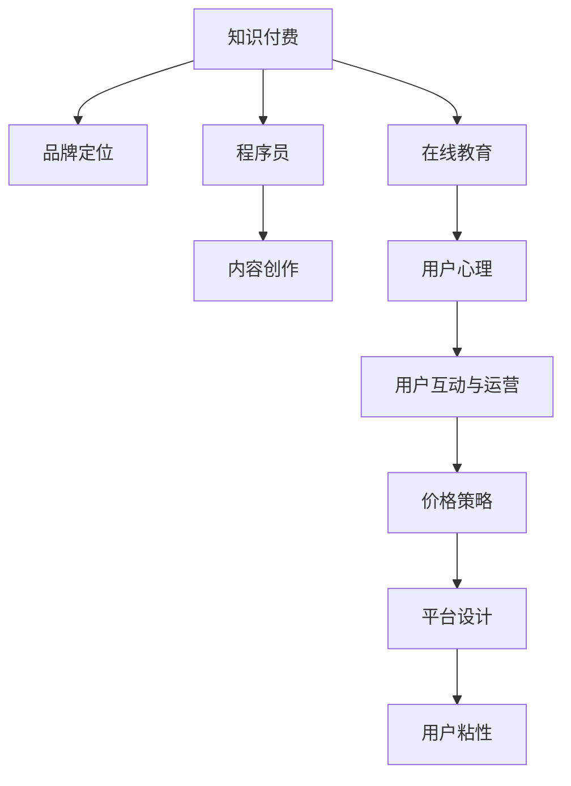

                 

# 程序员的知识付费品牌定位策略

> 关键词：知识付费, 品牌定位, 程序员, 在线教育, 内容创作, 用户心理

## 1. 背景介绍

### 1.1 问题由来
在快速变化的技术环境中，程序员需要不断学习新知识以保持竞争力。然而，许多程序员因为缺乏系统化学习计划，难以在忙碌的工作中找到时间或资源进行深入学习。知识付费平台的兴起为程序员提供了线上学习和自我提升的新途径，但也面临品牌定位不清、用户转化率低等问题。因此，本文旨在探讨如何定位知识付费品牌，提升品牌知名度和用户粘性。

### 1.2 问题核心关键点
知识付费品牌的成功关键在于以下几个方面：
- 明确的品牌定位
- 高质量的内容产出
- 用户友好型平台设计
- 有效的用户互动与运营
- 合理的价格策略

这些要素相互关联，共同构建了知识付费品牌的核心竞争力。本文将从这些关键点出发，系统地探讨如何打造一个成功的程序员知识付费品牌。

## 2. 核心概念与联系

### 2.1 核心概念概述

为更好地理解程序员知识付费品牌定位策略，本节将介绍几个关键概念：

- 知识付费：以付费方式获取知识或技能的在线平台模式，通过内容创作、课程开发等手段获取用户关注和付费。
- 品牌定位：品牌在用户心中建立的核心价值和形象，决定其在市场中的竞争力和用户选择。
- 程序员：从事计算机软件开发、维护、测试等工作的专业人士。
- 在线教育：利用互联网技术进行远程教学和学习的教育模式，方便随时随地学习。
- 内容创作：创作有价值、有吸引力、符合用户需求的学习内容。
- 用户心理：用户在获取知识和技能时，心理需求和行为模式，如学习动机、认同感等。

这些核心概念之间的逻辑关系可以通过以下Mermaid流程图来展示：



这个流程图展示出知识付费品牌定位的核心组成：知识付费平台从程序员群体中汲取内容，通过用户心理分析，制定内容创作、平台设计、价格策略和用户互动运营，最终实现用户粘性和品牌价值的提升。

## 3. 核心算法原理 & 具体操作步骤
### 3.1 算法原理概述

定位一个程序员知识付费品牌，本质上是一个市场调研与数据分析的过程。其核心思想是通过对程序员群体、在线教育市场和用户行为的多维度分析，确定品牌的核心价值和市场定位。

形式化地，设知识付费平台为 $P$，程序员用户群体为 $C$，在线教育市场为 $E$，用户心理为 $P$。品牌定位策略可以表示为：

$$
Positioning(P) = f(C, E, P)
$$

其中 $f$ 为综合分析函数，将程序员群体需求、在线教育市场趋势和用户心理整合分析，生成品牌定位方案。

### 3.2 算法步骤详解

一个典型的知识付费品牌定位步骤如下：

**Step 1: 市场调研**
- 分析在线教育市场趋势，确定热门和新兴的学习领域。
- 调研程序员群体的需求，了解他们的痛点和兴趣点。
- 结合用户心理分析，判断不同内容类型和形式的市场潜力。

**Step 2: 内容策划**
- 根据调研结果，策划符合目标用户需求的内容方向，如深度技术分享、项目实战、行业趋势等。
- 确定内容形式，如视频课程、在线讲座、编程实战等，以适配不同用户偏好。
- 规划内容发布计划，平衡市场响应和用户粘性。

**Step 3: 品牌设计**
- 设计品牌视觉元素，如LOGO、色彩搭配等，建立品牌视觉识别。
- 定义品牌口号和价值观，明确品牌所代表的核心价值。
- 制定内容品牌化策略，将品牌理念融入内容创作和传播。

**Step 4: 平台构建**
- 开发用户友好的在线学习平台，适配PC和移动设备。
- 实现高效的内容管理和用户互动机制，如社区讨论、实时反馈等。
- 提供便捷的支付和购买流程，降低用户购买门槛。

**Step 5: 用户运营**
- 设计精准的用户获取策略，如SEO优化、社交媒体推广等。
- 实施有效的用户留存策略，如会员制度、积分激励等。
- 定期进行用户调研和反馈收集，优化内容和运营策略。

**Step 6: 数据驱动优化**
- 利用数据监控和分析工具，实时跟踪用户行为和内容反馈。
- 根据用户数据，动态调整内容输出和营销策略。
- 定期评估品牌定位和运营效果，进行迭代优化。

### 3.3 算法优缺点

程序员知识付费品牌定位策略的优点包括：
1. 全面覆盖用户需求。通过市场调研和内容策划，能够更精准地满足程序员的学习需求。
2. 提升品牌认知度。通过有效的品牌设计、平台建设和用户运营，快速提升品牌知名度和用户粘性。
3. 市场响应灵活。通过数据驱动优化，能够快速调整策略，应对市场变化和用户反馈。

然而，也存在一些局限性：
1. 初始投入大。品牌建设、内容创作和平台开发都需要大量资金和人力投入。
2. 竞争激烈。程序员知识付费市场已经形成一定的市场格局，新品牌需要付出更多努力才能脱颖而出。
3. 内容质量要求高。高质量的内容是品牌生存的基石，如何保证持续产出高价值内容是重要挑战。

## 4. 数学模型和公式 & 详细讲解 & 举例说明

### 4.1 数学模型构建

品牌定位策略的数学模型可以简化为：

$$
Positioning(P) = g(C, E, P) + h(C, E, P) + i(C, E, P)
$$

其中：
- $g$ 为内容创作得分函数，与程序员群体需求和在线教育市场趋势相关。
- $h$ 为品牌设计得分函数，与用户心理和品牌价值观相关。
- $i$ 为平台设计得分函数，与用户粘性和互动机制相关。

### 4.2 公式推导过程

以 $g$ 函数为例，进行推导：

假设程序员需求为 $D_C$，在线教育市场趋势为 $T_E$，用户心理为 $P_U$，则：

$$
g(C, E, P) = w_C \cdot f(D_C) + w_E \cdot f(T_E) + w_P \cdot f(P_U)
$$

其中 $w$ 为各因子的权重，$f$ 为函数映射，将需求、趋势和心理映射为得分。

推导过程如下：

1. 将需求 $D_C$ 量化为满足度得分 $F_D$
2. 将趋势 $T_E$ 量化为新兴度得分 $F_T$
3. 将心理 $P_U$ 量化为认同度得分 $F_P$
4. 将各得分线性组合，得到最终内容创作得分 $g(C, E, P)$

具体公式推导如下：

$$
F_D = \sum_{i=1}^n D_{iC} \cdot f_i(D_{iC})
$$

$$
F_T = \sum_{j=1}^m T_{jE} \cdot f_j(T_{jE})
$$

$$
F_P = \sum_{k=1}^o P_{kU} \cdot f_k(P_{kU})
$$

$$
g(C, E, P) = \sum_{i=1}^n \alpha_i F_D + \sum_{j=1}^m \beta_j F_T + \sum_{k=1}^o \gamma_k F_P
$$

### 4.3 案例分析与讲解

以Coursera为例，分析其成功的品牌定位策略：

**调研分析**：
- 调研程序员群体的在线学习需求，发现他们对深度学习、大数据、区块链等领域的兴趣较高。
- 分析在线教育市场，发现这些领域有大量的市场需求和新兴趋势。
- 结合用户心理分析，发现程序员用户更加关注课程实用性、就业前景和认证证书。

**内容策划**：
- 围绕需求，策划深度学习、大数据、区块链等热门领域的课程，满足用户兴趣。
- 推出实战项目、微学位等创新形式，提升课程实用性。
- 定期发布行业趋势分析，提供前沿知识，增强用户认同感。

**品牌设计**：
- 设计简洁、专业的视觉形象，突出Coursera的品牌价值。
- 提出“为未来的你提供最好的学习资源”的品牌口号，明确品牌使命。
- 制定内容品牌化策略，课程内容与品牌理念相融合。

**平台构建**：
- 开发用户友好的在线平台，提供便捷的学习体验。
- 实现内容管理系统，方便课程管理和更新。
- 提供支付和证书生成流程，简化用户购买和认证流程。

**用户运营**：
- 利用SEO优化、社交媒体推广等手段，扩大品牌知名度。
- 实施会员制度、积分激励等策略，提升用户粘性。
- 定期收集用户反馈，优化内容和运营策略。

**数据驱动优化**：
- 利用Google Analytics等工具，实时监控用户行为。
- 根据用户数据，动态调整课程内容和推广策略。
- 定期评估品牌定位和运营效果，进行迭代优化。

## 5. 项目实践：代码实例和详细解释说明
### 5.1 开发环境搭建

在进行知识付费平台开发前，我们需要准备好开发环境。以下是使用Python进行Django开发的环境配置流程：

1. 安装Anaconda：从官网下载并安装Anaconda，用于创建独立的Python环境。

2. 创建并激活虚拟环境：
```bash
conda create -n django-env python=3.8 
conda activate django-env
```

3. 安装Django：
```bash
pip install django
```

4. 安装其他必备工具包：
```bash
pip install numpy pandas scikit-learn matplotlib tqdm jupyter notebook ipython
```

完成上述步骤后，即可在`django-env`环境中开始知识付费平台的开发。

### 5.2 源代码详细实现

这里以构建一个简化的在线课程管理平台为例，展示Python+Django的知识付费平台开发过程。

首先，定义课程模型：

```python
from django.db import models

class Course(models.Model):
    title = models.CharField(max_length=255)
    description = models.TextField()
    instructor = models.CharField(max_length=255)
    price = models.DecimalField(max_digits=10, decimal_places=2)
    is_published = models.BooleanField(default=False)
    start_date = models.DateField()

    def __str__(self):
        return self.title
```

然后，定义课程列表视图：

```python
from django.shortcuts import render
from .models import Course

def course_list(request):
    courses = Course.objects.all().order_by('-start_date')
    context = {'courses': courses}
    return render(request, 'course_list.html', context)
```

最后，定义用户注册视图：

```python
from django.contrib.auth.forms import UserCreationForm
from django.shortcuts import render, redirect
from django.contrib.auth import login

def register(request):
    if request.method == 'POST':
        form = UserCreationForm(request.POST)
        if form.is_valid():
            user = form.save()
            login(request, user)
            return redirect('course_list')
    else:
        form = UserCreationForm()
    context = {'form': form}
    return render(request, 'register.html', context)
```

以上代码展示了知识付费平台的基本功能和开发流程。完整的代码实现需要考虑到用户登录、支付、课程发布、用户互动等多个环节，但核心思想与上述示例类似。

### 5.3 代码解读与分析

让我们再详细解读一下关键代码的实现细节：

**Course模型**：
- 定义了课程的基本属性，如标题、描述、讲师、价格、发布状态和发布日期。
- `__str__`方法用于展示课程对象在admin后台的呈现形式。

**course_list视图**：
- 查询数据库中所有课程，并按照发布日期排序。
- 将查询结果传递给模板，并渲染课程列表页面。

**register视图**：
- 处理用户注册请求，验证表单数据并创建新用户。
- 用户登录后重定向到课程列表页面。

这些代码展示了Django的模型定义和视图实现，是构建知识付费平台的基础。开发者可以根据具体需求，扩展用户权限、支付系统、课程发布等高级功能，以满足品牌定位和运营策略。

## 6. 实际应用场景
### 6.1 在线教育平台

程序员知识付费品牌可以应用于在线教育平台，提供系统化学习路径和高质量课程内容，帮助程序员提升技术水平和职业竞争力。

在技术实现上，可以建立课程体系，涵盖基础知识、实战技巧和前沿技术。同时，引入直播授课、实时互动等功能，提升用户体验和互动性。配合课程推荐系统，可以根据用户学习历史和兴趣点，推荐相关课程。如此构建的在线教育平台，能为程序员提供一站式学习服务，加速技能提升和职业发展。

### 6.2 技术社区

知识付费品牌也可以打造为技术社区，以知识分享和互动为核心，形成程序员之间的技术交流和协作平台。

在社区中，可以设立专栏和小组，让有经验的程序员分享技术心得、项目经验和职业发展建议。用户可以通过付费订阅或捐赠积分的方式，获取专属内容和社区内优惠。此外，可以引入导师制度，一对一辅导新手程序员，促进技术传承和知识共享。如此构建的技术社区，不仅能提升用户的技术水平，还能加强程序员间的协作和社群认同感。

### 6.3 职业培训平台

面对企业对高水平程序员的需求，知识付费品牌可以提供定制化的职业培训服务，帮助企业进行员工技能提升。

在平台中，可以设计不同难度的课程，满足不同层次和技术背景的员工需求。同时，引入企业内部数据和知识库，提供定制化的培训方案，帮助企业快速培养符合需求的技术人才。此外，可以提供在线考评和认证体系，为培训效果提供保障。如此构建的职业培训平台，能有效提升企业的人才培养效率，满足市场对高素质人才的需求。

### 6.4 未来应用展望

随着知识付费品牌的不断发展，未来将在更多领域得到应用，为技术人才的培养和创新提供新的方向：

1. 智能教育：结合AI和机器学习技术，提供个性化学习建议和智能推荐，提升学习效果。
2. 内容生产：构建知识生产者生态，鼓励高质量内容的创作和传播，推动知识更新和传承。
3. 企业培训：为企业提供定制化的培训服务，提升员工技术水平和团队协作能力。
4. 开源项目：建立开源项目合作平台，推动技术创新和社区协作，加速技术进步。
5. 在线学习认证：为课程和技能提供认证体系，提升学习质量和就业竞争力。

相信随着知识付费品牌的不断成熟，其在技术教育和人才培训中的应用将更加广泛，成为推动技术进步的重要力量。

## 7. 工具和资源推荐
### 7.1 学习资源推荐

为了帮助开发者掌握知识付费品牌的开发和运营策略，这里推荐一些优质的学习资源：

1. Udemy《Knowledge-Based Business》课程：讲解知识付费业务的理论基础和实践策略，适合新入门的开发者。
2. Coursera《Data Science in Practice》课程：深入理解数据分析和知识管理，帮助品牌制定有效的用户互动和运营策略。
3. LinkedIn Learning《Content Strategy for Businesses》课程：学习内容创作和品牌建设的方法，提升品牌定位和内容产出能力。
4. Google Analytics官方文档：掌握网站数据分析工具，实时监控用户行为和平台运营效果。
5. GitHub开源项目：如GitHub Learning Lab，提供免费的技术学习资源，帮助开发者提升编程技能。

通过对这些资源的学习实践，相信你一定能够系统掌握知识付费品牌开发的精髓，并用于解决实际的业务问题。
###  7.2 开发工具推荐

高效的开发离不开优秀的工具支持。以下是几款用于知识付费品牌开发的常用工具：

1. Django：基于Python的高级Web框架，灵活扩展和定制化，适合构建复杂的在线平台。
2. Flask：轻量级Web框架，易于上手和部署，适合快速原型开发和微服务架构。
3. React：用于构建交互式的用户界面，提升用户体验和页面响应速度。
4. Vue.js：前端框架，提供强大的组件化开发和状态管理能力，适合构建复杂的页面应用。
5. Node.js：非阻塞I/O事件驱动的运行环境，适合构建高性能的Web应用和实时服务。

合理利用这些工具，可以显著提升知识付费平台的开发效率，加快创新迭代的步伐。

### 7.3 相关论文推荐

知识付费品牌的成功需要系统化的研究支持。以下是几篇奠基性的相关论文，推荐阅读：

1. 《Predictive Analytics: Prescriptive and Prescriptive Analytics》论文：通过数据分析和预测，提升知识付费平台的运营效果。
2. 《Customer Lifetime Value (CLV): A Tool for Measuring the Long-Term Value of a Customer》论文：探讨如何通过用户生命周期价值分析，优化品牌定价和用户留存策略。
3. 《A Study on User Behavior in Online Learning Platforms》论文：研究用户行为特征，优化内容推荐和互动机制。
4. 《Content Strategy in Digital Marketing: An Overview》论文：深入分析内容策略对品牌定位和用户获取的影响。
5. 《How Online Education Improves Learning Outcomes》论文：探讨在线教育对学习效果和知识保留率的提升作用。

这些论文代表了大规模知识付费品牌开发和运营的理论基础，通过学习这些前沿成果，可以帮助品牌制定更加科学和有效的运营策略。

## 8. 总结：未来发展趋势与挑战
### 8.1 总结

本文对程序员知识付费品牌的定位策略进行了全面系统的探讨。首先阐述了知识付费品牌的核心价值和市场机会，明确了品牌定位在技术教育、社区建设、职业培训等各个领域的重要意义。其次，从市场调研、内容策划、品牌设计、平台构建、用户运营等多个环节，详细讲解了品牌定位的具体操作步骤和关键要素。最后，本文还探讨了知识付费品牌在实际应用中的广泛场景，以及未来的发展趋势和面临的挑战。

通过本文的系统梳理，可以看到，知识付费品牌定位是一个复杂但系统的工程，需要综合考虑市场、用户、内容等多个因素。只有在各个环节进行全面优化，才能真正实现品牌价值的最大化。

### 8.2 未来发展趋势

展望未来，知识付费品牌将在以下几个方面取得新的突破：

1. 个性化推荐：通过大数据和机器学习技术，实现个性化课程推荐，提升学习效果和用户体验。
2. 内容共创：引入用户生成内容，丰富课程体系，提升用户参与感和品牌粘性。
3. 多平台联动：通过跨平台协作，形成知识生态，提升品牌影响力和用户覆盖面。
4. 技术创新：引入AR/VR、区块链等前沿技术，提供沉浸式学习体验和去中心化内容分发。
5. 社会责任：关注社会责任，推动技术教育和知识传播，提升品牌社会价值。

这些趋势将使知识付费品牌在技术教育和人才培训中发挥更大的作用，成为推动社会进步的重要力量。

### 8.3 面临的挑战

尽管知识付费品牌在技术教育和人才培训中具有巨大的潜力，但在实际运营中也面临诸多挑战：

1. 内容质量管理：如何保证高质量内容的持续产出，避免低质量内容损害品牌声誉。
2. 用户数据保护：如何确保用户隐私和数据安全，避免用户数据泄露和滥用。
3. 市场竞争加剧：随着知识付费市场的发展，新品牌的不断涌现，如何保持竞争优势。
4. 运营成本高昂：知识付费品牌的建立和运营需要大量资金和资源投入，如何实现可持续运营。
5. 用户粘性维护：如何通过互动和运营策略，持续提升用户粘性，避免用户流失。

这些挑战需要品牌方从内容、技术、市场、运营等多个维度进行综合应对，才能在竞争激烈的市场中脱颖而出。

### 8.4 研究展望

面对知识付费品牌的未来发展，未来的研究需要重点关注以下几个方面：

1. 内容质量提升：探索如何通过算法优化和人工干预，提升内容创作和审核效率。
2. 数据安全保障：研究如何利用区块链等技术，确保用户数据的安全和隐私。
3. 社会影响力：探索如何通过知识付费品牌，推动技术教育和知识传播，提升社会价值。
4. 多模态学习：结合多种学习方式，如视频、音频、互动等，提升学习效果和用户体验。
5. 社区协作机制：研究如何通过社区建设，形成知识生态和用户协作网络。

这些方向的研究将为知识付费品牌的发展提供新的思路和动力，推动其向更加智能化、普适化方向演进。总之，知识付费品牌需要不断创新和优化，才能在快速变化的技术环境中持续发展和壮大。

## 9. 附录：常见问题与解答

**Q1：知识付费平台的用户获取和转化率低，如何提升？**

A: 提升用户获取和转化率的关键在于精准的用户定位和有效的运营策略：
1. 精准营销：通过数据分析，找到目标用户群体的特征和需求，制定定向推广策略。
2. 内容质量：提供高质量、实用性强的内容，提升用户满意度和转化率。
3. 用户互动：设计互动性强的内容形式，如直播、社区讨论等，增加用户粘性。
4. 优惠策略：通过免费试用、限时折扣等优惠策略，吸引用户尝试和购买。

**Q2：如何评估知识付费平台的运营效果？**

A: 运营效果的评估可以从多个维度进行：
1. 用户增长：关注新用户数、活跃用户数、留存率等指标，评估用户获取和粘性。
2. 内容反馈：通过用户评论、评分等反馈，评估内容质量和用户满意度。
3. 财务指标：关注收入、毛利率、课程销售转化率等财务指标，评估运营效益。
4. 用户行为：利用行为数据分析工具，跟踪用户行为路径，优化内容和运营策略。
5. 品牌认知度：通过问卷调查、社交媒体分析等手段，评估品牌知名度和用户认可度。

**Q3：知识付费平台如何引入用户生成内容？**

A: 引入用户生成内容（UGC）可以丰富课程体系，提升用户参与感：
1. 内容提交平台：设计简单易用的内容提交界面，鼓励用户上传技术心得、实战项目等。
2. 内容审核机制：建立严格的内容审核流程，筛选高质量的UGC内容。
3. 社区互动：在社区中设立UGC专区，鼓励用户交流和分享，形成知识共享社区。
4. 激励机制：设计激励措施，如UGC发布者认证、积分奖励等，提升用户积极性。

**Q4：如何构建知识付费平台的社区？**

A: 构建知识付费平台的社区需要从以下几个方面入手：
1. 社区规划：明确社区的目标和功能，设计社区结构和模块。
2. 用户激励：设计积分系统、认证体系等，激励用户积极参与社区互动。
3. 互动机制：提供评论、点赞、分享等互动功能，提升用户参与度。
4. 社区管理：建立管理员团队，规范社区行为，处理争议和违规内容。
5. 社区活动：定期举办技术分享、讨论会等活动，提升社区活跃度。

**Q5：知识付费平台的商业模式有哪些？**

A: 知识付费平台的商业模式主要包括：
1. 订阅制：用户购买年卡或月卡，获取所有课程和资源。
2. 按需付费：用户按课程或技能购买，一次付费多次学习。
3. 内容付费：提供高价值内容或专属学习资源，用户单次付费获取。
4. 广告和佣金：通过平台广告和内容推荐，获取流量和收益。
5. 企业合作：与企业合作，提供定制化培训和课程开发服务。

**Q6：知识付费平台如何构建用户粘性？**

A: 构建用户粘性需要从多个方面进行：
1. 优质内容：提供高质量、实用性强的课程内容，满足用户需求。
2. 互动体验：设计良好的互动机制，如实时问答、社区讨论等，提升用户体验。
3. 社区氛围：构建活跃的社区环境，促进用户间的交流和互动。
4. 个性化推荐：利用大数据和算法优化，提供个性化的学习建议和推荐。
5. 奖励机制：设计积分奖励、排行榜等机制，激励用户持续参与。

这些策略的组合实施，能显著提升知识付费平台的用户粘性，形成稳定的用户群体，推动品牌持续发展。

---

作者：禅与计算机程序设计艺术 / Zen and the Art of Computer Programming

