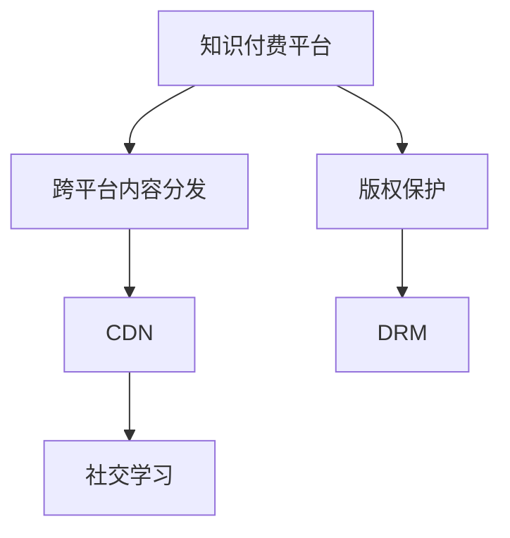

                 

# 程序员的知识付费跨平台内容策略

在当今数字化、互联网化的时代，程序员的知识付费模式正逐渐成为行业内的常态。这种模式不仅有助于提高程序员的技能水平，推动技术进步，还为平台和内容创作者创造了新的盈利模式。本文旨在探讨程序员知识付费跨平台内容策略的核心概念、实施步骤、以及未来发展趋势，旨在为有意于进入这一领域的开发者、平台和机构提供指导。

## 1. 背景介绍

### 1.1 问题由来

随着技术的发展，程序员技能更新迭代的速度加快，单纯依靠企业内部培训或自学已无法满足日益变化的市场需求。知识付费平台的出现，为程序员提供了一种快速获取新技术、新知识的途径，同时也为平台和内容创作者创造了一条新的盈利渠道。然而，跨平台知识付费的实施面临诸多挑战，如内容质量、用户体验、支付机制等，需要系统的策略和方法来指导。

### 1.2 问题核心关键点

知识付费的核心在于内容的质量和价值，跨平台则关注内容的传播和分发。平台方需要确保内容的权威性和多样性，创造优质的学习体验；而内容创作者则需要精炼内容，提供实用、易懂的教学方法。此外，还需要建立一套高效的支付和分发机制，保障各方利益。

## 2. 核心概念与联系

### 2.1 核心概念概述

- **知识付费平台**：提供在线课程、技术文档、问答服务等内容，收费模式包括单次购买、订阅制、按需支付等，旨在提升用户技能，同时为创作者提供收益。
- **跨平台内容**：同一套课程或教学资源，可以在多个平台同时发布，如Web端、移动端、社交媒体等，以覆盖更广泛的受众。
- **内容分发网络(CDN)**：利用分布式服务器网络，快速分发内容到全球各地，提升用户体验。
- **版权保护**：通过技术手段（如DRM），防止内容被盗版，保护创作者权益。
- **社交学习**：通过社群讨论、在线互动等方式，提升学习效果，增强社区粘性。

### 2.2 核心概念原理和架构的 Mermaid 流程图



该流程图展示了知识付费平台的核心组件及其相互关系。平台负责聚合和管理内容，分发网络负责内容分发，版权保护和社交学习则分别从技术和管理层面保障内容质量和学习效果。

## 3. 核心算法原理 & 具体操作步骤

### 3.1 算法原理概述

跨平台知识付费的内容策略主要围绕内容的质量控制、分发效率和用户互动展开。核心算法包括：

- **内容推荐算法**：利用机器学习模型，根据用户行为和兴趣推荐适合的学习资源。
- **用户行为分析**：通过数据分析，了解用户的学习进度和效果，优化课程设计和教学方法。
- **多平台同步更新**：设计跨平台内容同步机制，保证各平台上的内容一致性。
- **互动评估系统**：构建用户互动评估体系，通过问答、测验等手段，提升学习效果。

### 3.2 算法步骤详解

#### 3.2.1 内容推荐算法

1. **数据收集**：收集用户的历史浏览记录、学习时长、评价反馈等数据。
2. **模型训练**：基于收集的数据，训练推荐模型，如协同过滤、内容过滤、混合过滤等。
3. **推荐生成**：根据用户当前行为，实时生成推荐内容。

#### 3.2.2 用户行为分析

1. **数据采集**：通过日志、API等方式，获取用户行为数据。
2. **特征提取**：从数据中提取有用的特征，如学习时间、完成度、评论等。
3. **模型训练**：使用统计学习、深度学习等方法，建立行为预测模型。
4. **行为分析**：根据模型预测结果，优化课程设计，提升学习效果。

#### 3.2.3 多平台同步更新

1. **数据同步**：建立各平台间的数据同步机制，确保内容一致性。
2. **API调用**：设计统一API接口，支持跨平台内容的更新和查询。
3. **版本控制**：采用版本控制系统，保证每次更新的一致性和可靠性。

#### 3.2.4 互动评估系统

1. **评估内容**：设计测试题目、问答互动等形式，评估用户学习效果。
2. **结果反馈**：根据评估结果，调整教学方法和课程内容。
3. **互动机制**：引入论坛、社区等互动功能，增强学习氛围。

### 3.3 算法优缺点

#### 3.3.1 优点

- **规模效应**：跨平台内容可以覆盖更多用户，实现规模化效益。
- **用户粘性**：统一的课程内容和互动平台，提升用户粘性和忠诚度。
- **灵活性**：可以根据用户反馈和行为数据，快速调整和优化课程内容。

#### 3.3.2 缺点

- **内容同步复杂**：多平台同步更新需要高效的协调机制和技术支持。
- **内容质量参差不齐**：不同平台的内容质量可能存在差异，需要统一管理和审查。
- **用户隐私问题**：跨平台内容分发和互动可能涉及用户隐私问题，需要妥善处理。

### 3.4 算法应用领域

跨平台知识付费的内容策略广泛应用于教育、科技、金融等行业，包括：

- **在线教育**：如Coursera、Udacity等平台，提供大量编程、数据分析等课程。
- **技术培训**：如腾讯云、阿里云等提供的技术培训课程。
- **专业认证**：如AWS、微软认证等，通过知识付费实现专业技能认证。
- **金融教育**：如华尔街见闻、券商研报等，提供金融市场分析、投资策略等课程。

## 4. 数学模型和公式 & 详细讲解 & 举例说明

### 4.1 数学模型构建

知识付费平台的核心数学模型包括用户行为模型、推荐模型和互动评估模型。以下分别介绍这些模型的构建方式。

#### 4.1.1 用户行为模型

用户行为模型旨在预测用户的行为和兴趣，通常采用协同过滤和内容过滤算法。协同过滤算法利用用户之间的相似度，推荐相似用户喜欢的内容。内容过滤算法则直接根据内容的特征和用户兴趣进行推荐。

设用户集合为 $U$，物品集合为 $I$，用户对物品的评分矩阵为 $R \in \mathbb{R}^{m \times n}$，其中 $m$ 为用户数量，$n$ 为物品数量。用户行为模型可表示为：

$$
R = \sum_{i=1}^{m} \sum_{j=1}^{n} u_i v_j r_{ij}
$$

其中 $u_i, v_j$ 分别为用户和物品的特征向量，$r_{ij}$ 为物品 $j$ 对用户 $i$ 的评分。

#### 4.1.2 推荐模型

推荐模型通常基于矩阵分解技术，将用户和物品的评分矩阵分解为两个低维矩阵，从而得到用户和物品的潜在特征表示。

设 $X \in \mathbb{R}^{m \times k}$ 为用户特征矩阵，$Y \in \mathbb{R}^{n \times k}$ 为物品特征矩阵，用户对物品的评分预测公式为：

$$
\hat{r}_{ij} = \sum_{p=1}^{k} u_{ip} v_{pj}
$$

其中 $u_{ip}, v_{pj}$ 分别为用户和物品的潜在特征向量。

#### 4.1.3 互动评估模型

互动评估模型通常基于问答系统，通过用户互动回答，评估学习效果。设用户 $i$ 在问题 $j$ 上的回答为 $a_{ij} \in \{0,1\}$，表示回答正确与否。互动评估模型可表示为：

$$
\hat{a}_{ij} = \sum_{p=1}^{k} u_{ip} v_{pj}
$$

其中 $u_{ip}, v_{pj}$ 分别为用户和问题的潜在特征向量。

### 4.2 公式推导过程

#### 4.2.1 用户行为模型推导

基于协同过滤算法，用户行为模型可以表示为：

$$
R = \sum_{i=1}^{m} \sum_{j=1}^{n} u_i v_j r_{ij}
$$

设用户 $i$ 对物品 $j$ 的评分预测值为 $\hat{r}_{ij}$，则推荐公式为：

$$
\hat{r}_{ij} = \sum_{p=1}^{k} u_{ip} v_{pj}
$$

其中 $u_{ip}, v_{pj}$ 分别为用户和物品的潜在特征向量。

#### 4.2.2 推荐模型推导

推荐模型基于矩阵分解技术，将用户和物品的评分矩阵分解为两个低维矩阵，从而得到用户和物品的潜在特征表示。推荐公式为：

$$
\hat{r}_{ij} = \sum_{p=1}^{k} u_{ip} v_{pj}
$$

其中 $u_{ip}, v_{pj}$ 分别为用户和物品的潜在特征向量。

#### 4.2.3 互动评估模型推导

互动评估模型基于问答系统，通过用户互动回答，评估学习效果。互动评估公式为：

$$
\hat{a}_{ij} = \sum_{p=1}^{k} u_{ip} v_{pj}
$$

其中 $u_{ip}, v_{pj}$ 分别为用户和问题的潜在特征向量。

### 4.3 案例分析与讲解

以在线教育平台Coursera为例，其跨平台内容策略如下：

1. **内容聚合**：Coursera从各大知名高校和机构引进优质课程，并提供专业的课程设计和评估。
2. **跨平台分发**：Coursera在Web、移动端、社交媒体等平台上同时发布课程，确保用户可以随时随地学习。
3. **互动评估**：Coursera通过论坛、测验等互动机制，及时获取用户反馈，调整课程内容。
4. **版权保护**：Coursera通过DRM技术保护课程内容，防止盗版和侵权行为。

## 5. 项目实践：代码实例和详细解释说明

### 5.1 开发环境搭建

在开发跨平台知识付费平台时，需要考虑以下开发环境：

1. **编程语言**：Python是常用的开发语言，具有丰富的第三方库和框架支持。
2. **框架**：Django、Flask等Web框架，用于构建后端API和数据库。
3. **数据库**：MySQL、PostgreSQL等关系型数据库，用于存储用户行为数据和课程内容。
4. **分布式缓存**：Redis、Memcached等缓存技术，用于提升数据查询速度。
5. **内容分发**：CDN服务，如阿里云CDN、AWS CloudFront等，用于跨平台内容分发。
6. **安全性**：HTTPS、JWT等安全措施，确保数据传输安全。

### 5.2 源代码详细实现

以下是一个基于Django框架的跨平台知识付费平台代码实现示例：

```python
from django.views.decorators.csrf import csrf_exempt
from django.http import JsonResponse
from .models import User, Course
from .serializers import UserSerializer, CourseSerializer

@csrf_exempt
def user_detail(request):
    if request.method == 'GET':
        user = User.objects.get(id=request.GET.get('id'))
        serializer = UserSerializer(user)
        return JsonResponse(serializer.data)
    elif request.method == 'POST':
        serializer = UserSerializer(data=request.POST)
        if serializer.is_valid():
            serializer.save()
            return JsonResponse(serializer.data, status=201)
        return JsonResponse(serializer.errors, status=400)
```

### 5.3 代码解读与分析

上述代码实现了用户详情的API接口，支持GET和POST方法。用户详情通过GET请求获取，POST请求用于创建新用户。代码中使用了Django的视图装饰器和序列化器，简化了API的开发过程。

## 6. 实际应用场景

### 6.1 智能教育

跨平台知识付费平台在智能教育领域的应用场景包括：

- **在线编程培训**：如LeetCode、Codecademy等平台，提供编程语言、算法等课程。
- **在线证书课程**：如Coursera、edX等平台，提供各高校和机构的专业证书课程。
- **职业培训**：如LinkedIn Learning、Udemy等平台，提供各类职业技能培训课程。

### 6.2 技术培训

跨平台知识付费平台在技术培训领域的应用场景包括：

- **云服务培训**：如阿里云、腾讯云等平台，提供云服务相关的课程。
- **数据分析培训**：如Kaggle、DataCamp等平台，提供数据分析、数据科学等课程。
- **软件开发培训**：如Pluralsight、Lynda等平台，提供软件开发、测试等课程。

### 6.3 专业认证

跨平台知识付费平台在专业认证领域的应用场景包括：

- **IT认证**：如AWS、微软认证等，通过知识付费实现专业技能认证。
- **金融认证**：如CFA、FRM等，提供金融市场分析、投资策略等课程。
- **医学认证**：如AMA、ACGME等，提供医学知识、临床技能等课程。

## 7. 工具和资源推荐

### 7.1 学习资源推荐

- **Coursera、edX等在线教育平台**：提供大量优质的课程资源和认证机制。
- **LeetCode、Codecademy等编程平台**：提供编程语言、算法等课程，支持在线练习。
- **Kaggle、DataCamp等数据科学平台**：提供数据科学、数据分析等课程，支持数据集下载和比赛。
- **GitHub等开源社区**：提供开源代码和项目，支持学习和实践。

### 7.2 开发工具推荐

- **Django、Flask等Web框架**：用于构建后端API和数据库。
- **MySQL、PostgreSQL等关系型数据库**：用于存储用户行为数据和课程内容。
- **Redis、Memcached等分布式缓存**：用于提升数据查询速度。
- **阿里云CDN、AWS CloudFront等CDN服务**：用于跨平台内容分发。
- **JWT等安全措施**：确保数据传输安全。

### 7.3 相关论文推荐

- **深度学习与推荐系统**：探讨深度学习在推荐系统中的应用。
- **在线教育平台研究**：分析在线教育平台的用户行为和内容推荐算法。
- **知识付费平台研究**：研究知识付费平台的商业模式和运营策略。

## 8. 总结：未来发展趋势与挑战

### 8.1 研究成果总结

跨平台知识付费平台已经展示了其在提升用户技能、推动技术进步方面的巨大潜力。基于推荐算法、用户行为分析、跨平台分发等多项技术，该平台在教育、科技、金融等领域得到了广泛应用。

### 8.2 未来发展趋势

未来跨平台知识付费平台将呈现以下发展趋势：

1. **AI驱动的个性化推荐**：利用AI技术，根据用户行为和兴趣，提供更加个性化的课程推荐。
2. **多模态学习**：结合文本、图像、视频等多模态信息，提升学习效果。
3. **混合学习**：结合在线学习和线下培训，提升学习效果和用户体验。
4. **社交学习**：通过社群讨论、在线互动等方式，提升学习效果，增强社区粘性。
5. **虚拟现实**：结合VR技术，提供沉浸式学习体验，增强学习效果。

### 8.3 面临的挑战

尽管跨平台知识付费平台具有广阔的应用前景，但在实现过程中仍面临诸多挑战：

1. **内容质量控制**：确保课程内容和教学方法的高质量，提升用户学习效果。
2. **平台间的技术协同**：多平台间的技术兼容和内容同步，需要高效的协调机制。
3. **用户隐私保护**：跨平台内容分发和互动可能涉及用户隐私问题，需要妥善处理。
4. **商业模式可持续性**：如何平衡平台方、内容创作者和用户的利益，需要长期的商业模式设计。

### 8.4 研究展望

未来的研究需要重点关注以下方向：

1. **内容优化**：如何通过数据驱动的方法，优化课程内容和教学方法，提升学习效果。
2. **技术创新**：如何结合AI、VR等前沿技术，提升学习体验和效果。
3. **平台协同**：如何通过技术手段，实现多平台间的无缝协作和数据共享。
4. **商业模型**：如何设计可持续的商业模式，平衡各方利益，推动平台长期发展。

## 9. 附录：常见问题与解答

**Q1：如何确保跨平台内容的质量？**

A: 平台方可以通过多维度评价体系，确保课程和教学方法的高质量。例如，邀请行业专家进行课程审核，收集用户反馈，定期更新课程内容。

**Q2：跨平台内容分发如何保障数据同步？**

A: 采用统一的API接口和版本控制系统，确保各平台上的内容一致性。例如，使用Git进行版本控制，API接口统一调用。

**Q3：如何提升跨平台学习效果？**

A: 引入互动评估机制，通过问答、测验等方式，及时获取用户反馈，调整课程内容。例如，设计互动题目，进行即时评估，根据结果调整教学方法。

**Q4：如何处理跨平台内容的用户隐私问题？**

A: 采用匿名化处理、数据加密等技术手段，保护用户隐私。例如，对用户数据进行脱敏处理，使用HTTPS加密传输数据。

**Q5：跨平台知识付费平台的商业模式如何设计？**

A: 平衡平台方、内容创作者和用户的利益，设计可持续的商业模式。例如，采用订阅制、按需支付等灵活的收费方式，保障各方利益。

---

作者：禅与计算机程序设计艺术 / Zen and the Art of Computer Programming

