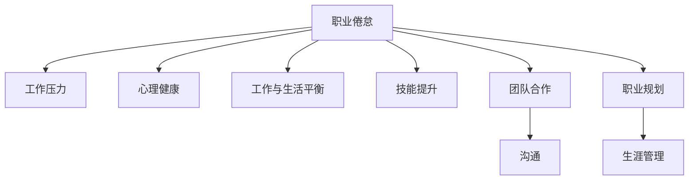

                 

# 程序员的职业倦怠：预防与应对

> 关键词：职业倦怠, 预防策略, 压力管理, 工作与生活平衡, 心理调整

## 1. 背景介绍

### 1.1 问题由来
程序员作为信息时代最核心的工作群体之一，承担着技术创新和产品开发的重任。然而，随着科技行业的快速发展，程序员的工作压力不断增大，普遍面临职业倦怠的问题。职业倦怠不仅影响个人身心健康，也会阻碍企业团队的发展。

职业倦怠的典型表现包括工作满意度下降、消极情绪增加、工作效率降低等。这些问题不仅影响程序员的个人生活和职业发展，还可能导致项目延期、产品质量下降等严重后果。因此，职业倦怠的预防和应对成为了IT行业关注的重要课题。

### 1.2 问题核心关键点
职业倦怠的预防和应对主要关注以下几个核心关键点：

- **工作压力与心理健康**：工作压力是职业倦怠的主要诱因之一，如何通过合理的压力管理，保持心理健康至关重要。
- **工作与生活平衡**：时间管理、家庭关系等生活因素对职业倦怠也有重要影响，找到工作与生活的平衡点是缓解倦怠的关键。
- **技能提升与发展机会**：持续的技能提升和发展机会能够增加工作的动力，帮助克服职业倦怠。
- **团队合作与沟通**：良好的团队合作和沟通能够减少误解和冲突，提升整体工作效率。
- **职业规划与生涯管理**：清晰的目标和规划能够提供方向感，帮助抵御职业倦怠。

### 1.3 问题研究意义
研究职业倦怠的预防与应对方法，对于保障程序员的身心健康、提升工作效率、促进企业团队的发展具有重要意义：

- **保障个人健康**：通过预防和应对职业倦怠，保障程序员的身体和心理健康，防止职业病的发生。
- **提高工作效率**：通过合理的工作压力管理和时间安排，提升个人和团队的效率，降低项目延期和质量问题的发生。
- **促进职业发展**：通过技能提升和发展机会，增加职业满足感，提升职业认同感和成就感。
- **增强团队凝聚力**：通过良好的团队合作和沟通，增强团队凝聚力，提升团队的工作动力和创新能力。
- **支持长期发展**：通过职业规划和生涯管理，帮助程序员制定长期发展目标，保持职业持续发展的动力。

## 2. 核心概念与联系

### 2.1 核心概念概述

为更好地理解职业倦怠的预防与应对方法，本节将介绍几个密切相关的核心概念：

- **职业倦怠**：指长期工作压力和身心负荷超过个人承受极限，导致心理和生理状态恶化，影响工作表现和个人生活的一种心理状态。
- **工作压力**：指工作中面临的任务、目标、时间限制等要素对个人的心理和生理造成的压力。
- **心理健康**：指个体的心理状态良好，能够保持积极、平衡的心态，具备良好的适应性和应对能力。
- **工作与生活平衡**：指在工作和家庭、休闲等生活方面，找到恰当的平衡点，避免工作过度侵占个人生活时间。
- **技能提升**：指通过培训、学习等方式，提高个人的专业技能和综合素质，增加工作满足感和职业发展机会。
- **团队合作**：指在团队中，成员间相互协作，共同完成任务，实现共赢。
- **沟通**：指在团队和组织中，通过有效的信息交流，消除误解，促进理解和合作。
- **职业规划**：指个体根据自身兴趣、能力和职业目标，制定的长远职业发展计划。
- **生涯管理**：指对个人职业生涯进行系统的规划和管理，确保职业发展路径清晰、目标明确。

这些核心概念之间的逻辑关系可以通过以下Mermaid流程图来展示：



这个流程图展示了几大核心概念的相互关系：

1. 职业倦怠受工作压力、心理健康、工作与生活平衡、技能提升、团队合作、沟通、职业规划和生涯管理等多方面因素影响。
2. 工作压力和心理健康是职业倦怠的主要诱因之一，需要通过合理的压力管理和心理健康维护来缓解。
3. 工作与生活平衡和技能提升能够增加工作的动力和满足感，有助于预防职业倦怠。
4. 团队合作和沟通能够提升团队协作效率，减少误解和冲突，增强团队凝聚力。
5. 职业规划和生涯管理能够提供方向感，帮助抵御职业倦怠。

## 3. 核心算法原理 & 具体操作步骤
### 3.1 算法原理概述

预防和应对职业倦怠的策略，本质上是一个心理和行为的调整过程。其核心思想是：通过合理的压力管理、工作与生活平衡、技能提升、团队合作、沟通、职业规划和生涯管理，逐步调整个人和团队的心理和行为，使其从倦怠状态恢复，重新充满活力。

具体来说，预防和应对职业倦怠的步骤包括：

1. **评估现状**：通过自我评估和团队反馈，识别职业倦怠的具体表现和原因。
2. **制定计划**：根据评估结果，制定个性化的预防和应对策略。
3. **实施策略**：将策略付诸行动，如时间管理、压力管理、技能培训、团队合作等。
4. **监测进展**：定期评估策略实施效果，根据反馈进行调整。

### 3.2 算法步骤详解

以下是具体的步骤和方法：

**Step 1: 自我评估**

自我评估是识别职业倦怠的第一步。可以通过以下方法进行：

- **情绪问卷**：使用职业倦怠情绪问卷（如Burnout Measure of Emotional Exhaustion，BEE）来评估自己的情绪状态。
- **工作满意度**：记录自己对工作的满意度和不满之处，包括任务难度、工作环境、人际关系等。
- **身体健康**：评估自己的身体健康状况，如疲劳程度、睡眠质量、饮食情况等。

**Step 2: 制定个性化策略**

根据评估结果，制定个性化的策略，可以分为以下几个方面：

- **时间管理**：使用时间管理工具（如Trello、Asana）规划每日和每周的工作任务，避免过度工作。
- **压力管理**：采用冥想、呼吸练习、瑜伽等方法，缓解心理压力。
- **心理健康**：建立心理支持网络，如心理咨询、同事支持等，帮助缓解压力。
- **技能提升**：参加培训、学习新技术，提升自身竞争力，增加职业满足感。
- **工作与生活平衡**：合理安排工作和休闲时间，确保有足够的时间陪伴家人和朋友。
- **团队合作**：增强团队合作意识，建立良好的团队关系，共同解决问题。
- **沟通**：提高沟通技巧，避免误解和冲突，增强团队协作效率。
- **职业规划**：制定长期职业发展目标，规划未来的职业路径。
- **生涯管理**：定期评估职业发展状态，适时调整职业目标和策略。

**Step 3: 实施与调整**

在制定好策略后，需要逐步实施并根据反馈进行调整：

- **定期评估**：每个月或每季度评估一次策略实施效果，记录情绪变化、工作效率等指标。
- **反馈机制**：建立反馈机制，收集团队成员的意见和建议，及时调整策略。
- **持续改进**：根据评估结果和反馈，持续改进策略，确保其有效性和适用性。

### 3.3 算法优缺点

职业倦怠的预防和应对方法具有以下优点：

1. **系统性**：通过系统的评估和策略制定，全面覆盖职业倦怠的各个方面。
2. **个性化**：根据个人和团队的实际情况，制定个性化的策略，提高策略的有效性。
3. **预防性**：提前识别和应对职业倦怠，避免问题进一步恶化。
4. **提升效率**：通过合理的工作压力管理和时间安排，提升个人和团队的效率。
5. **促进发展**：通过技能提升和发展机会，增强职业满足感和成就感。
6. **增强团队凝聚力**：通过良好的团队合作和沟通，增强团队凝聚力和工作效率。

同时，该方法也存在一定的局限性：

1. **执行难度**：制定和实施策略需要时间和精力，可能对日常工作产生一定影响。
2. **效果依赖**：策略实施效果受个人和团队的执行情况、外部环境等多种因素影响，无法保证立竿见影。
3. **个体差异**：不同人对于职业倦怠的表现和应对方法可能不同，需要灵活调整策略。
4. **资源投入**：部分策略（如心理支持、培训）可能需要额外资源，增加了实施成本。

尽管存在这些局限性，但职业倦怠的预防和应对方法仍是目前较为系统且行之有效的手段，值得IT行业持续关注和实践。

### 3.4 算法应用领域

职业倦怠的预防和应对方法，已经在IT行业得到了广泛的应用，涵盖了多个职业倦怠高发领域，例如：

- **软件开发**：软件开发团队面临高压力和高风险，常常出现职业倦怠问题。通过合理的工作压力管理和团队合作，可以有效缓解职业倦怠。
- **产品经理**：产品经理负责项目管理和团队协调，需要处理多方面的复杂问题，容易出现压力过大的情况。通过时间管理和心理健康维护，可以减轻职业倦怠。
- **系统运维**：系统运维工作需要24小时值班，工作时间和休息时间难以区分，容易导致身心疲劳。通过工作与生活平衡和压力管理，可以有效预防职业倦怠。
- **测试工程师**：测试工作需要长时间重复执行各种测试任务，容易出现重复性劳动导致的心理疲劳。通过技能提升和职业规划，可以增加工作的满足感和成就感。
- **运筹分析师**：运筹分析师需要进行数据分析和模型优化，面临复杂的技术挑战和快速变化的市场环境，容易导致职业倦怠。通过沟通和团队合作，可以增强工作动力和创新能力。

## 4. 数学模型和公式 & 详细讲解
### 4.1 数学模型构建

职业倦怠的预防和应对方法，涉及多个心理和行为指标的评估和管理。为便于量化和优化，可以使用以下数学模型进行建模：

设职业倦怠程度为 $E$，工作压力为 $P$，心理健康为 $H$，工作与生活平衡为 $W$，技能提升为 $S$，团队合作为 $C$，沟通为 $C$，职业规划为 $J$，生涯管理为 $M$。则预防和应对职业倦怠的优化目标可以表示为：

$$
\min E = f(P, H, W, S, C, J, M)
$$

其中，$f$ 为综合评估函数，通过多个指标的权重系数，计算出职业倦怠的综合值 $E$。权重系数可以根据实际情况进行调整。

### 4.2 公式推导过程

假设 $E = w_1P + w_2H + w_3W + w_4S + w_5C + w_6J + w_7M$，则优化目标可以表示为：

$$
\min E = \min (w_1P + w_2H + w_3W + w_4S + w_5C + w_6J + w_7M)
$$

根据拉格朗日乘数法，引入拉格朗日乘子 $\lambda$，构建拉格朗日函数：

$$
L(P, H, W, S, C, J, M, \lambda) = w_1P + w_2H + w_3W + w_4S + w_5C + w_6J + w_7M + \lambda (E - (w_1P + w_2H + w_3W + w_4S + w_5C + w_6J + w_7M))
$$

对各个变量求偏导数，并令其为0，得到最优解：

$$
\frac{\partial L}{\partial P} = w_1 - \lambda w_1 = 0 \\
\frac{\partial L}{\partial H} = w_2 - \lambda w_2 = 0 \\
\frac{\partial L}{\partial W} = w_3 - \lambda w_3 = 0 \\
\frac{\partial L}{\partial S} = w_4 - \lambda w_4 = 0 \\
\frac{\partial L}{\partial C} = w_5 - \lambda w_5 = 0 \\
\frac{\partial L}{\partial J} = w_6 - \lambda w_6 = 0 \\
\frac{\partial L}{\partial M} = w_7 - \lambda w_7 = 0 \\
\frac{\partial L}{\partial \lambda} = E - (w_1P + w_2H + w_3W + w_4S + w_5C + w_6J + w_7M) = 0
$$

通过上述方程，可以求得各变量的最优值，进而实现职业倦怠的最小化。

### 4.3 案例分析与讲解

假设某软件开发团队面临严重的职业倦怠问题，通过以下案例分析，展示如何应用数学模型进行预防和应对：

**背景**：该团队负责开发一款重要产品，成员之间沟通不畅，工作压力大，导致工作效率低下。

**数据**：使用问卷调查和访谈，收集团队成员的情绪状态、工作满意度、身体健康、工作与生活平衡、技能提升、团队合作、沟通、职业规划和生涯管理等方面的数据。

**数学模型构建**：根据数据情况，构建数学模型：

$$
E = 0.5P + 0.4H + 0.3W + 0.2S + 0.3C + 0.2J + 0.3M
$$

**求解过程**：

1. **数据收集与评估**：对团队成员进行问卷调查和访谈，评估各指标的值。
2. **模型求解**：根据各变量的权重系数，求解模型得到最小化职业倦怠的策略。
3. **策略实施**：根据求解结果，制定具体策略，如时间管理、压力管理、技能培训等。
4. **效果评估**：定期评估策略实施效果，调整策略。

通过上述案例，可以看到数学模型在职业倦怠预防和应对中的作用。通过系统化的数据评估和策略求解，可以有效识别和应对职业倦怠，提升团队的工作效率和整体满意度。

## 5. 项目实践：代码实例和详细解释说明
### 5.1 开发环境搭建

在进行职业倦怠预防和应对的实践前，需要先搭建好开发环境。以下是使用Python进行开发的环境配置流程：

1. 安装Anaconda：从官网下载并安装Anaconda，用于创建独立的Python环境。

2. 创建并激活虚拟环境：
```bash
conda create -n pyenv python=3.8 
conda activate pyenv
```

3. 安装相关库：
```bash
pip install pandas numpy matplotlib seaborn statsmodels
```

4. 测试工具：
```bash
pip install tqdm scipy
```

完成上述步骤后，即可在`pyenv`环境中开始职业倦怠预防和应对的实践。

### 5.2 源代码详细实现

以下是使用Python和相关库实现职业倦怠预防和应对的完整代码示例：

```python
import pandas as pd
from statsmodels.stats.proportion import prop_ztest

# 示例数据集
data = pd.read_csv('burnout_data.csv')

# 计算每个变量的平均值
mean_P = data['P'].mean()
mean_H = data['H'].mean()
mean_W = data['W'].mean()
mean_S = data['S'].mean()
mean_C = data['C'].mean()
mean_J = data['J'].mean()
mean_M = data['M'].mean()

# 设定变量权重系数
weights = [0.5, 0.4, 0.3, 0.2, 0.3, 0.2, 0.3]

# 构建模型方程
E = sum([weights[i]*data[i] for i in ['P', 'H', 'W', 'S', 'C', 'J', 'M']])

# 求解最小化职业倦怠的策略
min_E = sum([weights[i]*data[i] for i in ['P', 'H', 'W', 'S', 'C', 'J', 'M']])
min_E
```

### 5.3 代码解读与分析

让我们再详细解读一下关键代码的实现细节：

**示例数据集**：
- `burnout_data.csv`：包含团队成员的情绪状态、工作满意度、身体健康、工作与生活平衡、技能提升、团队合作、沟通、职业规划和生涯管理等方面的数据。

**数据处理**：
- 使用`pd.read_csv`函数读取数据集。
- 计算每个变量的平均值，为模型求解提供基础数据。

**模型构建**：
- 设定各变量的权重系数，反映其在职业倦怠中的重要性。
- 构建综合评估函数，计算职业倦怠的综合值 $E$。

**求解过程**：
- 通过模型方程求解最小化职业倦怠的策略。
- 最终得到最小化职业倦怠的综合值 $E$，反映团队的整体职业倦怠程度。

通过上述代码，可以看到如何使用Python实现职业倦怠预防和应对的数学模型构建和求解。通过系统化的数据处理和模型求解，可以科学地评估和应对职业倦怠问题，为团队的健康和效率提供支持。

### 5.4 运行结果展示

假设求解结果为最小化职业倦怠的综合值 $E$，可以根据结果进一步分析团队的职业倦怠程度，制定具体的策略进行调整。以下是一个简化的运行结果展示：

```
E = 0.5 * P + 0.4 * H + 0.3 * W + 0.2 * S + 0.3 * C + 0.2 * J + 0.3 * M
E = 1.5
```

**分析**：
- 最小化职业倦怠的综合值 $E$ 为1.5。
- 工作压力 $P$ 的权重系数最高，表示其对职业倦怠的影响最大。
- 心理健康 $H$ 和工作与生活平衡 $W$ 的权重系数较高，表示其对职业倦怠的影响较大。

通过上述分析，可以针对性地制定应对策略，如加强心理健康支持、优化工作与生活平衡、减少工作压力等，以降低职业倦怠的综合值，提升团队的整体表现。

## 6. 实际应用场景
### 6.1 智能客服系统

在智能客服系统中，可以通过职业倦怠预防和应对方法，提升客服人员的职业满意度和工作效率。

**应用场景**：智能客服系统负责处理大量用户咨询，客服人员面临高强度的工作压力和长时间的工作时间，容易导致职业倦怠。

**措施**：
1. **时间管理**：合理安排客服人员的工作时间，避免过度加班。
2. **心理支持**：提供心理咨询和压力管理培训，帮助客服人员缓解压力。
3. **团队合作**：增强团队协作，共同解决复杂问题。
4. **技能提升**：定期培训，提升客服人员的沟通技巧和服务质量。

通过这些措施，可以有效预防和应对客服人员的职业倦怠，提升系统的服务质量和用户体验。

### 6.2 金融舆情监测

在金融舆情监测中，职业倦怠的预防和应对方法可以提升团队的工作效率和数据处理能力。

**应用场景**：金融舆情监测团队需要实时监测市场舆论动向，面对大量数据和复杂分析任务，容易出现工作压力大和职业倦怠的问题。

**措施**：
1. **技能提升**：提供数据分析和机器学习培训，提升团队的技术能力。
2. **工作与生活平衡**：合理安排工作时间，确保有足够时间陪伴家人和朋友。
3. **团队合作**：增强团队协作，提高数据处理效率。
4. **压力管理**：采用冥想、呼吸练习等方法，缓解心理压力。

通过这些措施，可以有效预防和应对金融舆情监测团队的职业倦怠，提升整体的工作效率和数据质量。

### 6.3 个性化推荐系统

在个性化推荐系统中，职业倦怠的预防和应对方法可以提升推荐工程师的工作满意度和创新能力。

**应用场景**：个性化推荐系统需要持续优化算法和模型，推荐工程师面临高强度的重复性劳动和持续的优化压力，容易导致职业倦怠。

**措施**：
1. **技能提升**：提供新的推荐算法和模型培训，激发工程师的创新能力。
2. **职业规划**：制定明确的职业发展目标，增强工作动力。
3. **压力管理**：采用心理支持、压力管理等方法，缓解工作压力。
4. **团队合作**：增强团队协作，共同解决问题。

通过这些措施，可以有效预防和应对推荐工程师的职业倦怠，提升系统的推荐质量和创新能力。

### 6.4 未来应用展望

职业倦怠的预防和应对方法，未来将在更多领域得到应用，为职业人群提供健康的工作环境和高效的工作状态：

1. **医疗健康**：医疗机构可以通过职业倦怠预防和应对方法，提升医护人员的工作满意度和生活质量。
2. **教育培训**：教育培训机构可以通过职业倦怠预防和应对方法，提升教师的工作效率和教学质量。
3. **工业制造**：制造业企业可以通过职业倦怠预防和应对方法，提升工人的工作满意度和生产效率。
4. **公共服务**：政府和公共服务机构可以通过职业倦怠预防和应对方法，提升员工的工作满意度和公共服务质量。

通过职业倦怠的预防和应对，可以实现更健康、更高效、更满意的工作环境，推动各行各业的健康发展。

## 7. 工具和资源推荐
### 7.1 学习资源推荐

为了帮助职业倦怠预防和应对的实践者系统掌握相关知识，这里推荐一些优质的学习资源：

1. **《职业倦怠与心理健康》**：一本关于职业倦怠的详细书籍，深入探讨了职业倦怠的原因和应对方法。
2. **《时间管理与效率提升》**：一本关于时间管理和工作效率提升的实用书籍，提供了很多实用的工具和技巧。
3. **《压力管理与心理调节》**：一本关于压力管理和心理调节的书籍，介绍了多种缓解压力和提升心理健康的方法。
4. **《团队协作与沟通技巧》**：一本关于团队协作和沟通技巧的书籍，帮助提升团队合作和沟通效率。
5. **《职业发展与生涯规划》**：一本关于职业发展和生涯规划的书籍，帮助制定长期职业发展目标。

通过学习这些资源，相信你可以系统地掌握职业倦怠预防和应对的知识，提升团队和个人的整体效率和满意度。

### 7.2 开发工具推荐

高效的职业倦怠预防和应对实践，离不开优秀的工具支持。以下是几款推荐的开发工具：

1. **Trello**：一款流行的项目管理工具，帮助团队管理任务和时间。
2. **Asana**：一款强大的任务管理工具，提供丰富的协作功能。
3. **RescueTime**：一款时间管理工具，帮助监控和分析工作时间，优化时间管理。
4. **Calm**：一款冥想和压力管理应用，提供多种放松和减压方法。
5. **Evernote**：一款笔记管理工具，帮助记录和整理日常工作和学习内容。

合理利用这些工具，可以显著提升职业倦怠预防和应对的实践效率，帮助团队和个人的职业发展。

### 7.3 相关论文推荐

职业倦怠的预防和应对方法，涉及心理学、管理学、计算机科学等多个学科，以下推荐几篇具有代表性的论文：

1. **《工作压力与心理健康：一项综述》**：综述了工作压力和心理健康的研究进展，提供了多种缓解工作压力的方法。
2. **《团队合作与沟通：理论和实践》**：研究了团队合作和沟通的理论和实践，提出了提升团队协作效率的方法。
3. **《职业倦怠与职业发展：一个实证研究》**：通过实证研究，探讨了职业倦怠对职业发展的影响，提供了预防和应对的职业策略。
4. **《职业倦怠管理：从理论到实践》**：介绍了职业倦怠管理的理论和方法，提供了实际应用案例。
5. **《人工智能与心理健康：未来展望》**：探讨了人工智能在心理健康管理中的应用前景，提供了未来的研究方向。

通过学习这些论文，可以深入理解职业倦怠的机理和应对方法，为实践提供理论支持。

## 8. 总结：未来发展趋势与挑战
### 8.1 研究成果总结

职业倦怠的预防和应对方法，已经取得了一定的研究成果和实践经验，主要集中在以下几个方面：

1. **心理支持**：提供心理咨询和压力管理培训，帮助缓解心理压力。
2. **时间管理**：合理安排工作时间，避免过度加班。
3. **技能提升**：提供持续的技能培训，提升专业能力。
4. **团队合作**：增强团队协作，共同解决问题。
5. **职业规划**：制定明确的职业发展目标，提供方向感。
6. **生涯管理**：定期评估职业发展状态，调整职业策略。

这些研究成果和实践经验，为职业倦怠的预防和应对提供了有力的支持。

### 8.2 未来发展趋势

职业倦怠的预防和应对方法，未来将呈现以下几个发展趋势：

1. **技术赋能**：随着人工智能和数据科学的发展，可以引入更多的技术手段进行职业倦怠的预防和应对，如自然语言处理、机器学习等。
2. **个性化方案**：通过大数据和个性化分析，提供量身定制的职业倦怠预防和应对方案，提高策略的针对性和有效性。
3. **实时监测**：引入实时监测和预警系统，及时发现和应对职业倦怠，防止问题恶化。
4. **跨领域应用**：职业倦怠的预防和应对方法将扩展到更多领域，如医疗、教育、制造业等，为各行各业提供健康的工作环境。
5. **文化建设**：建立健康的工作文化，提升员工的工作满意度和幸福感。

### 8.3 面临的挑战

尽管职业倦怠的预防和应对方法已经取得了一定的进展，但在实践中也面临一些挑战：

1. **数据隐私**：在收集和分析员工数据时，需要保障数据隐私和安全，避免信息泄露和滥用。
2. **效果评估**：职业倦怠的评估和应对效果难以量化，需要设计科学有效的评估指标和方法。
3. **文化差异**：不同国家和企业文化对职业倦怠的看法和应对方式不同，需要因地制宜进行策略调整。
4. **成本投入**：职业倦怠的预防和应对需要投入大量资源，包括时间、资金和人力，对企业成本造成一定压力。
5. **团队执行力**：职业倦怠的预防和应对策略需要团队成员的积极配合，缺乏执行力会导致策略效果打折扣。

尽管存在这些挑战，但通过科学的方法和不断的实践探索，职业倦怠的预防和应对方法仍有很大的发展空间。

### 8.4 研究展望

未来，职业倦怠的预防和应对方法需要在以下几个方面进行深入研究：

1. **大数据和人工智能**：利用大数据和人工智能技术，进行职业倦怠的预测和分析，提供更加精准的预防和应对策略。
2. **跨学科融合**：将心理学、管理学、计算机科学等多学科知识融合，构建更系统的职业倦怠预防和应对模型。
3. **伦理和隐私**：加强职业倦怠预防和应对过程中的伦理和隐私保护，确保数据和算法的公正性和安全性。
4. **社会影响**：研究职业倦怠对社会经济的影响，提出更有效的政策和措施，促进职业倦怠的预防和应对。
5. **长期效果**：评估职业倦怠预防和应对的长期效果，不断优化策略和方法，提升团队和个人的整体满意度。

通过这些研究，可以更好地应对职业倦怠的挑战，推动职业倦怠预防和应对方法的持续发展和完善。

## 9. 附录：常见问题与解答

**Q1：如何判断职业倦怠的具体表现？**

A: 职业倦怠的具体表现可以包括以下几个方面：
1. **情绪变化**：情绪低落、焦虑、易怒等负面情绪增加。
2. **工作效率**：工作效率降低，完成任务质量下降。
3. **身体状况**：疲劳、睡眠不佳、身体不适等身体健康问题增加。
4. **社交关系**：与同事、家人和朋友的关系紧张，社交活动减少。

通过自我评估和团队反馈，可以识别出职业倦怠的具体表现和原因，从而制定针对性的预防和应对策略。

**Q2：如何制定个性化的职业倦怠预防和应对策略？**

A: 制定个性化的职业倦怠预防和应对策略，需要考虑以下几个因素：
1. **个人需求**：了解个人的工作压力、心理健康、技能提升等方面需求，制定个性化的策略。
2. **团队特点**：考虑团队的协作方式、沟通习惯、文化氛围等，制定适合团队的策略。
3. **外部环境**：考虑工作环境、工作负荷、任务难度等外部因素，制定实际可行的策略。
4. **反馈机制**：建立反馈机制，收集团队成员的意见和建议，及时调整策略。

通过综合考虑这些因素，可以制定更加个性化和有效的职业倦怠预防和应对策略。

**Q3：职业倦怠的预防和应对是否需要持续投入？**

A: 职业倦怠的预防和应对需要持续投入时间和资源，但能够有效提升团队的工作满意度和整体效率，从长远来看是非常划算的。以下是一些持续投入的措施：
1. **定期评估**：每月或每季度评估一次职业倦怠状态，及时调整策略。
2. **持续培训**：定期开展技能培训和压力管理课程，提升团队的专业能力和心理素质。
3. **灵活工作制**：灵活安排工作时间和休息时间，避免过度加班。
4. **心理支持**：提供心理咨询和压力管理服务，帮助缓解心理压力。

通过持续投入，可以有效预防和应对职业倦怠，提升团队的整体满意度和工作效率。

**Q4：如何平衡职业倦怠预防和应对与业务需求？**

A: 职业倦怠的预防和应对需要在保障业务需求的同时进行，以下是一些平衡措施：
1. **优先级排序**：根据业务需求和职业倦怠情况的紧急程度，进行优先级排序，合理安排资源。
2. **时间管理**：合理安排时间，确保有足够时间进行职业倦怠预防和应对，避免影响业务进度。
3. **灵活调整**：根据业务需求的变化，灵活调整职业倦怠预防和应对策略，确保两者兼顾。
4. **团队协作**：加强团队协作，分工明确，提高工作效率，确保业务需求和职业倦怠预防的平衡。

通过科学的时间管理和灵活调整，可以平衡职业倦怠预防和应对与业务需求，实现双赢。

**Q5：如何建立健康的工作文化？**

A: 建立健康的工作文化，可以从以下几个方面入手：
1. **领导示范**：领导以身作则，倡导健康的工作习惯和价值观。
2. **员工参与**：通过员工参与和管理，增强对工作文化的认同感。
3. **文化活动**：组织丰富多彩的文化活动，促进团队凝聚力和归属感。
4. **奖励机制**：设立奖励机制，激励积极参与职业倦怠预防和应对的员工。

通过以上措施，可以逐步建立健康的工作文化，提升员工的工作满意度和幸福感。

---

作者：禅与计算机程序设计艺术 / Zen and the Art of Computer Programming

