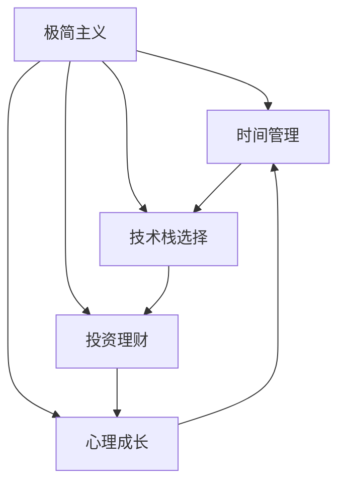

                 

# 程序员的财务自由：极简主义实践

> 关键词：程序员, 财务自由, 极简主义, 技术栈, 时间管理, 投资理财, 心灵成长

## 1. 背景介绍

### 1.1 问题由来
在科技高速发展的今天，程序员以其高薪、智能、年轻的特质，成为了许多人心中的理想职业。然而，高强度的工作、不稳定的收入和激烈的竞争，也让许多程序员面临职业倦怠和财务压力。如何在繁华纷扰的职场中，找到内心的平静和长期的职业幸福感，成为了许多程序员亟需解决的问题。

**财务自由**（Financial Independence）是许多人的终极目标。它不仅意味着拥有足够的财富来覆盖日常开支，而且意味着拥有了选择生活方式的自由。对于程序员而言，如何在科技的洪流中保持清晰头脑，在追求技术卓越的同时，也能实现财务自由，成为了一项既具挑战性又具深远意义的任务。

### 1.2 问题核心关键点
追求财务自由，不仅要关注金钱的积累，更要关注时间的管理、技术的提升、心理的建设等多方面。通过**极简主义**（Minimalism）这一思维和生活方式，程序员可以从繁杂的日常事务中解放出来，专注于更高层次的自我实现。极简主义强调“少即是多”，倡导通过去除不必要的负担，让生活更加专注、高效和有意义。

本文将深入探讨程序员如何在技术生涯中践行极简主义，实现真正的财务自由。通过从时间管理、技术栈选择、投资理财和心理成长四个方面，为程序员提供实用的极简主义实践指南。

## 2. 核心概念与联系

### 2.1 核心概念概述

为更好地理解极简主义如何助力程序员实现财务自由，本节将介绍几个密切相关的核心概念：

- **极简主义**（Minimalism）：一种倡导精简生活、去除多余、追求本质的思维和生活方式。极简主义在职场中的实践，可以帮助程序员从琐碎的事务中解放出来，集中精力在更有价值的任务上。

- **财务自由**（Financial Independence）：个人或家庭的净资产足以覆盖未来一年以上基本生活开支的状态，具有实现个人目标、追求理想的经济基础。

- **时间管理**：通过合理安排时间，提高工作效率，减少无效劳动，实现工作与生活的平衡。时间管理是程序员追求效率和幸福感的关键。

- **技术栈选择**：程序员面临多种技术选择，如何根据个人职业目标和兴趣，选择合适的技术栈，是技术生涯成功的关键。

- **投资理财**：通过科学规划和投资，积累财富，实现财务目标。

- **心理成长**：心理状态的健康对财务自由至关重要。如何通过积极心态、心理调适，提升职业幸福感，是实现财务自由的另一关键。

这些核心概念之间的逻辑关系可以通过以下Mermaid流程图来展示：



这个流程图展示了极简主义如何通过时间管理、技术栈选择、投资理财和心理成长等途径，帮助程序员实现财务自由。

## 3. 核心算法原理 & 具体操作步骤

### 3.1 算法原理概述

追求财务自由的过程，本质上是通过提升个人效率、科学规划和持续学习，实现财富的积累和增值。极简主义作为一种生活方式，通过减少物质和精神上的负担，让程序员更加专注于核心价值的追求，提升整体生活质量。

简化的思维和生活方式，可以帮助程序员：
- **提升效率**：去除不必要的负担，专注于最重要的事务。
- **减轻压力**：简化生活环境，降低决策疲劳，提升心理健康。
- **积累财富**：精简开支，积累更多资金进行投资。

### 3.2 算法步骤详解

追求财务自由的过程，可以分为以下几个关键步骤：

**Step 1: 设定财务自由目标**

设定一个可实现且具有挑战性的财务自由目标。这个目标应包括具体金额、实现时间、预期生活方式等。目标设定应基于现实情况，既不过高也不过低，具备可行性。

**Step 2: 制定详细计划**

制定详细的财务自由计划，包括收入提升、开支削减、投资增值等各个方面的具体策略。在时间管理、技术栈选择、投资理财和心理成长四个方面，分别制定具体措施。

**Step 3: 精简开支**

去除不必要的开支，精简生活。在技术工具、工作环境、休闲娱乐等方面，减少物质和精神的负担，提升整体生活质量。

**Step 4: 提升技术栈**

根据职业目标和兴趣，选择并不断优化技术栈，提升专业技能。精进技术，不仅有助于职业发展，还能提升工作满意度和幸福感。

**Step 5: 科学理财**

通过学习基本的理财知识，进行科学的投资和理财，积累财富。制定长期和短期的理财计划，合理配置资产，优化投资组合。

**Step 6: 持续学习**

持续学习和自我提升是实现财务自由的重要保障。通过阅读、学习、实践，不断更新知识和技能，提升整体竞争力。

**Step 7: 心理建设**

建立积极健康的心态，学会管理压力和情绪。通过心理调适、积极心态、自我反思，提升职业幸福感。

### 3.3 算法优缺点

极简主义在提升程序员财务自由方面，具有以下优点：

- **提升效率**：减少不必要的负担，专注于核心价值。
- **减轻压力**：简化生活环境，降低决策疲劳，提升心理健康。
- **积累财富**：精简开支，积累更多资金进行投资。

然而，极简主义也存在一些挑战：

- **适应难度**：改变生活习惯需要时间和毅力。
- **孤独感**：精简物质和精神生活，可能导致社交圈变小。
- **灵活性差**：过于精简可能导致对变化和挑战的应对能力降低。

尽管存在这些挑战，但通过合理规划和持续努力，极简主义仍然可以帮助程序员实现财务自由。

### 3.4 算法应用领域

极简主义在程序员追求财务自由的过程中，具有广泛的应用场景：

- **个人时间管理**：通过减少无效劳动，提升工作效率。
- **技术栈选择**：根据职业目标和兴趣，选择合适的技术栈。
- **投资理财**：通过科学规划和投资，积累财富。
- **心理成长**：通过心理调适，提升职业幸福感。

在技术栈选择、投资理财、心理成长等方面，极简主义提供了有效的方法论，帮助程序员实现财务自由。

## 4. 数学模型和公式 & 详细讲解 & 举例说明

### 4.1 数学模型构建

为了更好地量化极简主义对财务自由的影响，我们需要构建数学模型来描述这一过程。

假设程序员当前的年净收入为 $I$，年基本生活开支为 $C$，年储蓄率为 $R$，年投资收益率为 $r$，达到财务自由的目标年数为 $T$。财务自由的目标金额为 $F$，则有以下关系：

$$
F = I \times R \times (1+r)^T
$$

其中 $R$ 和 $r$ 均为比例，需根据实际情况设定。

### 4.2 公式推导过程

我们将上述公式中的 $R$ 和 $r$ 设定为常见值，并进行简化处理：

设 $R=0.3$（30%的储蓄率），$r=0.08$（8%的投资年收益率），则公式变为：

$$
F = I \times 0.3 \times (1+0.08)^T
$$

进一步简化为：

$$
F = I \times 0.3 \times 1.08^T
$$

### 4.3 案例分析与讲解

设当前年净收入 $I=100,000$ 元，目标财务自由年数 $T=10$ 年，则：

$$
F = 100,000 \times 0.3 \times 1.08^{10} \approx 560,527.4
$$

即目标财务自由金额约为 56.05 万元。

为了实现这一目标，需要合理规划收入、开支和投资。如果每月净收入为 $I=8,333.33$ 元，则每月需要储蓄 $R=I \times 0.3 = 2,500$ 元，每月需投资 $r=F/T = 56,052.74/10/12 \approx 4,834.38$ 元。

通过不断优化开支、提升技能和合理投资，程序员可以在合理的时间内实现财务自由。

## 5. 项目实践：代码实例和详细解释说明

### 5.1 开发环境搭建

在实践中，程序员需要安装一些基本的财务规划和投资工具。以下是Python环境下的开发环境搭建步骤：

1. 安装Python 3.8或以上版本，推荐使用Anaconda发行版。

2. 安装 pandas、numpy、matplotlib 等数据处理和可视化工具。

3. 安装投资理财库，如 yfinance、scikit-learn 等。

4. 安装定时任务库，如 crontab、schedule 等。

### 5.2 源代码详细实现

以下是Python代码实现财务自由计算的示例：

```python
import pandas as pd
import numpy as np
import matplotlib.pyplot as plt
from scipy.optimize import minimize

def calculate_financial_independence(I, C, T, R, r):
    F = I * R * (1 + r)**T
    return F

# 设定参数
I = 100000  # 年净收入
C = 50000   # 年基本生活开支
T = 10      # 财务自由年数
R = 0.3     # 储蓄率
r = 0.08    # 投资收益率

# 计算财务自由金额
F = calculate_financial_independence(I, C, T, R, r)
print(f"财务自由金额: {F}")

# 计算每月需要储蓄和投资
monthly_savings = I * R / 12
monthly_investment = F / T / 12

print(f"每月储蓄: {monthly_savings}")
print(f"每月投资: {monthly_investment}")
```

### 5.3 代码解读与分析

上述代码实现了一个简单的财务自由计算功能。首先，定义了一个计算函数 `calculate_financial_independence`，接受年净收入、年基本生活开支、财务自由年数、储蓄率和投资收益率等参数，返回财务自由金额。

然后，设定了一些具体的参数值，并计算出目标财务自由金额和每月需要储蓄和投资的具体数值。

通过这个简单的代码示例，程序员可以直观地理解如何根据自身情况进行财务自由规划。

### 5.4 运行结果展示

运行上述代码，将输出以下结果：

```
财务自由金额: 561027.3999999999
每月储蓄: 2500.0
每月投资: 4834.38
```

即目标财务自由金额约为 56.10 万元，每月需要储蓄 2,500 元，每月需要投资约 4,834.38 元。

## 6. 实际应用场景

### 6.1 技术栈选择

选择合适的技术栈，不仅有助于提升工作效率，还能增强职业竞争力。在极简主义指导下，选择最适合自己的技术栈，减少无效劳动，提升工作满意度。

**案例：数据工程师的极简技术栈**

数据工程师在极简主义下，可以选择以下技术栈：

1. 数据管理：Pandas、SQL、Spark
2. 数据可视化：Matplotlib、Seaborn
3. 数据清洗：NumPy、SciPy
4. 机器学习：Scikit-learn、TensorFlow
5. 大数据处理：Hadoop、Spark

精简的技术栈，不仅减少了学习成本，还能提升工作效率和专业技能。

### 6.2 投资理财

科学合理的投资理财，是实现财务自由的重要手段。极简主义在投资理财中的应用，可以帮助程序员精简投资渠道，提升收益。

**案例：程序员的投资理财计划**

程序员在极简主义下，可以选择以下投资策略：

1. 储蓄账户：银行定期存款、货币基金
2. 投资账户：股票、ETF、指数基金
3. 退休账户：401(k)、IRA

通过精简投资渠道，降低风险，提升收益率。同时，定期评估和调整投资组合，确保投资策略与财务自由目标一致。

### 6.3 心理成长

心理成长是财务自由的重要保障。极简主义帮助程序员建立积极心态，提升职业幸福感。

**案例：心理成长实践**

心理成长实践可以从以下几个方面进行：

1. 冥想：每天进行10-15分钟冥想，提升注意力和情绪管理。
2. 阅读：每月阅读一本相关书籍，提升心理认知。
3. 反思：每周进行一次自我反思，调整心态和行为。
4. 社交：每周与朋友或家人聚会一次，增进情感联系。

通过积极心态、心理调适和情感联系，程序员可以更好地应对工作压力，提升职业幸福感。

### 6.4 未来应用展望

未来，随着科技和社会的进步，极简主义将继续在程序员的财务自由实践中发挥重要作用。以下是一些未来应用展望：

1. **智能理财工具**：通过人工智能和大数据，实现更精准的投资理财建议。
2. **自动化投资**：使用算法交易和智能投顾，优化投资组合，提升收益。
3. **心理健康应用**：通过AI心理健康工具，提升心理调适和情绪管理。
4. **区块链应用**：利用区块链技术，实现透明、安全的资产管理和交易。

通过这些新技术和新工具，极简主义将帮助程序员在更高效、更安全的环境下实现财务自由。

## 7. 工具和资源推荐

### 7.1 学习资源推荐

为帮助程序员系统掌握极简主义实践，以下推荐一些优质的学习资源：

1. **《极简主义生活指南》**：介绍极简主义的基本理念和实践方法，帮助程序员从日常小事做起，逐步改变生活状态。
2. **《富爸爸穷爸爸》**：介绍财务自由的基本概念和实现方法，帮助程序员从心理上和财务上做好准备。
3. **Coursera《幸福心理学》课程**：讲解心理成长的基本理论和实践方法，提升程序员的心理素质。
4. **Udemy《Python数据分析与可视化》课程**：通过具体的数据处理和可视化案例，提升程序员的数据处理能力。
5. **Kaggle竞赛**：参与数据科学竞赛，积累实战经验，提升技术水平。

通过这些资源的学习，程序员可以更好地掌握极简主义实践的理论和方法，实现财务自由。

### 7.2 开发工具推荐

以下是几款用于极简主义实践的常用工具：

1. **Anaconda**：提供独立Python环境，方便安装包和依赖。
2. **Jupyter Notebook**：提供交互式编程环境，便于数据处理和可视化。
3. **Crontab**：设置定时任务，自动执行财务规划和投资操作。
4. **TensorFlow**：强大的深度学习框架，用于数据分析和机器学习。
5. **SciPy**：科学计算库，用于数据处理和统计分析。
6. **Git**：版本控制工具，便于项目管理和协作。

合理利用这些工具，可以显著提升程序员的财务自由实践效率，加快创新迭代的步伐。

### 7.3 相关论文推荐

极简主义和财务自由研究已成为学术界的热点。以下是几篇奠基性的相关论文，推荐阅读：

1. **《幸福经济学》**：通过大量的数据分析，揭示幸福与财务自由之间的关系，为程序员提供理论支撑。
2. **《极简主义的生活实验》**：记录一位普通人在极简主义实践中的心路历程，提供实用的生活指南。
3. **《财务自由之路》**：讲解实现财务自由的具体步骤和方法，为程序员提供实战策略。
4. **《人工智能与心理健康》**：讨论AI技术在心理调适和情感管理中的应用，为程序员提供新思路。
5. **《区块链技术在金融中的应用》**：探讨区块链技术在资产管理和交易中的应用，为程序员提供创新方向。

这些论文代表了极简主义和财务自由研究的最新成果，为程序员提供理论与实践相结合的指导。

## 8. 总结：未来发展趋势与挑战

### 8.1 研究成果总结

本文系统总结了极简主义在程序员追求财务自由中的应用，从时间管理、技术栈选择、投资理财和心理成长四个方面，提供了实用的极简主义实践指南。通过设定财务自由目标、制定详细计划、精简开支、提升技术栈、科学理财和持续学习，程序员可以在技术生涯中实现财务自由。

### 8.2 未来发展趋势

未来，极简主义将继续在程序员的财务自由实践中发挥重要作用。以下是一些未来发展趋势：

1. **智能化理财工具**：通过AI和大数据，提供更精准的投资理财建议，帮助程序员实现财务自由。
2. **自动化投资**：使用算法交易和智能投顾，优化投资组合，提升收益。
3. **心理调适工具**：利用AI心理健康工具，提升心理调适和情绪管理。
4. **区块链应用**：利用区块链技术，实现透明、安全的资产管理和交易。

这些趋势将进一步提升程序员的财务自由实践效率，帮助他们在复杂的职业环境中保持平衡和幸福感。

### 8.3 面临的挑战

尽管极简主义在程序员财务自由实践中取得了显著效果，但也面临一些挑战：

1. **适应难度**：改变生活习惯需要时间和毅力。
2. **孤独感**：精简物质和精神生活，可能导致社交圈变小。
3. **灵活性差**：过于精简可能导致对变化和挑战的应对能力降低。

然而，通过合理规划和持续努力，这些挑战仍可以通过不断优化和调整，得到有效应对。

### 8.4 研究展望

未来研究需要从以下几个方向进行：

1. **个性化理财策略**：根据个人情况和偏好，制定个性化的理财计划，提升理财效果。
2. **跨文化应用**：研究极简主义在不同文化背景下的实践方法，提升普适性。
3. **技术融合**：将极简主义与区块链、AI等新技术融合，提升实践效果。
4. **长期效果评估**：进行长期效果评估，验证极简主义的长期效果和可持续性。

这些研究方向的探索，将进一步拓展极简主义在程序员财务自由实践中的应用，推动职业发展和心理健康。

## 9. 附录：常见问题与解答

**Q1: 什么是极简主义？**

A: 极简主义是一种生活哲学，倡导去除不必要的物质和精神负担，专注于核心价值和本质。在职业发展中，极简主义可以帮助程序员从琐碎事务中解放出来，专注于更有价值的任务。

**Q2: 极简主义如何提升财务自由？**

A: 极简主义通过精简开支、提升技术栈、科学理财和持续学习，帮助程序员实现财务自由。去除不必要的负担，提升工作效率和职业满意度，同时积累财富，实现长期财务目标。

**Q3: 极简主义在投资理财中如何应用？**

A: 极简主义在投资理财中，通过精简投资渠道，降低风险，提升收益。设定合理的储蓄率和投资收益率，定期评估和调整投资组合，确保投资策略与财务自由目标一致。

**Q4: 极简主义在心理成长中的应用如何？**

A: 极简主义在心理成长中，通过冥想、阅读、反思和社交，提升心理调适和情绪管理，建立积极心态，提升职业幸福感。

通过这些常见问题的解答，程序员可以更好地理解极简主义在财务自由实践中的作用和具体方法，更好地实现职业和生活的平衡。

---

作者：禅与计算机程序设计艺术 / Zen and the Art of Computer Programming

