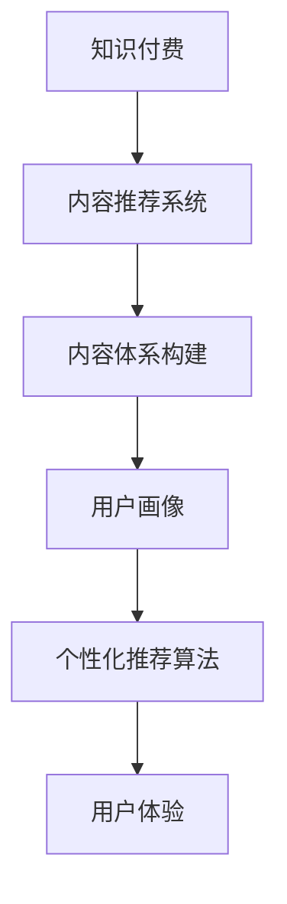

                 

# 程序员知识付费的内容体系构建

> 关键词：知识付费,内容体系构建,内容推荐系统,用户画像,个性化推荐算法,用户体验

## 1. 背景介绍

随着互联网时代的到来，知识付费领域迎来了蓬勃发展。程序员作为高端技术人才，对知识和技能的持续学习需求强烈，愿意支付费用获取高质量的课程、书籍、工具、资讯等。如何构建一个高效、可靠、有吸引力的知识付费内容体系，满足程序员的多样化需求，提升学习效果和用户体验，成为当下亟需探讨的重要课题。本文将从内容推荐系统的角度，详细介绍程序员知识付费内容体系构建的关键点，以期为相关领域的从业者提供有价值的参考。

## 2. 核心概念与联系

### 2.1 核心概念概述

为了更好地理解程序员知识付费内容体系构建的思路，本节将介绍几个核心概念：

- **知识付费**：指用户为获取专业知识和技能而支付费用的形式，包括在线课程、技术书籍、视频教程、工具使用指南等。
- **内容推荐系统**：利用算法推荐符合用户兴趣和需求的内容，提升内容消费效率和体验。
- **内容体系**：指内容推荐系统下的知识产品及其组织结构，包括课程、书籍、工具、资讯等，旨在构建全面、有层次的知识网络。
- **用户画像**：通过收集用户行为数据，构建用户特征模型，帮助推荐系统理解用户兴趣和偏好，个性化推荐内容。
- **个性化推荐算法**：根据用户特征，通过计算模型为用户推荐最适合的内容，提升内容匹配度和用户体验。

### 2.2 核心概念原理和架构的 Mermaid 流程图



这个流程图展示了知识付费、内容推荐系统、内容体系、用户画像、个性化推荐算法和用户体验之间的关系。内容推荐系统以用户画像为基础，通过个性化推荐算法为用户推荐最相关的内容，最终提升用户体验。内容体系作为推荐系统推荐的内容集，其构建的全面性和层次性直接影响推荐效果。

## 3. 核心算法原理 & 具体操作步骤

### 3.1 算法原理概述

程序员知识付费的内容推荐系统，本质上是一个以用户为中心，通过机器学习算法为用户推荐个性化内容的过程。其核心思想是通过分析用户的行为数据，构建用户画像，再利用个性化推荐算法，将用户画像映射到内容特征空间，从而找到最匹配的内容推荐给用户。

具体而言，推荐系统由以下几个关键模块组成：

- **数据采集模块**：收集用户的历史行为数据，如浏览记录、购买历史、评分反馈等。
- **用户画像模块**：通过数据挖掘技术构建用户特征模型，提炼出用户的兴趣偏好、技能水平、学习路径等。
- **内容特征模块**：为每个内容产品（课程、书籍、工具等）构建特征向量，描述其属性、难度、适用对象等。
- **推荐模型模块**：使用机器学习算法（如协同过滤、矩阵分解、深度学习等）计算用户画像与内容特征的相似度，选择最符合用户兴趣的内容进行推荐。
- **反馈循环模块**：通过用户反馈（如点击率、评分、分享等）不断优化推荐模型，提升推荐质量。

### 3.2 算法步骤详解

基于上述原理，程序员知识付费内容推荐系统的主要操作步骤如下：

**Step 1: 数据收集与预处理**
- 收集用户的基本信息、历史行为数据、反馈数据等。
- 对数据进行清洗、去重、补全，确保数据质量。

**Step 2: 用户画像建模**
- 通过聚类、分类、关联规则挖掘等技术，构建用户特征模型。
- 使用机器学习算法（如TF-IDF、LDA等）从用户行为数据中提取主题模型，描述用户的兴趣和偏好。

**Step 3: 内容特征提取**
- 对每个课程、书籍、工具等进行文本挖掘，提取关键词、难度、时长、评价等特征。
- 使用文本向量化技术（如词袋模型、TF-IDF等）将特征转化为向量形式。

**Step 4: 推荐模型训练**
- 选择适当的推荐算法，如协同过滤、矩阵分解、深度学习等。
- 在训练集上训练模型，评估推荐效果。

**Step 5: 推荐结果生成**
- 将用户画像映射到内容特征空间，计算相似度得分。
- 根据相似度排序，选择前N个内容推荐给用户。

**Step 6: 反馈循环优化**
- 收集用户的反馈数据，如点击、评分、留言等。
- 根据反馈数据，不断优化推荐模型和用户画像。

**Step 7: 上线部署与监控**
- 将推荐系统部署到生产环境，实时推荐内容。
- 实时监控推荐系统的各项指标，如点击率、转化率、满意度等，持续优化。

### 3.3 算法优缺点

基于上述算法步骤，程序员知识付费内容推荐系统具有以下优点：

1. **个性化推荐**：能够根据用户的行为和兴趣，推荐符合其需求的内容，提高内容消费效率。
2. **动态更新**：能够实时收集用户反馈，动态调整推荐策略，保证内容的准确性和时效性。
3. **用户粘性提升**：通过推荐系统，满足用户多样化需求，提升用户粘性和留存率。
4. **资源利用优化**：能够优化资源配置，推荐高质量内容，减少用户筛选成本。

同时，该算法也存在一些缺点：

1. **数据依赖性强**：需要大量的用户行为数据，数据质量和使用量直接影响推荐效果。
2. **冷启动问题**：新用户或缺乏行为数据的用户难以准确推荐内容，需要寻找其他方式解决。
3. **内容多样性不足**：过度依赖数据训练，可能导致推荐内容多样性不足，限制用户选择。
4. **用户隐私问题**：用户行为数据的收集和处理可能侵犯用户隐私，需要严格遵守相关法律法规。
5. **模型复杂性高**：推荐算法模型较为复杂，需要高水平的数据科学和算法工程师。

### 3.4 算法应用领域

基于上述算法，程序员知识付费内容推荐系统可应用于以下领域：

- **在线教育平台**：推荐用户感兴趣的教学课程和资源，提升学习效果和体验。
- **技术社区**：根据用户的技术水平和兴趣，推荐相关文章、教程、工具等，促进知识分享和交流。
- **企业培训**：结合员工的技能需求和公司业务，推荐适合的培训课程，提升员工技能和公司竞争力。
- **项目协作平台**：推荐合适的工具和资源，提升团队协作效率，加速项目进度。
- **技术博客和论坛**：根据用户浏览记录和评论反馈，推荐感兴趣的技术文章和讨论话题，促进知识传播。

## 4. 数学模型和公式 & 详细讲解 & 举例说明

### 4.1 数学模型构建

程序员知识付费内容推荐系统是一个典型的协同过滤系统。基于用户行为数据和内容特征数据，通过协同过滤算法为用户推荐内容。协同过滤算法分为基于用户的协同过滤和基于物品的协同过滤两种。

以基于用户的协同过滤算法为例，其数学模型可以表示为：

$$
\hat{y}_{i,j} = \hat{R}_{i,j} = \mu + \sum_{k=1}^K \theta_{k}X_{i,k} \times Y_{j,k} + \epsilon_i
$$

其中，$y_{i,j}$表示用户i对内容j的评分，$\hat{y}_{i,j}$表示预测评分，$\mu$为均值偏移，$X_{i,k}$和$Y_{j,k}$分别为用户i和内容j的特征向量，$K$为特征维度，$\theta_{k}$为特征权重，$\epsilon_i$为随机误差。

### 4.2 公式推导过程

基于协同过滤算法的推荐模型，其推导过程主要包括以下几个步骤：

1. **数据预处理**：将用户行为数据和内容特征数据进行预处理，形成用户-物品评分矩阵。
2. **用户特征提取**：通过因子分解等方法，将用户行为数据转换为低维特征向量。
3. **内容特征提取**：将内容特征数据转换为低维特征向量。
4. **模型训练**：在用户-物品评分矩阵上训练协同过滤模型，得到特征权重和均值偏移。
5. **推荐生成**：利用训练好的模型，对新用户和新内容进行评分预测，选择高评分项推荐。

### 4.3 案例分析与讲解

以一个简单的协同过滤推荐系统为例，假设有一个用户-物品评分矩阵$R$，其中每行表示一个用户，每列表示一个物品，每个元素表示用户对物品的评分。现要为用户A推荐物品B，则协同过滤算法的推荐过程如下：

1. 数据预处理：将用户行为数据和物品特征数据转换为矩阵$R$。
2. 用户特征提取：对用户A的行为数据进行因子分解，得到用户A的特征向量$X_A$。
3. 物品特征提取：对物品B的特征数据进行因子分解，得到物品B的特征向量$Y_B$。
4. 模型训练：在用户-物品评分矩阵$R$上训练协同过滤模型，得到特征权重$\theta$和均值偏移$\mu$。
5. 推荐生成：利用训练好的模型，对用户A的物品B进行评分预测，得到预测评分$\hat{R}_{A,B}$。
6. 推荐结果：选择预测评分最高的前N个物品推荐给用户A。

## 5. 项目实践：代码实例和详细解释说明

### 5.1 开发环境搭建

为了构建程序员知识付费内容推荐系统，需要搭建一个包含以下组件的开发环境：

1. **数据存储和计算**：使用AWS、Google Cloud等云服务平台，提供大规模数据存储和计算支持。
2. **数据预处理和特征提取**：使用Python的Pandas、NumPy等库，对用户行为数据和内容特征数据进行预处理和特征提取。
3. **推荐模型训练**：使用Python的Scikit-learn、TensorFlow等库，训练协同过滤算法。
4. **推荐系统部署**：使用Docker、Kubernetes等容器化技术，将推荐系统部署到生产环境。
5. **监控和优化**：使用Prometheus、Grafana等监控工具，实时监控推荐系统的各项指标，并根据反馈数据进行优化。

### 5.2 源代码详细实现

下面是一个简单的基于协同过滤的推荐系统代码实现，包含用户特征提取和物品特征提取两个步骤：

```python
import numpy as np
from sklearn.decomposition import TruncatedSVD

# 用户行为数据
user_ratings = np.array([[5, 4, 3, 2, 1], [1, 2, 3, 4, 5]])

# 物品特征数据
item_features = np.array([[0.1, 0.2, 0.3, 0.4], [0.4, 0.3, 0.2, 0.1]])

# 用户特征提取（因子分解）
user_features = TruncatedSVD(n_components=2).fit_transform(user_ratings)

# 物品特征提取（因子分解）
item_features = TruncatedSVD(n_components=2).fit_transform(item_features)

# 用户特征和物品特征的点积
user_item_dot = np.dot(user_features, item_features.T)
```

### 5.3 代码解读与分析

上述代码实现了一个简单的协同过滤推荐系统，主要分为两个步骤：

1. **用户特征提取**：使用TruncatedSVD算法对用户行为数据进行因子分解，得到用户A和用户B的特征向量。
2. **物品特征提取**：使用TruncatedSVD算法对物品特征数据进行因子分解，得到物品1和物品2的特征向量。
3. **用户-物品评分预测**：通过计算用户特征和物品特征的点积，得到预测评分$\hat{R}_{A,B}$。

需要注意的是，实际应用中，用户行为数据和物品特征数据可能包含噪声和缺失值，需要进行清洗和补全。同时，协同过滤算法的选择和参数调优也是影响推荐效果的重要因素。

### 5.4 运行结果展示

运行上述代码，可以得到用户A的物品B的预测评分$\hat{R}_{A,B}$，用于推荐系统生成推荐结果。

## 6. 实际应用场景

### 6.1 在线教育平台

在线教育平台可以通过程序员知识付费内容推荐系统，为学生推荐最适合的课程和学习资源，提升学习效果和体验。具体应用如下：

- **推荐课程**：根据学生的历史学习行为和评分反馈，推荐最相关的课程。
- **推荐教材**：根据学生的专业方向和兴趣，推荐适合的教材和学习资料。
- **推荐学习路径**：结合学生的技能水平和学习进度，推荐系统的学习路径，帮助学生更有条理地学习。

### 6.2 技术社区

技术社区可以通过程序员知识付费内容推荐系统，为用户推荐最相关的文章、教程、工具等，促进知识分享和交流。具体应用如下：

- **推荐技术文章**：根据用户的技术水平和兴趣，推荐相关的技术文章和博客。
- **推荐开源项目**：根据用户的贡献和关注，推荐适合的开源项目和代码库。
- **推荐工具资源**：根据用户的技术需求和工具使用情况，推荐相关的工具和资源。

### 6.3 企业培训

企业可以通过程序员知识付费内容推荐系统，为员工推荐适合的培训课程和资源，提升员工技能和公司竞争力。具体应用如下：

- **推荐培训课程**：根据员工的技能水平和学习需求，推荐最适合的培训课程和资源。
- **推荐技术资料**：根据员工的岗位和职责，推荐相关的技术资料和文档。
- **推荐学习路径**：结合员工的学习进度和目标，推荐系统的学习路径，帮助员工更有条理地学习。

### 6.4 项目协作平台

项目协作平台可以通过程序员知识付费内容推荐系统，为用户推荐最合适的工具和资源，提升团队协作效率和项目进度。具体应用如下：

- **推荐开发工具**：根据项目需求和技术栈，推荐合适的开发工具和库。
- **推荐文档和指南**：根据用户的学习进度和需求，推荐相关的文档和操作指南。
- **推荐资源和插件**：根据用户的开发习惯和需求，推荐相关的资源和插件。

## 7. 工具和资源推荐

### 7.1 学习资源推荐

为了帮助开发者系统掌握程序员知识付费内容推荐系统的理论基础和实践技巧，这里推荐一些优质的学习资源：

1. **《推荐系统实战》**：豆瓣评分9.4，内容深入浅出，涵盖推荐系统的基本原理和实际应用。
2. **《深度学习入门：基于TensorFlow》**：豆瓣评分8.4，适合入门级读者，涵盖深度学习的基础知识和实践技巧。
3. **《算法导论》**：豆瓣评分9.5，经典算法教材，涵盖计算机科学的基础算法和数据结构。
4. **Coursera《推荐系统》课程**：由斯坦福大学教授讲授，内容系统全面，涵盖推荐系统的各类算法和应用。
5. **Kaggle竞赛**：通过参加推荐系统相关的Kaggle竞赛，实战练习推荐算法，提升算法能力。

### 7.2 开发工具推荐

高效的开发离不开优秀的工具支持。以下是几款用于程序员知识付费内容推荐系统开发的常用工具：

1. **Jupyter Notebook**：开源的交互式笔记本，适合进行数据预处理和模型训练。
2. **Python**：广泛使用的编程语言，具备丰富的第三方库和框架支持，适合进行机器学习和数据分析。
3. **TensorFlow**：由Google主导开发的深度学习框架，适合进行大规模模型训练。
4. **PyTorch**：Facebook开源的深度学习框架，适合进行模型调试和优化。
5. **Scikit-learn**：Python的数据挖掘和机器学习库，适合进行特征提取和数据处理。

合理利用这些工具，可以显著提升程序员知识付费内容推荐系统的开发效率，加快创新迭代的步伐。

### 7.3 相关论文推荐

程序员知识付费内容推荐系统的研究始于学界，近年来逐渐向工业界普及。以下是几篇奠基性的相关论文，推荐阅读：

1. **《协同过滤算法》**：介绍协同过滤算法的基本原理和应用，是推荐系统领域的经典文献。
2. **《深度学习与推荐系统》**：探讨深度学习在推荐系统中的应用，提出基于深度学习的推荐算法。
3. **《基于用户画像的推荐系统》**：通过构建用户画像，提升推荐系统的个性化和精准度。
4. **《自然语言处理与推荐系统》**：探讨自然语言处理技术在推荐系统中的应用，提出基于文本的推荐算法。
5. **《推荐系统中的数据挖掘与模式识别》**：介绍推荐系统中的数据挖掘和模式识别技术，提出基于数据驱动的推荐算法。

这些论文代表了大语言模型微调技术的发展脉络。通过学习这些前沿成果，可以帮助研究者把握学科前进方向，激发更多的创新灵感。

## 8. 总结：未来发展趋势与挑战

### 8.1 总结

本文对程序员知识付费内容推荐系统进行了全面系统的介绍。首先阐述了知识付费和内容推荐系统的背景，明确了内容推荐系统在知识付费中的重要地位。其次，从原理到实践，详细讲解了推荐系统的数学模型和操作步骤，给出了推荐系统任务开发的完整代码实例。同时，本文还广泛探讨了推荐系统在在线教育、技术社区、企业培训、项目协作等多个领域的应用前景，展示了推荐系统范式的巨大潜力。此外，本文精选了推荐系统的各类学习资源，力求为读者提供全方位的技术指引。

通过本文的系统梳理，可以看到，程序员知识付费内容推荐系统正在成为知识付费的重要范式，极大地提升了知识消费的效率和体验。推荐系统的广泛应用，使得知识付费的传播更加高效，推动了知识付费领域的蓬勃发展。未来，伴随推荐算法的不断进步，推荐系统必将在更多领域大放异彩，为知识付费技术的产业化进程注入新的动力。

### 8.2 未来发展趋势

展望未来，程序员知识付费内容推荐系统将呈现以下几个发展趋势：

1. **个性化推荐**：推荐系统将继续提升个性化推荐能力，通过多维度用户画像和多模态数据融合，实现更加精准和动态的推荐。
2. **实时推荐**：推荐系统将实现实时推荐，通过流式数据处理和低延迟计算，保证推荐内容的实时性和时效性。
3. **主动推荐**：推荐系统将实现主动推荐，通过智能决策和用户行为预测，主动推荐用户感兴趣的内容，提升用户体验。
4. **跨领域推荐**：推荐系统将实现跨领域推荐，通过多领域知识整合和协同过滤，推荐更加多样化和有价值的内容。
5. **冷启动问题解决**：推荐系统将解决冷启动问题，通过用户行为数据和推荐算法结合，为新用户和新内容提供初步推荐。
6. **模型优化和公平性**：推荐系统将优化推荐模型，提升推荐质量，同时注重公平性，避免推荐偏袒和歧视。

以上趋势凸显了程序员知识付费内容推荐系统的广阔前景。这些方向的探索发展，必将进一步提升推荐系统的性能和应用范围，为知识付费技术的落地应用提供坚实的基础。

### 8.3 面临的挑战

尽管程序员知识付费内容推荐系统已经取得了瞩目成就，但在迈向更加智能化、普适化应用的过程中，它仍面临着诸多挑战：

1. **数据隐私和安全**：推荐系统需要收集和处理大量的用户数据，可能涉及用户隐私和数据安全问题。如何保护用户隐私，确保数据安全，是推荐系统面临的重要挑战。
2. **数据质量和多样性**：推荐系统的推荐效果很大程度上依赖于数据质量和多样性。如何提高数据质量，增加数据多样性，是推荐系统需要不断优化的问题。
3. **推荐算法复杂性**：推荐算法本身较为复杂，需要高水平的数据科学和算法工程师进行开发和维护。如何降低算法复杂性，提高算法效率，是推荐系统需要关注的方向。
4. **实时性问题**：推荐系统需要在实时数据上生成推荐结果，对计算资源和计算效率要求较高。如何优化计算资源，提高实时推荐能力，是推荐系统需要解决的问题。
5. **用户行为预测**：推荐系统需要预测用户的行为和兴趣，但由于用户行为具有不确定性和多样性，如何提高预测准确性，是推荐系统需要优化的关键。
6. **算法公平性和透明性**：推荐系统需要保证算法的公平性和透明性，避免推荐偏袒和歧视，提升算法的可解释性。如何提高算法公平性和透明性，是推荐系统需要重点关注的课题。

### 8.4 研究展望

面对推荐系统面临的种种挑战，未来的研究需要在以下几个方面寻求新的突破：

1. **数据驱动和模型驱动结合**：结合数据驱动和模型驱动的思路，利用大数据和深度学习技术，提升推荐系统的精度和效率。
2. **多模态数据融合**：引入图像、音频、视频等多模态数据，丰富推荐系统的特征空间，提高推荐多样性和质量。
3. **跨领域知识整合**：将不同领域的知识进行整合，提升推荐系统的跨领域推荐能力。
4. **实时推荐系统优化**：优化实时推荐系统的架构和算法，提升推荐系统的实时性和稳定性。
5. **推荐算法透明性和可解释性**：提高推荐算法的透明性和可解释性，增强用户的信任和满意度。
6. **个性化推荐和用户行为预测**：结合个性化推荐和用户行为预测技术，提升推荐系统的动态性和适应性。

这些研究方向的探索，必将引领推荐系统技术的不断进步，为程序员知识付费内容推荐系统的发展提供新的动力。面向未来，推荐系统技术还需要与其他人工智能技术进行更深入的融合，如自然语言处理、深度学习、强化学习等，多路径协同发力，共同推动知识付费技术的进步和普及。

## 9. 附录：常见问题与解答

**Q1: 程序员知识付费内容推荐系统是否适用于所有知识付费领域？**

A: 程序员知识付费内容推荐系统在技术、教育、金融等多个知识付费领域均具备广泛应用前景。但对于某些特定领域，如医学、法律等，推荐系统需要进一步结合领域知识，才能实现更好的推荐效果。

**Q2: 推荐系统如何处理新用户和新内容的问题？**

A: 推荐系统可以通过多种方法处理新用户和新内容的问题，如冷启动问题。常见的方法包括基于内容的推荐、基于规则的推荐、基于协同过滤的推荐等。例如，对于新用户，可以通过推荐系统的默认模型或随机推荐项进行初期推荐。对于新内容，可以通过推荐系统的新内容推荐策略进行初期曝光。

**Q3: 推荐系统的推荐效果受哪些因素影响？**

A: 推荐系统的推荐效果受多个因素影响，包括数据质量、特征工程、算法选择、模型训练、用户行为预测等。为提高推荐效果，需要注重数据清洗和特征提取，选择适当的推荐算法，进行模型调优，同时注重用户行为分析和行为预测。

**Q4: 推荐系统如何处理推荐偏差和歧视？**

A: 推荐系统需要注重公平性，避免推荐偏差和歧视。可以通过数据预处理、算法优化、模型公平性评估等方式，提升推荐系统的公平性和透明性。例如，在数据预处理阶段，可以去除有偏见的特征；在算法优化阶段，可以通过公平性约束和平衡优化算法，提高推荐系统的公平性。

**Q5: 推荐系统的实时性问题如何处理？**

A: 推荐系统的实时性问题可以通过优化计算资源、改进算法架构、使用缓存和缓存穿透优化等方法进行解决。例如，可以采用分布式计算、流式计算、缓存技术等，提升推荐系统的实时性。同时，需要合理设计算法架构，减少计算资源消耗，提高计算效率。

综上所述，程序员知识付费内容推荐系统在知识付费领域具有重要意义，通过构建全面、有层次的内容体系，利用推荐算法为用户推荐个性化内容，提升了知识消费的效率和体验。未来，伴随推荐算法的不断进步，推荐系统将在更多领域大放异彩，推动知识付费技术的产业化进程。总之，推荐系统需要从数据、算法、工程、业务等多个维度协同发力，才能真正实现智能推荐，满足用户多样化的知识需求。

