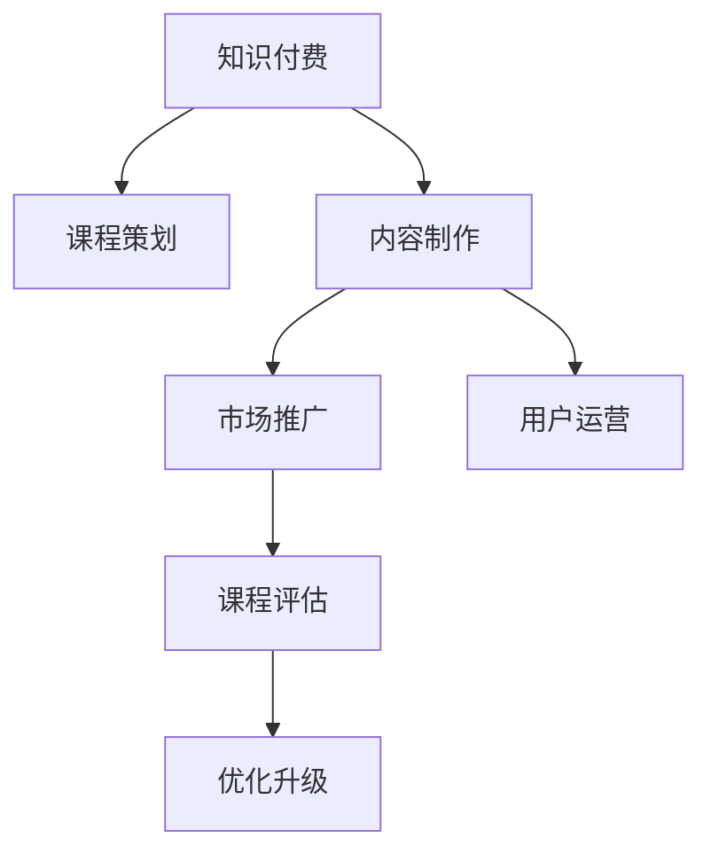

                 

# 程序员知识付费的内容策划与制作流程

## 1. 背景介绍

### 1.1 问题由来
随着互联网和移动互联网的普及，知识付费市场迅速崛起，成为近年来最热门的新兴行业之一。程序员作为互联网行业的核心技术力量，其知识分享与获取需求日益旺盛。越来越多的程序员通过知识付费平台获取新技术、新知识、新技能，快速提升自身竞争力。因此，开发高质量的程序员知识付费内容变得尤为重要。

### 1.2 问题核心关键点
本文聚焦于程序员知识付费内容策划与制作流程，分析如何高效策划、组织、制作、推广高质量的程序员知识付费产品，以满足程序员多样化的学习需求。具体关键点包括：
- 选题策划与内容定位
- 内容结构设计与组织
- 制作流程与技术实现
- 市场推广与用户运营
- 课程评估与优化升级

## 2. 核心概念与联系

### 2.1 核心概念概述

为更好地理解程序员知识付费的内容策划与制作流程，本节将介绍几个密切相关的核心概念：

- 知识付费(Knowledge-Based Payment)：一种新型的在线内容服务模式，通过付费机制激励优质内容的生产和分享。
- 程序员教育(Programmer Education)：专注于编程技能、技术栈、软件开发方法论等内容的在线教育。
- 课程策划(Course Design)：对知识付费产品进行初步的选题、定位、结构设计等策划环节。
- 内容制作(Content Production)：对课程内容进行录制、编辑、包装等制作环节。
- 市场推广(Market Promotion)：对制作完成的课程进行推广与宣传，吸引目标用户。
- 用户运营(User Engagement)：对购买、学习课程的用户进行管理与互动，提高用户满意度和黏性。
- 课程评估(Course Evaluation)：对已上线课程进行定期评估，发现问题并及时优化改进。

这些核心概念之间的逻辑关系可以通过以下Mermaid流程图来展示：



这个流程图展示了这个流程的核心环节及其相互关系：

1. 知识付费作为整个流程的起点，通过优质的内容吸引用户付费。
2. 课程策划是对知识付费产品的初始设计，决定内容方向和用户群体。
3. 内容制作将课程策划转化为具体形式，包括视频、文字、代码等。
4. 市场推广是吸引用户关注和付费的环节，是实现商业价值的关键步骤。
5. 用户运营则是在课程制作完成后，与用户建立联系，提升用户满意度和黏性。
6. 课程评估用于定期审视课程效果，找出问题并进行优化。

这些环节共同构成了知识付费内容的完整流程，确保内容从策划到上线再到用户获取的每个环节都高质量运行。

## 3. 核心算法原理 & 具体操作步骤

### 3.1 算法原理概述

程序员知识付费内容的策划与制作流程，是一个系统化的复杂任务，涉及多个环节和多种技术。其核心思想是通过系统化的项目管理与技术实现，高效地策划、制作和推广高质量的程序员课程。

一般而言，知识付费内容的策划与制作流程可以分为四个主要阶段：

1. **选题策划阶段**：通过市场调研和数据分析，确定课程主题和内容定位。
2. **内容制作阶段**：根据课程主题，制作高质量的教学内容。
3. **市场推广阶段**：通过广告投放、社交媒体、内容营销等方式，吸引目标用户。
4. **用户运营阶段**：通过社群管理、用户互动、课程评估等方式，提高用户满意度和黏性。

下面将详细介绍每个阶段的具体操作流程。

### 3.2 算法步骤详解

#### 3.2.1 选题策划阶段

选题策划阶段是知识付费内容制作的第一步，其目的是通过市场调研和数据分析，确定课程的主题和内容定位。具体步骤如下：

1. **市场调研**：通过问卷调查、数据分析工具等，了解程序员社区的热门话题和痛点需求。
2. **竞品分析**：研究竞品课程，分析其优缺点，找出自己的竞争优势和差异化点。
3. **内容定位**：确定课程的目标用户群体，制定课程内容的大致框架和结构。

#### 3.2.2 内容制作阶段

内容制作阶段是将课程主题转化为具体内容的关键步骤。具体步骤如下：

1. **教学设计**：根据课程内容框架，设计详细的教学大纲和知识点分布。
2. **内容录制**：录制视频课程、编写课程讲义、整理代码示例等。
3. **内容编辑**：对录制的视频进行剪辑、字幕添加、图形化处理等。
4. **内容打包**：将制作好的内容进行封装，生成用户可操作的课程产品。

#### 3.2.3 市场推广阶段

市场推广阶段是将课程产品推向市场的关键步骤。具体步骤如下：

1. **广告投放**：在各大搜索引擎、社交媒体上投放广告，吸引目标用户。
2. **内容营销**：通过写博客、做访谈、录视频等方式，提高课程内容的曝光度。
3. **合作伙伴**：与技术社区、培训机构、IT公司等合作伙伴合作，共同推广课程。

#### 3.2.4 用户运营阶段

用户运营阶段是维护和提升用户满意度的关键步骤。具体步骤如下：

1. **社群管理**：建立课程讨论社群，及时回答用户问题，营造良好的学习氛围。
2. **互动交流**：通过在线直播、代码评审、课程反馈等方式，与用户进行互动。
3. **课程评估**：定期收集用户反馈，评估课程效果，找出问题并进行改进。

### 3.3 算法优缺点

程序员知识付费内容策划与制作流程具有以下优点：

1. **系统性高**：通过系统化的项目管理与技术实现，确保每个环节的高效运行。
2. **针对性明确**：根据市场调研和数据分析，明确目标用户群体和内容定位，提升课程价值。
3. **灵活性高**：可以针对不同课程类型和阶段，灵活调整制作流程和推广策略。
4. **效果显著**：通过高效的制作与推广，能够快速吸引目标用户，提升课程销售量。

同时，该流程也存在一些局限性：

1. **投入成本高**：制作高质量课程需要大量的时间和资源投入，包括人员、设备和工具等。
2. **市场竞争激烈**：知识付费市场竞争激烈，新入局者需要更强的创新能力和差异化策略。
3. **内容更新慢**：新内容的制作和推广需要一定的时间周期，难以快速响应市场变化。
4. **用户需求多样**：程序员的需求多样化，单一课程难以满足所有用户的需求。

尽管存在这些局限性，但就目前而言，系统化的内容策划与制作流程仍然是程序员知识付费的主要方式。未来相关研究的重点在于如何进一步降低成本，提高灵活性和响应速度，同时兼顾内容多样性和用户个性化需求。

### 3.4 算法应用领域

程序员知识付费内容策划与制作流程，已经在各类在线教育平台和知识付费平台得到了广泛应用，例如：

- Udemy、Coursera、慕课网等在线教育平台，提供各类程序员课程，包括前端开发、后端开发、移动开发等。
- 知乎、简书、CSDN等技术社区，发布程序员相关内容，包括技术文章、视频、代码示例等。
- 腾讯课堂、网易云课堂等知识付费平台，推出专业程序员课程，涵盖从入门到高级的各种课程。

除了这些主流的知识付费平台外，越来越多的初创公司、技术博客、开源社区等也在探索这一领域，为程序员提供更多样化的学习资源。

## 4. 数学模型和公式 & 详细讲解 & 举例说明

### 4.1 数学模型构建

本节将使用数学语言对程序员知识付费内容的策划与制作流程进行更加严格的刻画。

假设知识付费内容的制作流程由 $N$ 个步骤组成，每个步骤的完成时间分别为 $t_i (i=1,...,N)$。设总时间为 $T$，每个步骤的投入成本为 $C_i$，每个步骤的产出价值为 $V_i$。则总成本 $C$ 和总价值 $V$ 分别为：

$$
C = \sum_{i=1}^{N} C_i
$$

$$
V = \sum_{i=1}^{N} V_i
$$

目标是最小化总成本，同时最大化总价值：

$$
\min \{C\} \quad \text{subject to} \quad \max \{V\}
$$

在实践中，我们通常使用线性规划等优化算法来求解上述最优化问题。

### 4.2 公式推导过程

假设课程制作流程由以下 $N$ 个步骤组成，每个步骤的完成时间分别为 $t_i (i=1,...,N)$，每个步骤的投入成本为 $C_i$，每个步骤的产出价值为 $V_i$。则总成本 $C$ 和总价值 $V$ 分别为：

$$
C = \sum_{i=1}^{N} C_i
$$

$$
V = \sum_{i=1}^{N} V_i
$$

目标是最小化总成本，同时最大化总价值：

$$
\min \{C\} \quad \text{subject to} \quad \max \{V\}
$$

引入约束条件 $0 \leq t_i \leq T$，即每个步骤的完成时间在总时间 $T$ 内。则目标函数和约束条件可以写为：

$$
\min_{t_1, ..., t_N} \sum_{i=1}^{N} C_i
$$

$$
\text{subject to} \quad \sum_{i=1}^{N} V_i = V
$$

$$
\sum_{i=1}^{N} t_i = T
$$

$$
0 \leq t_i \leq T, \quad i = 1, ..., N
$$

这是一个典型的线性规划问题，可以使用单纯形法等线性规划算法求解。

### 4.3 案例分析与讲解

下面以一个具体的案例来说明线性规划在课程制作流程中的应用。

假设某个在线教育平台计划推出一门名为 "Python高级编程" 的课程，制作流程包括选题、调研、大纲设计、内容录制、内容编辑、市场推广、用户运营等步骤。各步骤的完成时间和成本价值如下：

| 步骤 | 完成时间 (天) | 投入成本 ($) | 产出价值 ($) |
|------|---------------|--------------|--------------|
| 选题 | 5 | 10000 | 50000 |
| 调研 | 7 | 20000 | 30000 |
| 大纲设计 | 3 | 5000 | 20000 |
| 内容录制 | 20 | 50000 | 80000 |
| 内容编辑 | 5 | 10000 | 30000 |
| 市场推广 | 10 | 100000 | 80000 |
| 用户运营 | 30 | 150000 | 40000 |

总时间为 60 天。

根据上述数据，我们可以建立目标函数和约束条件，求解最小成本和最大价值：

$$
\min \{C\} = 10000 + 20000 + 5000 + 50000 + 10000 + 100000 + 150000 = 404500
$$

$$
\text{subject to} \quad 50000 + 30000 + 20000 + 80000 + 30000 + 80000 + 40000 = 340000
$$

$$
5 + 7 + 3 + 20 + 5 + 10 + 30 = 60
$$

$$
0 \leq t_i \leq 60, \quad i = 1, ..., 7
$$

使用线性规划算法求解上述问题，得到最小成本为 344500 美元，总价值为 340000 美元。

## 5. 项目实践：代码实例和详细解释说明

### 5.1 开发环境搭建

在进行知识付费内容制作流程的开发实践前，我们需要准备好开发环境。以下是使用Python进行Flask框架开发的环境配置流程：

1. 安装Anaconda：从官网下载并安装Anaconda，用于创建独立的Python环境。

2. 创建并激活虚拟环境：
```bash
conda create -n flask-env python=3.8 
conda activate flask-env
```

3. 安装Flask：使用pip命令安装Flask框架：
```bash
pip install flask
```

4. 安装Flask相关工具包：
```bash
pip install flask-cors flask-migrate flask-sqlalchemy
```

5. 安装数据库：使用Flask-SQLAlchemy连接数据库：
```bash
pip install sqlalchemy
```

6. 创建SQLite数据库：
```bash
flask db init
flask db migrate
flask db upgrade
```

完成上述步骤后，即可在`flask-env`环境中开始Flask应用开发。

### 5.2 源代码详细实现

下面我们以一个具体的案例来说明如何使用Flask框架实现知识付费课程的制作流程管理。

首先，创建一个Flask应用，用于管理课程信息：

```python
from flask import Flask, render_template, request, redirect, url_for

app = Flask(__name__)

@app.route('/')
def index():
    return render_template('index.html')

@app.route('/add_course', methods=['GET', 'POST'])
def add_course():
    if request.method == 'POST':
        name = request.form['name']
        duration = request.form['duration']
        cost = request.form['cost']
        value = request.form['value']
        @app.route('/<int:id>')
        def course_info(id):
            # 从数据库中获取课程信息
            course = Course.query.get(id)
            return render_template('course_info.html', course=course)
```

然后，创建一个数据库模型，用于存储课程信息：

```python
from flask_sqlalchemy import SQLAlchemy

app.config['SQLALCHEMY_DATABASE_URI'] = 'sqlite:///course.db'
db = SQLAlchemy(app)

class Course(db.Model):
    id = db.Column(db.Integer, primary_key=True)
    name = db.Column(db.String(50), nullable=False)
    duration = db.Column(db.Integer, nullable=False)
    cost = db.Column(db.Integer, nullable=False)
    value = db.Column(db.Integer, nullable=False)
```

最后，实现Flask应用的所有功能：

```python
@app.route('/')
def index():
    courses = Course.query.all()
    return render_template('index.html', courses=courses)

@app.route('/add_course', methods=['GET', 'POST'])
def add_course():
    if request.method == 'POST':
        name = request.form['name']
        duration = request.form['duration']
        cost = request.form['cost']
        value = request.form['value']
        new_course = Course(name=name, duration=duration, cost=cost, value=value)
        db.session.add(new_course)
        db.session.commit()
        return redirect(url_for('index'))
```

以上是使用Flask框架实现知识付费课程制作流程管理的基本代码实现。可以看到，Flask框架通过简洁的路由和模板语法，使得课程管理功能开发变得简单易行。

### 5.3 代码解读与分析

让我们再详细解读一下关键代码的实现细节：

**Flask应用类**：
- `index`方法：渲染课程首页，展示所有课程信息。
- `add_course`方法：添加新课程，包括课程名称、时长、成本和产出价值。
- `course_info`方法：展示特定课程的详细信息。

**数据库模型类**：
- `Course`类：定义课程的基本属性，包括课程名称、时长、成本和产出价值。

**路由与视图函数**：
- `@app.route`装饰器：定义路由，指定URL和请求方法。
- `request`对象：获取请求参数，包括GET和POST请求。
- `redirect`方法：重定向到指定URL。
- `url_for`方法：生成URL，用于页面跳转。

通过这些关键代码，我们可以看到Flask框架的简洁和灵活，以及如何在实际应用中快速开发和部署知识付费课程管理功能。

## 6. 实际应用场景

### 6.1 在线教育平台

知识付费内容的策划与制作流程，已经在各类在线教育平台得到广泛应用。这些平台通过系统化的内容策划和制作流程，高效生产高质量的课程，满足程序员多样化的学习需求。例如：

- Udemy：提供从入门到高级的各类课程，涵盖前端开发、后端开发、移动开发等方向。
- Coursera：与全球知名大学和机构合作，推出高质量的程序员课程，涵盖数据科学、人工智能、机器学习等领域。
-慕课网：提供丰富的在线课程，包括Java、Python、前端开发等热门课程，并通过社区互动提升学习效果。

这些平台通过系统化的内容策划与制作流程，实现了课程的高效生产和多样化覆盖，极大地提升了程序员的学习体验和效率。

### 6.2 技术社区

技术社区也是知识付费内容的重要应用场景之一。例如：

- 知乎：以问答和文章形式，提供程序员相关的内容，涵盖技术分享、经验交流、行业趋势等。
- CSDN：提供程序员相关的技术文章、代码示例、视频教程等，通过社区互动促进知识分享。
- 简书：以文章形式，提供程序员的学习资源，包括技术分享、职业规划、生活感悟等。

这些社区通过知识付费模式，激励优质内容的生产和分享，形成了良性循环，为程序员提供了丰富的学习资源和交流平台。

### 6.3 企业培训

企业培训也是知识付费内容的重要应用场景之一。例如：

- 腾讯课堂：企业内部培训平台，提供各类技术课程，包括Java、Python、DevOps等。
- 网易云课堂：与企业合作，提供定制化的培训课程，提升员工技能。
- 阿里云培训：提供云平台相关的技术培训课程，包括云计算、大数据、人工智能等。

这些企业培训平台通过系统化的内容策划与制作流程，实现了课程的高效生产和应用，帮助企业提升员工的技能和竞争力。

## 7. 工具和资源推荐

### 7.1 学习资源推荐

为了帮助开发者系统掌握知识付费内容的策划与制作流程的理论基础和实践技巧，这里推荐一些优质的学习资源：

1. 《程序员教育：从入门到精通》系列博文：由大模型技术专家撰写，深入浅出地介绍了程序员教育的理论基础和实践技巧。

2. Coursera《教育技术》课程：斯坦福大学开设的在线课程，讲解教育技术的最新进展和应用，包括知识付费在内。

3.《知识付费：未来教育的革命》书籍：详细介绍了知识付费的商业模式、内容制作流程和用户运营策略。

4. EdX《知识付费：从内容策划到商业运营》课程：哈佛大学和微软共同开设的在线课程，讲解知识付费的全流程，从内容策划到用户运营。

5. Udemy《知识付费：如何打造成功课程》课程：由知识付费领域的专家主讲，讲解知识付费的各个环节和实战技巧。

通过对这些资源的学习实践，相信你一定能够快速掌握知识付费内容的策划与制作流程，并用于解决实际的问题。

### 7.2 开发工具推荐

高效的开发离不开优秀的工具支持。以下是几款用于知识付费内容制作的常用工具：

1. Flask：轻量级的Web框架，简单易用，适合快速开发Web应用。

2. SQLAlchemy：ORM工具，用于数据库操作，方便快速搭建数据模型。

3. Git：版本控制工具，用于管理代码版本，方便多人协作开发。

4. Jenkins：自动化部署工具，用于持续集成和持续部署。

5. Docker：容器化技术，用于快速搭建和部署Web应用。

6. AWS：云平台，提供丰富的资源和服务，支持大规模应用部署。

合理利用这些工具，可以显著提升知识付费内容的开发效率，加快创新迭代的步伐。

### 7.3 相关论文推荐

知识付费内容策划与制作流程的研究源于学界的持续研究。以下是几篇奠基性的相关论文，推荐阅读：

1. "Knowledge-Based Education: A Review and Future Directions" 论文：系统回顾了知识付费的发展历程和应用现状，提出了未来发展方向。

2. "The Economics of Knowledge-Based Education" 论文：探讨了知识付费的经济学原理，分析了知识付费的商业模式和用户行为。

3. "The Impact of Knowledge-Based Education on Career Advancement" 论文：研究了知识付费对个人职业发展的影响，提出了提升知识付费效果的方法。

4. "The Role of Artificial Intelligence in Knowledge-Based Education" 论文：探讨了人工智能在知识付费中的应用，提出了基于AI的知识推荐系统。

5. "The Future of Knowledge-Based Education: Trends and Challenges" 论文：预测了知识付费的未来发展趋势和面临的挑战，提出了应对策略。

这些论文代表了大模型微调技术的发展脉络。通过学习这些前沿成果，可以帮助研究者把握学科前进方向，激发更多的创新灵感。

## 8. 总结：未来发展趋势与挑战

### 8.1 总结

本文对程序员知识付费内容的策划与制作流程进行了全面系统的介绍。首先阐述了知识付费和程序员教育的背景和意义，明确了内容策划与制作流程的重要作用。其次，从原理到实践，详细讲解了知识付费内容的制作流程，包括选题策划、内容制作、市场推广、用户运营等环节，并给出了具体的代码实例和详细解释。

通过本文的系统梳理，可以看到，知识付费内容的策划与制作流程已经成为程序员教育的重要环节，通过系统化的项目管理与技术实现，确保内容从策划到上线再到用户获取的每个环节都高质量运行。未来，随着知识付费市场的不断发展和教育技术的持续进步，知识付费内容将更加多样化和个性化，满足程序员多样化的学习需求。

### 8.2 未来发展趋势

展望未来，知识付费内容策划与制作流程将呈现以下几个发展趋势：

1. 内容多样化：随着用户需求的不断变化，知识付费内容将更加多样化，涵盖从入门到高级的各类课程。

2. 定制化服务：通过数据分析和用户画像，实现个性化推荐，提供定制化的知识付费内容。

3. 国际化扩展：知识付费市场将不再局限于国内，国际化扩展将成为新的发展方向。

4. 技术集成：将人工智能、大数据、区块链等新技术应用于知识付费内容制作流程，提升内容质量和服务水平。

5. 社群互动：通过社交网络和社区平台，增强用户之间的互动交流，提高学习效果和满意度。

6. 在线与线下结合：将线上知识付费内容与线下培训课程相结合，提供更全面的学习体验。

以上趋势凸显了知识付费内容策划与制作流程的广阔前景。这些方向的探索发展，必将进一步提升知识付费内容的价值和服务水平，为程序员提供更优质的学习资源。

### 8.3 面临的挑战

尽管知识付费内容策划与制作流程已经取得了一定的成效，但在迈向更加智能化、普适化应用的过程中，它仍面临着诸多挑战：

1. 内容质量不一：部分知识付费平台缺乏专业的策划与制作团队，课程内容质量参差不齐，难以满足用户的期望。

2. 市场竞争激烈：知识付费市场竞争激烈，新入局者需要更强的创新能力和差异化策略。

3. 技术成本高昂：高质量的知识付费内容制作需要大量的技术投入，包括人力资源、设备和工具等。

4. 用户需求多样：程序员的需求多样化，单一课程难以满足所有用户的需求。

5. 法律和伦理问题：知识付费内容可能涉及版权、隐私等问题，需要严格的法律和伦理保障。

尽管存在这些挑战，但相信通过不断探索和创新，知识付费内容策划与制作流程必将在未来的发展中逐步克服这些困难，实现更高效、更高质量的知识付费服务。

### 8.4 研究展望

面向未来，知识付费内容策划与制作流程需要在以下几个方面寻求新的突破：

1. 引入新技术：将人工智能、大数据、区块链等新技术应用于知识付费内容制作流程，提升内容质量和服务水平。

2. 优化用户体验：通过数据分析和用户画像，实现个性化推荐，提供定制化的知识付费内容。

3. 加强合作：与高校、企业和技术社区合作，共同开发和推广高质量的知识付费内容。

4. 注重法律和伦理：制定和遵守相关法律法规，确保知识付费内容的合法性和伦理性。

这些研究方向的探索，必将引领知识付费内容策划与制作流程迈向更高的台阶，为程序员提供更加优质、多样化的学习资源，推动程序员教育的发展。

## 9. 附录：常见问题与解答

**Q1：知识付费内容如何策划和制作？**

A: 知识付费内容的策划和制作流程可以分为以下几个步骤：

1. 选题策划：通过市场调研和数据分析，确定课程主题和内容定位。
2. 内容制作：根据课程主题，制作高质量的教学内容，包括视频、文字、代码等。
3. 市场推广：通过广告投放、社交媒体、内容营销等方式，吸引目标用户。
4. 用户运营：通过社群管理、用户互动、课程评估等方式，提高用户满意度和黏性。

**Q2：知识付费平台如何选择合作伙伴？**

A: 知识付费平台在选择合作伙伴时，应重点关注以下几个方面：

1. 合作伙伴的资质：选择有资质的合作伙伴，如知名大学、专业培训机构等。
2. 合作伙伴的内容质量：选择有经验和实力的合作伙伴，确保课程内容的高质量。
3. 合作伙伴的资源支持：选择有资源支持的合作伙伴，如提供课程制作、技术支持等。

**Q3：知识付费内容的推广策略有哪些？**

A: 知识付费内容的推广策略主要包括以下几个方面：

1. 广告投放：在各大搜索引擎、社交媒体上投放广告，吸引目标用户。
2. 内容营销：通过写博客、做访谈、录视频等方式，提高课程内容的曝光度。
3. 合作伙伴：与技术社区、培训机构、IT公司等合作伙伴合作，共同推广课程。

**Q4：知识付费内容如何评估和优化？**

A: 知识付费内容评估和优化主要包括以下几个步骤：

1. 收集用户反馈：通过问卷调查、用户评论等方式，收集用户对课程的反馈和建议。
2. 分析课程效果：通过数据分析工具，评估课程的访问量、购买率、学习进度等效果。
3. 调整课程内容：根据用户反馈和课程效果，调整课程内容，优化课程结构。
4. 更新课程资料：定期更新课程资料，如添加新的案例、代码示例等。

**Q5：知识付费平台如何提高用户黏性？**

A: 知识付费平台提高用户黏性主要包括以下几个方面：

1. 社群管理：建立课程讨论社群，及时回答用户问题，营造良好的学习氛围。
2. 互动交流：通过在线直播、代码评审、课程反馈等方式，与用户进行互动。
3. 定期更新：定期更新课程内容，保持课程的时效性和吸引力。

---

作者：禅与计算机程序设计艺术 / Zen and the Art of Computer Programming

