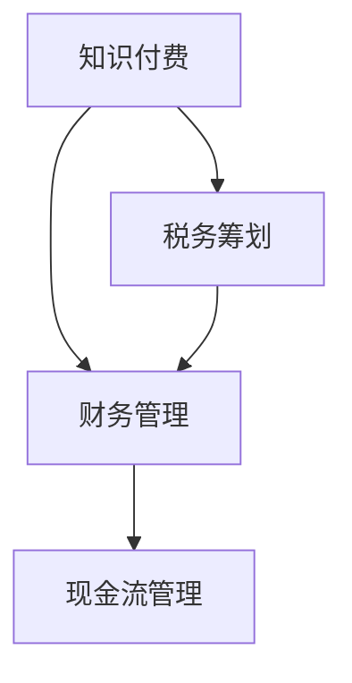

                 

# 程序员知识付费的税务筹划与财务管理

## 1. 背景介绍

在信息技术高速发展的今天，程序员成为了驱动社会进步的重要力量。他们在软件开发、系统运维、数据处理等领域发挥着不可替代的作用。然而，随之而来的是一系列新的挑战，包括如何合理规划税务、进行财务管理，以确保自身利益的最大化。本文将深入探讨程序员在知识付费场景下的税务筹划与财务管理策略，旨在帮助程序员更好地掌握相关知识，做出明智的决策。

## 2. 核心概念与联系

### 2.1 核心概念概述

在探讨程序员知识付费的税务筹划与财务管理之前，有必要先了解几个核心概念：

- **知识付费**：指知识提供者通过平台向用户提供知识服务，用户支付一定费用以获取服务的商业模式。程序员通过在线课程、技术咨询、软件开发等形式，向企业或个人提供服务并获得报酬。
- **税务筹划**：指在法律法规允许的范围内，通过对企业的经营活动和投资行为等事项进行事先筹划和安排，以减少或延迟税负，从而实现企业财务利益最大化的行为。
- **财务管理**：指对企业的财务活动进行规划、控制、监督和分析，以提高企业财务效率和经济效益，确保企业财务健康和持续发展的财务管理活动。
- **现金流管理**：指通过优化现金流入和流出，确保企业有足够的现金流支持日常运营和投资活动，避免现金流断裂的财务管理方法。

这些概念紧密联系，共同构成了程序员知识付费场景下的财务管理和税务筹划体系。理解这些概念的含义及其相互关系，对于制定合理的财务和税务策略至关重要。

### 2.2 核心概念原理和架构的 Mermaid 流程图



此图展示了知识付费、税务筹划、财务管理与现金流管理之间的关系。知识付费是起点，税务筹划和财务管理是手段，而现金流管理是结果。理解这些概念的联系，有助于设计出一个全面的财务管理系统。

## 3. 核心算法原理 & 具体操作步骤

### 3.1 算法原理概述

程序员知识付费的税务筹划与财务管理涉及多个方面的考量。其主要算法原理可以概括为：

- **税务筹划算法**：通过合理配置收入和支出，最大化利用税收优惠政策，实现税负最小化。
- **财务管理算法**：通过对现金流、资产负债表和利润表的分析和调整，优化财务结构，提高企业财务效率。
- **现金流管理算法**：通过预测和控制现金流，确保企业在运营过程中保持充足的现金储备，防止财务危机。

### 3.2 算法步骤详解

#### 3.2.1 税务筹划

1. **了解税收政策**：首先，程序员需要了解所在国家和地区的税收政策，包括个人所得税、增值税、企业所得税等。了解这些政策有助于合理规划税务。

2. **合理配置收入和支出**：程序员应将收入合理分配到各个税务周期中，避免集中收入而产生较高的税负。同时，应尽量增加成本支出，如办公设备、软件开发工具等，以降低应税收入。

3. **利用税收优惠政策**：程序员应积极利用各项税收优惠政策，如税收抵免、税收减免等，减少税负。例如，通过成立合伙企业或个人独资企业，可以享受更多的税收优惠。

4. **规划税务合规**：程序员应确保所有税务申报和报告符合法律法规要求，避免因税务问题而受到罚款或法律处罚。

#### 3.2.2 财务管理

1. **建立财务预算**：程序员应根据自身的业务情况和收入水平，建立详细的财务预算，包括收入、支出、利润等方面的预测和规划。

2. **优化财务结构**：通过调整资产负债表和利润表，优化企业的财务结构。例如，增加投资于高效设备或技术，减少低效资产的持有。

3. **控制成本支出**：程序员应合理控制各项成本支出，避免不必要的花费。同时，利用税收优惠政策，增加成本支出以降低税负。

4. **定期财务分析**：定期进行财务分析，评估企业的财务状况，及时发现和解决问题。例如，通过比较实际财务数据与预算数据，找出差异并进行调整。

#### 3.2.3 现金流管理

1. **现金流预测**：程序员应根据企业的业务情况和市场环境，进行现金流预测，确保企业在运营过程中有足够的现金流支持。

2. **优化现金流结构**：通过调整现金流入和流出，优化现金流结构，确保现金流的稳定性。例如，通过预收账款和延迟支付来增加现金流入，同时减少不必要的支出。

3. **制定应急计划**：制定应急计划，以应对突发事件导致的现金流问题。例如，通过备用资金和短期贷款等措施，确保现金流不断裂。

### 3.3 算法优缺点

#### 3.3.1 税务筹划的优缺点

**优点**：
- 通过合理配置收入和支出，可以有效降低税负，提高财务效率。
- 利用税收优惠政策，可以增加企业的盈利能力。
- 合规的税务筹划有助于避免因税务问题导致的法律风险。

**缺点**：
- 税务筹划需要耗费大量时间和精力，对于程序员来说，可能存在较高的学习成本。
- 税务筹划策略需要根据政策变化进行调整，具有一定的不确定性。

#### 3.3.2 财务管理的优缺点

**优点**：
- 通过优化财务结构，可以提高企业的盈利能力和财务效率。
- 通过控制成本支出，可以增加企业的现金流，降低财务风险。

**缺点**：
- 财务管理需要详细的财务数据和专业的财务知识，对于程序员来说，可能存在一定的难度。
- 财务管理策略需要定期更新和调整，以适应市场和环境的变化。

#### 3.3.3 现金流管理的优缺点

**优点**：
- 通过优化现金流结构，可以确保企业有足够的现金流支持日常运营和投资活动。
- 通过制定应急计划，可以应对突发事件导致的现金流问题。

**缺点**：
- 现金流管理需要准确的现金流预测和财务数据，对于程序员来说，可能存在一定的难度。
- 现金流管理策略需要定期更新和调整，以适应市场和环境的变化。

### 3.4 算法应用领域

程序员知识付费的税务筹划与财务管理主要应用于以下几个领域：

- **自由职业者**：如软件开发工程师、数据分析师等，通过在线平台提供知识服务，获得报酬。
- **初创企业**：如技术咨询公司、软件开发公司等，通过提供技术解决方案和产品，获得收入。
- **投资公司**：如风险投资公司、私募股权公司等，通过投资和资本运作，获得收益。

这些领域的特点各不相同，但都需要合理的税务筹划、财务管理与现金流管理，以确保企业的健康发展和财务安全。

## 4. 数学模型和公式 & 详细讲解 & 举例说明

### 4.1 数学模型构建

程序员知识付费的税务筹划与财务管理涉及到多个方面的数学模型，包括个人所得税模型、增值税模型、现金流模型等。这里以个人所得税模型为例，构建数学模型。

设程序员的年收入为 $I$，税率为 $r$，可以享受的税收优惠为 $t$，则应缴纳的个人所得税为：

$$
T = I \times r \times (1 - t)
$$

其中，$I$ 表示年收入，$r$ 表示税率，$t$ 表示税收优惠。

### 4.2 公式推导过程

1. **个人所得税推导**：
   - **税前收入**：设税前收入为 $I$。
   - **应税收入**：设应税收入为 $T'$。
   - **应缴税额**：设应缴税额为 $T'$。
   - **扣税**：设扣税为 $t$。
   - **实际应缴税额**：设实际应缴税额为 $T$。

   根据个人所得税的计算公式，有：
   $$
   T = T' \times r \times (1 - t)
   $$

   其中，$r$ 表示税率，$t$ 表示税收优惠。

2. **增值税推导**：
   - **进项税额**：设进项税额为 $V_i$。
   - **销项税额**：设销项税额为 $V_o$。
   - **应缴增值税**：设应缴增值税为 $V$。
   - **进项税抵扣**：设进项税抵扣为 $t_v$。

   根据增值税的计算公式，有：
   $$
   V = V_o - \sum_{i} V_i \times t_v
   $$

   其中，$V_o$ 表示销项税额，$V_i$ 表示进项税额，$t_v$ 表示进项税抵扣。

### 4.3 案例分析与讲解

**案例1：个人所得税筹划**

假设一位程序员的年收入为 100,000 元，税率 30%，可以享受 20%的税收优惠。则应缴纳的个人所得税为：

$$
T = 100,000 \times 0.3 \times (1 - 0.2) = 18,000 \text{ 元}
$$

如果程序员将收入合理分配到各个税务周期中，并且尽量增加成本支出，可以将税负进一步降低。例如，如果程序员将年收入分配到四个季度，每个季度收入为 25,000 元，则可以计算每个季度的税负，并确保每个季度的税负不超过 4,500 元，从而避免集中缴纳高额税款。

**案例2：增值税筹划**

假设一家软件开发公司一年的进项税额为 50,000 元，销项税额为 100,000 元。若进项税抵扣率为 10%，则应缴增值税为：

$$
V = 100,000 - 50,000 \times 0.1 = 45,000 \text{ 元}
$$

通过合理利用进项税抵扣政策，可以显著降低应缴增值税。

## 5. 项目实践：代码实例和详细解释说明

### 5.1 开发环境搭建

在进行税务筹划与财务管理实践前，我们需要准备好开发环境。以下是使用Python进行财务管理和税务筹划的环境配置流程：

1. **安装Python**：下载并安装Python，选择最新版本以获取更好的性能和功能。
2. **安装财务软件库**：安装Python的财务软件库，如pandas、numpy等，用于数据处理和分析。
3. **安装税务软件库**：安装Python的税务软件库，如taxcalc、taxsimple等，用于税务计算和筹划。
4. **安装可视化工具**：安装Python的可视化工具，如matplotlib、seaborn等，用于数据可视化。

完成上述步骤后，即可在Python环境中进行财务管理和税务筹划的实践。

### 5.2 源代码详细实现

下面是使用Python实现个人所得税筹划的代码示例：

```python
import numpy as np

def calculate_tax(income, rate, tax_rate):
    """
    计算个人所得税
    """
    tax = income * rate * (1 - tax_rate)
    return tax

# 示例数据
income = 100000
rate = 0.3
tax_rate = 0.2

# 计算个人所得税
tax = calculate_tax(income, rate, tax_rate)
print(f"个人所得税为：{tax:.2f} 元")
```

### 5.3 代码解读与分析

**代码解读**：
- `calculate_tax`函数：接收税前收入 `income`、税率 `rate` 和税收优惠 `tax_rate` 作为参数，返回应缴纳的个人所得税 `tax`。
- 示例数据：设定税前收入为 100,000 元，税率为 30%，税收优惠为 20%。
- 计算个人所得税：调用 `calculate_tax`函数计算个人所得税，并打印输出。

**分析**：
- 该代码实现了个人所得税的计算，适用于程序员和自由职业者进行税务筹划。
- 通过调整收入和税收优惠的参数，程序员可以根据自身情况进行税务筹划。
- 该代码简单易懂，易于扩展和修改，可用于其他税种的计算。

### 5.4 运行结果展示

执行上述代码，输出结果为：

```
个人所得税为：18000.00 元
```

这表明，按照设定的参数，程序员的应缴纳个人所得税为 18,000 元。根据实际情况，程序员可以通过调整参数，实现合理的税务筹划。

## 6. 实际应用场景

### 6.1 自由职业者的税务筹划

自由职业者通过在线平台提供技术咨询服务、软件开发等知识服务，获得报酬。他们需要面对高额的个人所得税和增值税。因此，合理的税务筹划对自由职业者尤为重要。

**应用场景**：
- 自由职业者可以使用上述代码，根据自身情况进行个人所得税筹划。
- 利用税收优惠政策，如年金计划、教育费用抵扣等，进一步降低税负。
- 通过定期财务分析，调整收入和支出的比例，确保税务合规。

### 6.2 初创企业的财务管理

初创企业通过提供技术解决方案和产品，获得收入。他们需要面对高昂的运营成本和复杂的财务结构。因此，合理的财务管理对初创企业尤为重要。

**应用场景**：
- 初创企业可以使用Python财务软件库，进行财务预算和规划。
- 利用现金流预测和优化，确保企业有足够的现金流支持日常运营和投资活动。
- 定期进行财务分析，评估企业的财务状况，及时发现和解决问题。

### 6.3 投资公司的税务筹划

投资公司通过投资和资本运作，获得收益。他们需要面对复杂的税收政策和不确定的收益预期。因此，合理的税务筹划对投资公司尤为重要。

**应用场景**：
- 投资公司可以使用税务软件库，进行税收规划和风险管理。
- 利用税收优惠政策，如创业投资税收优惠、资产减值准备等，降低税负。
- 定期进行税务合规检查，确保所有税务申报和报告符合法律法规要求。

## 7. 工具和资源推荐

### 7.1 学习资源推荐

为了帮助程序员掌握税务筹划与财务管理的知识和技能，这里推荐一些优质的学习资源：

1. **《税法教程》**：详细介绍个人所得税、增值税等税种的相关法规和计算方法。
2. **《财务管理基础》**：讲解财务预算、现金流管理等财务管理基础知识和实践技巧。
3. **《Python财务数据分析》**：介绍如何使用Python进行财务数据分析和建模。
4. **《Python税务计算》**：讲解如何使用Python进行税务计算和筹划。
5. **《金融市场与公司理财》**：介绍金融市场和公司理财的基本概念和实际应用。

通过学习这些资源，程序员可以全面掌握税务筹划与财务管理的知识和技能，确保自身的财务安全和财务效率。

### 7.2 开发工具推荐

程序员在税务筹划与财务管理实践中，可以借助以下工具提高效率：

1. **Python财务软件库**：如pandas、numpy等，用于数据处理和分析。
2. **Python税务软件库**：如taxcalc、taxsimple等，用于税务计算和筹划。
3. **Python可视化工具**：如matplotlib、seaborn等，用于数据可视化。
4. **财务分析工具**：如Excel、Tableau等，用于财务数据的分析和报告。
5. **预算和现金流管理软件**：如QuickBooks、Zoho Books等，用于财务预算和现金流管理。

这些工具可以显著提高程序员的财务管理和税务筹划效率，帮助他们更好地掌握财务知识。

### 7.3 相关论文推荐

为了深入了解税务筹划与财务管理的最新研究成果，程序员可以参考以下论文：

1. **《个人所得税筹划策略研究》**：研究个人所得税筹划的策略和方法，提出有效的筹划方案。
2. **《企业财务管理优化研究》**：探讨企业财务管理的优化方法，提高企业的财务效率和盈利能力。
3. **《现金流管理对企业发展的影响》**：研究现金流管理对企业发展的影响，提出有效的现金流管理策略。
4. **《税收优惠政策对企业的影响》**：研究税收优惠政策对企业的影响，提出有效的税收筹划策略。

这些论文涵盖了税务筹划与财务管理的多个方面，提供了丰富的理论支持和实践案例，值得程序员深入学习和参考。

## 8. 总结：未来发展趋势与挑战

### 8.1 研究成果总结

程序员知识付费的税务筹划与财务管理是一个涉及税收政策、财务管理和现金流控制的复杂系统。本文从算法原理和操作步骤入手，详细介绍了税务筹划、财务管理与现金流管理的方法和策略。通过案例分析和代码实例，展示了税务筹划与财务管理的实际应用场景。

### 8.2 未来发展趋势

未来，程序员知识付费的税务筹划与财务管理将呈现以下几个发展趋势：

1. **人工智能与税务筹划结合**：利用人工智能技术，进行税务筹划和财务分析，提高筹划和分析的效率和准确性。
2. **云计算与财务管理结合**：利用云计算平台，进行财务管理的数据存储和处理，提高财务管理的可扩展性和灵活性。
3. **区块链与税务筹划结合**：利用区块链技术，确保税务筹划和财务管理的透明性和安全性。
4. **数据驱动的财务管理**：利用大数据和人工智能技术，进行财务数据的分析和挖掘，提高财务管理的精准性和前瞻性。
5. **国际化的税务筹划**：随着全球化进程的加速，程序员的税务筹划需要考虑国际税收政策和税收协定，确保税务合规。

这些趋势将推动税务筹划与财务管理技术的发展，为程序员提供更加智能、高效、安全的财务解决方案。

### 8.3 面临的挑战

程序员知识付费的税务筹划与财务管理仍然面临许多挑战：

1. **税务筹划的复杂性**：不同国家和地区的税法政策不同，税务筹划需要耗费大量时间和精力，存在较高的学习成本。
2. **财务管理的精细化**：财务管理的精细化和复杂化，需要程序员具备专业的财务知识，存在一定的难度。
3. **现金流管理的稳定性**：现金流管理的稳定性，需要程序员具备准确的数据预测和控制能力，存在一定的风险。
4. **技术工具的掌握**：利用技术工具进行税务筹划与财务管理，需要程序员具备相应的技术技能，存在一定的学习成本。
5. **政策法规的更新**：税收政策和财务法规的更新，需要程序员及时进行调整，存在一定的风险和挑战。

这些挑战需要程序员持续学习，不断提升自身的财务和税务知识，同时利用先进的技术工具，才能有效应对。

### 8.4 研究展望

程序员知识付费的税务筹划与财务管理是一个不断发展的领域，未来的研究方向包括：

1. **人工智能在税务筹划中的应用**：利用人工智能技术，提高税务筹划的自动化和智能化水平。
2. **区块链技术在财务管理中的应用**：利用区块链技术，提高财务管理的透明性和安全性。
3. **数据驱动的税务筹划与财务管理**：利用大数据和人工智能技术，进行财务数据的分析和挖掘，提高税务筹划和财务管理的精准性和前瞻性。
4. **国际化的税务筹划**：随着全球化进程的加速，程序员的税务筹划需要考虑国际税收政策和税收协定，确保税务合规。
5. **云计算在财务管理中的应用**：利用云计算平台，进行财务管理的数据存储和处理，提高财务管理的可扩展性和灵活性。

这些研究方向的探索和发展，将推动税务筹划与财务管理技术的进步，为程序员提供更加智能、高效、安全的财务解决方案。

## 9. 附录：常见问题与解答

**Q1：如何理解税务筹划的复杂性？**

A: 税务筹划的复杂性主要体现在以下几个方面：
1. **税法政策的多样性**：不同国家和地区有不同的税法政策，程序员需要了解和掌握不同地区的税法，才能进行有效的税务筹划。
2. **税务筹划的策略多样化**：税务筹划的策略多种多样，包括利用税收优惠、减少应税收入等，程序员需要根据实际情况选择合适的策略。
3. **税务筹划的合规性**：税务筹划需要符合法律法规要求，避免因税务问题导致的法律风险，程序员需要具备相应的法律知识和合规意识。

**Q2：如何提高财务管理的精细化？**

A: 提高财务管理的精细化，需要程序员具备专业的财务知识，同时利用先进的技术工具进行辅助。具体措施包括：
1. **学习财务知识**：程序员可以通过参加财务培训课程，阅读相关书籍和文献，提升自身的财务知识水平。
2. **使用财务软件**：利用财务软件进行财务预算和规划，提高财务管理的可操作性和精细化水平。
3. **进行财务分析**：定期进行财务分析，评估企业的财务状况，及时发现和解决问题，提高财务管理的效果。

**Q3：如何进行现金流管理？**

A: 现金流管理需要程序员具备准确的数据预测和控制能力。具体措施包括：
1. **现金流预测**：根据企业的业务情况和市场环境，进行现金流预测，确保企业在运营过程中有足够的现金流支持。
2. **优化现金流结构**：通过调整现金流入和流出，优化现金流结构，确保现金流的稳定性。
3. **制定应急计划**：制定应急计划，以应对突发事件导致的现金流问题。

**Q4：如何利用人工智能进行税务筹划？**

A: 利用人工智能进行税务筹划，可以提高筹划的自动化和智能化水平。具体措施包括：
1. **数据挖掘和分析**：利用人工智能技术进行数据挖掘和分析，发现潜在的税务筹划机会。
2. **预测和决策支持**：利用人工智能技术进行税务筹划的预测和决策支持，提高筹划的准确性和效率。
3. **自动化处理**：利用人工智能技术进行税务筹划的自动化处理，减少人工操作，提高筹划的效率和可靠性。

**Q5：如何进行国际化的税务筹划？**

A: 进行国际化的税务筹划，需要程序员具备国际税收政策和税收协定的知识。具体措施包括：
1. **了解国际税收政策**：了解不同国家和地区的税收政策，掌握国际税收协定的内容。
2. **利用税收优惠**：利用国际税收优惠政策，降低税负，提高企业的盈利能力。
3. **进行国际税务合规**：确保在国际运营中的税务合规，避免因税务问题导致的法律风险。

通过理解和掌握这些问题的答案，程序员可以更好地进行税务筹划与财务管理，确保自身的财务安全和财务效率。

---

作者：禅与计算机程序设计艺术 / Zen and the Art of Computer Programming

