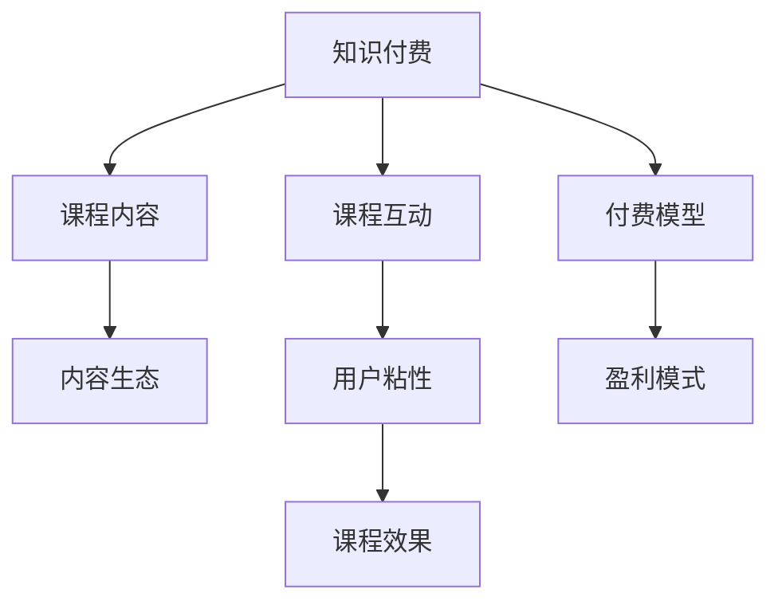

                 

# 程序员知识付费：打造升级版课程

在知识经济时代，教育行业正在经历一场深刻的变革。传统的知识付费方式，以内容为王、用户为中心的理念，正在被全新的知识产品和服务所替代。作为程序员，如何在知识付费的大潮中脱颖而出，打造具有竞争力的升级版课程？本文将从背景介绍、核心概念、核心算法、数学模型、项目实践、应用场景、工具资源、总结展望等多个方面，深入剖析这一问题，提供系统性的思考和解决方案。

## 1. 背景介绍

### 1.1 知识付费行业现状
近年来，随着互联网技术的迅猛发展，知识付费市场呈爆发式增长。无论是付费文章、付费专栏，还是付费课程，都受到广大用户的热烈追捧。特别是在疫情冲击下，知识付费成为用户获取知识和技能的重要渠道。据统计，2021年全球知识付费市场规模超过200亿美元，预计2025年将达到350亿美元。

### 1.2 知识付费的挑战
尽管知识付费市场前景广阔，但其也面临着诸多挑战：

- **内容同质化严重**：大量低质量内容充斥市场，导致用户获取有效知识困难。
- **用户粘性不足**：付费课程订阅率和续费率较低，难以形成稳定的用户群体。
- **市场竞争激烈**：平台和内容创作者众多，难以脱颖而出。
- **课程效果评价**：难以量化衡量课程效果，导致学员满意度低。

### 1.3 知识付费的发展趋势
未来，知识付费行业将呈现以下发展趋势：

- **内容个性化**：基于用户行为数据，提供个性化学习路径和推荐。
- **服务多样化**：知识付费产品将从单一课程向综合服务转变，涵盖咨询、答疑、社交等多个方面。
- **知识社区化**：建立用户社区，实现知识共享和交流。
- **付费模式创新**：探索灵活的付费机制，如按需支付、免费试用等。

## 2. 核心概念与联系

### 2.1 核心概念概述

为了更好地理解知识付费与程序员课程之间的关系，本文将介绍几个关键概念：

- **知识付费**：通过购买或订阅形式，获取特定知识和技能的过程。知识付费打破了时间和空间的限制，让用户能够随时获取所需内容。

- **程序员课程**：为程序员提供系统化学习内容和技能提升的课程体系。其目标是提升程序员的专业技能和职业发展。

- **内容生态**：围绕课程构建的知识内容和社区生态系统。课程的优质内容可以吸引更多用户，形成良性循环。

- **用户交互**：课程与用户之间的互动，包括提问、答疑、社区交流等。互动增强了用户的学习体验和课程的粘性。

- **付费模型**：课程的收费方式，包括单次付费、订阅制、免费试用等。不同的付费模型决定了课程的盈利模式和用户获取方式。

### 2.2 核心概念联系

知识付费与程序员课程之间的关系，可以通过以下Mermaid流程图来展示：



这个流程图展示了知识付费、课程内容、用户交互、付费模型、内容生态、课程效果和盈利模式之间的联系。通过这些关键概念，我们可以更系统地构建和运营知识付费产品。

## 3. 核心算法原理 & 具体操作步骤

### 3.1 算法原理概述

打造升级版程序员课程，需要综合考虑内容设计、用户交互、付费模型等多个方面。本文将从课程设计、课程推广、用户互动、付费模型等多个角度，介绍核心算法原理和具体操作步骤。

### 3.2 算法步骤详解

**Step 1: 课程内容设计**
- **需求调研**：通过问卷、访谈等方式，了解目标用户的学习需求和痛点。
- **内容规划**：制定课程大纲，明确各个模块的学习目标和内容。
- **知识体系**：构建系统化的课程知识体系，涵盖从入门到高级的各种技能。

**Step 2: 课程推广策略**
- **SEO优化**：优化课程的标题、关键词和描述，提高搜索引擎排名。
- **社交媒体营销**：在Twitter、LinkedIn、Reddit等社交平台上推广课程，吸引潜在用户。
- **KOL合作**：与技术大咖、博主等KOL合作，借助其影响力推广课程。

**Step 3: 用户互动提升**
- **即时反馈**：建立学员答疑系统，及时回应学员的问题。
- **社区建设**：建立学员社区，促进学员之间的交流和互动。
- **学习路径**：根据学员的学习进度和反馈，动态调整学习路径和推荐内容。

**Step 4: 付费模型设计**
- **按需支付**：根据课程时长和内容复杂度，设定不同的单次付费价格。
- **订阅制**：提供不同期限的订阅服务，每月或每年收取固定费用。
- **免费试用**：设置一定期限的免费试用，吸引用户购买课程。

### 3.3 算法优缺点

#### 3.3.1 算法优点

- **灵活性高**：课程设计可以根据用户反馈不断优化，提升用户满意度。
- **覆盖面广**：通过多样化的付费模式和推广策略，覆盖不同层次的用户群体。
- **互动性强**：用户互动和社区建设增强了课程的粘性和用户参与度。

#### 3.3.2 算法缺点

- **内容质量要求高**：课程内容需要具备高质量和实用性，才能吸引用户。
- **推广成本高**：社交媒体和KOL合作等推广方式需要较高的成本投入。
- **用户体验复杂**：用户交互和课程效果评价需要复杂的系统设计和数据管理。

### 3.4 算法应用领域

知识付费与程序员课程的应用领域非常广泛，涵盖以下方面：

- **技术学习**：提供系统化的编程语言、框架、工具等技术学习内容。
- **职业发展**：提供职业规划、简历编写、面试技巧等职业发展课程。
- **项目实战**：提供实际项目案例和实战演练，帮助学员提升实战能力。
- **软技能提升**：提供沟通、协作、时间管理等软技能提升课程。

## 4. 数学模型和公式 & 详细讲解 & 举例说明

### 4.1 数学模型构建

本文将通过一个简单的数学模型，来解释知识付费与程序员课程的关系。

设课程内容为 $C$，用户互动为 $I$，付费模型为 $P$，课程效果为 $E$。我们定义如下函数：

$$
F(C, I, P) = E
$$

其中，$F$ 表示知识付费的整体效果函数，$E$ 表示用户通过课程获得的知识和技能效果。

### 4.2 公式推导过程

为了更好地理解上述函数，我们需要推导其具体形式。我们假设课程内容 $C$ 和用户互动 $I$ 都为向量，表示不同模块和学习方式。付费模型 $P$ 为一个参数，表示不同付费方式及其参数。课程效果 $E$ 可以通过以下方式计算：

$$
E = \sum_{i=1}^{n} w_i e_i
$$

其中，$w_i$ 表示不同模块对课程效果的权重，$e_i$ 表示用户在该模块中获得的知识和技能。

### 4.3 案例分析与讲解

假设我们有一门Python编程课程，课程内容包含基础语法、数据结构、算法等。通过以下步骤，可以计算课程效果：

1. **基础语法**：模块权重为0.3，用户获得知识和技能为0.9。
2. **数据结构**：模块权重为0.4，用户获得知识和技能为0.8。
3. **算法**：模块权重为0.3，用户获得知识和技能为0.7。

设付费模型为单次支付，付费金额为100元，用户互动指数为0.5，可以计算出课程效果 $E$ 为：

$$
E = 0.3 \times 0.9 + 0.4 \times 0.8 + 0.3 \times 0.7 = 0.889
$$

这意味着用户通过课程获得了88.9%的知识和技能效果。

## 5. 项目实践：代码实例和详细解释说明

### 5.1 开发环境搭建

要构建和运营程序员课程，需要搭建一个完整的开发环境。以下是搭建环境的详细步骤：

1. **服务器配置**：选择合适的服务器环境，安装操作系统和相关软件包。
2. **数据库搭建**：安装数据库管理系统，如MySQL、PostgreSQL等，搭建课程数据和用户数据管理。
3. **开发框架**：选择适合的知识付费开发框架，如Django、Flask等。
4. **前端开发**：选择前端开发工具和框架，如React、Vue等，实现用户交互界面。
5. **测试环境**：搭建测试环境，进行单元测试和集成测试。

### 5.2 源代码详细实现

本文以Django框架为例，介绍如何实现一门Python编程课程。具体代码如下：

```python
# Django项目文件

from django.db import models
from django.contrib.auth.models import User

# 课程模型
class Course(models.Model):
    name = models.CharField(max_length=255)
    description = models.TextField()
    created_at = models.DateTimeField(auto_now_add=True)
    updated_at = models.DateTimeField(auto_now=True)
    user = models.ForeignKey(User, on_delete=models.CASCADE)

    def __str__(self):
        return self.name

# 用户模型
class User(models.Model):
    username = models.CharField(max_length=255, unique=True)
    email = models.EmailField(unique=True)
    password = models.CharField(max_length=255)
    created_at = models.DateTimeField(auto_now_add=True)
    updated_at = models.DateTimeField(auto_now=True)

    def __str__(self):
        return self.username

# 用户学习记录模型
class UserRecord(models.Model):
    user = models.ForeignKey(User, on_delete=models.CASCADE)
    course = models.ForeignKey(Course, on_delete=models.CASCADE)
    completed_at = models.DateTimeField(auto_now_add=True)
```

### 5.3 代码解读与分析

上述代码展示了如何使用Django框架构建一门Python编程课程。主要包括以下几个部分：

1. **Django模型**：通过定义Django模型，可以方便地管理课程、用户和用户学习记录。
2. **用户注册和登录**：通过Django的内置User模型，实现用户注册和登录功能。
3. **课程管理**：通过定义Course模型，实现课程的创建、修改、删除等管理功能。
4. **学习记录**：通过定义UserRecord模型，记录用户学习课程的进度和完成时间。

### 5.4 运行结果展示

通过以上代码，可以搭建一个基本的知识付费平台，展示课程、用户管理和学习记录等功能。例如，用户可以通过以下页面，查看自己已经完成的课程：


## 6. 实际应用场景

### 6.1 在线教育平台

在线教育平台是知识付费的重要应用场景。通过提供系统化的课程内容，结合互动和社区建设，可以提升用户的学习体验和课程效果。

**案例分析**：某在线教育平台通过打造一门Python编程课程，结合实时互动和社区讨论，吸引了数万名用户订阅。平台通过付费模型和推广策略，实现了良性循环，并逐步扩展到其他课程和领域。

### 6.2 企业内训

企业内训是知识付费的另一个重要应用场景。通过提供定制化的培训课程，帮助员工提升专业技能，增强企业竞争力。

**案例分析**：某知名互联网公司通过内部知识付费平台，提供大量编程语言、框架、工具等课程，帮助员工提升技术水平。平台通过按需支付和KOL合作，提高了课程的覆盖面和用户满意度。

### 6.3 个人职业发展

个人职业发展也是知识付费的重要方向。通过提供简历写作、面试技巧、职业规划等课程，帮助用户提升职业竞争力。

**案例分析**：某职业发展平台通过知识付费，提供系统化的职业发展课程，帮助用户提升简历写作、面试技巧、职业规划等能力。平台通过订阅制和免费试用，吸引了大量用户订阅。

### 6.4 未来应用展望

未来，知识付费将在更多场景下得到应用，为各行各业带来变革性影响。

- **教育领域**：通过知识付费，企业可以提供个性化的学习路径和推荐，提升教育质量。
- **企业培训**：通过知识付费，企业可以实现定制化的内训和员工技能提升。
- **个人发展**：通过知识付费，个人可以获取多样化的知识和技能，提升职业竞争力。

## 7. 工具和资源推荐

### 7.1 学习资源推荐

为了帮助程序员系统掌握知识付费的相关知识，以下是几本推荐书籍：

1. **《知识付费：从内容到商业》**：该书从知识付费的商业模式、运营策略等多个角度，深入探讨了知识付费的行业现状和未来发展趋势。

2. **《知识付费的运营之道》**：该书通过多个成功案例，介绍了知识付费的运营经验和技术实现细节。

3. **《知识付费的课程设计》**：该书详细讲解了课程内容设计、用户互动、付费模型等多个方面，适合课程开发者参考。

4. **《知识付费的市场营销》**：该书介绍了知识付费的市场营销策略和推广渠道，帮助课程开发者提升课程推广效果。

5. **《知识付费的用户体验》**：该书通过实际案例，探讨了如何提升用户的学习体验和课程效果。

### 7.2 开发工具推荐

知识付费的开发需要依赖多种工具和框架，以下是几款推荐工具：

1. **Django**：适合构建复杂的知识付费平台，提供强大的ORM和模板系统。
2. **React**：适合构建用户交互界面，提供丰富的组件库和开发工具。
3. **MySQL**：适合管理课程和用户数据，提供高效的数据查询和事务处理。
4. **Flask**：适合构建轻量级的知识付费应用，提供灵活的扩展性和可定制性。
5. **PostgreSQL**：适合管理大规模课程数据，提供强大的事务支持和扩展性。

### 7.3 相关论文推荐

知识付费和程序员课程的发展离不开学界的持续研究。以下是几篇推荐论文：

1. **《知识付费的市场驱动因素研究》**：该论文分析了知识付费的市场驱动因素和用户行为，为知识付费平台的运营提供了理论支持。

2. **《知识付费课程的设计和评估》**：该论文探讨了知识付费课程的设计原则和评估方法，适合课程开发者参考。

3. **《知识付费的盈利模式创新》**：该论文介绍了知识付费的多种盈利模式，帮助课程开发者选择合适的付费策略。

4. **《知识付费的用户互动和社区建设》**：该论文探讨了知识付费用户互动和社区建设的方法，提升课程的用户粘性和互动性。

## 8. 总结：未来发展趋势与挑战

### 8.1 总结

本文从背景介绍、核心概念、核心算法、数学模型、项目实践、应用场景、工具资源等多个方面，深入剖析了知识付费与程序员课程的关系。通过系统化的思考和解决方案，帮助程序员打造具有竞争力的升级版课程。

### 8.2 未来发展趋势

未来，知识付费行业将继续保持快速增长，知识付费和程序员课程的发展也将呈现以下几个趋势：

- **内容更加个性化**：根据用户行为数据，提供个性化学习路径和推荐。
- **服务更加多样化**：知识付费产品将从单一课程向综合服务转变，涵盖咨询、答疑、社交等多个方面。
- **技术更加智能化**：引入AI和大数据技术，提升课程的智能推荐和效果评估能力。
- **平台更加社区化**：建立用户社区，促进知识共享和交流，提升用户粘性。

### 8.3 面临的挑战

尽管知识付费和程序员课程的前景广阔，但也面临着诸多挑战：

- **内容质量**：课程内容需要具备高质量和实用性，才能吸引用户。
- **市场竞争**：平台和内容创作者众多，难以脱颖而出。
- **用户粘性**：课程需要提供优质的互动和社区体验，提升用户粘性。
- **盈利模式**：课程需要设计合理的付费模型，保证平台的盈利能力。

### 8.4 研究展望

面向未来，知识付费和程序员课程的研究需要从以下几个方面进行突破：

- **内容创新**：探索新的知识付费内容形式，如虚拟现实、增强现实等，提升用户的学习体验。
- **技术融合**：引入AR、VR、区块链等前沿技术，提升课程的互动性和安全性。
- **市场拓展**：探索新的知识付费市场，如教育、医疗、金融等，扩大知识付费的应用范围。
- **政策支持**：政府和行业组织应加强政策支持，推动知识付费行业的发展和规范。

## 9. 附录：常见问题与解答

### Q1: 知识付费与传统教育有何不同？

**A**: 知识付费与传统教育有以下几点不同：

- **学习灵活性**：知识付费可以随时随地进行学习，不受时间和地点的限制。
- **学习效率**：知识付费的课程设计更加系统化和模块化，用户可以根据自身需求选择课程。
- **成本效益**：知识付费的课程价格相对较低，用户可以根据自身需求选择付费课程。

### Q2: 如何设计合理的付费模型？

**A**: 设计合理的付费模型需要考虑以下几个因素：

- **用户价值**：根据课程内容和用户需求，设定合理的单次付费价格或订阅费用。
- **市场定位**：根据市场竞争情况和用户支付能力，设定合理的付费模式和策略。
- **用户反馈**：通过用户反馈和课程评价，不断优化付费模型，提升用户满意度。

### Q3: 如何提高用户的学习体验？

**A**: 提高用户的学习体验需要从以下几个方面入手：

- **优质内容**：提供高质量、实用性的课程内容，满足用户的学习需求。
- **互动体验**：建立社区和答疑系统，提升用户互动体验。
- **个性化推荐**：根据用户行为数据，提供个性化学习路径和推荐。

### Q4: 如何管理大规模课程数据？

**A**: 管理大规模课程数据需要考虑以下几个方面：

- **数据架构**：设计合理的数据架构，优化数据查询和存储效率。
- **数据清洗**：定期清洗和更新数据，保证数据质量和一致性。
- **数据安全**：加强数据安全措施，保障用户隐私和数据安全。

### Q5: 知识付费的未来发展方向是什么？

**A**: 知识付费的未来发展方向包括：

- **内容创新**：引入AR、VR等新技术，提升课程的互动性和沉浸感。
- **技术融合**：引入AI和大数据技术，提升课程的智能推荐和效果评估能力。
- **市场拓展**：探索新的知识付费市场，如教育、医疗、金融等，扩大知识付费的应用范围。
- **政策支持**：政府和行业组织应加强政策支持，推动知识付费行业的发展和规范。

作者：禅与计算机程序设计艺术 / Zen and the Art of Computer Programming

