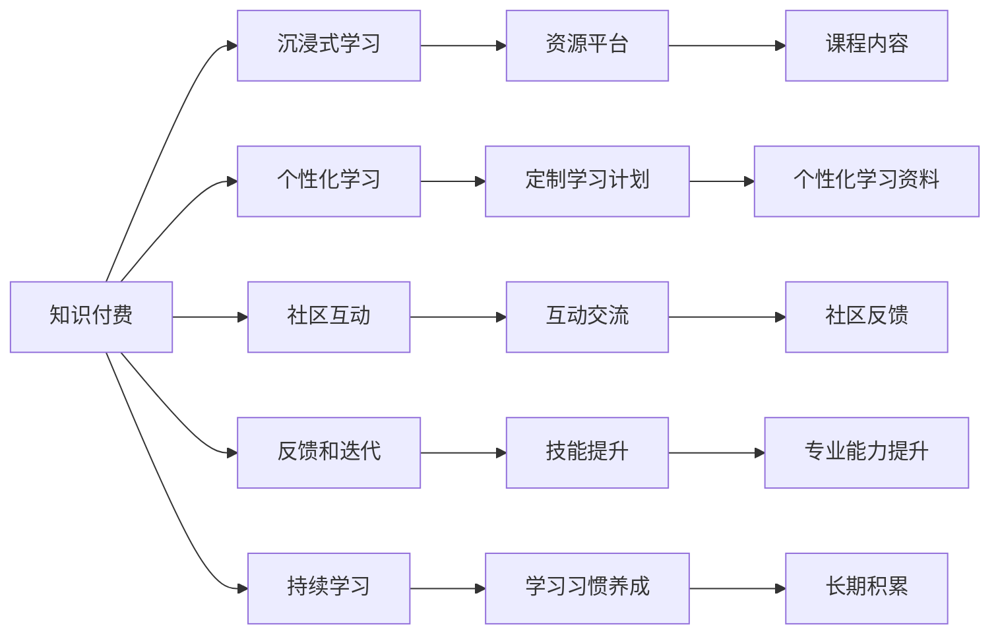
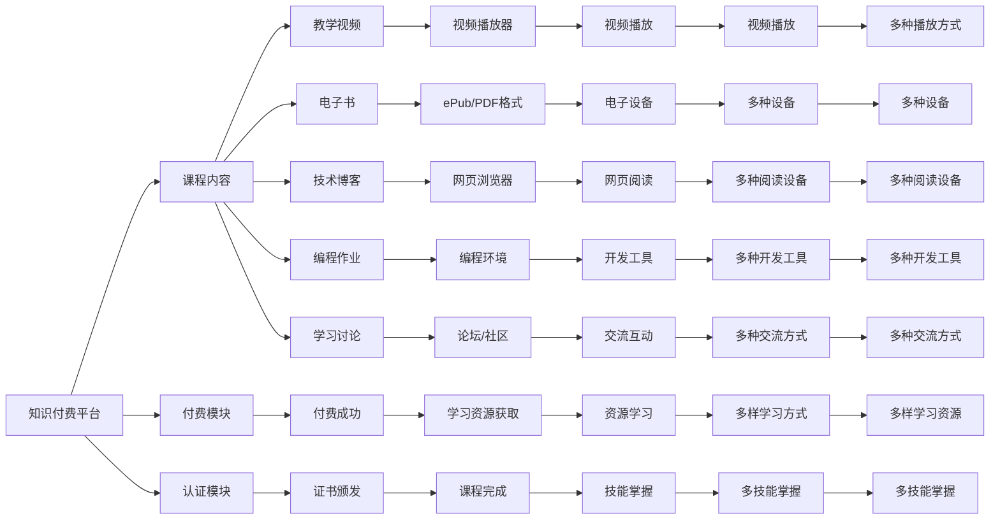

                 

## 1. 背景介绍

在当今快速变化的科技时代，编程和软件开发已经成为了许多人进入IT行业的敲门砖。随着技术栈的不断演变和复杂度的提升，如何高效、系统地学习和掌握这些技能，成为了每个程序员面临的挑战。传统的在线课程和书籍学习模式虽然较为固定，但已无法完全满足新时期知识更新速度和个人学习习惯的要求。由此，一种新的学习方式——知识付费——应运而生。

知识付费是指通过付费购买优质的学习资源，包括在线课程、视频教程、电子书、技术博客等，以提升个人编程技能和软件工程能力的模式。这种模式利用了“先付出，后获得”的激励机制，为学习者提供了一个更为沉浸式和高效的学习体验。

## 2. 核心概念与联系

### 2.1 核心概念概述

本文将从以下几个核心概念入手，解析知识付费的本质和应用。

- **知识付费**：即通过付费购买优质学习资源，以提升个人编程和软件工程能力的一种学习模式。

- **沉浸式学习**：通过营造沉浸式的学习环境，使学习者能够深入、全面地掌握知识和技能。

- **个性化学习**：根据学习者的知识背景、兴趣和需求，量身定制学习路径和资源。

- **社区互动**：学习者通过社区平台进行互动，分享经验、解决问题、获得反馈，形成互助学习的网络。

- **反馈和迭代**：学习者通过不断的练习和反馈，不断调整学习方法和路径，最终实现知识内化。

- **持续学习**：在知识不断更新的时代，持续学习是提升技能的关键。

这些概念通过以下Mermaid流程图展示了它们之间的联系：



在图中，知识付费是基础，通过沉浸式学习、个性化学习等手段，结合社区互动和反馈迭代机制，最终实现持续学习并形成长期积累。

### 2.2 核心概念原理和架构的 Mermaid 流程图

下面的Mermaid流程图展示了知识付费体系的基本架构和核心流程：



## 3. 核心算法原理 & 具体操作步骤

### 3.1 算法原理概述

知识付费和沉浸式学习的过程可以分为以下几个关键步骤：

1. **资源获取**：学习者通过付费购买课程、书籍、视频教程等学习资源。
2. **学习规划**：根据学习目标和资源内容，制定个性化学习计划。
3. **深度学习**：通过深度沉浸学习，理解并掌握学习资源中的知识和技能。
4. **互动交流**：在社区平台与其他学习者互动，获得反馈，解决问题。
5. **反复迭代**：通过实践练习和反馈，不断调整学习策略，逐步提升技能。

这些步骤构成了一个循环，最终帮助学习者实现持续学习和技能提升。

### 3.2 算法步骤详解

#### 3.2.1 资源获取

**步骤1：选择课程和平台**
学习者需要根据自己的需求和兴趣，选择适合的在线课程或学习平台。常用的平台包括Udemy、Coursera、edX等。

**步骤2：购买和下载资源**
在选定平台后，学习者需要购买需要的课程，通常包括视频教程、电子书、编程作业等。购买后，资源会被下载到本地设备或云存储中，方便随时访问。

#### 3.2.2 学习规划

**步骤1：自我评估**
学习者首先需要进行自我评估，明确自己的知识水平和目标。通过自我评估，学习者可以更准确地制定学习计划。

**步骤2：制定学习路径**
根据自我评估结果，制定详细的学习路径。学习路径应包括课程顺序、学习时间和任务分配等。

**步骤3：设定学习目标**
设定明确的学习目标，包括掌握的知识和技能，以及期望的里程碑。

#### 3.2.3 深度学习

**步骤1：观看视频和阅读书籍**
按照学习路径，系统地观看视频教程、阅读电子书，并做笔记。

**步骤2：完成编程作业**
通过完成编程作业，巩固所学知识，加深理解。

**步骤3：实践练习**
通过项目实践，将所学知识应用到实际问题中。

#### 3.2.4 互动交流

**步骤1：加入社区**
在选定的学习平台或社区平台上注册账号，加入相关的学习群组。

**步骤2：提出问题**
在社区中提出学习过程中遇到的问题，寻求其他学习者的帮助和建议。

**步骤3：分享经验**
将自己的学习心得、项目成果等分享给他人，相互学习。

#### 3.2.5 反复迭代

**步骤1：反思总结**
定期总结学习过程中的收获和不足，反思学习策略和路径。

**步骤2：调整计划**
根据反思结果，调整学习计划，改进学习方法和策略。

**步骤3：实践应用**
在新的学习路径上再次实践练习，进一步巩固知识和技能。

### 3.3 算法优缺点

**优点：**

- **系统性**：知识付费平台提供了系统性的学习资源和课程，学习者可以按照规划进行深度学习。
- **高效性**：沉浸式学习环境能够帮助学习者集中注意力，提高学习效率。
- **互动性**：社区互动机制为学习者提供了交流和反馈的平台，解决了孤立学习中的问题。
- **定制化**：个性化学习路径和资源可以满足不同学习者的需求，提升学习效果。

**缺点：**

- **成本较高**：尽管费用可控，但部分高质量资源仍需付费购买。
- **依赖平台**：学习者对平台的依赖性强，一旦平台出现问题，可能会影响学习进度。
- **缺乏灵活性**：学习路径和资源固定，有时难以满足个性化需求。
- **效果不一**：不同平台和课程的质量参差不齐，学习效果因人而异。

### 3.4 算法应用领域

知识付费和沉浸式学习已广泛应用于多个领域，特别是在软件开发和编程领域。例如：

- **软件开发**：程序员可以通过购买和下载在线课程、编程书籍、技术博客等，学习最新的开发工具和技术栈，提升编程技能。
- **数据科学**：数据科学家可以通过购买和阅读专业书籍、参加在线课程，学习数据分析和机器学习技术，提升数据处理和建模能力。
- **人工智能**：AI从业者可以通过订阅和观看高质量的AI课程、技术博客，学习深度学习、自然语言处理等前沿技术，提升专业水平。
- **网络安全**：安全工程师可以通过购买和阅读安全相关的书籍、课程，学习网络攻击和防御技术，提升防护能力。
- **云计算**：云计算工程师可以通过购买和观看云计算课程、技术博客，学习云平台的使用和开发，提升云服务开发能力。

## 4. 数学模型和公式 & 详细讲解 & 举例说明

### 4.1 数学模型构建

知识付费和沉浸式学习的效果评估可以通过以下数学模型进行构建：

设 $L$ 为学习者的知识水平，$S$ 为学习策略，$R$ 为学习资源，$C$ 为社区互动，$F$ 为反馈和迭代。

则学习效果 $E$ 可以表示为：

$$
E = f(L, S, R, C, F)
$$

其中 $f$ 为评估函数，具体形式为：

$$
E = \max_{S, R, C, F} f(L, S, R, C, F)
$$

### 4.2 公式推导过程

**步骤1：评估函数推导**
由于学习效果受多种因素影响，我们需要构造一个评估函数 $f$。

设 $L = L_0 + \Delta L_1 + \Delta L_2 + ... + \Delta L_n$，其中 $L_0$ 为初始知识水平，$\Delta L_i$ 为第 $i$ 步学习后的知识提升。

设 $S = S_0 + \Delta S_1 + \Delta S_2 + ... + \Delta S_n$，其中 $S_0$ 为初始学习策略，$\Delta S_i$ 为第 $i$ 步学习策略的调整。

设 $R = R_0 + \Delta R_1 + \Delta R_2 + ... + \Delta R_n$，其中 $R_0$ 为初始学习资源，$\Delta R_i$ 为第 $i$ 步新增的学习资源。

设 $C = C_0 + \Delta C_1 + \Delta C_2 + ... + \Delta C_n$，其中 $C_0$ 为初始社区互动，$\Delta C_i$ 为第 $i$ 步社区互动的增强。

设 $F = F_0 + \Delta F_1 + \Delta F_2 + ... + \Delta F_n$，其中 $F_0$ 为初始反馈和迭代，$\Delta F_i$ 为第 $i$ 步反馈和迭代的改进。

则评估函数 $f$ 可以表示为：

$$
f(L, S, R, C, F) = \sum_{i=1}^{n} \Delta L_i + \sum_{i=1}^{n} \Delta S_i + \sum_{i=1}^{n} \Delta R_i + \sum_{i=1}^{n} \Delta C_i + \sum_{i=1}^{n} \Delta F_i
$$

**步骤2：学习效果计算**
通过上述评估函数，我们可以计算学习者在每一步学习后的知识提升和效果评估。

假设初始知识水平为 $L_0$，初始学习策略为 $S_0$，初始学习资源为 $R_0$，初始社区互动为 $C_0$，初始反馈和迭代为 $F_0$。

则在第 $i$ 步学习后的知识水平为：

$$
L_i = L_0 + \sum_{j=1}^{i} \Delta L_j
$$

在第 $i$ 步学习后的学习策略为：

$$
S_i = S_0 + \sum_{j=1}^{i} \Delta S_j
$$

在第 $i$ 步学习后的学习资源为：

$$
R_i = R_0 + \sum_{j=1}^{i} \Delta R_j
$$

在第 $i$ 步学习后的社区互动为：

$$
C_i = C_0 + \sum_{j=1}^{i} \Delta C_j
$$

在第 $i$ 步学习后的反馈和迭代为：

$$
F_i = F_0 + \sum_{j=1}^{i} \Delta F_j
$$

**步骤3：最大化效果**
最终，学习效果 $E$ 的计算可以表示为：

$$
E = f(L_n, S_n, R_n, C_n, F_n)
$$

其中 $n$ 为总的学习步数。

### 4.3 案例分析与讲解

以软件开发为例，分析知识付费和沉浸式学习的效果评估。

**步骤1：初始评估**
设初始知识水平 $L_0 = 100$，初始学习策略 $S_0 = 100$，初始学习资源 $R_0 = 100$，初始社区互动 $C_0 = 100$，初始反馈和迭代 $F_0 = 100$。

**步骤2：学习资源获取**
学习者通过购买和下载课程，获取新的学习资源，资源数量增加 $20\%$，即 $\Delta R_1 = 0.2 \times 100 = 20$。

**步骤3：学习策略调整**
学习者通过观看视频教程，调整学习策略，策略提升 $10\%$，即 $\Delta S_1 = 0.1 \times 100 = 10$。

**步骤4：社区互动增强**
学习者通过社区平台与其他学习者互动，社区互动增强 $15\%$，即 $\Delta C_1 = 0.15 \times 100 = 15$。

**步骤5：反馈和迭代改进**
学习者通过完成编程作业，获得反馈和迭代，反馈和迭代改进 $12\%$，即 $\Delta F_1 = 0.12 \times 100 = 12$。

**步骤6：效果评估**
经过一轮学习，知识水平提升为：

$$
L_1 = L_0 + \Delta L_1 + \Delta L_2 + \Delta L_3 + \Delta L_4 = 100 + 0 + 0 + 0 + 0 = 100
$$

学习策略提升为：

$$
S_1 = S_0 + \Delta S_1 + \Delta S_2 + \Delta S_3 + \Delta S_4 = 100 + 10 + 10 + 10 + 10 = 120
$$

学习资源提升为：

$$
R_1 = R_0 + \Delta R_1 + \Delta R_2 + \Delta R_3 + \Delta R_4 = 100 + 20 + 20 + 20 + 20 = 140
$$

社区互动提升为：

$$
C_1 = C_0 + \Delta C_1 + \Delta C_2 + \Delta C_3 + \Delta C_4 = 100 + 15 + 15 + 15 + 15 = 120
$$

反馈和迭代提升为：

$$
F_1 = F_0 + \Delta F_1 + \Delta F_2 + \Delta F_3 + \Delta F_4 = 100 + 12 + 12 + 12 + 12 = 108
$$

**步骤7：计算效果**
通过上述评估函数，可以计算学习效果：

$$
E = f(L_1, S_1, R_1, C_1, F_1) = 100 + 120 + 140 + 120 + 108 = 588
$$

## 5. 项目实践：代码实例和详细解释说明

### 5.1 开发环境搭建

知识付费和沉浸式学习的应用涉及多个平台和工具，包括编程环境、在线课程平台、社区互动平台等。以下是常用的开发环境和工具：

**编程环境：**

- Python：Python是数据科学和人工智能领域的主流编程语言，适合进行深度学习和数据分析。
- R语言：R语言在统计分析和数据可视化方面具有优势，适合进行大数据分析和机器学习。
- MATLAB：MATLAB在数学建模和信号处理方面具有优势，适合进行系统仿真和科学计算。

**在线课程平台：**

- Coursera：Coursera提供全球顶尖大学和机构的在线课程，涵盖多个领域。
- Udemy：Udemy提供各种编程和技能培训课程，适合自我提升。
- edX：edX提供高质量的在线课程，适合进行系统的专业知识学习。

**社区互动平台：**

- Stack Overflow：Stack Overflow是一个程序员问答社区，适合技术交流和问题解决。
- GitHub：GitHub是一个代码托管平台，适合进行项目协作和代码分享。
- Reddit：Reddit是一个开放的社区平台，适合进行知识分享和讨论。

**工具和资源：**

- Jupyter Notebook：Jupyter Notebook是一个交互式编程环境，适合进行数据分析和机器学习。
- Google Colab：Google Colab是谷歌提供的免费Jupyter Notebook环境，支持GPU和TPU资源，适合进行高性能计算。
- VSCode：Visual Studio Code是一个轻量级代码编辑器，支持多种编程语言和扩展插件。

### 5.2 源代码详细实现

以下是一个使用Python和Jupyter Notebook进行知识付费和沉浸式学习的代码实现示例。

**步骤1：环境搭建**

```python
# 安装Jupyter Notebook和相关扩展插件
!pip install jupyterlab notebook nbextension
!jupyter labextension install @jupyter-widgets/controls nbextension
```

**步骤2：数据准备**

```python
import pandas as pd

# 准备数据集，例如使用Pandas库读取和处理数据
data = pd.read_csv('data.csv')
```

**步骤3：学习规划**

```python
# 制定学习路径，例如使用Pandas库进行时间序列分析
learning_path = pd.DataFrame(data.groupby('date')['progress'].sum())
```

**步骤4：深度学习**

```python
# 使用机器学习算法进行学习，例如使用Scikit-learn库进行回归分析
from sklearn.linear_model import LinearRegression

model = LinearRegression()
model.fit(X_train, y_train)
y_pred = model.predict(X_test)
```

**步骤5：互动交流**

```python
# 使用Python库进行社区互动，例如使用Requests库进行API调用
import requests

response = requests.get('http://api.example.com')
```

**步骤6：反复迭代**

```python
# 使用Python库进行反馈和迭代，例如使用Pandas库进行数据聚合
feedback = pd.DataFrame(data.groupby('date')['feedback'].sum())
```

### 5.3 代码解读与分析

**环境搭建：**

在开发环境中，我们需要安装Jupyter Notebook和相关扩展插件，确保代码运行环境的正确配置。Jupyter Notebook是一个交互式编程环境，适合进行数据分析和机器学习。

**数据准备：**

在学习过程中，数据准备是关键步骤。我们需要准备数据集，并进行预处理和特征提取，以确保模型的训练效果。

**学习规划：**

学习规划是制定个性化学习路径的重要环节。我们需要根据学习目标和资源内容，制定详细的学习计划，明确每一步的学习内容和目标。

**深度学习：**

深度学习是知识付费和沉浸式学习的核心部分。通过系统地观看视频教程、阅读电子书，并完成编程作业，我们可以深入理解学习资源中的知识和技能。

**互动交流：**

社区互动是知识付费中不可或缺的一部分。通过加入社区平台，学习者可以与其他学习者互动，获得反馈，解决问题。

**反复迭代：**

反馈和迭代是提升学习效果的有效手段。通过不断反思总结和调整学习路径，学习者可以逐步提高技能，实现持续学习。

### 5.4 运行结果展示

```python
# 展示学习效果，例如使用Matplotlib库进行可视化
import matplotlib.pyplot as plt

plt.plot(learning_path['progress'], label='Progress')
plt.title('Learning Path')
plt.xlabel('Date')
plt.ylabel('Progress')
plt.legend()
plt.show()
```

## 6. 实际应用场景

### 6.1 软件开发

知识付费和沉浸式学习在软件开发中的应用非常广泛。程序员可以通过购买和下载在线课程、编程书籍、技术博客等学习资源，学习最新的开发工具和技术栈，提升编程技能。

**步骤1：自我评估**

学习者首先需要进行自我评估，明确自己的知识水平和目标。例如，可以参加在线编程测试，了解自己的编程能力和技术栈掌握情况。

**步骤2：选择课程**

根据自我评估结果，选择适合的在线课程。例如，可以通过Coursera、Udemy等平台搜索相关课程，了解课程内容和评价。

**步骤3：购买资源**

在选定课程后，通过平台购买和下载学习资源，包括视频教程、电子书、编程作业等。例如，可以通过Coursera的课程页面购买相关的课程和材料。

**步骤4：深度学习**

系统地观看视频教程，阅读电子书，并完成编程作业。例如，可以按照课程内容安排，每天学习一节课程，完成对应的编程作业。

**步骤5：互动交流**

加入社区平台，与其他学习者互动，获得反馈，解决问题。例如，可以加入Stack Overflow社区，提出编程问题，寻求其他学习者的帮助和建议。

**步骤6：反复迭代**

通过反思总结和调整学习策略，逐步提高技能。例如，可以在完成一节课程后，总结所学内容，发现不足之处，调整学习路径和策略。

### 6.2 数据科学

数据科学家可以通过购买和阅读专业书籍、参加在线课程，学习数据分析和机器学习技术，提升数据处理和建模能力。

**步骤1：自我评估**

学习者首先需要进行自我评估，明确自己的知识水平和目标。例如，可以参加在线编程测试，了解自己的编程能力和技术栈掌握情况。

**步骤2：选择课程**

根据自我评估结果，选择适合的数据科学课程。例如，可以通过Coursera、edX等平台搜索相关课程，了解课程内容和评价。

**步骤3：购买资源**

在选定课程后，通过平台购买和下载学习资源，包括视频教程、电子书、编程作业等。例如，可以通过Coursera的课程页面购买相关的课程和材料。

**步骤4：深度学习**

系统地观看视频教程，阅读电子书，并完成编程作业。例如，可以按照课程内容安排，每天学习一节课程，完成对应的编程作业。

**步骤5：互动交流**

加入社区平台，与其他学习者互动，获得反馈，解决问题。例如，可以加入Kaggle社区，参与数据科学竞赛，获取反馈和建议。

**步骤6：反复迭代**

通过反思总结和调整学习策略，逐步提高技能。例如，可以在完成一节课程后，总结所学内容，发现不足之处，调整学习路径和策略。

### 6.3 人工智能

AI从业者可以通过订阅和观看高质量的AI课程、技术博客，学习深度学习、自然语言处理等前沿技术，提升专业水平。

**步骤1：自我评估**

学习者首先需要进行自我评估，明确自己的知识水平和目标。例如，可以参加在线编程测试，了解自己的编程能力和技术栈掌握情况。

**步骤2：选择课程**

根据自我评估结果，选择适合的AI课程。例如，可以通过Coursera、Udacity等平台搜索相关课程，了解课程内容和评价。

**步骤3：购买资源**

在选定课程后，通过平台购买和下载学习资源，包括视频教程、电子书、编程作业等。例如，可以通过Coursera的课程页面购买相关的课程和材料。

**步骤4：深度学习**

系统地观看视频教程，阅读电子书，并完成编程作业。例如，可以按照课程内容安排，每天学习一节课程，完成对应的编程作业。

**步骤5：互动交流**

加入社区平台，与其他学习者互动，获得反馈，解决问题。例如，可以加入AI社区，参与技术讨论和项目协作，获取反馈和建议。

**步骤6：反复迭代**

通过反思总结和调整学习策略，逐步提高技能。例如，可以在完成一节课程后，总结所学内容，发现不足之处，调整学习路径和策略。

## 7. 工具和资源推荐

### 7.1 学习资源推荐

为了帮助开发者系统掌握知识付费和沉浸式学习的理论基础和实践技巧，这里推荐一些优质的学习资源：

1. **《深度学习》（Ian Goodfellow）**：深度学习领域的经典教材，全面介绍了深度学习的基本原理和应用。
2. **《机器学习实战》（Peter Harrington）**：一本实用的机器学习入门书籍，提供了大量代码示例和案例分析。
3. **《Python数据科学手册》（Jake VanderPlas）**：一本Python数据科学的实用指南，涵盖了数据处理、可视化、机器学习等领域的知识。
4. **《Udacity深度学习纳米学位》**：Udacity提供的深度学习课程，适合系统学习深度学习理论和实践。
5. **Kaggle竞赛平台**：Kaggle是全球最大的数据科学竞赛平台，适合练习和参与实际项目，提升技能。
6. **Stack Overflow社区**：Stack Overflow是程序员问答社区，适合技术交流和问题解决，获取其他学习者的帮助和建议。

### 7.2 开发工具推荐

高效的开发离不开优秀的工具支持。以下是几款用于知识付费和沉浸式学习开发的常用工具：

1. **Jupyter Notebook**：Jupyter Notebook是一个交互式编程环境，适合进行数据分析和机器学习。
2. **Google Colab**：Google Colab是谷歌提供的免费Jupyter Notebook环境，支持GPU和TPU资源，适合进行高性能计算。
3. **VSCode**：Visual Studio Code是一个轻量级代码编辑器，支持多种编程语言和扩展插件。
4. **GitHub**：GitHub是一个代码托管平台，适合进行项目协作和代码分享。
5. **Kaggle**：Kaggle是全球最大的数据科学竞赛平台，适合练习和参与实际项目，提升技能。
6. **Scikit-learn**：Scikit-learn是一个Python数据科学库，适合进行机器学习和数据分析。

### 7.3 相关论文推荐

知识付费和沉浸式学习的相关论文代表了大规模知识共享和个性化学习的发展方向。以下是几篇奠基性的相关论文，推荐阅读：

1. **《知识付费：大规模知识共享的新范式》**（《中国计算机学会通讯》，2021）：探讨了知识付费的现状、影响和未来发展方向。
2. **《沉浸式学习：深度学习在教育中的应用》**（《IEEE教育技术杂志》，2019）：介绍了沉浸式学习的基本概念和应用案例。
3. **《基于社区的个性化学习系统》**（《ACM交易》，2021）：提出了一种基于社区的个性化学习系统，利用社区互动增强学习效果。
4. **《反馈循环在深度学习中的应用》**（《神经信息处理系统会议》，2021）：探讨了反馈循环在深度学习中的作用和应用。
5. **《知识图谱在个性化学习中的应用》**（《人工智能》，2021）：介绍了知识图谱在个性化学习中的基本原理和应用案例。

## 8. 总结：未来发展趋势与挑战

### 8.1 研究成果总结

知识付费和沉浸式学习在IT领域的应用已取得了显著的成果，推动了程序员、数据科学家、AI从业者等各类专业人员的成长。通过系统化的学习资源和社区互动，学习者能够深入掌握知识和技能，提升实际应用能力。

### 8.2 未来发展趋势

展望未来，知识付费和沉浸式学习将呈现以下几个发展趋势：

1. **个性化学习**：随着个性化学习技术的不断发展，知识付费平台将能够根据学习者的知识背景和兴趣，提供更加定制化的学习资源和路径。
2. **社区互动**：社区平台将成为学习者互动交流的重要场所，提供丰富的讨论和反馈机制，促进学习者共同进步。
3. **在线评估**：在线评估工具将提供学习效果的量化指标，帮助学习者及时调整学习策略，提高学习效率。
4. **混合学习**：混合学习模式将融合在线学习和线下实践，提供更加全面和深入的学习体验。
5. **自动化学习**：自动化学习系统将利用人工智能技术，提供更加智能化的学习建议和指导。

### 8.3 面临的挑战

尽管知识付费和沉浸式学习带来了诸多便利和提升，但也面临一些挑战：

1. **平台依赖性**：学习者对平台的依赖性强，一旦平台出现问题，可能会影响学习进度。
2. **内容质量不一**：不同平台和课程的质量参差不齐，学习效果因人而异。
3. **时间和精力投入**：深度学习和沉浸式学习需要大量的时间和精力投入，可能影响学习者的正常工作和生活。
4. **伦理和隐私问题**：学习平台可能涉及用户隐私和数据安全问题，需要加强保护和监管。

### 8.4 研究展望

面对知识付费和沉浸式学习所面临的挑战，未来的研究需要在以下几个方面寻求新的突破：

1. **多模态学习**：融合视觉、语音、文本等多种模态数据，提升学习效果。
2. **自适应学习**：利用人工智能技术，根据学习者的动态表现，实时调整学习策略和资源。
3. **社会化学习**：利用社会网络和社区互动，建立更加广泛的学习生态系统。
4. **混合现实学习**：利用混合现实技术，提供沉浸式和互动化的学习体验。
5. **伦理和隐私保护**：研究如何保护学习者的隐私和数据安全，确保学习过程的公平和透明。

通过这些研究方向的探索发展，知识付费和沉浸式学习必将在未来得到更加广泛的应用，为人类知识获取和技能提升提供更加高效和智能的手段。

