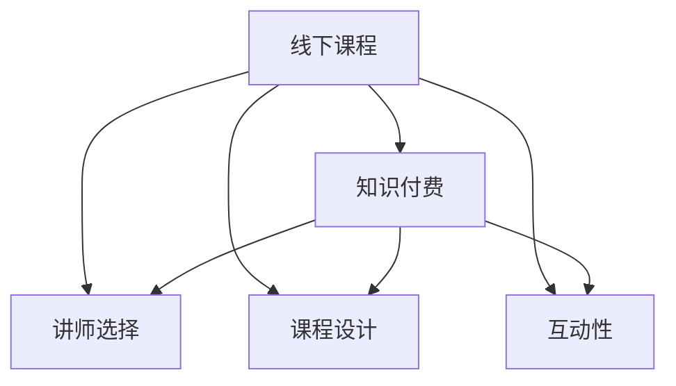

                 

# 程序员知识付费：打造线下课程

> 关键词：知识付费, 线下课程, 付费知识, 在线教育, 课程设计

## 1. 背景介绍

### 1.1 问题由来

在过去几年中，线上教育已经取得了快速发展，为各行各业提供了大量的学习资源。然而，随着互联网教育的深入，我们逐渐发现线上学习存在一些难以克服的问题。首先，线上学习的自主性要求较高，对用户的学习习惯和自我管理能力提出了挑战；其次，线上教育缺乏面对面互动，师生沟通效率低下；此外，线上课程质量参差不齐，难以保证教学效果。为了应对这些挑战，线下课程逐渐成为知识付费领域的一个热门趋势。

线下课程以其高互动性、高效率、高收益的特点，吸引了越来越多的教育机构和学生。程序员知识付费市场也逐步崛起，吸引了大量具备技术背景的专家、学者，以及业内大咖。他们借助自身专业知识，通过线下课程，向学员提供有价值的编程知识和实战经验，帮助学员快速提升技术能力，实现职业发展。

### 1.2 问题核心关键点

线下课程的核心理念是，通过高质量的线下交流，实现知识的高效传递。课程设计需紧密结合实际问题，避免纯理论讲授，注重学员的实操能力。课程的执行需依赖高素质的讲师，他们需具备丰富的编程经验、卓越的演讲技巧和出色的案例分享能力。课程的效果需通过学员的反馈和成果验证，保证课程的实用性和有效性。

线下课程的这些特点决定了其开发和运营的复杂性。从课程策划到讲师选择，再到课程实施和成果评估，每一个环节都需要精心的设计和专业的管理。本文将详细介绍线下课程的关键要素和实现方法，为教育行业的从业者提供实用的指导。

## 2. 核心概念与联系

### 2.1 核心概念概述

为更好地理解线下课程的开发和运营，本节将介绍几个关键概念：

- **线下课程**：是指通过面对面的方式，在实体场地开展的教学活动。相比于线上课程，线下课程更加注重互动和体验，能够提供更为深入和个性化的教学服务。
- **知识付费**：指通过支付费用，获取高质量知识资源的行为。线下课程作为一种知识付费形式，以其独特的优势，在教育市场中逐渐成为主流。
- **讲师选择**：线下课程的成败在很大程度上取决于讲师的专业水平和教学能力。选择具备丰富编程经验、良好沟通能力和强大案例分享能力的讲师，是课程成功的关键。
- **课程设计**：线下课程需充分考虑学员的背景和需求，设计具有实操性和实用性的课程内容。课程应包含理论讲解和实操训练，帮助学员提升综合能力。
- **互动性**：线下课程强调讲师与学员之间的互动，通过现场问答、小组讨论、项目实战等方式，提升学员的学习效果。

这些核心概念之间的逻辑关系可以通过以下Mermaid流程图来展示：



这个流程图展示了线下课程的核心要素及其之间的关系：

1. 线下课程通过知识付费获取优质资源。
2. 课程成功依赖于讲师的选择和课程设计。
3. 互动性是线下课程的一大特色，提升学员学习效果。

## 3. 核心算法原理 & 具体操作步骤
### 3.1 算法原理概述

线下课程的开发和运营，本质上是一个复杂的多目标优化问题。需平衡讲师的讲课效果、课程内容的质量、学员的互动体验以及课程的商业收益。优化目标可以是提高课程满意度、增加学员参与度、提升讲师知名度、实现课程收支平衡等。

课程设计需从多个维度进行综合考虑，主要包括课程主题选择、内容结构安排、教学方法设计、互动环节设置等。课程开发需通过系统化的流程，确保讲师的教学质量和学员的学习效果。课程运营需从市场营销、学员管理、讲师反馈等多个环节进行精细化管理。

### 3.2 算法步骤详解

线下课程的开发和运营可以分为以下几个关键步骤：

**Step 1: 市场调研与需求分析**

- 进行市场调研，了解目标学员的年龄、学历、专业背景、学习需求等。
- 分析市场趋势和竞争对手，确定课程主题和定位。
- 设定课程的预期收益和目标学员数量。

**Step 2: 讲师招募与评估**

- 制定讲师招募标准，筛选具备专业技能和教学经验的讲师。
- 评估讲师的教学能力、案例分享技巧、沟通互动能力等。
- 确定讲师薪酬、福利和绩效考核指标。

**Step 3: 课程设计与优化**

- 确定课程的模块结构、教学目标和评估标准。
- 设计实用的案例和实操项目，提升课程的实操性。
- 设定互动环节，增强讲师与学员之间的互动。
- 进行课程试点，收集反馈，不断优化课程内容。

**Step 4: 课程推广与营销**

- 制定课程宣传方案，选择合适的宣传渠道（如社交媒体、线下海报等）。
- 建立讲师与学员的沟通渠道，提供课程预告和报名指引。
- 监测课程报名情况，及时调整宣传策略。

**Step 5: 课程实施与管理**

- 按照课程计划安排讲师授课和互动环节。
- 监测学员参与度，及时调整课程内容和方法。
- 收集学员反馈，改进课程设计。
- 维护讲师和学员的良好关系，提升课程满意度。

**Step 6: 课程评估与反馈**

- 设置课程满意度调查表，收集学员对课程的评价。
- 分析课程效果和学员反馈，确定改进方向。
- 总结课程经验和教训，提升课程质量。

### 3.3 算法优缺点

线下课程具有以下优点：

1. 高互动性：面对面的互动能提供更好的教学效果，提升学员的学习体验。
2. 高效率：通过实践和互动，快速提升学员的实操能力。
3. 高收益：与线上课程相比，线下课程往往能获得更高的收益，讲师的薪酬也更有保障。
4. 高保障：课程实施过程可实时监控，及时调整课程内容，确保教学质量。

然而，线下课程也存在一些缺点：

1. 成本较高：场地租赁、讲师薪酬、营销推广等成本较高。
2. 场地受限：课程实施地点受地理位置限制，推广范围有限。
3. 灵活性不足：课程计划较为固定，学员的灵活性较差。
4. 教学效果依赖讲师：讲师的教学能力直接影响课程质量，需谨慎选择。

尽管存在这些缺点，但线下课程的高互动性和高收益使其在知识付费市场中依然具有独特的优势，值得教育行业的从业者深入研究和探索。

### 3.4 算法应用领域

线下课程的应用领域十分广泛，主要涵盖以下几个方面：

- **编程技能培训**：面向不同层次的程序员，提供编程语言、框架、工具等方面的培训，帮助学员提升技术能力。
- **项目实战演练**：通过模拟真实项目，提供项目开发、测试、部署等全流程实战训练，提升学员的综合能力。
- **职业规划指导**：提供职业规划、简历优化、面试技巧等方面的指导，帮助学员实现职业发展。
- **技术前沿分享**：邀请业界大咖分享最新的技术动态、行业趋势，帮助学员把握技术前沿。

除了上述几个主要领域外，线下课程还可以应用于更多场景中，如企业内训、政府培训、高校教育等，为不同层次的用户提供高质量的教育服务。

## 4. 数学模型和公式 & 详细讲解 & 举例说明

### 4.1 数学模型构建

本节将使用数学语言对线下课程的开发和运营过程进行更加严格的刻画。

设线下课程的目标函数为 $f(x)$，其中 $x$ 表示课程实施过程中的各种决策变量，包括课程主题、讲师选择、课程内容、互动环节、学员管理等。目标函数 $f(x)$ 可以根据实际需求，设定为多个子目标的加权和，如课程满意度 $s$、讲师收益 $r$、学员参与度 $p$ 等。

目标函数可以表示为：

$$
f(x) = \alpha_1 s + \alpha_2 r + \alpha_3 p
$$

其中 $\alpha_1, \alpha_2, \alpha_3$ 为各子目标的权重系数。

课程实施的约束条件 $g(x) \leq 0$ 表示课程实施过程中的资源限制和约束条件，如场地容量、讲师数量、营销预算等。

约束条件可以表示为：

$$
g(x) = \sum_{i=1}^{n} c_i(x) \leq C
$$

其中 $c_i(x)$ 为第 $i$ 个约束条件的具体表达式，$C$ 为约束条件的总上限。

### 4.2 公式推导过程

以下我们以一个简单的示例，推导一个多目标优化问题的解决方案。

假设目标函数为课程满意度 $s$ 和讲师收益 $r$ 的加权和：

$$
f(x) = s + 0.5r
$$

约束条件为场地容量限制和营销预算限制：

$$
g(x) = 100 - x_1 - 2x_2 \leq 0
$$

$$
h(x) = 1000 - 5x_1 - 3x_2 \leq 0
$$

其中 $x_1$ 表示课程主题数，$x_2$ 表示讲师数量。

将目标函数和约束条件带入优化模型，求解最小化问题：

$$
\min f(x) = s + 0.5r
$$

$$
s.t. \quad g(x) \leq 0, \quad h(x) \leq 0, \quad x \geq 0
$$

通过线性规划算法求解，可以得到最优解 $x^*$。

### 4.3 案例分析与讲解

设课程实施过程中，需要决定课程主题数 $x_1$ 和讲师数量 $x_2$。假设课程主题数越多，课程满意度越高，但讲师数量越多，讲师收益越高。通过求解上述优化问题，可以得出最优的课程主题和讲师数量。

## 5. 项目实践：代码实例和详细解释说明

### 5.1 开发环境搭建

在进行线下课程的开发和运营前，我们需要准备好开发环境。以下是使用Python进行开发的环境配置流程：

1. 安装Anaconda：从官网下载并安装Anaconda，用于创建独立的Python环境。

2. 创建并激活虚拟环境：
```bash
conda create -n course-env python=3.8 
conda activate course-env
```

3. 安装必要的Python包：
```bash
pip install pandas numpy scikit-learn scipy
```

4. 安装课程管理软件：如Moodle、Edmodo等，用于课程管理和学员管理。

完成上述步骤后，即可在`course-env`环境中开始课程开发和运营。

### 5.2 源代码详细实现

下面以一个简单的课程设计为例，展示如何使用Python实现课程内容的结构安排。

首先，定义课程的各个模块和学时：

```python
# 定义课程模块和学时
module_1 = {
    'name': 'Python基础',
    'hours': 20,
    'content': [
        '变量和数据类型',
        '控制语句',
        '函数',
        '异常处理'
    ]
}

module_2 = {
    'name': 'Web开发',
    'hours': 30,
    'content': [
        'HTML/CSS基础',
        'JavaScript基础',
        '前后端分离开发',
        'Web框架使用'
    ]
}

module_3 = {
    'name': '数据科学',
    'hours': 40,
    'content': [
        'Python数据分析库',
        '机器学习基础',
        '数据可视化',
        '数据清洗与处理'
    ]
}
```

然后，将各个模块的学时汇总，统计总学时：

```python
# 汇总各个模块的学时
total_hours = sum(module['hours'] for module in modules)
```

最后，生成课程大纲，方便讲师和学员参考：

```python
# 生成课程大纲
course大纲 = {
    '模块1': module_1['name'],
    '学时': module_1['hours'],
    '内容': module_1['content'],
    '模块2': module_2['name'],
    '学时': module_2['hours'],
    '内容': module_2['content'],
    '模块3': module_3['name'],
    '学时': module_3['hours'],
    '内容': module_3['content']
}
```

以上代码展示了如何使用Python实现课程内容的结构安排。通过模块化和数据汇总，可以更方便地管理和展示课程大纲，提升课程的实操性和可读性。

### 5.3 代码解读与分析

让我们再详细解读一下关键代码的实现细节：

**课程模块和学时定义**：
- 使用Python字典定义课程的各个模块和学时，方便管理和修改。
- 字典的键表示模块名称，值表示模块的属性，如学时和内容。
- 内容部分可以进一步扩展，包括具体章节和实操案例。

**学时汇总**：
- 使用Python的内置函数`sum`，对各个模块的学时进行求和，得到总学时。
- 总学时为课程时长和学员学习时间的重要参考指标，需根据实际情况进行调整。

**课程大纲生成**：
- 将各个模块的学时和内容汇总，生成课程大纲。
- 课程大纲应清晰展示每个模块的学时、内容和目标，方便讲师和学员参考。

通过Python实现课程内容的结构安排，可以大大提高课程设计的效率和可读性。接下来，还需结合实际的课程实施和运营需求，进行进一步的优化和完善。

## 6. 实际应用场景

### 6.1 程序员技能培训

线下课程可以针对不同层次的程序员，提供多样化的技能培训。例如：

- **初级开发者**：提供编程语言基础、数据结构与算法、Web开发基础等课程，帮助学员打好编程基础。
- **中级开发者**：提供框架使用、中间件开发、项目管理等课程，提升学员的实战能力。
- **高级开发者**：提供架构设计、微服务开发、大数据处理等课程，帮助学员掌握前沿技术。

通过不同层次的课程设计，可以满足不同学员的学习需求，提升整体技能水平。

### 6.2 项目实战演练

线下课程的另一个重要应用场景是项目实战演练。通过模拟真实项目，提升学员的综合能力。例如：

- **Web应用开发**：设计一个小型Web应用，涵盖需求分析、UI设计、后端开发、数据库设计、部署上线等全流程实战训练。
- **移动应用开发**：设计一款移动应用，涵盖界面设计、前端开发、后端开发、数据库设计、版本控制等全流程实战训练。
- **大数据处理**：设计一个大数据处理项目，涵盖数据收集、数据清洗、数据可视化、数据分析等全流程实战训练。

通过项目实战演练，学员可以更好地理解技术的应用场景和实现方法，提升实际操作能力。

### 6.3 职业规划指导

线下课程还可以提供职业规划指导，帮助学员明确职业发展方向。例如：

- **简历优化**：提供简历模板、简历投递技巧、求职信写作等课程，帮助学员优化简历，提升求职成功率。
- **面试技巧**：提供面试技巧、行为面试、技术面试等课程，帮助学员顺利通过面试。
- **职业规划**：提供职业规划、职业路径、职业心态等课程，帮助学员明确职业目标，制定职业发展计划。

通过职业规划指导，学员可以更好地规划职业发展，提升职业竞争力。

### 6.4 未来应用展望

随着知识付费市场的不断成熟，线下课程将在更多领域得到应用，为各行各业带来变革性影响。

在智慧医疗领域，线下课程可以提供医学知识培训、医疗设备操作、疾病预防等教育服务，提升医疗服务质量。

在智能教育领域，线下课程可以提供编程教育、创新教育、素质教育等教育服务，提升教育质量和效果。

在智慧城市治理中，线下课程可以提供城市管理、智能家居、智慧交通等教育服务，提升城市管理的自动化和智能化水平。

此外，在企业培训、政府培训、高校教育等众多领域，线下课程也将不断涌现，为不同层次的用户提供高质量的教育服务。相信随着技术的日益成熟，线下课程必将在构建人机协同的智能时代中扮演越来越重要的角色。

## 7. 工具和资源推荐

### 7.1 学习资源推荐

为了帮助开发者系统掌握线下课程的理论基础和实践技巧，这里推荐一些优质的学习资源：

1. **Coursera《Python编程基础》**：由斯坦福大学开设的Python编程基础课程，涵盖Python基础语法、数据结构与算法、Web开发等，是编程入门的好选择。
2. **Udacity《机器学习基础》**：由谷歌、斯坦福等名校开设的机器学习基础课程，涵盖线性回归、决策树、深度学习等，是机器学习入门的好选择。
3. **edX《Web开发》**：由麻省理工学院开设的Web开发课程，涵盖HTML/CSS、JavaScript、Node.js、React等，是Web开发入门的好选择。
4. **Udacity《数据科学基础》**：由谷歌、斯坦福等名校开设的数据科学基础课程，涵盖Python数据分析库、机器学习基础、数据可视化等，是数据科学入门的好选择。
5. **Udacity《职业规划与面试》**：涵盖简历优化、面试技巧、职业规划等，是求职必备的好选择。

通过对这些资源的学习实践，相信你一定能够快速掌握线下课程的设计和运营方法，并用于解决实际的编程问题。

### 7.2 开发工具推荐

高效的开发离不开优秀的工具支持。以下是几款用于线下课程开发的常用工具：

1. **Moodle**：全球最流行的在线学习管理系统之一，支持课程创建、学员管理、成绩评估等功能。
2. **Edmodo**：全球领先的在线教育平台之一，支持课程创建、学员互动、课程分享等功能。
3. **Zoom**：全球领先的在线会议工具之一，支持实时视频会议、屏幕共享、互动板等功能。
4. **Slack**：全球领先的团队协作工具之一，支持实时通讯、文件共享、任务分配等功能。
5. **Google Classroom**：全球领先的在线教学平台之一，支持课程创建、学员管理、作业提交等功能。
6. **Jupyter Notebook**：Python编程环境，支持代码编写、数据处理、可视化等功能，是编程和数据分析的好工具。

合理利用这些工具，可以显著提升线下课程的开发和运营效率，提升学员的学习体验。

### 7.3 相关论文推荐

线下课程的发展源于学界的持续研究。以下是几篇奠基性的相关论文，推荐阅读：

1. **《教育技术学导论》**：张生贤，教育科学出版社，2010年。介绍了教育技术学的基本理论和方法，适合教育从业者参考。
2. **《在线学习设计与开发》**：唐果，人民邮电出版社，2019年。介绍了在线学习的理论基础和设计方法，适合教育从业者参考。
3. **《在线课程开发与实施》**：丁业，清华大学出版社，2019年。介绍了在线课程的开发和实施方法，适合教育从业者参考。
4. **《智慧教育：技术推动教育的创新》**：姜卫，高等教育出版社，2017年。介绍了智慧教育的概念和技术应用，适合教育从业者参考。
5. **《面向未来的教育：数字化转型》**：张双福，机械工业出版社，2020年。介绍了教育的数字化转型趋势和技术应用，适合教育从业者参考。

这些论文代表了大语言模型微调技术的发展脉络。通过学习这些前沿成果，可以帮助研究者把握学科前进方向，激发更多的创新灵感。

## 8. 总结：未来发展趋势与挑战

### 8.1 总结

本文对线下课程的开发和运营方法进行了全面系统的介绍。首先阐述了线下课程的发展背景和优势，明确了线下课程在教育市场中的独特价值。其次，从原理到实践，详细讲解了线下课程的开发和运营流程，给出了课程设计和实施的完整代码实例。同时，本文还广泛探讨了线下课程在程序员技能培训、项目实战演练、职业规划指导等多个领域的应用前景，展示了线下课程的广阔前景。此外，本文精选了线下课程的各种学习资源，力求为读者提供全方位的技术指引。

通过本文的系统梳理，可以看到，线下课程在知识付费市场中具有独特的优势，能够提供更为深入和个性化的教学服务。受益于线下课程的互动性和高效性，学员能够更快地提升技术能力，实现职业发展。未来，随着线下课程的不断成熟，必将为教育行业的从业者带来更多的机遇和挑战。

### 8.2 未来发展趋势

展望未来，线下课程将呈现以下几个发展趋势：

1. **线上线下融合**：未来线下课程将与线上课程深度融合，形成一体化教育平台，提供更为丰富和灵活的学习体验。
2. **个性化定制**：基于学员的学习数据和行为分析，提供个性化课程设计和推荐，提升学习效果。
3. **大数据分析**：利用大数据分析技术，优化课程设计，提升课程效果，提升学员满意度。
4. **AR/VR应用**：利用AR/VR技术，提供沉浸式学习体验，增强课程的互动性和趣味性。
5. **微课和微课资源**：提供短小精悍的微课资源，帮助学员快速掌握特定知识点。
6. **直播互动**：提供实时直播互动功能，提升讲师与学员的互动效果。

这些趋势凸显了线下课程在知识付费市场中的持续发展潜力，为教育行业的从业者提供了更多的创新思路。

### 8.3 面临的挑战

尽管线下课程在教育市场中逐渐崛起，但在迈向更加智能化、普适化应用的过程中，它仍面临诸多挑战：

1. **场地租赁成本高**：场地租赁和设备维护等成本较高，增加了课程的运营成本。
2. **学员灵活性差**：课程实施过程较为固定，学员的灵活性较差，难以满足个性化需求。
3. **讲师资源有限**：具备丰富编程经验和高水平教学能力的讲师相对稀缺，难以满足课程需求。
4. **课程内容更新慢**：课程内容更新和维护较为耗时，难以跟上技术发展的步伐。
5. **互动性不足**：课程互动性相对较差，难以提供良好的学习体验。
6. **技术保障不足**：课程实施过程中的技术保障不足，难以应对突发问题。

尽管存在这些挑战，但线下课程的高互动性和高收益使其在知识付费市场中依然具有独特的优势，值得教育行业的从业者深入研究和探索。相信随着技术的不断进步和市场的逐渐成熟，线下课程必将在教育市场中迎来新的发展机遇。

### 8.4 研究展望

面对线下课程面临的诸多挑战，未来的研究需要在以下几个方面寻求新的突破：

1. **线上线下融合**：探索线上线下融合的教育模式，提供更加灵活和丰富的学习体验。
2. **个性化定制**：利用大数据和AI技术，提供个性化课程设计和推荐，提升学习效果。
3. **交互式学习**：利用AR/VR等技术，提供沉浸式学习体验，增强课程的互动性和趣味性。
4. **微课和微课资源**：提供短小精悍的微课资源，帮助学员快速掌握特定知识点。
5. **直播互动**：提供实时直播互动功能，提升讲师与学员的互动效果。
6. **技术保障**：建立健全课程实施的技术保障机制，提升课程的稳定性和可靠性。

这些研究方向的探索，必将引领线下课程技术迈向更高的台阶，为教育行业的从业者提供更多的创新思路。相信随着技术的不断进步和市场的逐渐成熟，线下课程必将在教育市场中迎来新的发展机遇，为更多人提供高质量的教育服务。

## 9. 附录：常见问题与解答

**Q1：线下课程如何保证讲师的教学质量？**

A: 讲师的教学质量是线下课程的核心，需采取以下措施保证：
1. 选择具备丰富编程经验和高水平教学能力的讲师。
2. 制定讲师招募标准和评估体系，筛选具备专业技能和教学经验的讲师。
3. 进行讲师培训，提升讲师的教学能力和互动技巧。
4. 设置讲师绩效考核指标，定期评估讲师的教学效果。

**Q2：线下课程的场地选择有哪些注意事项？**

A: 场地选择对线下课程的实施效果有重要影响，需注意以下几点：
1. 场地容量：确保场地能够容纳预定数量的学员。
2. 设备设施：确保场地具备必要的投影仪、音响、电脑等设备。
3. 交通便利：确保场地位置方便学员到达，避免交通拥堵。
4. 环境舒适：确保场地通风良好，设备设施正常，避免环境噪音干扰。

**Q3：线下课程如何提高学员的参与度？**

A: 提高学员的参与度是线下课程成功的关键，需采取以下措施：
1. 设计互动环节，增强讲师与学员的互动。
2. 提供小组讨论、项目实战等活动，增强学员的参与感。
3. 设置课程奖励机制，激励学员积极参与。
4. 提供学员反馈渠道，及时调整课程内容和方法。

**Q4：线下课程如何应对技术难题？**

A: 线下课程的实施过程中，可能会遇到各种技术难题，需采取以下措施应对：
1. 建立技术保障机制，确保设备设施正常运行。
2. 制定应急预案，应对突发问题。
3. 提供技术支持，解决学员的技术难题。
4. 利用技术手段，提升课程实施效果。

**Q5：线下课程如何提升学员的学习效果？**

A: 提升学员的学习效果是线下课程的目标，需采取以下措施：
1. 设计实用的课程内容，提升学员的实操能力。
2. 提供实时反馈和评估，及时调整课程内容和方法。
3. 设置课程目标和任务，帮助学员明确学习方向。
4. 提供学习资源和支持，帮助学员解决学习难题。

**Q6：线下课程如何应对市场变化？**

A: 线下课程需适应市场变化，需采取以下措施：
1. 定期市场调研，了解学员需求和市场趋势。
2. 灵活调整课程内容和实施方式，满足学员需求。
3. 保持课程内容更新，提升课程的时效性和实用性。
4. 提供多样化的学习渠道，提升课程的可及性和灵活性。

这些解答可以帮助教育行业的从业者更好地理解线下课程的实施要点，提升课程效果和学员满意度。

