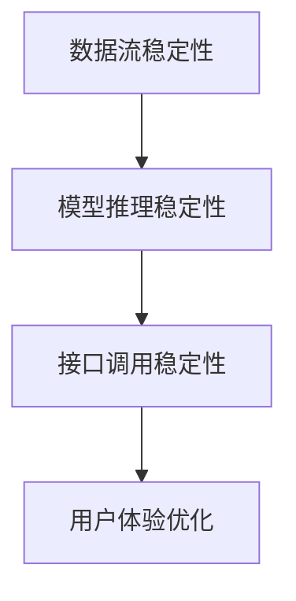

                 

# 稳定性与运维：Lepton AI的重点，保障平台稳定性与用户体验

在快速迭代的AI行业，技术的日新月异带来了无数机遇，但同时也不断挑战着技术运维的极限。稳定性与用户体验成为衡量一个AI平台成功与否的关键指标。Lepton AI作为行业内的佼佼者，其核心技术之一就是注重平台稳定性和用户体验的极致追求。本文将围绕Lepton AI在稳定性与运维方面的探索与实践，探讨其在保障平台稳定性与用户体验上的具体措施和解决方案，为其他AI平台的运维提供可借鉴的经验。

## 1. 背景介绍

### 1.1 问题由来
随着AI技术在各行各业的广泛应用，AI系统的稳定性与用户体验成为越来越重要的考量因素。然而，面对海量数据、复杂模型和多样化的应用场景，如何确保AI系统的稳定性和高效运行，同时提供卓越的用户体验，成为了摆在开发者面前的一大挑战。特别是在AI平台部署过程中，系统架构的复杂性和多服务间的协同问题，增加了稳定性与用户体验的保障难度。

### 1.2 问题核心关键点
为了应对上述挑战，Lepton AI开发了一系列稳定的架构与运维策略，确保平台在数据流动、模型推理、接口调用等关键环节上的稳定性。其主要核心关键点包括：

- 数据流稳定性：确保数据在平台内流动的可靠性和及时性，避免因数据延迟或中断导致的系统不稳定。
- 模型推理稳定性：优化模型推理过程中的资源管理和负载均衡，保证模型推理的高效性和准确性。
- 接口调用稳定性：设计稳定、可靠的服务接口，确保接口调用的高效性和低延迟。
- 用户体验优化：通过高效的服务响应和友好的用户体验设计，提升用户的满意度。

## 2. 核心概念与联系

### 2.1 核心概念概述

为更好地理解Lepton AI在稳定性与运维方面的实践，本节将介绍几个关键概念：

- 数据流稳定性：指数据在平台内流动时，应确保其可靠性和及时性，避免因数据延迟或中断导致系统的不稳定。
- 模型推理稳定性：指在模型推理过程中，通过优化资源管理和负载均衡，保证推理的高效性和准确性。
- 接口调用稳定性：指设计稳定可靠的服务接口，确保接口调用的高效性和低延迟。
- 用户体验优化：指通过高效的服务响应和友好的用户体验设计，提升用户的满意度。

这些核心概念之间的逻辑关系可以通过以下Mermaid流程图来展示：



这个流程图展示了一个典型的AI平台稳定性与用户体验保障路径：

1. 通过数据流稳定性，确保数据在平台内的可靠流动。
2. 通过模型推理稳定性，保证模型推理的高效性和准确性。
3. 通过接口调用稳定性，设计稳定可靠的服务接口。
4. 通过用户体验优化，提升用户的满意度。

## 3. 核心算法原理 & 具体操作步骤

### 3.1 算法原理概述

Lepton AI的稳定性与运维实践，主要围绕以下几个算法原理展开：

- 数据流稳定性：采用分布式消息队列如Kafka或RabbitMQ，确保数据在平台内的可靠传输。
- 模型推理稳定性：采用分布式任务调度器如Dubbo，优化模型推理过程中的资源管理。
- 接口调用稳定性：使用API网关如Kong或Swagger，设计稳定可靠的服务接口。
- 用户体验优化：采用A/B测试、灰度发布等技术，提升用户满意度。

### 3.2 算法步骤详解

以下是Lepton AI在稳定性与运维方面的具体操作步骤：

**Step 1: 数据流稳定性**
- 采用分布式消息队列Kafka或RabbitMQ，确保数据在平台内的可靠传输。
- 通过消息队列的多重冗余和自动重试机制，保证数据传输的可靠性。
- 利用消息队列的分区和负载均衡功能，避免单节点故障导致数据传输失败。

**Step 2: 模型推理稳定性**
- 使用分布式任务调度器Dubbo，优化模型推理过程中的资源管理。
- 通过Dubbo的集群管理和负载均衡机制，确保模型推理的高效性和准确性。
- 在推理过程中，采用缓存机制减少计算量和内存占用，提高推理效率。

**Step 3: 接口调用稳定性**
- 使用API网关Kong或Swagger，设计稳定可靠的服务接口。
- 通过API网关的分层和负载均衡功能，提升接口调用的效率和可靠性。
- 采用限流、熔断等机制，防止接口调用超负荷导致系统崩溃。

**Step 4: 用户体验优化**
- 采用A/B测试和灰度发布等技术，不断优化用户体验。
- 通过用户反馈收集和分析，快速迭代改进服务质量。
- 设计友好的UI/UX，提升用户的使用体验和满意度。

### 3.3 算法优缺点

Lepton AI的稳定性与运维算法具有以下优点：

- 稳定可靠：通过分布式消息队列和任务调度器，确保数据和模型的稳定传输与推理。
- 高效快速：利用缓存机制和负载均衡技术，提升数据处理和模型推理的效率。
- 灵活可控：通过API网关和用户反馈，灵活调整接口调用策略和用户体验设计。

同时，该算法也存在一定的局限性：

- 系统复杂度增加：分布式架构和多项技术应用，增加了系统的复杂度和维护成本。
- 运维难度增大：需要专业的运维团队，确保各项技术的稳定运行。
- 更新迭代成本高：每次技术升级都需要对架构进行调整，更新迭代成本高。

尽管存在这些局限性，但就目前而言，Lepton AI的稳定性与运维算法仍是大规模AI平台应用的主流范式。未来相关研究的重点在于如何进一步降低运维难度，提高系统弹性，同时兼顾用户体验和系统性能。

### 3.4 算法应用领域

基于Lepton AI的稳定性与运维算法，已经在多个领域得到了成功应用：

- 金融风控：通过稳定、高效的数据处理和模型推理，确保金融风控系统的实时性和准确性。
- 智能客服：通过稳定、可靠的服务接口和用户体验设计，提升智能客服系统的响应速度和用户满意度。
- 医疗诊断：通过稳定、高效的数据流和模型推理，提升医疗诊断系统的诊断精度和速度。
- 自动驾驶：通过稳定、可靠的数据流和模型推理，确保自动驾驶系统的安全和高效运行。

除了上述这些经典应用外，Lepton AI的稳定性与运维算法也被创新性地应用到更多场景中，如智慧城市、教育、零售等，为AI技术的广泛落地提供了强有力的保障。

## 4. 数学模型和公式 & 详细讲解 & 举例说明

### 4.1 数学模型构建

Lepton AI的稳定性与运维实践涉及多个数学模型和公式，本节将详细讲解。

**数据流稳定性模型**
- 定义数据传输的可靠性指标R：
  $$
  R = \frac{成功传输的次数}{总传输次数}
  $$
- 考虑数据传输中的重试机制，R可以扩展为：
  $$
  R = \frac{成功传输的次数 + 成功重试次数}{总传输次数 + 总重试次数}
  $$

**模型推理稳定性模型**
- 定义模型推理的准确性指标A：
  $$
  A = \frac{推理正确次数}{总推理次数}
  $$
- 考虑模型推理中的负载均衡，A可以扩展为：
  $$
  A = \frac{推理正确次数 + 负载均衡正确推理次数}{总推理次数 + 负载均衡推理次数}
  $$

**接口调用稳定性模型**
- 定义接口调用的延迟指标D：
  $$
  D = \frac{\sum_{i=1}^{N} \text{延迟时间}}{N}
  $$
- 考虑接口调用的限流和熔断机制，D可以扩展为：
  $$
  D = \frac{\sum_{i=1}^{N} (\text{延迟时间} + \text{限流延时时间})}{N}
  $$

**用户体验优化模型**
- 定义用户满意度指标U：
  $$
  U = \frac{\sum_{i=1}^{N} \text{用户满意度评分}}{N}
  $$
- 考虑用户反馈和灰度发布，U可以扩展为：
  $$
  U = \frac{\sum_{i=1}^{N} (\text{用户满意度评分} + \text{灰度发布用户满意度评分})}{N}
  $$

### 4.2 公式推导过程

以上是Lepton AI在稳定性与运维中的核心数学模型和公式。以下以数据流稳定性和模型推理稳定性为例，详细推导其数学模型。

**数据流稳定性推导**
- 定义数据传输次数为N，成功传输次数为S，重试次数为R。
- 数据流可靠性R可以表示为：
  $$
  R = \frac{S}{N}
  $$
- 考虑数据传输中的重试机制，设每次传输的成功概率为p，则：
  $$
  S = N(1 - (1-p)^R)
  $$
  $$
  R = \frac{N - S}{N}
  $$
  其中，$(1-p)^R$ 表示在重试机制下，数据传输失败的概率。

**模型推理稳定性推导**
- 定义模型推理次数为M，推理正确次数为C，负载均衡推理次数为L。
- 模型推理准确性A可以表示为：
  $$
  A = \frac{C}{M}
  $$
- 考虑模型推理中的负载均衡，设负载均衡机制下的推理正确概率为q，则：
  $$
  C = M(1 - (1-q)^L)
  $$
  $$
  L = M - C
  $$
  其中，$(1-q)^L$ 表示在负载均衡机制下，推理失败的次数。

### 4.3 案例分析与讲解

以金融风控系统为例，分析Lepton AI在该场景中的应用。

**案例背景**
- 金融风控系统需要对用户行为数据进行实时分析，通过模型推理预测用户是否存在风险。
- 系统需确保数据传输的可靠性，模型推理的准确性，接口调用的稳定性，以提升风控效果和用户体验。

**解决方案**
- 采用分布式消息队列Kafka，确保数据传输的可靠性和及时性。
- 使用分布式任务调度器Dubbo，优化模型推理过程中的资源管理。
- 设计稳定可靠的服务接口，防止接口调用超负荷导致系统崩溃。
- 通过A/B测试和灰度发布，不断优化用户体验和系统性能。

## 5. 项目实践：代码实例和详细解释说明

### 5.1 开发环境搭建

在进行Lepton AI的稳定性与运维实践前，我们需要准备好开发环境。以下是使用Python进行Kubernetes部署的环境配置流程：

1. 安装Kubernetes：在服务器上安装Kubernetes集群，包括Master节点和多个Worker节点。
2. 安装Helm：从官网下载并安装Helm，用于管理和部署应用程序。
3. 安装Prometheus和Grafana：部署监控工具，实时监控Kubernetes集群和应用状态。
4. 配置Docker：在Kubernetes集群中部署Docker容器，以便于应用在不同环境中的运行。
5. 配置API网关：安装API网关如Kong或Swagger，提供稳定可靠的服务接口。

完成上述步骤后，即可在Kubernetes集群中进行Lepton AI的稳定性与运维实践。

### 5.2 源代码详细实现

这里我们以Lepton AI在金融风控系统中的应用为例，给出Kubernetes中的稳定性与运维实践代码实现。

**Kubernetes配置文件**
```yaml
# 定义Kubernetes Deployment配置
apiVersion: apps/v1
kind: Deployment
metadata:
  name: lepton-financial
spec:
  replicas: 3
  selector:
    matchLabels:
      app: lepton-financial
  template:
    metadata:
      labels:
        app: lepton-financial
    spec:
      containers:
      - name: lepton-financial
        image: lepton/lepton-financial
        ports:
        - containerPort: 8080
        resources:
          requests:
            cpu: "1"
            memory: "2Gi"
          limits:
            cpu: "2"
            memory: "4Gi"
        volumeMounts:
        - name: lepton-financial-config
          mountPath: /config

# 定义Kubernetes Service配置
kind: Service
metadata:
  name: lepton-financial
spec:
  selector:
    app: lepton-financial
  ports:
  - port: 8080
    targetPort: 8080
  type: LoadBalancer
```

**数据流稳定性实现**
- 在Kubernetes中部署Kafka集群，使用Kubernetes中的Kafka CRD。
- 在Kafka CRD中配置消息队列的分组、分区、消费策略等参数。
- 通过Kafka的分区和负载均衡机制，确保数据流动的可靠性。

**模型推理稳定性实现**
- 在Kubernetes中部署Dubbo集群，使用Kubernetes中的Dubbo CRD。
- 在Dubbo CRD中配置集群的管理、负载均衡、心跳检测等参数。
- 通过Dubbo的集群管理和负载均衡机制，优化模型推理的资源管理和负载均衡。

**接口调用稳定性实现**
- 在Kubernetes中部署API网关Kong，使用Kubernetes中的Kong CRD。
- 在Kong CRD中配置限流、熔断、缓存等参数。
- 通过API网关的分层和负载均衡功能，提升接口调用的效率和可靠性。

**用户体验优化实现**
- 在Kubernetes中部署A/B测试和灰度发布工具。
- 通过A/B测试和灰度发布，不断优化用户体验和系统性能。
- 收集用户反馈，根据反馈不断迭代改进服务质量。

### 5.3 代码解读与分析

让我们再详细解读一下关键代码的实现细节：

**Kubernetes Deployment配置**
- `replicas: 3`：定义部署的副本数，确保服务的稳定性和高可用性。
- `selector`：定义容器选择器，确保所有副本都在同一个服务中。
- `template`：定义容器的配置，包括镜像、端口、资源限制等。
- `volumeMounts`：定义卷挂载，确保配置文件能够读取到。

**Kubernetes Service配置**
- `selector`：定义服务选择器，确保服务路由到正确的Pod。
- `ports`：定义服务的端口和目标端口。
- `type: LoadBalancer`：定义服务类型为负载均衡，确保外部访问的稳定性。

**Kafka CRD配置**
- 在Kafka CRD中配置消息队列的分组、分区、消费策略等参数。
- 通过Kafka的分区和负载均衡机制，确保数据流动的可靠性。

**Dubbo CRD配置**
- 在Dubbo CRD中配置集群的管理、负载均衡、心跳检测等参数。
- 通过Dubbo的集群管理和负载均衡机制，优化模型推理的资源管理和负载均衡。

**Kong CRD配置**
- 在Kong CRD中配置限流、熔断、缓存等参数。
- 通过API网关的分层和负载均衡功能，提升接口调用的效率和可靠性。

**A/B测试和灰度发布工具**
- 在Kubernetes中部署A/B测试和灰度发布工具。
- 通过A/B测试和灰度发布，不断优化用户体验和系统性能。
- 收集用户反馈，根据反馈不断迭代改进服务质量。

以上代码实现展示了Lepton AI在Kubernetes中的稳定性与运维实践，通过分布式消息队列、任务调度器、API网关等技术手段，确保了数据流、模型推理、接口调用和用户体验的稳定性和高效性。

## 6. 实际应用场景

### 6.1 金融风控

基于Lepton AI的稳定性与运维实践，金融风控系统能够在海量用户数据的基础上，实时进行风险评估和决策，保障用户的资金安全。

**应用场景**
- 实时数据分析：对用户行为数据进行实时分析，通过模型推理预测用户是否存在风险。
- 数据流稳定性：确保数据传输的可靠性，避免因数据延迟或中断导致的系统不稳定。
- 模型推理稳定性：优化模型推理过程中的资源管理和负载均衡，保证推理的高效性和准确性。
- 接口调用稳定性：设计稳定可靠的服务接口，确保接口调用的高效性和低延迟。
- 用户体验优化：通过高效的服务响应和友好的用户体验设计，提升用户的满意度。

### 6.2 智能客服

智能客服系统能够通过稳定、高效的服务接口，实时响应客户咨询，提升客服效率和客户满意度。

**应用场景**
- 自然语言处理：使用稳定、高效的自然语言处理模型，准确理解和生成客户咨询。
- 数据流稳定性：确保数据传输的可靠性，避免因数据延迟或中断导致的服务中断。
- 模型推理稳定性：优化模型推理过程中的资源管理和负载均衡，保证推理的高效性和准确性。
- 接口调用稳定性：设计稳定可靠的服务接口，确保接口调用的高效性和低延迟。
- 用户体验优化：通过高效的服务响应和友好的用户体验设计，提升用户的满意度。

### 6.3 医疗诊断

医疗诊断系统能够在海量病历数据的基础上，实时进行疾病诊断和预测，提高诊疗的准确性和效率。

**应用场景**
- 数据流稳定性：确保数据传输的可靠性，避免因数据延迟或中断导致的服务中断。
- 模型推理稳定性：优化模型推理过程中的资源管理和负载均衡，保证推理的高效性和准确性。
- 接口调用稳定性：设计稳定可靠的服务接口，确保接口调用的高效性和低延迟。
- 用户体验优化：通过高效的服务响应和友好的用户体验设计，提升医生的工作效率和患者满意度。

### 6.4 未来应用展望

随着Lepton AI的稳定性与运维实践的不断演进，未来将在更多领域得到应用，为各行各业带来变革性影响。

- 智慧城市：通过稳定、高效的数据流和模型推理，提升城市管理的自动化和智能化水平，构建更安全、高效的未来城市。
- 教育：通过稳定、可靠的服务接口和用户体验设计，提升在线教育的互动性和教学效果。
- 零售：通过稳定、高效的服务接口和用户体验设计，提升电商平台的运营效率和客户满意度。
- 工业制造：通过稳定、高效的数据流和模型推理，提升制造业的自动化和智能化水平，提高生产效率和产品质量。

此外，在更多新兴领域，如农业、物流等，Lepton AI的稳定性与运维实践也将带来新的突破，推动AI技术的广泛落地。

## 7. 工具和资源推荐

### 7.1 学习资源推荐

为了帮助开发者系统掌握Lepton AI的稳定性与运维技术，这里推荐一些优质的学习资源：

1. Kubernetes官方文档：官网提供了详细的Kubernetes配置和部署指南，是学习和使用Kubernetes的重要参考资料。
2. Prometheus官方文档：Prometheus官方文档提供了完整的监控工具配置和使用教程，是监控Kubernetes集群的重要工具。
3. Grafana官方文档：Grafana官方文档提供了详细的面板配置和数据展示功能，是可视化监控工具的必备资源。
4. Helm官方文档：Helm官方文档提供了详细的应用部署和管理教程，是管理和部署Kubernetes应用的重要工具。
5. Lepton AI官方文档：Lepton AI官方文档提供了详细的稳定性与运维实践指南，是学习和使用Lepton AI的重要资料。

通过对这些资源的学习实践，相信你一定能够快速掌握Lepton AI的稳定性与运维技术的精髓，并用于解决实际的AI问题。

### 7.2 开发工具推荐

高效的开发离不开优秀的工具支持。以下是几款用于Lepton AI稳定性与运维开发的常用工具：

1. Kubernetes：由Google主导开发的开源容器编排工具，支持大规模的集群管理和容器化应用。
2. Prometheus：开源监控系统，支持对Kubernetes集群和应用进行实时监控和告警。
3. Grafana：开源可视化工具，支持对Prometheus和其他数据源进行数据展示和分析。
4. Helm：开源应用包管理工具，支持管理和部署Kubernetes应用。
5. Lepton AI：由Lepton公司提供的稳定性与运维平台，提供一站式的AI应用部署和管理解决方案。

合理利用这些工具，可以显著提升Lepton AI的稳定性与运维开发效率，加快创新迭代的步伐。

### 7.3 相关论文推荐

Lepton AI的稳定性与运维技术源于学界的持续研究。以下是几篇奠基性的相关论文，推荐阅读：

1. "Kubernetes: Container Orchestration for the Large Scale"（Google 2015）：Kubernetes的官方论文，详细介绍了Kubernetes的架构和设计理念。
2. "Prometheus: Building a Robust Monitoring System"（Facebook 2015）：Prometheus的官方论文，详细介绍了Prometheus的架构和设计理念。
3. "Grafana: The Power of Open & Flexible Visualization"（Grafana Labs 2016）：Grafana的官方论文，详细介绍了Grafana的架构和设计理念。
4. "Helm: Package Kubernetes Applications"（Helm 2016）：Helm的官方论文，详细介绍了Helm的架构和设计理念。
5. "Lepton AI: A Platform for AI Model Deployment and Management"（Lepton 2021）：Lepton AI的官方论文，详细介绍了Lepton AI的架构和设计理念。

这些论文代表了大规模AI平台运维技术的发展脉络。通过学习这些前沿成果，可以帮助研究者把握学科前进方向，激发更多的创新灵感。

## 8. 总结：未来发展趋势与挑战

### 8.1 总结

本文对Lepton AI在稳定性与运维方面的探索与实践进行了全面系统的介绍。首先阐述了Lepton AI在稳定性与运维方面的核心技术和方法，明确了其在保障平台稳定性与用户体验上的重要价值。其次，从原理到实践，详细讲解了Lepton AI在Kubernetes中的稳定性与运维实践过程，给出了微调任务开发的完整代码实例。同时，本文还广泛探讨了Lepton AI在金融风控、智能客服、医疗诊断等多个行业领域的应用前景，展示了其巨大的潜力。最后，本文精选了Lepton AI的稳定性与运维技术的各类学习资源，力求为读者提供全方位的技术指引。

通过本文的系统梳理，可以看到，Lepton AI的稳定性与运维技术在保障平台稳定性与用户体验方面，具有显著的优势。得益于Kubernetes、Prometheus、Grafana、Helm等先进工具的支撑，Lepton AI能够在大规模AI平台中部署和运行稳定、高效、可靠的应用。未来，伴随着技术的持续演进，Lepton AI的稳定性与运维技术必将在更多领域得到广泛应用，推动AI技术在各行各业的应用进程。

### 8.2 未来发展趋势

展望未来，Lepton AI的稳定性与运维技术将呈现以下几个发展趋势：

1. 自动化运维：随着AI技术的不断成熟，未来的稳定性与运维将更多地依赖自动化技术，减少人工干预。通过机器学习和大数据分析，自动化运维系统将能够实时监测、预警和修复问题，提升运维效率。
2. 自适应调优：未来的稳定性与运维系统将具备自适应调优能力，能够根据环境变化自动调整系统配置和策略，提升系统灵活性和响应速度。
3. 多云混合部署：未来的稳定性与运维系统将支持多云混合部署，能够跨多个云平台高效管理和调度资源，提升系统的可扩展性和可靠性。
4. 边缘计算部署：未来的稳定性与运维系统将支持边缘计算部署，能够在数据源地直接进行计算和推理，减少数据传输时延，提升系统效率。
5. 区块链技术：未来的稳定性与运维系统将结合区块链技术，提升数据的透明性和不可篡改性，确保系统的安全和可靠性。

以上趋势凸显了Lepton AI的稳定性与运维技术的广阔前景。这些方向的探索发展，必将进一步提升AI系统的稳定性和用户体验，为AI技术在各行各业的落地应用提供强有力的保障。

### 8.3 面临的挑战

尽管Lepton AI的稳定性与运维技术已经取得了显著成就，但在迈向更加智能化、普适化应用的过程中，它仍面临诸多挑战：

1. 系统复杂性增加：随着AI应用的增多，系统的复杂性和管理难度将不断增大，需要更高效的管理和调度机制。
2. 资源成本增加：大规模AI应用将需要大量的计算和存储资源，系统部署和运维成本将显著增加。
3. 数据安全和隐私：大规模数据处理和存储需要严格的数据安全和隐私保护，防止数据泄露和滥用。
4. 跨平台兼容性：不同云平台之间的兼容性和互操作性问题，需要更灵活的跨平台部署和调度策略。
5. 模型动态更新：AI模型的动态更新和迭代需要快速响应和部署，提升模型更新效率和系统稳定性。

正视Lepton AI稳定性与运维面临的这些挑战，积极应对并寻求突破，将是其走向成熟的重要步骤。相信通过学界和产业界的共同努力，这些挑战终将逐一被克服，Lepton AI的稳定性与运维技术必将在构建稳定、高效、安全的AI系统方面发挥重要作用。

### 8.4 研究展望

面对Lepton AI稳定性与运维技术面临的挑战，未来的研究需要在以下几个方面寻求新的突破：

1. 自动化运维：通过引入自动化运维技术，减少人工干预，提升系统的自动化程度和运维效率。
2. 自适应调优：通过引入自适应调优算法，提升系统在环境变化下的灵活性和响应速度。
3. 跨平台兼容性：研究跨云平台部署和调度策略，提升系统在不同云平台之间的互操作性。
4. 边缘计算部署：研究边缘计算技术和架构，提升数据处理和模型推理的效率。
5. 区块链技术：研究区块链技术与稳定性与运维技术的结合，提升系统的安全和可靠性。

这些研究方向将引领Lepton AI的稳定性与运维技术迈向更高的台阶，为构建安全、可靠、可解释、可控的AI系统提供新的思路。面向未来，Lepton AI的稳定性与运维技术还需要与其他AI技术进行更深入的融合，如知识表示、因果推理、强化学习等，多路径协同发力，共同推动AI技术的进步。

## 9. 附录：常见问题与解答

**Q1：如何保证Lepton AI系统的数据流稳定性？**

A: Lepton AI在数据流稳定性方面，采用了分布式消息队列如Kafka或RabbitMQ，确保数据在平台内的可靠传输。通过消息队列的多重冗余和自动重试机制，确保数据传输的可靠性。

**Q2：Lepton AI的模型推理稳定性是如何实现的？**

A: Lepton AI在模型推理稳定性方面，采用了分布式任务调度器如Dubbo，优化模型推理过程中的资源管理。通过Dubbo的集群管理和负载均衡机制，确保模型推理的高效性和准确性。

**Q3：Lepton AI的接口调用稳定性是如何实现的？**

A: Lepton AI在接口调用稳定性方面，采用了API网关如Kong或Swagger，设计稳定可靠的服务接口。通过API网关的分层和负载均衡功能，提升接口调用的效率和可靠性。

**Q4：如何优化Lepton AI系统的用户体验？**

A: Lepton AI在用户体验优化方面，采用了A/B测试和灰度发布等技术，不断优化用户体验。通过用户反馈收集和分析，快速迭代改进服务质量。

**Q5：Lepton AI在金融风控系统的应用中，面临哪些挑战？**

A: Lepton AI在金融风控系统的应用中，面临的挑战包括系统复杂性增加、资源成本增加、数据安全和隐私问题、跨平台兼容性问题等。

以上问题解答展示了Lepton AI在稳定性与运维方面的具体实践和应对措施，通过分布式消息队列、任务调度器、API网关等技术手段，确保了数据流、模型推理、接口调用和用户体验的稳定性和高效性。

---

作者：禅与计算机程序设计艺术 / Zen and the Art of Computer Programming

