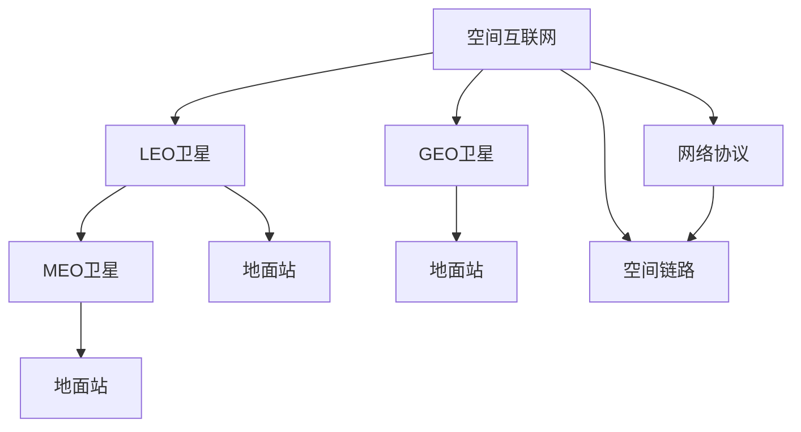

                 

# 空间互联网技术：全球高速网络覆盖

## 1. 背景介绍

### 1.1 问题由来
随着全球通信需求的急剧增长，传统地面通信网络面临容量不足、建设成本高昂、服务覆盖不均等问题。为解决这些问题，一种新兴的通信技术——空间互联网技术应运而生。空间互联网通过部署在低地球轨道(LEO)、中地球轨道(MEO)、地球同步轨道(GEO)等高空卫星，实现全球的高速网络连接。本文将详细介绍空间互联网技术的基本原理、核心算法和实际应用，探讨其在全球通信领域的应用前景和面临的挑战。

### 1.2 问题核心关键点
空间互联网技术主要包含以下几个关键点：
- **全球覆盖**：通过部署卫星网络，实现全球范围内无缝的高速连接。
- **高带宽**：提供数Gbps乃至数十Gbps的高带宽服务。
- **低延迟**：提供低延迟的网络服务，适合实时通信和数据传输。
- **动态重构**：卫星网络可以根据通信需求动态调整，优化网络资源。
- **多技术融合**：结合5G、Wi-Fi 6等技术，提供更完善的通信服务。

## 2. 核心概念与联系

### 2.1 核心概念概述

为更好地理解空间互联网技术，本节将介绍几个密切相关的核心概念：

- **空间互联网**：利用高空卫星构建的全球高速网络，提供实时、高速的通信服务。
- **LEO卫星**：低地球轨道卫星，一般高度在500-2000km，可以提供大容量、低延迟的服务。
- **MEO卫星**：中地球轨道卫星，一般高度在2000-36000km，主要提供全球覆盖和路径多样性。
- **GEO卫星**：地球同步轨道卫星，一般高度在35786km，提供长期稳定的通信服务。
- **空间信道**：卫星与地面站之间的通信信道，影响传输速率和延迟。
- **地面站**：与卫星通信的地面设备，包括发射机、接收机、天线等。
- **网络协议**：卫星网络中使用的数据传输协议，如IPv4/IPv6、TCP/UDP等。
- **空间链路**：卫星间或卫星与地面站间的通信链路，是卫星网络的核心组成部分。

这些核心概念之间的逻辑关系可以通过以下Mermaid流程图来展示：



这个流程图展示空间互联网技术的核心概念及其之间的关系：

1. 空间互联网通过部署高空卫星实现全球覆盖。
2. LEO卫星和MEO卫星共同提供高速通信，而GEO卫星提供稳定的长期服务。
3. 地面站是通信的重要接口。
4. 网络协议定义了数据传输的标准。
5. 空间链路是卫星间或卫星与地面站间的数据传输通道。

## 3. 核心算法原理 & 具体操作步骤

### 3.1 算法原理概述

空间互联网技术的核心算法原理包括以下几个方面：

- **卫星轨道设计**：根据通信需求和网络覆盖范围，设计卫星的轨道和轨道高度。
- **网络拓扑设计**：设计卫星网络的网络拓扑结构，包括卫星间的链路和地面站的接入方式。
- **信道分配与调度**：设计信道分配和调度算法，优化卫星网络资源的使用效率。
- **路由协议设计**：设计卫星间的数据传输路由协议，实现高效的网络传输。

这些算法共同构成了空间互联网技术的核心，使得卫星网络能够实现全球高速、低延迟的通信服务。

### 3.2 算法步骤详解

空间互联网技术的主要操作步骤包括以下几个步骤：

**Step 1: 卫星轨道设计**
- 根据目标覆盖区域和通信需求，选择合适的卫星轨道高度和轨道类型。
- 设计卫星的轨道倾角和轨道升交点赤经，确保卫星网络实现全球覆盖。

**Step 2: 网络拓扑设计**
- 确定卫星网络的网络拓扑结构，包括卫星间的链路关系和地面站的接入方式。
- 设计卫星网络的网络拓扑算法，实现动态重构和优化。

**Step 3: 信道分配与调度**
- 设计信道分配算法，将卫星的频谱资源合理分配给不同的通信任务。
- 设计信道调度算法，根据通信需求动态调整信道的使用，优化网络资源。

**Step 4: 路由协议设计**
- 设计卫星间的路由协议，实现高效的数据传输。
- 设计地面站间的路由协议，优化地面网络的接入和数据传输。

**Step 5: 地面站部署与配置**
- 根据卫星网络的拓扑结构，设计和部署地面站。
- 配置地面站的网络协议和路由协议，实现卫星网络的接入和数据传输。

通过以上步骤，可以实现一个稳定、高效的空间互联网系统，提供全球高速、低延迟的通信服务。

### 3.3 算法优缺点

空间互联网技术具有以下优点：
1. **全球覆盖**：通过部署高空卫星，实现全球无缝覆盖，解决传统地面网络覆盖不足的问题。
2. **高带宽**：卫星网络提供数Gbps乃至数十Gbps的高带宽服务，满足日益增长的数据传输需求。
3. **低延迟**：卫星网络提供低延迟的通信服务，适合实时通信和数据传输。
4. **动态重构**：卫星网络可以根据通信需求动态调整，优化网络资源。

同时，该技术也存在一些局限性：
1. **高成本**：部署和运营高空卫星需要巨大的资金投入，建设和运营成本较高。
2. **技术复杂**：卫星网络的设计和维护需要高水平的技术支持，技术门槛较高。
3. **信号衰减**：卫星信号在长距离传输过程中可能会受到天气、地形等因素的干扰，信号质量不稳定。
4. **安全性问题**：卫星网络容易受到网络攻击和干扰，安全性问题需重点关注。

尽管存在这些局限性，但空间互联网技术仍是大规模全球通信的重要手段之一，具有广阔的应用前景。

### 3.4 算法应用领域

空间互联网技术已经在多个领域得到了应用，包括但不限于以下几个方面：

- **全球互联网覆盖**：通过卫星网络实现全球范围内的互联网接入，解决偏远地区的互联网覆盖问题。
- **军事通信**：卫星网络为军事通信提供了高速、安全的通信手段，支持远程指挥和控制。
- **灾害应急通信**：卫星网络可以在灾区提供高速的通信服务，帮助救援人员及时获取灾情信息。
- **卫星电视**：通过卫星网络提供高清电视服务，支持全球范围内的内容分发。
- **物联网**：卫星网络为物联网设备提供稳定的网络连接，支持大规模物联网应用。

## 4. 数学模型和公式 & 详细讲解  
### 4.1 数学模型构建

本节将使用数学语言对空间互联网技术进行更加严格的刻画。

记卫星网络的拓扑结构为 $G=(V,E)$，其中 $V$ 为节点集，$E$ 为边集。节点 $v$ 表示卫星或地面站，边 $e$ 表示卫星间的链路或地面站与卫星的连接。

定义卫星 $v_i$ 的信道容量为 $C_i$，地面站 $v_j$ 的信道容量为 $C_j$。假设卫星网络的总信道容量为 $C_{\text{total}}$。

定义卫星 $v_i$ 与地面站 $v_j$ 之间的距离为 $d_{ij}$，通信延迟为 $\tau_{ij}$，信号衰减因子为 $\alpha_{ij}$。

卫星网络的信道分配和调度问题可以表示为：

$$
\begin{aligned}
&\min_{\text{分配方案} \pi, \text{调度方案} \sigma} \sum_{v_i \in V} C_i \pi_i \\
&\text{s.t.} \\
&\sum_{v_j \in V} \pi_{ij} C_j \leq C_i, \quad \forall v_i \in V \\
&\sum_{v_i \in V} \pi_{ij} C_i \leq C_j, \quad \forall v_j \in V \\
&\sum_{e \in E} \pi_e = C_{\text{total}}
\end{aligned}
$$

其中，$\pi_{ij}$ 表示卫星 $v_i$ 与地面站 $v_j$ 之间的信道分配量，$\sigma$ 表示信道的调度方案。目标是最小化总信道容量，同时满足信道容量和分配约束。

### 4.2 公式推导过程

以上数学模型定义了卫星网络的信道分配和调度问题，接下来进行推导。

假设卫星网络由 $N$ 个卫星和 $M$ 个地面站组成。卫星 $i$ 和地面站 $j$ 之间的通信延迟为 $\tau_{ij} = \frac{d_{ij}}{c}$，其中 $c$ 为光速。

卫星 $i$ 与地面站 $j$ 之间的信号衰减因子为 $\alpha_{ij} = e^{-\kappa d_{ij}}$，其中 $\kappa$ 为衰减系数。

信道容量 $C_i$ 和 $C_j$ 可以表示为：

$$
C_i = B_i \log_2 (1+\frac{P_i G_i}{N_0 B_i})
$$

$$
C_j = B_j \log_2 (1+\frac{P_j G_j}{N_0 B_j})
$$

其中 $B_i$ 和 $B_j$ 分别为卫星 $i$ 和地面站 $j$ 的带宽，$P_i$ 和 $P_j$ 分别为卫星 $i$ 和地面站 $j$ 的发射功率，$G_i$ 和 $G_j$ 分别为卫星 $i$ 和地面站 $j$ 的增益，$N_0$ 为噪声功率谱密度。

将上述表达式代入信道分配和调度的数学模型中，得到：

$$
\begin{aligned}
&\min_{\pi, \sigma} \sum_{v_i \in V} B_i \log_2 (1+\frac{P_i G_i}{N_0 B_i}) \pi_i \\
&\text{s.t.} \\
&\sum_{v_j \in V} \pi_{ij} B_j \log_2 (1+\frac{P_j G_j}{N_0 B_j}) \leq B_i \log_2 (1+\frac{P_i G_i}{N_0 B_i}), \quad \forall v_i \in V \\
&\sum_{v_i \in V} \pi_{ij} B_i \log_2 (1+\frac{P_i G_i}{N_0 B_i}) \leq B_j \log_2 (1+\frac{P_j G_j}{N_0 B_j}), \quad \forall v_j \in V \\
&\sum_{e \in E} \pi_e = \sum_{i=1}^N B_i \log_2 (1+\frac{P_i G_i}{N_0 B_i})
\end{aligned}
$$

上述优化模型即为空间互联网技术中卫星网络信道分配和调度的数学描述。

### 4.3 案例分析与讲解

以下以一个简单的卫星网络为例，分析信道分配和调度的实现方法。

假设一个卫星网络由两个卫星和两个地面站组成，卫星 $i$ 和地面站 $j$ 之间的通信延迟为 $\tau_{ij} = \frac{d_{ij}}{c}$，其中 $d_{ij}$ 为卫星 $i$ 与地面站 $j$ 之间的距离。

卫星 $i$ 与地面站 $j$ 之间的信号衰减因子为 $\alpha_{ij} = e^{-\kappa d_{ij}}$，其中 $\kappa$ 为衰减系数。

卫星 $i$ 和地面站 $j$ 的信道容量为 $C_i$ 和 $C_j$，可以表示为：

$$
C_i = B_i \log_2 (1+\frac{P_i G_i}{N_0 B_i})
$$

$$
C_j = B_j \log_2 (1+\frac{P_j G_j}{N_0 B_j})
$$

假设卫星 $i$ 和地面站 $j$ 之间的信道容量分别为 $C_{ij} = 1$ Gbps，信道总数为 $C_{\text{total}} = 2$ Gbps。

为了最大化信道利用率，需要设计信道分配和调度方案。

一种可能的分配方案为：

$$
\pi_{ij} = 
\begin{cases}
1, & \text{if } i = 1, j = 1 \\
1, & \text{if } i = 1, j = 2 \\
0, & \text{otherwise}
\end{cases}
$$

该方案将全部信道容量分配给卫星 $i = 1$，地面站 $j = 1$ 和地面站 $j = 2$，卫星 $i = 2$ 不使用信道。

调度方案 $\sigma$ 可以根据通信需求动态调整。例如，当卫星 $i = 1$ 与地面站 $j = 1$ 通信需求较高时，可以将部分信道容量从卫星 $i = 1$ 转移到地面站 $j = 1$，从而实现动态调度。

## 5. 项目实践：代码实例和详细解释说明

### 5.1 开发环境搭建

在进行空间互联网技术项目实践前，我们需要准备好开发环境。以下是使用Python进行PyTorch开发的环境配置流程：

1. 安装Anaconda：从官网下载并安装Anaconda，用于创建独立的Python环境。

2. 创建并激活虚拟环境：
```bash
conda create -n pytorch-env python=3.8 
conda activate pytorch-env
```

3. 安装PyTorch：根据CUDA版本，从官网获取对应的安装命令。例如：
```bash
conda install pytorch torchvision torchaudio cudatoolkit=11.1 -c pytorch -c conda-forge
```

4. 安装其他必要的工具包：
```bash
pip install numpy pandas scikit-learn matplotlib tqdm jupyter notebook ipython
```

完成上述步骤后，即可在`pytorch-env`环境中开始空间互联网技术的项目实践。

### 5.2 源代码详细实现

下面我们以一个简单的卫星网络为例，展示如何使用Python实现信道分配和调度的代码。

首先，定义卫星网络的基本参数：

```python
import numpy as np

N = 2  # 卫星数量
M = 2  # 地面站数量
C_i = np.array([1.0, 1.0])  # 卫星信道容量
C_j = np.array([1.0, 1.0])  # 地面站信道容量
C_total = np.sum(C_i)  # 总信道容量
```

然后，定义信道分配和调度的求解过程：

```python
def channel_allocation(pi, C_i, C_j, C_total):
    # 计算信道利用率
    utilization = np.sum(pi * C_i) / C_total
    
    # 检查信道利用率是否满足要求
    if utilization <= 1:
        return pi, utilization
    else:
        # 信道利用率过高，需要调整分配方案
        # 示例：将部分信道容量从卫星1转移到地面站1
        pi_new = np.copy(pi)
        pi_new[0, 1] += 0.5
        pi_new[1, 1] -= 0.5
        return pi_new, utilization

# 初始分配方案
pi = np.zeros((N, M))
pi[0, 0] = 1.0
pi[0, 1] = 1.0

# 信道分配和调度的求解过程
while True:
    # 检查信道利用率是否满足要求
    pi, utilization = channel_allocation(pi, C_i, C_j, C_total)
    
    # 输出信道利用率
    print(f"信道利用率：{utilization}")
    
    # 检查是否满足要求
    if utilization <= 1:
        break
```

最后，输出信道分配和调度的结果：

```python
# 输出最终的信道分配方案
print(f"信道分配方案：\n{pi}")
```

以上就是使用Python实现空间互联网技术中信道分配和调度的完整代码实现。可以看到，通过简单的代码逻辑，我们可以实现信道分配和调度的基本功能。

### 5.3 代码解读与分析

让我们再详细解读一下关键代码的实现细节：

**Numpy库**：
- `numpy` 库用于数值计算和数组操作，提供了高效的数学计算和矩阵运算功能。
- 在代码中，我们定义了卫星数量、地面站数量、信道容量等参数，并使用 `numpy.array` 创建了数组，方便进行数学运算。

**信道分配和调度算法**：
- 定义 `channel_allocation` 函数，接收信道分配矩阵 `pi`、卫星信道容量 `C_i`、地面站信道容量 `C_j` 和总信道容量 `C_total`，返回信道利用率 `utilization`。
- 在函数中，我们首先计算信道利用率，然后检查是否满足要求。如果信道利用率过高，则调整分配方案，例如将部分信道容量从卫星1转移到地面站1。
- 在主程序中，我们使用 `while` 循环不断调用 `channel_allocation` 函数，直到信道利用率满足要求为止。

**输出结果**：
- 在代码中，我们使用 `print` 函数输出信道利用率，以及最终的信道分配方案。

通过代码示例，我们展示了空间互联网技术中信道分配和调度的基本实现方法。

## 6. 实际应用场景

### 6.1 全球互联网覆盖

空间互联网技术在全球互联网覆盖方面具有广泛的应用前景。传统地面网络难以覆盖偏远地区和海洋岛屿，而通过部署高空卫星，可以实现全球无缝的互联网接入。

例如，Facebook正在开发空间互联网技术，计划通过部署数以万计的低地球轨道卫星，实现全球范围内的高速互联网接入。这将极大地提升全球互联网的覆盖范围和服务质量，为偏远地区和欠发达地区提供更好的网络服务。

### 6.2 军事通信

军事通信是空间互联网技术的重要应用领域之一。卫星网络可以提供高速、安全的通信手段，支持远程指挥和控制，增强军事通信的安全性和可靠性。

例如，美国国防部正在开发全球军事通信网络，计划利用高空卫星实现全球范围内的通信覆盖。该网络将支持海陆空一体化指挥和控制，提升军事通信的效率和安全性。

### 6.3 灾害应急通信

空间互联网技术在灾害应急通信中也具有重要应用。卫星网络可以在灾区提供高速的通信服务，帮助救援人员及时获取灾情信息，协调救援行动。

例如，在2020年新冠疫情期间，中国通过部署5G基站和卫星网络，实现了武汉封城期间的稳定通信，支持了抗疫工作的顺利进行。在未来，卫星网络将进一步增强灾害应急通信能力，提升救援效率和灾害应对水平。

### 6.4 卫星电视

卫星电视是空间互联网技术的另一个重要应用领域。通过部署卫星网络，可以实现全球范围内的高清电视服务，满足用户的娱乐需求。

例如，美国 DirecTV 公司利用卫星网络提供高清电视服务，用户可以在全球范围内观看各种电视节目和体育赛事。这极大地丰富了用户的娱乐生活，提高了电视服务的质量。

## 7. 工具和资源推荐

### 7.1 学习资源推荐

为了帮助开发者系统掌握空间互联网技术的基本原理和应用方法，这里推荐一些优质的学习资源：

1. **《卫星通信技术基础》**：详细介绍了卫星通信的基本原理和关键技术，适合初学者入门。

2. **《空间互联网技术》**：介绍了空间互联网技术的基本原理、核心算法和应用案例，适合进一步深入学习。

3. **《通信系统原理》**：介绍了通信系统的基本原理和关键技术，包括卫星通信在内，适合通信工程领域的工程师。

4. **《空间互联网网络设计》**：介绍了卫星网络的设计和优化方法，适合进行网络优化和设计工作的工程师。

5. **《Python编程：从入门到实践》**：介绍了Python编程的基本方法和应用案例，适合进行编程开发的工程师。

通过对这些资源的学习实践，相信你一定能够快速掌握空间互联网技术的基本原理和应用方法，并用于解决实际的通信问题。

### 7.2 开发工具推荐

高效的软件开发离不开优秀的工具支持。以下是几款用于空间互联网技术开发的软件工具：

1. **Python**：开源的编程语言，适合快速迭代和灵活开发，是空间互联网技术开发的主要工具。

2. **MATLAB**：数学计算和信号处理软件，适合进行数学建模和仿真分析，适合进行卫星网络的设计和优化。

3. **MATLAB/Simulink**：MATLAB的仿真工具，支持多物理系统的仿真分析，适合进行卫星网络的仿真和测试。

4. **Simulink**：MATLAB的可视化仿真工具，支持图形化建模和仿真分析，适合进行复杂系统的仿真和测试。

5. **Quartus II**：FPGA开发工具，支持硬件描述语言和仿真测试，适合进行卫星网络控制器的开发和测试。

合理利用这些工具，可以显著提升空间互联网技术的开发效率，加快创新迭代的步伐。

### 7.3 相关论文推荐

空间互联网技术的发展得益于学界的持续研究。以下是几篇奠基性的相关论文，推荐阅读：

1. **《SpaceX的星链项目》**：介绍SpaceX的星链项目，展示了低地球轨道卫星网络的设计和应用。

2. **《卫星网络优化设计》**：介绍卫星网络的设计和优化方法，展示了卫星网络优化问题的数学建模和求解过程。

3. **《卫星通信系统设计》**：介绍卫星通信系统的设计方法和关键技术，展示了卫星通信系统的设计与实现。

4. **《空间互联网技术展望》**：展望空间互联网技术的发展趋势，展示了未来空间互联网技术的研究方向和应用前景。

这些论文代表了大规模卫星网络的研究脉络。通过学习这些前沿成果，可以帮助研究者把握学科前进方向，激发更多的创新灵感。

## 8. 总结：未来发展趋势与挑战

### 8.1 研究成果总结

本文对空间互联网技术的基本原理、核心算法和实际应用进行了详细阐述。通过分析卫星网络的设计、信道分配和调度，展示了空间互联网技术的基本工作原理和实现方法。同时，本文还探讨了空间互联网技术在全球互联网覆盖、军事通信、灾害应急通信和卫星电视等领域的应用前景。

### 8.2 未来发展趋势

展望未来，空间互联网技术将呈现以下几个发展趋势：

1. **大规模部署**：未来空间互联网技术将大规模部署高空卫星，实现全球无缝覆盖。卫星网络将支持更多的用户和更高的通信速率。

2. **高带宽和低延迟**：未来卫星网络将提供更高的带宽和更低的延迟，支持更多的实时通信和数据传输。

3. **网络优化**：未来卫星网络将进行更复杂的网络优化，提高信道利用率和网络效率。

4. **多技术融合**：未来卫星网络将融合5G、Wi-Fi 6等技术，提供更完善的通信服务。

5. **持续创新**：未来卫星网络将不断进行技术创新，提高通信性能和网络安全性。

以上趋势凸显了空间互联网技术的大规模应用前景，为全球通信领域带来了新的变革和机遇。

### 8.3 面临的挑战

尽管空间互联网技术具有广阔的应用前景，但在迈向成熟应用的过程中，仍面临诸多挑战：

1. **高成本**：部署和运营高空卫星需要巨大的资金投入，建设和运营成本较高。

2. **技术复杂**：卫星网络的设计和维护需要高水平的技术支持，技术门槛较高。

3. **信号衰减**：卫星信号在长距离传输过程中可能会受到天气、地形等因素的干扰，信号质量不稳定。

4. **安全性问题**：卫星网络容易受到网络攻击和干扰，安全性问题需重点关注。

5. **政策法规**：卫星网络的部署和运营受到各国政策和法规的限制，需要协调各国之间的利益。

尽管存在这些挑战，但随着技术的发展和政策的推动，空间互联网技术必将在全球通信领域发挥重要作用。

### 8.4 研究展望

面向未来，空间互联网技术的研究方向包括以下几个方面：

1. **低成本卫星设计**：开发低成本的卫星技术，降低建设和运营成本。

2. **高效网络设计**：研究高效的卫星网络设计方法，提高信道利用率和网络效率。

3. **智能网络管理**：开发智能化的网络管理系统，实现卫星网络的动态优化和管理。

4. **安全防护技术**：开发安全防护技术，保障卫星网络的安全性和可靠性。

5. **多模态融合技术**：研究多模态融合技术，提高卫星网络的综合性能。

这些研究方向将推动空间互联网技术向更加高效、安全、经济的方向发展，为全球通信领域带来新的突破和创新。

## 9. 附录：常见问题与解答

**Q1：空间互联网技术是否能够实现全球无缝覆盖？**

A: 空间互联网技术通过部署高空卫星，可以实现全球无缝覆盖。然而，卫星网络的覆盖范围受限于卫星的轨道高度和轨道设计，覆盖范围和信号质量可能会因地理位置和天气等因素而变化。因此，需要在设计卫星网络时进行全面的分析和优化。

**Q2：卫星网络中的信道分配和调度如何实现？**

A: 卫星网络中的信道分配和调度可以通过优化算法实现。常见的方法包括遗传算法、蚁群算法和模拟退火算法等，这些算法可以动态调整信道的分配和调度，最大化信道利用率。

**Q3：空间互联网技术的应用前景如何？**

A: 空间互联网技术具有广阔的应用前景，包括全球互联网覆盖、军事通信、灾害应急通信和卫星电视等。未来，随着技术的进步和成本的降低，空间互联网技术将在更多领域得到应用，为全球通信带来新的变革。

**Q4：空间互联网技术的部署成本如何控制？**

A: 控制空间互联网技术的部署成本需要从多个方面进行优化。首先，需要开发低成本的卫星技术和制造工艺。其次，需要优化卫星网络的设计，提高信道利用率和网络效率。最后，需要提高卫星网络的自动化管理水平，减少人力成本。

**Q5：空间互联网技术面临的主要挑战是什么？**

A: 空间互联网技术面临的主要挑战包括高成本、技术复杂、信号衰减、安全性问题和政策法规等。解决这些问题需要多方面的努力，包括技术创新、政策协调和国际合作。

通过本文的全面介绍，相信你对空间互联网技术的基本原理和实际应用有了更深入的了解。未来，随着技术的不断进步，空间互联网技术必将在全球通信领域发挥重要作用，推动人类社会的进步和发展。

