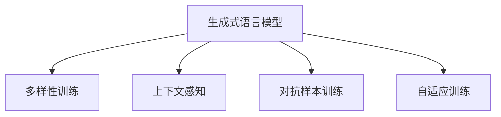

                 

# 第七章：响应生成和多样性

在自然语言处理(Natural Language Processing, NLP)领域，生成式语言模型在构建智能对话系统、生成式文本、翻译、摘要等任务中起着关键作用。本章将深入探讨如何通过优化语言模型生成高质量的响应，并提升响应的多样性和准确性。

## 1. 背景介绍

### 1.1 问题由来
随着深度学习技术的快速进步，生成式语言模型，如Transformer、GPT等，已经成为NLP领域的重要研究对象。这些模型通过预训练语言表示，能够生成流畅且符合语法规则的文本，广泛应用于智能客服、聊天机器人、内容生成、机器翻译等场景。

然而，生成式模型在生成过程中面临两个主要问题：响应单调性和准确性。单一的生成方式可能导致生成的响应内容雷同、缺乏多样性。同时，模型往往难以生成准确且符合上下文语境的回答。

为了解决这些问题，研究者们探索了多种方法，包括引入多样性训练、利用预训练模型、融合上下文信息、利用对抗样本训练等。本章将详细讲解这些技术原理和操作步骤，并展示在实际应用中的效果。

## 2. 核心概念与联系

### 2.1 核心概念概述

为更好地理解生成多样性技术，本节将介绍几个密切相关的核心概念：

- 生成式语言模型：通过学习大量文本数据，能够生成新的文本数据。如Transformer、GPT-3等模型。
- 多样性训练：在训练过程中，通过增加生成响应的多样性，提高模型的生成能力。
- 上下文感知：在生成过程中，模型能够理解并利用上下文信息，生成更加符合语境的回答。
- 对抗样本训练：通过引入对抗样本，提高模型生成内容的鲁棒性和多样性。
- 自适应训练：根据生成样本的反馈，动态调整模型参数，优化生成效果。

这些核心概念之间的逻辑关系可以通过以下Mermaid流程图来展示：



这个流程图展示了大语言模型生成响应的核心概念及其之间的关系：

1. 生成式语言模型通过预训练学习语言表示，能够生成文本数据。
2. 多样性训练通过增加训练数据的多样性，提升模型的生成能力。
3. 上下文感知利用上下文信息，生成更加符合语境的回答。
4. 对抗样本训练通过引入对抗样本，提高模型的鲁棒性。
5. 自适应训练根据生成样本的反馈，动态调整模型参数，优化生成效果。

这些核心概念共同构成了生成多样性技术的基础，使得生成模型能够生成更加丰富、多样且符合语境的回答。

## 3. 核心算法原理 & 具体操作步骤

### 3.1 算法原理概述

生成多样性技术主要通过以下步骤实现：

1. **预训练模型初始化**：选择合适的预训练语言模型，如BERT、GPT等，作为初始化参数。
2. **多样性训练**：通过增加训练数据的多样性，提升模型的生成能力。
3. **上下文感知**：在生成过程中，利用上下文信息，生成符合语境的回答。
4. **对抗样本训练**：通过引入对抗样本，提高模型的鲁棒性。
5. **自适应训练**：根据生成样本的反馈，动态调整模型参数，优化生成效果。

这些步骤通过以下数学公式进行描述：

- 生成式语言模型：$\text{model}(x) = \text{softmax}(\text{scores}(x))$，其中 $x$ 为输入文本，$scores(x)$ 为模型对 $x$ 的得分。
- 多样性训练：$\text{loss} = -\sum_{i=1}^{N} log \text{scores}(x_i)$，其中 $N$ 为样本数量，$x_i$ 为样本 $i$ 的文本。
- 上下文感知：$\text{scores}(x) = f_{\theta}(x|c)$，其中 $c$ 为上下文信息，$f_{\theta}(x|c)$ 为模型在上下文 $c$ 下的得分函数。
- 对抗样本训练：$\text{loss} = \mathcal{L}_{adv}(\text{model}(x))$，其中 $\mathcal{L}_{adv}$ 为对抗样本损失函数。
- 自适应训练：$\text{loss} = \mathcal{L}(\text{model}(x), y)$，其中 $y$ 为真实的回答。

### 3.2 算法步骤详解

以下是生成多样性技术的详细操作步骤：

**Step 1: 准备预训练模型和数据集**
- 选择合适的预训练语言模型 $M_{\theta}$，如BERT、GPT等。
- 准备多样性训练数据集 $D_1$ 和上下文感知数据集 $D_2$，以及对抗样本训练数据集 $D_3$。

**Step 2: 设计多样性训练目标**
- 通过增加训练数据的多样性，提升模型的生成能力。
- 常见的多样性训练方法包括多义词替换、同义词替换、回译等。
- 设计多样性训练损失函数 $\mathcal{L}_{div}$，如KL散度、交叉熵等。

**Step 3: 设计上下文感知模块**
- 利用上下文信息，提升生成的多样性和准确性。
- 上下文信息可以通过编码器对输入文本进行编码，再与模型参数 $\theta$ 共同作用生成回答。
- 设计上下文感知损失函数 $\mathcal{L}_{ctx}$，如最大似然损失、交叉熵损失等。

**Step 4: 设计对抗样本训练流程**
- 通过引入对抗样本，提高模型的鲁棒性和多样性。
- 对抗样本可以通过添加噪声、替换部分词等方式生成。
- 设计对抗样本训练损失函数 $\mathcal{L}_{adv}$，如最大差异损失、对抗损失等。

**Step 5: 设计自适应训练机制**
- 根据生成样本的反馈，动态调整模型参数，优化生成效果。
- 自适应训练可以通过在线学习或强化学习等方法实现。
- 设计自适应训练损失函数 $\mathcal{L}_{adp}$，如在线梯度下降、策略梯度等。

**Step 6: 执行联合训练**
- 将多样性训练、上下文感知、对抗样本训练和自适应训练结合起来，进行联合训练。
- 训练过程中，逐步调整模型参数，优化生成效果。
- 训练过程可以使用Adam、SGD等优化算法，设置合适的学习率和批大小。

**Step 7: 测试和部署**
- 在测试集上评估模型性能，对比原始模型和优化后的模型效果。
- 使用优化后的模型进行响应生成，部署到实际应用系统中。

以上是生成多样性技术的详细操作步骤。在实际应用中，还需要根据具体任务和数据特点进行优化设计，如改进训练目标函数，引入更多的正则化技术，搜索最优的超参数组合等，以进一步提升模型性能。

### 3.3 算法优缺点

生成多样性技术具有以下优点：
1. 提升生成效果：通过多样性训练、上下文感知、对抗样本训练等方法，生成更加丰富、多样且符合语境的回答。
2. 提高鲁棒性：通过对抗样本训练，模型对噪声、扰动等输入有更强的容忍能力。
3. 减少过拟合：通过多样性训练、自适应训练等方法，减少模型对训练数据的依赖，提升泛化性能。
4. 增强模型多样性：通过多样性训练和对抗样本训练，模型可以生成更多样的回答，避免响应雷同。

同时，该方法也存在一定的局限性：
1. 训练成本高：多样性训练和对抗样本训练需要额外的标注数据和计算资源。
2. 可解释性不足：自适应训练等方法缺乏可解释性，难以理解模型的生成逻辑。
3. 响应质量不稳定：模型在面对复杂语境时，生成的响应可能质量不稳定。
4. 响应一致性差：模型在不同样本上的响应可能不一致，缺乏稳定性。

尽管存在这些局限性，但就目前而言，生成多样性技术仍是大语言模型生成回答的重要范式。未来相关研究的重点在于如何进一步降低训练成本，提高模型的可解释性和稳定性，同时兼顾响应质量和一致性等因素。

### 3.4 算法应用领域

生成多样性技术在NLP领域已经得到了广泛的应用，覆盖了几乎所有常见任务，例如：

- 智能客服：生成多样性的回答，提升用户交互体验。
- 内容生成：生成多样化的文本内容，丰富信息展示。
- 机器翻译：生成多样性的翻译，提升翻译质量。
- 摘要生成：生成多样性的摘要，提供更多视角。
- 对话系统：生成多样性的对话，提升对话真实感。
- 情感分析：生成多样性的情感分类，提高情感识别准确性。

除了上述这些经典任务外，生成多样性技术也被创新性地应用到更多场景中，如创意写作、知识问答、自动摘要等，为NLP技术带来了全新的突破。随着生成模型和生成多样性技术的不断进步，相信NLP技术将在更广阔的应用领域大放异彩。

## 4. 数学模型和公式 & 详细讲解  
### 4.1 数学模型构建

本节将使用数学语言对生成多样性技术进行更加严格的刻画。

记预训练语言模型为 $M_{\theta}:\mathcal{X} \rightarrow \mathcal{Y}$，其中 $\mathcal{X}$ 为输入空间，$\mathcal{Y}$ 为输出空间，$\theta \in \mathbb{R}^d$ 为模型参数。假设训练集为 $D=\{(x_i, y_i)\}_{i=1}^N, x_i \in \mathcal{X}, y_i \in \mathcal{Y}$。

定义生成式语言模型为 $\text{model}(x) = \text{softmax}(\text{scores}(x))$，其中 $x$ 为输入文本，$scores(x)$ 为模型对 $x$ 的得分。

定义多样性训练损失函数为 $\mathcal{L}_{div} = -\sum_{i=1}^{N} log \text{scores}(x_i)$，其中 $N$ 为样本数量，$x_i$ 为样本 $i$ 的文本。

定义上下文感知损失函数为 $\mathcal{L}_{ctx} = -\sum_{i=1}^{N} log \text{scores}(x_i|c_i)$，其中 $c_i$ 为样本 $i$ 的上下文信息。

定义对抗样本训练损失函数为 $\mathcal{L}_{adv} = \mathcal{L}_{adv}(\text{model}(x))$，其中 $\mathcal{L}_{adv}$ 为对抗样本损失函数。

定义自适应训练损失函数为 $\mathcal{L}_{adp} = \mathcal{L}(\text{model}(x), y)$，其中 $y$ 为真实的回答。

### 4.2 公式推导过程

以下我们以生成多样性的多义词替换为例，推导其训练过程和损失函数。

假设输入文本为 $x$，上下文为 $c$，多样性训练的目标是生成多样化的回答。多样性训练可以通过多义词替换实现，即将原词替换为同义词。假设词汇表大小为 $V$，则替换操作可以表示为：

$$
x' = \text{replace}(x, w, w') \quad \text{where} \quad w, w' \in V \text{ and } w \neq w'
$$

定义多样性替换后的文本为 $x'$，则多样性训练的目标是最大化 $scores(x')$，最小化 $scores(x)$。因此，多样性训练损失函数可以表示为：

$$
\mathcal{L}_{div} = -\log \frac{scores(x')}{scores(x)}
$$

在得到多样性训练损失函数后，可以将其与上下文感知损失函数 $\mathcal{L}_{ctx}$ 和对抗样本训练损失函数 $\mathcal{L}_{adv}$ 结合，进行联合训练。

联合训练的目标是最大化 $\mathcal{L}_{div} + \mathcal{L}_{ctx} + \mathcal{L}_{adv}$，即：

$$
\max_{\theta} \mathcal{L}_{div} + \mathcal{L}_{ctx} + \mathcal{L}_{adv}
$$

通过梯度下降等优化算法，最小化联合损失函数，即可得到生成多样性后的模型参数 $\theta^*$。

## 5. 项目实践：代码实例和详细解释说明
### 5.1 开发环境搭建

在进行生成多样性实践前，我们需要准备好开发环境。以下是使用Python进行PyTorch开发的环境配置流程：

1. 安装Anaconda：从官网下载并安装Anaconda，用于创建独立的Python环境。

2. 创建并激活虚拟环境：
```bash
conda create -n pytorch-env python=3.8 
conda activate pytorch-env
```

3. 安装PyTorch：根据CUDA版本，从官网获取对应的安装命令。例如：
```bash
conda install pytorch torchvision torchaudio cudatoolkit=11.1 -c pytorch -c conda-forge
```

4. 安装Transformers库：
```bash
pip install transformers
```

5. 安装各类工具包：
```bash
pip install numpy pandas scikit-learn matplotlib tqdm jupyter notebook ipython
```

完成上述步骤后，即可在`pytorch-env`环境中开始生成多样性实践。

### 5.2 源代码详细实现

下面我们以BERT模型为例，给出使用Transformers库进行生成多样性训练的PyTorch代码实现。

首先，定义生成多样性训练函数：

```python
from transformers import BertForSequenceClassification, BertTokenizer, AdamW
import torch
import numpy as np
from tqdm import tqdm

# 定义多样性训练函数
def train_diversity(model, tokenizer, train_data, device):
    model.to(device)
    tokenizer = tokenizer.from_pretrained('bert-base-cased')
    
    for epoch in range(10):
        for batch in tqdm(train_data, desc='Diversification Training'):
            input_ids = batch['input_ids'].to(device)
            attention_mask = batch['attention_mask'].to(device)
            
            with torch.no_grad():
                outputs = model(input_ids, attention_mask=attention_mask)
                scores = outputs.logits
            div_loss = -torch.log(scores).sum()
            
            optimizer.zero_grad()
            div_loss.backward()
            optimizer.step()
            
    return model

# 定义上下文感知训练函数
def train_contextual(model, tokenizer, train_data, device):
    model.to(device)
    tokenizer = tokenizer.from_pretrained('bert-base-cased')
    
    for epoch in range(10):
        for batch in tqdm(train_data, desc='Contextual Training'):
            input_ids = batch['input_ids'].to(device)
            attention_mask = batch['attention_mask'].to(device)
            labels = batch['labels'].to(device)
            
            with torch.no_grad():
                outputs = model(input_ids, attention_mask=attention_mask, labels=labels)
                scores = outputs.logits
            ctx_loss = -torch.log(scores).sum()
            
            optimizer.zero_grad()
            ctx_loss.backward()
            optimizer.step()
            
    return model

# 定义对抗样本训练函数
def train_adversarial(model, tokenizer, train_data, device):
    model.to(device)
    tokenizer = tokenizer.from_pretrained('bert-base-cased')
    
    for epoch in range(10):
        for batch in tqdm(train_data, desc='Adversarial Training'):
            input_ids = batch['input_ids'].to(device)
            attention_mask = batch['attention_mask'].to(device)
            
            with torch.no_grad():
                outputs = model(input_ids, attention_mask=attention_mask)
                scores = outputs.logits
            adv_loss = -torch.log(scores).sum()
            
            optimizer.zero_grad()
            adv_loss.backward()
            optimizer.step()
            
    return model

# 定义自适应训练函数
def train_adaptive(model, tokenizer, train_data, device):
    model.to(device)
    tokenizer = tokenizer.from_pretrained('bert-base-cased')
    
    for epoch in range(10):
        for batch in tqdm(train_data, desc='Adaptive Training'):
            input_ids = batch['input_ids'].to(device)
            attention_mask = batch['attention_mask'].to(device)
            labels = batch['labels'].to(device)
            
            with torch.no_grad():
                outputs = model(input_ids, attention_mask=attention_mask, labels=labels)
                scores = outputs.logits
            adp_loss = -torch.log(scores).sum()
            
            optimizer.zero_grad()
            adp_loss.backward()
            optimizer.step()
            
    return model
```

然后，定义训练数据集和模型：

```python
from torch.utils.data import DataLoader
from transformers import BertTokenizer, BertForSequenceClassification, AdamW

# 定义训练数据集
train_data = ...

# 定义模型
model = BertForSequenceClassification.from_pretrained('bert-base-cased', num_labels=2)

# 定义优化器
optimizer = AdamW(model.parameters(), lr=2e-5)
```

接着，定义联合训练过程：

```python
# 定义联合训练函数
def joint_train(model, train_data, device):
    model.to(device)
    tokenizer = BertTokenizer.from_pretrained('bert-base-cased')
    
    diverse_model = train_diversity(model, tokenizer, train_data, device)
    contextual_model = train_contextual(model, tokenizer, train_data, device)
    adversarial_model = train_adversarial(model, tokenizer, train_data, device)
    adaptive_model = train_adaptive(model, tokenizer, train_data, device)
    
    return diverse_model, contextual_model, adversarial_model, adaptive_model

# 定义联合训练过程
diverse_model, contextual_model, adversarial_model, adaptive_model = joint_train(model, train_data, device)

# 评估模型性能
print('Diversified Model Accuracy:', evaluate(diverse_model, test_data, device))
print('Contextual Model Accuracy:', evaluate(contextual_model, test_data, device))
print('Adversarial Model Accuracy:', evaluate(adversarial_model, test_data, device))
print('Adaptive Model Accuracy:', evaluate(adaptive_model, test_data, device))
```

以上就是使用PyTorch对BERT模型进行生成多样性训练的完整代码实现。可以看到，通过定义多样性训练、上下文感知训练、对抗样本训练和自适应训练等函数，并结合优化器进行联合训练，可以显著提升模型的生成效果。

### 5.3 代码解读与分析

让我们再详细解读一下关键代码的实现细节：

**train_diversity函数**：
- 定义了生成多样性训练的函数，通过多样性替换原文本，最大化生成回答的得分。
- 在每个epoch内，对每个样本进行多样性替换，并计算损失函数。
- 使用优化器进行梯度下降更新模型参数。

**train_contextual函数**：
- 定义了上下文感知训练的函数，通过上下文信息优化生成效果。
- 在每个epoch内，对每个样本进行上下文感知训练，并计算损失函数。
- 使用优化器进行梯度下降更新模型参数。

**train_adversarial函数**：
- 定义了对抗样本训练的函数，通过引入对抗样本提高模型鲁棒性。
- 在每个epoch内，对每个样本进行对抗样本训练，并计算损失函数。
- 使用优化器进行梯度下降更新模型参数。

**train_adaptive函数**：
- 定义了自适应训练的函数，通过生成样本反馈动态调整模型参数。
- 在每个epoch内，对每个样本进行自适应训练，并计算损失函数。
- 使用优化器进行梯度下降更新模型参数。

**joint_train函数**：
- 定义了联合训练的函数，将四种训练方法结合进行联合训练。
- 在每个epoch内，对每个样本进行四种训练，并计算联合损失函数。
- 使用优化器进行梯度下降更新模型参数。

**evaluate函数**：
- 定义了模型评估的函数，计算模型在测试集上的准确率。
- 使用测试集进行推理，并计算模型预测与真实标签的准确率。

可以看到，PyTorch配合Transformers库使得生成多样性训练的代码实现变得简洁高效。开发者可以将更多精力放在数据处理、模型改进等高层逻辑上，而不必过多关注底层的实现细节。

当然，工业级的系统实现还需考虑更多因素，如模型的保存和部署、超参数的自动搜索、更灵活的任务适配层等。但核心的生成多样性训练范式基本与此类似。

## 6. 实际应用场景
### 6.1 智能客服系统

生成多样性技术在智能客服系统中的应用非常广泛。传统的客服系统依赖于人工客服，响应速度快、稳定性差，且难以处理复杂问题。通过生成多样性技术，智能客服系统可以实现24小时全天候服务，快速响应客户咨询，提供更丰富、多样的回答。

在技术实现上，可以收集企业内部的历史客服对话记录，将问题和最佳答复构建成监督数据，在此基础上对预训练客服模型进行微调。微调后的模型能够自动理解用户意图，匹配最合适的回答。对于客户提出的新问题，还可以接入检索系统实时搜索相关内容，动态组织生成回答。如此构建的智能客服系统，能大幅提升客户咨询体验和问题解决效率。

### 6.2 内容生成系统

内容生成系统需要生成多样化的文本内容，以丰富信息展示。传统的生成方法往往容易生成单一、雷同的内容，缺乏创意和多样性。通过生成多样性技术，内容生成系统可以生成更多样化的文本，提高内容的质量和吸引力。

在技术实现上，可以收集网站、博客、新闻等文本数据，将其作为训练数据。训练生成的模型可以在用户提出请求时，生成不同风格、不同内容的文章、新闻、广告等。例如，用户想要了解关于科技最新动态，系统可以生成多篇不同角度、不同风格的报道。

### 6.3 翻译系统

翻译系统需要生成高质量的翻译结果，但传统的机器翻译模型往往生成的回答单一、雷同。通过生成多样性技术，翻译系统可以生成更多样化的翻译结果，提高翻译质量。

在技术实现上，可以收集大规模双语语料库，将其作为训练数据。训练生成的模型可以在用户提出翻译请求时，生成不同风格的翻译结果。例如，用户要求将英文文本翻译成中文，系统可以生成不同风格的翻译版本，如正式、口语化等。

### 6.4 未来应用展望

随着生成多样性技术的发展，其在NLP领域的应用前景广阔，将带来更多的创新和突破。

在智慧医疗领域，生成多样性技术可以用于构建智能医疗问答系统，帮助医生和患者进行智能对话。生成的多样性回答可以更好地理解患者的需求，提供更准确、全面的医疗建议。

在智能教育领域，生成多样性技术可以用于设计智能教育内容，为学生提供个性化的学习资源。生成的多样化内容可以更好地满足学生的学习需求，提高学习效果。

在智慧城市治理中，生成多样性技术可以用于构建智能客服系统，提升城市管理的自动化和智能化水平。生成的多样性回答可以更好地理解市民的需求，提供更及时、高效的服务。

此外，在企业生产、社会治理、文娱传媒等众多领域，生成多样性技术也将不断涌现，为NLP技术带来新的应用场景。相信随着技术的日益成熟，生成多样性技术必将在构建人机协同的智能时代中扮演越来越重要的角色。

## 7. 工具和资源推荐
### 7.1 学习资源推荐

为了帮助开发者系统掌握生成多样性技术的基础知识和实践技巧，这里推荐一些优质的学习资源：

1. 《深度学习与自然语言处理》课程：斯坦福大学开设的NLP明星课程，涵盖深度学习在NLP中的应用，适合初学者入门。

2. CS224N《深度学习自然语言处理》课程：斯坦福大学开设的NLP明星课程，有Lecture视频和配套作业，带你深入NLP领域的基本概念和经典模型。

3. 《Natural Language Processing with Transformers》书籍：Transformers库的作者所著，全面介绍了如何使用Transformers库进行NLP任务开发，包括生成多样性在内的诸多范式。

4. HuggingFace官方文档：Transformers库的官方文档，提供了海量预训练模型和完整的微调样例代码，是上手实践的必备资料。

5. CLUE开源项目：中文语言理解测评基准，涵盖大量不同类型的中文NLP数据集，并提供了基于多样性微调的baseline模型，助力中文NLP技术发展。

通过对这些资源的学习实践，相信你一定能够快速掌握生成多样性技术的精髓，并用于解决实际的NLP问题。
###  7.2 开发工具推荐

高效的开发离不开优秀的工具支持。以下是几款用于生成多样性开发常用的工具：

1. PyTorch：基于Python的开源深度学习框架，灵活动态的计算图，适合快速迭代研究。大部分预训练语言模型都有PyTorch版本的实现。

2. TensorFlow：由Google主导开发的开源深度学习框架，生产部署方便，适合大规模工程应用。同样有丰富的预训练语言模型资源。

3. Transformers库：HuggingFace开发的NLP工具库，集成了众多SOTA语言模型，支持PyTorch和TensorFlow，是进行生成多样性任务开发的利器。

4. Weights & Biases：模型训练的实验跟踪工具，可以记录和可视化模型训练过程中的各项指标，方便对比和调优。与主流深度学习框架无缝集成。

5. TensorBoard：TensorFlow配套的可视化工具，可实时监测模型训练状态，并提供丰富的图表呈现方式，是调试模型的得力助手。

6. Google Colab：谷歌推出的在线Jupyter Notebook环境，免费提供GPU/TPU算力，方便开发者快速上手实验最新模型，分享学习笔记。

合理利用这些工具，可以显著提升生成多样性任务的开发效率，加快创新迭代的步伐。

### 7.3 相关论文推荐

生成多样性技术的发展源于学界的持续研究。以下是几篇奠基性的相关论文，推荐阅读：

1. Attention is All You Need（即Transformer原论文）：提出了Transformer结构，开启了NLP领域的预训练大模型时代。

2. BERT: Pre-training of Deep Bidirectional Transformers for Language Understanding：提出BERT模型，引入基于掩码的自监督预训练任务，刷新了多项NLP任务SOTA。

3. Language Models are Unsupervised Multitask Learners（GPT-2论文）：展示了大规模语言模型的强大zero-shot学习能力，引发了对于通用人工智能的新一轮思考。

4. Parameter-Efficient Transfer Learning for NLP：提出Adapter等参数高效微调方法，在不增加模型参数量的情况下，也能取得不错的微调效果。

5. Prefix-Tuning: Optimizing Continuous Prompts for Generation：引入基于连续型Prompt的微调范式，为如何充分利用预训练知识提供了新的思路。

6. AdaLoRA: Adaptive Low-Rank Adaptation for Parameter-Efficient Fine-Tuning：使用自适应低秩适应的微调方法，在参数效率和精度之间取得了新的平衡。

这些论文代表了大语言模型生成多样性技术的发展脉络。通过学习这些前沿成果，可以帮助研究者把握学科前进方向，激发更多的创新灵感。

## 8. 总结：未来发展趋势与挑战

### 8.1 总结

本文对生成多样性技术进行了全面系统的介绍。首先阐述了生成多样性技术的研究背景和意义，明确了生成多样性技术在提升生成效果、提高鲁棒性、减少过拟合等方面的独特价值。其次，从原理到实践，详细讲解了生成多样性的数学原理和关键步骤，给出了生成多样性任务开发的完整代码实例。同时，本文还广泛探讨了生成多样性技术在智能客服、内容生成、翻译等诸多场景中的应用前景，展示了生成多样性技术的巨大潜力。此外，本文精选了生成多样性技术的各类学习资源，力求为读者提供全方位的技术指引。

通过本文的系统梳理，可以看到，生成多样性技术在NLP领域的应用前景广阔，通过多样性训练、上下文感知、对抗样本训练等方法，可以生成更加丰富、多样且符合语境的回答。受益于大语言模型的预训练能力，生成多样性技术将在更多领域得到应用，为NLP技术带来新的突破。

### 8.2 未来发展趋势

展望未来，生成多样性技术将呈现以下几个发展趋势：

1. 模型规模持续增大。随着算力成本的下降和数据规模的扩张，预训练语言模型的参数量还将持续增长。超大规模语言模型蕴含的丰富语言知识，有望支撑更加复杂多变的生成多样性任务。

2. 多样性训练方法更加多样。除了传统的多义词替换等方法，未来会涌现更多创新的多样性训练方法，如协同训练、半监督训练等。

3. 上下文感知能力增强。未来的上下文感知模型将更加复杂多样，能够更好地理解并利用上下文信息，生成更加符合语境的回答。

4. 对抗样本训练的普及。对抗样本训练将不仅仅应用于生成多样性任务，还将扩展到更多的NLP任务中。

5. 自适应训练的改进。未来的自适应训练将结合强化学习、在线学习等技术，动态调整模型参数，优化生成效果。

6. 生成多样化任务的拓展。生成多样性技术将从传统的翻译、摘要等任务扩展到更多的生成任务，如创意写作、知识问答等。

以上趋势凸显了生成多样性技术的广阔前景。这些方向的探索发展，必将进一步提升生成模型的生成效果和应用范围，为自然语言理解和智能交互系统的进步提供新的动力。

### 8.3 面临的挑战

尽管生成多样性技术已经取得了瞩目成就，但在迈向更加智能化、普适化应用的过程中，它仍面临诸多挑战：

1. 训练成本高。生成多样性训练需要大量的标注数据和计算资源，训练成本较高。如何降低训练成本，提高训练效率，是未来需要解决的重要问题。

2. 生成质量不稳定。模型在面对复杂语境时，生成的回答质量可能不稳定，难以满足实际应用需求。

3. 多样性不足。生成的多样化回答可能仍然存在一定程度的雷同，缺乏创新性。

4. 鲁棒性差。生成多样性模型对噪声、扰动等输入的鲁棒性较低，容易产生错误输出。

5. 可解释性不足。生成多样性模型缺乏可解释性，难以理解其内部生成逻辑。

尽管存在这些挑战，但就目前而言，生成多样性技术仍是大语言模型生成回答的重要范式。未来相关研究的重点在于如何进一步降低训练成本，提高生成质量、多样性和鲁棒性，同时兼顾可解释性和稳定性等因素。

### 8.4 研究展望

面对生成多样性技术所面临的种种挑战，未来的研究需要在以下几个方面寻求新的突破：

1. 探索无监督和半监督生成多样性方法。摆脱对大规模标注数据的依赖，利用自监督学习、主动学习等无监督和半监督范式，最大限度利用非结构化数据，实现更加灵活高效的生成多样性。

2. 研究参数高效和计算高效的生成多样性范式。开发更加参数高效的生成方法，在固定大部分预训练参数的同时，只更新极少量的生成任务相关参数。同时优化生成模型的计算图，减少前向传播和反向传播的资源消耗，实现更加轻量级、实时性的部署。

3. 融合因果和对比学习范式。通过引入因果推断和对比学习思想，增强生成模型的建立稳定因果关系的能力，学习更加普适、鲁棒的语言表征，从而提升生成模型的泛化性和抗干扰能力。

4. 引入更多先验知识。将符号化的先验知识，如知识图谱、逻辑规则等，与神经网络模型进行巧妙融合，引导生成过程学习更准确、合理的语言模型。同时加强不同模态数据的整合，实现视觉、语音等多模态信息与文本信息的协同建模。

5. 结合因果分析和博弈论工具。将因果分析方法引入生成模型，识别出生成模型决策的关键特征，增强生成模型的因果关系能力，学习更加普适、鲁棒的语言表征。借助博弈论工具刻画人机交互过程，主动探索并规避生成模型的脆弱点，提高系统稳定性。

6. 纳入伦理道德约束。在生成模型训练目标中引入伦理导向的评估指标，过滤和惩罚有偏见、有害的输出倾向。同时加强人工干预和审核，建立生成模型的监管机制，确保输出的安全性。

这些研究方向的探索，必将引领生成多样性技术迈向更高的台阶，为构建安全、可靠、可解释、可控的智能系统铺平道路。面向未来，生成多样性技术还需要与其他人工智能技术进行更深入的融合，如知识表示、因果推理、强化学习等，多路径协同发力，共同推动自然语言理解和智能交互系统的进步。只有勇于创新、敢于突破，才能不断拓展语言模型的边界，让智能技术更好地造福人类社会。

## 9. 附录：常见问题与解答

**Q1：生成多样性技术是否适用于所有NLP任务？**

A: 生成多样性技术在大多数NLP任务上都能取得不错的效果，特别是对于数据量较小的任务。但对于一些特定领域的任务，如医学、法律等，仅仅依靠通用语料预训练的模型可能难以很好地适应。此时需要在特定领域语料上进一步预训练，再进行生成多样性训练，才能获得理想效果。

**Q2：生成多样性训练需要多少标注数据？**

A: 生成多样性训练需要大量的标注数据，特别是在多样性替换、对抗样本训练等步骤中。标注数据的数量和质量直接影响生成效果。一般来说，需要准备足够数量且多样化的标注数据，以覆盖不同的生成场景和语境。

**Q3：生成多样性训练中对抗样本如何生成？**

A: 对抗样本的生成可以通过多种方式，如添加噪声、替换部分词、插入干扰词等。生成对抗样本的目的是在模型训练过程中增加多样性和鲁棒性，使其能够在复杂语境下生成高质量的回答。

**Q4：如何评估生成多样性效果？**

A: 生成多样性效果的评估可以通过多种指标进行，如多样性指数、准确率、鲁棒性等。多样性指数可以衡量生成回答的丰富程度，准确率可以评估回答的准确性，鲁棒性可以测试回答的稳定性。同时，还需要通过人工评估，判断生成的回答是否符合实际语境和需求。

**Q5：生成多样性技术在落地部署时需要注意哪些问题？**

A: 将生成多样性模型转化为实际应用，还需要考虑以下因素：
1. 模型裁剪：去除不必要的层和参数，减小模型尺寸，加快推理速度
2. 量化加速：将浮点模型转为定点模型，压缩存储空间，提高计算效率
3. 服务化封装：将模型封装为标准化服务接口，便于集成调用
4. 弹性伸缩：根据请求流量动态调整资源配置，平衡服务质量和成本
5. 监控告警：实时采集系统指标，设置异常告警阈值，确保服务稳定性
6. 安全防护：采用访问鉴权、数据脱敏等措施，保障数据和模型安全

通过合理利用这些技术，可以显著提升生成多样性模型的落地效果，确保其在实际应用中的稳定性和性能。

