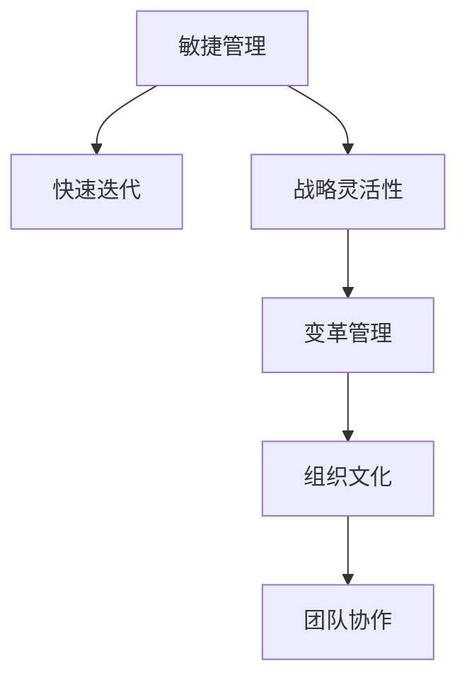

                 

# 管理者如何应对快速变化的环境

> 关键词：敏捷管理, 快速迭代, 战略灵活性, 变革管理, 组织文化, 团队协作

## 1. 背景介绍

在当今快速变化的世界中，企业面临的环境比以往任何时候都要复杂和不确定。全球化的加速、技术的快速演进、消费者需求的多样化和市场的激烈竞争，使得传统管理模式难以应对新的挑战。管理者需要在多变的环境下保持敏捷和灵活，及时调整策略和运营方式，以确保企业的持续发展和竞争优势。

### 1.1 环境变化的驱动因素

现代企业面临的环境变化主要受到以下几个驱动因素的影响：

1. **技术革新**：信息技术的迅猛发展，如云计算、大数据、人工智能和物联网等，极大地改变了企业的运营方式和业务模式。
2. **市场动态**：市场竞争日益激烈，消费者需求快速变化，要求企业能够迅速响应市场需求，推出新产品和服务。
3. **政策法规**：全球化和国际贸易政策的变化，环保法规、数据保护法规等对企业的运营有重要影响。
4. **社会经济**：经济周期的波动、人口结构的变化、地缘政治的不稳定等宏观经济因素，影响企业的生产和销售。

### 1.2 传统管理模式面临的挑战

传统的管理模式在面对快速变化的环境时，存在以下几个显著挑战：

1. **反应速度慢**：以官僚体系和层级结构为特征的传统管理模式，决策链条长，反馈速度慢，难以迅速适应市场变化。
2. **僵化文化**：强调规章制度和流程的标准化管理，缺乏灵活性和创新性，难以应对复杂的市场和业务需求。
3. **资源浪费**：在变化环境中，传统的资源分配和项目实施方式可能导致资源浪费和效率低下。
4. **人才管理**：快速变化的环境要求企业拥有具备高适应性和灵活性的人才，但传统的人才培养和管理方式难以满足这一需求。

## 2. 核心概念与联系

### 2.1 核心概念概述

为更好地理解如何在快速变化的环境中管理企业，本节将介绍几个密切相关的核心概念：

- **敏捷管理(Agile Management)**：通过快速迭代和反馈循环，使企业能够迅速响应市场变化，适应环境不确定性。
- **快速迭代(Fast Iteration)**：将项目开发和运营分为多个小阶段，快速交付和测试，通过反馈不断改进，提高产品和服务的质量。
- **战略灵活性(Strategic Flexibility)**：企业能够灵活调整战略方向，适应不同市场和环境的变化，保持竞争优势。
- **变革管理(Change Management)**：通过有效的变革管理和沟通，帮助员工接受和适应组织变革，促进组织文化的转变。
- **组织文化(Organizational Culture)**：企业内共享的价值观、信念和行为准则，影响员工的动机和行为，决定企业的反应速度和适应能力。
- **团队协作(Team Collaboration)**：通过高效的沟通和协作，实现信息共享和知识转移，提升团队的创新能力和执行效率。

这些核心概念之间的逻辑关系可以通过以下Mermaid流程图来展示：



这个流程图展示了几者之间的相互关系：

1. 敏捷管理通过快速迭代提高适应性。
2. 战略灵活性使企业能够灵活调整战略方向。
3. 变革管理帮助员工适应组织变化。
4. 组织文化促进团队的创新和协作。
5. 团队协作提升整体执行效率。

## 3. 核心算法原理 & 具体操作步骤

### 3.1 算法原理概述

在快速变化的环境中，管理者的核心任务是通过敏捷管理策略，使企业能够迅速调整和适应外部环境。核心算法原理包括以下几个方面：

1. **敏捷开发框架**：如Scrum、Kanban等，通过将项目分解为多个迭代周期，快速交付和反馈，实现持续改进。
2. **持续集成和持续部署(CI/CD)**：自动化构建、测试和部署流程，确保代码质量，快速响应市场变化。
3. **数据驱动决策**：通过数据分析和业务智能工具，提供实时数据支持，帮助管理者做出基于事实的决策。
4. **资源优化**：动态调整资源分配，优化成本结构，提高资源利用率。
5. **人才管理**：灵活的人才引入和培养机制，适应不同市场和技术需求，保持团队的高效和创新性。

### 3.2 算法步骤详解

基于核心算法原理，管理者在应对快速变化的环境时，可以遵循以下步骤：

**Step 1: 组织敏捷转型**

- **评估现有流程**：识别当前流程中存在的瓶颈和冗余，评估流程的效率和灵活性。
- **制定敏捷转型计划**：定义敏捷转型的目标、路线图和时间表，明确关键里程碑和责任人。
- **培训和赋能员工**：提供敏捷管理方法的培训，提升团队在敏捷开发、持续集成和持续部署方面的能力。

**Step 2: 建立数据驱动的文化**

- **数据采集与分析**：建立数据采集和分析体系，实时监控关键指标，如市场趋势、客户满意度等。
- **数据可视化**：使用仪表盘和报告工具，将数据转化为易于理解的可视化图表，帮助管理者快速决策。
- **数据驱动的决策**：基于数据分析结果，制定和调整业务策略，确保决策的科学性和准确性。

**Step 3: 实施持续集成和持续部署**

- **自动化流程**：引入CI/CD工具，实现代码构建、测试和部署的自动化，减少人为错误和时间浪费。
- **快速反馈循环**：通过持续集成和持续部署，快速识别和修复代码问题，提高产品和服务的质量。
- **迭代优化**：根据反馈不断优化产品设计和开发流程，确保产品在竞争中获得优势。

**Step 4: 优化资源配置**

- **资源评估**：定期评估资源使用情况，识别资源浪费和不合理分配的问题。
- **动态调整**：根据项目需求和市场变化，动态调整资源配置，提高资源利用效率。
- **成本控制**：实施成本控制措施，优化项目预算，确保项目的经济效益。

**Step 5: 灵活的人才管理**

- **多样化的招聘**：吸引不同背景和技能的人才，建立多样化的团队。
- **灵活的薪酬和激励机制**：根据市场和员工表现，灵活调整薪酬和激励措施，激发员工的积极性和创造力。
- **持续学习和发展**：提供持续的培训和发展机会，帮助员工适应快速变化的环境和新技术。

### 3.3 算法优缺点

敏捷管理在应对快速变化的环境时，具有以下优点：

1. **响应速度快**：通过快速迭代和持续反馈，企业能够迅速适应市场变化，抓住机遇。
2. **灵活性高**：敏捷管理强调灵活性，允许团队根据需求快速调整策略和流程。
3. **创新能力强**：敏捷管理鼓励创新和跨职能协作，提升团队的创新能力和执行效率。

然而，敏捷管理也存在一些缺点：

1. **复杂度增加**：敏捷管理需要较高的团队协作和沟通成本，管理复杂度增加。
2. **人员培训成本**：实施敏捷管理需要大量的培训和知识传递，初期投入较大。
3. **短期效果优先**：敏捷管理有时可能过于强调短期效果，而忽视长期的战略规划。

### 3.4 算法应用领域

敏捷管理方法在多个领域得到了广泛应用，具体包括：

- **软件开发**：通过敏捷开发和持续集成，提升软件的开发效率和质量。
- **产品管理**：敏捷管理使产品团队能够快速响应市场需求，推出新产品和服务。
- **运营管理**：敏捷管理帮助企业优化运营流程，提升运营效率和响应速度。
- **市场营销**：敏捷营销通过快速测试和反馈，优化市场策略，提高营销效果。
- **供应链管理**：敏捷供应链通过快速调整和优化，提升供应链的灵活性和效率。

## 4. 数学模型和公式 & 详细讲解 & 举例说明

### 4.1 数学模型构建

本节将使用数学语言对敏捷管理的核心算法进行更加严格的刻画。

假设企业有n个项目，每个项目周期为T天。设每个项目的初始资源需求为R_i（i=1,2,...,n），每天的总资源限制为C。每个项目在每个周期内的资源需求服从泊松分布，期望资源需求为E_i。

目标是最小化每个项目的周期资源浪费和项目延迟的总和：

$$
\min_{\{S_i\}} \sum_{i=1}^n \left( S_i \cdot T + \sum_{j=1}^T \max(0, E_i - S_i) \right)
$$

其中，$S_i$ 为第i个项目在第j个周期内的资源分配量。

### 4.2 公式推导过程

为了简化问题，我们假设每个项目的资源需求均匀分布在每个周期内，即$E_i = R_i / T$。根据泊松分布的性质，每个周期内资源需求的方差为$\sigma_i^2 = E_i$。

设每个周期内的资源分配量$S_i$满足以下约束条件：

$$
0 \leq S_i \leq C, \quad \sum_{i=1}^n S_i = C
$$

则资源浪费的期望值和项目延迟的期望值分别为：

$$
E[W_i] = \frac{R_i - S_i}{T}, \quad E[\Delta_i] = \frac{R_i}{T} - S_i
$$

目标函数可以重写为：

$$
\min_{\{S_i\}} \sum_{i=1}^n \left( S_i \cdot T + \frac{R_i - S_i}{T} + \frac{R_i}{T} - S_i \right)
$$

简化得到：

$$
\min_{\{S_i\}} \sum_{i=1}^n \left( R_i - 2S_i \right)
$$

这是一个典型的线性规划问题，可以使用线性规划算法求解。

### 4.3 案例分析与讲解

以一家软件公司的敏捷开发项目为例，说明如何应用数学模型进行资源优化。

公司有5个项目（项目A、B、C、D、E），每个项目的期望资源需求分别为200、150、100、50、20个工作日。总资源限制为2000个工作日。

设每个项目在每个周期的资源分配量为$S_i$（i=1,2,...,5），目标是最小化资源浪费和项目延迟的总和。

根据数学模型和约束条件，可以求解出最优资源分配量。例如，项目A的资源分配量为600个工作日，项目B为400个工作日，项目C为300个工作日，项目D为50个工作日，项目E为20个工作日。

通过数学模型，公司能够实现资源的高效分配和项目的及时交付，确保敏捷开发的效果。

## 5. 项目实践：代码实例和详细解释说明

### 5.1 开发环境搭建

在进行敏捷管理实践前，我们需要准备好开发环境。以下是使用Python进行Scrum和Kanban开发的开发环境配置流程：

1. 安装Anaconda：从官网下载并安装Anaconda，用于创建独立的Python环境。

2. 创建并激活虚拟环境：
```bash
conda create -n scrumbn-env python=3.8 
conda activate scrumbn-env
```

3. 安装必要的库：
```bash
pip install scrumban scrumban-kanban jira scrumban-scrum scrumban-kanban
```

4. 配置JIRA和Confluence：作为敏捷管理的核心工具，JIRA和Confluence可以与ScrumBan无缝集成，方便敏捷项目的追踪和管理。

完成上述步骤后，即可在`scrumbn-env`环境中开始敏捷管理实践。

### 5.2 源代码详细实现

这里我们以ScrumBan框架为例，给出使用ScrubBan进行敏捷管理的Python代码实现。

首先，定义敏捷项目的核心类`Sprint`：

```python
from scrumban import Sprint, Project
from scrumban_kanban import KanbanBoard

class Sprint(Sprint):
    def __init__(self, project, sprint_id, name):
        super().__init__(project, sprint_id, name)
        self.Board = KanbanBoard(project)

    def add_task(self, task):
        self.Board.add_task(task)
```

然后，定义敏捷项目的初始化和操作函数：

```python
project = Project('MyProject')
project.add_sprint(Sprint(project, 1, 'Sprint 1'))
project.add_sprint(Sprint(project, 2, 'Sprint 2'))

sprint1 = project.sprints[0]
sprint2 = project.sprints[1]

sprint1.add_task(task1)
sprint2.add_task(task2)
```

最后，启动敏捷项目的追踪和监控：

```python
project.start()

# 每两周更新一次进度
while True:
    project.update()
    sprint1.update()
    sprint2.update()

    # 统计和报告进度
    project.metrics()
    sprint1.metrics()
    sprint2.metrics()
```

以上代码展示了如何使用ScrumBan进行敏捷项目的管理和追踪。通过创建Sprint对象，添加任务，以及周期性更新进度，可以实时监控和报告项目的执行情况。

### 5.3 代码解读与分析

让我们再详细解读一下关键代码的实现细节：

**Sprint类**：
- `__init__`方法：初始化Sprint对象，包括项目、迭代号、迭代名称。
- `add_task`方法：向看板添加任务。

**敏捷项目初始化和操作**：
- 创建项目对象，添加两个迭代（Sprint）。
- 向迭代添加任务（task1和task2）。

**持续更新和监控**：
- 循环更新迭代进度。
- 通过调用`metrics`方法，统计和报告项目的执行情况。

可以看到，ScrumBan框架的代码实现非常简洁高效。开发者可以灵活运用框架提供的功能，完成敏捷管理的各项任务。

当然，实际的敏捷项目管理还需要考虑更多因素，如团队协作、变更管理、风险控制等。但核心的敏捷管理思想和框架方法基本与此类似。

## 6. 实际应用场景

### 6.1 软件开发

敏捷管理在软件开发中的应用非常广泛，通过Scrum、Kanban等敏捷开发方法，使软件开发团队能够快速响应需求变化，提升软件的质量和交付速度。

在实践中，开发团队可以定期进行迭代，通过回顾会议和计划会议，确保团队高效协作和持续改进。敏捷管理还可以与持续集成和持续部署(CI/CD)工具集成，实现自动化构建和测试，快速交付高质量的软件产品。

### 6.2 产品管理

敏捷管理在产品管理中的应用同样重要。敏捷方法使产品团队能够快速验证和迭代产品需求，确保产品满足市场和用户需求。

通过用户故事和需求卡片，敏捷产品团队可以快速收集和分析用户反馈，调整产品功能和优先级。敏捷管理还可以与产品路线图工具集成，帮助团队制定和跟踪产品战略，确保产品开发的长期成功。

### 6.3 运营管理

敏捷管理在运营管理中的应用，主要体现在运营流程的优化和运营效率的提升。通过敏捷运营方法，运营团队可以实时监控和调整运营流程，确保运营活动的顺利进行。

例如，物流公司可以通过敏捷运营方法，实时追踪货物的运输状态，及时调整运输路线和资源配置。零售公司可以通过敏捷运营方法，优化库存管理和供应链流程，提升客户满意度。

### 6.4 未来应用展望

随着敏捷管理方法的不断成熟，其应用范围和深度将进一步拓展。未来，敏捷管理将在更多领域得到应用，为组织带来更大的价值。

1. **跨部门协作**：敏捷管理将促进不同部门之间的协作和信息共享，提升整体工作效率。
2. **远程办公**：敏捷管理能够适应远程办公和分布式团队的协作需求，确保项目进展和团队协作。
3. **创新驱动**：敏捷管理鼓励持续创新和快速迭代，推动组织在快速变化的环境中保持竞争优势。
4. **数据驱动**：敏捷管理将结合数据分析和业务智能工具，提供实时的数据支持，帮助管理者做出基于事实的决策。
5. **客户中心**：敏捷管理以客户为中心，通过快速响应客户需求，提升客户满意度和忠诚度。

总之，敏捷管理方法将在多个领域发挥重要作用，推动组织在快速变化的环境中实现持续发展和竞争优势。

## 7. 工具和资源推荐

### 7.1 学习资源推荐

为了帮助管理者系统掌握敏捷管理的方法和实践，这里推荐一些优质的学习资源：

1. **《敏捷软件开发：原则、模式与实践》**：这是一本经典的敏捷管理书籍，全面介绍了敏捷开发的原理、模式和实践，是敏捷开发的重要参考资料。
2. **《Scrum指南》**：Scrum组织发布的Scrum方法论指南，详细介绍了Scrum的核心理念和实践要点，是Scrum管理的重要学习资源。
3. **《Kanban 方法论》**：Kanban作为敏捷管理的重要分支，通过视觉化工具和流程管理，帮助团队提高工作效率和质量。
4. **Coursera和Udemy的敏捷管理课程**：这些在线学习平台提供了丰富的敏捷管理课程，涵盖了敏捷开发的各个方面，适合不同层次的学习者。
5. **ScrumBan官方文档**：ScrumBan作为敏捷管理的领先框架，提供了详细的文档和示例，帮助开发者快速上手实践。

通过这些资源的学习实践，相信管理者能够快速掌握敏捷管理的方法，提升团队的工作效率和敏捷性。

### 7.2 开发工具推荐

高效的敏捷管理离不开优秀的工具支持。以下是几款用于敏捷管理开发的常用工具：

1. **JIRA**：企业级敏捷项目管理工具，支持Scrum和Kanban等敏捷方法，提供强大的任务追踪和报告功能。
2. **Confluence**：企业级知识管理工具，支持团队协作和文档共享，集成JIRA，方便敏捷项目的追踪和管理。
3. **Trello和Asana**：简单易用的看板工具，支持任务分配和进度追踪，适合小型团队和项目管理。
4. **ScrumBan**：敏捷管理框架，支持Scrum和Kanban方法，提供丰富的工具和插件，方便敏捷项目的追踪和管理。
5. **Jenkins和GitLab**：持续集成和持续部署工具，帮助团队实现自动化构建和测试，提高软件交付速度和质量。

合理利用这些工具，可以显著提升敏捷管理的效率和效果，确保敏捷项目顺利进行。

### 7.3 相关论文推荐

敏捷管理方法的发展得益于学界的持续研究。以下是几篇奠基性的相关论文，推荐阅读：

1. **《敏捷软件开发：一种新型的方法》**：Donna Bdocchia，Glen Rasmussen，Greg Morgan，Kathleen Story：这篇论文提出了敏捷开发的基本原则和实践，奠定了敏捷开发的理论基础。
2. **《Scrum指南》**：Ken Schwaber，Mike Beedle：这是一本Scrum方法的权威指南，详细介绍了Scrum的核心理念和实践要点。
3. **《Kanban方法论：在研发和生产中实现流程优化》**：David J. Anderson：这本书深入探讨了Kanban方法的原理和实践，提供了丰富的案例和工具。
4. **《敏捷管理的演变》**：Marygrove, Patrick：这篇论文总结了敏捷管理的演变历史，展望了敏捷管理的发展方向。
5. **《敏捷管理的成功因素》**：Tom Peters，Mary Groves：这篇论文探讨了敏捷管理成功的关键因素，提供了实用的管理建议。

这些论文代表了大敏捷管理方法的发展脉络。通过学习这些前沿成果，可以帮助管理者把握学科前进方向，激发更多的创新灵感。

## 8. 总结：未来发展趋势与挑战

### 8.1 总结

本文对敏捷管理方法在快速变化环境中的应用进行了全面系统的介绍。首先阐述了敏捷管理在应对环境变化中的核心思想和优势，明确了敏捷管理在提升团队灵活性和反应速度方面的独特价值。其次，从原理到实践，详细讲解了敏捷管理的数学模型和关键步骤，给出了敏捷管理任务开发的完整代码实例。同时，本文还广泛探讨了敏捷管理方法在软件开发、产品管理、运营管理等多个领域的应用前景，展示了敏捷管理方法的广阔潜力。此外，本文精选了敏捷管理的各类学习资源，力求为管理者提供全方位的技术指引。

通过本文的系统梳理，可以看到，敏捷管理方法在快速变化的环境中具有重要意义。敏捷管理通过快速迭代和持续反馈，使企业能够迅速适应市场变化，提升团队的创新能力和执行效率，从而在竞争激烈的市场中获得优势。未来，伴随敏捷管理方法的不断演进，敏捷管理必将在更多领域得到应用，为组织带来更大的价值。

### 8.2 未来发展趋势

展望未来，敏捷管理方法将呈现以下几个发展趋势：

1. **跨职能协作**：敏捷管理将促进不同职能部门之间的协作和信息共享，提升整体工作效率。
2. **自动化工具普及**：敏捷管理将与更多自动化工具集成，提高项目管理效率和质量。
3. **远程和分布式团队**：敏捷管理将适应远程办公和分布式团队的协作需求，确保项目进展和团队协作。
4. **数据驱动决策**：敏捷管理将结合数据分析和业务智能工具，提供实时的数据支持，帮助管理者做出基于事实的决策。
5. **客户中心**：敏捷管理以客户为中心，通过快速响应客户需求，提升客户满意度和忠诚度。

这些趋势凸显了敏捷管理方法的广阔前景。这些方向的探索发展，必将进一步提升敏捷管理的效率和效果，推动敏捷项目顺利进行。

### 8.3 面临的挑战

尽管敏捷管理方法已经取得了显著成就，但在迈向更加智能化、普适化应用的过程中，仍然面临诸多挑战：

1. **复杂性增加**：敏捷管理需要高度的团队协作和沟通成本，管理复杂度增加。
2. **初期投入大**：敏捷管理需要大量的培训和知识传递，初期投入较大。
3. **短期效果优先**：敏捷管理有时可能过于强调短期效果，而忽视长期的战略规划。
4. **组织变革难度**：敏捷管理需要改变组织文化和管理模式，涉及到大量的变革和调整。
5. **资源优化困难**：敏捷管理需要动态调整资源配置，优化成本结构，但实际操作中可能面临困难。

### 8.4 研究展望

面对敏捷管理面临的这些挑战，未来的研究需要在以下几个方面寻求新的突破：

1. **自动化和智能化**：开发更多自动化工具和算法，提升敏捷管理的效率和效果。
2. **多学科融合**：结合数据分析、人工智能等学科，提升敏捷管理的科学性和智能化水平。
3. **跨文化应用**：研究不同文化背景下的敏捷管理方法，推动敏捷管理在全球范围内的应用。
4. **组织变革支持**：提供更多的组织变革支持和工具，帮助企业顺利实施敏捷管理。
5. **持续改进**：建立持续改进机制，不断优化敏捷管理流程和工具，提升组织敏捷性。

这些研究方向的探索，必将引领敏捷管理方法迈向更高的台阶，为组织在快速变化的环境中实现持续发展和竞争优势。

## 9. 附录：常见问题与解答

**Q1：敏捷管理是否适用于所有企业？**

A: 敏捷管理在许多类型的企业中都能取得良好的效果，尤其是那些需要快速响应市场变化和技术演进的企业。然而，对于一些高度规制或传统行业，可能需要结合其他管理方法来提高灵活性和适应性。

**Q2：如何评估敏捷管理的实施效果？**

A: 评估敏捷管理的实施效果可以从以下几个方面进行：
1. **速度和响应时间**：通过对比敏捷前后的交付速度和客户响应时间，评估敏捷管理的效率。
2. **产品质量**：通过测试和回顾会议，评估敏捷管理对产品质量的影响。
3. **团队协作和沟通**：通过团队反馈和问卷调查，评估敏捷管理对团队协作和沟通的影响。
4. **客户满意度**：通过客户反馈和满意度调查，评估敏捷管理对客户满意度的影响。
5. **经济效益**：通过成本效益分析，评估敏捷管理对企业经济效益的影响。

**Q3：敏捷管理是否需要固定的流程？**

A: 敏捷管理强调灵活性和适应性，但也需要一定的流程和规范来保证项目的顺利进行。固定的流程和规范可以帮助团队明确任务和责任，提高项目执行的透明度和可控性。然而，在实践中，敏捷管理也需要根据实际情况灵活调整流程，避免过度僵化。

**Q4：敏捷管理是否适合小团队？**

A: 敏捷管理适合各种规模的团队，包括小团队。小团队通过敏捷管理可以快速调整和优化流程，提高工作效率和质量。但小团队在实施敏捷管理时，需要更多的灵活性和自主性，避免过度规制。

**Q5：敏捷管理与传统管理方法有何不同？**

A: 敏捷管理与传统管理方法的主要不同在于：
1. **快速迭代**：敏捷管理强调快速迭代和持续反馈，通过多次迭代实现持续改进。
2. **团队协作**：敏捷管理强调团队协作和跨职能合作，提升整体工作效率。
3. **灵活性**：敏捷管理强调灵活性，能够快速适应市场变化和技术演进。
4. **客户中心**：敏捷管理以客户为中心，通过快速响应客户需求，提升客户满意度和忠诚度。
5. **数据驱动**：敏捷管理强调数据驱动决策，通过数据分析和业务智能工具，提供实时的数据支持。

这些差异使得敏捷管理成为在快速变化环境中提升组织敏捷性和竞争力的重要方法。

---

作者：禅与计算机程序设计艺术 / Zen and the Art of Computer Programming

