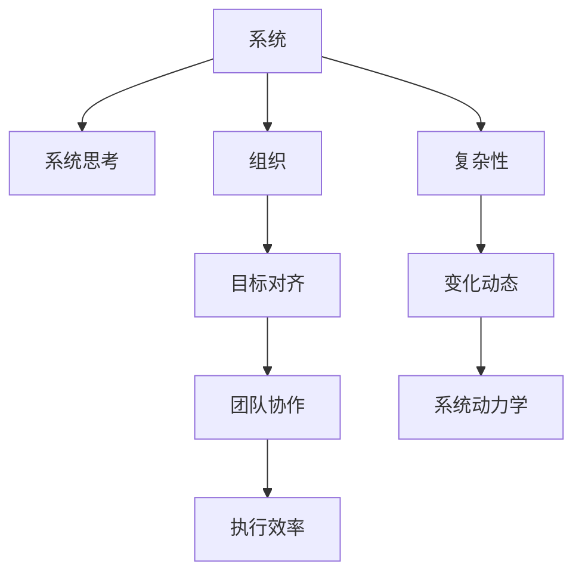

                 

# 管理者如何提升系统思考能力

> 关键词：系统思考, 管理决策, 组织能力, 组织架构, 领导力, 复杂系统, 决策模型, 目标对齐, 团队协作

## 1. 背景介绍

### 1.1 问题由来
在现代社会，管理者的角色已经发生了根本性的变化。面对复杂多变的市场环境，以及快速迭代的技术变革，管理者需要具备更强的系统思考能力，才能在复杂环境中做出科学合理的决策。系统思考是一种从整体和全局角度看待问题的思维方式，能够帮助管理者洞察组织内部以及外部环境中的系统关系，揭示问题的根本原因，并提出有效的解决策略。然而，对于大部分管理者来说，系统思考并非其专业背景，如何提升系统思考能力，成为当前急需解决的问题。

### 1.2 问题核心关键点
提升系统思考能力的关键在于以下几个方面：
- **理解系统思维的基本概念和原理**：掌握系统思考的核心概念，如整体与部分、原因与结果、稳定态与变化态、层次结构与反馈机制等。
- **应用系统思维的方法和工具**：学习系统思维的常用方法和工具，如因果环、系统动力学模型、决策树等。
- **提升跨学科的知识储备**：系统思维涉及众多学科领域，管理者需要具备跨学科的知识背景，以更好地理解系统复杂性。
- **实践和反思**：通过实践应用系统思维，并在实践中不断反思总结，提升系统思考能力。

## 2. 核心概念与联系

### 2.1 核心概念概述

为了更好地理解系统思考，我们需要引入几个关键概念：

- **系统**：由相互作用的部分组成的一个整体，其功能和行为由这些部分之间的相互关系决定。
- **系统思考**：一种从整体和全局角度观察系统，揭示系统结构、动态和因果关系，从而优化系统行为的管理方式。
- **组织**：为了共同的目标而协作的人群和资源集合，具有层次结构、动态反馈和信息流。
- **目标对齐**：确保组织成员的目标与组织目标一致，提升团队协作效率和组织执行力。
- **复杂性**：系统内部元素众多、关系复杂、变化频繁的特性，需要通过系统思维来处理和优化。

这些概念之间的逻辑关系可以通过以下Mermaid流程图来展示：



这个流程图展示了一系列关键概念之间的关联：系统通过组织和协作来实现目标，目标对齐和团队协作提升执行效率；系统面临复杂性和动态变化，需要系统动力学等方法进行分析和优化。

## 3. 核心算法原理 & 具体操作步骤
### 3.1 算法原理概述

系统思考的算法原理主要围绕以下几个核心概念展开：

- **整体与部分**：系统思考要求管理者从整体视角看待问题，理解部分之间的关系和作用。
- **原因与结果**：揭示系统中因果关系，理解事件背后的根本原因，预测潜在结果。
- **稳定态与变化态**：区分系统的稳定态和变化态，制定相应的策略。
- **层次结构与反馈机制**：理解系统内部的层次结构和反馈机制，掌握系统的动态行为。

### 3.2 算法步骤详解

系统思考的实践步骤如下：

1. **识别系统**：明确要思考的系统边界，包括内部组件和外部环境。
2. **绘制系统图**：通过系统图展示系统的层次结构、因果关系和反馈机制。
3. **分析系统动态**：利用系统动力学模型，分析系统在不同状态下的行为和变化规律。
4. **制定策略**：根据系统分析结果，制定优化策略，实施系统改进措施。
5. **评估与调整**：持续监控系统运行状态，根据反馈信息进行调整优化。

### 3.3 算法优缺点

系统思考的优点包括：
- **全局视角**：帮助管理者从整体角度理解问题，避免局部最优的短视行为。
- **深入洞察**：揭示系统内部的复杂关系和因果机制，提供深刻的洞见。
- **策略优化**：基于系统分析结果，制定更有效的策略和决策。

系统思考的缺点包括：
- **学习成本高**：需要掌握系统思考的多种工具和方法，学习成本较高。
- **复杂性高**：系统内外部因素众多，难以在短时间内全面把握。
- **执行难度大**：实施系统改进措施需要跨部门协作，协调难度大。

### 3.4 算法应用领域

系统思考广泛应用于各种管理场景中，包括但不限于：

- **组织架构设计**：分析组织内不同部门和角色的关系，优化组织结构。
- **战略规划**：识别内外环境中的关键因素，制定合理的战略规划。
- **项目管理和流程优化**：通过系统图和因果环，优化项目管理流程和组织运营效率。
- **风险管理和危机应对**：识别潜在风险和危机因素，制定应急预案。
- **团队协作和领导力提升**：理解团队内部的相互作用和反馈机制，提升团队凝聚力和领导力。

## 4. 数学模型和公式 & 详细讲解 & 举例说明

### 4.1 数学模型构建

系统思考的数学模型主要包括以下几个方面：

- **因果环**：用于描述系统中不同元素之间的因果关系。
- **系统动力学模型**：描述系统随时间变化的行为和稳定态。
- **层次结构图**：展示系统的层次结构，区分不同层级的关键元素。
- **反馈机制图**：揭示系统内部的反馈循环，分析系统动态行为。

### 4.2 公式推导过程

以因果环为例，因果环的一般形式为：

$$
\text{X} \rightarrow \text{Y} \rightarrow \text{Z} \rightarrow \text{X}
$$

其中，X、Y、Z分别代表系统中的三个元素，它们之间的箭头表示因果关系。例如，在供应链管理中，原材料供应（X）会影响生产（Y），生产又会影响销售（Z），而销售的资金回流（X）又会再次影响原材料供应，形成一个因果环。

### 4.3 案例分析与讲解

考虑一个企业资源管理系统（ERP）的案例。企业内部存在多个部门，如销售、生产、财务等。我们可以用因果环来描述这些部门之间的关系。例如：

- 销售部门通过市场调研，制定销售策略（X）。
- 销售策略影响生产计划（Y）。
- 生产计划影响物料采购（Z）。
- 物料采购资金回流至财务部门（X）。

通过绘制因果环，我们可以发现销售策略和生产计划是关键驱动因素，物料采购和资金回流是反馈机制。

## 5. 项目实践：代码实例和详细解释说明

### 5.1 开发环境搭建

在进行系统思考的项目实践前，我们需要准备好开发环境。以下是使用Python进行Sympy开发的环境配置流程：

1. 安装Anaconda：从官网下载并安装Anaconda，用于创建独立的Python环境。

2. 创建并激活虚拟环境：
```bash
conda create -n system-thinking-env python=3.8 
conda activate system-thinking-env
```

3. 安装Sympy：根据CUDA版本，从官网获取对应的安装命令。例如：
```bash
conda install sympy
```

4. 安装各类工具包：
```bash
pip install numpy pandas scikit-learn matplotlib tqdm jupyter notebook ipython
```

完成上述步骤后，即可在`system-thinking-env`环境中开始系统思考实践。

### 5.2 源代码详细实现

这里我们以一个简单的因果环模型为例，展示如何使用Sympy进行系统思考的实现。

首先，定义因果环的元素和关系：

```python
from sympy import symbols, Eq, solve, pi, Rational

# 定义符号变量
x, y, z = symbols('x y z')

# 定义因果关系方程
equation1 = Eq(x, y)
equation2 = Eq(y, z)
equation3 = Eq(z, x)

# 求解方程
solution = solve([equation1, equation2, equation3], (x, y, z))
print(solution)
```

然后，定义系统动力学模型：

```python
from sympy import Function, Eq, solve, pi, Rational

# 定义系统变量
x = Function('x')

# 定义微分方程
diff_eq = Eq(x.diff(t), -0.1 * x + 0.2)

# 求解微分方程
solution = solve(diff_eq, x)
print(solution)
```

最后，定义层次结构图和反馈机制图：

```python
from sympy import symbols, Eq, solve, pi, Rational

# 定义符号变量
x, y, z = symbols('x y z')

# 定义因果关系方程
equation1 = Eq(x, y)
equation2 = Eq(y, z)
equation3 = Eq(z, x)

# 求解方程
solution = solve([equation1, equation2, equation3], (x, y, z))
print(solution)

# 定义反馈机制图
feedback_eq = Eq(x, y + z)

# 求解反馈机制图
feedback_solution = solve(feedback_eq, x)
print(feedback_solution)
```

以上就是使用Sympy进行系统思考的完整代码实现。可以看到，Sympy提供了强大的符号计算能力，可以方便地进行方程求解和模型推导。

### 5.3 代码解读与分析

让我们再详细解读一下关键代码的实现细节：

**因果环模型**：
- 定义了三个符号变量x、y、z，分别代表系统中的三个元素。
- 通过因果环方程，表达了这三个元素之间的因果关系。
- 求解这些方程，得到系统状态。

**系统动力学模型**：
- 定义了符号变量x，代表系统的状态变量。
- 使用微分方程，描述了系统随时间变化的行为。
- 求解微分方程，得到系统在不同时间点的状态。

**反馈机制图**：
- 定义了因果关系方程，表示了系统的因果关系。
- 定义了反馈机制方程，表示了系统的反馈机制。
- 求解这些方程，得到系统的状态和反馈机制。

通过这些模型的实现，可以更好地理解系统思考的基本概念和方法，并应用于实际的管理实践中。

## 6. 实际应用场景
### 6.1 企业资源规划（ERP）

系统思考在企业资源规划中具有广泛的应用。ERP系统旨在优化企业内部流程，提升资源利用效率。通过系统思考，管理者可以识别ERP系统中的关键节点和流程，揭示信息流和控制点，从而优化ERP系统的设计。

具体而言，可以绘制ERP系统图，识别系统中的主要模块和数据流，分析各个模块之间的互动关系。例如，销售模块的订单信息如何流入生产模块，生产模块的生产计划如何影响库存管理，财务模块的资金回流如何反馈到销售模块。通过系统图和因果环，可以揭示ERP系统中的瓶颈和优化点，制定相应的改进措施。

### 6.2 项目管理

系统思考在项目管理中也具有重要作用。项目管理涉及多个环节和利益相关者，需要协调复杂的内部关系和外部环境。通过系统思考，管理者可以识别项目中的关键因素，优化项目流程，提高项目管理效率。

例如，在敏捷项目管理中，可以绘制项目进度图和因果环，识别项目中的关键里程碑和风险因素。通过系统动力学模型，分析项目在不同阶段的表现和风险，制定相应的应对策略。此外，通过层次结构图，可以明确项目团队的职责和协作关系，提升团队凝聚力和协作效率。

### 6.3 风险管理

系统思考在风险管理中同样具有重要价值。风险管理需要识别潜在风险和关键影响因素，制定应对策略。通过系统思考，管理者可以全面评估风险，揭示风险之间的相互关系，制定系统性的风险管理方案。

例如，在金融风险管理中，可以绘制风险网络图，识别金融市场的关键风险因素和相互关系。通过因果环和系统动力学模型，分析市场变化和风险事件之间的关系，预测潜在风险，制定应对策略。此外，通过反馈机制图，可以识别风险管理中的反馈环节，及时调整风险管理策略。

### 6.4 未来应用展望

随着系统思考的不断发展和应用，未来在更多领域将发挥重要作用。系统思考在技术、商业、社会各个层面都将发挥更大的价值：

- 技术领域：系统思考将推动复杂系统的设计和优化，促进新技术的创新和应用。
- 商业领域：系统思考将帮助企业优化资源配置和运营流程，提升企业竞争力。
- 社会领域：系统思考将促进社会治理和公共服务优化，提升社会管理效率。

总之，系统思考的广泛应用将带来深刻的社会变革，推动人类社会向着更加智能、高效和可持续的方向发展。

## 7. 工具和资源推荐
### 7.1 学习资源推荐

为了帮助管理者系统掌握系统思考的理论基础和实践技巧，这里推荐一些优质的学习资源：

1. 《系统思考与管理创新》系列书籍：由系统思考专家撰写，深入浅出地介绍了系统思考的基本概念和应用方法。

2. 《系统动力学建模与应用》课程：麻省理工学院开设的系统动力学课程，讲解系统动力学模型的基本原理和应用。

3. 《系统思考与领导力》书籍：系统思考与领导力结合的经典著作，提供了系统思考在管理中的实际应用案例。

4. Simulink：MATLAB开发的系统动力学建模软件，提供了强大的建模和仿真功能。

5. UML建模工具：如Lucidchart、Visio等，可以用于绘制系统图和因果环，帮助理解系统结构。

通过对这些资源的学习实践，相信管理者一定能够快速掌握系统思考的精髓，并应用于实际的管理工作中。

### 7.2 开发工具推荐

高效的开发离不开优秀的工具支持。以下是几款用于系统思考开发的常用工具：

1. Python + Sympy：Python是一种灵活的编程语言，Sympy提供了强大的符号计算能力，适合进行系统思考的建模和分析。

2. MATLAB + Simulink：MATLAB是一种流行的数学软件，Simulink提供了系统动力学建模和仿真功能，适合进行复杂系统的分析和优化。

3. UML建模工具：如Lucidchart、Visio等，可以用于绘制系统图和因果环，帮助理解系统结构。

4. 项目管理工具：如JIRA、Trello等，可以用于绘制项目进度图和因果环，优化项目管理流程。

5. 风险管理工具：如ArcGIS、Tableau等，可以用于绘制风险网络图和因果环，分析风险因素之间的关系。

合理利用这些工具，可以显著提升系统思考任务的开发效率，加快创新迭代的步伐。

### 7.3 相关论文推荐

系统思考的研究源于学界的持续研究。以下是几篇奠基性的相关论文，推荐阅读：

1. "Visionary Leadership for the 21st Century: The New Role of the Visionary Leader" by Peter Senge。
2. "System Dynamics: Dealing with the Donut Whole" by Peter Senge。
3. "Systems Thinking for a Sustainable Future" by Peter Senge。
4. "The Fifth Discipline: The Art and Practice of the Learning Organization" by Peter Senge。
5. "Building a Learning Culture" by Peter Senge。

这些论文代表了大系统思考的发展脉络。通过学习这些前沿成果，可以帮助管理者把握学科前进方向，激发更多的创新灵感。

## 8. 总结：未来发展趋势与挑战
### 8.1 总结

本文对系统思考的基本概念和应用方法进行了全面系统的介绍。首先阐述了系统思考的基本原理和核心概念，明确了系统思考在管理决策中的独特价值。其次，从原理到实践，详细讲解了系统思考的数学模型和实际操作步骤，给出了系统思考任务开发的完整代码实例。同时，本文还探讨了系统思考在多个行业领域的应用前景，展示了系统思考范式的广泛潜力。最后，本文精选了系统思考技术的各类学习资源，力求为管理者提供全方位的技术指引。

通过本文的系统梳理，可以看到，系统思考作为管理决策的重要思维方式，对于理解复杂系统和提升管理效率具有重要作用。未来，伴随系统思考方法论的不断演进，相信管理者能够更好地应对复杂多变的管理环境，提升组织竞争力，推动企业和社会向着更加智能、高效和可持续的方向发展。

### 8.2 未来发展趋势

展望未来，系统思考将呈现以下几个发展趋势：

1. **数字化转型**：系统思考与数字化技术深度融合，提升组织运营效率和决策智能化水平。
2. **跨领域应用**：系统思考将跨越不同领域和行业，形成更加系统化的思维方式和方法论。
3. **智能化升级**：系统思考与人工智能技术结合，提升复杂系统分析和优化能力。
4. **可持续发展**：系统思考将更多关注环境和社会问题，推动可持续发展战略的实施。
5. **社会责任**：系统思考将关注企业的社会责任，提升企业的社会影响力和价值创造能力。

以上趋势凸显了系统思考的广泛应用前景。这些方向的探索发展，必将进一步提升系统思考在管理决策中的作用，推动组织和社会向着更加智能、高效和可持续的方向发展。

### 8.3 面临的挑战

尽管系统思考已经取得了显著成效，但在迈向更加智能化、普适化应用的过程中，仍面临诸多挑战：

1. **学习成本高**：系统思考涉及多种复杂概念和方法，学习成本较高，需要系统化的培训和实践。
2. **数据复杂性**：系统思考需要大量的数据支持，数据的复杂性和多样性增加了分析难度。
3. **应用难度大**：系统思考在实际应用中需要跨部门协作和资源整合，实施难度较大。
4. **技术依赖强**：系统思考的应用需要依赖多种技术和工具，技术故障可能影响系统性能。
5. **组织文化**：系统思考需要组织文化的支持，组织内部的接受度和支持度对其应用效果有重要影响。

面对这些挑战，需要管理者不断探索和创新，优化系统思考的实施方法和组织环境，确保系统思考在管理决策中的应用效果。

### 8.4 研究展望

未来的研究需要在以下几个方面寻求新的突破：

1. **跨学科融合**：系统思考与心理学、社会学、工程学等学科的融合，形成更加全面和系统的方法论。
2. **数据驱动**：利用大数据和人工智能技术，提升系统分析和优化能力。
3. **智能决策**：结合系统思考与人工智能技术，实现更智能化的决策支持。
4. **组织变革**：推动组织结构和文化的变革，营造支持系统思考的环境。
5. **社会创新**：将系统思考应用于社会创新，解决复杂社会问题。

这些研究方向的研究突破，必将推动系统思考技术在管理决策中的应用，推动组织和社会向着更加智能、高效和可持续的方向发展。总之，系统思考作为管理决策的重要思维方式，需要不断探索和创新，才能适应复杂多变的管理环境，提升组织的竞争力和可持续发展能力。

## 9. 附录：常见问题与解答

**Q1：系统思考是否适用于所有管理场景？**

A: 系统思考适用于大多数管理场景，特别是那些涉及复杂系统和多个利益相关者的管理问题。但对于一些相对简单的管理任务，如日常运营管理，系统思考可能显得过于复杂。

**Q2：如何衡量系统思考的效果？**

A: 系统思考的效果可以通过以下指标进行衡量：
- 系统效率：评估系统改进后运行效率的提升程度。
- 决策质量：评估系统改进后决策的准确性和合理性。
- 团队协作：评估系统改进后团队协作的效率和效果。
- 风险管理：评估系统改进后风险管理的效果。

**Q3：系统思考与传统管理方法的差异是什么？**

A: 系统思考与传统管理方法的差异主要在于思维方式和方法论：
- 系统思考注重整体视角，传统管理方法注重局部视角。
- 系统思考强调因果关系和系统动态，传统管理方法注重短期目标和任务。
- 系统思考适用于复杂系统和多个利益相关者，传统管理方法适用于相对简单的系统和单一目标。

**Q4：如何实施系统思考？**

A: 实施系统思考的关键在于以下几个步骤：
- 识别系统边界：明确要思考的系统边界，包括内部组件和外部环境。
- 绘制系统图：通过系统图展示系统的层次结构、因果关系和反馈机制。
- 分析系统动态：利用系统动力学模型，分析系统在不同状态下的行为和变化规律。
- 制定策略：根据系统分析结果，制定优化策略，实施系统改进措施。
- 评估与调整：持续监控系统运行状态，根据反馈信息进行调整优化。

通过这些步骤，可以有效地实施系统思考，提升管理决策的科学性和系统性。

**Q5：如何培养系统思考能力？**

A: 培养系统思考能力的关键在于以下几个方面：
- 学习系统思考的基本概念和原理。
- 实践系统思考的方法和工具。
- 提升跨学科的知识储备。
- 反思和总结系统思考的应用效果。

只有通过不断的学习和实践，才能真正掌握系统思考的能力，并在实际管理中灵活应用。

