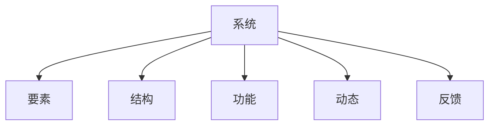
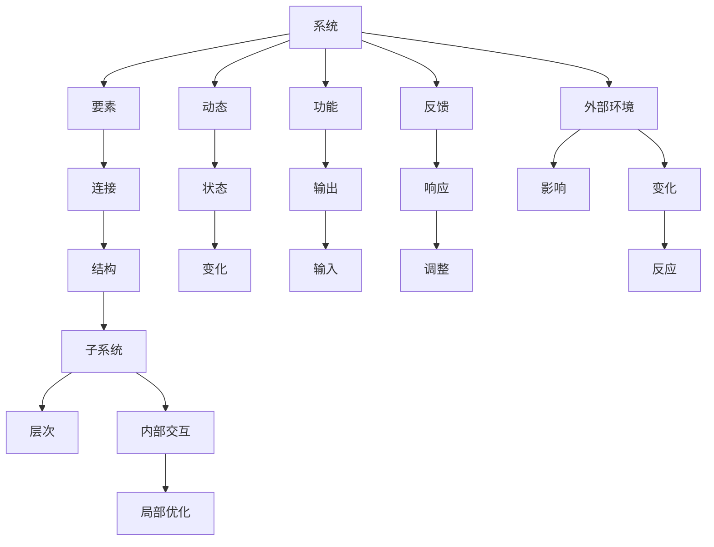

                 

## 1. 背景介绍

在当今复杂的商业环境中，企业面临的挑战日益增加，不确定性和复杂性不断上升。管理者需要具备系统思维能力，能够从整体和全局的角度，对企业的运营、决策和战略进行系统化分析。系统思维不仅是一种方法论，更是一种思维方式，要求管理者能够在复杂问题中识别关键要素，理清因果关系，高效协调各方资源，达成企业目标。

### 1.1 问题由来

复杂系统的特征之一是其非线性、多层次和交互性。管理者面对的诸多问题，如供应链管理、产品创新、市场营销、团队协作等，都是高度动态、非线性的。传统线性思维往往难以处理这种复杂性，容易造成决策失误、资源浪费和风险累积。系统思维的核心理念是通过系统化的视角，从全局和长远的角度，对企业内部和外部的各种因素进行系统分析，从而做出更科学、更有效的决策。

### 1.2 问题核心关键点

系统思维的关键在于以下几个方面：

- **整体视角**：要求管理者以系统的整体为出发点，考虑各部分之间的相互关系和相互作用，避免片面和局部思考。
- **动态思维**：认识到系统是不断变化的，理解变化规律和趋势，预测可能的未来发展。
- **层次结构**：将系统分解为不同的层次，识别关键层级和影响因素，从宏观到微观进行全面分析。
- **反馈机制**：建立系统的反馈机制，监控系统的运行状态，及时调整策略和措施。

### 1.3 问题研究意义

系统思维的应用，对于提升企业管理决策水平、增强企业竞争力具有重要意义：

1. **提升决策质量**：系统思维要求综合考虑多方面因素，能够更好地识别和分析问题的本质，做出科学合理的决策。
2. **优化资源配置**：通过系统视角，管理者能够更合理地分配资源，提高资源使用效率。
3. **增强风险管理**：系统思维能够识别潜在风险和影响因素，提前制定预防和应对策略，减少损失。
4. **促进创新**：系统思维鼓励跨部门、跨职能的合作，为创新提供更广阔的空间。
5. **优化流程和运营**：系统思维能够识别流程中的瓶颈和冗余环节，优化运营流程，提高效率。

## 2. 核心概念与联系

### 2.1 核心概念概述

为更好地理解系统思维在企业管理中的应用，本节将介绍几个核心概念：

- **系统**：由相互关联、相互作用的若干部分组成的有机整体。
- **要素**：构成系统的基本元素，可以是人、物、信息等。
- **结构**：系统的组织形式和层次关系，包括系统的组成部分和相互关系。
- **功能**：系统在内外环境作用下表现出来的各种能力。
- **动态**：系统的变化和发展过程，包括状态变化和过程演变。
- **反馈**：系统内部或外部对系统状态的变化产生响应，通过反馈调整系统行为。

这些概念之间的逻辑关系可以通过以下Mermaid流程图来展示：



这个流程图展示了几大核心概念之间的联系：

1. 系统由若干要素构成。
2. 要素之间通过结构关系组织起来，形成系统。
3. 系统具有特定的功能，能对外界环境做出反应。
4. 系统的状态和功能随时间动态变化。
5. 系统的动态变化受到内部和外部反馈的影响。

### 2.2 核心概念原理和架构的 Mermaid 流程图

以下是系统思维的核心概念原理和架构的Mermaid流程图：



这个流程图展示了系统思维的核心原理和架构：

1. 系统由要素通过连接构成结构。
2. 系统随时间动态变化，产生状态和功能。
3. 系统对外界环境做出反应，产生输入和输出。
4. 系统的反馈机制通过响应和调整来维持稳定。
5. 系统可以分为多个子系统，每个子系统具有特定的结构和功能。
6. 子系统之间存在内部交互，可以优化局部功能。
7. 系统受到外部环境的影响，需要考虑环境变化和反应。

## 3. 核心算法原理 & 具体操作步骤

### 3.1 算法原理概述

系统思维的核心算法原理主要包括以下几个方面：

- **系统建模**：通过系统分析和建模，将复杂问题转化为可管理的模型，便于系统分析和决策。
- **因果分析**：识别系统中各要素之间的因果关系，理解影响系统的关键因素。
- **动态规划**：通过对系统的动态变化进行分析和预测，制定合适的策略和方案。
- **优化算法**：在给定约束条件下，寻找系统的最优解或近似解，提高系统效率和效益。
- **仿真模拟**：通过计算机仿真模拟，验证和优化系统模型，预测系统的可能发展路径。

### 3.2 算法步骤详解

系统思维的应用流程包括以下关键步骤：

1. **问题界定**：明确问题的本质和范围，识别关键要素和子系统。
2. **信息收集**：收集和整理与问题相关的信息，包括历史数据、专家意见等。
3. **系统建模**：建立系统的模型，使用数学、物理或仿真工具进行描述和分析。
4. **因果分析**：识别和分析系统中各要素之间的因果关系，理解影响系统的关键因素。
5. **动态仿真**：使用仿真工具对系统进行动态模拟，预测系统未来的发展趋势。
6. **优化决策**：在仿真结果的基础上，制定优化策略和决策方案。
7. **实施和监控**：实施决策方案，并持续监控系统运行状态，及时调整策略。

### 3.3 算法优缺点

系统思维的优点包括：

- **全面性**：从整体和长远的角度考虑问题，不容易遗漏关键要素和影响因素。
- **预见性**：通过动态分析和仿真模拟，可以预测系统变化趋势，提前制定应对策略。
- **适应性**：系统思维强调动态调整和反馈机制，可以灵活应对外部环境的变化。

缺点包括：

- **复杂性**：系统思维需要综合考虑多方面因素，处理复杂问题时需要较高的专业知识和技能。
- **成本高**：建立和维护系统模型需要较高的成本，特别是在数据获取和仿真模拟方面。
- **难以量化**：许多系统因素难以用数值表示，需要定性分析和评估。

### 3.4 算法应用领域

系统思维广泛应用于企业管理中的多个领域，具体包括：

- **供应链管理**：通过系统思维，优化供应链流程，提高效率和响应速度。
- **产品创新**：系统思维帮助识别市场需求和创新机会，指导产品开发和迭代。
- **市场营销**：系统思维分析市场环境，制定有效的市场策略，提升品牌竞争力。
- **团队协作**：系统思维促进跨部门合作，优化团队沟通和协调，提升整体绩效。
- **风险管理**：系统思维识别潜在风险，制定预防和应对措施，降低损失。
- **组织变革**：系统思维分析组织结构和流程，推动组织变革，提升组织效能。

## 4. 数学模型和公式 & 详细讲解

### 4.1 数学模型构建

系统思维中的数学模型构建，通常涉及以下几个关键步骤：

1. **系统描述**：将系统分解为若干子系统，定义各子系统的结构和功能。
2. **状态方程**：建立系统的状态方程，描述系统随时间变化的关系。
3. **约束条件**：定义系统的约束条件，如预算、资源、时间等。
4. **优化目标**：确定系统的优化目标，如最小化成本、最大化效益等。
5. **求解方法**：选择适合的求解方法，如数值仿真、优化算法等。

### 4.2 公式推导过程

以下以供应链管理为例，展示系统建模和优化公式的推导过程：

假设有一个供应链系统，包含供应商、生产商、分销商和顾客。各实体之间的物流、资金流和信息流相互影响，系统目标是最大化总收益。

1. **系统描述**：将系统分解为供应商、生产商、分销商和顾客四个子系统，定义各子系统的输出和输入。
2. **状态方程**：建立系统的状态方程，描述各子系统的状态变化。
3. **约束条件**：定义系统的约束条件，如库存水平、生产能力、需求量等。
4. **优化目标**：定义系统的优化目标，如总收益最大化。
5. **求解方法**：使用优化算法（如线性规划、动态规划等）求解最优解。

### 4.3 案例分析与讲解

以某电子商务平台的库存管理为例，展示系统思维的实际应用：

- **问题界定**：库存管理涉及产品采购、销售、库存三个子系统。目标是最大化利润，同时保持库存水平在合理范围内。
- **信息收集**：收集历史销售数据、市场预测、供应商报价等信息。
- **系统建模**：建立库存管理的数学模型，包括需求预测、库存量控制、采购计划等。
- **因果分析**：分析各子系统之间的因果关系，识别关键影响因素。
- **动态仿真**：使用仿真工具模拟库存管理系统的动态变化，预测未来的库存水平和利润。
- **优化决策**：根据仿真结果，调整采购和库存策略，优化库存管理。
- **实施和监控**：实施优化后的策略，并持续监控库存水平和利润，及时调整策略。

## 5. 项目实践：代码实例和详细解释说明

### 5.1 开发环境搭建

在进行系统思维的实践之前，我们需要准备好开发环境。以下是使用Python进行系统仿真和优化的环境配置流程：

1. 安装Anaconda：从官网下载并安装Anaconda，用于创建独立的Python环境。

2. 创建并激活虚拟环境：
```bash
conda create -n systemsimulations python=3.8 
conda activate systemsimulations
```

3. 安装必要的Python库：
```bash
conda install numpy scipy pandas sympy scipy statsmodels matplotlib scikit-learn
```

4. 安装PyTorch：用于建立和训练机器学习模型。
```bash
conda install pytorch torchvision torchaudio cudatoolkit=11.1 -c pytorch -c conda-forge
```

5. 安装其他开发工具：
```bash
pip install jupyter notebook ipywidgets tqdm scipy
```

完成上述步骤后，即可在`systemsimulations`环境中开始系统思维的实践。

### 5.2 源代码详细实现

以下是一个简单的系统建模和优化的代码实现：

首先，定义系统中的各要素：

```python
import numpy as np
from sympy import symbols, Eq, solve

# 定义系统要素
supply = symbols('supply')
demand = symbols('demand')
inventory = symbols('inventory')
cost = symbols('cost')
revenue = symbols('revenue')

# 定义系统的状态方程
eq1 = Eq(inventory, supply - demand)
eq2 = Eq(cost, 10 * inventory)
eq3 = Eq(revenue, 100 * inventory)

# 定义系统的优化目标
objective = Eq(revenue - cost, 0)

# 求解系统最优解
solution = solve([eq1, eq2, eq3, objective], [supply, demand, inventory, cost, revenue])
solution
```

然后，进行动态仿真和优化：

```python
# 使用scipy库进行动态仿真
from scipy.integrate import solve_ivp

# 定义系统动态方程
def system_dynamics(t, y):
    supply, demand, inventory, cost, revenue = y
    new_supply = supply + 10
    new_demand = demand + 5
    new_inventory = inventory + 1
    new_cost = cost + 2
    new_revenue = revenue + 20
    return [new_supply, new_demand, new_inventory, new_cost, new_revenue]

# 初始状态
initial_state = [0, 0, 0, 0, 0]

# 时间范围
tspan = (0, 100)

# 求解动态仿真
solution = solve_ivp(system_dynamics, tspan, initial_state, method='RK45')

# 输出系统状态变化
solution.sol()
```

最后，进行系统的优化决策：

```python
# 使用scipy库进行优化求解
from scipy.optimize import minimize

# 定义优化目标函数
def objective_function(x):
    inventory = x[0]
    cost = 10 * inventory
    revenue = 100 * inventory
    return revenue - cost

# 约束条件
constraints = [{'type': 'eq', 'fun': lambda x: 100 - x[0]}, {'type': 'ineq', 'fun': lambda x: 0 - x[0]}]

# 求解优化问题
result = minimize(objective_function, [50], constraints=constraints)
result.x
```

### 5.3 代码解读与分析

让我们再详细解读一下关键代码的实现细节：

**变量定义**：
- `supply`、`demand`、`inventory`、`cost`、`revenue`：表示供应链系统中的各要素。
- `eq1`、`eq2`、`eq3`：定义系统状态方程。
- `objective`：定义优化目标。

**求解系统最优解**：
- 使用Sympy库中的`solve`函数，求解方程组得到系统的最优解。

**动态仿真**：
- 使用SciPy库中的`solve_ivp`函数，进行系统动态仿真，输出系统状态变化。
- `system_dynamics`函数定义了系统动态方程。
- `initial_state`定义了仿真初始状态。
- `tspan`定义了时间范围。

**优化决策**：
- 使用SciPy库中的`minimize`函数，进行系统优化求解。
- `objective_function`定义了优化目标函数。
- `constraints`定义了系统的约束条件。
- `result`变量保存优化结果。

## 6. 实际应用场景

### 6.1 智能制造系统

智能制造系统是系统思维在企业信息化和自动化转型中的典型应用。通过系统思维，制造企业可以实现生产过程的优化和智能化管理，提高生产效率和产品质量。

具体而言，系统思维在智能制造中的应用包括：

- **设备管理**：通过系统思维优化设备布局和调度，提高生产效率。
- **库存管理**：系统思维优化库存控制策略，降低库存成本，提升供应链响应速度。
- **质量控制**：系统思维分析生产过程中的质量问题，提高产品质量和一致性。
- **预测性维护**：系统思维预测设备故障，提前进行维护，减少停机时间和损失。
- **能源管理**：系统思维优化能源使用，提高能源利用效率，降低生产成本。

### 6.2 智慧城市建设

智慧城市建设需要系统思维的支撑，通过系统思维，可以构建高效、智能、可持续的城市管理和服务体系。

具体而言，系统思维在智慧城市中的应用包括：

- **交通管理**：通过系统思维优化交通信号和路线，提高交通效率，减少拥堵。
- **公共安全**：系统思维分析城市安全问题，制定应急预案，提高城市安全性。
- **环境保护**：系统思维优化能源和资源使用，降低环境污染，实现绿色发展。
- **城市治理**：系统思维分析城市运行状态，制定治理策略，提升城市管理效能。
- **智能设施**：系统思维优化智能设施的布局和功能，提高市民生活体验。

### 6.3 金融风险管理

金融风险管理是系统思维在金融领域的重要应用。系统思维通过综合分析金融市场和内部因素，制定科学的风险管理策略。

具体而言，系统思维在金融风险管理中的应用包括：

- **市场预测**：系统思维分析市场数据，预测市场趋势，制定投资策略。
- **风险评估**：系统思维评估金融产品的风险，制定风险控制措施。
- **信贷评估**：系统思维分析借款人的财务状况，评估信贷风险。
- **组合优化**：系统思维优化金融组合，降低投资风险，提高收益。
- **反欺诈检测**：系统思维分析交易数据，识别欺诈行为，保障金融安全。

## 7. 工具和资源推荐

### 7.1 学习资源推荐

为了帮助读者系统掌握系统思维的理论基础和实践技巧，以下是几本推荐的学习资源：

1. **《系统思维导论》**：介绍系统思维的基本概念、方法和工具，适合入门学习。
2. **《复杂系统思维与管理》**：深入探讨复杂系统的基本原理和系统思维的应用，适合进阶学习。
3. **《系统思考的艺术》**：通过具体案例展示系统思维的实际应用，适合实践学习。
4. **《系统动力学基础》**：讲解系统动态学的基本原理和应用，适合理工科学生学习。
5. **Coursera系统思维课程**：由加州大学柏克莱分校开设的系统思维在线课程，涵盖系统思维的各个方面。

通过这些资源的学习，相信读者可以深入理解系统思维的理论基础和实际应用，掌握系统思维的精髓。

### 7.2 开发工具推荐

高效的系统思维实践离不开优秀的工具支持。以下是几款用于系统思维开发和优化的常用工具：

1. **Python**：开源的编程语言，支持科学计算和数据分析，广泛应用于系统建模和优化。
2. **SciPy**：基于NumPy库的科学计算库，提供丰富的优化和统计分析工具。
3. **Sympy**：符号计算库，支持符号方程求解和优化。
4. **Gurobi**：优化的商业库，支持线性规划、非线性规划等高级优化算法。
5. **MATLAB**：数学软件，提供强大的数值仿真和优化工具，适用于复杂的系统建模。
6. **Simulink**：MATLAB的工具箱，支持系统仿真和建模。

合理利用这些工具，可以显著提升系统思维的开发效率，加快创新迭代的步伐。

### 7.3 相关论文推荐

系统思维的研究涉及多个领域，以下是几篇具有代表性的相关论文，推荐阅读：

1. **"Complex Adaptive Systems: An Introduction to Computational Models of Social Life"**：提出了复杂适应系统的概念，探讨了复杂系统在社会中的应用。
2. **"Systems Thinking and Systems Analysis"**：系统地介绍了系统分析的基本方法和工具，提供了丰富的案例分析。
3. **"System Dynamics: A Handbook for Research, Modeling, Simulation, and Policy Analysis"**：介绍了系统动力学的基础理论和应用方法，适合系统建模和仿真。
4. **"Modeling and Simulation of Complex Systems"**：探讨了复杂系统的建模和仿真方法，提供了多种建模工具和案例。
5. **"Systems Thinking in Health Care: Understanding and Implementing Systems Thinking"**：介绍系统思维在医疗领域的应用，提供了实用的案例和方法。

这些论文代表了大系统思维的发展脉络。通过学习这些前沿成果，可以深入理解系统思维的理论和应用，激发更多的创新灵感。

## 8. 总结：未来发展趋势与挑战

### 8.1 总结

本文对系统思维在企业管理中的应用进行了全面系统的介绍。首先阐述了系统思维的研究背景和意义，明确了系统思维在企业管理决策中的独特价值。其次，从原理到实践，详细讲解了系统思维的数学模型和核心算法，给出了系统思维任务开发的完整代码实例。同时，本文还广泛探讨了系统思维在智能制造、智慧城市、金融风险管理等多个行业领域的应用前景，展示了系统思维范式的巨大潜力。此外，本文精选了系统思维技术的各类学习资源，力求为读者提供全方位的技术指引。

通过本文的系统梳理，可以看到，系统思维的应用对于提升企业管理决策水平、增强企业竞争力具有重要意义。系统思维要求企业管理者从整体和长远的角度，对企业的运营、决策和战略进行系统化分析，从而做出更科学、更有效的决策。系统思维的全面性和预见性，能够帮助企业在复杂多变的环境中保持竞争优势。

### 8.2 未来发展趋势

展望未来，系统思维的应用将呈现以下几个发展趋势：

1. **智能化**：随着人工智能技术的不断发展，系统思维将越来越多地与AI技术融合，实现更加智能化的系统管理。
2. **自适应**：系统思维将能够根据外部环境的变化，自动调整策略和决策，实现动态优化。
3. **协作化**：系统思维将促进跨部门、跨职能的协作，优化组织结构和流程，提升整体绩效。
4. **数据化**：系统思维将更多地依赖数据驱动决策，通过大数据和AI技术，提升决策的准确性和效率。
5. **可视化**：系统思维将利用可视化工具，直观展示系统状态和优化结果，提高决策的可操作性。
6. **多学科融合**：系统思维将与其他学科（如心理学、社会学、经济学等）进行融合，提供更加全面、深入的解决方案。

以上趋势凸显了系统思维的广阔前景。这些方向的探索发展，必将进一步提升系统思维在企业管理中的应用水平，为构建智能化、高效、适应性强的企业管理体系提供新的思路。

### 8.3 面临的挑战

尽管系统思维在企业管理中已经取得了显著成果，但在迈向更加智能化、普适化应用的过程中，它仍面临着诸多挑战：

1. **复杂性**：系统思维要求综合考虑多方面因素，处理复杂问题时需要较高的专业知识和技能。
2. **数据质量**：系统思维依赖高质量的数据驱动决策，数据获取和处理成本较高。
3. **多学科融合**：系统思维需要与其他学科进行深度融合，难度较大。
4. **实施难度**：系统思维的实施需要跨部门、跨职能的协作，协调难度较大。
5. **技术依赖**：系统思维的应用依赖于高级工具和软件，技术门槛较高。
6. **文化差异**：系统思维的实施需要企业文化和管理理念的变革，难以快速推行。

正视系统思维面临的这些挑战，积极应对并寻求突破，将使系统思维在企业管理中发挥更大的作用。相信随着学界和产业界的共同努力，这些挑战终将一一被克服，系统思维必将在构建智能、高效、适应性强的企业管理体系中扮演越来越重要的角色。

### 8.4 研究展望

未来的研究需要在以下几个方面寻求新的突破：

1. **多目标优化**：系统思维需要在多个目标之间进行权衡和优化，开发多目标优化算法，提升系统决策的全面性和均衡性。
2. **模型自动化**：开发模型自动化的工具，降低模型建立和优化的门槛，提高系统的可操作性和可扩展性。
3. **跨学科融合**：推动系统思维与其他学科的深度融合，开发跨学科的解决方案，提供更加全面、深入的洞察。
4. **数据驱动决策**：加强大数据和AI技术在系统思维中的应用，提升数据获取、处理和分析的能力，提高决策的准确性和效率。
5. **可视化分析**：开发可视化工具，直观展示系统状态和优化结果，增强决策的可操作性和直观性。
6. **适应性优化**：开发适应性优化算法，使系统能够根据外部环境的变化自动调整策略，保持系统的动态优化。

这些研究方向的探索，必将引领系统思维技术迈向更高的台阶，为构建智能、高效、适应性强的企业管理体系提供新的思路。面向未来，系统思维还需要与其他人工智能技术进行更深入的融合，如知识表示、因果推理、强化学习等，多路径协同发力，共同推动系统思维技术的发展。

## 9. 附录：常见问题与解答

**Q1：系统思维与传统管理思维有何区别？**

A: 系统思维与传统管理思维的区别在于其全局和整体视角。系统思维强调系统内部各要素之间的相互关系和影响，而传统管理思维则更多地关注局部和短期利益。系统思维能够帮助管理者从整体和长远的角度进行决策，避免局部优化导致的系统失效。

**Q2：系统思维在企业管理中的应用有哪些具体方法？**

A: 系统思维在企业管理中的应用方法包括：

1. **系统建模**：建立系统的数学模型，描述系统的行为和特征。
2. **因果分析**：识别系统中的因果关系，理解影响系统的关键因素。
3. **动态仿真**：使用仿真工具对系统进行动态模拟，预测系统未来的发展趋势。
4. **优化决策**：在仿真结果的基础上，制定优化策略和决策方案。
5. **实施和监控**：实施优化后的策略，并持续监控系统运行状态，及时调整策略。

**Q3：系统思维在实施过程中需要注意哪些问题？**

A: 系统思维在实施过程中需要注意以下几个问题：

1. **跨部门协作**：系统思维的实施需要跨部门、跨职能的协作，协调难度较大。
2. **数据质量**：系统思维依赖高质量的数据驱动决策，数据获取和处理成本较高。
3. **技术门槛**：系统思维的应用依赖于高级工具和软件，技术门槛较高。
4. **文化变革**：系统思维的实施需要企业文化和管理理念的变革，难以快速推行。
5. **实施难度**：系统思维的实施需要跨部门、跨职能的协作，协调难度较大。

**Q4：系统思维在企业中的应用案例有哪些？**

A: 系统思维在企业中的应用案例包括：

1. **供应链管理**：通过系统思维优化供应链流程，提高效率和响应速度。
2. **智能制造**：通过系统思维优化生产过程和设备管理，提高生产效率和产品质量。
3. **智慧城市**：通过系统思维优化交通、公共安全和环境保护，提高城市管理效能。
4. **金融风险管理**：通过系统思维分析市场数据和内部因素，制定科学的风险管理策略。
5. **市场营销**：通过系统思维分析市场需求和创新机会，指导产品开发和迭代。
6. **团队协作**：通过系统思维促进跨部门合作，优化团队沟通和协调，提升整体绩效。

通过这些案例，可以看到系统思维在企业管理中的广泛应用，为企业管理提供科学、系统、高效的决策支持。

---

作者：禅与计算机程序设计艺术 / Zen and the Art of Computer Programming

