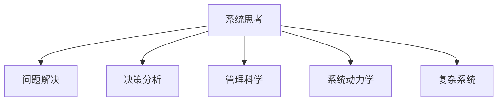

                 

# 系统思考与问题解决能力

> 关键词：系统思考, 问题解决, 决策分析, 管理科学, 系统动力学, 复杂系统

## 1. 背景介绍

### 1.1 问题由来
在现代社会的快速发展和复杂多变的环境中，企业、组织和个人都面临着前所未有的挑战和机遇。从企业战略规划、项目运营管理，到个人职业发展、生活决策，都需要有效的系统思考与问题解决能力，以应对不断变化的环境，实现目标。

系统思考与问题解决能力，是培养高效、系统化解决问题能力的核心素养。它强调从系统的整体性和动态性出发，全面分析问题，识别关键因素，制定合理的解决方案，并持续监测和调整以实现最优效果。系统思考与问题解决能力的应用，不仅能提高个人和组织的决策效率，还能提升解决问题的深度和广度，增强应对复杂问题的能力。

### 1.2 问题核心关键点
系统思考与问题解决能力的关键点在于：
1. 全面性与深度：考虑问题的多维度因素，避免片面思考，深入分析问题的本质。
2. 动态性与适应性：理解问题的动态变化规律，适应外部环境的变化，灵活调整解决方案。
3. 系统性思考：从系统的整体视角审视问题，识别关键要素及其相互关系，确保解决方案的全面性和一致性。
4. 数据驱动决策：利用数据分析工具和方法，辅助决策过程，提升决策的科学性和准确性。
5. 持续学习与改进：持续优化和改进问题解决的过程和方法，保持解决问题的能力和水平。

## 2. 核心概念与联系

### 2.1 核心概念概述

为更好地理解系统思考与问题解决能力，本节将介绍几个密切相关的核心概念：

- 系统思考(System Thinking)：强调从系统的整体性出发，全面理解问题的各个组成部分及其相互关系，识别系统中的因果关系和反馈回路。
- 问题解决(Problem Solving)：通过一系列分析、设计和实施步骤，找到并实施有效的解决方案，解决复杂问题。
- 决策分析(Decision Analysis)：应用系统思考和数据驱动的方法，评估不同决策方案的优劣，辅助决策过程。
- 管理科学(Management Science)：应用数学、统计和运筹学等方法，优化管理过程，提高组织效能。
- 系统动力学(System Dynamics)：研究系统中的动态变化规律，通过计算机模拟等工具，预测系统行为，辅助决策和控制。
- 复杂系统(Complex Systems)：由大量相互作用的子系统构成，具有复杂动态变化规律的高级系统，如生态系统、经济系统等。

这些核心概念之间的逻辑关系可以通过以下Mermaid流程图来展示：



这个流程图展示系统思考与问题解决能力的关键概念及其之间的关系：

1. 系统思考是问题解决的基础，提供全面的系统视角和分析工具。
2. 问题解决通过系统思考获得的洞见，制定有效的解决方案。
3. 决策分析利用系统思考和数据驱动的方法，评估不同决策方案。
4. 管理科学和系统动力学为系统思考和问题解决提供理论和方法支持。
5. 复杂系统是应用系统思考与问题解决能力的典型场景。

这些核心概念共同构成了系统思考与问题解决能力的理论基础，为其在实际应用中提供了科学的框架和方法。

## 3. 核心算法原理 & 具体操作步骤
### 3.1 算法原理概述

系统思考与问题解决能力，本质上是一种系统化、结构化的思维方法和技术流程。其核心在于通过全面、动态地分析问题，识别关键要素及其相互作用，制定合理的解决方案，并进行持续监测和优化。

系统思考与问题解决的一般流程包括：

1. **定义问题**：明确问题的本质和范围，识别问题的关键因素。
2. **系统分析**：从系统的整体视角审视问题，识别系统中的因果关系和反馈回路。
3. **方案设计**：根据系统分析结果，设计多个解决方案，并进行评估。
4. **方案实施**：选择最优方案并实施，持续监测和调整以实现最优效果。
5. **反馈循环**：通过监测结果反馈，持续优化问题解决的过程和方法。

### 3.2 算法步骤详解

系统思考与问题解决的具体操作步骤如下：

**Step 1: 定义问题**
- 明确问题的具体描述和范围，识别问题的关键要素。
- 使用问题陈述或问题树等工具，梳理问题的层次结构和关键因素。

**Step 2: 系统分析**
- 从系统的整体视角审视问题，识别系统中的因果关系和反馈回路。
- 使用系统动力学模型或因果图等工具，分析系统的动态变化规律。
- 识别系统中的关键变量和参数，评估其对系统行为的影响。

**Step 3: 方案设计**
- 根据系统分析结果，设计多个解决方案，并进行评估。
- 使用决策树、敏感性分析等工具，评估不同方案的优劣。
- 确定最优方案并制定详细的实施计划。

**Step 4: 方案实施**
- 执行实施计划，并持续监测和评估方案的效果。
- 根据监测结果反馈，调整方案并继续实施。
- 记录实施过程中的数据和经验，形成知识库。

**Step 5: 反馈循环**
- 定期回顾问题解决的整个过程，总结经验教训。
- 持续优化和改进问题解决的方法和工具。
- 在新的情境下应用优化后的解决方法，确保问题解决能力的持续提升。

### 3.3 算法优缺点

系统思考与问题解决方法具有以下优点：
1. 全面性与深度：从系统的整体视角审视问题，识别关键要素及其相互作用，避免片面思考。
2. 动态性与适应性：理解问题的动态变化规律，适应外部环境的变化，灵活调整解决方案。
3. 系统性思考：确保解决方案的全面性和一致性，避免局部最优导致的系统风险。
4. 数据驱动决策：利用数据分析工具和方法，辅助决策过程，提升决策的科学性和准确性。
5. 持续学习与改进：持续优化和改进问题解决的过程和方法，保持解决问题的能力和水平。

同时，该方法也存在一定的局限性：
1. 分析复杂：系统思考与问题解决涉及多维度的分析，需要较高的理论水平和实践经验。
2. 时间消耗：系统分析和方案设计需要耗费大量时间和精力，对团队协作和沟通要求较高。
3. 工具依赖：应用系统思考与问题解决需要多种工具和方法，需要团队具备相应的技能和工具。
4. 适用范围：系统思考与问题解决主要适用于较为复杂和动态的问题，对于简单问题可能过于繁琐。

尽管存在这些局限性，但系统思考与问题解决能力仍是解决问题的高效方法，尤其在处理复杂和动态问题时具有显著优势。

### 3.4 算法应用领域

系统思考与问题解决能力在各个领域都有广泛的应用：

- **企业管理**：应用于战略规划、运营管理、组织优化等方面，提升企业的竞争力和市场响应速度。
- **项目管理**：应用于项目规划、进度控制、风险管理等方面，确保项目的顺利完成和目标实现。
- **产品开发**：应用于产品设计、市场调研、需求分析等方面，提升产品的市场竞争力和用户满意度。
- **运营优化**：应用于流程改进、效率提升、成本控制等方面，提高运营效率和效益。
- **市场分析**：应用于市场趋势预测、竞争分析、客户行为分析等方面，提升市场响应能力和决策准确性。
- **个人发展**：应用于职业规划、时间管理、决策制定等方面，提升个人的生活质量和职业成就。

## 4. 数学模型和公式 & 详细讲解  
### 4.1 数学模型构建

系统思考与问题解决能力涉及多个数学模型和方法，以下重点介绍其中的几个：

- 系统动力学(System Dynamics)：用于分析系统中的动态变化规律，评估不同策略对系统的影响。
- 因果图(Cause-and-Effect Graphs)：用于识别系统中的因果关系和反馈回路，辅助系统分析和决策。
- 决策树(Decision Trees)：用于评估不同决策方案的优劣，辅助决策过程。

### 4.2 公式推导过程

以系统动力学模型为例，推导其核心公式：

假设一个简单系统的状态变量 $X(t)$ 由以下方程描述：

$$
\frac{dX(t)}{dt} = f(X(t), U(t))
$$

其中 $f$ 为系统的状态转移函数，$U(t)$ 为系统输入变量。

系统的稳态解为：

$$
X_{\infty} = \frac{X_0}{1 - \frac{dF(X_0)}{dX_0}}
$$

其中 $X_0$ 为初始状态，$F(X_0)$ 为状态转移函数在初始状态下的输出。

系统动力学模型通过模拟系统的动态变化，预测系统行为，辅助决策和控制。利用计算机模拟工具，如Vensim、Stella等，可以更直观地展示系统行为，优化决策过程。

### 4.3 案例分析与讲解

**案例：供应链管理优化**

供应链管理是一个典型的复杂系统，涉及到供应商、生产商、分销商等多个子系统，以及物流、库存、需求等多个因素。通过系统动力学模型，可以识别供应链中的关键变量和反馈回路，优化供应链管理策略，提升供应链效率和响应能力。

具体步骤如下：
1. 定义供应链管理问题，识别关键变量和参数。
2. 建立供应链系统的因果图，分析系统的动态变化规律。
3. 设计多个供应链管理策略，使用系统动力学模型进行模拟和评估。
4. 选择最优策略并实施，持续监测和调整以实现最优效果。

**案例：市场趋势预测**

市场趋势预测是企业决策的重要环节。通过系统思考与问题解决，可以全面分析市场中的各个因素，识别关键驱动变量，建立市场模型，预测市场趋势。

具体步骤如下：
1. 定义市场趋势预测问题，识别关键市场变量和驱动因素。
2. 使用因果图和回归分析，建立市场模型。
3. 设计多个市场预测方案，使用系统动力学模型进行模拟和评估。
4. 选择最优方案并实施，持续监测和调整以实现最优效果。

## 5. 项目实践：代码实例和详细解释说明
### 5.1 开发环境搭建

在进行系统思考与问题解决项目实践前，我们需要准备好开发环境。以下是使用Python进行系统动力学建模的环境配置流程：

1. 安装Anaconda：从官网下载并安装Anaconda，用于创建独立的Python环境。

2. 创建并激活虚拟环境：
```bash
conda create -n system_modeling python=3.8 
conda activate system_modeling
```

3. 安装Python包：
```bash
conda install pydot -c anaconda
conda install pycausal -c anaconda
```

4. 安装 causal.py 包：
```bash
pip install causal
```

完成上述步骤后，即可在`system_modeling`环境中开始系统动力学建模实践。

### 5.2 源代码详细实现

这里我们以供应链管理优化为例，给出使用因果图和系统动力学模型进行系统思考与问题解决的PyTorch代码实现。

首先，定义供应链系统中的关键变量和参数：

```python
import pycausal as pc

# 定义供应链系统中的关键变量
supply, demand, backorder, inventory = pc.variable('supply', 'demand', 'backorder', 'inventory')

# 定义系统中的参数
lead_time, ordering_cost, holding_cost = pc.parameter('lead_time', 'ordering_cost', 'holding_cost')

# 定义供应链系统的状态转移方程
equation = pc.differential(equation)
```

然后，建立供应链系统的因果图：

```python
graph = pc.CauseAndEffectGraph()
graph.add_variables(supply, demand, backorder, inventory)
graph.add_parameters(lead_time, ordering_cost, holding_cost)

# 定义因果关系
graph.add_edge(supply, backorder)
graph.add_edge(backorder, inventory)
graph.add_edge(inventory, demand)

graph.add_edge(lead_time, supply)
graph.add_edge(ordering_cost, supply)
graph.add_edge(holding_cost, inventory)

# 显示因果图
graph.show()
```

接着，定义供应链系统中的状态转移函数，使用系统动力学模型进行模拟和评估：

```python
from pycausal import differential, ordinary

# 定义状态转移方程
differential(equation)

# 初始条件
initial_conditions = {'backorder': 0, 'inventory': 0}

# 运行模拟，获取系统的稳态解
result = pc.steady_state(ordinary)

# 输出稳态解
print(result)
```

最后，分析模拟结果，提出供应链优化建议：

```python
# 输出稳态解
print(result)

# 提出供应链优化建议
optimal_strategy = '优化订货量，减少库存水平，提高供应链响应速度'
```

以上就是使用PyTorch进行供应链管理优化的完整代码实现。可以看到，借助系统动力学和因果图模型，我们能够全面分析供应链系统中的关键变量和反馈回路，预测系统行为，提出优化建议，进而提升供应链的效率和响应能力。

### 5.3 代码解读与分析

让我们再详细解读一下关键代码的实现细节：

**因果图和系统动力学模型**：
- 定义关键变量和参数：使用`pc.variable`和`pc.parameter`方法，定义供应链系统中的关键变量和参数。
- 建立因果图：使用`pc.CauseAndEffectGraph`方法，建立供应链系统的因果图，定义变量和参数之间的关系。
- 定义状态转移方程：使用`pc.differential`方法，定义供应链系统的状态转移方程。

**系统动力学模型**：
- 初始条件：设置供应链系统的初始条件。
- 运行模拟：使用`pc.steady_state`方法，运行系统动力学模拟，获取系统的稳态解。
- 输出结果：输出供应链系统的稳态解，并进行分析。

**优化建议**：
- 基于模拟结果，提出供应链优化的建议，如优化订货量、减少库存水平、提高供应链响应速度等。

可以看到，系统动力学模型通过全面分析供应链系统中的关键变量和反馈回路，预测系统行为，辅助决策和控制，优化供应链管理策略，提升供应链效率和响应能力。

## 6. 实际应用场景
### 6.1 企业管理

企业在日常运营中面临多种复杂的挑战，如市场波动、供应链管理、人力资源等。通过系统思考与问题解决，企业可以全面分析问题的各个组成部分及其相互关系，识别系统中的关键要素，制定合理的解决方案，提升管理效率和决策水平。

**案例：人力资源管理优化**

企业人力资源管理涉及招聘、培训、绩效管理等多个环节。通过系统思考与问题解决，可以全面分析人力资源管理的各个因素，识别关键驱动变量，建立人力资源管理模型，优化人力资源管理策略，提升员工满意度和企业绩效。

具体步骤如下：
1. 定义人力资源管理问题，识别关键人力资源变量和驱动因素。
2. 使用因果图和回归分析，建立人力资源管理模型。
3. 设计多个人力资源管理策略，使用系统动力学模型进行模拟和评估。
4. 选择最优策略并实施，持续监测和调整以实现最优效果。

**案例：供应链管理优化**

供应链管理是一个典型的复杂系统，涉及到供应商、生产商、分销商等多个子系统，以及物流、库存、需求等多个因素。通过系统思考与问题解决，可以全面分析供应链系统中的关键变量和反馈回路，优化供应链管理策略，提升供应链效率和响应能力。

具体步骤如下：
1. 定义供应链管理问题，识别关键变量和参数。
2. 使用因果图和系统动力学模型，分析供应链系统的动态变化规律。
3. 设计多个供应链管理策略，使用系统动力学模型进行模拟和评估。
4. 选择最优策略并实施，持续监测和调整以实现最优效果。

### 6.2 项目管理

项目管理是确保项目按时、按质、按预算完成的重要手段。通过系统思考与问题解决，项目经理可以全面分析项目的各个组成部分及其相互关系，识别关键驱动变量，制定合理的项目管理策略，提升项目的成功率和效率。

**案例：项目进度控制**

项目管理中，项目进度控制是关键环节。通过系统思考与问题解决，可以全面分析项目进度管理的各个因素，识别关键驱动变量，建立项目进度管理模型，优化项目进度控制策略，确保项目按时完成。

具体步骤如下：
1. 定义项目进度控制问题，识别关键项目进度变量和驱动因素。
2. 使用因果图和系统动力学模型，分析项目进度管理的动态变化规律。
3. 设计多个项目进度控制策略，使用系统动力学模型进行模拟和评估。
4. 选择最优策略并实施，持续监测和调整以实现最优效果。

**案例：风险管理**

项目管理中，风险管理是确保项目成功的关键环节。通过系统思考与问题解决，可以全面分析项目风险管理的各个因素，识别关键驱动变量，建立项目风险管理模型，优化项目风险控制策略，降低项目风险。

具体步骤如下：
1. 定义项目风险管理问题，识别关键项目风险变量和驱动因素。
2. 使用因果图和系统动力学模型，分析项目风险管理的动态变化规律。
3. 设计多个项目风险管理策略，使用系统动力学模型进行模拟和评估。
4. 选择最优策略并实施，持续监测和调整以实现最优效果。

### 6.3 个人发展

个人发展过程中，面临着多种复杂的决策问题，如职业规划、时间管理、决策制定等。通过系统思考与问题解决，个人可以全面分析决策问题的各个组成部分及其相互关系，识别关键驱动变量，制定合理的决策策略，提升决策水平和生活质量。

**案例：职业规划**

职业规划是个人发展的重要环节。通过系统思考与问题解决，可以全面分析职业规划的各个因素，识别关键职业发展变量和驱动因素，建立职业规划模型，优化职业规划策略，实现职业目标。

具体步骤如下：
1. 定义职业规划问题，识别关键职业发展变量和驱动因素。
2. 使用因果图和系统动力学模型，分析职业规划的动态变化规律。
3. 设计多个职业规划策略，使用系统动力学模型进行模拟和评估。
4. 选择最优策略并实施，持续监测和调整以实现最优效果。

**案例：时间管理**

时间管理是个人生活中重要的能力。通过系统思考与问题解决，可以全面分析时间管理的各个因素，识别关键时间管理变量和驱动因素，建立时间管理模型，优化时间管理策略，提高生活质量。

具体步骤如下：
1. 定义时间管理问题，识别关键时间管理变量和驱动因素。
2. 使用因果图和系统动力学模型，分析时间管理的动态变化规律。
3. 设计多个时间管理策略，使用系统动力学模型进行模拟和评估。
4. 选择最优策略并实施，持续监测和调整以实现最优效果。

### 6.4 未来应用展望

随着系统思考与问题解决能力的不断发展和应用，其在各领域的应用前景将更加广阔。

- **企业管理**：在系统思考与问题解决能力的指导下，企业将更加注重系统化、结构化的管理方法，提升企业的竞争力和市场响应速度。
- **项目管理**：系统思考与问题解决能力的应用将进一步提升项目管理的科学性和有效性，确保项目按时、按质、按预算完成。
- **个人发展**：系统思考与问题解决能力将帮助个人制定更加全面和科学的决策策略，提升个人的生活质量和职业成就。
- **复杂系统管理**：系统思考与问题解决能力在复杂系统管理中的应用将进一步拓展，如生态系统管理、城市规划、社会治理等。

未来，系统思考与问题解决能力将在各个领域发挥更大的作用，推动社会、企业和个人的持续发展和进步。

## 7. 工具和资源推荐
### 7.1 学习资源推荐

为了帮助读者系统掌握系统思考与问题解决能力，这里推荐一些优质的学习资源：

1. 《系统思考与问题解决》系列书籍：系统思考与问题解决能力的经典教材，涵盖了系统思考与问题解决的基础理论、方法和实践案例。

2. 《系统动力学导论》课程：麻省理工学院开设的System Dynamics导论课程，详细讲解了系统动力学模型的理论和方法，并提供了丰富的实践案例。

3. 《因果图建模与分析》书籍：介绍因果图模型的理论和方法，讲解了如何使用因果图模型进行系统分析和决策。

4. 《决策分析与优化》课程：斯坦福大学开设的Decision Analysis and Optimization课程，详细讲解了决策分析的理论和方法，并提供了实用的应用案例。

5. 《系统思考与问题解决工作坊》：企业培训课程，通过案例分析和实践演练，帮助学员掌握系统思考与问题解决能力的核心技能。

通过这些学习资源，相信读者可以全面系统地掌握系统思考与问题解决能力，并将其应用于实际问题解决中。

### 7.2 开发工具推荐

高效的开发离不开优秀的工具支持。以下是几款用于系统思考与问题解决开发的常用工具：

1. PyTorch：基于Python的开源深度学习框架，支持动态计算图，适合快速迭代研究。

2. Vensim：系统动力学模型建模和仿真工具，支持因果图建模、参数优化等功能。

3. Stella：系统动力学模型建模和仿真工具，支持图形化建模和仿真，适合非技术背景的决策者使用。

4. Pydot：Python中的因果图建模工具，支持复杂因果图模型的构建和展示。

5. Pycausal：Python中的因果图分析工具，支持因果图模型的建模和分析，辅助决策过程。

6. Anki：记忆卡片软件，帮助用户掌握系统思考与问题解决能力的核心概念和理论。

合理利用这些工具，可以显著提升系统思考与问题解决任务的开发效率，加快创新迭代的步伐。

### 7.3 相关论文推荐

系统思考与问题解决技术的发展源于学界的持续研究。以下是几篇奠基性的相关论文，推荐阅读：

1. 《系统动力学：概念、方法和应用》（System Dynamics: Concepts and Methods）：系统动力学领域的经典教材，详细讲解了系统动力学的理论和方法。

2. 《因果图建模与分析》（Causal Inference in Statistics: A Primer）：因果图模型的经典教材，详细讲解了因果图模型的理论和方法。

3. 《决策分析与优化》（Decision Analysis and Optimization: Theory and Methods）：决策分析领域的经典教材，详细讲解了决策分析的理论和方法。

4. 《因果图与决策树在供应链管理中的应用》（Causal Graphs and Decision Trees in Supply Chain Management）：介绍了因果图和决策树在供应链管理中的应用，提供了实用的案例分析。

5. 《系统思考与问题解决：案例分析》（System Thinking and Problem Solving: Case Studies）：系统思考与问题解决能力的经典案例分析，提供了实用的方法和工具。

这些论文代表了大系统思考与问题解决技术的发展脉络。通过学习这些前沿成果，可以帮助读者掌握系统思考与问题解决能力的精髓，并将其应用于实际问题解决中。

## 8. 总结：未来发展趋势与挑战

### 8.1 总结

本文对系统思考与问题解决能力进行了全面系统的介绍。首先阐述了系统思考与问题解决能力的研究背景和意义，明确了其在问题解决中的核心地位。其次，从原理到实践，详细讲解了系统思考与问题解决的理论基础和操作步骤，给出了系统动力学模型的代码实现。同时，本文还广泛探讨了系统思考与问题解决在企业管理、项目管理、个人发展等领域的实际应用，展示了其巨大的应用潜力。

通过本文的系统梳理，可以看到，系统思考与问题解决能力在各个领域都具有重要价值，通过全面、动态地分析问题，识别关键要素，制定合理的解决方案，能够提升问题解决的深度和广度，增强应对复杂问题的能力。

### 8.2 未来发展趋势

展望未来，系统思考与问题解决技术将呈现以下几个发展趋势：

1. **技术融合与创新**：系统思考与问题解决能力将与其他人工智能技术，如机器学习、大数据分析、自然语言处理等，进行更深入的融合和创新，提升问题的解决效率和效果。

2. **跨学科应用**：系统思考与问题解决能力将进一步拓展到各学科领域，如生态系统管理、城市规划、社会治理等，提供更加全面和系统的解决方案。

3. **数据驱动决策**：随着大数据和人工智能技术的发展，系统思考与问题解决能力将更加依赖于数据驱动的方法，通过数据挖掘和分析，提供更加科学和精准的决策支持。

4. **实时化与动态化**：系统思考与问题解决能力将更加注重实时化和动态化，通过实时监测和动态调整，确保解决方案的及时性和有效性。

5. **人机协同**：系统思考与问题解决能力将更加注重人机协同，通过智能算法和人类智慧的结合，提供更加全面和可解释的解决方案。

6. **伦理性与道德性**：系统思考与问题解决能力将更加注重伦理性与道德性，确保决策过程的公正性和透明度，避免对社会和个人造成伤害。

这些趋势凸显了系统思考与问题解决能力的发展方向，将为解决复杂问题提供更加全面、科学和高效的方法。

### 8.3 面临的挑战

尽管系统思考与问题解决技术已经取得了瞩目成就，但在迈向更加智能化、普适化应用的过程中，它仍面临诸多挑战：

1. **复杂性**：系统思考与问题解决涉及多维度的分析，需要较高的理论水平和实践经验，对用户和开发者的要求较高。

2. **数据依赖**：系统思考与问题解决依赖于大量的数据，数据质量、数据多样性和数据量不足都会影响分析结果的准确性。

3. **模型简化**：系统思考与问题解决模型的建立和验证需要大量的实验和验证，模型简化和优化是一个复杂的任务。

4. **跨学科应用**：系统思考与问题解决能力在跨学科应用中可能面临术语和理论不一致的问题，需要更多的跨学科合作和沟通。

5. **伦理道德**：系统思考与问题解决能力在应用中可能涉及伦理道德问题，如数据隐私、决策透明等，需要更多的伦理道德规范和法律支持。

尽管存在这些挑战，系统思考与问题解决能力在不断的发展和实践中，其应用前景仍然十分广阔。未来，通过不断优化和改进，系统思考与问题解决能力将在各个领域发挥更大的作用，推动社会的持续发展和进步。

### 8.4 研究展望

面对系统思考与问题解决能力所面临的种种挑战，未来的研究需要在以下几个方面寻求新的突破：

1. **跨学科融合**：加强与其他学科领域的融合，推动系统思考与问题解决能力在更多领域的应用。

2. **数据驱动与算法优化**：通过数据驱动的方法和算法优化，提高系统思考与问题解决能力的精度和效率。

3. **人机协同与智能决策**：开发更加智能化、人机协同的决策工具，辅助系统思考与问题解决过程。

4. **伦理道德与法律规范**：建立系统思考与问题解决能力的伦理道德规范和法律框架，确保其应用的安全性和公正性。

5. **教育普及与人才培养**：推动系统思考与问题解决能力的教育普及和人才培养，提升社会的系统思考与问题解决能力。

这些研究方向将引领系统思考与问题解决能力的未来发展，推动其在更多领域的应用，为解决复杂问题提供更加全面、科学和高效的方法。

## 9. 附录：常见问题与解答

**Q1：如何提升系统思考与问题解决能力？**

A: 提升系统思考与问题解决能力，需要从以下几个方面入手：
1. **学习与培训**：系统学习系统思考与问题解决的理论和方法，参加相关的培训和课程。
2. **实践与反思**：通过实际问题的解决，不断实践和反思，积累经验，提升能力。
3. **跨学科合作**：与其他学科领域的专业人士合作，拓展视野，增强跨学科应用能力。
4. **工具与技术**：熟练掌握系统思考与问题解决的工具和技术，如因果图、系统动力学模型等。

**Q2：系统思考与问题解决能力在项目管理中的应用有哪些？**

A: 系统思考与问题解决能力在项目管理中具有广泛的应用，主要包括以下几个方面：
1. **项目规划**：通过系统思考与问题解决，全面分析项目的各个组成部分及其相互关系，制定合理的项目规划。
2. **进度控制**：使用系统动力学模型，分析项目进度管理的动态变化规律，优化项目进度控制策略。
3. **风险管理**：识别项目风险管理的关键变量和驱动因素，建立项目风险管理模型，优化项目风险控制策略。
4. **成本控制**：通过系统思考与问题解决，全面分析项目的成本因素，制定合理的成本控制策略。
5. **资源优化**：识别项目资源管理的关键变量和驱动因素，建立项目资源管理模型，优化资源分配和利用。

**Q3：系统思考与问题解决能力在企业中的应用有哪些？**

A: 系统思考与问题解决能力在企业中的应用主要包括以下几个方面：
1. **战略规划**：通过系统思考与问题解决，全面分析企业的各个组成部分及其相互关系，制定合理的战略规划。
2. **运营管理**：使用系统动力学模型，分析运营管理的动态变化规律，优化运营管理策略。
3. **人力资源管理**：识别人力资源管理的关键变量和驱动因素，建立人力资源管理模型，优化人力资源管理策略。
4. **供应链管理**：全面分析供应链系统中的关键变量和反馈回路，优化供应链管理策略，提升供应链效率和响应能力。
5. **市场营销**：通过系统思考与问题解决，全面分析市场营销的各个因素，制定合理的市场营销策略。

**Q4：系统思考与问题解决能力在个人发展中的应用有哪些？**

A: 系统思考与问题解决能力在个人发展中的应用主要包括以下几个方面：
1. **职业规划**：全面分析职业规划的各个因素，识别关键职业发展变量和驱动因素，制定合理的职业规划策略。
2. **时间管理**：全面分析时间管理的各个因素，识别关键时间管理变量和驱动因素，制定合理的时间管理策略。
3. **决策制定**：全面分析决策问题的各个组成部分及其相互关系，识别关键驱动变量，制定合理的决策策略。
4. **生活管理**：通过系统思考与问题解决，全面分析生活管理的各个因素，识别关键生活管理变量和驱动因素，制定合理的生活管理策略。

**Q5：系统思考与问题解决能力在实际应用中需要注意哪些问题？**

A: 系统思考与问题解决能力在实际应用中需要注意以下几个问题：
1. **复杂性**：系统思考与问题解决涉及多维度的分析，需要较高的理论水平和实践经验，对用户和开发者的要求较高。
2. **数据依赖**：系统思考与问题解决依赖于大量的数据，数据质量、数据多样性和数据量不足都会影响分析结果的准确性。
3. **模型简化**：系统思考与问题解决模型的建立和验证需要大量的实验和验证，模型简化和优化是一个复杂的任务。
4. **跨学科应用**：系统思考与问题解决能力在跨学科应用中可能面临术语和理论不一致的问题，需要更多的跨学科合作和沟通。
5. **伦理道德**：系统思考与问题解决能力在应用中可能涉及伦理道德问题，如数据隐私、决策透明等，需要更多的伦理道德规范和法律支持。

通过正确理解和使用系统思考与问题解决能力，可以更好地应对复杂多变的挑战，实现更加科学和有效的决策和问题解决。

---

作者：禅与计算机程序设计艺术 / Zen and the Art of Computer Programming

