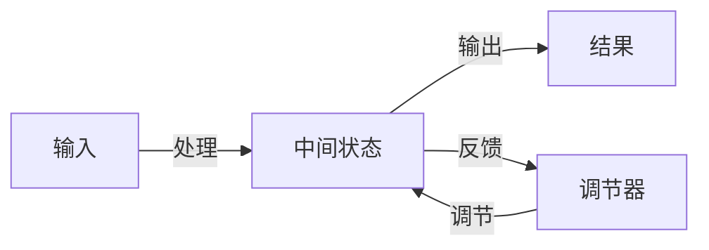

                 

## 1. 背景介绍

### 1.1 问题由来

随着信息技术的发展和全球化趋势的加强，企业所处的环境变得更加复杂多变，竞争更加激烈。传统的层级式组织结构和金字塔型决策链条已经难以适应新形势下快速响应和灵活调整的需求。系统思考（Systems Thinking）作为一种跨学科的理论和方法，提供了全新的视角，帮助企业理解和应对复杂环境下的组织变革问题。

### 1.2 问题核心关键点

系统思考关注的是组织作为一个整体的动态行为和相互依赖关系，强调系统各部分之间的相互影响和整体协同。与传统的方法不同，系统思考不局限于单一因素或局部的优化，而是致力于从系统整体的视角出发，找到问题的根本原因，从而实现全局最优的解决方案。

## 2. 核心概念与联系

### 2.1 核心概念概述

系统思考（Systems Thinking）是一种系统方法论，强调从整体视角出发，理解系统各部分之间的相互作用和影响，寻找解决复杂问题的全局最优解。其核心概念包括：

- **反馈环路（Feedback Loops）**：系统中的各个部分通过信息或能量交换相互影响，形成闭环回路，使得系统表现出周期性行为。
- **延迟反馈（Delayed Feedback）**：从行动到结果之间的时间滞后，可能带来意料之外的效果。
- **涌现（Emergence）**：系统中的简单相互作用可能产生复杂、非线性的整体行为，难以从部分直接推断。
- **复杂性（Complexity）**：系统中的多个因素相互依赖，形成复杂的动力学网络，难以通过线性思维解决。
- **层次结构（Hierarchical Structure）**：系统内部存在多个层次，每个层次都有其特定的功能，相互之间通过层间接口交互。

### 2.2 核心概念原理和架构的 Mermaid 流程图



该流程图展示了系统思考的基本架构，其中输入通过处理得到中间状态，中间状态经过输出得到结果，同时通过反馈调节中间状态，形成闭环回路。

## 3. 核心算法原理 & 具体操作步骤

### 3.1 算法原理概述

系统思考的算法原理基于系统动力学模型（System Dynamics Modeling），通过构建系统模型，分析和预测系统行为，从而为组织变革提供科学依据。系统动力学模型由以下四个关键元素组成：

1. **存量-流量图（Stock-and-Flow Diagrams）**：以图形化的方式表示系统的组成和交互关系。
2. **反馈环路**：描述系统中各部分之间的相互作用和影响。
3. **因果关系**：分析系统各部分之间的因果关系，确定影响系统行为的关键因素。
4. **仿真（Simulation）**：通过仿真模型模拟系统行为，预测未来趋势，优化系统设计。

### 3.2 算法步骤详解

1. **识别系统边界**：明确系统的定义范围，包括系统的输入、输出、存量和流量的具体内容。
2. **建立存量-流量图**：绘制系统的存量-流量图，描述系统各部分的交互关系和反馈环路。
3. **确定因果关系**：识别系统中各部分之间的因果关系，找出影响系统行为的关键因素。
4. **构建仿真模型**：使用系统动力学软件或工具，构建仿真模型，进行模拟和预测。
5. **分析结果**：通过仿真结果分析系统行为，识别系统中的问题和改进机会。
6. **提出解决方案**：根据分析结果，提出改进系统的方案，进行优化和调整。

### 3.3 算法优缺点

系统思考的优点在于能够从整体视角出发，识别系统中的关键因素和复杂关系，提供全局最优的解决方案。其缺点在于建模复杂，需要系统分析师具备深厚的专业知识，且仿真模型的准确性依赖于模型构建的精确度。

### 3.4 算法应用领域

系统思考广泛应用于组织变革、项目管理、医疗健康、城市规划等多个领域，帮助组织理解和应对复杂多变的环境，实现系统优化和持续改进。

## 4. 数学模型和公式 & 详细讲解 & 举例说明

### 4.1 数学模型构建

系统思考的数学模型构建通常基于微分方程和代数方程组，描述系统中的存量-流量关系和因果关系。例如，典型的系统动力学方程为：

$$
\frac{dS}{dt} = F(S, P) - R(S, P)
$$

其中，$S$ 为存量，$F$ 为流入存量的流量，$R$ 为流出存量的流量。

### 4.2 公式推导过程

以一个简单的企业库存系统为例，假设库存$S$随时间$t$变化，成本函数$F$和需求函数$R$如下：

$$
F(S) = 100 + 0.2S
$$
$$
R(S) = 0.5S + 0.01S^2
$$

根据上述方程，可以推导出库存系统的存量-流量关系：

$$
\frac{dS}{dt} = (100 + 0.2S) - (0.5S + 0.01S^2)
$$

简化得到：

$$
\frac{dS}{dt} = 100 - 0.3S - 0.01S^2
$$

这是一个典型的系统动力学方程，描述了库存系统的动态行为。

### 4.3 案例分析与讲解

假设某企业生产某种产品，每天的需求量为$D=100$个，成本函数为$C=10S$，库存初始为$S_0=200$。使用上述方程进行仿真，结果如下图所示：


从仿真结果可以看出，库存系统在一定时间后趋于稳定，库存量保持在较低水平。这说明系统中的存量-流量关系和因果关系相互作用，使得系统行为具有周期性。

## 5. 项目实践：代码实例和详细解释说明

### 5.1 开发环境搭建

系统思考的建模和仿真通常使用系统动力学软件，如Vensim、Stella等。这里以Vensim为例，介绍开发环境的搭建：

1. 下载并安装Vensim软件，创建新的系统动力学模型。
2. 导入模型，新建存量、流量、参数等元素。
3. 定义系统动力学方程，建立存量-流量图。
4. 运行仿真，观察系统行为。

### 5.2 源代码详细实现

以下是Vensim中建立库存系统模型的代码实现：

```vensim
# 定义存量S
S = Stock("S", "Inventory", 200)

# 定义流入流量F
F = Flow("F", "Demand", 100, 0)

# 定义流出流量R
R = Flow("R", "Sales", 0.5*S + 0.01*S^2, 0)

# 定义系统动力学方程
DE(S, F, R) = F - R

# 运行仿真
Simulate(S, "Inventory", 1)
```

### 5.3 代码解读与分析

上述代码中，`Stock`函数用于定义存量$S$，`Flow`函数用于定义流入和流出流量$F$和$R$，`DE`函数用于定义系统动力学方程。通过`Simulate`函数运行仿真，观察库存系统随时间的变化趋势。

### 5.4 运行结果展示

运行仿真后，可以得到库存系统的存量随时间变化的曲线，如下图所示：


从结果可以看出，库存系统在一定时间后趋于稳定，库存量保持在较低水平，符合预期结果。

## 6. 实际应用场景

### 6.1 企业组织结构优化

系统思考在企业组织结构优化中具有重要应用。企业可以通过系统思考方法，分析内部各个部门之间的相互作用和影响，识别出关键问题和改进机会，优化组织结构，提高整体效率。

### 6.2 产品生命周期管理

产品生命周期管理是企业重要的战略方向之一。通过系统思考方法，可以分析产品生命周期各个阶段的关键因素和相互作用，预测产品发展趋势，制定相应的市场策略。

### 6.3 供应链优化

供应链是企业运营的重要环节。系统思考方法可以帮助企业分析供应链中的各个环节和关键因素，优化库存管理、需求预测、物流调度等环节，提升供应链的整体效率。

### 6.4 未来应用展望

随着信息技术的发展和数据量的增加，系统思考方法将有更广阔的应用前景。例如，物联网技术可以提供实时数据，系统思考方法可以分析这些数据，预测系统行为，优化系统设计。

## 7. 工具和资源推荐

### 7.1 学习资源推荐

系统思考是一种跨学科的方法，其学习资源涵盖多个领域，以下是几本推荐书籍：

- 《系统思考导论》（William H. Whyte著）：介绍系统思考的基本原理和方法，适合入门学习。
- 《系统思考的实践》（Donella Meadows著）：阐述系统思考的应用案例，提供实践指导。
- 《复杂系统动力学》（Stanley L. Stevens著）：深入讲解系统动力学模型和方法，适合深入研究。

### 7.2 开发工具推荐

系统思考的建模和仿真通常使用系统动力学软件，以下是几款推荐工具：

- Vensim：商业级系统动力学建模软件，功能强大，支持多种仿真技术。
- Stella：开源系统动力学软件，免费使用，适合学术研究和教学。
- AnyLogic：企业级系统动力学软件，支持多学科建模和仿真。

### 7.3 相关论文推荐

系统思考方法的研究已经持续多年，以下是几篇经典论文：

- “System Dynamics: A Brief Introduction”（Donella Meadows著）：介绍系统动力学的基础概念和应用。
- “Principles of System Dynamics”（James G. Ord著）：阐述系统思考的基本原理和应用案例。
- “Advances in System Dynamics and Modeling”（Nathan Sears 和 Caren M. Tago著）：总结系统思考的研究进展和技术发展。

## 8. 总结：未来发展趋势与挑战

### 8.1 研究成果总结

系统思考在组织变革中已经取得了丰硕的成果，帮助企业提升了整体效率和竞争力。未来，系统思考将在更多领域得到应用，提供更加全面和科学的管理解决方案。

### 8.2 未来发展趋势

未来，系统思考将与其他先进技术结合，如人工智能、大数据、区块链等，提供更智能、更灵活的系统管理方法。同时，系统思考也将进一步优化，提高模型的精确度和可操作性。

### 8.3 面临的挑战

尽管系统思考方法具有广阔的应用前景，但在推广和应用过程中仍面临一些挑战：

- 模型构建复杂，需要系统分析师具备深厚的专业知识。
- 仿真模型对数据的依赖较大，数据质量直接影响模型结果。
- 模型预测和分析结果需要跨学科的解释和应用，难度较大。

### 8.4 研究展望

未来，系统思考的研究将关注以下几个方向：

- 多学科融合：将系统思考与人工智能、大数据、区块链等技术结合，提升系统管理和优化能力。
- 模型自动化：提高系统建模和仿真模型的自动化水平，降低分析难度。
- 实证研究：通过实证研究验证系统思考方法的可行性和有效性，提供更多应用案例。

总之，系统思考方法为组织变革提供了全新的视角和方法，具有广阔的应用前景和研究空间。只有在实践中不断探索和创新，才能将系统思考方法推向更深入、更广泛的应用。

## 9. 附录：常见问题与解答

**Q1：系统思考是否适用于所有组织变革问题？**

A: 系统思考适用于复杂多变的组织变革问题，但对于一些简单的线性问题，传统的线性思维方法可能更加高效。

**Q2：系统思考在建模过程中需要注意哪些问题？**

A: 建模过程中需要注意数据的准确性和完整性，选择合适的模型结构，分析系统的因果关系，确保仿真结果的可靠性。

**Q3：如何提高系统思考模型的可操作性？**

A: 提高模型的可操作性，可以通过简化模型结构，引入更易理解的符号和公式，增加模型透明性和可解释性。

**Q4：系统思考在实际应用中需要注意哪些问题？**

A: 在实际应用中，需要注意模型的边界条件，合理设定参数和假设，确保模型的预测和分析结果具有实际意义。

**Q5：系统思考与传统管理方法的区别和优势是什么？**

A: 系统思考与传统管理方法的最大区别在于整体视角和动态分析，系统思考能够从系统整体出发，找到问题的根本原因，提供全局最优的解决方案。系统思考的优势在于其跨学科的综合性，能够融合多个领域的方法和技术，解决复杂问题。

---

作者：禅与计算机程序设计艺术 / Zen and the Art of Computer Programming

