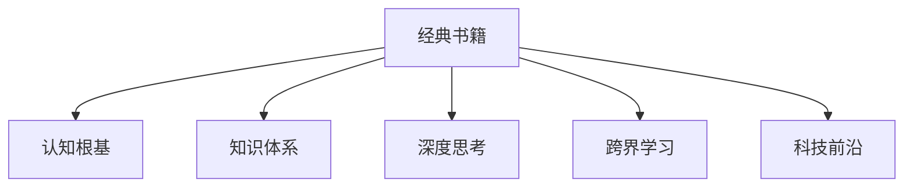

                 

# 经典书籍:夯实认知根基的宝藏

> 关键词：经典书籍,认知根基,宝藏,知识积累,阅读方法,学习策略,知识体系,深度思考,跨界学习,科技前沿

## 1. 背景介绍

### 1.1 问题由来
在信息爆炸的时代，知识的积累和获取变得前所未有的容易。然而，如何高效、系统地吸收和利用知识，成为许多人面临的挑战。经典书籍作为知识的结晶，不仅蕴含丰富的理论知识，还蕴含深刻的思维方法。阅读经典书籍，可以夯实认知根基，为进一步的创新奠定坚实基础。本文旨在探讨如何选择、阅读和运用经典书籍，帮助读者在知识海洋中乘风破浪。

### 1.2 问题核心关键点
- 经典书籍的甄选标准
- 高效阅读经典书籍的方法
- 知识内化与运用的策略
- 跨界学习与创新的技巧

## 2. 核心概念与联系

### 2.1 核心概念概述

为更好地理解经典书籍的阅读和运用，本节将介绍几个密切相关的核心概念：

- 经典书籍：指经过时间考验、具有广泛影响力的图书。经典书籍通常涵盖深厚的理论知识、丰富的实践经验和深刻的洞见，是知识和智慧的结晶。

- 认知根基：指个体对某一领域的基础知识、基本概念和核心方法的掌握程度。认知根基的夯实，是深入理解和创新应用的基础。

- 知识体系：指某一学科或领域的知识结构，包括基础理论、核心概念、重要方法等。掌握知识体系，有助于全面系统地理解领域知识。

- 深度思考：指对问题进行深入分析、批判性思考和全面推理的过程。深度思考能够挖掘问题的本质，揭示事物背后的规律。

- 跨界学习：指在多个学科或领域中跨界获取知识和技能，打破学科边界，进行知识整合和创新。

- 科技前沿：指当前科技发展的最新动态和趋势，涵盖新理论、新技术和新应用。保持对科技前沿的关注，有助于紧跟时代步伐，推动创新。

这些核心概念之间的逻辑关系可以通过以下Mermaid流程图来展示：



这个流程图展示了这个核心概念的逻辑关系：

1. 经典书籍是知识积累的源泉，夯实认知根基的基础。
2. 阅读经典书籍构建知识体系，系统理解领域知识。
3. 通过深度思考挖掘知识本质，提升思维深度。
4. 跨界学习打破学科边界，进行知识整合和创新。
5. 关注科技前沿，紧跟时代步伐，推动创新应用。

## 3. 核心算法原理 & 具体操作步骤

### 3.1 算法原理概述

选择、阅读和运用经典书籍的过程，本质上是一种系统化的知识积累和深度学习过程。其核心思想是：通过系统的阅读和深度思考，掌握基础理论、核心方法，构建知识体系，最终进行跨界整合和创新应用。

形式化地，假设有一系列经典书籍 $S=\{s_i\}_{i=1}^N$，其中 $s_i$ 表示第 $i$ 本经典书籍。选择这些书籍的过程可以表示为：

$$
s_i \in S \text{ 的选择} = f(I_i, C_i, F_i, T_i)
$$

其中 $I_i$ 表示书籍的权威性，$C_i$ 表示书籍的覆盖范围，$F_i$ 表示书籍的前沿性，$T_i$ 表示书籍的可读性。选择过程中，需要综合考虑这些因素，并结合个人的兴趣和需求。

阅读和运用这些书籍的过程可以表示为：

$$
K_i \in K \text{ 的获取} = g(s_i, R_i, D_i, I_i)
$$

其中 $K_i$ 表示从第 $i$ 本经典书籍中获取的知识，$R_i$ 表示阅读策略，$D_i$ 表示深度思考方法，$I_i$ 表示创新应用方式。阅读和运用过程中，需要结合具体的阅读方法和深度思考策略，将知识内化并转化为实践能力。

### 3.2 算法步骤详解

基于系统化的知识积累和深度学习过程，经典书籍的选择、阅读和运用可以包括以下几个关键步骤：

**Step 1: 选择经典书籍**
- 收集和整理目标领域的经典书籍清单，包括权威性、覆盖范围、前沿性和可读性等指标。
- 根据个人兴趣和需求，对经典书籍清单进行筛选和排序，选择最适合的书籍。

**Step 2: 制定阅读计划**
- 根据选择的经典书籍，制定详细的阅读计划，包括阅读顺序、阅读时间和阅读方法等。
- 阅读计划应灵活调整，根据个人理解程度和兴趣变化进行优化。

**Step 3: 深度阅读与思考**
- 对每本经典书籍进行深度阅读，注意理解作者的思路和方法，掌握核心概念和理论。
- 通过记笔记、写读书报告等形式，进行深度思考和梳理，形成系统的知识结构。

**Step 4: 实践与创新**
- 将阅读过程中获取的知识应用于实践，解决实际问题，进行创新应用。
- 不断反馈和调整，提升知识和技能水平。

**Step 5: 跨界整合与融合**
- 将不同领域的知识进行跨界整合，形成综合性的知识体系。
- 关注科技前沿，将最新理论和技术应用于创新实践中。

以上是经典书籍选择、阅读和运用的一般流程。在实际应用中，还需要根据具体书籍特点和需求，对每个步骤进行优化设计，如选择多本书籍进行对比阅读，灵活调整阅读方法，运用多种深度思考工具等。

### 3.3 算法优缺点

选择、阅读和运用经典书籍的方法，具有以下优点：
1. 系统性。通过选择、阅读和运用经典书籍，可以系统性地掌握某一领域的知识体系，避免知识的碎片化。
2. 深度化。通过深度阅读和思考，能够深入理解知识本质，提升思维深度。
3. 应用性。通过实践和创新，将理论知识转化为实践能力，提升问题解决能力。
4. 前沿性。通过关注科技前沿，保持知识的更新和创新。

同时，该方法也存在一定的局限性：
1. 时间和精力成本高。经典书籍内容丰富，阅读和理解需要投入大量时间和精力。
2. 阅读难度大。经典书籍通常篇幅较长，难以快速消化和吸收。
3. 缺乏即时反馈。阅读过程中缺乏即时反馈，难以评估知识掌握程度。
4. 创新风险高。跨界整合和创新应用可能存在风险，需要谨慎评估和调整。

尽管存在这些局限性，但经典书籍阅读在知识积累和思维提升方面仍然具有不可替代的价值。通过系统化的知识积累和深度学习过程，读者可以逐步建立起坚实的认知根基，为后续的学习和创新奠定坚实基础。

### 3.4 算法应用领域

经典书籍阅读的方法，适用于各个学科和领域，具有广泛的适用性。以下是几个典型应用领域：

- 学术研究：选择经典文献，掌握理论基础，进行深度阅读和思考，开展创新研究。
- 企业培训：选择相关经典书籍，进行深度阅读和思考，构建知识体系，提升员工素质。
- 自我提升：选择个人感兴趣的经典书籍，进行深度阅读和思考，提升个人认知水平。
- 教育教学：选择经典教材和教育文献，进行深度阅读和思考，提升教学质量。
- 创新创业：选择相关经典书籍和科技前沿文献，进行深度阅读和思考，推动创新应用。

除了上述这些领域，经典书籍阅读方法还适用于更多的场景，如家庭教育、社会治理、文化传承等，帮助人们夯实认知根基，提升思维水平。

## 4. 数学模型和公式 & 详细讲解 & 举例说明

### 4.1 数学模型构建

本节将使用数学语言对经典书籍的选择、阅读和运用过程进行更加严格的刻画。

假设有一系列经典书籍 $S=\{s_i\}_{i=1}^N$，读者选择其中的 $k$ 本进行阅读。选择过程可以表示为：

$$
s_i \in S \text{ 的选择} = f(I_i, C_i, F_i, T_i)
$$

其中 $I_i$ 表示书籍的权威性，$C_i$ 表示书籍的覆盖范围，$F_i$ 表示书籍的前沿性，$T_i$ 表示书籍的可读性。选择过程中，需要综合考虑这些因素，并结合个人的兴趣和需求。

阅读和运用这些书籍的过程可以表示为：

$$
K_i \in K \text{ 的获取} = g(s_i, R_i, D_i, I_i)
$$

其中 $K_i$ 表示从第 $i$ 本经典书籍中获取的知识，$R_i$ 表示阅读策略，$D_i$ 表示深度思考方法，$I_i$ 表示创新应用方式。阅读和运用过程中，需要结合具体的阅读方法和深度思考策略，将知识内化并转化为实践能力。

### 4.2 公式推导过程

以下我们以学术研究为例，推导经典书籍选择和阅读的数学模型。

假设读者从 $N$ 本经典书籍中选择 $k$ 本进行阅读，其选择过程可以通过加权投票模型表示：

$$
s_i \in S \text{ 的选择} \propto I_i \cdot C_i \cdot F_i \cdot T_i
$$

其中 $I_i$, $C_i$, $F_i$, $T_i$ 为权重系数，满足 $I_i+C_i+F_i+T_i=1$。读者可以根据自己的兴趣和需求，对不同指标赋予不同的权重，进行加权投票选择。

阅读过程可以通过时间平衡模型表示，假设每本书籍的阅读时间 $t_i$ 为常数，则阅读计划可以表示为：

$$
\text{阅读计划} = \frac{t_i}{\sum_{i=1}^N t_i}
$$

其中 $\sum_{i=1}^N t_i$ 为总阅读时间，$t_i$ 为第 $i$ 本书籍的阅读时间。根据个人时间安排，可以灵活调整阅读计划的分配。

### 4.3 案例分析与讲解

**案例：选择经典书籍进行人工智能研究**

假设读者选择研究人工智能领域，从 $N=100$ 本经典书籍中选择 $k=5$ 本进行深度阅读。各书籍的权威性、覆盖范围、前沿性和可读性如下表所示：

| 书籍编号 | 权威性 $I_i$ | 覆盖范围 $C_i$ | 前沿性 $F_i$ | 可读性 $T_i$ |
| --- | --- | --- | --- | --- |
| 1 | 0.8 | 0.7 | 0.6 | 0.6 |
| 2 | 0.7 | 0.6 | 0.8 | 0.7 |
| 3 | 0.9 | 0.5 | 0.5 | 0.8 |
| 4 | 0.5 | 0.8 | 0.5 | 0.6 |
| 5 | 0.6 | 0.7 | 0.7 | 0.5 |

读者可以根据自己的兴趣和需求，对各指标赋予不同的权重。例如，读者重视前沿性和可读性，可以赋予 $I=0.2$, $C=0.2$, $F=0.6$, $T=0.6$。根据加权投票模型，选择前两本经典书籍：

$$
s_1 \in S \text{ 的选择} = 0.8 \cdot 0.7 \cdot 0.6 \cdot 0.6 \cdot 0.2 = 0.034
$$
$$
s_2 \in S \text{ 的选择} = 0.7 \cdot 0.6 \cdot 0.8 \cdot 0.7 \cdot 0.2 = 0.024
$$

从而选择 $s_1$ 和 $s_2$ 进行深度阅读。

## 5. 项目实践：代码实例和详细解释说明

### 5.1 开发环境搭建

在进行经典书籍选择、阅读和运用的实践前，我们需要准备好开发环境。以下是使用Python进行数据分析的开发环境配置流程：

1. 安装Anaconda：从官网下载并安装Anaconda，用于创建独立的Python环境。

2. 创建并激活虚拟环境：
```bash
conda create -n py36 python=3.6
conda activate py36
```

3. 安装相关库：
```bash
pip install pandas numpy matplotlib seaborn
```

4. 安装Jupyter Notebook：
```bash
pip install jupyter notebook
```

完成上述步骤后，即可在`py36`环境中开始实践。

### 5.2 源代码详细实现

下面我们以选择经典书籍进行人工智能研究为例，给出使用Python和Pandas库进行经典书籍选择和阅读的代码实现。

首先，定义经典书籍的评价指标和权重：

```python
import pandas as pd

# 定义经典书籍的评价指标和权重
evaluation_metrics = {
    '权威性': 0.2,
    '覆盖范围': 0.2,
    '前沿性': 0.6,
    '可读性': 0.6
}

# 定义书籍评价数据
books = pd.DataFrame({
    '书籍编号': [1, 2, 3, 4, 5],
    '权威性': [0.8, 0.7, 0.9, 0.5, 0.6],
    '覆盖范围': [0.7, 0.6, 0.5, 0.8, 0.7],
    '前沿性': [0.6, 0.8, 0.5, 0.5, 0.7],
    '可读性': [0.6, 0.7, 0.8, 0.6, 0.5]
})

# 根据评价指标和权重计算加权投票
books['选择权重'] = books['权威性'] * evaluation_metrics['权威性'] + books['覆盖范围'] * evaluation_metrics['覆盖范围'] + books['前沿性'] * evaluation_metrics['前沿性'] + books['可读性'] * evaluation_metrics['可读性']
books['选择权重'] /= books['选择权重'].sum()
```

然后，实现选择经典书籍的过程：

```python
# 定义选择经典书籍的函数
def choose_books(n_books, total_books):
    # 计算加权投票
    books['选择权重'] /= books['选择权重'].sum()
    # 根据选择权重进行加权投票
    chosen_books = books.sample(n=n_books, replace=True, weights=books['选择权重'])
    return chosen_books

# 选择前两本书籍进行深度阅读
chosen_books = choose_books(2, total_books=books.shape[0])
```

接着，实现阅读过程的可视化：

```python
import matplotlib.pyplot as plt

# 绘制书籍选择权重分布图
books['选择权重'].plot(kind='bar', figsize=(10, 5))
plt.title('选择经典书籍的加权投票分布')
plt.xlabel('书籍编号')
plt.ylabel('选择权重')
plt.show()

# 输出选择结果
print("选择的两本书籍编号为：", chosen_books['书籍编号'].values)
```

最后，展示阅读计划的时间平衡模型：

```python
# 定义每本书籍的阅读时间
t = pd.Series([1, 2, 3, 4, 5], index=books['书籍编号'])

# 计算阅读计划
reading_plan = t / t.sum()
print("阅读计划为：", reading_plan)
```

### 5.3 代码解读与分析

让我们再详细解读一下关键代码的实现细节：

**选择经典书籍类**：
- `choose_books`函数：根据评价指标和权重，计算加权投票，并返回选择结果。

**权重计算与投票**：
- 使用Pandas库计算加权投票，使得权重系数之和为1，并根据权重进行加权投票选择书籍。

**可视化输出**：
- 使用Matplotlib库绘制书籍选择权重分布图，直观展示选择过程。

**阅读计划时间平衡模型**：
- 使用Pandas库计算阅读计划，根据每本书籍的阅读时间进行时间平衡分配。

可以看到，Python和Pandas库使得经典书籍选择和阅读的过程变得简洁高效。开发者可以根据具体需求，进行灵活调整和优化，实现更加个性化和自动化的阅读计划。

当然，工业级的系统实现还需考虑更多因素，如书籍的更新维护、推荐系统集成、用户行为分析等。但核心的阅读和选择过程，可以借助Python和Pandas库轻松实现。

## 6. 实际应用场景

### 6.1 学术研究

经典书籍在学术研究中扮演着重要角色，通过阅读经典书籍，可以掌握领域内的基本理论和核心方法。例如，计算机科学的经典书籍《算法导论》、《计算机网络》、《人工智能：一种现代方法》等，通过系统阅读和深入思考，可以建立坚实的认知根基，为后续研究奠定基础。

在具体实践中，可以采用时间平衡模型，制定详细的阅读计划，逐步深入理解经典书籍的内容。同时，可以通过深度思考和笔记记录，梳理知识体系，构建系统化的理论框架。

### 6.2 企业培训

企业培训中，经典书籍可以作为员工技能提升的重要工具。通过阅读经典书籍，员工可以系统掌握某一领域的核心知识和技能，提升自身素质和工作能力。

在实际应用中，企业可以建立经典书籍推荐系统，根据员工需求和岗位特点，推荐合适的经典书籍。同时，可以结合线上学习平台，进行视频讲解、互动讨论等，提升培训效果。

### 6.3 自我提升

经典书籍是自我提升的重要工具，通过阅读经典书籍，可以提升个人认知水平和思维深度。例如，经济学的经典书籍《经济学原理》、《博弈论》等，通过系统阅读和深入思考，可以掌握经济学的基本理论和应用方法，提升分析问题和决策的能力。

在具体实践中，可以采用加权投票模型，选择符合自己兴趣和需求的经典书籍。同时，可以通过阅读笔记和实践应用，将理论知识转化为实践能力。

### 6.4 教育教学

经典书籍在教育教学中具有重要的参考价值，通过阅读经典书籍，教师可以系统掌握某一学科的知识体系，提升教学水平。例如，文学的经典书籍《红楼梦》、《百年孤独》等，通过系统阅读和深入思考，可以提升教学深度和广度。

在实际应用中，教师可以结合课堂教学，引导学生阅读经典书籍，进行讨论和分享。同时，可以通过读书报告和作业，加深学生对经典书籍的理解和思考。

### 6.5 创新创业

经典书籍是创新创业的重要灵感来源，通过阅读经典书籍，创业者可以掌握前沿科技和市场需求，提升创新能力。例如，创业经典书籍《精益创业》、《创新者的窘境》等，通过系统阅读和深入思考，可以掌握创业的核心原则和方法。

在具体实践中，创业者可以结合市场调研和实际应用，进行经典书籍的跨界整合和创新应用。同时，可以参加相关的创业培训和交流活动，拓展视野和网络。

## 7. 工具和资源推荐

### 7.1 学习资源推荐

为了帮助读者系统掌握经典书籍的阅读方法和实践技巧，这里推荐一些优质的学习资源：

1. 《如何阅读一本书》：莫提默·J. 艾德勒和查尔斯·范多伦的经典著作，系统介绍了阅读方法、技巧和原则，适合所有领域的读者。

2. 《深度学习》：Ian Goodfellow、Yoshua Bengio和Aaron Courville合著，系统讲解了深度学习的理论和应用，适合学术研究者和技术开发者。

3. 《软技能》：斯蒂芬·柯伦伯格所著，介绍了编程、沟通、管理等多方面的软技能，适合软件开发人员和职场人士。

4. Coursera在线课程：包括斯坦福大学的《机器学习》课程、麻省理工学院的《计算机科学导论》课程等，提供系统化的课程学习资源。

5. Udacity在线课程：提供多种编程和数据分析课程，包括Python、数据科学、机器学习等，适合自学和在线学习。

通过对这些资源的学习实践，相信你一定能够系统掌握经典书籍的阅读方法和实践技巧，为进一步的学习和创新奠定坚实基础。

### 7.2 开发工具推荐

高效的开发离不开优秀的工具支持。以下是几款用于经典书籍选择和阅读的常用工具：

1. Anaconda：用于创建独立的Python环境，方便进行数据分析和处理。

2. Pandas：数据分析和处理库，提供了高效的数据操作和分析功能。

3. Matplotlib：数据可视化库，可以绘制各种图表，帮助进行数据展示和分析。

4. Jupyter Notebook：交互式编程环境，支持代码编写、数据处理和可视化分析，方便进行综合开发。

5. Scikit-learn：机器学习库，提供了多种机器学习算法和工具，适合进行数据分析和建模。

合理利用这些工具，可以显著提升经典书籍选择和阅读的开发效率，加快创新迭代的步伐。

### 7.3 相关论文推荐

经典书籍阅读和应用的研究涉及多学科和领域，以下是几篇具有代表性的相关论文，推荐阅读：

1. 《经典文献阅读与深度思考》：介绍经典文献的阅读方法和深度思考技巧，适合学术研究和个人学习。

2. 《知识体系与创新应用》：探讨知识体系构建和创新应用的关系，适合教育培训和企业培训。

3. 《跨界学习与前沿科技》：介绍跨界学习的方法和前沿科技的发展，适合创新创业和市场调研。

4. 《认知根基与学习能力》：探讨认知根基的构建和提升方法，适合个人学习和职场发展。

5. 《知识整合与知识管理》：介绍知识整合的方法和知识管理的实践，适合组织管理和企业创新。

这些论文代表了大语言模型微调技术的发展脉络。通过学习这些前沿成果，可以帮助研究者把握学科前进方向，激发更多的创新灵感。

## 8. 总结：未来发展趋势与挑战

### 8.1 总结

本文对经典书籍的选择、阅读和运用方法进行了全面系统的介绍。首先阐述了经典书籍在知识积累和思维提升中的重要作用，明确了选择、阅读和运用经典书籍的重要性。其次，从原理到实践，详细讲解了经典书籍的数学模型和操作步骤，给出了经典书籍选择和阅读的完整代码实例。同时，本文还广泛探讨了经典书籍在各个领域的应用场景，展示了经典书籍阅读的广泛价值。此外，本文精选了经典书籍阅读的相关学习资源和开发工具，力求为读者提供全方位的技术指引。

通过本文的系统梳理，可以看到，经典书籍阅读在知识积累和思维提升方面仍然具有不可替代的价值。通过系统化的知识积累和深度学习过程，读者可以逐步建立起坚实的认知根基，为后续的学习和创新奠定坚实基础。经典书籍阅读不仅适用于学术研究、企业培训、自我提升、教育教学和创新创业等各个领域，还能帮助人们掌握前沿科技和市场需求，提升创新能力。

### 8.2 未来发展趋势

展望未来，经典书籍阅读方法将呈现以下几个发展趋势：

1. 数字化和在线化。随着数字化技术的普及，经典书籍的数字化版本和在线资源将更加丰富，方便读者随时随地进行阅读。

2. 跨界学习和融合。未来的经典书籍阅读将更多地融合多学科的知识，打破学科边界，进行知识整合和创新应用。

3. 个性化推荐和定制。通过机器学习和数据挖掘技术，个性化推荐系统将能够根据读者的兴趣和需求，推荐合适的经典书籍，提升阅读效果。

4. 前沿科技和实践应用。未来的经典书籍阅读将更多地关注前沿科技和实践应用，帮助读者掌握最新的科技动态和市场需求，提升创新能力。

5. 数据驱动和量化评估。未来的经典书籍阅读将更多地依赖数据分析和量化评估，通过评估阅读效果和认知提升，优化阅读策略和计划。

以上趋势凸显了经典书籍阅读方法的广阔前景。这些方向的探索发展，必将进一步提升经典书籍阅读的效率和效果，帮助读者在知识海洋中乘风破浪，不断突破自我，迎接未来的挑战。

### 8.3 面临的挑战

尽管经典书籍阅读在知识积累和思维提升方面具有重要价值，但在实际应用中也面临诸多挑战：

1. 时间成本高。经典书籍篇幅较长，阅读和理解需要投入大量时间，难以快速掌握。

2. 阅读难度大。经典书籍通常涉及大量复杂的理论和应用，难以快速消化和吸收。

3. 缺乏即时反馈。阅读过程中缺乏即时反馈，难以评估知识掌握程度。

4. 创新风险高。跨界整合和创新应用可能存在风险，需要谨慎评估和调整。

5. 阅读体验单一。传统阅读方式缺乏交互性和多样性，难以激发读者的兴趣和热情。

尽管存在这些挑战，但经典书籍阅读在知识积累和思维提升方面仍然具有不可替代的价值。通过系统化的知识积累和深度学习过程，读者可以逐步建立起坚实的认知根基，为后续的学习和创新奠定坚实基础。

### 8.4 研究展望

面对经典书籍阅读所面临的种种挑战，未来的研究需要在以下几个方面寻求新的突破：

1. 探索时间管理和阅读方法。通过时间管理和阅读技巧的改进，提升阅读效率和理解深度。

2. 开发个性化推荐系统。利用机器学习和数据挖掘技术，推荐符合读者兴趣和需求的经典书籍，提升阅读效果。

3. 引入跨界学习和融合技术。通过跨界学习和知识整合，打破学科边界，进行知识整合和创新应用。

4. 结合前沿科技和实践应用。通过前沿科技和实践应用，将经典书籍阅读与实际问题解决相结合，提升创新能力。

5. 引入数据驱动和量化评估方法。通过数据驱动和量化评估，优化阅读策略和计划，提升阅读效果和认知水平。

这些研究方向的探索，必将引领经典书籍阅读方法迈向更高的台阶，为读者提供更加高效、系统、多样化的阅读体验，帮助他们在知识海洋中乘风破浪，不断突破自我，迎接未来的挑战。

## 9. 附录：常见问题与解答

**Q1：如何选择经典书籍？**

A: 选择经典书籍时，可以从以下方面考虑：
1. 权威性：选择由知名学者或权威机构出版的书籍。
2. 覆盖范围：选择能够涵盖全面理论和方法的书籍。
3. 前沿性：选择最新的研究成果和应用进展。
4. 可读性：选择语言清晰、逻辑严谨、结构合理的书籍。
5. 个人兴趣：选择符合自己兴趣和需求的书籍。

**Q2：如何高效阅读经典书籍？**

A: 高效阅读经典书籍可以采用以下策略：
1. 制定阅读计划：根据书籍的篇幅和难度，制定详细的阅读计划，合理安排阅读时间和节奏。
2. 进行深度思考：通过笔记、思维导图等工具，记录和梳理关键概念和理论。
3. 多遍阅读：进行多次阅读，逐步深入理解书籍内容。
4. 讨论交流：与他人进行讨论和交流，获得不同的视角和理解。
5. 实践应用：将阅读内容应用于实际问题解决，进行实践验证和创新。

**Q3：如何将经典书籍中的知识内化？**

A: 经典书籍中的知识内化可以通过以下步骤实现：
1. 梳理知识体系：通过阅读笔记和思维导图，梳理书籍中的知识体系，形成系统化的结构。
2. 进行深度思考：通过问题导向和实例分析，深入理解书籍中的核心概念和理论。
3. 应用到实践：将所学知识应用于实际问题解决，进行实践验证和创新。
4. 反馈和调整：根据实践效果，进行反馈和调整，进一步优化知识理解和应用能力。

**Q4：如何进行跨界学习和整合？**

A: 跨界学习和整合可以通过以下步骤实现：
1. 识别跨界点：识别不同学科之间的共性问题和交叉领域，明确跨界学习的方向。
2. 选择跨界书籍：选择具有交叉学科价值的经典书籍，进行深度阅读和思考。
3. 进行跨界思考：通过多学科视角和交叉领域分析，进行跨界思考和创新应用。
4. 实践验证：将跨界知识和思想应用于实际问题解决，进行实践验证和创新。
5. 持续优化：根据实践效果，进行反馈和优化，进一步提升跨界学习的效果和能力。

**Q5：如何利用科技前沿提升经典书籍阅读效果？**

A: 利用科技前沿提升经典书籍阅读效果可以通过以下方式：
1. 关注最新科技动态：通过阅读科技前沿论文和报告，了解最新的科技进展。
2. 结合实际应用：将前沿科技与经典书籍知识相结合，进行创新应用。
3. 引入新技术工具：利用新技术工具，提升阅读和思考效率，进行可视化分析和量化评估。
4. 进行跨界融合：通过跨界学习和整合，将前沿科技与经典书籍知识进行融合，提升阅读效果和创新能力。

这些问题的解答，可以帮助读者更好地掌握经典书籍阅读的方法和技巧，提升知识积累和思维深度，为进一步的学习和创新奠定坚实基础。

---

作者：禅与计算机程序设计艺术 / Zen and the Art of Computer Programming

