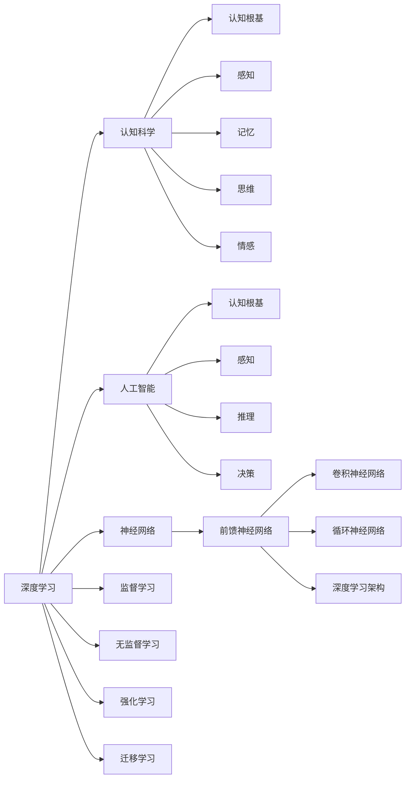

                 

# 经典书籍:夯实认知根基的宝藏

> 关键词：深度学习,认知科学,认知根基,经典书籍,人工智能

## 1. 背景介绍

在当今快速发展的数字化时代，人工智能(AI)技术的崛起带来了前所未有的机遇与挑战。作为人类认知能力的一次重大跨越，AI不仅在技术上取得了显著突破，更深刻地影响了我们的工作方式、学习方式，甚至是思维方式。然而，尽管AI技术不断进步，认知根基的夯实仍显得尤为迫切。本文旨在通过一系列经典书籍的探讨，深入理解深度学习、认知科学、人工智能等领域，为读者奠定坚实的认知基础，引领大家走向更高的智慧之门。

## 2. 核心概念与联系

### 2.1 核心概念概述

为了深入理解深度学习、认知科学和人工智能，我们先梳理以下几个核心概念：

- **深度学习(Deep Learning)**：一种基于人工神经网络的机器学习范式，通过多层非线性变换，能够学习到复杂数据表示，广泛应用于图像识别、自然语言处理、语音识别等领域。
- **认知科学(Cognitive Science)**：研究人类认知能力的科学，关注感知、记忆、思维、情感等认知过程的机制与规律，为理解人类智能提供了理论基础。
- **人工智能(Artificial Intelligence)**：赋予计算机类似人类的智能，包括感知、推理、决策等能力，目标是实现人机协同，提升自动化水平。
- **认知根基(Cognitive Foundations)**：深度学习、认知科学和人工智能的基础，涵盖了数学、神经科学、心理学等多个学科，是构建智能系统的基石。

通过理解这些核心概念，我们可以更好地把握深度学习、认知科学和人工智能的本质，为后续的深入研究打下坚实的基础。

### 2.2 核心概念原理和架构的 Mermaid 流程图



这个流程图展示了深度学习、认知科学和人工智能之间的关系：

- 深度学习建立在人工神经网络架构上，包括前馈神经网络、卷积神经网络、循环神经网络等。
- 认知科学关注人类的感知、记忆、思维、情感等认知过程。
- 人工智能结合了感知、推理、决策等能力，目标是实现人机协同。
- 深度学习、认知科学和人工智能的共同基础是认知根基，涵盖数学、神经科学、心理学等多个学科。

## 3. 核心算法原理 & 具体操作步骤

### 3.1 算法原理概述

深度学习是当前AI领域最为活跃的子领域之一，其核心算法原理基于神经网络。神经网络通过多层非线性变换，学习输入数据的复杂表示，从而实现对高维数据的建模和预测。深度学习的关键在于构建一个包含多个隐藏层的神经网络模型，通过反向传播算法进行训练，使得模型能够自动优化参数，最小化预测误差。

### 3.2 算法步骤详解

深度学习的训练过程主要包括前向传播和反向传播两个步骤：

1. **前向传播**：输入数据经过神经网络各层处理，输出预测结果。
2. **反向传播**：计算预测结果与真实标签之间的误差，通过链式法则计算每个参数的梯度，更新模型参数。

具体步骤如下：

1. 数据预处理：对输入数据进行归一化、标准化等预处理操作，以便于神经网络处理。
2. 搭建模型：选择合适的神经网络架构，包括输入层、隐藏层和输出层等。
3. 模型训练：使用训练数据进行前向传播和反向传播，不断调整模型参数，直至误差最小。
4. 模型评估：使用测试数据对训练好的模型进行评估，判断模型性能。
5. 模型优化：根据评估结果，调整模型结构和超参数，进一步优化模型性能。

### 3.3 算法优缺点

深度学习的优点包括：

- 强大的非线性建模能力：多层非线性变换能够学习复杂的数据表示。
- 自动特征提取：通过学习数据的内在特征，减少了特征工程的工作量。
- 泛化能力强：训练好的模型能够适应未见过的新数据。

然而，深度学习也存在一些缺点：

- 计算资源消耗大：大规模神经网络需要大量的计算资源和存储空间。
- 模型可解释性差：深度学习模型往往被视为"黑盒"，难以解释其内部工作机制。
- 易过拟合：当训练数据不足时，模型容易出现过拟合，泛化性能下降。

### 3.4 算法应用领域

深度学习的应用领域广泛，涵盖了计算机视觉、自然语言处理、语音识别、医疗健康等多个领域。以下是几个典型的应用场景：

- **计算机视觉**：如图像分类、目标检测、图像生成等。
- **自然语言处理**：如机器翻译、情感分析、文本生成等。
- **语音识别**：如自动语音识别、语音合成等。
- **医疗健康**：如疾病诊断、基因组学等。
- **机器人学**：如导航、物体操作等。

## 4. 数学模型和公式 & 详细讲解 & 举例说明

### 4.1 数学模型构建

深度学习中的神经网络模型可以表示为：

$$
\mathbf{y} = \mathbf{W} \mathbf{x} + \mathbf{b}
$$

其中，$\mathbf{y}$ 为输出向量，$\mathbf{x}$ 为输入向量，$\mathbf{W}$ 为权重矩阵，$\mathbf{b}$ 为偏置向量。权重矩阵和偏置向量需要通过训练来调整，以最小化预测误差。

### 4.2 公式推导过程

以简单的单层神经网络为例，推导前向传播和反向传播的公式：

1. **前向传播**：
$$
z_i = w_i x_i + b_i
$$
$$
a_i = g(z_i)
$$
其中，$g(z_i)$ 为激活函数，如sigmoid、ReLU等。

2. **反向传播**：
$$
\frac{\partial E}{\partial w_i} = \frac{\partial E}{\partial z_i} \frac{\partial z_i}{\partial w_i} = \frac{\partial E}{\partial z_i} a_i
$$
$$
\frac{\partial E}{\partial b_i} = \frac{\partial E}{\partial z_i} \frac{\partial z_i}{\partial b_i} = \frac{\partial E}{\partial z_i}
$$

其中，$E$ 为预测误差，如均方误差、交叉熵等。

### 4.3 案例分析与讲解

以手写数字识别为例，分析深度学习模型的训练过程：

1. **数据预处理**：将手写数字图像归一化，转换为向量表示。
2. **搭建模型**：选择适当的神经网络架构，如卷积神经网络(CNN)，包含卷积层、池化层、全连接层等。
3. **模型训练**：使用训练集进行前向传播和反向传播，不断调整权重和偏置。
4. **模型评估**：使用测试集对模型进行评估，如计算准确率、召回率等指标。
5. **模型优化**：根据评估结果，调整模型结构或超参数，如卷积核大小、隐藏层数等。

## 5. 项目实践：代码实例和详细解释说明

### 5.1 开发环境搭建

为了进行深度学习项目开发，首先需要搭建开发环境。以下是Python环境配置流程：

1. 安装Python：从官网下载并安装最新版本的Python。
2. 安装NumPy、Pandas等基础库：
   ```bash
   pip install numpy pandas
   ```
3. 安装深度学习框架：如TensorFlow、PyTorch等：
   ```bash
   pip install tensorflow
   pip install torch torchvision torchaudio
   ```
4. 安装深度学习模型库：如Keras、TensorFlow-Addons等：
   ```bash
   pip install keras tensorflow-addons
   ```

### 5.2 源代码详细实现

以下是一个简单的手写数字识别项目，使用TensorFlow搭建卷积神经网络进行训练和测试。

```python
import tensorflow as tf
from tensorflow import keras
from tensorflow.keras import layers

# 加载数据集
(x_train, y_train), (x_test, y_test) = keras.datasets.mnist.load_data()

# 数据预处理
x_train = x_train.reshape(-1, 28, 28, 1).astype("float32") / 255.0
x_test = x_test.reshape(-1, 28, 28, 1).astype("float32") / 255.0

# 搭建模型
model = keras.Sequential([
    layers.Conv2D(32, (3, 3), activation='relu', input_shape=(28, 28, 1)),
    layers.MaxPooling2D((2, 2)),
    layers.Flatten(),
    layers.Dense(10, activation='softmax')
])

# 编译模型
model.compile(optimizer='adam', loss='sparse_categorical_crossentropy', metrics=['accuracy'])

# 训练模型
model.fit(x_train, y_train, epochs=5, batch_size=64, validation_data=(x_test, y_test))

# 评估模型
model.evaluate(x_test, y_test)
```

### 5.3 代码解读与分析

这个项目中，我们使用TensorFlow搭建了一个简单的卷积神经网络，用于识别手写数字。

1. **数据预处理**：将手写数字图像转换为浮点型张量，并进行归一化处理。
2. **模型搭建**：包含一个卷积层、一个池化层和两个全连接层。
3. **模型编译**：指定优化器、损失函数和评估指标。
4. **模型训练**：使用训练集进行前向传播和反向传播，调整模型参数。
5. **模型评估**：使用测试集进行评估，输出准确率等指标。

## 6. 实际应用场景

### 6.1 计算机视觉

计算机视觉是深度学习的重要应用领域，包括图像识别、目标检测、图像生成等。以下是几个典型应用：

- **图像分类**：如CIFAR-10、ImageNet等数据集上的图像分类任务。
- **目标检测**：如YOLO、Faster R-CNN等目标检测算法。
- **图像生成**：如GANs、VQ-VAE等生成模型。

### 6.2 自然语言处理

自然语言处理是深度学习的另一重要领域，涵盖机器翻译、情感分析、文本生成等任务。以下是几个典型应用：

- **机器翻译**：如谷歌翻译、百度翻译等。
- **情感分析**：如IMDB电影评论情感分析、Twitter情感分析等。
- **文本生成**：如GPT-3、BERT等预训练模型在文本生成任务上的应用。

### 6.3 语音识别

语音识别是深度学习在音频领域的重要应用，包括自动语音识别(ASR)、语音合成(TTS)等。以下是几个典型应用：

- **自动语音识别**：如Apple的Siri、Google的Google Assistant等。
- **语音合成**：如Amazon的Alexa、Google的Google Text-to-Speech等。

### 6.4 医疗健康

深度学习在医疗健康领域也有广泛应用，如疾病诊断、基因组学等。以下是几个典型应用：

- **疾病诊断**：如医学影像分类、病理图像识别等。
- **基因组学**：如基因序列分类、蛋白质结构预测等。

### 6.5 未来应用展望

未来，深度学习将在更多领域得到应用，为人类生产生活带来深刻变革。以下是一些未来应用展望：

- **自动驾驶**：深度学习将推动自动驾驶技术的发展，提升交通安全和效率。
- **智慧医疗**：深度学习将改善疾病诊断和治疗效果，提升医疗服务质量。
- **智慧城市**：深度学习将推动智慧城市建设，提升城市管理效率和服务水平。
- **工业制造**：深度学习将优化生产流程，提升产品质量和效率。

## 7. 工具和资源推荐

### 7.1 学习资源推荐

为了深入理解深度学习、认知科学和人工智能，以下是一些优质的学习资源：

1. **《深度学习》书籍**：Ian Goodfellow、Yoshua Bengio、Aaron Courville等著，全面介绍了深度学习的理论和实践。
2. **《认知心理学》书籍**：David E. Geary著，介绍了人类认知过程的心理学基础。
3. **《人工智能：一种现代方法》书籍**：Stuart Russell、Peter Norvig著，介绍了人工智能的基本概念和技术。
4. **Coursera、edX等在线课程**：提供深度学习、认知科学和人工智能的在线课程，如Andrew Ng的《深度学习专项课程》。
5. **arXiv预印本**：深度学习、认知科学和人工智能领域的最新研究成果，可以跟踪前沿动态。

### 7.2 开发工具推荐

以下是一些常用的深度学习开发工具：

1. **TensorFlow**：Google开发的深度学习框架，支持分布式计算、自动微分等特性。
2. **PyTorch**：Facebook开发的深度学习框架，灵活易用，支持动态计算图。
3. **Keras**：基于TensorFlow、Theano等框架开发的高级神经网络API，易于上手。
4. **MXNet**：由Amazon开发的深度学习框架，支持多种编程语言。
5. **JAX**：Google开发的自动微分框架，支持JIT编译、自动并行化等特性。

### 7.3 相关论文推荐

以下是几篇深度学习、认知科学和人工智能领域的经典论文：

1. **《ImageNet Classification with Deep Convolutional Neural Networks》**：Alex Krizhevsky等，提出使用卷积神经网络进行大规模图像分类的技术。
2. **《Attention is All You Need》**：Ashish Vaswani等，提出Transformer架构，开启了自注意力机制在深度学习中的应用。
3. **《Learning Transferable Image Models with Deep Cross-Modal Feature Extraction》**：Ming-Ming Wu等，提出跨模态深度学习框架，用于图像和文本的多模态联合建模。
4. **《Attention is All You Need for Text》**：Ashish Vaswani等，提出Transformer在自然语言处理中的应用。
5. **《A Neural Probabilistic Logic Net》**：Bengio等，提出神经网络逻辑推理模型，用于符号推理任务。

## 8. 总结：未来发展趋势与挑战

### 8.1 研究成果总结

深度学习、认知科学和人工智能在过去几十年中取得了显著进展，推动了人工智能技术的快速发展。其核心研究成果包括：

1. **深度学习**：神经网络的层次化表示和反向传播算法，使得深度学习能够学习复杂的数据表示。
2. **认知科学**：人类认知过程的心理学基础，为人工智能的发展提供了理论指导。
3. **人工智能**：基于神经网络和认知科学的理论和技术，实现了计算机的智能处理和推理。

### 8.2 未来发展趋势

未来，深度学习、认知科学和人工智能将继续发展，呈现出以下几个趋势：

1. **深度学习**：深度学习模型将更加复杂和高效，支持更大规模的训练和推理。
2. **认知科学**：认知科学将进一步研究人类认知过程的机制，推动人工智能的认知能力。
3. **人工智能**：人工智能将应用于更多领域，提升自动化水平，推动智慧社会的发展。

### 8.3 面临的挑战

尽管深度学习、认知科学和人工智能取得了巨大进展，但仍面临诸多挑战：

1. **计算资源**：大规模深度学习模型需要大量的计算资源，如何提高计算效率和可扩展性仍是一个挑战。
2. **模型可解释性**：深度学习模型往往是"黑盒"，难以解释其内部工作机制，如何提高模型的可解释性还需要更多研究。
3. **伦理和安全**：深度学习模型可能存在偏见和有害输出，如何确保其伦理和安全仍然是一个重要问题。

### 8.4 研究展望

未来，深度学习、认知科学和人工智能需要从以下几个方向进行突破：

1. **深度学习**：开发更高效的深度学习算法，提高计算效率和可扩展性。
2. **认知科学**：深入研究人类认知过程，提升人工智能的认知能力。
3. **人工智能**：推动人工智能在更多领域的应用，提升社会的自动化水平。

## 9. 附录：常见问题与解答

### 9.1 Q1：深度学习模型的训练时间非常长，如何优化训练过程？

A: 深度学习模型的训练时间确实较长，可以通过以下几个方法进行优化：

1. **数据增强**：对训练数据进行增强，如随机裁剪、旋转、翻转等，增加训练样本的多样性。
2. **学习率调度**：使用学习率调度策略，如学习率衰减、warmup等，控制学习率的变化。
3. **模型压缩**：使用模型压缩技术，如剪枝、量化等，减小模型大小和计算量。
4. **分布式训练**：使用分布式计算框架，如TensorFlow、PyTorch等，加速训练过程。

### 9.2 Q2：深度学习模型是否总是需要大规模标注数据？

A: 深度学习模型并不总是需要大规模标注数据，可以使用半监督学习、无监督学习等方法，充分利用非结构化数据进行训练。此外，预训练模型也可以通过自监督学习任务进行预训练，减少对标注数据的依赖。

### 9.3 Q3：深度学习模型如何避免过拟合？

A: 深度学习模型容易过拟合，可以使用以下方法进行缓解：

1. **正则化**：使用L2正则、Dropout等技术，限制模型参数的变化范围。
2. **数据增强**：对训练数据进行增强，增加训练样本的多样性。
3. **早停法**：在验证集上的性能不再提升时，停止训练，防止过拟合。
4. **模型集成**：使用多个模型进行集成，提高模型的泛化能力。

### 9.4 Q4：深度学习模型是否可以解释其内部工作机制？

A: 深度学习模型通常是"黑盒"，难以解释其内部工作机制。然而，可以通过以下方法提高模型的可解释性：

1. **可视化技术**：使用可视化工具，如TensorBoard、Netron等，观察模型内部的激活图和权重。
2. **模型压缩**：使用模型压缩技术，如剪枝、量化等，减小模型大小和计算量，提高模型的可解释性。
3. **解释模型**：使用解释模型技术，如LIME、SHAP等，生成模型的局部解释和全局解释。

### 9.5 Q5：深度学习模型如何处理伦理和安全问题？

A: 深度学习模型需要从以下几个方面处理伦理和安全问题：

1. **数据伦理**：确保数据来源合法、隐私保护等，避免数据滥用。
2. **模型伦理**：确保模型的公平性、透明性等，避免模型偏见。
3. **安全防护**：使用安全防护技术，如加密、脱敏等，保障数据和模型的安全。

---

作者：禅与计算机程序设计艺术 / Zen and the Art of Computer Programming

