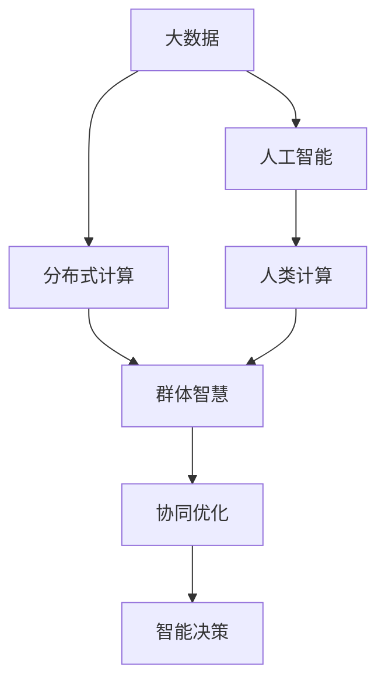

                 

# 群体智慧的力量：探索人类计算的潜力

> 关键词：群体智慧,计算复杂性,分布式计算,人类计算,大数据,人工智能

## 1. 背景介绍

### 1.1 问题由来

在信息时代，计算能力已不再是一个独立的技术话题，而是与人类社会的各个方面紧密相关。然而，随着数据量的爆炸式增长和计算任务的复杂性急剧提升，传统的中央集中计算模式已经难以应对这一挑战。如何更有效地利用人类智慧，整合多样化的计算资源，成为推动社会进步的关键问题。

### 1.2 问题核心关键点

群体智慧（Collective Intelligence, CI），即利用集体或群体的智慧来解决问题，是当前计算和人工智能研究的重要方向之一。其核心在于如何整合和利用分散在不同个体的智慧资源，通过智能算法和协同机制，实现更高效、更快速的计算和决策。群体智慧不仅涵盖了数据科学、分布式计算、机器学习等多个学科，也涉及哲学、社会学等多个领域的深层次问题。

## 2. 核心概念与联系

### 2.1 核心概念概述

群体智慧的概念包含了多个关键组成部分：

- **计算复杂性（Computational Complexity）**：指解决问题的计算所需的时间和资源，是衡量问题难度的重要指标。
- **分布式计算（Distributed Computing）**：指将计算任务分布在多个计算节点上，通过并行计算提升计算效率。
- **人类计算（Human Computation）**：指利用人的智力和技能来进行计算，特别是那些传统计算方法难以处理的问题。
- **大数据（Big Data）**：指海量的数据集合，需要通过计算技术进行高效分析与处理。
- **人工智能（Artificial Intelligence, AI）**：通过机器学习和深度学习等技术，模仿人类智能，提升计算的智能化水平。

这些概念之间存在着复杂的相互作用和依赖关系。例如，大数据为人工智能提供了计算的基础，而人工智能则使人类计算更加高效和智能化。分布式计算为处理大数据提供了技术手段，而群体智慧则将这一手段和人类计算相结合，形成了一个强大的协同计算系统。

### 2.2 核心概念原理和架构的 Mermaid 流程图



这个图展示了大数据、人工智能、人类计算和分布式计算之间的联系，以及它们如何共同构成群体智慧的架构。

## 3. 核心算法原理 & 具体操作步骤

### 3.1 算法原理概述

群体智慧的核心算法原理包括以下几个方面：

- **众包算法（Crowdsourcing Algorithms）**：通过将计算任务分解为更小的子任务，分配给不同的个体进行处理，并通过聚合结果实现最终的计算。
- **协同过滤算法（Collaborative Filtering Algorithms）**：利用群体中成员之间的互动和反馈，优化计算结果。
- **遗传算法（Genetic Algorithms）**：通过模拟生物进化的过程，对计算过程进行迭代优化。
- **机器学习（Machine Learning, ML）**：利用算法和模型对群体成员的行为进行预测和优化。

这些算法通过不同的方式和机制，将人类的智慧和计算能力结合起来，形成更高效的计算系统。

### 3.2 算法步骤详解

以众包算法为例，其基本步骤如下：

1. **任务分解**：将复杂的计算任务分解为多个子任务，每个子任务可以被个体独立完成。
2. **任务分配**：根据每个个体的能力和可用时间，分配合适的任务给其处理。
3. **任务执行**：个体执行分配到的任务，并将结果返回给系统。
4. **结果聚合**：系统对个体提交的结果进行合并和处理，形成最终计算结果。

通过这些步骤，群体智慧系统能够高效地利用个体的智慧资源，完成复杂的计算任务。

### 3.3 算法优缺点

群体智慧算法的优点包括：

- **高效性**：通过任务分解和任务分配，可以并行处理大量计算任务，提升计算效率。
- **灵活性**：算法可以适应不同的计算任务和个体能力，具有高度的灵活性。
- **可扩展性**：随着个体数量的增加，群体智慧系统的计算能力可以线性扩展。

但同时，这些算法也存在一些缺点：

- **质量控制**：个体提交的结果可能存在误差或偏差，需要通过合理的质量控制机制进行筛选。
- **协作难度**：个体之间需要有效的沟通和协作，才能确保任务的高效完成。
- **复杂性**：算法的设计和实现较为复杂，需要考虑多方面的因素。

### 3.4 算法应用领域

群体智慧算法在多个领域得到了广泛应用：

- **科学研究**：利用大规模人群的数据和智慧，进行数据分析和科学探索。
- **工业生产**：通过众包模式，优化生产流程和提高产品质量。
- **社会服务**：在公共服务、医疗、教育等领域，通过群体智慧系统提升服务质量。
- **金融市场**：利用群体智慧进行投资决策和风险管理。
- **环境监测**：通过大量人群的数据收集和分析，进行环境保护和灾害预测。

## 4. 数学模型和公式 & 详细讲解 & 举例说明

### 4.1 数学模型构建

以协同过滤算法为例，设群体中有 $N$ 个个体，每个个体对任务 $i$ 的评估结果为 $x_{ij}$，最终结果 $y$ 的计算公式为：

$$ y = \frac{\sum_{j=1}^N x_{ij}A_j}{\sum_{j=1}^N A_j} $$

其中 $A_j$ 为个体 $j$ 的权重系数，可以通过机器学习模型预测。

### 4.2 公式推导过程

对于权重系数 $A_j$ 的计算，可以使用基于偏最小二乘（PLS）或主成分分析（PCA）等算法，将个体对任务 $i$ 的评估结果投影到一个低维空间中，得到权重系数：

$$ A_j = \mathbf{W}_i\mathbf{X}_j $$

其中 $\mathbf{W}_i$ 和 $\mathbf{X}_j$ 分别为投影矩阵和个体 $j$ 的评估向量。

### 4.3 案例分析与讲解

以Netflix推荐系统为例，Netflix利用群体智慧进行个性化推荐，通过收集大量用户对电影和电视剧的评分数据，利用协同过滤算法计算用户间的相似度，生成推荐列表。Netflix的协同过滤算法采用了基于梯度的优化方法，通过不断迭代调整权重系数，提升推荐精度。

## 5. 项目实践：代码实例和详细解释说明

### 5.1 开发环境搭建

要实现群体智慧算法，首先需要安装Python及其相关库，如NumPy、Pandas、scikit-learn等。可以通过以下命令在Python 3.8环境下安装这些库：

```bash
pip install numpy pandas scikit-learn
```

### 5.2 源代码详细实现

以协同过滤算法为例，代码实现如下：

```python
import numpy as np
from sklearn.decomposition import PCA

# 假设每个个体对任务i的评估结果为x_ij
# 以及计算最终结果y的权重系数A_j
def collaborative_filtering(x, A):
    return np.dot(x, A)

# 计算权重系数A_j
def compute_weights(X, W):
    X_transformed = PCA(n_components=2).fit_transform(X)
    return np.dot(X_transformed, W)

# 假设X为个体对任务的评估结果，W为投影矩阵
X = np.array([[1, 2, 3], [2, 3, 4], [3, 4, 5]])
W = np.array([[0.1, 0.2, 0.3], [0.4, 0.5, 0.6], [0.7, 0.8, 0.9]])

# 计算A_j
A = compute_weights(X, W)

# 计算y
y = collaborative_filtering(X, A)
print(y)
```

### 5.3 代码解读与分析

以上代码实现了协同过滤算法的基本逻辑。首先定义了协同过滤函数 `collaborative_filtering`，用于计算最终结果 $y$。其次定义了计算权重系数 `compute_weights` 的函数，该函数使用PCA将评估结果投影到二维空间，并计算权重系数 $A_j$。最后，通过调用这两个函数，计算出最终结果 $y$。

## 6. 实际应用场景

### 6.1 科学研究

在科学研究中，群体智慧可以用于大规模数据集的处理和分析。例如，生物信息学领域可以通过分布式计算和众包算法，处理和分析海量的基因组数据，提取有价值的生物信息。

### 6.2 工业生产

在工业生产中，群体智慧可以用于优化生产流程和提高产品质量。例如，通过众包平台收集工人对生产过程的反馈，利用协同过滤算法，优化生产线的配置和调整，提升生产效率和产品质量。

### 6.3 社会服务

在社会服务中，群体智慧可以用于公共服务、医疗、教育等领域，提升服务质量和效率。例如，通过收集社区居民的反馈和建议，利用协同过滤算法，优化公共服务的提供和调整。

### 6.4 金融市场

在金融市场中，群体智慧可以用于投资决策和风险管理。例如，通过众包平台收集市场参与者的意见和预测，利用协同过滤算法，生成更精准的投资策略和风险评估。

### 6.5 环境监测

在环境监测中，群体智慧可以用于环境保护和灾害预测。例如，通过众包平台收集公众对环境问题的反馈和建议，利用协同过滤算法，分析环境变化趋势，预测和预警自然灾害。

## 7. 工具和资源推荐

### 7.1 学习资源推荐

- **《群体智慧：挑战与机遇》**：这是一本关于群体智慧的全面介绍，详细阐述了群体智慧的原理、技术和应用。
- **Coursera《机器学习》课程**：由斯坦福大学Andrew Ng教授讲授，涵盖机器学习的基础知识和高级技术，适合初学者和进阶学习者。
- **Kaggle**：这是一个数据科学竞赛平台，提供大量数据集和问题，可以通过参与竞赛学习和实践群体智慧算法。
- **GitHub**：这是一个代码托管平台，可以找到各种开源的群体智慧算法和实现，进行学习和借鉴。

### 7.2 开发工具推荐

- **Jupyter Notebook**：这是一个交互式编程环境，适合数据科学和机器学习任务开发。
- **AWS EC2**：这是一个弹性计算云服务，可以提供大规模的计算资源，支持分布式计算和协同过滤算法。
- **Google Colab**：这是一个基于云端的Jupyter Notebook服务，免费提供GPU资源，方便进行大数据计算。

### 7.3 相关论文推荐

- **《群体智慧：从社会到技术》**：这篇论文详细讨论了群体智慧的社会和伦理问题，对群体智慧的全面理解和应用具有重要意义。
- **《众包与协同过滤：提升社交媒体推荐系统的效果》**：这篇论文介绍了如何利用众包和协同过滤算法，提升社交媒体推荐系统的精度和效果。
- **《基于大数据的协同过滤算法优化》**：这篇论文讨论了如何在大数据环境下，优化协同过滤算法，提升计算效率和精度。

## 8. 总结：未来发展趋势与挑战

### 8.1 研究成果总结

群体智慧算法在多个领域展示了强大的计算能力和应用潜力，为解决复杂问题提供了新的思路和方法。然而，其应用还面临许多挑战，如数据质量控制、个体协作难度、算法复杂性等。

### 8.2 未来发展趋势

未来，群体智慧技术将在以下几个方面取得突破：

- **数据质量提升**：随着数据采集和处理技术的进步，数据质量将逐步提升，群体智慧算法将能够更高效地利用数据。
- **协同机制优化**：通过改进协同过滤算法和众包平台，提高个体之间的协作和沟通效率。
- **多模态融合**：将群体智慧算法与其他技术（如物联网、大数据、人工智能等）进行融合，形成更加综合和全面的计算系统。
- **伦理和社会影响**：研究群体智慧算法的伦理和社会影响，建立公正、透明的计算系统。

### 8.3 面临的挑战

尽管群体智慧技术取得了一定进展，但仍面临以下挑战：

- **数据隐私和安全**：如何保护参与个体的隐私，防止数据泄露和滥用。
- **算法公平性**：如何确保群体智慧算法不会产生偏见，避免歧视和不公。
- **技术复杂性**：群体智慧算法的设计和实现较为复杂，需要跨学科的合作和努力。
- **应用落地**：如何将群体智慧技术有效地应用于实际问题，提升社会和经济效益。

### 8.4 研究展望

未来，群体智慧技术的研究应聚焦于以下几个方面：

- **跨领域应用**：将群体智慧技术与更多领域结合，解决实际问题。
- **智能化优化**：利用人工智能技术，进一步提升群体智慧算法的性能和效率。
- **协同机制创新**：探索新的协同机制，提高个体之间的协作效率。
- **伦理和社会影响**：研究群体智慧算法的伦理和社会影响，建立公正、透明的计算系统。

## 9. 附录：常见问题与解答

**Q1: 什么是群体智慧？**

A: 群体智慧指的是通过群体或集体的智慧来解决复杂问题。它结合了计算、数据科学和人工智能等技术，利用多人的智慧和资源，提高计算效率和决策质量。

**Q2: 如何选择合适的协同过滤算法？**

A: 选择合适的协同过滤算法需要考虑数据类型、任务复杂度和个体数量等因素。常见的协同过滤算法包括基于梯度的算法和基于图论的算法。

**Q3: 群体智慧算法的优缺点有哪些？**

A: 群体智慧算法的优点包括高效性、灵活性和可扩展性。缺点包括数据质量控制、协作难度和算法复杂性。

**Q4: 群体智慧技术如何应用于科学研究？**

A: 群体智慧技术可以通过众包平台收集科学家的数据和反馈，利用协同过滤算法，处理和分析大规模数据集，提取有价值的科学信息。

**Q5: 如何保护群体智慧算法的隐私和安全？**

A: 保护隐私和安全的关键在于数据匿名化和加密技术。确保数据在传输和存储过程中不被窃取或滥用。

---

作者：禅与计算机程序设计艺术 / Zen and the Art of Computer Programming

