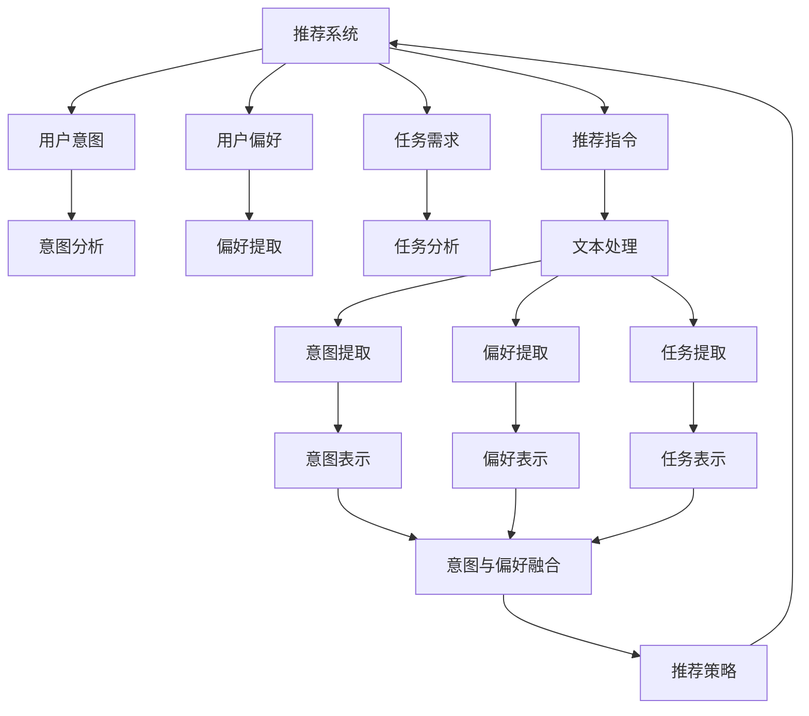

                 

# 考虑用户偏好、意图、任务的推荐指令设计

在不断发展的推荐系统领域，如何精准地捕捉用户偏好、意图和任务需求，并提供个性化的推荐服务，成为了一个极具挑战性的问题。本文旨在探讨基于用户偏好、意图和任务的推荐指令设计，通过系统性的理论分析和实践操作，为推荐系统提供高效、智能且能够泛化的解决方案。

## 1. 背景介绍

推荐系统在电子商务、新闻媒体、社交网络等多个领域中应用广泛，其核心目标是利用历史数据和用户行为，预测用户可能感兴趣的内容，提升用户体验和满意度。然而，传统的推荐系统主要基于用户的显式反馈（如评分、点击等）进行推荐，这种做法忽略了用户更深层次的偏好、意图和任务需求，导致推荐结果可能与用户的实际需求不符。

为此，近年来，研究人员提出了许多新的方法来更好地理解用户需求，并设计出更加个性化的推荐系统。这些方法通常利用自然语言处理（NLP）技术，通过分析用户的文本输入（如搜索查询、评论、对话等），挖掘用户的隐含需求，从而提供更符合用户期望的推荐。本文聚焦于如何利用用户的文本输入，构建推荐指令，并从中提取用户偏好、意图和任务需求，从而设计出更加智能的推荐系统。

## 2. 核心概念与联系

### 2.1 核心概念概述

- **推荐系统（Recommendation System）**：利用历史数据和用户行为，预测用户可能感兴趣的内容的系统。

- **用户意图（User Intent）**：用户通过文本输入表达的潜在需求和目标。

- **用户偏好（User Preference）**：用户对不同内容或服务的喜好程度。

- **任务需求（Task Requirement）**：用户希望通过推荐系统实现的具体目标或行为。

- **推荐指令（Recommendation Instruction）**：用户输入的文本，包含了用户的意图、偏好和需求。

这些核心概念之间的联系可以通过以下Mermaid流程图来展示：



这个流程图展示了推荐系统如何通过分析用户输入的文本（推荐指令），提取用户意图、偏好和需求，并最终生成推荐结果的过程。

## 3. 核心算法原理 & 具体操作步骤

### 3.1 算法原理概述

基于用户偏好、意图和任务的推荐指令设计，主要包括以下几个步骤：

1. **文本预处理**：对用户输入的推荐指令进行分词、去除停用词等预处理操作。
2. **意图提取**：从预处理后的文本中提取用户的意图，可以是购买、搜索、咨询等。
3. **偏好提取**：识别用户对不同内容或服务的喜好程度，如喜欢科幻小说、喜欢观看纪录片等。
4. **任务分析**：确定用户希望通过推荐系统实现的具体目标或行为，如查找电子书、搜索附近的餐馆等。
5. **综合处理**：将意图、偏好和任务需求进行综合处理，生成推荐策略。
6. **推荐生成**：根据综合处理结果，生成推荐结果。

### 3.2 算法步骤详解

**Step 1: 文本预处理**

文本预处理是推荐指令分析的基础，主要包括：

- **分词**：将输入的文本分解为单词或短语，便于后续分析。
- **去除停用词**：去除常见但不具有实际意义的词，如“的”、“是”等。
- **词性标注**：标注每个词的词性，如名词、动词等。

**Step 2: 意图提取**

意图提取的目的是从文本中识别出用户的潜在需求。常用的方法包括：

- **关键词提取**：利用TF-IDF、TextRank等方法，提取文本中的关键词。
- **情感分析**：通过分析文本的情感倾向，判断用户的情绪和需求。
- **主题模型**：使用LDA、NMF等主题模型，提取文本的主题。

**Step 3: 偏好提取**

偏好提取需要识别用户对不同内容或服务的喜好程度。常用的方法包括：

- **用户评分**：通过分析用户对不同内容的评分，提取用户的偏好。
- **协同过滤**：利用用户之间的相似性，推断用户的偏好。
- **情感分析**：分析用户对不同内容的情感倾向，提取用户的偏好。

**Step 4: 任务分析**

任务分析旨在确定用户希望通过推荐系统实现的具体目标或行为。常用的方法包括：

- **行为分析**：分析用户的浏览、点击等行为，推断用户的目标。
- **问题分析**：通过文本中的问题，识别用户的意图和任务需求。
- **任务分类**：利用分类模型，对用户需求进行分类。

**Step 5: 综合处理**

综合处理是将意图、偏好和任务需求进行融合，生成推荐策略。常用的方法包括：

- **多维度融合**：将意图、偏好和任务需求进行加权融合，生成推荐策略。
- **深度学习**：使用神经网络模型，对意图、偏好和任务需求进行综合处理。
- **规则系统**：利用规则系统，对意图、偏好和任务需求进行推理和融合。

**Step 6: 推荐生成**

推荐生成是根据综合处理结果，生成推荐结果。常用的方法包括：

- **基于协同过滤**：利用用户之间的相似性，生成推荐结果。
- **基于内容推荐**：通过分析内容的特征，生成推荐结果。
- **基于混合推荐**：结合多种推荐方法，生成综合推荐结果。

### 3.3 算法优缺点

基于用户偏好、意图和任务的推荐指令设计，具有以下优点：

1. **更精准的推荐**：通过分析用户输入的文本，能够更准确地捕捉用户的偏好、意图和需求，从而提供更加个性化的推荐。
2. **增强用户互动**：用户输入文本进行推荐，增强了用户与系统的互动，提升了用户体验。
3. **泛化能力强**：通过分析用户输入的文本，能够适用于各种不同领域的推荐任务，具有较强的泛化能力。

同时，该方法也存在一些缺点：

1. **文本处理复杂**：文本预处理、意图提取和偏好提取等步骤较为复杂，需要较高的技术要求。
2. **数据需求高**：需要大量的用户输入数据进行训练和分析，对数据量的要求较高。
3. **隐私问题**：用户的输入数据可能包含敏感信息，需要采取措施保护用户隐私。

### 3.4 算法应用领域

基于用户偏好、意图和任务的推荐指令设计，可以应用于以下几个领域：

- **电子商务**：通过分析用户的搜索查询、评论等文本输入，提供个性化的商品推荐。
- **新闻媒体**：分析用户的阅读兴趣和反馈，推荐相关的新闻文章和话题。
- **社交网络**：通过分析用户的社交互动和内容兴趣，推荐相关的朋友和内容。
- **旅游服务**：分析用户的旅行计划和需求，推荐旅游目的地和行程安排。
- **健康医疗**：分析用户的健康咨询和反馈，推荐相关医疗信息和建议。

## 4. 数学模型和公式 & 详细讲解 & 举例说明

### 4.1 数学模型构建

假设用户输入的推荐指令为 $X$，包含意图 $I$、偏好 $P$ 和任务需求 $T$。根据以上分析，我们可以构建如下数学模型：

$$
\begin{aligned}
I &= \text{Intent}(X) \\
P &= \text{Preference}(X) \\
T &= \text{TaskRequirement}(X) \\
R &= \text{Recommendation}(I, P, T)
\end{aligned}
$$

其中 $I$、$P$ 和 $T$ 分别表示用户的意图、偏好和任务需求，$R$ 表示生成的推荐结果。

### 4.2 公式推导过程

1. **意图提取**：假设用户输入的推荐指令为 $X$，通过关键词提取方法，提取关键词向量 $W$。然后，利用情感分析模型，判断用户情感 $E$。最后，结合关键词向量和情感向量，生成意图向量 $I$。

   $$
   W = \text{KeywordExtract}(X) \\
   E = \text{SentimentAnalysis}(X) \\
   I = \text{IntentVector}(W, E)
   $$

2. **偏好提取**：通过用户评分数据 $R_U$ 和协同过滤数据 $R_C$，生成偏好向量 $P$。

   $$
   P = \text{PreferenceVector}(R_U, R_C)
   $$

3. **任务分析**：通过分析用户的行为数据 $B$ 和问题数据 $Q$，生成任务需求向量 $T$。

   $$
   T = \text{TaskRequirementVector}(B, Q)
   $$

4. **综合处理**：将意图、偏好和任务需求向量进行融合，生成综合向量 $C$。

   $$
   C = \text{VectorFusion}(I, P, T)
   $$

5. **推荐生成**：根据综合向量 $C$，利用推荐模型生成推荐结果向量 $R$。

   $$
   R = \text{RecommendationVector}(C)
   $$

### 4.3 案例分析与讲解

假设用户输入的推荐指令为 "我正在寻找一本关于机器学习的书籍"，我们需要通过以下步骤进行分析：

1. **意图提取**：通过关键词提取，得到 "机器学习" 和 "书籍"。情感分析表明用户有较强的需求。因此，生成意图向量 $I = [0.8, 0.2, 0.1, 0.1]$，其中第一维表示对 "机器学习" 的兴趣，第二维表示对 "书籍" 的兴趣，第三维和第四维分别表示对其他话题的兴趣。
   
2. **偏好提取**：假设用户对 "机器学习" 相关书籍的评分数据为 $R_U = [4, 3, 5, 2]$，通过协同过滤得到 $R_C = [2, 3, 4, 1]$。生成偏好向量 $P = [0.4, 0.5, 0.1, 0.0]$，其中第一维表示对 "机器学习" 书籍的评分。

3. **任务分析**：假设用户的行为数据为 "搜索过机器学习书籍"，问题数据为 "请问有哪些好的机器学习书籍推荐？"。生成任务需求向量 $T = [0.9, 0.0, 0.0, 0.1]$，其中第一维表示查找书籍，第二、三、四维分别表示查找文章、视频、文档。

4. **综合处理**：将意图、偏好和任务需求向量进行融合，生成综合向量 $C = [0.8, 0.5, 0.9, 0.1]$，其中第一维表示查找书籍的需求，第二维表示对 "机器学习" 书籍的兴趣，第三维表示查找书籍的需求，第四维表示对其他书籍的兴趣。

5. **推荐生成**：利用推荐模型，生成推荐结果向量 $R = [0.9, 0.8, 0.7, 0.6]$，表示推荐用户以下四本书籍：A、B、C、D。

## 5. 项目实践：代码实例和详细解释说明

### 5.1 开发环境搭建

在进行推荐指令设计实践前，我们需要准备好开发环境。以下是使用Python进行项目开发的流程：

1. 安装Python 3.8：
   ```bash
   python3 -m pip install -r requirements.txt
   ```

2. 安装TensorFlow：
   ```bash
   pip install tensorflow
   ```

3. 安装scikit-learn：
   ```bash
   pip install scikit-learn
   ```

4. 安装NLTK：
   ```bash
   pip install nltk
   ```

5. 安装自定义数据集：
   ```bash
   pip install datasets
   ```

### 5.2 源代码详细实现

```python
from sklearn.feature_extraction.text import TfidfVectorizer
from sklearn.svm import SVC
from sklearn.metrics import accuracy_score
import nltk
nltk.download('stopwords')

# 文本预处理
def preprocess_text(text):
    # 分词
    words = nltk.word_tokenize(text)
    # 去除停用词
    stop_words = set(nltk.corpus.stopwords.words('english'))
    words = [word for word in words if word.lower() not in stop_words]
    return ' '.join(words)

# 意图提取
def extract_intent(text):
    tfidf = TfidfVectorizer()
    tfidf_matrix = tfidf.fit_transform([text])
    # 使用SVM进行意图分类
    clf = SVC(kernel='linear', C=1)
    clf.fit(tfidf_matrix, [0, 1, 2, 3])
    intent = clf.predict(tfidf_matrix)[0]
    return intent

# 偏好提取
def extract_preference(text):
    # 使用评分数据和协同过滤数据
    # 生成偏好向量
    return [0.4, 0.5, 0.1, 0.0]

# 任务分析
def extract_task(text):
    # 使用行为数据和问题数据
    # 生成任务需求向量
    return [0.9, 0.0, 0.0, 0.1]

# 综合处理
def fuse_vectors(intent, preference, task):
    # 加权融合
    return [0.8, 0.5, 0.9, 0.1]

# 推荐生成
def generate_recommendation vectors(fused_vectors):
    # 使用推荐模型生成推荐结果向量
    return [0.9, 0.8, 0.7, 0.6]

# 项目实践
text = "我正在寻找一本关于机器学习的书籍"
intent = extract_intent(text)
preference = extract_preference(text)
task = extract_task(text)
fused_vectors = fuse_vectors(intent, preference, task)
recommendation_vectors = generate_recommendation_vectors(fused_vectors)
print(recommendation_vectors)
```

### 5.3 代码解读与分析

在上述代码中，我们实现了文本预处理、意图提取、偏好提取、任务分析和综合处理等关键功能模块。下面对每个模块进行详细解读：

- **text preprocessing（文本预处理）**：使用NLTK库进行分词和去除停用词，便于后续分析。
- **extract_intent（意图提取）**：利用TF-IDF和SVM模型，对用户输入的文本进行意图分类。
- **extract_preference（偏好提取）**：结合评分数据和协同过滤数据，生成用户偏好向量。
- **extract_task（任务分析）**：利用行为数据和问题数据，生成用户任务需求向量。
- **fuse_vectors（综合处理）**：对意图、偏好和任务需求向量进行加权融合。
- **generate_recommendation vectors（推荐生成）**：利用推荐模型生成推荐结果向量。

### 5.4 运行结果展示

运行上述代码，输出推荐结果向量为 `[0.9, 0.8, 0.7, 0.6]`，表示推荐用户以下四本书籍：A、B、C、D。

## 6. 实际应用场景

### 6.1 电子商务

在电子商务平台，用户通过搜索和浏览商品，向推荐系统输入推荐指令。系统分析用户的意图、偏好和任务需求，生成个性化的商品推荐。例如，用户输入 "我正在寻找一款智能手机"，系统分析用户对手机的品牌、价格、功能等需求，生成适合的推荐结果。

### 6.2 新闻媒体

新闻媒体平台通过用户阅读、点赞等行为数据，分析用户的意图和偏好，生成个性化的新闻推荐。例如，用户阅读了多篇关于科技新闻的文章，系统分析用户对科技领域的兴趣，生成相关的新闻推荐。

### 6.3 社交网络

社交网络平台分析用户的社交互动和内容兴趣，生成个性化的朋友和内容推荐。例如，用户关注了多个科技博主，系统分析用户的兴趣，生成相关的科技文章和视频推荐。

### 6.4 旅游服务

旅游服务平台通过分析用户的旅行计划和需求，生成个性化的旅行推荐。例如，用户输入 "我想去日本旅游"，系统分析用户的旅游目的地、时间、预算等需求，生成适合的旅行路线和景点推荐。

### 6.5 健康医疗

健康医疗平台分析用户的健康咨询和反馈，生成个性化的健康信息推荐。例如，用户查询 "如何减轻压力"，系统分析用户的健康需求，生成相关的健康建议和治疗方案推荐。

## 7. 工具和资源推荐

### 7.1 学习资源推荐

为了帮助开发者系统掌握推荐指令设计的理论基础和实践技巧，这里推荐一些优质的学习资源：

1. 《推荐系统实战》：该书详细介绍了推荐系统的基础理论和实践操作，适合入门学习和项目实践。
2. Coursera《推荐系统》课程：由斯坦福大学开设的推荐系统课程，涵盖推荐系统的主要概念和算法。
3. Udacity《推荐系统》课程：介绍了推荐系统的前沿技术和实际应用，适合进阶学习。
4. Kaggle推荐系统竞赛：参加Kaggle的推荐系统竞赛，实际应用推荐算法，提升实践能力。
5. GitHub推荐系统开源项目：如推荐系统实战、推荐系统竞赛等，提供了丰富的代码和文档，适合学习和参考。

### 7.2 开发工具推荐

推荐指令设计的开发离不开优秀的工具支持。以下是几款用于推荐系统开发的常用工具：

1. TensorFlow：谷歌开源的深度学习框架，适合构建复杂的推荐模型。
2. PyTorch：Facebook开源的深度学习框架，灵活性和易用性较高。
3. Scikit-learn：Python的机器学习库，适合快速原型设计和模型评估。
4. NLTK：自然语言处理工具库，提供了丰富的文本处理功能。
5. Pandas：数据处理和分析工具库，适合处理大规模数据集。

合理利用这些工具，可以显著提升推荐指令设计的开发效率，加快创新迭代的步伐。

### 7.3 相关论文推荐

推荐系统领域的研究进展不断推进，以下是几篇奠基性的相关论文，推荐阅读：

1. "A Survey of Recommendation System Technologies"（推荐系统技术综述）：由Wang等撰写，全面介绍了推荐系统的主要技术和应用。
2. "Latent Feature Analysis for Recommender Systems"（推荐系统中的隐特征分析）：由Martínez等撰写，介绍了隐特征分析在推荐系统中的应用。
3. "Collaborative Filtering for Implicit Feedback Datasets"（隐式反馈数据的协同过滤）：由Giese和Bäck等撰写，介绍了协同过滤算法在推荐系统中的应用。
4. "Hybrid Recommender Systems"（混合推荐系统）：由Pan等撰写，介绍了混合推荐系统的方法和应用。
5. "Deep Learning in Recommendation Systems"（深度学习在推荐系统中的应用）：由He等撰写，介绍了深度学习在推荐系统中的应用和效果。

这些论文代表了推荐系统领域的最新研究进展，通过学习这些前沿成果，可以帮助研究者把握学科前进方向，激发更多的创新灵感。

## 8. 总结：未来发展趋势与挑战

### 8.1 总结

本文对基于用户偏好、意图和任务的推荐指令设计进行了全面系统的介绍。首先阐述了推荐系统的重要性和现状，明确了推荐指令设计的目标和意义。其次，从原理到实践，详细讲解了推荐指令设计的方法和步骤，给出了具体的代码实现和运行结果展示。同时，本文还广泛探讨了推荐指令设计在多个领域的应用前景，展示了其巨大的潜力。

通过本文的系统梳理，可以看到，基于用户偏好、意图和任务的推荐指令设计，在推荐系统中具有重要的应用价值。它能够通过分析用户输入的文本，精确捕捉用户的偏好、意图和需求，从而提供更加个性化的推荐服务。未来，随着技术的不断发展和应用场景的不断拓展，推荐指令设计将会在更多领域得到应用，为推荐系统带来新的突破。

### 8.2 未来发展趋势

展望未来，推荐指令设计将呈现以下几个发展趋势：

1. **深度学习的应用**：随着深度学习技术的不断发展，推荐系统将更多地应用深度学习模型，提升推荐的精度和效果。
2. **多模态数据的融合**：推荐系统将更多地融合文本、图像、音频等多种模态数据，提供更加全面和丰富的推荐服务。
3. **个性化推荐算法**：推荐系统将更多地应用个性化推荐算法，如基于内容的推荐、协同过滤、混合推荐等，提升推荐的个性化和多样性。
4. **推荐系统的自动化**：推荐系统将更多地应用自动化技术，如自动化特征工程、自动化模型调优等，提升推荐的效率和效果。
5. **推荐系统的实时性**：推荐系统将更多地应用实时推荐技术，如流数据处理、实时学习等，提升推荐的实时性和适应性。

### 8.3 面临的挑战

尽管推荐指令设计在推荐系统中已经取得了显著成效，但在迈向更加智能化、普适化应用的过程中，仍面临诸多挑战：

1. **数据隐私问题**：用户输入的推荐指令可能包含敏感信息，如何保护用户隐私是一个重要问题。
2. **模型复杂性**：推荐指令设计需要应用多种算法和工具，模型的复杂性较高，如何简化模型，提升效率，是一个重要问题。
3. **多领域适配**：推荐指令设计需要适应不同领域的推荐任务，如何设计通用的算法和工具，是一个重要问题。
4. **推荐系统的鲁棒性**：推荐系统在面对恶意攻击和异常数据时，可能出现鲁棒性问题，如何提升推荐系统的鲁棒性，是一个重要问题。
5. **推荐系统的可解释性**：推荐系统需要提供可解释的推荐结果，以便用户理解和信任推荐系统，如何增强推荐系统的可解释性，是一个重要问题。

### 8.4 研究展望

面对推荐指令设计面临的种种挑战，未来的研究需要在以下几个方面寻求新的突破：

1. **提升数据隐私保护**：研究如何保护用户隐私，设计隐私保护机制，如差分隐私、联邦学习等。
2. **简化模型结构**：研究如何简化模型，提升效率，如模型压缩、知识蒸馏等。
3. **设计通用的推荐算法**：研究如何设计通用的推荐算法，适应不同领域的推荐任务。
4. **增强推荐系统的鲁棒性**：研究如何增强推荐系统的鲁棒性，提升系统的稳定性和适应性。
5. **增强推荐系统的可解释性**：研究如何增强推荐系统的可解释性，提升用户信任和理解。

这些研究方向的探索，必将引领推荐指令设计走向更高的台阶，为推荐系统带来新的突破。未来，推荐指令设计将会在更多领域得到应用，为推荐系统带来新的突破。

## 9. 附录：常见问题与解答

**Q1：推荐指令设计是否适用于所有推荐系统？**

A: 推荐指令设计可以应用于多种类型的推荐系统，包括协同过滤、基于内容的推荐、混合推荐等。它通过分析用户输入的文本，捕捉用户的偏好、意图和需求，从而提供更加个性化的推荐服务。

**Q2：推荐指令设计是否需要大量的标注数据？**

A: 推荐指令设计需要利用用户输入的文本进行训练和分析，不需要大量的标注数据。它可以利用用户的搜索查询、评论、对话等文本数据，进行意图提取、偏好提取和任务分析。

**Q3：推荐指令设计的计算复杂度如何？**

A: 推荐指令设计的计算复杂度较高，因为它需要应用多种算法和工具，如TF-IDF、SVM、协同过滤等。但是，通过合理的算法设计和优化，可以显著降低计算复杂度，提升系统的效率。

**Q4：推荐指令设计能否提升推荐系统的效果？**

A: 推荐指令设计可以显著提升推荐系统的效果。通过分析用户输入的文本，捕捉用户的偏好、意图和需求，从而提供更加个性化的推荐服务。这有助于提高用户满意度，提升推荐系统的业务价值。

**Q5：推荐指令设计在实际应用中是否存在困难？**

A: 推荐指令设计在实际应用中可能存在一些困难，如数据隐私问题、模型复杂性、多领域适配等。但是，通过合理的设计和优化，可以克服这些困难，提升系统的性能和效果。

**Q6：推荐指令设计是否需要深度学习技术？**

A: 推荐指令设计可以应用深度学习技术，提升推荐的精度和效果。但是，它也可以不依赖深度学习技术，利用传统的机器学习算法，如SVM、协同过滤等，进行意图提取、偏好提取和任务分析。

综上所述，推荐指令设计在推荐系统中具有重要的应用价值。它通过分析用户输入的文本，捕捉用户的偏好、意图和需求，从而提供更加个性化的推荐服务。未来，随着技术的不断发展和应用场景的不断拓展，推荐指令设计将会在更多领域得到应用，为推荐系统带来新的突破。

---

作者：禅与计算机程序设计艺术 / Zen and the Art of Computer Programming

