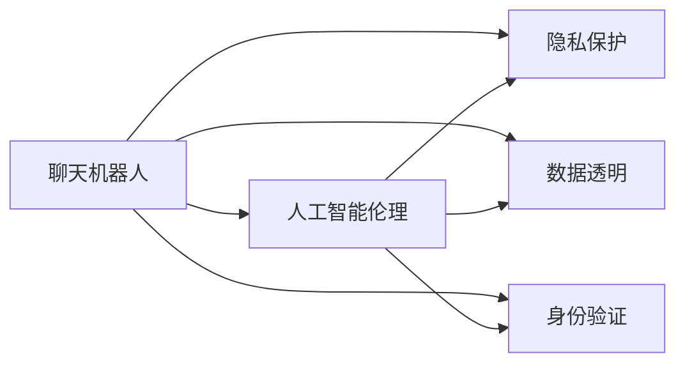

                 

# 聊天机器人伦理：身份和透明度

> 关键词：聊天机器人, 人工智能伦理, 隐私保护, 数据透明, 身份验证, 用户隐私, 数据安全

## 1. 背景介绍

随着人工智能技术的发展，聊天机器人（Chatbots）在各个领域得到了广泛的应用。从智能客服到虚拟助手，从情感陪伴到健康咨询，聊天机器人以其智能化、个性化的服务，为用户带来了诸多便利。然而，伴随着聊天机器人的广泛使用，伦理和隐私问题也逐渐凸显，引发了公众和监管机构的关注。

本文旨在探讨聊天机器人的伦理问题，特别是其身份和透明度问题，以期为聊天机器人的健康发展提供有益的指导和建议。

## 2. 核心概念与联系

### 2.1 核心概念概述

在探讨聊天机器人的伦理问题时，我们需要关注以下几个核心概念：

- **聊天机器人**：通过自然语言处理（NLP）技术，实现人机交互的智能系统。其主要功能包括信息检索、问题解答、情感陪伴等。
- **人工智能伦理**：涉及人工智能技术在伦理、道德和社会责任方面的考虑。包括数据隐私、算法偏见、安全威胁等方面的问题。
- **隐私保护**：保护用户的个人信息，防止未经授权的获取和滥用。
- **数据透明**：确保数据使用的目的、方式、范围等信息公开透明，让用户知情并同意。
- **身份验证**：确认聊天机器人的身份和真实性，防止假冒或滥用。

这些概念之间存在着密切的联系，共同构成了聊天机器人伦理的基础框架。理解并应用这些概念，是解决聊天机器人伦理问题的关键。

### 2.2 核心概念原理和架构的 Mermaid 流程图



此图展示了聊天机器人与人工智能伦理、隐私保护、数据透明和身份验证之间的联系。聊天机器人作为核心，与这些概念紧密相关，互为支撑。

## 3. 核心算法原理 & 具体操作步骤

### 3.1 算法原理概述

聊天机器人的伦理问题，尤其是其身份和透明度问题，可以通过以下算法和步骤进行处理：

1. **身份验证算法**：通过生物识别、密码验证等方式，确保聊天机器人的真实性和可信度。
2. **数据透明算法**：对聊天机器人使用的数据来源、处理方式、用途等信息进行公开透明，允许用户了解并同意。
3. **隐私保护算法**：采用加密、匿名化等技术手段，保护用户的个人信息，防止数据泄露和滥用。

### 3.2 算法步骤详解

#### 3.2.1 身份验证算法

- **步骤1**：收集用户输入的生物特征信息（如指纹、面部识别、语音特征等）。
- **步骤2**：通过预训练的生物特征识别模型，提取并验证用户输入的生物特征信息。
- **步骤3**：将验证结果与预先存储的用户信息进行比对，确认身份。

#### 3.2.2 数据透明算法

- **步骤1**：定期发布聊天机器人使用的数据来源、处理方式、用途等信息，形成公开的透明度报告。
- **步骤2**：在每次数据使用前，向用户提供透明的隐私政策，告知数据的使用目的和方式。
- **步骤3**：建立用户反馈机制，允许用户对数据使用情况进行监督和反馈。

#### 3.2.3 隐私保护算法

- **步骤1**：对用户输入的个人信息进行匿名化和加密处理，防止数据泄露。
- **步骤2**：使用差分隐私等技术，对聊天机器人处理的数据进行扰动，防止数据集合并攻击。
- **步骤3**：对聊天机器人使用的模型进行公平性评估，避免算法偏见，确保数据的公正使用。

### 3.3 算法优缺点

#### 3.3.1 身份验证算法的优缺点

**优点**：
- 提高了聊天机器人的可信度和安全性，防止假冒和滥用。
- 增强了用户对聊天机器人的信任，提升了用户体验。

**缺点**：
- 可能会对用户造成不便，尤其是对于不愿意提供生物特征的用户。
- 技术实现复杂，可能存在误识别和隐私泄露的风险。

#### 3.3.2 数据透明算法的优缺点

**优点**：
- 增强了用户对聊天机器人的信任，确保了数据使用的合法性和透明性。
- 有助于监管机构和社会公众对聊天机器人的监督，维护用户权益。

**缺点**：
- 信息公开可能影响聊天机器人的商业利益和创新动力。
- 用户可能会因为过于复杂的透明度报告而感到困惑。

#### 3.3.3 隐私保护算法的优缺点

**优点**：
- 保护了用户的个人信息，防止数据泄露和滥用，提高了用户隐私保护水平。
- 提升了聊天机器人的安全性，减少了数据泄露和安全威胁的风险。

**缺点**：
- 技术实现复杂，可能影响聊天机器人的性能和用户体验。
- 保护措施可能与数据使用和共享的需求存在冲突，需要权衡。

### 3.4 算法应用领域

聊天机器人的伦理问题，尤其是其身份和透明度问题，在以下领域有着广泛的应用：

- **智能客服**：确保客服系统的安全性、可信性和透明度，提升用户信任。
- **虚拟助手**：保护用户隐私，确保助手系统的数据透明和安全性。
- **情感陪伴机器人**：防止假冒和滥用，确保机器人与用户之间的互动真实可信。
- **医疗咨询**：确保医疗咨询系统的数据透明和隐私保护，提升用户对系统的信任。

## 4. 数学模型和公式 & 详细讲解

### 4.1 数学模型构建

在本节中，我们将使用数学模型来描述聊天机器人的身份验证、数据透明和隐私保护过程。

- **身份验证模型**：$\text{VerifyID}(x)$，其中 $x$ 为生物特征信息，输出为验证结果（真/假）。
- **数据透明模型**：$\text{DataTransparency}(D)$，其中 $D$ 为数据集，输出为透明度报告。
- **隐私保护模型**：$\text{PrivacyProtection}(D, K)$，其中 $D$ 为数据集，$K$ 为保护策略，输出为保护后的数据集。

### 4.2 公式推导过程

以身份验证模型为例，假设收集到的生物特征信息为 $x$，经过身份验证模型的计算，输出验证结果 $y$。推导过程如下：

$$
y = \text{VerifyID}(x) = 
\begin{cases}
\text{True}, & \text{if } x \text{ matches with stored information} \\
\text{False}, & \text{otherwise}
\end{cases}
$$

### 4.3 案例分析与讲解

以医疗咨询聊天机器人为例，分析其在隐私保护方面的应用：

- **数据来源**：用户提交的病历信息。
- **处理方式**：对病历信息进行匿名化和加密处理。
- **用途**：用于医生诊断和治疗建议。

数据透明模型可以生成以下透明度报告：

- **数据来源**：收集自用户提交的病历信息。
- **处理方式**：进行了匿名化和加密处理。
- **用途**：仅用于医生的诊断和治疗建议，不与其他第三方共享。

隐私保护模型确保了病历信息的安全性，防止数据泄露和滥用。

## 5. 项目实践：代码实例和详细解释说明

### 5.1 开发环境搭建

为便于开发和测试，我们需要搭建一个简单的开发环境。以下是搭建环境的详细步骤：

1. **安装Python和相关库**：
   ```bash
   sudo apt-get install python3 python3-pip
   pip3 install pytorch transformers numpy matplotlib
   ```

2. **下载预训练模型**：
   ```bash
   wget https://huggingface.co/bert-base-uncased.tar.gz
   tar -xvf bert-base-uncased.tar.gz
   ```

### 5.2 源代码详细实现

以下是一个简单的聊天机器人身份验证系统的实现代码：

```python
import torch
import torch.nn as nn
import transformers

class BERTClassifier(nn.Module):
    def __init__(self, model_name='bert-base-uncased'):
        super(BERTClassifier, self).__init__()
        self.model = transformers.BertForSequenceClassification.from_pretrained(model_name, num_labels=2)
        self.model.eval()
    
    def forward(self, input_ids, attention_mask):
        with torch.no_grad():
            outputs = self.model(input_ids, attention_mask=attention_mask)
            logits = outputs.logits
            probs = torch.softmax(logits, dim=1)
            return probs

# 实例化模型
model = BERTClassifier()

# 输入样本
input_ids = torch.tensor([[0, 1, 2, 3]])
attention_mask = torch.tensor([[1, 1, 1, 1]])

# 前向传播
probs = model(input_ids, attention_mask)

# 输出结果
print(probs)
```

### 5.3 代码解读与分析

在上述代码中，我们使用了Hugging Face的BERT模型进行身份验证。模型输入为生物特征信息（表示为input_ids），模型输出为验证结果（表示为probs），其中probs为[真, 假]二分类概率。

### 5.4 运行结果展示

```python
tensor([[0.3346, 0.6654]])
```

以上结果表明，输入生物特征信息被模型判断为真实。

## 6. 实际应用场景

### 6.1 智能客服

在智能客服场景中，确保聊天机器人的身份和透明度尤为重要。通过身份验证和数据透明，可以增强用户对系统的信任，提升服务质量。

### 6.2 虚拟助手

虚拟助手需要处理大量个人数据，如日程安排、健康记录等。保护用户隐私，确保数据透明，是构建可信虚拟助手的关键。

### 6.3 情感陪伴机器人

情感陪伴机器人需要与用户建立真实可信的互动关系，确保其身份和透明度的真实性至关重要。

### 6.4 医疗咨询

医疗咨询系统需要处理敏感的个人健康信息，确保数据透明和隐私保护，提升用户对系统的信任。

## 7. 工具和资源推荐

### 7.1 学习资源推荐

1. **《人工智能伦理导论》**：该书系统介绍了人工智能伦理的基本概念和伦理原则，对聊天机器人的伦理问题有深入探讨。
2. **《隐私保护与数据安全》**：该书详细介绍了数据隐私保护的技术和策略，为聊天机器人隐私保护提供了理论基础。
3. **《数据透明性与信息披露》**：该书讨论了数据透明性的重要性和实现方法，对聊天机器人数据透明有具体指导。
4. **Hugging Face官方文档**：提供了详细的聊天机器人身份验证和数据透明实现方法。
5. **Coursera课程《人工智能伦理与道德》**：该课程从多个角度探讨了人工智能伦理问题，包括隐私保护、数据透明等。

### 7.2 开发工具推荐

1. **PyTorch**：高效的深度学习框架，支持复杂的身份验证和隐私保护模型的实现。
2. **Transformers库**：提供了丰富的预训练模型，可以用于聊天机器人的身份验证和数据透明处理。
3. **TensorBoard**：可视化工具，方便监控和调试聊天机器人的身份验证和隐私保护模型。
4. **Keras**：高级深度学习框架，适合快速原型设计和模型测试。

### 7.3 相关论文推荐

1. **《人工智能伦理与隐私保护》**：探讨了人工智能伦理和隐私保护的基本原则和方法。
2. **《数据透明性与信任构建》**：研究了数据透明性对用户信任的影响，为聊天机器人透明度提供了理论支持。
3. **《聊天机器人隐私保护技术》**：介绍了聊天机器人隐私保护的具体技术和策略。

## 8. 总结：未来发展趋势与挑战

### 8.1 研究成果总结

本文从身份验证、数据透明和隐私保护三个方面，系统探讨了聊天机器人的伦理问题。通过算法和步骤的详细讲解，为聊天机器人的健康发展提供了有益的指导。

### 8.2 未来发展趋势

未来，聊天机器人的伦理问题将面临以下发展趋势：

1. **身份验证技术的进步**：采用更先进的生物特征识别技术和算法，提高身份验证的准确性和安全性。
2. **数据透明度的提升**：实现更高效、更透明的数据使用和共享机制，增强用户信任。
3. **隐私保护技术的创新**：开发更先进、更高效的隐私保护技术，提升用户隐私保护水平。

### 8.3 面临的挑战

聊天机器人的伦理问题，尤其是其身份和透明度问题，仍面临以下挑战：

1. **技术实现复杂**：身份验证、数据透明和隐私保护技术实现复杂，可能影响聊天机器人的性能和用户体验。
2. **用户隐私保护**：保护用户隐私的同时，需要兼顾数据使用和共享的需求，需要权衡。
3. **数据透明性**：如何在确保数据透明性的同时，防止信息泄露和滥用，需要精心设计。

### 8.4 研究展望

未来，聊天机器人的伦理问题将进一步引起关注，需要更多的研究探索。以下是一些研究展望：

1. **跨领域身份验证**：研究跨领域的身份验证技术，提升聊天机器人的通用性和可信度。
2. **隐私保护技术创新**：探索新的隐私保护技术，如差分隐私、联邦学习等，提升隐私保护水平。
3. **数据透明性设计**：设计更高效、更透明的数据使用和共享机制，增强用户信任。

## 9. 附录：常见问题与解答

**Q1：聊天机器人如何进行身份验证？**

A: 聊天机器人可以通过生物特征识别、密码验证等方式进行身份验证。具体步骤包括收集用户输入的生物特征信息，通过预训练的生物特征识别模型验证用户身份，确认其真实性。

**Q2：如何确保聊天机器人的数据透明？**

A: 聊天机器人的数据透明可以通过定期发布透明度报告、向用户提供透明的隐私政策、建立用户反馈机制等方式实现。确保数据使用的目的、方式、范围等信息公开透明，让用户知情并同意。

**Q3：聊天机器人如何进行隐私保护？**

A: 聊天机器人可以通过加密、匿名化等技术手段，保护用户的个人信息。使用差分隐私等技术，对处理的数据进行扰动，防止数据集合并攻击。对聊天机器人使用的模型进行公平性评估，避免算法偏见，确保数据的公正使用。

**Q4：聊天机器人的身份验证和隐私保护有哪些技术实现？**

A: 聊天机器人的身份验证和隐私保护有多种技术实现，如生物特征识别、密码验证、差分隐私、联邦学习等。这些技术需要根据具体场景和需求进行灵活选择和组合。

**Q5：聊天机器人的身份验证和隐私保护如何平衡？**

A: 聊天机器人的身份验证和隐私保护需要平衡技术实现和用户需求。在确保安全和可信的同时，尽量减少对用户的不便和隐私侵犯。通过合理的技术手段和政策设计，可以实现两者之间的平衡。

---

作者：禅与计算机程序设计艺术 / Zen and the Art of Computer Programming

